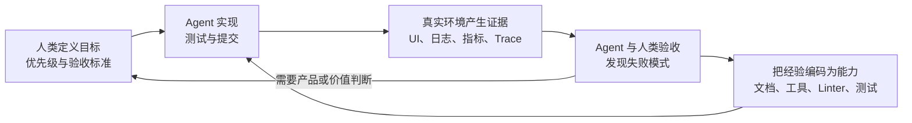
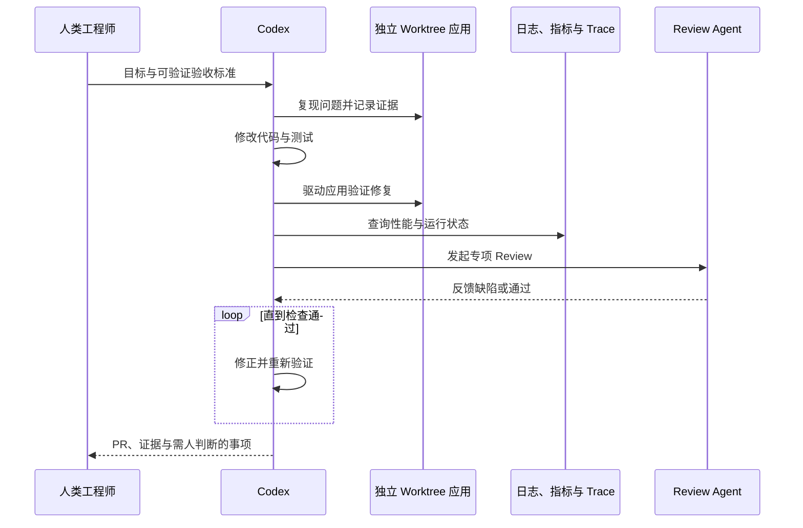
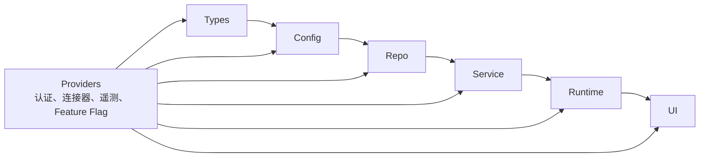
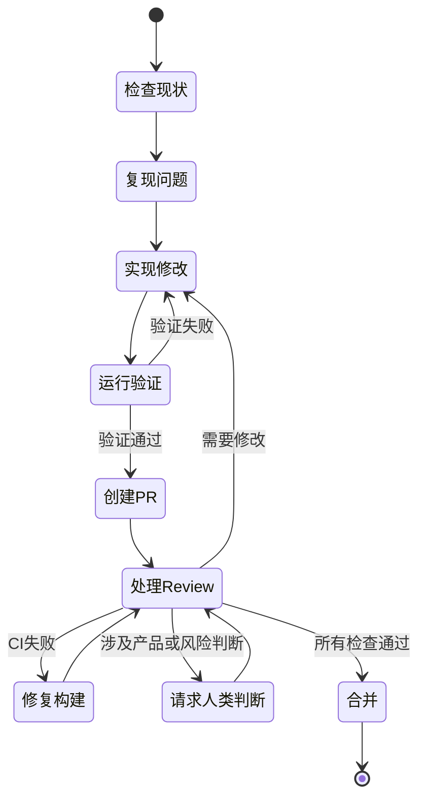

## 核心

OpenAI 这项实验最值得记住的并不是“AI 写了百万行代码”，而是**工程控制点上移**（人不再亲自完成每一步实现，而是设计目标、环境、规则和反馈）：Agent 的产能能否转化为可靠软件，取决于它能否看见真实状态、验证自己的工作，并把失败沉淀为下一次自动生效的系统能力。

所谓 **Harness Engineering**（为 Agent 配置工具、上下文、约束、反馈与恢复机制的工程），本质上是在建设一条可自我改进的软件生产线。人类仍然负责优先级、验收标准和关键判断，只是不再把“亲手输入代码”当作主要价值来源。

本文基于 Ryan Lopopolo 2026 年 2 月 11 日发布的 OpenAI [英文原文《Harness engineering: leveraging Codex in an agent-first world》](https://openai.com/index/harness-engineering/)重写与分析，不以中文译文为来源。

1. Table of Contents, ordered
{:toc}

## “零手写代码”实验到底做了什么

这不是一次让模型生成演示项目的短期测试，而是一次带有强约束的真实产品实验：**人类工程师不直接提交代码，仓库里的可执行资产全部交给 Codex 生成**。

实验从 2025 年 8 月底的空仓库开始。最初的目录结构、CI、格式规则、包管理器、应用框架和 `AGENTS.md` 都由 Codex CLI 配合 GPT-5 生成。五个月后，仓库规模达到约百万行，覆盖业务逻辑、基础设施、测试、文档、可观测性和内部工具。

原文给出的结果可以压缩成一组数字：

| 维度 | 原文数据 |
|---|---|
| 初始团队 | 3 名工程师 |
| 开发周期 | 约 5 个月 |
| 合并规模 | 约 1500 个 PR |
| 平均吞吐 | 每名工程师每天 3.5 个 PR |
| 代码规模 | 约百万行 |
| 交付速度估计 | 约为手写代码所需时间的 1/10 |
| 使用情况 | 数百名内部用户，并有日常重度用户和外部 Alpha 测试者 |

这里的“Agent 生成”不只是业务代码。测试、CI 与发布工具、开发者工具、设计历史、评测 Harness、Review 意见、仓库维护脚本乃至生产 Dashboard 定义，也在同一个约束内。

这组数据说明 Agent 已经可以承担完整的软件生产活动，但不能单独证明软件质量提高了十倍。“1/10 时间”是团队估算，原文没有公开对照项目、总推理成本、缺陷率、事故率或长期维护数据。这些边界不影响案例价值，却决定了它更适合作为工程方法样本，而不是普遍适用的生产率定律。

## 工程师没有消失，只是换了工作层次

零手写代码不等于零人类工程。实验中的人类把精力从“怎样实现这个函数”转向“Agent 为什么无法可靠完成这类任务”。

早期进展慢，并不是因为 Codex 完全不会写代码，而是仓库缺少完成高层目标所需的工具、抽象和内部结构。团队因此采用纵深拆解：先让 Agent 构建设计、编码、Review、测试等基础能力，再用这些能力解锁更复杂的任务。

当 Agent 失败时，团队不会只把原提示词换一种说法，而是定位缺失的系统能力：

| 失败表现 | 应补充的工程能力 |
|---|---|
| 不知道产品约束 | 可检索、版本化的规格与决策记录 |
| 无法复现 UI Bug | 独立应用实例、浏览器控制与截图能力 |
| 性能优化凭感觉 | 可查询的日志、指标、Trace 与量化阈值 |
| 架构逐渐漂移 | 自定义 Linter、结构测试与依赖边界 |
| Review 占满人类时间 | Agent 自审、专项 Agent 复审与反馈循环 |
| 旧坏模式不断复制 | 黄金原则、质量评分与周期性重构任务 |

这会形成一个能够积累收益的闭环：



循环的关键不在于反复运行同一个 Agent，而在于**每次失败都尽量改变下一次运行的环境**。一次 Review 意见如果只修当前代码，只产生一次收益；如果进一步变成结构测试或静态规则，之后生成的每一行代码都能获得同一约束。

## 仓库成为 Agent 能读取的组织记忆

Agent 只能利用运行时能够访问的上下文，因此散落在聊天记录、在线文档和工程师脑中的知识，对它而言等同于不存在。

团队最初尝试把所有规则塞进一个巨大的 `AGENTS.md`，结果出现四个问题：它挤占任务和代码的上下文；规则太多后无法区分重点；内容很快过时；一个大文件也难以机械检查覆盖率、所有权和交叉链接。

最终方案是把 `AGENTS.md` 从“百科全书”改成约 100 行的**导航入口**，再把细节放进结构化的仓库文档：

```text
AGENTS.md                 # 入口与导航
ARCHITECTURE.md           # 顶层领域和分层地图
docs/
├── design-docs/          # 设计文档与核心原则
├── exec-plans/           # 执行中、已完成计划与技术债
├── generated/            # 数据库 Schema 等生成资料
├── product-specs/        # 产品规格
├── references/           # 外部技术参考
├── QUALITY_SCORE.md      # 各领域和架构层的质量评分
├── RELIABILITY.md        # 可靠性约束
└── SECURITY.md           # 安全约束
```

Agent 先读取短小稳定的地图，再按任务逐层寻找细节，这就是**渐进式披露**（先提供导航，等任务真正需要时再加载详细信息）。它既节省上下文，也让文档拥有清晰的归属和检查边界。

计划同样被当作代码库的一部分。小任务使用短期计划，复杂工作则把进度、决策日志和技术债写进版本控制。新的 Agent 运行不必依赖某个人记得上次讨论了什么，可以直接从仓库恢复任务状态。

文档入库仍不足以保证可信。团队又用 Linter 和 CI 检查知识库是否保持结构完整、相互链接并及时更新，还让周期任务扫描过期文档并自动创建修复 PR。至此，文档从“供人参考的说明”变成了“会被验证的运行依赖”。

## 可读性不是排版，而是让 Agent 接触真实反馈

Agent 可读性（Agent legibility）指的是把软件的状态和因果关系暴露成 Agent 能直接查询、操作与验证的形式，而不只是让源代码写得整齐。

随着代码吞吐上升，人类 QA 成为瓶颈。团队为每个 Git worktree 启动一套独立应用，让不同任务拥有彼此隔离的运行实例；再把 Chrome DevTools Protocol 接入 Agent，并提供 DOM 快照、截图和页面导航工具。于是 Codex 不只阅读 Diff，还能自己复现 UI 问题、操作修复后的页面并核对行为。

同样的设计被扩展到可观测性。每个 worktree 都有临时的日志、指标和 Trace 环境，任务结束后整体销毁。Agent 可以用 LogQL 查询日志、用 PromQL 查询指标，因此“让服务更快”能够被改写成可验证条件，例如：

- 服务启动必须在 800 毫秒内完成；
- 四条关键用户旅程中的任何 Span 都不得超过 2 秒；
- 修复前后都要录制操作视频，证明故障能够复现且已经消失。

当成功标准能在环境里产生机器可读的证据，Agent 才可能长时间自治。原文称，单次 Codex 任务经常持续六小时以上，甚至可以在人类睡觉时工作。支撑这种持续运行的不是一句更长的 Prompt，而是完整的观察与验证通道。



## 用机械约束守住架构，用局部自由换取吞吐

文档能够解释意图，却不能阻止 Agent 在压力下违反规则；高吞吐代码库因此需要把关键架构判断变成无法轻易绕过的机械约束。

OpenAI 团队为每个业务领域规定固定分层，依赖只能单向前进：



跨领域能力只能通过明确的 `Providers` 接口进入，其他依赖边由自定义 Linter 和结构测试禁止。结构化日志、Schema 和类型命名、文件大小、平台可靠性要求等“品味约束”，也被写成静态检查；错误信息会直接带上修复指引，成为 Agent 下一轮的上下文。

这套方法不是规定每个实现细节，而是**集中约束边界，局部开放解法**。团队要求数据在系统边界被解析和验证，却不强制指定必须使用 Zod；只要实现正确、可维护，并且未来 Agent 能理解，就不必符合每位人类工程师的个人代码风格。

技术选择也服从可读性。API 稳定、组合方式清楚、训练资料丰富的“无聊技术”，通常更容易被 Agent 建模。面对行为不透明的上游库，团队有时宁愿让 Agent 实现一个范围更小的内部版本。例如，他们没有直接引入通用的并发限制包，而是实现了与 OpenTelemetry 深度集成、测试覆盖完整的并发映射工具。

这种选择不能简化成“凡是依赖都自己写”。内部实现会带来维护和安全责任。合理标准是比较两种成本：理解并约束外部黑盒的成本，是否真的高于拥有一份最小内部实现的全生命周期成本。

## 高吞吐改变合并策略，也放大错误传播速度

当 Agent 产出远快于人类注意力时，等待可能比修正更昂贵，因此团队采用短生命周期 PR 和较少的阻塞式合并门槛。

偶发测试抖动可以后续修复，而不是无限期阻塞当前改动。Agent 还能自行读取 Review、逐条回复、推送更新，并在许多情况下压缩提交和合并 PR。其背后的经济模型是：自动修正足够便宜时，快速合并、快速反馈、快速纠偏可能优于排队等待人类检查。

但这不是一条脱离场景的最佳实践。支付、医疗、安全边界、不可逆数据迁移等系统的错误成本远高于普通内部产品；即使修代码很便宜，错误已经造成的数据损坏、合规风险和用户伤害也未必可逆。**提高吞吐只能改变等待与返工的相对成本，不能自动降低事故的外部成本。**

因此，少阻塞门槛必须建立在其他条件之上：变更足够小、环境隔离完善、自动测试可信、状态可回滚、生产影响可观察，并且风险较高的判断仍能及时升级给人类。

## 端到端自治来自系统积累，不是模型突然全能

当测试、运行验证、Review、反馈处理和失败恢复逐步写进工程系统后，Codex 才能从一条 Prompt 出发完成整条特性链路。

原文描述的完整能力包括：检查代码库状态、复现 Bug、录制失败视频、实现修复、驱动应用验证、录制成功视频、创建 PR、响应人类与 Agent 的 Review、修复构建失败、在需要判断时升级给人类，最后合并变更。



这个流程最容易被误读成“换上同一模型，任何项目都能自动开发”。原文恰恰明确警告：端到端行为高度依赖该仓库特有的结构与工具，在缺少同等投入的项目里不能假定它会自然出现。

换句话说，自治不是一个开关，而是环境能力逐层积累后的结果。模型能生成代码只是起点；只有当它还能观察、执行、验证、恢复和升级，生成能力才会变成可托付的工程能力。

## Agent 代码库需要持续“垃圾回收”

Agent 会复用仓库中已经存在的模式，所以好结构会被复制，坏结构同样会迅速扩散；产出速度越高，代码库熵增也越快。

团队起初每周五花一天人工清理所谓的“AI slop”，相当于用 20% 的工作时间追赶技术债，但这种方式无法匹配 Agent 的生成速度。后来他们把人类偏好整理成可执行的“黄金原则”：优先复用共享工具，把关键约束集中管理；不猜测输入数据结构，而是在边界验证，或依赖有类型的 SDK。

后台 Codex 任务会定期扫描偏差、更新质量评分并创建范围明确的重构 PR。多数 PR 可以在一分钟内审完并自动合并。其作用类似垃圾回收器：持续清理小块技术债，避免坏模式在数日或数周内复制成系统性问题。

这也补全了 Harness 的反馈闭环：

1. 人类在 Review 或线上问题中识别一种坏模式；
2. 把判断提炼成文档、黄金原则、Linter 或结构测试；
3. 周期任务扫描已有偏差并修复；
4. 新代码在生成时立即受到同一规则约束；
5. 只有无法机械表达的取舍继续交给人类判断。

技术债并没有因为代码由 Agent 生成而消失，只是治理方式必须从偶发的大扫除变成与生成速度匹配的持续维护过程。

## 这套方法对普通团队的启示

普通团队不需要先承诺“零手写代码”，也可以按失败频率和收益逐步建设 Harness；最有价值的起点通常是把重复出现的人类提醒变成 Agent 能直接使用的反馈。

可以按以下顺序推进：

1. **让验收标准可执行。** 把“界面正常”“性能不错”改成测试、截图对比、延迟阈值或可查询指标。
2. **让关键知识进仓库。** 用短入口导航架构、产品规格、计划和技术债，不把所有内容堆进单个规则文件。
3. **让 Agent 能操作真实环境。** 提供隔离的应用实例、浏览器、日志、指标和 Trace，而不只给源代码。
4. **把边界变成检查。** 对依赖方向、数据验证、安全要求和命名规则使用 Linter 与结构测试。
5. **分离生产与验收。** 让实现 Agent 自审，再由关注安全、测试、性能等不同目标的 Agent 复审。
6. **持续回收技术债。** 把频繁出现的坏模式写成规则，并安排小范围、周期性的重构任务。
7. **保留人类升级通道。** 产品取舍、风险接受和价值判断不能伪装成纯技术检查。

这条路径衡量的不是“AI 替人写了多少行”，而是**一次人类判断能否被系统复用，以及 Agent 的每次失败能否降低未来同类任务的失败概率**。

## 评价

### 写得好的地方

原文最有价值之处，是把“工程师不写代码”从吸引眼球的口号还原成一组具体基础设施。空仓库、五个月、约 1500 个 PR、百万行代码和真实用户提供了足够清晰的实验尺度；worktree 隔离、浏览器控制、LogQL、PromQL、自定义 Linter、结构测试和周期清债任务，又让读者能看见高自治背后的真实投入。

文章也准确抓住了 Agent 工程的关键矛盾：稀缺资源从输入代码的时间转向人类注意力。把 `AGENTS.md` 设计成地图、把执行计划纳入版本控制、把 Review 意见升级为机械约束，都是能迁移到普通团队的做法。尤其值得肯定的是，原文没有把自治描述成模型的固有能力，而是明确承认它依赖仓库特定的结构和工具。

### 可以改进的地方

原文首先是一篇由实践团队撰写的经验总结，而不是可复现实验报告。它没有公开产品类型、仓库组成、代码行统计口径、模型与推理成本、人类总工时、缺陷率、回滚率、生产事故、测试有效性或对照组，因此“约 1/10 时间”和“百万行代码”只能说明团队观察到的规模，不能单独证明总体效率或质量提升。

其次，文章较少讨论安全与治理的代价。Agent 能自行读取反馈、推送代码乃至合并 PR，意味着凭证管理、供应链攻击、提示词注入、恶意依赖和错误自动扩散都需要更严格的边界。原文展示了 worktree 隔离和结构约束，却没有充分说明生产权限、审批策略与事故恢复模型。

最后，这项实践从空仓库开始，天然减少了遗留系统中最难处理的隐性知识、脆弱依赖和组织边界。它证明了 Agent-first 系统可以被有意识地设计出来，却尚未证明传统大型代码库能够以相同速度完成迁移。原文自己也承认，完全由 Agent 生成的系统能否在多年尺度保持架构一致性，以及人类判断应该放在哪些位置，仍然没有答案。
