1. Table of Contents, ordered
{:toc}

# 背景与目标

用户希望全面了解其 Debian VPS 上 Docker 容器的运行全景，并重点分析 V2Ray 从 v4 升级到 v5 的方案。服务器仅有 1GB 内存，运行着基于 `nginx-proxy` + `acme-companion` 的容器化反向代理架构。

# Docker 服务全景

## 整体架构

这台 VPS 上所有 Web 服务都通过 **nginx-proxy** 统一入口对外暴露，acme-companion 自动处理 SSL 证书。没有任何容器直接将端口映射到宿主机（`-p` 参数），所有流量都走 Docker 内部网络：

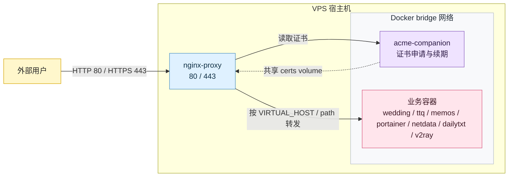

当前运行的 10 个容器如下：

| 容器名 | 镜像 | 内部端口 | 职责 |
|--------|------|----------|------|
| `nginx-proxy` | `nginxproxy/nginx-proxy` | 80, 443 | 反向代理网关 |
| `nginx-proxy-acme` | `nginxproxy/acme-companion` | — | 自动申请/续期 Let's Encrypt 证书 |
| `wedding` | `nginx:alpine` | 80 | 静态站点（婚礼相册） |
| `ttq` | `nginx:alpine` | 80 | 静态站点 |
| `memos` | `neosmemo/memos:stable` | 5230 | 笔记服务 |
| `portainer` | `portainer/portainer-ce` | 8000, 9000, 9443 | Docker 可视化管理面板 |
| `netdata` | `netdata/netdata` | 19999 | 系统监控 |
| `dailytxt` | `phitux/dailytxt:1.0.13` | 80 | 日记服务 |
| `v2ray` | `v2fly/v2fly-core:v4.23.4` | 10087 | 代理服务（v4 稳定版） |
| `v2ray-new` | `v2fly/v2fly-core:latest` | 10087 | 代理服务（v5 测试版） |

## Docker 网络实际状况

### 不是每个容器一个网络

一个常见的误解是"每个容器有自己的 Docker 网络"。实际上：**大家共享同一个网络，但每人分配一个独立 IP**。

Docker 默认会创建一个 `bridge` 网络（底层对应宿主机上的 `docker0` 网桥），相当于一台虚拟路由器。所有不指定网络的容器，都会自动连到这个网络上——就像大家连在同一个 WiFi 下：

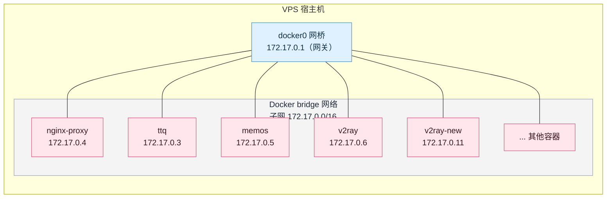

在这台 VPS 上，确实只有一个 `bridge` 网络，10 个容器全部接在里面：

| 容器名 | 实际 IP | 暴露端口 | 外部映射 |
|--------|---------|----------|----------|
| `nginx-proxy` | `172.17.0.4` | 80, 443 | `0.0.0.0:80→80`, `0.0.0.0:443→443` |
| `nginx-proxy-acme` | `172.17.0.2` | — | 无 |
| `ttq` | `172.17.0.3` | 80 | 无 |
| `memos` | `172.17.0.5` | 5230 | 无 |
| `v2ray` | `172.17.0.6` | 10087 | 无 |
| `netdata` | `172.17.0.7` | 19999 | 无 |
| `dailytxt` | `172.17.0.8` | 80 | 无 |
| `wedding` | `172.17.0.9` | 80 | 无 |
| `portainer` | `172.17.0.10` | 9443 | 无 |
| `v2ray-new` | `172.17.0.11` | 10087 | 无 |

### 为什么端口相同却不冲突？

`v2ray` 和 `v2ray-new` 内部都用 `10087` 端口，但由于它们拥有**不同的 IP 地址**，就像两个不同手机都开了微信，完全不会冲突：

```
172.17.0.6:10087   ← v2ray (v4)
172.17.0.11:10087  ← v2ray-new (v5)
      ↑                ↑
   不同 IP          不同 IP
```

### 容器间如何通信

因为所有容器在同一网段，它们之间可以直接通信：

- **通过 IP**：`nginx-proxy` 可以直接访问 `172.17.0.3:80`（ttq）
- **通过容器名**：Docker 内置了 DNS，`nginx-proxy` 也可以直接访问 `http://ttq:80`

只有 `nginx-proxy` 把端口映射到了宿主机（`-p 80:80 -p 443:443`），其他 9 个容器都是**只暴露内部端口**，外面直接访问不到。外部流量必须先到达 `nginx-proxy`，再由它按规则转发到对应容器的内网 IP。

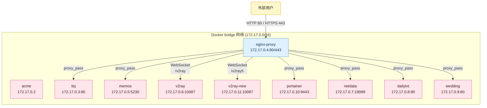

## nginx-proxy 自动发现与转发原理

`nginx-proxy` 并非手动编写配置文件，而是通过挂载宿主机的 `/var/run/docker.sock`，实时监听容器创建、销毁、环境变量变更等事件。任何带有 `VIRTUAL_HOST` 环境变量的容器，都会被自动注册为 nginx 的 upstream。

### 各容器声明的环境变量

| 容器名 | `VIRTUAL_HOST` | `VIRTUAL_PORT` | `VIRTUAL_PROTO` | `VIRTUAL_PATH` | `LETSENCRYPT_HOST` |
|--------|---------------|----------------|-----------------|----------------|-------------------|
| `wedding` | `wedding.puppylpg.top` | — | — | — | `wedding.puppylpg.top` |
| `ttq` | `ttq.puppylpg.top` | — | — | — | `ttq.puppylpg.top` |
| `memos` | `memos.puppylpg.top` | `5230` | — | — | `memos.puppylpg.top` |
| `portainer` | `portainer.puppylpg.top` | `9443` | `https` | — | `portainer.puppylpg.top` |
| `netdata` | `netdata.puppylpg.top` | `19999` | — | — | `netdata.puppylpg.top` |
| `dailytxt` | `memory.puppylpg.top` | — | — | — | `memory.puppylpg.top` |
| `v2ray` | `puppylpg.top` | `10087` | — | `/v2ray` | `puppylpg.top` |
| `v2ray-new` | `puppylpg.top` | `10087` | — | `/v2ray5` | `puppylpg.top` |

- `VIRTUAL_HOST`：告诉 nginx-proxy 这个容器响应哪个域名。
- `VIRTUAL_PORT`：当容器内部不是 80 端口时指定（如 memos 的 5230）。
- `VIRTUAL_PROTO=https`：告诉 nginx-proxy 使用 `proxy_pass https://` 而非 `http://`（portainer 需要）。
- `VIRTUAL_PATH`：当多个容器共享同一个域名时，按路径区分（v2ray 和 v2ray-new）。
- `LETSENCRYPT_HOST`：告诉 acme-companion 为这个域名申请 SSL 证书。

### 自动生成的 nginx 配置

基于上述环境变量，nginx-proxy 在容器内自动生成 `/etc/nginx/conf.d/default.conf`。以下是这台 VPS 上的**实际配置片段**。

**域名级转发（以 ttq 为例）：**
```nginx
upstream ttq.puppylpg.top {
    # Container: ttq
    #     IP address: 172.17.0.3
    #     using port: 80
    server 172.17.0.3:80;
}

server {
    server_name ttq.puppylpg.top;
    listen 80;
    location / {
        return 301 https://$host$request_uri;
    }
}

server {
    server_name ttq.puppylpg.top;
    listen 443 ssl http2;
    ssl_certificate /etc/nginx/certs/ttq.puppylpg.top.crt;
    ssl_certificate_key /etc/nginx/certs/ttq.puppylpg.top.key;

    location / {
        proxy_pass http://ttq.puppylpg.top;
    }
}
```

**端口非 80（以 memos 为例）：**
```nginx
upstream memos.puppylpg.top {
    # Container: memos
    #     IP address: 172.17.0.5
    #     using port: 5230
    server 172.17.0.5:5230;
}
# ... server 块内 proxy_pass http://memos.puppylpg.top;
```

**HTTPS 后端（以 portainer 为例）：**
```nginx
upstream portainer.puppylpg.top {
    # Container: portainer
    #     IP address: 172.17.0.10
    #     using port: 9443
    server 172.17.0.10:9443;
}
# ... server 块内 proxy_pass https://portainer.puppylpg.top;
```

**路径级转发（v2ray / v2ray-new）：**
```nginx
upstream puppylpg.top-e4ef5e7590321020fdf18aca8812df0c6d8539ac {
    # Container: v2ray
    #     IP address: 172.17.0.6
    #     using port: 10087
    server 172.17.0.6:10087;
}

upstream puppylpg.top-94f75cc1d9f955dec986d7c5c366e3c221ab679d {
    # Container: v2ray-new
    #     IP address: 172.17.0.11
    #     using port: 10087
    server 172.17.0.11:10087;
}

server {
    server_name puppylpg.top;
    listen 443 ssl http2;

    location /v2ray {
        proxy_pass http://puppylpg.top-e4ef5e759...;
        proxy_set_header Upgrade $http_upgrade;
        proxy_set_header Connection $proxy_connection;
    }

    location /v2ray5 {
        proxy_pass http://puppylpg.top-94f75cc1d...;
        proxy_set_header Upgrade $http_upgrade;
        proxy_set_header Connection $proxy_connection;
    }
}
```

### 转发流程总结

当用户访问 `https://ttq.puppylpg.top` 时：

1. DNS 解析域名到 VPS 公网 IP；
2. 请求到达 `nginx-proxy` 监听的 443 端口；
3. nginx 读取 HTTP Header 中的 `Host: ttq.puppylpg.top`，匹配到对应的 `server` 块；
4. `proxy_pass` 将请求转发到 `upstream ttq.puppylpg.top`，即 `172.17.0.3:80`；
5. `ttq` 容器处理请求并原路返回。

对于 v2ray，同一个域名 `puppylpg.top` 按 `location /v2ray` 和 `location /v2ray5` 拆分到两个不同的 upstream，分别打到 `172.17.0.6:10087` 和 `172.17.0.11:10087`。

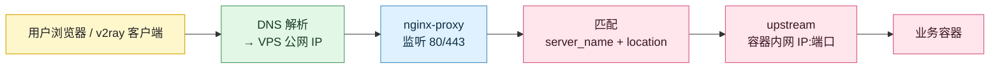

## 各容器连接方式

### 1. nginx-proxy（反向代理网关）

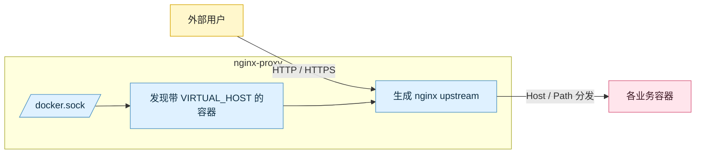

`nginx-proxy` 通过挂载宿主机的 `/var/run/docker.sock` 实时感知容器状态。任何带有 `VIRTUAL_HOST` 环境变量的容器都会被自动注册为 upstream。

### 2. nginx-proxy-acme（SSL 证书自动管理）

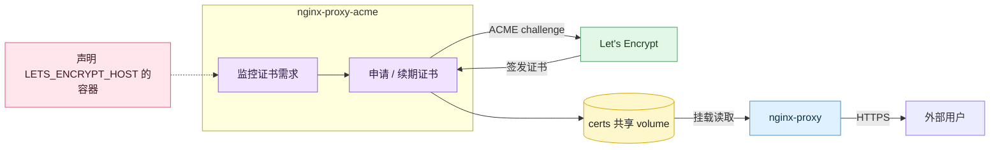

`acme-companion` 不直接对外暴露端口，它通过 `--volumes-from nginx-proxy` 共享证书目录，并监控哪些容器声明了 `LETS_ENCRYPT_HOST`。

### 3. wedding / ttq（静态站点）

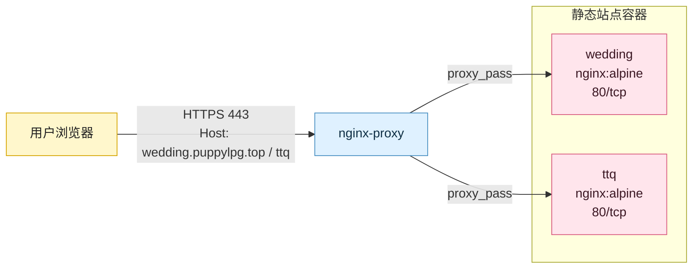

两个静态站都是 `nginx:alpine` 容器，分别挂载不同的本地目录到 `/usr/share/nginx/html`。

### 4. memos（笔记服务）

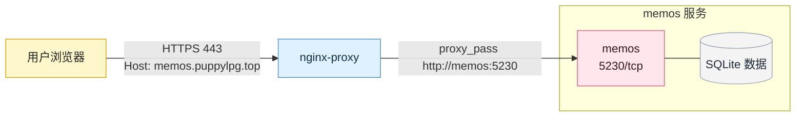

### 5. portainer（Docker 管理面板）

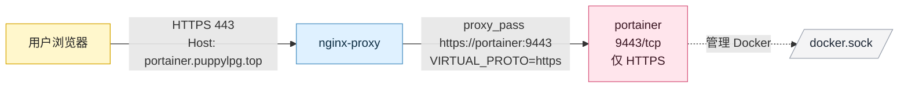

portainer 的特殊之处在于它**只开 HTTPS**，因此 `VIRTUAL_PROTO=https` 告诉 nginx-proxy 使用 `proxy_pass https://...` 而非普通的 HTTP。

### 6. netdata（系统监控）

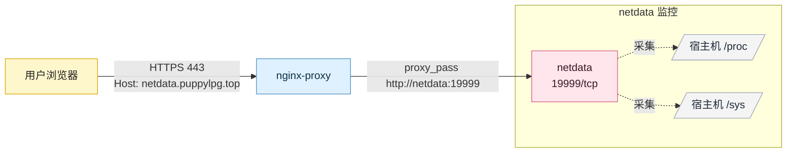

netdata 容器挂载了宿主机的 `/proc`、`/sys` 等目录，用于采集系统级指标。

### 7. dailytxt（日记服务）

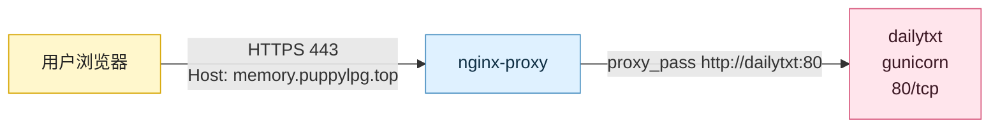

### 8. v2ray（代理服务 v4）

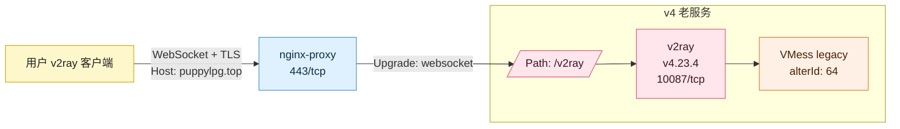

v2ray 使用 WebSocket 传输层，nginx-proxy 负责处理 WebSocket 的 `Upgrade` 和 `Connection` header 转发。由于容器声明了 `VIRTUAL_PATH=/v2ray`，nginx-proxy 自动生成 `location /v2ray` 块，将匹配到该路径的请求转发到 `172.17.0.6:10087`。

### 9. v2ray-new（代理服务 v5 测试）

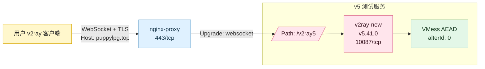

v2ray-new 与 v2ray 的唯一外部差异是 WebSocket 路径不同（`/v2ray5` vs `/v2ray`），内部差异是 alterId（0 vs 64）和版本（v5 vs v4）。nginx-proxy 自动生成 `location /v2ray5` 块，将请求转发到 `172.17.0.11:10087`。

# V2Ray v4→v5 升级分析

## 为什么不能直接升级

直接从 `v4.23.4` 升级到 `v5.41.0` 会遇到两个**硬性不兼容**：

### 1. 启动命令格式变更

v5 的 Docker 镜像 ENTRYPOINT 已改为 `/usr/bin/v2ray`，但 CMD 为空，要求显式传入子命令：

| 版本 | 正确启动命令 |
|------|-------------|
| v4.x | `v2ray -config=/etc/v2ray/config.json` |
| v5.x | `v2ray run -config=/etc/v2ray/config.json` |

如果沿用 v4 的 `docker run` 命令（包含 `v2ray -config=...`），最终执行的命令会变成：

```
/usr/bin/v2ray v2ray -config=/etc/v2ray/config.json
```

这导致 v5 报错 `v2ray v2ray: unknown command`，容器启动即崩溃。

### 2. VMess 协议安全模型变更

| 版本 | alterId | 校验方式 |
|------|---------|----------|
| v4.23.4 | `64` | MD5 时间戳校验（旧协议） |
| v5.41.0 | `0` | AEAD（AES-GCM，新协议） |

v5 移除了对非零 `alterId` 的支持。如果强行在 v5 配置里写 `alterId: 64`，服务端无法正常处理旧客户端的握手请求。

## 做了哪些操作

为了验证升级可行性，采取了**并行部署**策略：

1. **保留老服务**：`v2ray` 容器（v4.23.4）保持运行，路径 `/v2ray`，确保现有用户不断线。
2. **部署新实例**：创建 `v2ray-new` 容器（v5.41.0），使用新路径 `/v2ray5` 避免冲突。
3. **修正启动命令**：使用 `run -config=...` 而非 `-config=...`。
4. **修改配置**：将 `alterId` 从 `64` 改为 `0`，其余参数（UUID、端口、WebSocket 路径等）保持一致。
5. **验证连接**：用户通过客户端连接 `/v2ray5` 路径，确认 v5 服务可用。

## 为什么要并行部署

直接替换老容器的风险在于：**一旦升级失败或配置有误，所有用户会立即断网**。并行部署的好处：

- **灰度验证**：可以先测试 v5 是否正常工作，再决定是否迁移用户。
- **快速回滚**：如果 v5 有问题，用户立刻切回 `/v2ray` 即可恢复。
- **不影响现有业务**：老 v4 用户全程无感知。

## 破坏性改动与旧服务无法关停的原因

旧服务（v4）**暂时不能关**，核心原因是 **alterId 协议不兼容**：

- 所有老用户的客户端配置里是 `alterId: 64`。
- v5 服务端只认 `alterId: 0`（AEAD）。
- 如果关掉 v4，所有未更新配置的老用户会立即连不上服务器。

这意味着 **"零改动无缝升级"是不可能的**。必须经历一个过渡期：

1. 并行运行 v4 + v5。
2. 通知所有用户把客户端配置里的 `alterId: 64` 改成 `0`，其他参数不变。
3. 确认大部分用户迁移后，再关闭 v4。

另一个细节是内部端口：v4 和 v5 容器内部都使用 `10087`，但由于 Docker 网络隔离（`172.17.0.6` 与 `172.17.0.11`），不会冲突。对外暴露的差异仅体现在 nginx-proxy 的 path 路由上——`location /v2ray` 转发到 `172.17.0.6:10087`，`location /v2ray5` 转发到 `172.17.0.11:10087`。

# 核心结论

- **v5 不会加速**：延迟取决于物理网络路径，软件版本升级不改变路由。
- **v5 的优势在安全性和可维护性**：AEAD 替代 MD5，且 v4 已停止维护。
- **升级不能一刀切**：`alterId: 64→0` 是协议分水岭，必须通知用户同步修改客户端配置。
- **并行部署是最佳策略**：保留 v4 运行，用不同 path 部署 v5，等用户迁移后再下线老版本。
