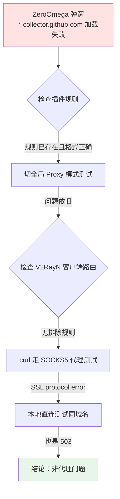

1. Table of Contents, ordered
{:toc}

---

## 现象

使用 V2RayN + Chrome ZeroOmega（Auto Switch 模式）访问 GitHub 时，页面功能完全正常，但 ZeroOmega 反复弹窗：

> 由于网络原因，此页面部分资源加载失败。您可以查看以下域名，并根据实际情况确定是否对其使用代理。  
> `*.collector.github.com`

点击弹窗的「添加条件」按钮后，规则确实写入了 Auto Switch 列表，格式正确且指向 Proxy。但刷新页面，弹窗**依然出现**。

## 排查决策树



## 第一层：排除浏览器插件问题

最初怀疑 ZeroOmega 规则类型不匹配（如将「域名通配符」误填为「网址通配符」）、PAC 缓存未刷新、或 WebSocket 请求绕过 PAC。但用户确认：

- 规则由 ZeroOmega 弹窗自带的「添加」按钮自动生成，类型和格式无误
- 已点击「应用选项」
- 规则确实存在于 Auto Switch 列表中

**关键测试**：将 ZeroOmega 从 Auto Switch **切换为全局 Proxy 模式**，刷新页面。弹窗**仍然出现**。

> 这一步直接排除了 ZeroOmega 规则匹配的嫌疑。如果全局代理都加载不了，说明问题在代理链路更深层。

## 第二层：排除 V2Ray 客户端路由问题

检查 `guiConfigs/config.json` 的路由规则：

```json
"routing": {
    "domainStrategy": "IPIfNonMatch",
    "rules": [
        { "outboundTag": "api", "inboundTag": ["api"] },
        { "outboundTag": "direct", "domain": ["geosite:cn"] },
        { "outboundTag": "block", "domain": ["geosite:category-ads-all"] },
        { "outboundTag": "direct", "ip": ["geoip:private", "geoip:cn"] },
        { "outboundTag": "proxy", "port": "0-65535" }
    ]
}
```

`collector.github.com` 不在 `geosite:cn` 或 `category-ads-all` 中，应命中最后一条 `proxy` 规则。**客户端没有排除该域名**。

## 第三层：代理链路的 TLS 层测试

用 curl 直接走 SOCKS5 代理访问：

```bash
curl -x socks5h://127.0.0.1:10808 \
  https://collector.github.com/github/collect -v
```

结果：

```
schannel: next InitializeSecurityContext failed:
SEC_E_INVALID_TOKEN (0x80090308)
curl: (35) schannel: ...
```

`SEC_E_INVALID_TOKEN` 表示代理服务器返回的数据**不是有效的 TLS 握手响应**。这说明 V2Ray 服务端在连接目标时，收到的要么是明文 HTTP 错误页，要么连接被重置。

## 第四层：本地直连对照实验

为了确认是不是代理链路特有故障，测试**本地不走代理**直接访问：

```bash
curl https://collector.github.com/github/collect -v
```

结果：**也是 `503 Service Unavailable`**，返回体为：

```
upstream connect error or disconnect/reset before headers.
retried and the latest reset reason: connection timeout
```

`x-github-backend: Kubernetes` 响应头证实这是 GitHub 后端自己返回的错误。

### 为什么域名走代理是 SSL Error，而直连是 503？

| 测试方式 | 解析目标 | 结果 | 原因 |
|---------|---------|------|------|
| 本地直连 | `140.82.114.21`（国内 DNS） | HTTP 503 | TLS 握手成功，GitHub 后端超时 |
| 代理访问 IP | 同上 | HTTP 503 | 同上 |
| 代理访问域名 | VPS 海外 DNS 解析的节点 | SSL Error | 海外 CDN 节点直接断连或返回非 TLS 数据 |

GitHub 使用 GeoDNS，`collector.github.com` 在中国大陆解析到 `140.82.114.21`，而海外 VPS 解析到**不同的 CDN 边缘节点**。后者在 TLS 握手阶段就直接拒绝连接，导致客户端看到 `SSL protocol error`。

## 核心结论

**ZeroOmega 的弹窗是误报。**

`collector.github.com` 是 GitHub 的遥测/分析收集接口，其服务端从中国大陆访问本身就返回 `503`。ZeroOmega 检测到资源加载失败后，习惯性地推断为「代理规则缺失」，但实际上：

- 添加代理规则 → 没用
- 切全局代理 → 也没用
- 换任何代理节点 → 大概率也没用（GitHub 后端问题）

这个域名被拦截或超时**不影响 GitHub 的正常使用**，页面功能完全正常。

## 建议处理方案

1. **无需处理**：忽略 ZeroOmega 弹窗，`collector.github.com` 只是遥测接口，不影响功能。
2. **消除弹窗**：在 ZeroOmega 的 Auto Switch 里，将 `*.collector.github.com` 规则设为「直接连接」。这样 ZeroOmega 不再将其识别为"需要代理的未匹配流量"。
3. **更彻底**：在 uBlock Origin 等广告拦截扩展中拦截 `collector.github.com`，既减少弹窗，又阻止追踪。

## 复盘：为什么容易掉进这个坑？

代理插件的弹窗机制有一个隐含的假设：**"资源加载失败 = 代理规则缺失"**。但实际上资源失败的原因有很多：

- 目标服务器本身故障（如本次 503）
- 广告拦截扩展阻断
- DNS 解析污染
- TLS 指纹/防火墙拦截
- 浏览器缓存或 Service Worker 异常

遇到"加规则无效"的情况时，**切全局代理做对照测试**是最快排除插件配置问题的手段。如果全局代理也不行，问题一定在代理链路或目标服务端。