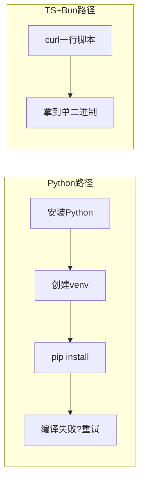

1. Table of Contents, ordered
{:toc}

> 原文：[从 kimi-cli 用 TypeScript 重构说起：为什么大家都在拥抱 TypeScript？](https://mp.weixin.qq.com/s?__biz=MzAxMjA0MDk2OA==&mid=2449479832&idx=1&sn=ab5af7de85f83c1564fa3312313841d3)

# 一个 PR 引发的故事

今年 4 月初，Moonshot 的 kimi-cli 仓库收到了一个 PR，标题简单粗暴：「kimicli 用 python 是彻底的失败 立刻重构为 ts」。

结果前几天 kimi-cli 真的用 TypeScript 重写了——以 `kimi-code` 的独立仓库上线，语言比重从 Python 78.1% 变为 TypeScript 97.4%。据说新版基于 Python 版 kimi-cli 和 pi-agent 重构，性能有很大提升。

这不是个例，而是整个赛道的趋势。

# AI Coding CLI 赛道：TypeScript 一统天下

当前主流 AI Coding CLI 的技术栈：

| 产品 | 语言 |
|------|------|
| Claude Code | TypeScript / Node.js |
| Codex CLI | 曾走 Rust，最终回归 TS |
| Gemini CLI | TypeScript |
| OpenCode | TypeScript |
| kimi-code | TypeScript |
| Aider | Python（仅剩的孤岛） |

Codex App、Claude Desktop 都采用 Electron 框架，本质上也是 TypeScript 生态。**这个赛道几乎被 TS 一统了。**

# Python CLI 分发的天然短板

以 kimi-cli Python 版的安装体验为例：先确认本地 Python 版本（系统自带的可能太老），再用 `pipx` 或 `uv` 安装依赖，装完发现某个依赖编译失败，搜半天发现是 macOS 上的某个 native 模块不兼容，然后还要重装。

而 kimi-code 的安装：

```bash
curl -fsSL https://code.kimi.com/kimi-code/install.sh | bash
```

一条命令，单二进制，连 Node.js 都不用先装好。Claude Code、Codex、OpenClaw 都是这个套路。

**核心矛盾在于场景**：CLI 要交给成千上万不知道用什么系统、什么版本的用户在他们自己电脑上跑。Mac、Linux、Windows，不同 Python 版本，装了一堆冲突依赖的环境——Python **没有「打包成单可执行文件」的官方解决方案**。PyInstaller 体积大、启动慢、跨平台容易出问题。

# Bun：幕后推手

如果说 TypeScript 是主角，那 Bun 就是那个幕后推手。

以前 Node.js 写的 CLI 工具分发也是老大难：要么让用户先装 Node.js + npm（用户拒绝），要么用 `pkg`、`nexe` 这些第三方打包工具（生成的二进制又大又慢）。

Bun 出现后，`bun build --compile` 直接输出原生二进制——**体积小、启动快、跨平台**。这一下子把 TS/JS 推到了"适合写终端工具"的位置。用户什么都不用管，直接下载二进制就完事。

> 过去两年 TS/JS 生态最值得关注的变化，不是又出了什么新框架，而是**分发模式终于解决了**。



# 其他加分项

除了分发优势，TypeScript 在 AI CLI 赛道还有两个助力：

1. **大模型写 TS 写得好**——训练语料中 TypeScript 代码量极大，模型生成 TS 代码的质量高于大多数语言。
2. **大厂带头效应**——Anthropic、OpenAI 都用 TypeScript 写 CLI，跟随者自然有样学样。

# Python 依然是王者——在它该在的领域

也别急着踩 Python。在以下场景，Python 的生态无人撼动：

- **模型训练 / 推理框架**：PyTorch、TensorFlow、Transformers
- **数据科学**：Pandas、NumPy、Polars
- **服务端**：FastAPI、Django 在中小型项目里依然能打
- **AI 应用胶水层**：LangChain、LlamaIndex 的 Python 版还是主流

这些场景有一个共同特征：**运行环境是开发者或运维掌控的服务器，不是终端用户的电脑**。

一旦场景变成"把工具交给一万个不知道是谁的用户在他们自己电脑上跑"，Python 的劣势就暴露了。AI Coding CLI 恰好就是这个典型场景。

# 总结：不是 Python 不行了，是形态变了

原文用了一个精准的类比：

- jQuery 不是不行，是 SPA 时代来了
- Flash 不是不行，是 HTML5 来了
- Python CLI 工具也不是不行，是 **Agent 时代 TypeScript 更适合**

Python 在 AI 上半场（模型训练、推理框架）是绝对赢家。但 AI 下半场，各种依赖大模型的产品层出不穷，TypeScript 变成了绝对赢家。

# FAQ：Bun 是怎么做到的？其他语言不行吗？

## "一个二进制全平台通用"？

不是。Bun 的 `bun build --compile` 是**针对每个目标平台分别生成**对应的原生可执行文件：

```bash
bun build --compile --target=bun-linux-x64 ./index.ts
bun build --compile --target=bun-darwin-arm64 ./index.ts
bun build --compile --target=bun-windows-x64 ./index.ts
```

每个平台一个二进制，发布时 install 脚本自动检测用户的 OS/arch，下载对应版本。用户感知到的是"一条命令装好"，实际背后是多平台构建 + 自动分发。

## 原理：把运行时塞进二进制

本质上做了一件事——**把 Bun 运行时 + TS/JS 代码打包成一个自包含的可执行文件**：

```
┌─────────────────────────────┐
│  Bun Runtime (Zig/C++ 编译) │  ← 精简版运行时，约 50-90MB
│  ─────────────────────────  │
│  TS 代码 (已转译+打包)       │  ← 所有依赖 bundle 成单文件
│  ─────────────────────────  │
│  静态链接的系统库             │  ← 不依赖用户机器上的动态库
└─────────────────────────────┘
```

用户拿到这个二进制，双击或命令行执行就跑，不用装 Node.js、不用装 Bun、不用 `npm install`。

## Python 为什么做不好这件事？

不是技术上做不到，是**生态和语言设计导致做起来很痛苦**：

| 维度 | Go / Rust | Bun (TS) | Python |
|------|-----------|-----------|--------|
| 编译模型 | 原生编译，天生单二进制 | 嵌入运行时 + 打包代码 | 解释型，需嵌入整个 CPython |
| 依赖处理 | 静态链接 | bundle 成单 JS 文件 | 很多库有 C 扩展，要跨平台编译 |
| 产物体积 | 小（Go ~10MB, Rust ~5MB） | 中等（~50-90MB） | 大（PyInstaller ~100-300MB） |
| 启动速度 | 极快 | 快 | PyInstaller 慢（解压+加载） |

Python 的核心困难：

1. **C 扩展地狱**——numpy、cryptography 等库底层是 C/C++，每个平台要单独编译，交叉编译极其痛苦
2. **没有官方方案**——Python 官方从未提供"打包成单二进制"的工具链，PyInstaller/Nuitka 都是社区第三方
3. **运行时太重**——CPython 解释器本身就很大，加上标准库，基础体积就上百 MB
4. **动态特性太多**——`import` 可以在运行时动态决定加载什么，打包工具很难静态分析清楚所有依赖

## Go 和 Rust 其实更擅长这个

如果纯比"打出跨平台单二进制"，**Go 和 Rust 比 Bun 做得更好更成熟**。Go 的 `go build` 天生就是静态链接的单二进制，Rust 也是。

AI CLI 赛道没选 Go/Rust 而选 TS，原因不止是分发：

- 这些产品同时有 Web 端（Electron/浏览器），**TS 前后端共享代码库**成本最低
- AI SDK（Anthropic SDK、OpenAI SDK）的 TS 版维护质量高
- 大模型本身生成 TS 代码质量好，自举开发效率高
- 开发速度快，迭代周期短——这个赛道在疯狂抢时间

所以更准确的说法是：**Bun 让 TypeScript 补上了"分发"这最后一块短板**，使得 TS 在兼顾开发效率、生态复用和分发体验三方面都够用了。不是 TS 在分发上最强，而是它终于不再是短板了。

---

# 核心

AI CLI 赛道集体选择 TypeScript 的根本原因不是语言本身优劣，而是**分发场景决定了技术选型**。CLI 工具面向的是不可控的终端用户环境，谁能给出"一条命令装好、单二进制跑起来"的体验，谁就胜出。Bun 的 `--compile` 能力补上了 JS 生态最后一块短板，让 TypeScript 从"只能写 Web"变成"也能写系统工具"。这不是语言之争，是交付方式之争。

# 评价

文章的核心论点——"分发场景决定技术选型"——是扎实的，也给出了足够的实例支撑。但有几个问题：

1. **过度简化了 Bun 的角色**。实际上 Claude Code 用的是 Node.js 而非 Bun，Anthropic 收购 Bun 是后来的事。文章暗示 Bun 是所有 AI CLI 的共同基础设施，这不准确。真正的共性是 npm/Node 生态的成熟度 + 可选的二进制打包方案（pkg/nexe/Bun 各有人用）。

2. **忽略了 Rust/Go 的存在**。Codex CLI 曾走 Rust 这件事被一笔带过，但没解释为什么又回到 TS。如果纯粹比分发，Go 的单二进制方案比 Bun 更成熟。AI CLI 选 TS 还有一个重要原因：**前后端同构**——很多 AI 产品同时有 Web 端和 CLI 端，共享 TS 代码库成本最低。

3. **"大模型写 TS 写得好"这个论点缺乏证据**。模型写 Python 也很好，毕竟训练语料中 Python 更多。这个论点更像是凑数。

4. **没有讨论 TypeScript 的劣势**：类型体操的认知负担、Node.js 生态碎片化（ESM vs CJS 至今未完全统一）、运行时性能仍不如 Rust/Go。对于 CPU 密集型的本地推理场景，TS 并非最优解。

整体而言，文章作为一篇观察性质的科普是合格的，核心论点成立，但分析深度有限，适合作为入门了解而非深度技术决策参考。
