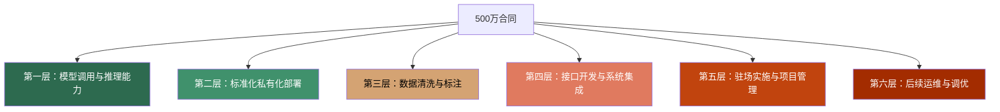
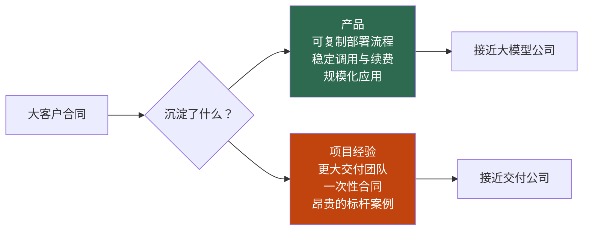

1. Table of Contents, ordered
{:toc}

> 原文：[大模型公司的"收入幻觉"](https://www.36kr.com/p/3862676976712582)

# 背景：商业化故事讲不完，但钱的性质开始被追问

大模型公司走过了只讲技术、只讲参数的阶段。现在，没有收入很难融下一轮，有了收入又面临另一个问题：这些钱是怎么赚来的？

一笔500万元的大客户合同，放进融资材料里很好看。客户是真客户，合同是真合同，场景也是真场景。但投资人真正拆账时，问题会变得尖锐：这500万里，多少是模型调用费？多少是标准产品订阅？多少是私有化部署、接口开发、数据清洗？又有多少其实是驻场实施、后续运维、人工调优和项目管理？

合同金额没有水分，但收入的性质，差别很大。

# 两种客户案例，背后是两种商业逻辑

过去两年，大模型公司最爱讲客户案例。大模型太抽象，一个头部金融机构或大型制造企业的落地案例，比十页模型介绍都有说服力。

但客户案例有两种，定价逻辑截然不同：

**产品型案例**：客户买的是一个清楚的产品，部署路径相对标准，功能边界稳定。今天卖给银行，明天卖给保险，后天卖给券商，核心能力和交付流程可以延展复用。

**项目型案例**：客户买的是一个结果。为了这个结果，公司可以改流程、接系统、调模型、清数据、派人驻场，最后把项目交付出来。客户满意，案例漂亮，但下一家客户来了，可能还要重做一遍。

区分两者的关键，不在客户名头有多响，而在：交付的哪一部分能在下一个客户身上直接复用。

| 产品型 | 项目型 |
|--------|--------|
| 核心能力可复用 | 每单高度定制 |
| 部署流程可标准化 | 每次重新适配 |
| 收入能随客户数线性增长 | 收入增长需同步扩人 |
| 资本按软件倍数估值 | 资本按服务收入估值 |

这两种案例在融资材料里都可以写成"大模型落地"，但它们证明的是不同的事：前者证明产品开始形成，后者证明团队很能交付。

# 拆一笔500万合同

要理解"收入幻觉"从哪里来，需要把一笔合同真正拆开。文章把收入按可复制性分成六层：

- **第一层（模型调用）**：对应调用量和推理服务，可复用性最高，最接近可复制收入。
- **第二层（标准化私有化部署）**：如果部署流程能标准化，还有机会做轻；否则每家客户重新适配，就会变重。
- **第三层（数据清洗与标注）**：高度依赖客户自身数据，可复用性较低。
- **第四层（接口开发与系统集成）**：受客户 IT 环境影响，很难直接复制到下一家。
- **第五层（驻场实施与项目管理）**：更接近人力交付。
- **第六层（后续运维与调优）**：容易持续消耗人力，且难以自动化。

真正接近产品收入的，可能只有最上面一小部分。合同金额写着500万，能被下一家客户复用的，未必也是500万。

# 收入越多，越不像模型公司

这是大模型公司最难的处境：它必须同时证明两件互相拉扯的事——既要有收入，又要像产品公司。

现实中，前者往往压过后者。大客户要私有化部署，很难拒绝；行业客户要深度定制，很难拒绝；金融客户要安全审查、权限改造、日志留痕、人工复核，也很难拒绝。每一单都有理由接，现金流需要它，融资材料需要它，团队士气也需要它。

于是公司很快做出了收入。只是这些收入未必都能支撑"大模型公司"的估值。

更麻烦的是，从外表看，这条路越走越像成功——客户越来越多，说明市场越来越认可。但从估值角度看，问题可能正相反：

- 客户越多，交付团队越大
- 合同越多，定制越多
- 案例越多，产品路线越被客户牵着走
- 公司越忙，越不像一个可复制的大模型产品公司

项目收入可以养大公司，也会拖坏估值口径。原因在于：项目收入越多，公司看起来越商业化；但如果每一单都高度定制，每个客户都要重新交付，收入增长反而暴露了问题——公司卖的不是可复制产品，而是带着大模型标签的解决方案能力。

# 第五套标准让这些问题提前到来

2026年6月17日，上交所发布人工智能大模型企业适用科创板第五套上市标准审核指引。市场最容易记住的是"40亿元预计市值"门槛，但真正刺痛中间层公司的，是另外两个词：**产品上线，规模化应用**。

这两个词会把过去很多模糊的"大模型商业化收入"，拆成更具体的东西。

以前，"大模型还早""商业化刚开始""先跑标杆客户"这类说辞，可以把很多尖锐问题暂时盖过去。第五套标准出来后，这层盖子会变薄。

对已经融了几轮、估值不低、客户不少、收入也开始增长的中间层公司，下一轮融资不能只讲"我们有大客户"，还要讲清楚：这批大客户到底沉淀出了什么。

# 大模型收入的分层

"大模型收入"过去是一个很好用的筐，什么都可以往里装。随着行业成熟，这个筐会被打开：

| 收入类型 | 典型形态 | 可复用性 | 估值逻辑 |
|---------|---------|---------|---------|
| API 调用 + 标准订阅 | 按量付费、SaaS 订阅 | 最高 | 软件/产品倍数 |
| 标准化私有化部署 | 可复用行业模块 | 中等 | 取决于标准化程度 |
| 深度定制 + 一次性方案 | 行业专项交付 | 低 | 偏项目交付 |
| 驻场实施 + 数据清洗 + 运维 | 人力密集型服务 | 最低 | 服务收入倍数 |

> 这不是说项目收入不好。系统集成、咨询交付、私有化部署、行业解决方案，都可以是好生意。但它们不该和标准化模型服务、API 调用、订阅产品享受同一种估值。

最危险的组合不是做项目收入本身，而是靠项目收入长大，却还在按产品公司融资。

# 三个朴素的检验问题

文章最后给出了三个可以直接区分"模型公司"和"交付公司"的问题：

1. 下一个同行业客户来了，交付团队需要重新投入多少人天？
2. 客户付的钱里，有多少是按调用量或订阅续费产生的，而不是按项目里程碑结款的？
3. 去掉这一个项目之后，公司留下的是可安装、可复用的产品，还是一群做过这个项目的人？

这三个问题的答案清楚了，"大模型收入"的分层也就清楚了。

---

# 核心

大模型公司的商业化陷阱不在于没有收入，而在于收入的性质被混淆了。一笔大客户合同可以同时包含产品型收入和项目型收入，但两者的估值逻辑差一个数量级。随着第五套标准落地，资本市场会越来越早逼问这个问题：你的收入是可以规模化复制的，还是靠人堆出来的？

真正有趣的是那个悖论：大模型公司越努力商业化、越多接项目、越迎合客户需求，可能离"模型公司"这个标签越远。项目收入养活了公司，也在悄悄稀释估值支撑。这不是道德问题，而是商业模式的根本分叉。

# 评价

**说得好的地方**：

分层拆账的框架非常实用。把一笔合同按可复用性拆成六层，这个思路比笼统说"产品收入vs项目收入"要精确得多。文章没有停留在概念层面，而是给出了三个可操作的检验问题，可以直接用于尽调。

**有问题的地方**：

文章对"产品型"和"项目型"的边界处理得有些过于整齐。现实中，大量收入是混合型的——一次标准化部署里，可能包含大量定制工作；一个看起来纯粹的 API 调用合同，背后也可能依赖大量人工校验。文章的分析框架适合判断趋势，但直接用于单笔合同定性时需要谨慎。

**没说到的地方**：

文章主要从投资人视角出发，但对创业公司的实际处境讨论不够。大模型落地早期，大量定制和项目化是不可避免的——不接项目就没收入，没收入就没存活机会，更谈不上沉淀产品。"先做项目再产品化"本身是一条合理路径，文章没有给出这条路径的转化条件和时间窗口，只是指出了问题，没有给出如何从项目型走向产品型的具体建议。

**隐含假设或盲点**：

文章假设资本市场对"软件倍数"和"服务倍数"的区分会越来越严格，但这在中国市场未必如此线性。第五套标准提供了监管侧的信号，但二级市场对于混合型收入的定价，历史上从来不是一刀切的——Salesforce 早期也做了大量定制实施。文章对行业阶段的判断是"模糊期已经结束"，但实际上中国大模型商业化能否在2026年真的走到这个成熟节点，仍有不确定性。
