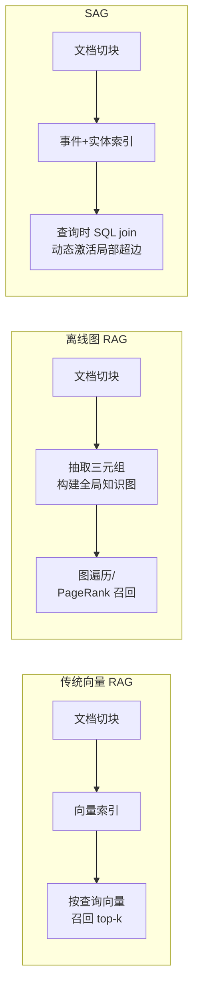
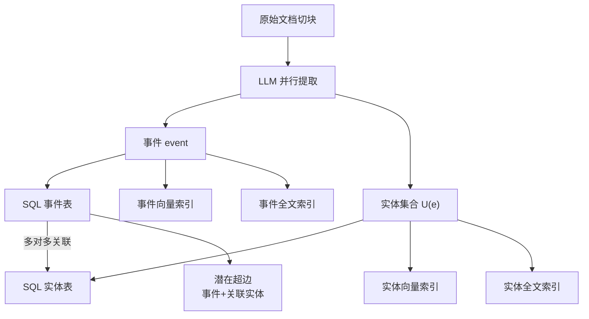
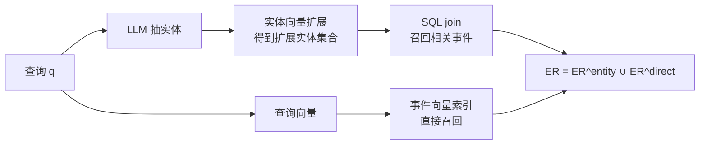
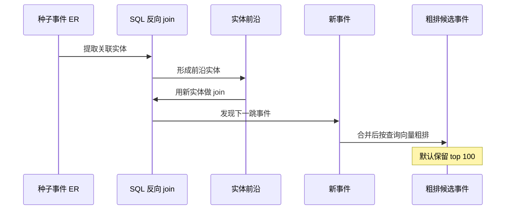
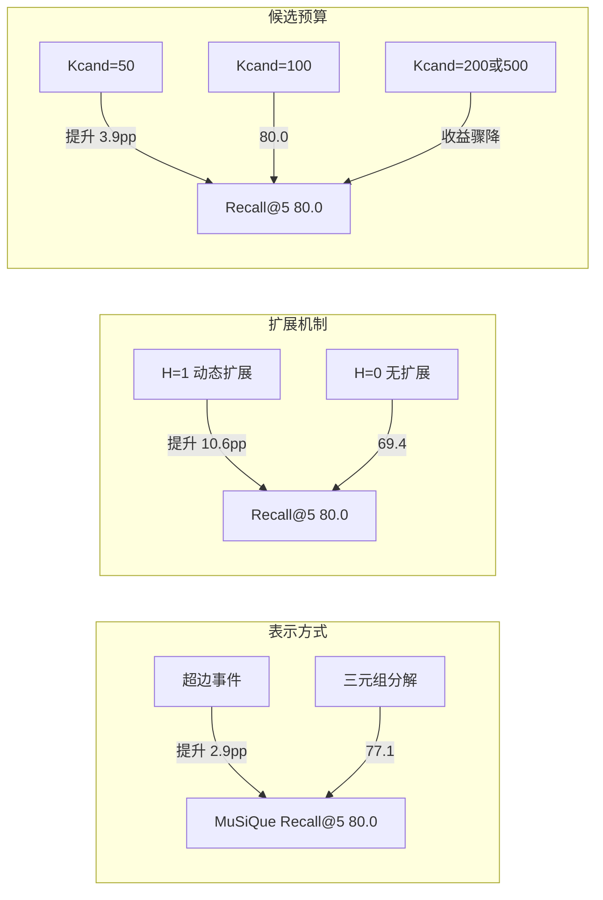

1. Table of Contents, ordered
{:toc}

> 原文：[SAG: SQL-Retrieval Augmented Generation with Query-Time Dynamic Hyperedges](https://arxiv.org/html/2606.15971v1)

# 从“向量召回”到“结构召回”的张力

检索增强生成（Retrieval-Augmented Generation, RAG）把大模型和外部长文本连接起来，主流做法是把文档切成小块、embed 成向量、按语义相似度召回 top-k。这条路在开放域问答里表现不错，但一碰到多步推理（multi-hop reasoning）就暴露边界：模型需要的不只是“语义相近的段落”，而是能跨越多个文档、把实体关系串成证据链的检索能力。

学界和工业界对此走了两条互补路线，各有隐痛：

- **稠密向量召回**：本质还是语义相似匹配，擅长大段文字的“近邻搜索”，却不擅于发现实体之间的显式关联链，更无法把散在多篇文档里的证据组织成结构化链条。
- **离线建图的方法**：先抽取三元组、合并实体、归一化关系，再构建全局知识图（knowledge graph），查询时做图遍历或排序。这样能显式建模关系，但代价沉重：抽取、融合、归一化每一步都会引入错误，建图成本高，数据更新时维护成本甚至可能超过重建成本。更隐蔽的痛点是，这些精心构建的离线结构，到了查询时刻往往退化成“对节点或摘要做平面相似度匹配”，离线结构和在线召回之间出现系统性脱节。

SAG 的出发点是：对于带有结构约束和多跳关联的查询，召回既不该完全交给稠密相似度，也不该依赖预先建好的静态图。它提出了一种“查询时动态结构化”的中间路线。

# SAG 的核心设计：事件-实体索引

SAG 把每个文档块（chunk）转换成两个东西：**一个事件（event）**和**一组实体（entity）**。事件是对该块核心内容的简洁陈述，一个块只对应一个事件；实体则作为索引和扩展的“锚点”，不承载完整语义。事件和它关联的所有实体共同构成一条**潜在超边（latent hyperedge）**。

这里的关键取舍是：

- **事件保留完整语义**，不再被拆成多个独立三元组，从而避免知识图方法里常见的语义碎片化（semantic fragmentation）。
- **实体只做索引点**，覆盖时间、地点、人物、组织、群体、主题、作品、产品、动作、指标、标签等 11 类，通过简单字符串归一化和 SQL 去重即可稳定运行，不需要完整的实体消歧（entity disambiguation）系统。

离线阶段，每个块被并行输出为事件和实体，同步写入三类存储：

1. **SQL 数据库**：记录事件-实体的多对多关联。
2. **向量索引**：事件文本和实体文本各自 embed，用于语义扩展。
3. **全文索引**：支持基于关键词的召回。

这种索引不是“轻量知识图”，而是一个可追加的语义索引层。由于不维护全局静态结构，新增数据只需要 append 新的事件和实体，不需要重建整张图。

# 在线召回：种子、扩展、精选

查询阶段分为三步：**种子召回（seed retrieval）→ 查询时扩展（query-time expansion）→ 最终选择（final selection）**。三个模块分工明确：SQL 负责确定性过滤和 join，向量负责语义扩展（别名、近义词、改写），LLM 只留在最后对压缩后的候选集做少量高价值决策。

## 种子召回：两条路径并行

为便于理解，后文用论文里的例子把每一步串起来：

> 查询 $q$：**“收购 Company B 的那家公司的 CTO 后来加入了哪个项目？”**

SAG 同时走两条路构造初始候选事件集合 $E_R$（$E$ 表示事件 event，下标 $R$ 表示召回 recall）：

- **路径 A：实体引导的结构召回**。LLM 先从查询 $q$ 中抽出种子实体集合 $U_q$。对上面的例子，$U_q = \{\text{Company B}, \text{CTO}\}$（$U$ 表示实体集合，下标 $q$ 表示来自查询 query）。再用每个种子实体去实体向量索引里做相似检索（默认阈值 0.9），召回语义相近的扩展实体 $\hat{U}_{q}$（符号 $\hat{U}$ 表示扩展后的实体集合）——例如 “Company B” 可能扩展出 “Company B Inc.”、“B 公司” 等别名，“CTO” 可能扩展出 “首席技术官”。最后用 SQL join 把与这些实体关联的事件全部捞出来。用集合构造式写就是：

$$E_R^{\text{entity}} = \{ e \mid \exists u \in \hat{U}_{q} : \text{SQL-Join}(e, u) \}$$

其中 $e$ 表示单个事件，$u$ 表示单个实体，$E_R^{\text{entity}}$ 表示通过实体路径召回的事件集合。对这个例子，路径 A 可能捞出 “Company A 收购 Company B” 和 “CTO 某人加入 Project C” 这样的事件。

- **路径 B：查询向量的直接事件召回**。用查询向量去事件索引里做相似检索，保留相似度超过阈值 $\tau$（默认 0.4）的事件，得到 $E_R^{\text{direct}}$。对上面的例子，路径 B 可能直接召回包含 “收购”“CTO”“加入项目” 等关键词、语义上接近查询的事件。

两条路径合并：$E_R = E_R^{\text{entity}} \cup E_R^{\text{direct}}$。路径 A 覆盖结构化的多跳线索，路径 B 覆盖语义上直接相关的段落。

## 查询时扩展：SQL join 实现多跳

从 $E_R$ 出发，SAG 用反向 SQL join 提取这些事件关联的实体，形成**实体前沿（entity frontier）**——也就是新连接到种子事件、但还没被探索的实体；再用这些前沿实体作为桥接点，发现新事件，逐跳扩展候选池。

继续前面的例子：从种子事件 “Company A 收购 Company B” 可以反向提取出实体 “Company A”；从 “CTO 某人加入 Project C” 可以提取出 “Project C” 和 “某人”。这些新实体构成实体前沿。默认扩展跳数 $H = 1$（$H$ 表示 hops，即扩展跳数），用前沿实体再做一次 SQL join，可能发现 “Company A 的 CTO 是某人” 这类中间事件，把原本分散在多个文档里的证据串起来。

扩展只做 SQL join，不做 PageRank，也不做图推理。每轮只引入未见过的新实体和新事件。扩展得到的新事件集合记为 $E_E$（第二个下标 $E$ 表示 expansion 扩展），与 $E_R$ 合并成完整候选池：

$$E_{\text{cand}} = E_R \cup E_E$$

再用查询向量粗排，保留前 $K_{\text{cand}}$（默认 100）个候选事件 $\hat{E}$（$\hat{E}$ 表示粗排后的候选事件集合）。

## 最终选择：结构路径与语义路径合并

SAG 同时输出两条路径的结果，再合并去重：

- **结构路径**：LLM 对 $\hat{E}$ 做精排，选前 $K_{\text{event}}$（默认 5）个事件，映射回原始块集合 $C_{\text{event}}$（$C$ 表示文档块 chunk）。对例子而言，结构路径会选出 “Company A 收购 Company B” 和 “CTO 某人加入 Project C” 对应的原文章节。
- **语义路径**：用查询向量直接在块索引里召回前 $K_{\text{direct}}$（默认 5）个原始块 $C_{\text{direct}}$，用于兜底语义直接相关的段落。

最终输出由两类块合并取前 $K_{\text{out}}$ 个得到：

$$C_{\text{out}} = \text{TopK}_{K_{\text{out}}}(C_{\text{event}} \cup C_{\text{direct}})$$

默认 $K_{\text{out}} = 10$。结构路径补的是跨文档、跨实体的中间证据；语义路径保的是查询直接命中、语义相近的段落。

# 可解释性：每一步都能定位

整个流程天然形成一条可审计的链：

$$q \rightarrow U_q \rightarrow \hat{U}_{q} \rightarrow E_R \rightarrow E_{\text{cand}} \rightarrow \hat{E} \rightarrow C_{\text{out}}$$

每个环节的结果都可见。以前面的例子“收购 Company B 的那家公司的 CTO 后来加入了哪个项目？”为例：若查询实体 $$U_q$$ 为空，说明实体没抽出来；若扩展实体 $$\hat{U}_{q}$$ 为空，说明别名扩展失败；若 SQL join 返回空，说明实体链接失败；若候选池 $$E_{\text{cand}}$$ 为空，说明扩展没召回新候选。这种逐段可定位的调试体验，比端到端黑盒分数更友好。

# 实验：三个多跳基准上的召回

论文在 HotpotQA、2WikiMultiHopQA、MuSiQue 三个多跳问答基准上评测。三个数据集难度递增：HotpotQA 以 2 跳桥接/比较问题为主；2WikiMultiHopQA 覆盖桥接、比较、推理，需要同时定位中间段落和答案段落；MuSiQue 通过反事实过滤保证每一步都不可跳过，是检验多跳机制最严的试金石。

主实验用统一配置：BGE-Large-EN-v1.5 做 embed，Qwen3.6-Flash 做抽取和重排。SAG 在 9 个 Recall@K 指标里拿下 8 个最佳，平均 Recall@2/5 达到 79.3%/88.2%，比 HippoRAG 2 高出 11.1/4.9 个百分点。

| 数据集 | 方法 | Recall@2 | Recall@5 |
|--------|------|----------|----------|
| HotpotQA | SAG | 91.6% | 96.5% |
| HotpotQA | HippoRAG 2 | 78.4% | 94.4% |
| 2WikiMultiHop | SAG | 82.3% | 88.0% |
| 2WikiMultiHop | HippoRAG 2 | 76.6% | 90.4% |
| MuSiQue | SAG | 64.1% | 80.0% |
| MuSiQue | HippoRAG 2 | 49.5% | 65.1% |

MuSiQue 上差距最大：SAG Recall@5 达到 80.0%，HippoRAG 2 只有 65.1%。这与两者的机制差异一致：SAG 用 SQL join 确定性扩展共享实体路径，每跳覆盖清晰可控；HippoRAG 2 通过 Personalized PageRank 在全局图上传播分数，远距离节点受阻尼因子衰减，噪声节点沿间接路径叠加，跳数越长问题越严重。

HotpotQA 上两者 Recall@5 接近（96.5% vs 94.4%），因为 2 跳链路上 PageRank 衰减尚未充分显现；但 SAG 的 Recall@2 仍领先 13.2 个百分点，说明超边结构对头部排序有稳定增益。

2WikiMultiHop 上 SAG 的 Recall@5（88.0%）略低于 HippoRAG 2（90.4%），但 Recall@2 仍领先（82.3% vs 76.6%）。论文分析，2WikiMultiHop 部分问题涉及极长的实体链，当某个桥接实体在语料中频率极低时，SAG 固定的前沿裁剪预算（默认 50）可能过早截断它，导致远端事件进不了候选池。而 HippoRAG 2 的全局 PageRank 能通过全图传播触达这些低频节点。这是 SAG 当前裁剪策略的明确弱点，主要影响尾部召回而非头部命中。

# 消融：机制拆开看

论文在 MuSiQue 上做消融，逐项验证设计选择。

## 超边 vs 三元组

把事件拆成 (subject, predicate, object) 三元组、每条三元组独立索引并参与 SQL join，其余流程不变。三元组版 SAG 的 Recall@5 为 77.1%，比超边版（80.0%）低 2.9 个百分点，但仍比 HippoRAG 2 的 65.1% 高出 12 个百分点。这说明：

- **架构差距占大头**：在表示方式等价的情况下，SQL join 逐跳确定性扩展仍然显著优于全局 PageRank 传播。
- **超边再补 2.9 点**：超边把多个实体压缩在一条记录里，一次 SQL join 就能同时激活所有相关路径；三元组每条记录只覆盖两个端点，达到同等覆盖需要更多跳数，每跳都多一层裁剪损失。

## 查询时扩展的贡献

把扩展跳数 $H$ 设为 0，其余不变。Recall@5 从 80.0% 掉到 69.4%，而 Recall@1 几乎不变（36.2% vs 35.7%）。这说明扩展的作用不是把已有候选排得更前，而是**补上向量召回单独无法浮出的证据**。这些通过共享实体路径引入的事件，与查询缺乏直接语义重叠，所以向量相似度很难把它们顶到首位；但它们正是多跳推理链里的关键中间证据。

## 候选数量与成本权衡

把传给 LLM 的候选事件数 $K_{\text{cand}}$ 从 50 提到 100，Recall@5 从 76.1% 升到 80.0%，收益明显；再提到 200 或 500，边际收益迅速衰减，低于 0.089 Recall@5 点/百万输入 token。因此默认取 100，作为召回质量与 LLM 调用成本的平衡点。

---

# 核心

SAG 最值得记住的洞察不是“用 SQL 替代图数据库”这种工具替换，而是把“结构化关系”从离线预计算搬到查询时按需激活。它用事件保留语义完整性，用实体做轻量桥接，用 SQL join 做确定性、可审计的多跳扩展——这样既能获得结构化召回的精确性，又避免了全局静态图的维护债务。这个设计的工程意味很强：它把 RAG 的“结构能力”建立在标准数据库基础设施上，天然支持增量写入、并发扩展，并把 LLM 调用压缩到少量高价值决策点。

另一个容易被忽略的点是，SAG 把“超边”从离线预构建变成查询时局部实例化。传统超图 RAG 先建超图再近似匹配，SAG 则反其道而行：先只建事件-实体表，查询时通过共享实体把若干事件临时聚合成局部超边。这让它同时保留了高阶关系的表达力和增量系统的轻量性。

# 评价

**说得好、做得扎实的地方：**

- 问题定位准确：点出了稠密召回和离线图 RAG 各自的结构性缺陷，尤其是“离线结构到在线召回之间系统性脱节”这一点，切中 GraphRAG 类方法的实际痛点。
- 机制设计干净：SQL join 做扩展、向量做语义扩展、LLM 做最终精排，三层分工清晰，没有为了炫技而堆模块。
- 消融做得透：超边 vs 三元组、$H=0$ vs $H=1$、$K_{\text{cand}}$ 变化，三个实验把收益来源拆得清楚，说明作者理解自己的系统为什么有效。
- 不回避弱点：2WikiMultiHop 上 Recall@5 略低时，主动归因于低频桥接实体被裁剪预算截断，这种分析比单纯报喜更有价值。
- 工程真实性：论文提到已在数亿级数据规模上部署，在线检索延迟控制在秒级，这对一个学术向的 RAG 架构论文来说是少见的落地背书。

**值得追问或存疑的地方：**

- **实体抽取仍是瓶颈**：SAG 虽然规避了实体消歧，但查询侧和文档侧的实体抽取质量直接决定整条链路。论文没有深入分析实体漏抽、错分类型对最终召回的影响。如果 LLM 把“CTO”漏掉或把组织名错标成人名，后续 SQL join 再好也无济于事。
- **$H=1$ 是否足够？** 默认只扩展 1 跳，在 4 跳的 MuSiQue 上却能拿到 80% Recall@5，这意味着种子召回本身已经覆盖了关键桥接点，扩展更多是“补证据”而非“走长链”。对于需要真正 3-4 跳连续推理的企业场景，$H=1$ 是否仍然够用，论文没有给出更激进的实验。
- **评测指标偏乐观**：Recall@K 的 any-hit 标准只要求 top-K 里出现至少一个支撑段落，不要求覆盖完整推理链。这在实际 agent 场景中可能高估系统能力——模型可能拿到部分证据但仍推不出答案。
- **LLM 成本与延迟**：虽然论文提到生产延迟在秒级，但没有给出在线 LLM 调用次数、端到端延迟分解、与 HippoRAG 2 的成本对比。在 $K_{\text{cand}}=100$ 时，每次查询都要 LLM 重排，批量高并发场景下的开销仍需验证。
- **对比基线偏少**：主对比只有 HippoRAG 2，其他图 RAG 方法只是文献引用，没有同配置跑分。如果能补上 StructRAG、SiReRAG 等同配置结果，结论会更硬。

总体而言，SAG 是一篇把“结构召回”重新定义为“查询时动态结构化”的扎实工作，工程取舍理性，实验分析诚实。它未必终结 GraphRAG vs 向量 RAG 的争论，但确实提供了一条值得认真对待的中间路线。