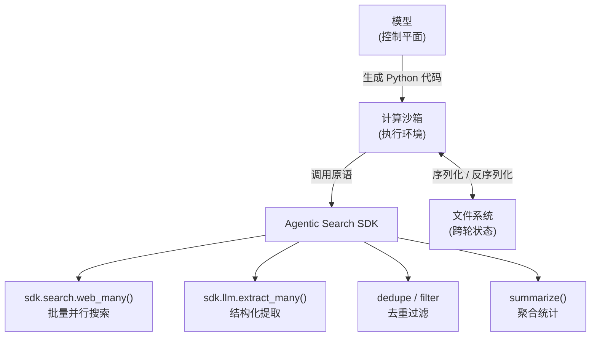
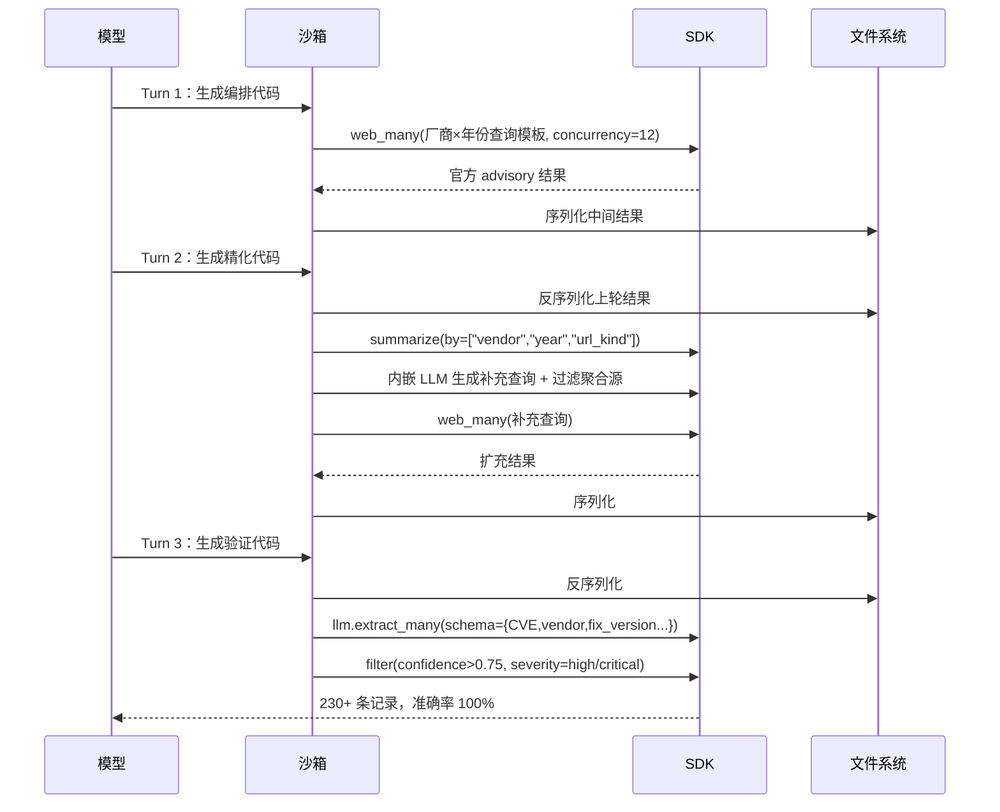
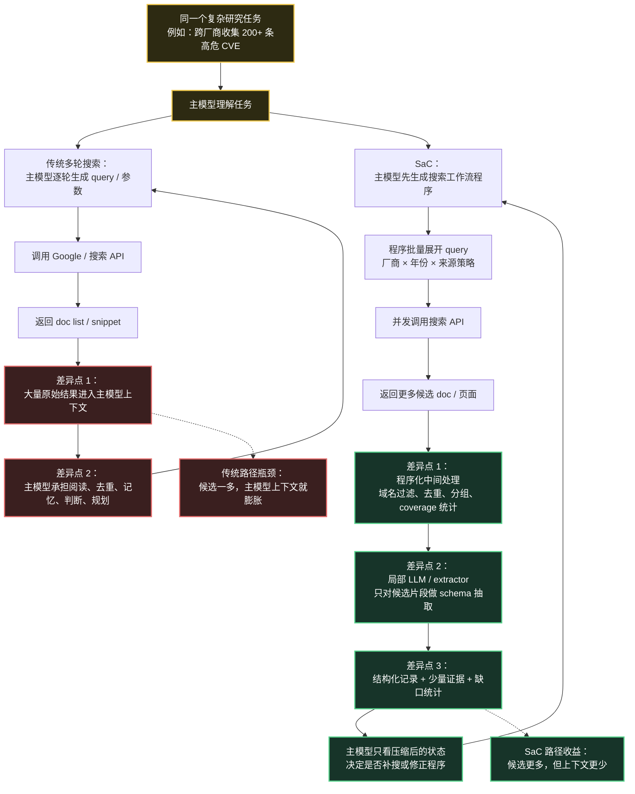
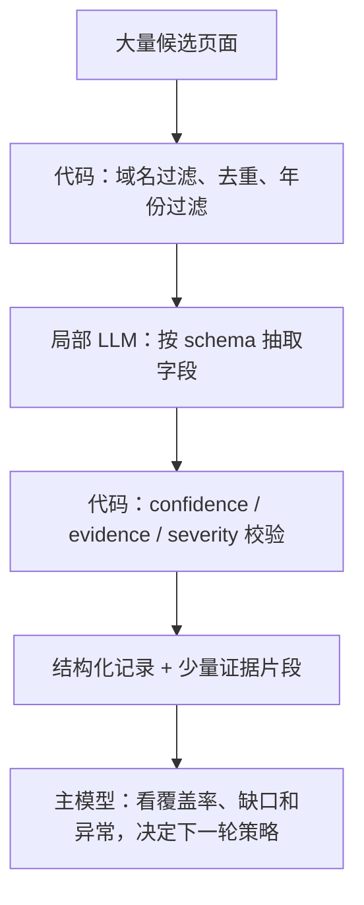
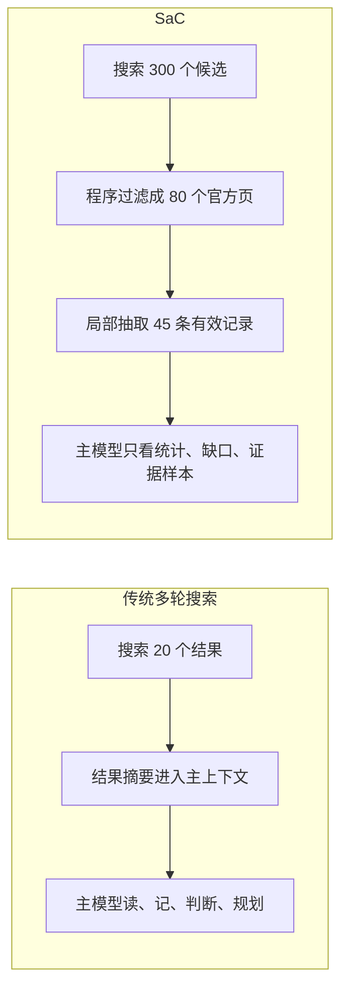
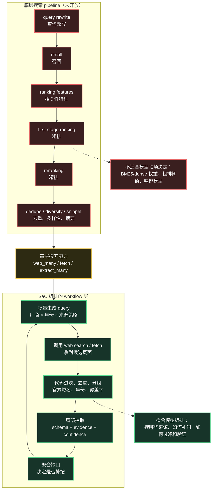
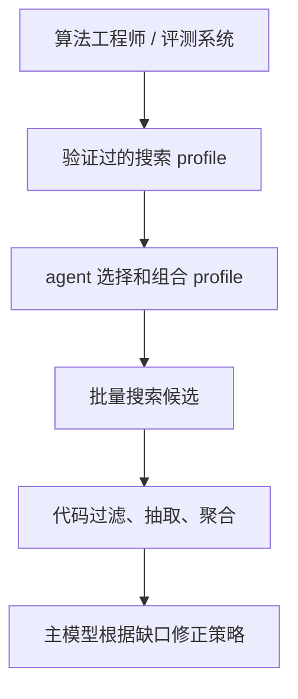
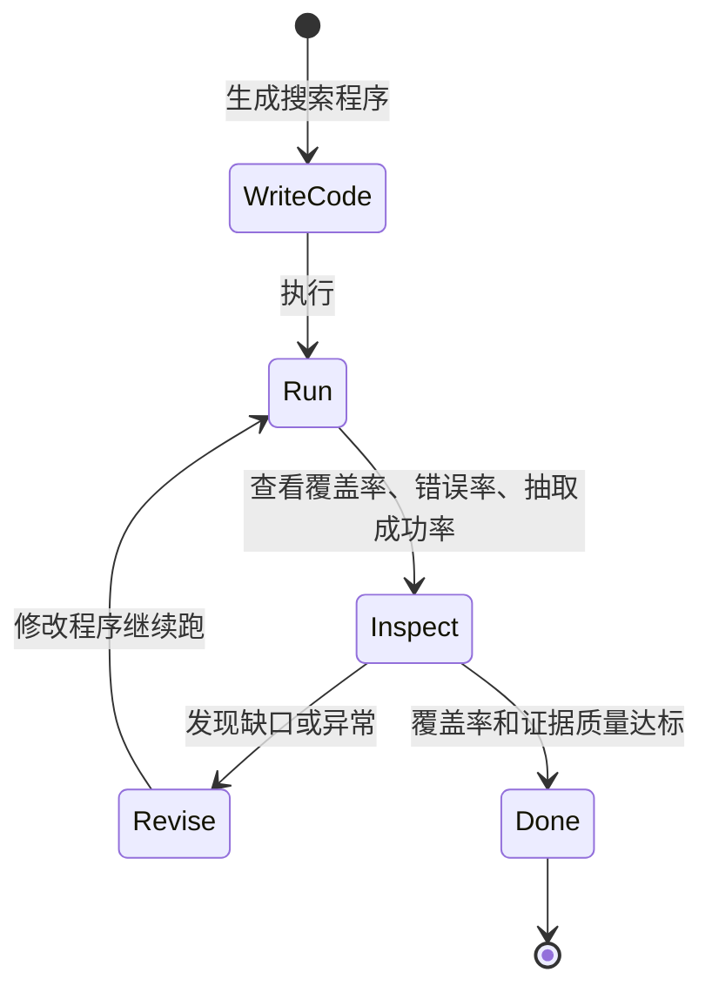

1. Table of Contents, ordered
{:toc}

> 原文：[Rethinking Search as Code Generation](https://research.perplexity.ai/articles/rethinking-search-as-code-generation)

先把结论放前面：**SaC 更准确地说不是 Search Pipeline as Code，而是 Search Workflow as Code**。它不是真的让模型自由改造搜索引擎内部的召回、粗排、精排，而是用 skill 教模型写搜索工作流程序。

它最核心的收益可以压缩成一句话：

> **候选更多，但上下文更少。**

也就是：系统可以大胆扩大检索面，搜更多 query、更多来源、更多候选页面；但不会把这些原始结果全部塞进主模型上下文，而是先用程序化过滤、结构化抽取和局部模型调用压缩成更干净的中间结果。

AI agent 越来越多地承担需要大量检索的任务——调研竞品、分析漏洞库、追踪技术文档。但这些 agent 所使用的搜索接口，本质上还是为人类设计的：输入一条查询，返回一页结果，由人类判断下一步。

当模型取代人类坐在搜索框前，这套流程开始暴露出深层矛盾。

# 固化管道的三个裂缝

传统搜索系统把检索逻辑封装成黑盒——模型只能看到最终输出，无法触及排序信号、候选集过滤逻辑或子文档粒度的内容。这种架构给 AI agent 带来了三个具体问题。

**信息粒度太粗**。同一个单体管道（monolithic pipeline）对所有任务用同一套召回与精排配置。但不同任务对信息的需求差异极大：有时需要广泛扫描官方来源，有时需要针对特定时间段精确匹配，系统无法按需调整。

**领域知识被封死**。模型本身可能知道“Mozilla 安全公告在 `mozilla.org/en-US/security/advisories` 下”“Chrome 版本信息在 release notes 里”。但面对固定的搜索接口，这些知识只能以查询词的形式隐式表达，无法直接影响检索策略。

**控制流效率低下**。多轮检索的中间结果全部进入模型上下文，造成上下文污染（context pollution）。过滤、聚合、去重等操作本可以用确定性代码完成，却不得不消耗 token 在模型的推理空间里完成。

原文的核心判断是：最强大的 AI 系统需要能够“决定*如何*检索上下文、处理上下文、聚合上下文、呈现上下文”，而不是只能消费固定管道的产出。

# Search as Code：倒转主客关系

Perplexity 的方案叫做 Search as Code（SaC）。思路是把搜索系统从一个黑盒服务，拆解成一套可编程的原语（primitive）库，让模型通过生成 Python 代码来主动编排检索流程，而不是被动消费搜索结果。

原文的表述是：“让模型伸入搜索栈内部，而不仅仅是消费它的最终输出。”这句话容易让人误以为模型可以直接重排底层搜索 pipeline。更谨慎的理解是：**模型主要伸入的是搜索任务工作流，而不是搜索引擎内部的 ranking pipeline**。

这是一次主客关系的倒转。原来是“模型调用搜索 API，等结果”；现在是“模型写代码，告诉搜索栈怎么运行”。模型从搜索的消费者变成搜索流程的编排者。

# 三层架构

SaC 由三层组成，分工清晰：



**模型（控制平面）**：负责理解任务、拆解检索子目标、生成 Python 代码。模型不直接调用搜索 API，而是通过代码声明整个检索策略。

**计算沙箱（compute sandbox，执行环境）**：安全执行模型生成的代码，支持条件分支、异步、并行、批处理和自动重试。单次推理轮次（inference turn）内可以驱动数千个原子操作。

**Agentic Search SDK（原子接口层）**：把 Perplexity 的搜索基础设施拆成可组合的模块——批量搜索、结构化提取、去重、过滤、聚合、子文档检索等——每个都是独立可调用的函数，而不是预打包的单体端点。这里的“原子化”主要发生在 agent 工作流层，**不等于把底层 BM25 / dense retrieval / 粗排 / 精排参数交给模型自由组合**。

## 为什么选 Python

团队评估了 Python、Rust、TypeScript 和 Bash 四种运行时。Python 胜出的理由是“在数据处理生态和模型代码生成能力上最自然”，并通过实验验证了这一结论。这个选择不是一劳永逸的，会随着前沿模型能力和使用场景的变化持续重新评估。

## Agent Skills：不只是 API 文档

SDK 的使用文档本身也是精心设计的产物，Perplexity 把它叫做智能体技能文档（Agent Skills）。与普通 API 文档不同，Skills 的定位不是“列出有哪些函数”，而是“教模型怎么把这些函数组合成有效的流程”。

每个根文件的 token 预算控制在 2000 以内，防止上下文膨胀。文件里除了函数签名，还有少样本示例（few-shot examples）和编排模式指导，帮助模型在面对复杂任务时直接套用可验证的代码框架。

Skills 本身也在持续优化——通过专门的自动研究循环（autoresearch loop），以延迟、代码生成质量和任务准确率为指标，连续数周迭代，驱动了 SDK 结构和风格上的大量改动。

## 状态管理：文件系统还是 REPL

多轮任务需要跨推理轮次保存中间状态。团队考虑过两种方案：

- **REPL 持久化**：变量在会话中自动保留，代码更简洁
- **文件系统 + 显式序列化反序列化（serde）**：每轮代码明确写入和读取状态

实验结果是文件系统方案在长轨迹任务上更可靠。背后的推测是：要求模型显式声明“我保存了什么、下一轮读什么”，能帮助模型更清晰地管理信息，而 REPL 的隐式状态积累容易引发命名空间混乱，在几十轮操作之后尤为明显。团队也坦诚这个结论仍是实验性的，还在持续迭代。

# CVE 漏洞库构建：一个贯穿三轮的例子

用一个具体任务来看 SaC 的工作机制：**从 2023—2025 年各厂商官方渠道收集 200+ 条高危 CVE，每条记录需包含受影响产品、修复版本，以及 CVE 与修复版本的明确对应关系，来源必须是厂商官方 advisory**。

这个任务的难点在于三个约束叠加：数量门槛、来源限制、字段绑定——正好把固化管道的所有短板都暴露出来。非 Perplexity 系统在这个任务上准确率全部低于 25%。



**Turn 1（扇出编排）**：模型生成代码，把领域知识直接编码为查询模板——`('Mozilla', 'site:mozilla.org/en-US/security/advisories ...')`、`('Jenkins', 'site:jenkins.io/security/advisories ...')`、`('Chrome', 'site:chromereleases.googleblog.com ...')`。然后调用 `sdk.search.web_many(queries, limit_per_query=8, concurrency=12)` 并行扫描所有厂商和年份组合，同时过滤只保留官方 advisory URL。

**Turn 2（自适应精化）**：代码调用 `summarize(pages, by=["vendor", "year", "url_kind"])` 统计覆盖情况，识别稀疏的厂商-年份组合，再调用内嵌 LLM 生成针对性补充查询，并验证这些查询不包含 NVD、MITRE、CERT 等聚合源——因为任务要求来源必须是厂商官方。

**Turn 3（结构化验证）**：去重后，调用 `sdk.llm.extract_many()` 批量提取，schema 强制要求：CVE 编号、厂商、产品、修复版本、严重性、来源 URL、证据文本、`version_bound_to_cve` 标志位、置信度。代码过滤 `confidence > 0.75`、`version_bound_to_cve=True`、严重性为 high 或 critical 的记录，持续补充直到满足数量要求。

最终结果：准确率 100%，token 使用量从基线的 288,700 降至 42,900（减少 85.1%）。

# 五项基准的对比结果

| 基准 | Perplexity (SaC) | OpenAI | Anthropic | Exa | Parallel |
|------|:---:|:---:|:---:|:---:|:---:|
| DSQA | **0.871** | 0.733 | 0.815 | 0.530 | 0.810 |
| BrowseComp | **0.805** | 0.720 | 0.598 | 0.380 | 0.560 |
| HLE | **0.612** | 0.614 | 0.566 | 0.387 | 0.515 |
| WideSearch | **0.651** | 0.522 | 0.590 | 0.471 | 0.584 |
| WANDR | **0.386** | 0.130 | 0.152 | 0.057 | 0.126 |

相比非 SaC 基线，DSQA 提升 19.77 个百分点（相对提升 29%），WANDR 提升 12.00 个百分点（相对提升 45%）。WANDR 上的领先尤为突出——最接近的竞争系统得分 0.152，Perplexity 以 2.5 倍优势领先。

在成本-性能边界（cost-performance frontier）上，SaC 在低推理配置下比所有其他系统都便宜，同时性能优于其中两个；中等推理配置下每任务成本低于 1 美元，但性能超过所有非 SaC 系统。

# 混合计算的更大图景

论文最后提出了一个更宏观的框架：**最强大的计算系统，将把语言模型推理与确定性运行时（deterministic runtime）结合起来，而不是二选一**。

Token 空间的推理（reasoning in token space）擅长判断“什么证据重要”；确定性运行时擅长批量处理、过滤、排序和聚合。搜索基础设施是连接两者的 I/O 桥梁。

SaC 的可能后续方向包括：把 SDK 优化和 Skills 优化合并到同一个自动研究循环、在模型训练阶段引入低级原语的直接利用，以及让 SDK 设计与模型能力协同演化。

Perplexity 认为这个模式不局限于搜索，凡是涉及“语言理解 + 大量确定性操作”的领域，都可以用类似方式重构。

---

# 核心

SaC 的本质洞察是：**搜索不只是模型的输入源，搜索流程本身应该是模型可以编程的对象**。当模型能写代码来控制“怎么搜”，它就能把领域知识直接编码进检索策略，把并行、过滤、验证等逻辑从 token 空间移到确定性执行层，同时大幅减少上下文污染。

CVE 案例最能说明这一点：传统系统把收集 200+ 条高危漏洞当成一个检索-理解任务，而 SaC 把它分解成“编码领域知识 → 并行扫描 → 自适应补充 → 结构化验证”四个确定性步骤，每步都有代码保障，而不是依赖模型在上下文里推理。这就是为什么准确率能达到 100% 而 token 消耗反而降了 85%。

另一个值得记住的细节是文件系统 serde 的选择。显式声明“我保存了什么”看起来是冗余操作，但在长轨迹任务里，它实际上帮助模型保持对状态的清晰认知——和软件工程里“显式优于隐式”的原则一脉相承。

# 评价

**说得好的地方**：架构分层清晰，三层职责不重叠。CVE 案例不是为了炫技，而是一个真实揭示传统系统失败原因的任务——数量门槛、来源限制、字段绑定三个约束叠加，正好把固化管道的所有短板都暴露出来。文章也诚实地承认“文件系统 vs REPL 的结论是实验性的，仍在迭代”，没有过度美化。

**有问题的地方**：基准测试的公正性存疑。Perplexity 同时设计基准、运行自己的系统、汇报结果，对手方是否在相同条件下运行、用的是哪个版本、是否做过针对性优化，文章没有说明。WANDR 2.5× 的领先幅度让人印象深刻，但也让人想问：这个基准是不是天然更适合 SaC 的架构？

**没说到的地方**：SaC 对延迟的影响几乎没有讨论。代码生成、沙箱启动、跨轮序列化都有额外开销，文章只提到“autoresearch loop 以延迟为优化指标之一”，但没有给出具体数字。对于实时或交互式搜索场景，这个代价是否可接受，读者无从判断。

**隐含假设**：Python 代码生成的可靠性被默认为已解决的问题。现实中，模型生成的代码可能有运行错误、逻辑错误或安全风险，这些在文章里几乎没有涉及。沙箱的隔离机制和错误恢复策略也语焉不详。此外，整个方案高度依赖 Perplexity 自己的搜索基础设施，可移植性有限——这是一篇技术营销文章，而不是通用架构设计指南。

# FAQ：SaC 到底新在哪里

## SaC 和“用 Google API 多轮搜索”有什么区别？

如果只看单次搜索能力，区别没有想象中那么大。Google API 本来就支持 `site:`、时间范围、语言、地区等参数，agent 也可以通过多轮调用不断调整 query。

真正的差别在于抽象层级：**传统方案是模型反复调用搜索接口；SaC 是模型先写一个搜索工作流程序，再由程序批量调用搜索、过滤、抽取和聚合。**



一句话：**Google API 让模型更会用搜索；SaC 让模型临时写出一个搜索任务处理器。**

## 如果过滤和抽取仍然需要 LLM，SaC 凭什么省上下文？

SaC 不是把 LLM 从流程里拿掉，而是把 LLM 的使用拆开：**主模型负责编排，局部模型负责抽取，确定性代码负责机械处理。**

很多过滤根本不需要 LLM：

- URL 是否属于官方域名
- 年份是否在目标区间
- 是否匹配 CVE 正则
- 是否来自 NVD、MITRE、CERT 等聚合源
- 是否重复
- 字段是否为空
- 置信度是否超过阈值

真正需要语言理解的部分，例如“这个版本号是否确实修复了这个 CVE”“严重程度是 High 还是 Critical”，仍然可以调用 LLM。但它被限制为**局部字段抽取任务**，而不是让主模型在一个巨大的上下文里同时读网页、维护状态、规划下一步。



所以 SaC 的收益不是“不用模型判断”，而是：**不要让同一个主模型上下文承担所有判断。**

## “候选更多，但上下文更少”是什么意思？

这是 SaC 最值得记住的一句话：**候选更多，但上下文更少。**

传统 multi-turn 搜索为了不把上下文撑爆，往往只能让模型读有限数量的结果；SaC 反过来，先大胆扩大候选集，再用程序和局部抽取把原始网页压缩成结构化中间结果。



可以把它概括成两个动作：

- **扩大检索面**：搜索更多 query、更多来源、更多候选页面。
- **压缩推理面**：只把高质量结构化结果和必要证据交给主模型。

这也是为什么 SaC 适合复杂研究任务，而不是简单问答。简单问题搜三五个页面就够了，SaC 反而可能显得笨重；但当任务需要跨几十个来源收集几百条记录时，这种架构就能发挥优势。

## SaC 是 Search Pipeline as Code 吗？

严格说不是。更准确的名字应该是：**Search Workflow as Code。**

搜索系统内部的 pipeline 包括 query rewrite、召回、相关性特征、粗排、精排、多样性控制、freshness boost、authority boost 等阶段。Perplexity 文章展示的 SaC 并没有把这些底层模块完全开放给模型自由组合。



Perplexity 开放的是上层任务编排能力，例如 `web_many()`、`extract_many()`、`filter()`、`summarize()`，而不是让模型直接决定 BM25 和 dense retrieval 的权重、粗排阈值或精排模型。

这个边界是合理的。**底层 ranking pipeline 不适合让大模型临场猜参数**，因为相关性质量依赖离线评测、在线实验和长期反馈闭环。模型可以理解任务意图，但很难凭空决定“BM25 权重应该是 0.37 还是 0.52”。

## 那更理想的接口形态是什么？

更现实的方向不是让模型自由组合所有底层搜索模块，而是提供一组**经过搜索工程师验证过的策略档位**，再让模型在任务层编排它们。

```python
sdk.search(
    query,
    profile="official_sources_high_precision",
    time_range="2023-2025"
)

sdk.search(
    query,
    profile="broad_recall_research",
    diversity="high"
)

sdk.search(
    query,
    profile="technical_docs",
    source_types=["docs", "github", "spec"]
)
```

这些 `profile` 背后仍然可以包含复杂的 query rewrite、hybrid retrieval、authority boost、freshness adjustment 和 cross-encoder rerank。但这些底层策略应该由搜索团队调优，而不是由模型临场拍脑袋。



更准确的分工是：

- **搜索团队**：保证底层召回、排序、精排和 profile 质量。
- **大模型**：根据任务选择搜索策略，组织多轮探索和补洞。
- **程序运行时**：承担去重、过滤、统计、阈值判断等机械工作。
- **局部抽取模型**：在必要时从页面里抽取结构化字段和证据。

## SaC 最大的风险是什么？

最大风险是：**第一版程序如果写错，错误会被批量放大。**

例如模型漏掉某些官方域名、错误排除了有用页面、把过滤条件写反，后面的并发搜索和批量抽取都会沿着错误方向高速执行。SaC 的优势会变成劣势：错得更系统、更快、更隐蔽。

因此 SaC 不能只依赖“模型一次写对程序”，还需要运行反馈和中间指标：



一个健康的 SaC 流程应该暴露这些指标：

- 每个来源、年份、主题的覆盖率
- 官方来源占比
- 抽取成功率
- `unknown` 字段比例
- 带证据记录的比例
- 低置信度记录数量
- 去重前后的候选数量

这也是 SaC 相比纯自然语言多轮检索更工程化的地方：**错误更容易定位到 query 生成、过滤条件、schema 抽取或覆盖率统计这些具体环节。**

## 最终怎么理解 Perplexity 的 SaC？

可以把它压缩成这句话：

**SaC 是用 skill 教模型写搜索工作流程序，通过更大的检索扇出、更机械化的中间处理、更局部化的模型抽取，减少主模型上下文负担，从而在复杂检索任务中保留更多有效 doc、丢掉更多噪音 doc。**

它的关键不是减少搜索 query，而是：

> **扩大检索面，压缩推理面。**

也就是前面那句：**候选更多，但上下文更少。**
