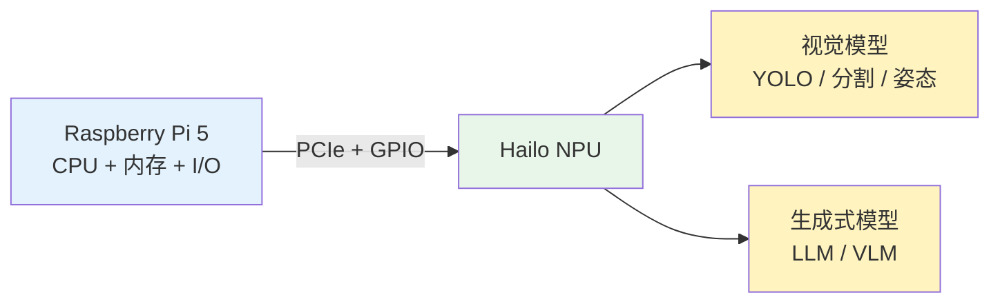
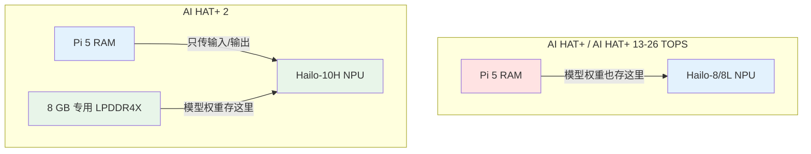
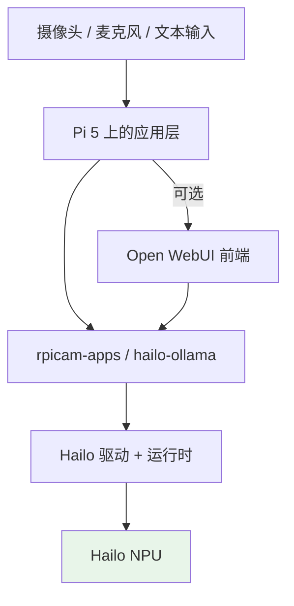
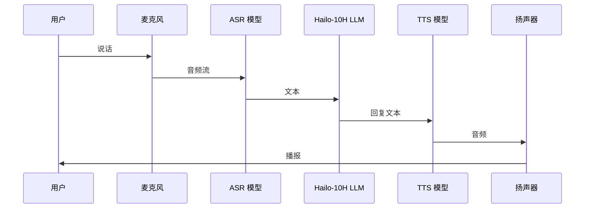
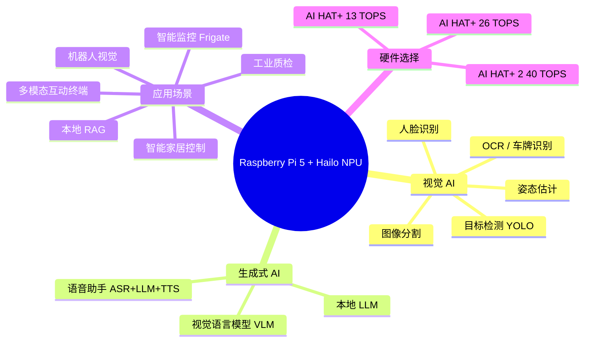

最近翻到树莓派官方文档里关于 [AI 的章节](https://www.raspberrypi.com/documentation/computers/ai.html)，才发现 Raspberry Pi 5 现在已经不是当年那个只能跑简单脚本的小板子了。官方给 Pi 5 配了一套完整的 AI 加速器方案，从视觉检测到本地大语言模型都有覆盖。这篇文章把这次梳理的内容整理成一份清晰的参考：树莓派的 AI 到底是怎么做的、不同硬件之间有什么区别、以及它到底能干什么、不能干什么。

1. Table of Contents, ordered
{:toc}

## 一、树莓派做 AI 的底层思路：CPU 不够，NPU 来凑

树莓派的 CPU 性能放在今天并不算强，直接用它跑神经网络推理会非常吃力。所以树莓派官方的 AI 方案并不是让 BCM2712 自己硬扛，而是给 Pi 5 外挂一颗专门处理神经网络的芯片——**NPU（Neural Processing Unit，神经网络处理器）**。

这套方案的核心合作方是 **Hailo**。Hailo 是一家做边缘 AI 加速器的公司，它的 NPU 专为低功耗、高效率的神经网络推理设计。树莓派官方把 Hailo 的芯片做成了三种扩展配件，插到 Pi 5 上就能跑 AI。



这个分工很关键：Pi 5 负责操作系统、数据输入输出和整体调度，Hailo NPU 负责神经网络的前向推理。对视觉任务来说，摄像头画面可以实时送进 NPU；对 LLM 来说，文本生成也完全 offload 到 NPU 上，Pi 5 的 CPU 基本不参与计算。

## 二、三种硬件方案对比

目前树莓派官方提供了三种接入 Hailo NPU 的方式：

| 方案 | 搭载的 NPU | 算力 | 专用内存 | 能否跑 LLM | 官方建议 |
|---|---|---|---|---|---|
| **Raspberry Pi AI Kit** | Hailo-8L | 13 TOPS | 无 | 否 | 已停产，不推荐新设计 |
| **Raspberry Pi AI HAT+** | Hailo-8L / Hailo-8 | 13 / 26 TOPS | 无 | 否 | 新设计推荐 |
| **Raspberry Pi AI HAT+ 2** | **Hailo-10H** | **40 TOPS** | **8 GB LPDDR4X** | **是** | 需要 LLM 时必选 |

这里有几个容易混淆的地方需要拆开讲。

### 2.1 AI Kit 与 AI HAT+ 的区别

**AI Kit** 是一个带 Hailo-8L 的 M.2 HAT+，通过 PCIe 接到 Pi 5 上。它是最早的方案，但官方已经宣布停产。如果你现在新入手，应该直接看 **AI HAT+** 系列。

**AI HAT+** 把 NPU 直接做在板子上，形态更紧凑，插在 Pi 5 的 40-pin GPIO 上，通过 FFC 软排线走 PCIe。它有 13 TOPS（Hailo-8L）和 26 TOPS（Hailo-8）两个版本，只能跑视觉 AI，不能跑 LLM。

### 2.2 AI HAT+ 2 为什么能跑 LLM

**AI HAT+ 2** 换上了 **Hailo-10H** 芯片，官方标称 **40 TOPS**。但真正让它能跑大语言模型的不是算力数字，而是它带了 **8 GB 专用 LPDDR4X 内存**。

前代 AI HAT+ 跑模型时，权重和数据都存在 Raspberry Pi 5 的系统内存里。LLM 就算量化到 1B 参数，也需要占用数 GB 内存，Pi 5 的 4GB/8GB 会被吃得所剩无几。AI HAT+ 2 的 8GB 内存是 NPU 独占的，模型完全加载在板载内存里，Pi 5 自己的内存可以腾出来干别的。



### 2.3 40 TOPS 的精度陷阱

AI HAT+ 2 的 40 TOPS 是 **INT4 精度**下的峰值算力。前代 26 TOPS 是 **INT8**。INT4 量化能让模型体积更小、推理更快，但也会损失一些精度。所以官方文档自己也说，AI HAT+ 2 的**计算机视觉性能其实和 26 TOPS 的 AI HAT+ 差不多**，真正的提升在生成式 AI 上。

如果只看“40 TOPS 比 26 TOPS 快很多”就下单，可能会失望。它的价值在于第一次让树莓派能本地跑 LLM/VLM，而不是单纯把视觉任务再提速一倍。

## 三、软件栈长什么样

硬件之外，软件栈也是树莓派官方已经搭好的。主要分几层：

1. **驱动与固件**：`hailo-all`（前代）或 `hailo-h10-all`（AI HAT+ 2），包含内核驱动、运行时、后处理库。
2. **相机软件栈**：`rpicam-apps` 直接支持 Hailo 后处理，可以一行命令跑 YOLO 等视觉 demo。
3. **LLM 后端**：`hailo-ollama` 服务器，暴露 REST API，类似 Ollama 的用法。
4. **可选前端**：Open WebUI，通过 Docker 部署，提供浏览器聊天界面。



对视觉任务来说，装好依赖后可以直接用 `rpicam-hello` 加 `--post-process-file` 参数跑 demo，门槛很低。对 LLM 来说，启动 `hailo-ollama` 后用 `curl` 调 API 就能拉模型、发请求，和用 Ollama 的体验基本一致。

## 四、视觉 AI：目前最成熟的场景

视觉是 Hailo NPU 的老本行，也是目前树莓派 AI 生态里最成熟、demo 最丰富的一块。官方文档里列出的能力包括：

- **目标检测**：YOLOv5、YOLOv6、YOLOv8、YOLOX，实时框出物体
- **图像分割**：实例分割，给检测到的物体涂色 mask
- **人体姿态估计**：17 点骨骼关键点
- **人脸识别 / 人脸检测**
- **车牌识别、OCR**

这些模型都已经预装在 `rpicam-apps` 的后处理配置里，接上 Camera Module 3 就能跑。典型命令类似这样：

```bash
rpicam-hello -t 0 --post-process-file /usr/share/rpi-camera-assets/hailo_yolov8_inference.json
```

视觉 AI 的落地场景非常明确：

| 场景 | 能力组合 |
|---|---|
| 家庭安防 | 人形检测 + 越界报警 |
| 工业质检 | 缺陷检测 + 分类 |
| 智能零售 | 人数统计 + 热力图 |
| 机器人导航 | 目标检测 + 距离估计 |
| NVR 录像分析 | Frigate + YOLO 实时分析 |

如果只是做这类视觉任务，**买 13 TOPS 或 26 TOPS 的 AI HAT+ 就够了**，没必要加钱上 AI HAT+ 2。

## 五、生成式 AI：AI HAT+ 2 才解锁的能力

AI HAT+ 2 带来了本地 LLM 和 VLM 的能力。文档里主要介绍了 LLM 的部署方式，社区和 Hailo 官方还补充了 VLM、语音助手等方向。

### 5.1 本地 LLM

目前官方支持的模型主要是 **1B–1.5B 参数** 级别：

- **Llama 3.2 1B**
- **Qwen 2.5 1.5B**
- **DeepSeek R1 1.5B**

这些模型通过 Hailo Gen-AI Model Zoo 提供，已经针对 Hailo-10H 做了量化优化。部署流程是：

1. 安装 `hailo_gen_ai_model_zoo` Debian 包；
2. 启动 `hailo-ollama` 服务；
3. 用 `curl` 拉取模型；
4. 通过 REST API 发 `chat` 请求。

实测 Llama 3.2 1B 在 AI HAT+ 2 上能跑到 **30–50 tokens/秒**，这个速度对本地交互已经够用。

### 5.2 视觉语言模型 VLM

VLM 让模型能同时理解图像和文本，例如：

- 给一张摄像头画面，问“图里有几个人？”
- 让模型描述当前看到的内容
- 结合图像做简单的视觉问答

Hailo 官方的 [hailo-apps](https://github.com/hailo-ai/hailo-apps) 仓库里有相关 demo，可以把 Pi 5 + AI HAT+ 2 做成一个能看能说的边缘设备。

### 5.3 语音助手

把 ASR（语音识别）、LLM、TTS（语音合成）串起来，可以做一个**完全离线**的语音助手：



这种方案的关键价值在于**数据不出本地**，适合智能家居、工业控制、医疗辅助等对隐私敏感的场景。

## 六、AI HAT+ 2 的价格与配置

如果你被 LLM/VLM 能力吸引，想上 AI HAT+ 2，下面是它的具体信息：

| 项目 | 参数 |
|---|---|
| 官方定价 | **$130** |
| 国内/渠道价 | 约 ¥900–1300，部分经销商加价到 $180 左右 |
| NPU 芯片 | Hailo-10H |
| 峰值算力 | 40 TOPS（INT4） |
| 板载内存 | 8 GB LPDDR4X（NPU 专用） |
| 接口 | PCIe via FFC + 40-pin GPIO |
| 功耗 | 典型 2.5W |
| 兼容主机 | 仅 Raspberry Pi 5 |
| 工作温度 | 0°C ~ 50°C |
| 生命周期 | 至少生产到 2036 年 1 月 |

套件里包含散热片、16mm 堆叠排针、固定铜柱和螺丝，可以叠加在已经装有 Active Cooler 的 Pi 5 上。

整套推荐配置：

- Raspberry Pi 5（建议 8GB 版本）
- AI HAT+ 2
- Active Cooler
- 官方 27W USB-C 电源

## 七、1B 小模型到底弱不弱？

这是很多人看完参数后的第一反应：1B 模型能干什么？确实，和 ChatGPT、Claude、Gemini 这些云端大模型比起来，1B 参数的模型在通用能力上差距巨大。但它在边缘场景里并不是“低配版 ChatGPT”，而是另一种定位。

### 7.1 它适合的任务

- **固定领域问答**：结合 RAG 查本地知识库
- **简单指令**：翻译、摘要、关键词提取、分类
- **格式化处理**：输出 JSON、标签、实体
- **意图识别**：语音助手中判断用户想干什么
- **与视觉结合**：看图说话、视觉问答

### 7.2 它不适合的任务

- 复杂数学推理
- 长代码生成与调试
- 需要大量世界知识的开放问答
- 长上下文多轮深度对话
- 高质量创意写作

### 7.3 怎么让它更好用

**RAG 是核心手段**。不要指望 1B 模型记住所有知识，而是把文档切分、向量化，检索出相关片段后再让模型基于片段作答。它的任务从“凭空生成”变成“基于给定材料总结”，准确率会大幅提升。

**LoRA 微调** 也能提升领域表现。Hailo Dataflow Compiler 支持给 LLM 编译 LoRA adapter，用领域数据训练后，模型在特定任务上会更专业。

**任务拆分** 也很重要。复杂任务不要一个 prompt 解决，而是拆成分类、提取、生成多个步骤，每步用轻量规则或小模型处理。

### 7.4 它的真正价值

小模型在树莓派上的价值不是“便宜替代云端大模型”，而是做**云端做不到或不适合做的事**：

| 优势 | 说明 |
|---|---|
| 完全离线 | 没网也能跑，适合工业、车载、野外 |
| 隐私安全 | 数据不出本地，适合医疗、家居、企业内网 |
| 低延迟 | 无需网络往返，本地直接出结果 |
| 低功耗 | NPU 仅 2.5W，7×24 小时运行成本低 |
| 一次性成本 | $130 硬件投入，无 API 调用费 |

## 八、目前已知的完整能力地图

把上面内容汇总一下，Raspberry Pi 5 + Hailo NPU 目前能做的事情可以画成一张能力地图：



## 九、选购建议

最后给一个简单的决策表：

| 你的需求 | 推荐方案 | 理由 |
|---|---|---|
| 只跑摄像头目标检测 / Frigate | AI HAT+ 13 TOPS | 够用、便宜 |
| 多路摄像头 / 更大 YOLO 模型 | AI HAT+ 26 TOPS | 视觉性能最强 |
| 本地 LLM / 语音助手 / VLM | **AI HAT+ 2** | 唯一能跑生成式 AI 的方案 |
| 视觉 + LLM 同时跑 | **AI HAT+ 2** | 专用内存避免抢 Pi 5 RAM |
| 完全离线隐私场景 | **AI HAT+ 2** | 数据不出本地 |

## 十、总结

树莓派的 AI 方案可以概括为一句话：**Raspberry Pi 5 当主机，Hailo NPU 当专用 AI 加速器，分工跑神经网络**。

- 如果只需要视觉 AI，前代 AI HAT+ 已经够用；
- 如果需要本地 LLM、VLM、语音助手，只能上 **AI HAT+ 2**；
- AI HAT+ 2 的 40 TOPS 和 8GB 专用内存是它的核心卖点，但 1B 模型能力有限，适合**有明确边界、确定性强的边缘任务**；
- 它不是云端大模型的替代品，而是**离线、隐私、低功耗场景下的补充方案**。

对于想折腾本地 AI、又不想折腾显卡和 CUDA 的人来说，$130 买一套能跑 LLM 的 Pi 5 扩展板，仍然是一个很有趣的切入点。
