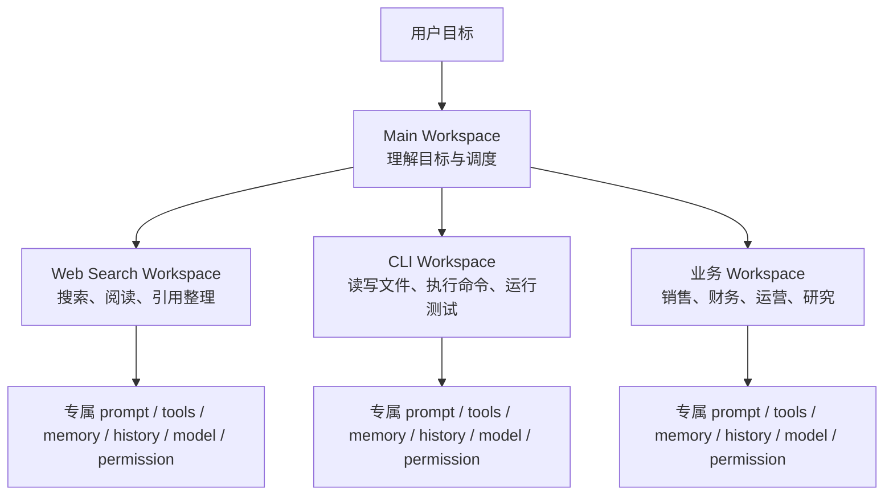
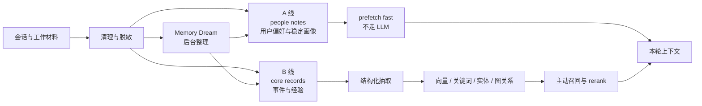
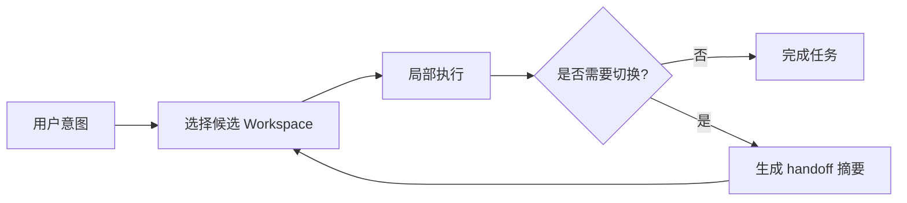

1. Table of Contents, ordered
{:toc}

> 原文：[本地小模型的Claude Code来了，拆解它的完整 Harness！](https://mp.weixin.qq.com/s?__biz=MzIyNjM2MzQyNg==&mid=2247723926&idx=1&sn=c77d10e88ac9fb6e7e098c2ba1f57749&chksm=e9cc4366ace65032e3b7d53fa85582005f3fac8c62afc5f6bb8ecf5b5216aa147179dc8b076f&xtrack=1&req_id=1783066105906971&scene=90&subscene=93&sessionid=1783066186&flutter_pos=1&clicktime=1783066351&enterid=1783066351&finder_biz_enter_id=4&ranksessionid=1783066105&jumppath=20020_1783066195297%2C20020_1783066348786%2C20020_1783066349046%2C50094_1783066349753&jumppathdepth=4&ascene=56&fasttmpl_type=0&fasttmpl_fullversion=8328088-zh_CN-zip&fasttmpl_flag=0&realreporttime=1783066351366&devicetype=android-36&version=28004aab&nettype=cmnet&abtest_cookie=AAACAA%3D%3D&lang=zh_CN&session_us=gh_7e08dd400559&countrycode=CN&exportkey=n_ChQIAhIQGEFNSycpwWYIH3CiwjBfvRLqAQIE97dBBAEAAAAAAMptAdEgynkAAAAOpnltbLcz9gKNyK89dVj0ZuANIzZ%2BtuWGRBHafs2xJSpuPMiCRs165kWAJEqcZ4VeSVBUYQwvtXyHpFLFkTnpMrK9meKbg3Ll8Pvi4WlPxVpoec9EgOpwlJ8jaIRbfVhhcrNzsfy7FqEpM1OuZWTtCDLDdBubMfTRRyfQpl1UAocKIWvc7heFQ4Km6LtVl1QpKez%2BbBos45rEXtgc%2FD7o5cqoOvuy%2FaKh7QkxworvpOGa1bnhm9HTg70q00CzlXWyU4IIQMjv9g9ut7p2lbFNdmSD6w%3D%3D&pass_ticket=eS4auT%2FAKt9iyPK5GRHoVGnlfg2VpX1ffAZuG8WCzHBI%2FkPGE8OOkMZqn%2F%2FgNvbj&wx_header=3)

Agent 从单轮问答走向真实工作流之后，问题就不再只是“这一轮 prompt 怎么写”。Boris Cherny 谈 Claude Code 时提到，他的工作越来越像是在写一组持续运行的循环：循环提示 Claude、观察结果、判断下一步。OpenClaw 的 Peter Steinberger 也把方向指向类似的循环工程。

这里的层次在变化：Prompt Engineering 关心单轮输入，Loop Engineering 关心模型如何反复观察、行动和接收反馈，Harness Engineering 则关心这些循环运行在哪套系统里，怎样长期保持稳定、可控和低成本。

原文借 [Zleap-Agent](https://github.com/Zleap-AI/Zleap-Agent) 这个开源项目，讨论一个更具体的问题：当上下文、工具、历史、记忆和权限都在膨胀时，尤其是本地小模型能力有限时，系统怎样避免把所有筛选压力重新丢给模型。

# 从 Prompt 到 Harness

把 Agent 看成一个能行动的系统，Harness 至少要处理五类问题：上下文、工具、记忆、运行轨迹和边界。如果没有统一组织方式，这些东西最后会退化成一个越来越长的 prompt：工具 schema 不断追加，历史不断追加，记忆不断追加，模型每一步都要先做信息筛选。

Zleap-Agent 给出的组织方式是 **Workspace-first**：不要先问 Agent 最多能接多少工具、能塞多少上下文，而是先判断当前任务应该发生在哪个工作区。

Workspace 和子 Agent 不完全一样。子 Agent 更像临时找另一个人帮忙，有独立角色和上下文，完成后把结果交回来；Workspace 更像同一个人切换工作台，人还是同一个人，但眼前的软件、资料、工具和权限变了。

所以 Zleap-Agent 的方法可以概括成一个执行顺序：**先选工作区，再组装上下文**。模型进入哪个 Workspace，就只看到当前工作区需要的 prompt、工具、记忆、历史、模型和权限。

# Context：先缩小视野，再装配上下文

长上下文模型容易带来一种错觉：既然窗口变大了，就可以把工具、历史、规则和记忆都塞进去。但窗口变大不等于注意力便宜。原文引用 OpenClaw 的数据：一次运行中，system prompt 约 38,412 字符，tool schemas 约 31,988 字符。任务还没真正开始，系统说明和工具定义已经消耗了大量预算。

销售复盘 Agent 是一个很直观的例子。用户说：“帮我复盘一下这个客户为什么迟迟没有成交。”粗暴做法是把 CRM 记录、邮件、会议纪要、销售方法论、产品文档和历史对话全部塞进去。更合理的做法是先拆上下文：

- 当前客户最近三次沟通记录、销售阶段、合同状态、用户偏好，可以提前带入。
- 完整会议纪要和历史邮件只保留摘要，必要时再读取原文。
- 公司销售方法论只带入和“客户复盘”相关的经验摘要。

这体现了 Harness 的第一层价值：它不是拼接 prompt，而是在每一轮请求前做上下文装配。对本地小模型来说，这一点更关键，因为它们通常没有强大的长上下文定位能力；上下文太厚时，模型不一定更聪明，反而先被迫承担筛选任务。

Zleap-Agent 让 Main Workspace 只做目标理解和调度，不承担全部上下文。进入具体 Workspace 后，模型看到的是当前工作区的局部上下文，而不是主对话的完整回放。

原文把上下文写成一种内存布局：

$$
C = S + W + T + M + H
$$

其中，\(C\) 表示本轮实际发送给模型的上下文，\(S\) 是全局 system prompt，\(W\) 是当前 Workspace prompt，\(T\) 是当前可见工具定义，\(M\) 是相关记忆，\(H\) 是必要的近期轨迹。关键不在于公式本身，而在于 Harness 必须决定每个部分“带多少、什么时候带、由谁来带”。

上下文加载也可以分成两种：**prefetch** 是提前带入，例如用户偏好、当前工作区最近事件和常用经验；**agentic recall** 是按需读取，例如模型看到旧记忆摘要后，用户追问细节，再读取完整记录。预取太多会抬高成本，全部按需又会增加轮次和失败点，Harness 需要在两者之间设规则。

# Tools：工具能力要挂在空间上

工具是 Agent 的手，但工具不是越多越好。每个 tool schema 都会增加模型要理解的动作空间，工具越多，模型越容易在无关能力之间摇摆；权限面也会随之扩大，审计和安全成本更高。

OpenClaw 把个人 Agent 做成本地常驻 Gateway，可以接入 WhatsApp、Telegram、Slack、Discord、Signal、iMessage、WebChat 等入口，也能连接 CLI、Web UI、automations、nodes 等本地能力。这说明个人 Agent 可以成为长期在线的本地控制平面，但也迫使 Harness 回答一个问题：这一轮到底应该暴露哪些工具？

两个任务的差异很明显：

- “帮我查一下这个技术方案最近有没有新进展”：需要搜索、网页读取、网页摘要、引用整理，不需要 shell、文件删除、数据库写入。
- “帮我改一下这个项目里的配置文件”：需要文件读取、文件编辑、命令执行、测试运行，不一定需要联网搜索，也不该看到所有业务系统工具。

Workspace-first 把工具挂在工作区上。Web Search Workspace 暴露搜索和阅读工具，CLI Workspace 暴露文件和命令工具，财务 Workspace 暴露报销、预算、审批相关工具。这样一来，模型在每个空间里面对的是更小、更明确的动作集合，tool schema 成本、误调用概率和权限审计压力都会下降。

# Memory：记忆必须有归属

记忆和普通数据库记录不一样，因为它会影响未来推理。写错、读错、串到别的用户或任务里，都会改变后续行为。

原文提到 Hermes Agent 的 Channel Fracture 案例：系统里存在多个 specialized profiles，并尝试让定时任务 Agent 向目标 Agent 注入持久记忆。实验比较了直接写 SQLite、目标 Agent 通过 memory tools 自写入、cron delegated 写入三条路径。cron 路径因为 `skip_memory=True` 和 memory manager 初始化条件，出现了“看似完成、实际未送达”的通道断裂。

这个案例说明，记忆系统不能只看“有没有存储”，还要看完整链路：谁写入，写给谁，通过什么通道，有没有确认送达，未来什么时候被检索出来，会不会污染别的用户或任务。

Zleap-Agent 把记忆拆成两条线：

- **A 线 people notes**：保存用户偏好、稳定画像、Agent 自身认知等轻量记忆，适合快速预取。
- **B 线 core records**：保存工作事件和可复用经验，进入抽取、向量化、实体关联、召回和精排链路。

周报 Agent 和客户复盘 Agent 可以解释这种分区。用户偏好“我喜欢先看结论”是人的记忆，应该跟用户绑定；某个客户上次卡在合同审批是事情的记忆，应该绑定到销售工作区和对应客户；“写周报时按目标、进展、风险、下周计划组织”是经验的记忆，脱敏后可以复用给更多任务。

经验记忆还需要准入规则。可复用流程、失败模式、验证习惯、恢复策略可以沉淀；公司名、客户名、项目名、财务事实、私有路径、一次性任务结果不应该进入经验库。否则所谓经验复用，会变成业务隐私扩散。

Memory Dream 则像离线记忆整理器。它不在用户实时对话中抢上下文，而是在后台从清理后的会话材料中提取稳定画像和可复用经验。事件记忆走事件链路，经验记忆经过脱敏和复用性判断，再进入可召回的长期结构。

召回也分快慢两层。`prefetch` 用 fast 模式，不依赖 LLM，快速把用户画像、近期工作事件和常用经验放进上下文；主动 recall 才走更精细的检索和 rerank。这样既避免每次读取记忆都拖高延迟和成本，也避免完全粗召回带来的质量不稳定。

# Runtime：循环要留下可复盘轨迹

真实 Agent Loop 不只是模型输出一句话。一次运行里，模型会读上下文、选工具、调用工具、接收结果、修正计划、再次调用工具，中间可能失败、重试、切换策略、写入记忆或修改文件。

如果没有运行轨迹，失败后很难判断问题在哪里：是模型能力不够，工具说明不清楚，上下文带错，记忆读错，还是工具返回了误导信息。

原文引用了两个实验观察：

- WildClawBench 在真实 CLI harness 中评估 OpenClaw、Claude Code、Codex、Hermes Agent 等环境，同一个模型切换不同 harness，表现最高可以相差 18 个百分点。
- Agentic Harness Engineering 的实验显示，通过多轮 harness 演化，Terminal-Bench 2 `pass@1` 从 69.7% 提升到 77.0%，收益主要来自 tools、middleware、long-term memory，而不是单纯修改 system prompt。

代码修复 Agent 是典型场景。用户让 Agent 修一个测试失败的问题。Agent 读取报错，修改代码，运行测试。如果测试仍失败，它不能只说“失败了”，而应该记录读取了哪些文件，为什么修改这个函数，执行了什么命令，命令返回什么错误，下一轮又根据什么信息调整方案，最终测试是否通过。

Zleap-Agent 把 runtime 单独拆成模块，运行状态和记忆共用 PostgreSQL 持久化，而不是只在进程内存中跑完就丢。这样，运行轨迹本身可以审计、回放和辅助优化。Prompt 主要影响单轮输入输出，Harness 还要管理执行过程、状态变化、失败恢复和后续复盘。

# Boundary：真实工作流必须有边界

Agent 越接近真实业务，边界越重要。企业场景里，数据不能随便出内网，成本不能无限上涨，权限不能只靠模型自觉，记忆不能在用户之间串，工具也不能对所有任务开放。

这也是本地小模型重新变得重要的原因。敏感数据可以优先在本地处理，常规流程可以交给便宜模型，复杂分析再路由给更强模型。

财务报销 Agent 是一个具体例子。用户问：“帮我看看这张报销单为什么没过。”这个任务可能需要读取发票、预算、审批规则、历史报销状态，但不应该看到销售客户记录，也不应该调用研发代码工具。涉及敏感票据信息时，可以优先走本地模型；需要复杂规则解释时，再由工作区决定是否调用更强模型。

Zleap-Agent 的 Workspace 设计让这种模型路由更自然。不同工作区可以绑定不同模型，常规沟通、网页检索、文件处理、复杂分析、本地敏感任务，不必都交给同一个最强模型。边界最终落在四个层面：数据边界、工具边界、模型边界和记忆边界。

到这里再看 Workspace-first，它不是一个 UI 分组概念，而是在同时收束五件事：

- Context 被限制在当前工作区。
- Tools 按工作区暴露。
- Memory 按用户、工作区和类型分区。
- Runtime 记录每次循环发生在哪个工作区。
- Boundary 落到权限、模型和数据访问规则上。

---

# 核心

Agent Harness 的关键不是让模型“看到更多”，而是让模型在每一步**只看到足够相关的那一小部分**。长上下文、更多工具、长期记忆都会带来能力扩展，但如果没有空间隔离和装配规则，它们也会把动作空间、注意力负担、权限风险和记忆污染一起放大。

Workspace-first 的价值在于把“任务发生在哪里”变成第一层决策。工作区一旦确定，上下文、工具、记忆、模型和权限就有了归属。对本地小模型尤其如此：模型层的稀疏注意力是减少 token 级别的无关信息，Harness 层的 Workspace 是减少系统级别的无关上下文。

# 评价

原文最有价值的地方，是没有把 Zleap-Agent 讲成又一个“本地版 Claude Code”的产品故事，而是借它拆出了 Agent 系统真正难的部分：上下文装配、工具可见性、记忆治理、运行可复盘和业务边界。这比单纯比较模型参数、上下文长度或工具数量更接近工程现实。

不足也很明显。第一，文章大量使用 OpenClaw、Hermes、WildClawBench、Agentic Harness Engineering 作为旁证，但没有展开这些评测的实验边界，读者需要自行判断数据能否迁移到 Zleap-Agent。第二，Workspace-first 是一个强组织假设：如果任务天然跨多个工作区，例如“读网页资料后改项目并写报告”，工作区切换、状态传递和错误归因会成为新的复杂点。第三，记忆分区讲得很完整，但对删除、过期、冲突仲裁和用户可见控制只点到为止，这些恰恰是企业环境里最容易出事故的部分。

即便如此，文章给出的设计方向是扎实的：不要把 Agent 的复杂度都塞进 prompt，也不要指望长上下文自动解决信息治理。真正可长期运行的 Agent，需要在模型之外有一套明确的系统结构。

---

# FAQ：工作区到底怎么划

## 1. 工作区是不是一个工具对应一个工作区？

不是。按工具来分区，只是把“工具选择问题”改名成“工作区选择问题”，复杂度并没有真正下降。

更合理的定义是：**工作区是一组任务语境、权限边界、记忆归属、工具集合和执行流程**。工具只是其中一部分，不是分区依据本身。

比如 Search Workspace 不应该理解成“因为用了 search 工具，所以叫搜索工作区”，而应该理解成它处理的是“外部信息获取与证据整理”这类任务：

- 上下文来自网页、文档、搜索结果。
- 目标是查证、比较、引用、总结。
- 工具以搜索、浏览、网页读取为主。
- 权限偏只读，副作用低。
- 记忆可以保存可信源偏好、检索策略和引用整理习惯。
- 输出需要保留证据链。

所以，工作区的边界不是工具，而是**任务形态**。

## 2. 如果一个工具在很多工作区都可能用到怎么办？

工具应该被看作 capability，工作区只是决定“在当前语境下，以什么权限和约束暴露这项能力”。

同一个浏览器工具，在搜索工作区里可能用于查网页和整理引用；在代码工作区里可能用于查官方文档、issue 和 release note；在财务工作区里可能只能访问审批规则页面。工具相同，但上下文、权限、目标和审计要求都不同。

因此问题不应该是“这个工具属于哪个工作区”，而应该是：

> 当前工作区是否需要这项能力？如果需要，应该以什么权限、什么上下文、什么输出约束来使用？

偶尔会用到某个工具，不足以新建工作区。更好的做法是让当前工作区按需加载工具，或者通过 tool gateway 暴露临时能力。

## 3. 工作区是不是按“我经常做的事情”来划？

对，这是最实用的落地方式。

高频、流程稳定、上下文相似、权限边界相似的任务，适合沉淀成专门工作区；低频、临时、边界不清的任务，先放通用工作区。

例如一个长期维护个人博客的人，可能会慢慢长出几类工作区：

- **写作工作区**：总结文章、写博客、润色标题、检查 front matter。
- **代码工作区**：读仓库、改代码、跑测试、看 diff。
- **搜索研究工作区**：查资料、对比信息、整理引用。
- **博客维护工作区**：Jekyll 预览、分类调整、发布排障、CI 修复。
- **通用工作区**：一次性问题、闲聊、未分类任务。

判断一个任务要不要独立成工作区，可以看四个信号：

- **重复出现**：这类任务经常被交给 Agent 做。
- **流程固定**：例如“抓文章 → 总结 → 写入 `_ai/` → 预览 → 等确认”。
- **上下文固定**：例如博客仓库规则、写作风格、发布目录。
- **边界固定**：例如写文章不能自动 push，代码修改必须跑测试，搜索必须给来源。

如果这些信号都不强，就没必要强行分区。通用工作区加按需工具就够了。

## 4. 工作区和 skill 有什么区别？

两者确实很像，但层级不同：**skill 是“怎么做一件事”，workspace 是“在哪里、以什么边界做事”**。

skill 更像操作手册或 SOP。比如 `summarize-article` 这个 skill 定义的是：给一个 URL，抓正文，写总结，生成 Jekyll 文章，预览，等确认。

workspace 更像运行环境。博客工作区关心的是：

- 当前仓库是哪个。
- 默认文章写到 `_ai/` 还是 `_posts/`。
- 站点的 front matter 规则是什么。
- 预览服务怎么启动。
- 哪些 git 操作必须等用户确认。
- 用户偏好的写作风格是什么。
- 哪些文件不该碰。
- 这个工作区里允许用哪些工具。

同一个 skill 可以跨 workspace 复用。网页总结这个 skill，在博客工作区里可能生成博客；在研究工作区里可能生成资料摘要；在知识库工作区里可能生成内部文档。流程相似，但默认输出、权限、记忆和发布动作不同。

反过来，一个 workspace 也可以装载多个 skill。博客工作区里可以有总结文章、归档对话、修 front matter、预览 Jekyll、发布文章等多个 skill。

所以一个实用判断是：如果只是“一套流程”，skill 就够了；如果还涉及稳定上下文、记忆、权限和工具边界，就需要 workspace。

## 5. 工作区记忆和目录记忆有什么不同？

现在很多 coding agent 已经有目录维度的记忆：恢复对话时，默认只能恢复当前目录下聊过的历史。这对 repo 型任务很自然，但它只是 workspace 记忆的一种简单实现。

目录是物理边界，workspace 是语义边界。同一个博客仓库里，可能同时存在写作、主题开发、文章迁移、部署排障几类任务。它们都发生在同一个目录下，但记忆不应该全混在一起。

例如：

- “我喜欢文章末尾有核心和评价”适合博客写作工作区。
- “某个 CSS 覆盖了 Chirpy gem 主题文件”适合主题维护工作区。
- “GitHub Pages 曾经因为 htmlproofer 挂过”适合发布和 CI 工作区。

如果只按目录记忆，这些内容会落进同一个桶里。workspace 记忆更强调“这类工作应该记住什么、忘掉什么、怎么召回、能不能跨任务复用”。

它也不应该只是历史 transcript，而应该沉淀成结构化记忆：

- 用户偏好：喜欢什么写法、什么输出形态。
- 项目事实：目录结构、主题覆盖、CI 规则。
- 工作流经验：发布前必须预览，push 前必须确认。
- 失败教训：某个脚本在当前环境里的已知问题。
- 实体状态：某个项目、客户、系统或文档的当前状态。

因此，skill 尽量无状态，workspace 负责记忆，目录只是 workspace 的一个可能锚点。

## 6. Zleap-Agent 和 Hermes、OpenClaw 的区别是什么？

更准确的说法不是 Hermes 或 OpenClaw 完全没有隔离机制，而是它们没有把 workspace 当成贯穿系统的一等边界。

OpenClaw 更像一个本地常驻的个人 Agent Gateway，重点是接入很多入口和能力；Hermes 有 profile、delegation、memory manager 等机制，但原文提到的 Channel Fracture 案例说明，谁给谁写记忆、通过哪个通道送达、未来能不能被正确召回，这些边界并不会天然统一。

Zleap-Agent 的差异在于，它不是先构造一个全能 Agent，再让模型在里面挑工具；而是先问“当前任务属于哪个 workspace”。一旦 workspace 确定，后面的 prompt、tools、memory、history、model 和 permission 一起收窄。

真正的区别不是“有没有分组”，而是**隔离是否贯穿上下文、工具、记忆、权限和运行轨迹**。如果 profile、工具权限、memory namespace 只是分散机制，而不是由同一个 workspace 边界统一管理，那系统仍然更接近“大一统 Agent 加局部补丁”。

## 7. 工作区机制的风险是什么？

workspace-first 的成败，很大程度取决于路由准不准，以及分错以后能不能低成本纠正。

如果 workspace 划得太粗，就退回大一统 Agent：工具还是很多，记忆还是混，权限还是大。如果划得太细，又会产生新的成本：每一步都要纠结去哪一个 workspace，跨 workspace 状态传递变复杂，用户也很难理解 Agent 为什么切来切去。

好的粒度应该是：**足够粗，能覆盖稳定任务流；足够细，能形成清楚的上下文和权限边界**。

同时，路由不能一次性判死。真实任务经常一开始说不清楚。用户说“帮我看看这篇文章有没有道理，顺便整理成博客”，它可能先进入搜索研究工作区，后来切到博客写作工作区。如果一开始锁死在写作工作区，就可能缺少查证工具；如果锁死在搜索工作区，又可能缺少博客发布规则。

更健康的设计是允许 workspace 切换，并在切换时生成 handoff 摘要。

handoff 摘要应该包含用户目标、已知事实、已完成动作、待完成动作、不能丢的约束、证据或文件路径，以及不应该带到下一个 workspace 的敏感上下文。

所以，workspace 机制不是魔法。它把大一统 Agent 里隐性的上下文污染、工具误选、记忆串线和权限过大显式化了，代价是系统必须认真设计分区、路由、切换和记忆归属。
