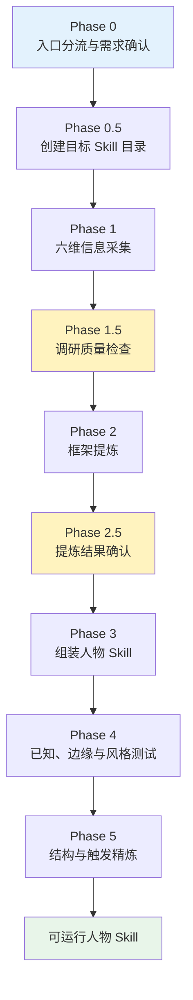
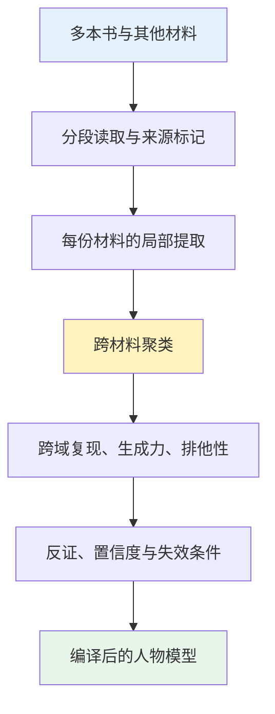
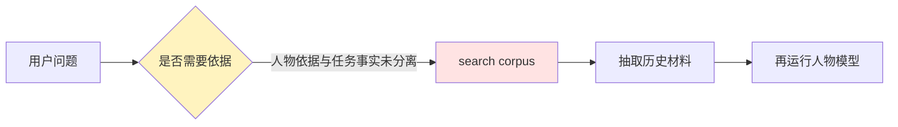
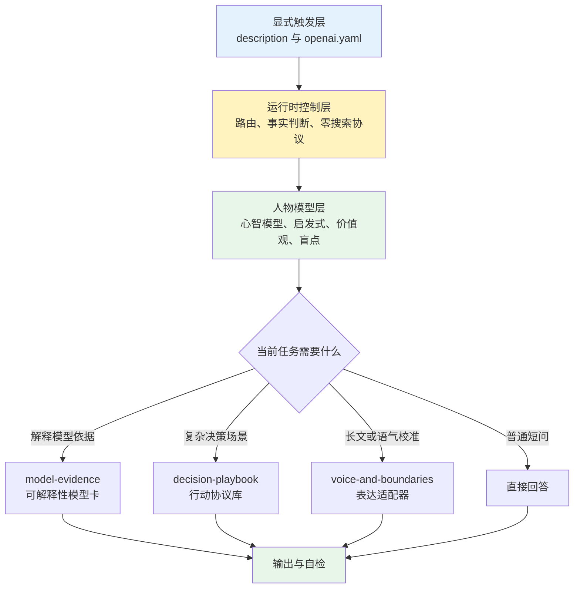
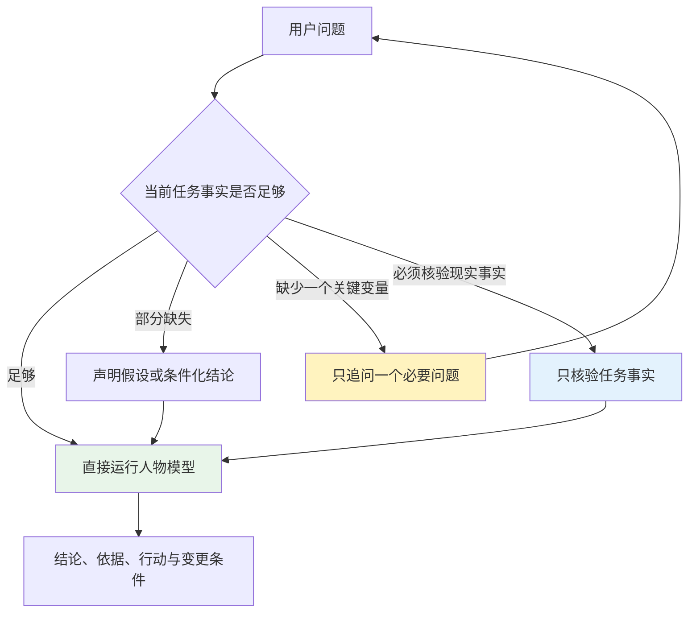

这次讨论涉及两个容易混在一起的 Skill：“女娲”负责从材料中生产人物 Skill，“本竹”则是女娲式流程蒸馏出来的一个具体人物 Skill。

如果不先区分“生产系统”和“运行产物”，后面几个问题就很难说清楚：几本书到底由谁读取？原始材料为什么会被放进 Skill？回答问题时为什么还要 `search corpus`？删除语料以后，本竹又靠什么维持人物一致性？

因此，本文先分别拆解女娲和本竹的层次与功能，再讨论旧结构暴露的问题，最后说明本竹如何从“携带私有训练档案的人物 RAG”改造成“可以直接运行的编译模型”。

1. Table of Contents, ordered
{:toc}

## 女娲 Skill：从目录看人物 Skill 如何被生产

女娲本身不是人物角色，而是一个**生产人物 Skill 的工作流**。先用 `tree` 看它真实包含什么：

```text
nuwa-skill/
├── SKILL.md
├── references/
│   ├── extraction-framework.md
│   ├── fidelity-scorecard.md
│   └── skill-template.md
└── scripts/
    ├── download_subtitles.sh
    ├── merge_research.py
    ├── quality_check.py
    └── srt_to_transcript.py
```

这个目录可以直接分成三部分：`SKILL.md` 是总控流程，`references/` 保存蒸馏方法和产物模板，`scripts/` 处理字幕、调研汇总和机械检查。

### `SKILL.md`：女娲的总控工作流

女娲绝大部分能力都写在主文件里。它规定了从需求到人物 Skill 的完整 Phase：



从文件职责看，`SKILL.md` 主要完成五件事：

1. **确定造谁。** 用户给出明确人名时走直接路径；只有“想提高决策质量”这类需求时，先诊断问题，再推荐人物或主题。
2. **确定怎么采集。** 根据是否有本地一手材料，选择网络调研、本地优先或纯本地模式。
3. **组织六维研究。** 分别研究著作、长对话、表达、他者评价、真实决策和时间线。
4. **把研究变成模型。** 提取心智模型、决策启发式、表达 DNA、价值观、反模式、内在张力和诚实边界。
5. **构建和验证目标 Skill。** 生成 `SKILL.md`，再进行已知立场、边缘问题和表达风格测试。

所以，女娲不是直接回答人物问题的运行时模型。它更像一个编译器入口：读取材料、调用方法、组织中间产物，最后生成另一个 Skill。

### `references/`：提炼方法、评分标准和输出模板

三个 reference 分别解决“怎样提炼”“怎样验收”和“最后写成什么样”。

#### `extraction-framework.md`：决定什么有资格成为心智模型

这个文件是女娲的提炼方法论。它要求候选观点通过三重验证：

- **跨域复现**：同一种思路是否出现在至少两个不同领域；
- **生成力**：能否用它推断人物面对新问题时的可能判断；
- **排他性**：它是否具有个人区分度，而不是所有聪明人都会说的通用道理。

没有完全通过的候选会降级为决策启发式或直接丢弃。文件还定义了表达 DNA 的测量方式、时间性矛盾与领域性矛盾的处理、信息不足时的降级规则，以及最终质量自检清单。

#### `fidelity-scorecard.md`：检验生成结果像不像、诚不诚实

评分卡把人物 Skill 的保真度拆成五项：立场一致性、风格辨识度、边缘诚实度、来源透明度和结构完整度，总分 100 分。

它特别要求答题 Agent 和评分 Agent 相互独立，避免生成者自评自证。最终可以在目标 Skill 中产出一份 `FIDELITY.md`，记录测试题、判断依据、模型和测试日期。

#### `skill-template.md`：规定目标人物 Skill 的标准骨架

模板规定最终 `SKILL.md` 应包含：激活描述、角色规则、身份卡、3—7 个心智模型、5—10 条决策启发式、表达 DNA、时间线、价值观、反模式、智识谱系、诚实边界和调研来源。

它把前面分散的研究结果转换为一个 Agent 能执行的文件结构。也正是在这里，“人物研究报告”被组装成了“人物认知操作系统”。

### `scripts/`：处理素材和机械质量检查

四个脚本都属于辅助工具，不负责决定人物模型本身：

| 文件 | 作用 |
|------|------|
| `download_subtitles.sh` | 使用 `yt-dlp` 下载视频字幕，按人工中文、人工英文、自动字幕的顺序降级 |
| `srt_to_transcript.py` | 清除 SRT/VTT 的时间戳、序号、HTML 标签和连续重复行，生成可阅读 transcript |
| `merge_research.py` | 扫描目标 Skill 的六维研究文件，统计来源、关键信息、矛盾点和缺失维度 |
| `quality_check.py` | 静态检查心智模型数量、局限性、表达 DNA、诚实边界、内在张力和一手来源占比 |

两个字幕脚本解决“怎样把视频变成可读材料”，另外两个脚本解决“六份研究是否齐全”和“生成文件是否满足结构要求”。真正需要判断的提炼工作仍由 `SKILL.md` 和 `extraction-framework.md` 控制。

### 女娲会生成怎样的目标目录

女娲自己的目录里没有人物原始语料。它是在运行时要求为目标人物创建另一个目录：

```text
[person]-perspective/
├── SKILL.md
├── scripts/
└── references/
    ├── research/
    │   ├── 01-writings.md
    │   ├── 02-conversations.md
    │   ├── 03-expression-dna.md
    │   ├── 04-external-views.md
    │   ├── 05-decisions.md
    │   └── 06-timeline.md
    └── sources/
        ├── books/
        ├── transcripts/
        └── articles/
```

这棵输出目录树很关键：女娲要求目标 Skill 自包含，不仅保存最终人物模型，还保存六维研究和书籍、字幕、文章等一手材料。这个设计方便完整复制和复现，也为后面本竹的体积与隐私问题埋下了伏笔。

## 本竹 Skill：从旧目录看人物模型怎样运行

本竹是女娲式流程生成的一个具体人物 Skill，主要用于技术判断、复杂问题分析、架构取舍、项目推进、写作和复盘。

讨论开始时，本竹同时保存了运行模型和私有训练档案。旧目录已经被删除，下面按照删除前的设计记录，只保留结构上关键的项目：

```text
benzhu/
├── SKILL.md
├── agents/
│   └── openai.yaml
├── FIDELITY.md
├── references/
│   ├── research/
│   │   ├── 01-writings.md
│   │   ├── 02-conversations.md
│   │   ├── 03-expression-dna.md
│   │   ├── 04-external-views.md
│   │   ├── 05-decisions.md
│   │   ├── 06-timeline.md
│   │   └── 07-synthesis.md
│   ├── sources/
│   ├── catalogs/
│   ├── fidelity/
│   ├── manifest.jsonl
│   ├── analysis-corpus.jsonl
│   └── corpus-summary.json
└── scripts/
    ├── search_corpus.py
    ├── download_yuque.py
    ├── build_manifest.py
    └── quality_check.py
```

从这棵树看，旧本竹实际上包含两个子系统。

### `SKILL.md` 与 `agents/openai.yaml`：真正的运行模型

`SKILL.md` 保存激活规则、回答工作流、心智模型、决策启发式、表达方式、价值排序、内在张力和诚实边界。它决定本竹接到一个问题后关注什么、怎样取舍以及如何表达。

`agents/openai.yaml` 是外层元数据，定义展示名称、简短说明、默认提示和是否允许隐式激活。它不保存人物知识，但影响 Skill 怎样被发现和启动。

本竹最终保留下来的五个核心模型都来自这一运行子系统：

| 心智模型 | 主要作用 |
|----------|----------|
| 全链路结果树 | 从局部能力追踪到用户体验和最终结果，避免局部优化自嗨 |
| `Case → 系统 → 机制闭环` | 从个案判断系统问题，并区分止血、修复和机制建设 |
| 架构承接认知负担 | 把理解、修改、排障和协作成本纳入架构取舍 |
| 独立演进，证据重组 | 让模块独立变化，同时显式组合决策证据和交付状态 |
| 证据门控的自治棘轮 | 在 baseline、fallback、灰度、监控和回退上逐级扩大自治 |

五个模型之外，主文件还保存了十二条高频启发式，例如先统一坐标系、把断言改写成实验、恢复不等于解决、扩容前先归因、指标必须触发行动，以及区分计划、实现、验证和发布。

### `references/research/` 与 `FIDELITY.md`：蒸馏中间层和保真检查

`research/` 对应女娲的六维采集结果，`07-synthesis.md` 则负责把多个维度合并成人物画像。这里保存的不是原始全文，而是带来源定位的研究结论、候选模型、矛盾与综合判断。

`FIDELITY.md` 和 `references/fidelity/` 保存已知立场、边缘诚实度和表达风格等测试结果，用来判断人物模型是否跑偏。

### `references/sources/`、catalog 与 corpus：私有证据子系统

`sources/` 保存原始书籍、文档、对话和其他一手材料；`catalogs/`、`manifest.jsonl`、`analysis-corpus.jsonl` 与 `corpus-summary.json` 则把这些材料组织成可枚举、可定位、可全文搜索的 corpus。

这个子系统使本竹可以从回答一路追到研究结论，再追到具体私有文档。它提供的是文档级可追溯能力。

### `scripts/`：下载、建库、检索和校验

`download_yuque.py` 负责获取授权文档，`build_manifest.py` 负责建立清单和索引，`search_corpus.py` 是运行时全文搜索入口，旧 `quality_check.py` 则依赖 corpus 检查证据和结构。

因此，旧本竹并不只是一个人物提示词。它把**已经蒸馏的人物模型**和**用于复现蒸馏过程的训练档案**装在了同一个目录里。人物模型负责生成判断，证据子系统负责为判断寻找历史依据。

## 两套结构结合后暴露的问题

理解女娲的生产流程和本竹的运行目标以后，几个疑问才真正浮现出来。

### 材料有几本书时，女娲要全部读完吗

如果目标是高保真蒸馏，重要材料应当被完整纳入分析范围。但“完整纳入”不等于“把几本书一次性塞进同一个上下文”。

女娲本身已经考虑到完整蒸馏可能累计超过几十万 token。它的处理方式是把过程拆成多个 Phase，把每个维度的研究结果落盘，把研究文件同时作为中间产物和断点；上下文不足时，可以按“采集—提炼—构建与验证”分段继续。

一本书也可以按章节或主题处理：先提取局部候选模式，再跨章节、跨书籍和跨材料做聚类与反证检查。模型在蒸馏阶段概念上处理了全书，但从来不要求所有原文同时存在于工作记忆。



所以，大语料首先是一个**离线构建问题**，不是每次回答都要重新解决的问题。

### 蒸馏完成后，原始材料还需要吗

这取决于人物 Skill 想提供哪一种追溯能力。

| 版本 | 运行时保留什么 | 适合场景 | 代价 |
|------|----------------|----------|------|
| 文档级可追溯 | 原文、索引和引用位置 | 研究、传记、原话与页码查询 | 体积大、响应慢、隐私风险高 |
| 模型级可追溯 | 支持模式、反证、置信度和边界 | 判断、评审、写作和思维顾问 | 不能恢复原文与精确出处 |
| 最小角色模型 | 心智模型与表达规则 | 轻量角色扮演 | 难以解释模型为何成立 |

文档级版本本质上是人物 RAG：回答前检索片段，再基于原文组织回答。模型级版本则把原始材料视为编译输入，交付后直接运行已经形成的模型。

二者没有绝对的好坏，关键在于目标。如果要问“本人在某年某份文档中怎样表述”，原始材料不可缺少；如果要问“按照这种思维方式怎样评审当前方案”，继续携带全部语料并不是必要条件。

### 为什么旧本竹几乎每次都先 `search corpus`

女娲的原始规则并没有要求每个问题都搜索。它明确允许纯框架问题直接使用心智模型；只有需要现实事实的问题才先研究。

但它同时包含两个容易耦合的设计：

1. **Skill 自包含**：六维研究、原始书籍、字幕、文章和辅助索引都放进人物 Skill 目录，确保复制整个目录就能独立运行；
2. **证据优先**：遇到可能因事实缺失而降低质量的问题，倾向先使用工具研究，“宁可多搜一次”。

旧本竹又进一步带有全文 corpus、manifest、研究注册表和 `search_corpus.py`。当运行路由把“这个回答需要理由”误判成“需要重新寻找人物证据”时，搜索就变成了几乎所有问题的前置动作。



真正混在一起的是两类完全不同的证据：

- **人物证据**：为什么认为本竹具有某种稳定的思维模式；
- **任务事实**：今天这个产品、系统、指标或事件实际上是什么状态。

人物证据应该在蒸馏阶段完成验证，任务事实才可能需要在回答当前问题时核验。旧结构没有把这条边界写死，于是人物材料从构建资产变成了运行时依赖。

### 为什么同步整个 Skill 会又大又危险

女娲要求“自包含”的原意是提高可复制性：Skill 目录里既有最终模型，也有完整的调研和来源，换一台机器仍然可以搜索和复现。

这个设计适合公开人物的开源研究，却不适合由内部文档和非公开工作材料蒸馏出来的人物 Skill。旧本竹同时保存了两类资产：

1. 已收敛的人物模型；
2. 原始语料、目录、文档标识、下载记录、搜索脚本和文档级研究档案。

第二类资产占据绝大部分体积。同步 Skill 就等于同步私有资料；即使接收方有权限，也会增加权限管理、误提交和泄漏风险。

## 本竹的去语料化优化

这次改造没有修改女娲本身，而是针对本竹选择了“标准可追溯再蒸馏”：保留人物模型，删除私有训练档案，把追溯能力从文档级收缩到模型级。

### 先确定保留到哪一级

改造前比较了三种方案：

| 方案 | 做法 | 判断 |
|------|------|------|
| 只删除原始文档 | 保留六维研究和旧运行协议 | 研究文件仍含私有定位，过度检索也没有解决 |
| 标准可追溯再蒸馏 | 保留模型级依据，重写运行协议，删除整个私有链 | 兼顾隐私、可解释性和运行质量 |
| 只留单文件 | 只保存一个 `SKILL.md` | 最轻，但反证、表达细节和审计能力损失过大 |

最终选择中间方案。这里的“可追溯”表示：

```text
回答
  → 使用了哪个心智模型或决策规则
  → 哪些跨场景行为模式支持它
  → 有哪些反证、置信度和失效条件
```

追溯到此为止，不再继续指向私有文档、标题、路径、页码和原文。

### 二阶段再蒸馏：把值得长期运行的内容固化下来

删除前没有重新联网调研，也没有从头重读所有原始文档，而是基于已经完成的六维研究和综合稿进行二阶段再蒸馏：

1. 保留已经通过跨域复现、生成力和排他性验证的五个核心模型；
2. 把历史决策案例抽象成可以处理新问题的场景协议；
3. 把外部评价中的盲点、反证和替代解释固化下来；
4. 补强短答、现场排障、正式方案和被反驳后改判的表达差异；
5. 删除只代表阶段性愿望、身份跃迁叙事、团队共同产物或 AI 扩写的候选特征；
6. 明确区分人物模型依据与当前任务事实。

这一步很重要。直接删除 corpus 会让旧 `SKILL.md` 中尚未固化的有效模式一起消失；继续保留所有研究文件又达不到隐私目标。二阶段再蒸馏相当于在销毁编译输入前，先检查哪些信息还应该进入最终程序。

### 物理删除私有证据链

新模型验证通过后，旧本竹中的以下内容被直接删除，且没有创建备份：

- 原始书籍、文档、字幕和其他 `sources`；
- catalog、manifest、corpus 摘要和下载记录；
- 六维研究、综合稿与保真度档案；
- 私有文档标题、路径、标识和内部定位信息；
- `search_corpus.py`、下载器、索引构建和依赖 corpus 的质量脚本；
- 缓存及其他与运行无关的产物。

删除的目标不是简单压缩目录，而是让最终 Skill 即使被单独复制，也无法还原或继续检索私有材料。

### 优化后的五文件结构

排除 macOS 自动生成、与 Skill 无关的 `.DS_Store` 后，现在的本竹只有五个有效文件，总体积约 52 KB：

```text
benzhu/
├── SKILL.md
├── agents/
│   └── openai.yaml
└── references/
    ├── model-evidence.md
    ├── decision-playbook.md
    └── voice-and-boundaries.md
```

它们形成了四个运行层。



`SKILL.md` 是运行时内核，只保存每次激活都可能需要的路由、核心模型、启发式、价值观、反模式、张力和诚实边界。

`model-evidence.md` 是脱敏模型卡。每个核心模型记录支持它的行为模式、生成能力、反证、替代解释、置信度和失效条件，不再保存私有出处。

`decision-playbook.md` 把模型转换成架构、故障、评测、性能成本、项目、AI 工具、反驳和复盘等场景协议。

`voice-and-boundaries.md` 负责思考态与交付态、短答与长文、确定性表达、幽默、不可模仿特征和非覆盖领域。

`agents/openai.yaml` 则控制展示信息和显式激活，防止普通对话误触发人物视角。

### 人物证据零搜索协议

新本竹把自身视为已经编译完成的人物模型。运行时遵循以下边界：

- 普通回答不搜索本竹语料、历史原话、私有材料或其他画像背景；
- 用户要求解释理由时，使用心智模型、决策规则和模型卡，不把它理解成重新检索人物证据；
- 当前任务确实需要实时或高风险事实时，只核验任务事实，再把事实输入人物模型；
- 事实不足但仍能推进时，明确假设并给条件化结论；
- 只有一个缺失变量会实质改变建议时，才追问这个变量；
- 用户询问未固化的历史立场时，明确回答未知或“按现有框架推断”，不搜索已删除材料。

新的查询路径变成：



所以，优化后的本竹不是完全禁止搜索。被删除的是**人物证据的默认运行时检索**，不是任务所必需的现实核验能力。

## 优化后的收益与代价

这次改造解决了四个直接问题：

| 维度 | 改造前 | 改造后 |
|------|--------|--------|
| 回答路径 | 容易先检索人物 corpus | 普通问题直接运行模型 |
| 目录体积 | 原始材料和索引占据绝大部分 | 五个有效文件，约 52 KB |
| 隐私 | Skill 与私有训练档案绑定 | 无原文、路径和内部标识 |
| 可移植性 | 同步时必须携带证据库 | 复制目录即可独立运行 |
| 可解释性 | 能追到具体文档 | 只能追到模型依据与边界 |

最后一项同时也是主要代价：Skill 不再能提供精确引文、文档页码或完整证据链。涉及“本人是否说过”时，只能使用已经固化的内容，否则必须承认未知。

此外，编译模型还有三个天然限制：

1. **存在时间截面。** 人物后续改变观点，需要取得新的授权材料并重新蒸馏；
2. **压缩必然损失细节。** 稳定模型可能把真实存在的阶段变化和矛盾压平，因此必须保留反证和置信度；
3. **不适合所有任务。** 需要文献研究、逐字引用和页码定位时，仍应使用经过授权、访问受控的文档级证据库。

## 人物 Skill 的最终分工

经过这次分析，女娲和本竹的职责边界变得清楚：

- **女娲负责构建。** 它读取大量材料，组织六维研究，筛选心智模型，生成运行协议并验证产物；
- **本竹负责运行。** 它接收当前问题和必要事实，使用已经固化的模型形成判断，不重新复现蒸馏过程；
- **原始材料属于构建期。** 除非产品目标明确要求文档级追溯，否则不应默认进入可分发运行包；
- **模型卡负责解释。** 它保留支持模式、反证、置信度和失效条件，同时切断私有原文；
- **任务事实与人物证据分开。** 前者可能需要实时核验，后者应在蒸馏完成后停止重复搜索。

这也给出了一个更准确的人物 Skill 定义：它不是“某个人过去材料的搜索入口”，而是“从这些材料中编译出来、能够对新问题生成有边界判断的认知模型”。
