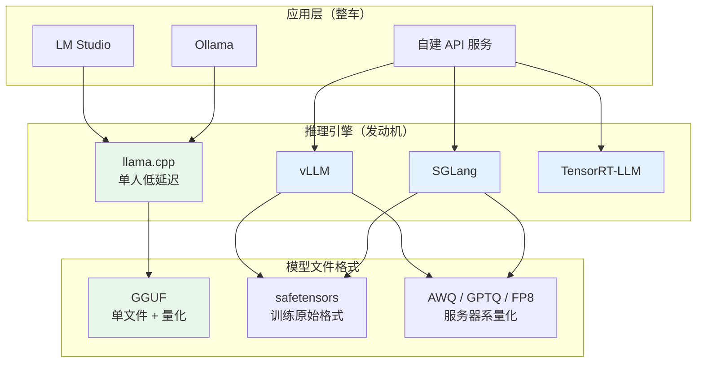
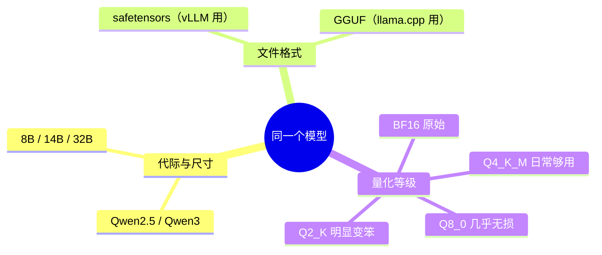

在个人电脑上本地跑大模型，新手面对的往往不是某一个具体问题，而是一整片陌生的生态：框架一大堆，模型文件一堆版本，下载还慢。这些问题其实可以拆成三层——**用什么引擎跑、模型文件选哪个、怎么把文件快速拉下来**。本文以一块 16GB 显存的消费级显卡为例，把这三层逐一讲清楚。

1. Table of Contents, ordered
{:toc}

## 推理引擎：先分清「发动机」和「整车」

本地推理的生态里，名字最容易造成误解的是 llama.cpp。它听起来像一个 C++ 源文件，实际上是一个**开源推理引擎项目**：最初是 Georgi Gerganov 用纯 C/C++ 写的、专门跑 LLaMA 模型的程序，后来发展成本地推理的事实标准。可以从三个层面理解它：

- **一个软件**：编译后得到 `llama-cli`、`llama-server` 等可执行文件，不需要 Python 环境，加载模型文件即可聊天或起 OpenAI 兼容的 API 服务；
- **一套引擎技术**：它定义了 GGUF 模型格式（`Q4_K_M`、`Q8_0` 这些量化等级都是 GGUF 的标准），并实现了 CUDA、Metal、Vulkan 等各种硬件后端；
- **一个库**：其他程序可以把它链接进去做推理。

关键认知是：**Ollama 和 LM Studio 的核心推理引擎就是 llama.cpp**，它们只是在外面包了一层好用的壳。llama.cpp 是发动机，Ollama / LM Studio 是装了这台发动机的整车。

那么 vLLM、SGLang 又是什么关系？答案是：它们和 llama.cpp 是**同一层的三种独立实现**，谁也不基于谁，只是设计目标完全不同。继续用发动机类比：llama.cpp 是家用车发动机，vLLM 和 SGLang 是卡车发动机——原理相通，但为完全不同的场景设计。

| | llama.cpp | vLLM | SGLang |
|---|---|---|---|
| 设计目标 | 个人本地跑起来 | 服务器高吞吐 | 服务器高吞吐 + 复杂生成 |
| 典型场景 | 单人聊天、离线工具 | 多人并发 API 服务 | Agent、结构化输出、前缀复用 |
| 核心技术 | GGUF 量化、极致硬件兼容 | PagedAttention、continuous batching | RadixAttention、约束解码 |
| 模型格式 | GGUF | safetensors + AWQ/GPTQ/FP8 | 同 vLLM |
| 语言/形态 | C/C++，命令行工具 | Python，服务框架 | Python，服务框架 |

本质区别在于**延迟与吞吐的取舍**。llama.cpp 优化的是「一个人用，响应快不快」，batch size 基本是 1，显存能省则省，所以量化做得最激进（连 2-bit 都有）；vLLM/SGLang 优化的是「一百个人同时问，GPU 一秒能吐多少 token」，PagedAttention 解决的是多用户并发时 KV cache 的显存碎片问题——这些在单人场景里根本用不上。SGLang 早期大量借鉴 vLLM 的思路，后来独立发展出 RadixAttention（多请求共享相同前缀的 KV cache，对 Agent 多轮调用很重要）。2026 年的[推理引擎横评](https://yomxxx.com/posts/2026-06-04-llm-inference-engine-comparison-2026-tools)结论也大致是：生产级「vLLM 求稳、SGLang 求吞吐、TensorRT-LLM 求极致延迟」，llama.cpp 管本地。

整个生态的对应关系可以画成一张图：



对单卡单人的玩家，结论是：llama.cpp 系（LM Studio / Ollama）就是主场；vLLM 值得当教科书学（PagedAttention、continuous batching、prefix caching 是推理加速的主干知识），但要在 WSL2 或 Docker 里跑——**vLLM、SGLang、TensorRT-LLM 对原生 Windows 的支持都很差**，llama.cpp 和 Ollama 原生 Windows 没问题。

## GGUF 与量化：一个模型到底有多少「版本」

打开任意一个模型发布页，会看到一排令人眼花缭乱的文件。要理解它们，需要把「版本」拆成三个**正交的维度**：

- **模型的代际与尺寸**：Qwen2.5 还是 Qwen3，8B 还是 32B——这是真正不同的模型，训练出来就不一样；
- **文件格式**：同一份权重的不同打包方式。训练框架产出的是 safetensors（通常切成多个分片，配一堆 json）；GGUF 则把权重、分词器、架构参数、元数据全部装进**一个文件**，拷走单个 `.gguf` 就能跑；
- **精度 / 量化等级**：训练出的原始权重是 16-bit 浮点（BF16/FP16），量化就是把每个参数用更少的 bit 存储。



所以 GGUF 和非 GGUF **不是模型的不同版本，而是同一份权重的不同发行格式**。打个比方：同一部电影可以发行成蓝光原盘（BF16 safetensors）、1080p 高码率（Q8）、720p（Q4）——内容一样，体积和画质不同，还因为封装不同需要不同的播放器。GGUF 文件几乎都是量化过的，因为它就是为本机省显存场景设计的，所以「选 GGUF」通常同时意味着「选了某个量化等级」。

以 8B 模型为例，各档位的实际取舍：

| 量化等级 | 每参数约 | 文件约 | 质量 |
|---|---|---|---|
| BF16（原始） | 16 bit | 16 GB | 100% |
| Q8_0 | 8.5 bit | 8.5 GB | 几乎无损 |
| Q6_K | 6.5 bit | 6.6 GB | 损失很小 |
| Q4_K_M | 4.8 bit | 4.9 GB | 日常用足够 |
| Q2_K | 2.6 bit | 2.9 GB | 明显变笨，别碰 |

文件大小基本就是显存占用的下界（还要给 KV cache 留余量）。16GB 显存的实践结论：**8B 选 Q8，13~14B 选 Q4_K_M，再大就得牺牲**。MoE 模型是 16GB 的甜点——总参数大但激活参数小（如 30B-A3B），IQ2 档约 10GB 就能装下，速度还快。

一个容易踩的坑：**模型官方仓库里通常只有 safetensors**。比如 `zai-org/GLM-4.7-Flash` 官方仓库只有 48 个 BF16 分片共约 60GB，LM Studio 加载不了，全下下来也没用。正确动作是在搜索时给模型名加上 `-GGUF` 后缀，找社区转换好的仓库，认准 unsloth、lmstudio-community、bartowski 这几个老牌发布者——Unsloth 的 UD（Dynamic）系列量化带 imatrix 校准，低 bit 下质量明显好于普通量化。

## 下载模型：国内镜像与多连接加速

### LM Studio 的模型从哪来

LM Studio 的模型全部来自 huggingface.co，而且它有个讨厌的地方：**不认 `HF_ENDPOINT` 环境变量**——这是 HF 生态工具通用的镜像开关，huggingface-cli、vLLM、transformers 都认，但 LM Studio 是 Electron 应用，地址硬编码在内部（[官方 issue 已确认](https://github.com/lmstudio-ai/lms/issues/104)），GUI 里也没有镜像设置。网上流传的「改内部 JS 文件全局替换域名」属于 hack，每次升级都会被覆盖，不推荐。

稳妥的做法是**在 LM Studio 外面下载，手动放进模型目录**。LM Studio 会扫描模型目录（默认 `C:\Users\<用户>\.lmstudio\models`，可在设置里改到其他盘），只要按「作者/仓库名」两层目录放 GGUF 文件，它就会自动识别，和 GUI 里下载的完全一样。

### hf-mirror 镜像的用法

[hf-mirror.com](https://hf-mirror.com) 是 Hugging Face 的国内全量镜像（公益项目）。它的意义首先是**可达性**——huggingface.co 在国内直连基本不通（连接被重置，不是慢），镜像让没有代理的环境有个可用入口。用法有一条简单的 URL 规律：

```
https://hf-mirror.com/<作者>/<仓库>/resolve/main/<文件名>
```

把 HuggingFace 模型页面里的域名换成 `hf-mirror.com` 即可；文件在仓库子目录里时 URL 也要带上子路径。下载下来后放进 `models\<作者>\<仓库名>\` 目录，作者和仓库名这两层是 LM Studio 识别模型的依据，不能省。

关于 token：公开模型（Qwen 等）不需要；只有 **gated 模型**（如 Meta 的 Llama 系列，需先在 HF 网页上申请同意协议）才要加请求头 `Authorization: Bearer hf_xxx`。

### 单连接限速与 aria2

用 curl 直接从镜像下载时，实测单连接只有 3~5 MB/s——这不是镜像站「没意义」，而是公益镜像为了扛住全国并发，对**单条 TCP 连接**限速。破解方法是多连接分段下载：[aria2](https://github.com/aria2/aria2) 开 16 条连接，每段都吃到单连接上限，总速度就乘上去了。实测同一网络下：

- Qwen3-8B（8.2GB）：3.5 MB/s → **24 MB/s**；
- GLM-4.7-Flash（9.8GB）：5 MB/s → **75.6 MB/s**。

命令模板（`-x 16` 是每文件 16 连接，`-c` 是断点续传，可以直接接管 curl 下了一半的文件）：

```bash
aria2c -x 16 -s 16 -k 4M -c -d "保存目录" -o "文件名" "hf-mirror的resolve链接"
```

官方 `huggingface-cli` 也有等价的多线程开关：安装 `hf_transfer` 后设 `HF_HUB_ENABLE_HF_TRANSFER=1`，原理一模一样。「下载工具」和「下载源」是两个正交的维度——`HF_ENDPOINT=https://hf-mirror.com` + 官方 CLI 同样成立，走代理 + 官方源也是一条路，按自己的网络条件组合即可。

## LM Studio 的运行时机制与一次下载排障

LM Studio 本体只是个壳，真正干活的引擎是它按需下载的**运行时（runtime）**。首次使用时它会下载两类组件：

- **`llama.cpp-win-x86_64-nvidia-cuda12-avx2`**：llama.cpp 引擎的编译产物。名字里 `nvidia-cuda12` 表示带 CUDA 12 后端——有它模型才能卸载到 N 卡跑，否则只能纯 CPU，慢十倍不止。这是必装件；
- **`harmony-win-x86_64-avx2`**：OpenAI 给 gpt-oss 系列定义的[特殊输出格式](https://github.com/openai/harmony)的解析器，只有加载 gpt-oss 模型时才用得上。

排障的起点是：运行时没下完，模型必然加载失败——发动机没装好，车点不着火。而 LM Studio 从自家 CDN 下载运行时，国内直连实测只有 0.03 MB/s，543MB 的 CUDA 运行时要下 5 个小时。

排障过程中摸清了它的内部机制：运行时装在 `~/.lmstudio/extensions/backends/`，下载任务状态存在 `.lmstudio/.internal/` 的 JSON 里，**引擎索引是扫描 backends 目录生成的**。曾尝试用 aria2 接管下载、按 sha256 校验后把完整文件喂给它的下载器——校验确实通过了（说明文件内容完全一致），但它的下载器重启后仍坚持删掉重下，对抗三个回合后放弃。最后发现的真相反而简单：**安装包自带的旧版 CUDA 运行时（`nvidia-cuda-avx2`）与正在下载的 cuda12 版是同一个 llama.cpp 版本（2.25.2）**，模型支持范围完全一样，只是底层 CUDA 库版本不同——这只是自动升级，不是缺它不可。取消下载、在加载面板把 Runtime 手动选成已装好的 `llama.cpp (CUDA)`，模型立刻就能跑。

这次排障留下的可复用经验：

- LM Studio 加载失败时，先查运行时是否就绪（`extensions/backends/` 目录），再怀疑模型文件；
- 它的运行时确实慢时，开系统代理重试最省事（Electron 应用走系统代理）；手动下载解压到 backends 目录也可行，因为它靠扫目录发现引擎；
- 同一版本号的运行时变体（cuda / cuda12 / vulkan）差异在硬件后端，不在模型支持。

## 16GB 显存的落地路线

把三层拼起来，一条可行的落地路径是：

1. **装 LM Studio**（官网安装包，`/S` 参数可静默安装），确认 CUDA 运行时就绪；
2. **下模型**：hf-mirror + aria2，按 `models\<作者>\<仓库名>\` 目录放好。首发阵容建议 8B Q8（质量/速度平衡）加一个 30B 级 MoE 的 IQ2（感受大模型的质量上限）；
3. **建立基准**：聊天界面右下角的 tok/s 就是性能基线，同一个问题分别问不同量化档位的模型，量化取舍立刻有体感；
4. **进阶折腾**：用 llama.cpp 原生命令行玩量化对比、投机采样；再去 WSL2 里起 vLLM，逐项开关 PagedAttention、prefix caching，用 `vllm bench` 量化每个优化的收益——那才是推理加速的主干知识。
