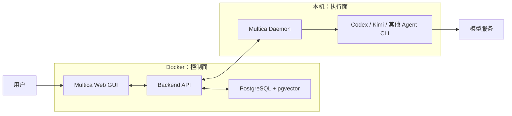

Multica 是一个面向人和 AI 智能体协作的项目管理平台。它把工作区、项目、Issue、智能体、运行时、Skills、小队和自动化集中到同一个 Web 界面：人负责组织和分派任务，智能体通过本机的 AI Coding CLI 执行任务，再把过程和结果同步回平台。

它提供完整的浏览器 GUI，但自托管版本不是一个桌面应用。第一次部署仍要使用脚本、Docker 和命令行；服务启动后，日常的项目管理和智能体配置主要在网页中完成。

1. Table of Contents, ordered
{:toc}

## Multica 是什么

单独使用 Codex、Kimi Code 等 AI Coding CLI 时，一个任务通常对应一次终端会话。这适合即时使用，但当任务变多、需要多人参与，或者希望多个智能体分工时，独立的终端会话很难统一管理。

Multica 在这些 Agent 之上增加了项目管理和调度能力：

- 用工作区、项目和 Issue 组织任务；
- 创建具有固定名称、职责、指令和 Skills 的智能体；
- 管理本机已经安装的 Agent Runtime；
- 把多个智能体组成小队并分配任务；
- 记录任务状态、执行过程和结果；
- 用自动化触发重复工作。

因此，Multica 不是新的大模型，也不替代 Codex 或 Kimi。它负责“有哪些工作、交给谁做”，实际的推理、文件操作和工具调用仍由 Agent CLI 完成。

自托管则把 Multica 的 Web 服务和业务数据放到自己的机器上，默认通过 `http://localhost:3000` 使用。

## Multica 如何运行

Multica 自托管环境可以分成控制面和执行面：

| 层次 | 组件 | 职责 |
|---|---|---|
| 控制面 | Web、Backend、PostgreSQL | 提供 GUI，保存数据，处理认证和任务调度 |
| 执行面 | Multica Daemon | 从 Server 接收任务，发现并启动本机 Runtime |
| 执行面 | Agent CLI | 连接模型、操作项目并执行任务 |



用户在网页中提交任务后，Backend 把任务交给 Daemon；Daemon 启动相应 Agent CLI；CLI 调用模型和工具执行任务；最终结果再沿原路返回网页。

Web GUI 是管理入口，Daemon 是 Server 与本机 Agent 之间的桥梁，Agent CLI 才是真正的执行者。自托管 Multica 并不会在 Docker 中额外部署一套 Codex 或 Kimi，也不会替代它们原有的模型账号和网络配置。

## 如何部署 Multica

### 最方便的方式

[Multica 自托管快速开始](https://multica.ai/docs/self-host-quickstart)提供了一条完整安装命令：

```bash
curl -fsSL https://raw.githubusercontent.com/multica-ai/multica/main/scripts/install.sh \
  | bash -s -- --with-server
```

这是最省步骤的方式。用户不需要提前手动 `git clone`，但脚本内部仍会浅克隆 Multica，并把 Server 文件放到 `~/.multica/server`。

如果希望先检查脚本，可以下载后再运行：

```bash
curl -fsSL https://raw.githubusercontent.com/multica-ai/multica/main/scripts/install.sh \
  -o /tmp/multica-install.sh
bash /tmp/multica-install.sh --with-server
```

已经克隆仓库的用户也可以在仓库中执行 `make selfhost` 启动 Server，再单独安装 Multica CLI。

### `--with-server` 脚本做了什么

| 操作 | 为什么需要 |
|---|---|
| 检查 Docker 和 Compose | Multica Server 由容器运行 |
| 克隆或复用 `~/.multica/server` | 获取 Compose 文件、配置模板和版本信息 |
| 创建 `.env`，生成 JWT Secret 和数据库密码 | 避免直接使用不安全的示例密钥 |
| 拉取并启动 PostgreSQL、Backend 和 Web 镜像 | 组成完整的自托管 Server |
| 等待 Backend 健康 | 容器启动不等于服务已经可以接受请求 |
| 安装 `multica` CLI | 用于登录 Server、选择工作区和启动 Daemon |

这些操作依次准备了配置、数据层、服务层和本地执行入口。数据库迁移由 Backend 在启动时自动完成，可以用 `/readyz` 同时检查数据库和迁移状态：

```bash
curl -s http://localhost:8080/readyz
```

Server 启动后，再执行：

```bash
multica setup self-host
```

它会完成登录、选择工作区、保存凭证、启动 Daemon，并把检测到的 Agent Runtime 注册到 Multica。至此，Web GUI 才真正连接上本机的 Agent 执行能力。

## 本次 macOS 部署

本次在 macOS + Colima 上部署了 Multica v0.4.9，Server 位于 `~/.multica/server`，CLI 位于 `/opt/homebrew/bin/multica`。

实际流程是：

1. 确认 Docker 和 Compose 可用；
2. 克隆 Multica；
3. 准备镜像并启动 Docker Compose；
4. 通过 `/readyz` 验证数据库和迁移；
5. 安装 Multica CLI；
6. 执行 `multica setup self-host`，创建 `Puppylpg` 工作区；
7. 启动 Daemon 并注册 Agent Runtime。

最终 Web GUI 运行在 `http://127.0.0.1:3000`，Backend 运行在 `http://127.0.0.1:8080`；Codex、Kimi、Qoder、Hermes、OpenCode 和 OpenClaw 六个 Runtime 在线。

### 下载链路

第一次克隆时，Git 通过本地 SOCKS 代理下载，速度只有约 6 KiB/s；临时关闭 Git 代理后，直连速度约为 1.2 MiB/s：

```bash
git -c http.proxy= -c https.proxy= \
  clone --depth 1 https://github.com/multica-ai/multica.git \
  ~/.multica/server
```

Docker 配置的 Registry Mirror 当时也已经失效，因此镜像通过其他可用链路下载到本地，再由 Compose 使用本地镜像启动。

这里值得保留的经验是：Git、当前 Shell 和 Docker Daemon 使用各自的网络配置。“开了代理”不代表所有下载都会经过它，也不代表代理一定比直连快。遇到下载问题时，应分别测试 `git clone`、普通 HTTP 请求和 `docker pull`。

### Daemon 的运行方式

Server 负责保存和调度任务，Daemon 则需要作为本机的长期服务持续连接 Server。Multica v0.4.9 自带的后台启动方式在这台 macOS 上不稳定，因此最终由 `launchd` 托管前台 Daemon：

```text
/opt/homebrew/bin/multica daemon start --foreground --no-auto-update
```

这样可以在登录后自动启动，并在异常退出时重新拉起。使用其他操作系统时，同样适合交给系统原生的服务管理器，而不是长期依赖一个手动打开的终端窗口。

## 需要理解的几个边界

### 有 GUI，但部署和维护仍需要命令行

项目、Issue、智能体和小队都可以在网页中管理；Docker、CLI、Daemon、升级和日志则属于系统维护工作，仍然通过命令行完成。

### 自托管的是 Multica Server

自托管解决的是平台服务和数据归属问题。Agent Runtime 仍然运行在本机，使用各自已有的账号、配置和模型服务。

### “代理”不是一项全局设置

Git、Docker Daemon、交互式 Shell 和系统后台服务可能读取完全不同的代理来源。配置网络时应明确当前解决的是哪一段链路。

### 健康检查有不同层次

容器存在、进程存活和业务可用不是同一件事。`docker compose ps` 用于检查容器，`/readyz` 用于检查 Backend、数据库和迁移，`multica daemon status` 用于检查本机执行层。

## 日常维护

日常使用以 Web GUI 为主，命令行主要用于检查服务：

```bash
cd ~/.multica/server
docker compose -f docker-compose.selfhost.yml ps
curl -s http://localhost:8080/readyz
multica daemon status
```

理解 Multica 最关键的是控制面和执行面的分工：Server 负责组织与调度，Daemon 和 Agent Runtime 负责执行。掌握这个边界后，部署、使用和后续维护都会清晰很多。
