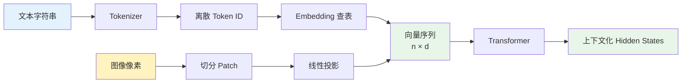
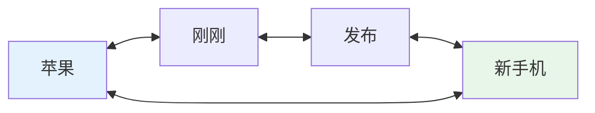
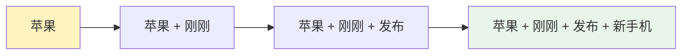
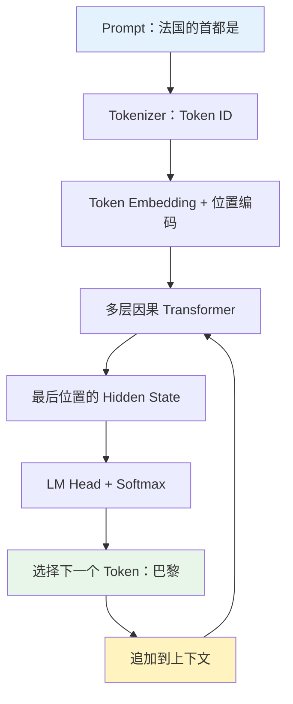
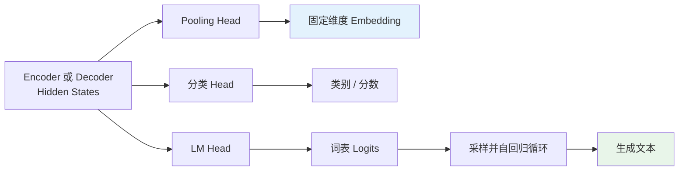
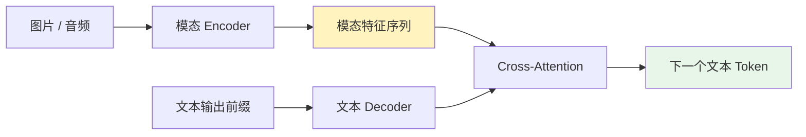
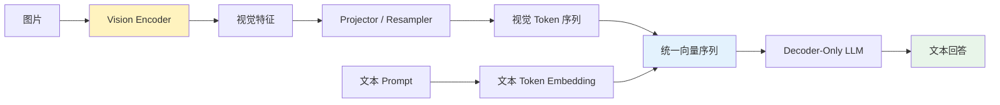
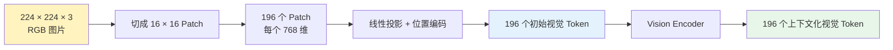

Transformer 模型经常被概括成三种架构：Encoder-Only、Decoder-Only 和 Encoder-Decoder。这样的分类看起来清楚，真正应用时却很容易产生一连串疑问：没有 Encoder 的 Decoder-Only 如何接收输入？Encoder 输出的是不是更强的动态 Embedding？既然 Decoder-Only 也能完成翻译，Encoder-Decoder 是否只剩多模态这一条路？图像进入模型后又为什么会变成“视觉 Token”？

这些问题背后混用了 Token、Token ID、Embedding、Hidden State 和模型输出等不同层次。要理解架构选择，首先要区分模型收到的原始数值、Transformer 处理的信息单元，以及经过上下文化之后的表示；在此基础上，三类架构的信息流和适用边界才能自然展开。

1. Table of Contents, ordered
{:toc}

## Token、Embedding 与 Hidden State 属于不同层次

神经网络只能计算数值张量，但“进入计算机的一串数字”还不能直接等同于 Token 或 Embedding。一个模态从原始数据进入 Transformer，通常要经历以下几个层次。

| 层次 | 含义 | 文本示例 | 图像示例 |
|---|---|---|---|
| 原始数据 | 人类使用的信息载体 | 字符串“猫坐在沙发上” | JPEG 文件或 RGB 像素 |
| 信息单元 | 模型切分出来的处理单位 | 子词“猫”“坐在”“沙发” | 一个 `16 × 16` Patch |
| Token ID | 离散词表或码本中的编号 | “猫”对应 `2871` | 连续视觉模型通常没有这一步 |
| 初始 Embedding | Transformer 的输入向量 | 查 Embedding 表得到的向量 | Patch 经过线性投影得到的向量 |
| Hidden State | 经过 Transformer 后的上下文化向量 | 结合上下文理解后的“猫” | 结合整张图理解后的局部区域 |
| 全局 Embedding | 对一组 Hidden State 进行汇总 | 句向量 | 整张图片的向量 |

**Token 的一般含义不是“单词”，而是 Transformer 序列中的一个信息单元或处理位置。**这个位置可以来自文本子词、图像 Patch、音频时间片、视频时空块，也可以是模型主动加入的可学习 Query。

Transformer 实际接收的是一个向量序列：

\[
X=[x_1,x_2,\ldots,x_n],\qquad X\in\mathbb{R}^{n\times d}
\]

其中：

- \(n\) 表示序列中有多少个 Token；
- \(d\) 表示每个 Token 向量的维度；
- \(x_i\) 表示第 \(i\) 个序列位置的向量。

不同模态的差异主要发生在如何得到这些向量。进入 Transformer 之后，它们都表现为一个形状为“Token 数量 × 隐藏维度”的张量。



### 文本通常通过离散词表进入模型

文本 Tokenizer 持有一个预先确定的词表，将文本片段映射成整数编号：

```text
token        token_id
---------------------
猫           2871
狗           3902
machine      8123
learning     7256
```

编号 `2871` 只是“猫”在词表中的索引，本身不携带数学语义。模型还需要一个训练得到的 Embedding 矩阵：

\[
E\in\mathbb{R}^{V\times d}
\]

其中 \(V\) 是词表大小，\(d\) 是隐藏维度。查询第 `2871` 行后，才能得到“猫”的初始向量：

\[
e_{\text{猫}}=E[2871]\in\mathbb{R}^{d}
\]

因此，文本处理中存在两张作用不同的“表”：

| 结构 | 映射关系 | 如何得到 |
|---|---|---|
| Tokenizer 词表 | 文本片段 → Token ID | 训练 Tokenizer 后固定 |
| Embedding 矩阵 | Token ID → 连续向量 | 随模型参数一起学习 |

### 初始 Embedding 是静态的，Hidden State 是动态的

同一个模型中，只要 Token ID 和模型参数没有变化，Embedding 查表得到的初始向量就是固定的。例如下面两句话中的“苹果”会查到同一个初始向量：

```text
苹果刚刚发布了新手机。
苹果吃起来很甜。
```

初始向量进入多层 Transformer 后，会变成依赖上下文的 Hidden State。模型在这里才逐渐区分“苹果公司”和“水果”。

这个过程同时存在于 Encoder 和 Decoder-Only 中：

```text
Token ID
   ↓
静态 Token Embedding
   ↓
多层 Transformer
   ↓
动态、上下文化的 Hidden State
```

因此，“Encoder 产生动态 Embedding，而 Decoder-Only 只能使用静态 Embedding”并不成立。两种架构都会产生动态表示，真正不同的是**每个位置能够看到哪些上下文**。

## 注意力可见范围决定了表示如何形成

Encoder 使用双向自注意力，Decoder-Only 使用因果自注意力。这一差异决定了同一个 Token 在两类网络中的信息来源。

### Encoder 为每个位置建立全局表示

对于长度为 \(n\) 的输入，Encoder 中第 \(i\) 个位置的表示可以依赖整个序列：

\[
h_i^{\text{enc}}=f(x_1,x_2,\ldots,x_n)
\]

处理“苹果刚刚发布了新手机”时，“苹果”可以直接看到后面的“发布”和“手机”；处理“苹果吃起来很甜”时，它也能看到“吃起来”和“甜”。因此，两句话中“苹果”位置本身就会形成不同的全局上下文化表示。



### Decoder-Only 让信息从左向右逐步汇聚

Decoder-Only 中第 \(i\) 个位置只能看到自己和左侧前缀：

\[
h_i^{\text{dec}}=f(x_1,x_2,\ldots,x_i)
\]

当“苹果”位于第一个位置时，它看不到后面的词，所以前面两句话中“苹果”位置的 Hidden State 基本相同。但是，越靠后的 Token 能看到越完整的前缀：



最后一个位置已经能够综合整段输入。生成答案时，答案位置总是在 Prompt 后方，因此它也可以看到完整 Prompt。

两种信息组织方式可以概括为：

> Encoder 让每个输入位置理解全局；Decoder-Only 让后面的位置逐步汇总全局。

Encoder 的优势是每个输入 Token 都获得了完整、对称的上下文表示；Decoder-Only 的优势是整条序列遵循同一个从左到右的计算规则。前者不等于整体能力必然更强，后者也不等于无法理解完整输入。

## 三类 Transformer 架构对应三种自然目标

[原始 Transformer](https://arxiv.org/abs/1706.03762)由 Encoder 和 Decoder 两部分组成。后续模型根据任务需要保留不同组件，逐渐形成 Encoder-Only、Decoder-Only 和 Encoder-Decoder 三条主要路线。

```mermaid
flowchart TB
    subgraph EO["Encoder-Only：表示输入"]
        X1["输入 X"] --> ENC1["双向 Encoder"]
        ENC1 --> H1["Token Hidden States"]
        H1 --> POOL["Pooling / 任务 Head"]
        POOL --> E1["Embedding、分类或抽取结果"]
    end

    subgraph DO["Decoder-Only：延续序列"]
        X2["Prompt + 已生成 Token"] --> DEC1["因果 Transformer"]
        DEC1 --> LM["LM Head"]
        LM --> NEXT["下一个 Token"]
    end

    subgraph ED["Encoder-Decoder：把 X 转换成 Y"]
        X3["源序列 X"] --> ENC2["双向 Encoder"]
        ENC2 --> MEMORY["输入记忆"]
        YP["目标前缀 Y&lt;t"] --> DEC2["因果 Decoder"]
        MEMORY --> CROSS["Cross-Attention"]
        DEC2 --> CROSS
        CROSS --> YT["下一个目标 Token"]
    end

    style EO fill:#e3f2fd
    style DO fill:#e8f5e9
    style ED fill:#fff3bf
```



### Encoder-Only 自然地表示一个完整输入

Encoder-Only 的抽象目标是：

\[
R=f(X)
\]

这里 \(X\) 是完整输入，\(R\) 可以是一组 Token Hidden State，也可以经过 Pooling 后变成一个固定维度的全局 Embedding。它适合检索、分类、重排、信息抽取和句子表示等任务。

### Decoder-Only 自然地预测序列后续

Decoder-Only 建模一条序列的联合概率：

\[
P(Z)=\prod_{t=1}^{n}P(z_t\mid z_1,z_2,\ldots,z_{t-1})
\]

它适合开放式续写、聊天、代码生成和其他“根据已有历史继续往后写”的任务。

这里的 Decoder-Only 不是把原始 Transformer Decoder 原封不动地拿出来。原始 Decoder 同时包含因果自注意力和读取 Encoder 的 Cross-Attention；GPT 类 Decoder-Only 通常移除了 Cross-Attention，只保留因果自注意力和前馈网络。更准确的名称是“因果自回归 Transformer”。

### Encoder-Decoder 自然地建模条件生成

Encoder-Decoder 明确区分源序列 \(X\) 和目标序列 \(Y\)：

\[
P(Y\mid X)
=
\prod_{t=1}^{m}
P\left(y_t\mid y_{<t},\operatorname{Encoder}(X)\right)
\]

Encoder 先双向处理完整输入，得到一组上下文化表示：

\[
H_{\text{enc}}\in\mathbb{R}^{n\times d}
\]

Decoder 再通过 Cross-Attention 读取这组“输入记忆”，并根据已经生成的 \(Y_{<t}\) 预测下一个目标 Token。这种结构天然适合翻译、摘要、纠错和其他明确的 \(X\rightarrow Y\) 转换任务。

## Decoder-Only 的输入就是 Prompt 与已有输出

Decoder-Only 并非没有输入模块。它同样包含 Token Embedding、位置编码和多层 Transformer；它取消的是一套**独立的双向 Encoder**。

假设 Prompt 是：

```text
法国的首都是
```

Tokenizer 将其变成 \(n\) 个 Token ID。Embedding 和位置编码构成第零层输入：

\[
H^{(0)}=E[\text{token\_ids}]+P,\qquad
H^{(0)}\in\mathbb{R}^{n\times d}
\]

经过 \(L\) 层因果 Transformer：

\[
H^{(L)}=\operatorname{Transformer}\left(H^{(0)}\right)
\]

模型取最后一个位置的 Hidden State \(h_n^{(L)}\)，再通过语言模型输出层映射到词表：

\[
\text{logits}
=
W_{\text{vocab}}h_n^{(L)}
\]

Softmax 将 logits 转换为词表概率，模型可能选出“巴黎”。随后“巴黎”被追加到序列末尾，模型继续预测下一个 Token。



推理时，模型通过 KV Cache 保存已经处理过的上下文，不必为每个新 Token 从头计算整个 Prompt。整体过程分成：

```text
Prompt Prefill → 建立 KV Cache → 逐 Token Decode
```

在监督微调中，输入和输出也可以拼在同一条序列里：

```text
<user> 法国的首都是哪里？
<assistant> 法国的首都是巴黎。
```

训练程序可以通过 Loss Mask 只对 Assistant 回答部分计算损失。架构上它是一条连续序列，训练目标上仍然可以专门学习：

\[
P(Y\mid X)
\]

## Embedding 模型偏爱 Encoder-Only 的原因

Embedding 模型的目标是把完整输入压缩成适合比较、检索或分类的向量，而不是继续生成序列。Encoder 的双向注意力与这一目标天然一致。

假设 Encoder 输出：

\[
H=[h_1,h_2,\ldots,h_n],
\qquad
H\in\mathbb{R}^{n\times d}
\]

模型可以通过 `[CLS]`、平均池化或可学习 Pooling 得到句向量：

\[
e_{\text{sentence}}
=
\operatorname{Pool}(h_1,h_2,\ldots,h_n)
\in\mathbb{R}^{d}
\]

因为 Encoder 中每个位置都能看到完整输入，所有 \(h_i\) 都是双向上下文化表示。放在句首的 `[CLS]` 也能关注整句话。

Decoder-Only 如果把 `[CLS]` 放在句首，它将因为因果掩码看不到后续内容。Decoder-Only embedding 模型通常需要改用句尾 `[EOS]` 的 Hidden State、专门的 Pooling，或者通过对比学习适配其表示空间。

### 是否生成文本由输出 Head 和运行方式决定

Encoder、Decoder 输出的本质都是浮点 Hidden State。最终产品输出什么，取决于 Hidden State 后面连接的模块：



因此，“模型有 Decoder，输出就不再是 Embedding”并不成立。Decoder 的 Hidden State 可以被 Pooling 成 Embedding；Encoder 也可以接词表 Head 预测 Token。

[BERT](https://arxiv.org/abs/1810.04805)就是后者的典型例子。它用 Encoder 建立双向表示，再通过 Masked Language Model Head 预测被遮挡的 Token：

```text
我去 [MASK] 存钱。
         ↓
      “银行”
```

BERT 原始目标是学习双向语言表示，并不等同于已经针对语义相似度优化的句向量模型。专用 Embedding 模型通常还会在 Encoder 之上加入 Pooling，并通过对比学习让语义相近的文本向量靠近。

## Decoder-Only 成为通用大语言模型主干的原因

Encoder-Decoder 可以完成生成，Decoder-Only 也可以进行条件生成。通用大模型选择 Decoder-Only，主要是因为训练目标、任务接口和交互历史可以统一为同一个问题，而不是因为其他架构失去了表达能力。

### 原始文本天然提供下一个 Token 训练信号

Decoder-Only 只需要学习：

> 给定已有前缀，预测下一个 Token。

网页、书籍、代码和对话都可以直接形成训练样本：

```text
北京             → 是
北京是           → 中国
北京是中国的     → 首都
```

Encoder-Decoder 同样能使用无标注文本，例如通过遮挡、去噪和重建进行预训练，但它需要人为构造源序列和目标序列。Decoder-Only 的目标与自然文本的顺序结构直接一致。

### 多种任务可以统一成 Prompt 续写

翻译、摘要、问答、代码和工具调用都可以写成：

```text
翻译：I love machine learning. 中文：
摘要：<长文> 摘要：
问题：中国的首都是哪里？答案：
代码：实现快速排序：
```

从模型视角看，这些任务都是：

\[
\text{已有上下文}\rightarrow\text{下一个 Token}
\]

Zero-shot、Few-shot、多轮对话、思维链和 Agent 工具轨迹也天然表现为一条不断延长的历史序列：

```text
系统指令
→ 用户问题
→ 模型回答
→ 用户追问
→ 工具调用
→ 工具返回
→ 模型继续回答
```

### 一套参数同时承担读取、推理和生成

Encoder-Decoder 将参数分配给两套网络；Decoder-Only 则让同一套主干处理 Prompt、推理过程和生成结果。这种高度共享未必在每个专用任务上都最优，却非常符合“训练一个通用模型”的目标。

围绕统一的自回归路径，推理系统也可以集中优化 Prefill、KV Cache、连续批处理、Prefix Cache 和投机解码，而不必维护独立 Encoder、Decoder 自注意力缓存和 Cross-Attention 通路。

## Decoder-Only 如何覆盖翻译等条件生成

翻译并不要求必须存在独立 Encoder；它真正要求的是每个目标 Token 都能访问完整源文本和已有目标前缀。

假设：

- \(X\) 是英文原文；
- \(Y\) 是中文译文。

Encoder-Decoder 建立三类注意力关系：

| Query 所在位置 | 可以读取的内容 |
|---|---|
| 源序列 \(X_i\) | 完整源序列 \(X\) |
| 目标序列 \(Y_t\) | 完整源序列 \(X\) |
| 目标序列 \(Y_t\) | 已生成目标前缀 \(Y_{\le t}\) |

Decoder-Only 将两段拼成 `[X][Y]` 后，形成：

| Query 所在位置 | 可以读取的内容 |
|---|---|
| 源序列 \(X_i\) | 源前缀 \(X_{\le i}\) |
| 目标序列 \(Y_t\) | 完整源序列 \(X\) |
| 目标序列 \(Y_t\) | 已生成目标前缀 \(Y_{\le t}\) |

两种架构中的每一个目标 Token 都能看到完整输入。主要差异发生在源序列内部：

- Encoder-Decoder 先让每个源 Token 获得完整双向表示；
- Decoder-Only 的源 Token 只能获得因果表示，再由后方目标位置综合全部源 Token。

以：

```text
The bank by the river was closed.
```

为例，Encoder 处理 `bank` 时已经能看到后面的 `river`，因此可以先在输入侧完成消歧。Decoder-Only 处理 `bank` 位置时看不到 `river`，但生成译文的位置位于整段英文之后，可以同时关注 `bank` 和 `river`，并在生成侧完成消歧。

所以 Decoder-Only 不是不能翻译，而是把原本由独立 Encoder 完成的一部分输入理解，合并到了同一套因果网络和后方生成位置中。

## Encoder-Decoder 仍然适合专业化条件生成

Encoder-Decoder 已经不再是通用聊天模型的默认选择，但它没有失去应用空间。它的核心价值在于为一个明确的 \(X\rightarrow Y\) 任务分别设计输入理解和输出生成。

### 专用翻译、摘要和结构转换

下列任务都有清晰的源序列与目标序列：

- 机器翻译；
- 长文摘要；
- 文本纠错与改写；
- 文档到结构化数据；
- 固定格式问答；
- 语音识别和语音翻译。

如果产品只需要完成一种固定转换，专用 Encoder-Decoder 可以把双向输入表示、源目标对齐、模型规模和解码策略都围绕该任务优化。Meta 的 [No Language Left Behind](https://ai.meta.com/research/no-language-left-behind/)就是使用 Encoder-Decoder 的多语言翻译系统。

截至 2026 年，专业化翻译仍然同时探索两条路线。Meta 的 [Omnilingual MT](https://ai.meta.com/research/publications/omnilingual-mt-machine-translation-for-1600-languages/)同时研究了 Decoder-Only 的 OMT-LLaMA 和 Encoder-Decoder 的 OMT-NLLB，说明架构竞争已经从“能不能翻译”转向语言覆盖、质量和计算效率的权衡。

### 输入重、输出轻的不对称计算

长文摘要可能输入 10,000 个 Token，只输出 300 个 Token。此时输入理解和输出生成需要的计算预算并不对称。

Encoder-Decoder 可以采用：

```text
大型 Encoder：充分理解长输入，只运行一次
小型 Decoder：承担每个输出 Token 的重复生成
```

Decoder-Only 虽然通过 KV Cache 避免重新处理 Prompt，但每个新 Token 仍要经过整套大模型层。Encoder-Decoder 则可以把更多参数放在只运行一次的 Encoder，把反复运行的 Decoder做得更小。

Google 在 2025 年发布的 [T5Gemma](https://developers.googleblog.com/en/t5gemma/)专门探索了这种设计，包括“9B Encoder + 2B Decoder”的不对称组合，用于调整输入理解质量与逐 Token 推理成本之间的关系。

### 通用助手与专用系统采用不同优化目标

通用助手追求一个模型覆盖问答、代码、翻译、摘要、Agent 和多轮对话，Decoder-Only 的统一序列接口更重要。专用系统则可能每天重复执行海量固定转换，此时每次请求的成本、吞吐量、术语控制和稳定性会放大，Encoder-Decoder 的专业化结构仍然可能更划算。

因此，Encoder-Decoder 并非只剩多模态市场。更准确地说：

> Decoder-Only 赢在统一和通用，Encoder-Decoder 仍然可能赢在条件生成的专业化和效率。

## 多模态系统不一定是经典 Encoder-Decoder

多模态模型经常使用视觉 Encoder、音频 Encoder 和语言 Decoder，但“系统中存在 Encoder 和 Decoder”不代表语言主干采用经典 Transformer Encoder-Decoder。

常见系统有两种连接方式。

### 显式 Cross-Attention

模态 Encoder 产生一组特征，文本 Decoder 通过 Cross-Attention 读取它们：



[Whisper](https://cdn.openai.com/papers/whisper.pdf)采用音频 Encoder 加文本 Decoder：Encoder 处理语音特征，Decoder 生成转录或翻译文本。这在整体和内部注意力结构上都属于 Encoder-Decoder。

### 模态特征作为 Decoder-Only 的前缀

另一类模型先把视觉或音频特征投影到语言模型隐藏维度，再把它们插入文本序列：

```text
[视觉 Token 1] ... [视觉 Token m]
[用户问题 Token 1] ... [用户问题 Token n]
[回答 Token ...]
```

语言主干只运行 Decoder-Only 的因果自注意力，没有独立的语言 Encoder 和显式 Cross-Attention。



从整体数据流看，这仍然是“编码模态输入，再进行生成”；但从语言 Transformer 的模块结构看，它是“模态 Encoder + Projector + Decoder-Only LLM”，不等同于 T5 式 Encoder-Decoder。

## 视觉 Token 是 Transformer 中的图像信息单元

视觉 Token 通常不是一个单词对应的图像版本，也不一定有离散整数 ID。图片理解模型更常把图片切成 Patch，再把每个 Patch 直接投影成一个连续向量。

### RGB 像素不会直接变成 0/1 Token 序列

图片文件在存储层最终当然由二进制位组成，但模型通常不会把这些 `0` 和 `1` 当成语义 Token。JPEG、PNG 等文件先被解码成 RGB 数值张量，例如：

```text
像素 1：[255, 120, 30]
像素 2：[254, 121, 29]
像素 3：[80, 200, 160]
```

经过归一化后，它们成为 GPU 可以计算的浮点数。二进制只是底层存储形式，模型层面处理的是保持空间结构的数值张量。

### Patch 投影直接产生初始视觉 Token Embedding

以 [Vision Transformer](https://arxiv.org/abs/2010.11929)常见的输入方式为例，一张 `224 × 224 × 3` 图片按 `16 × 16` 切分：

\[
\frac{224}{16}\times\frac{224}{16}
=
14\times14
=
196
\]

于是得到 196 个 Patch。每个 Patch 包含：

\[
16\times16\times3=768
\]

个数值。将第 \(i\) 个 Patch 展平为：

\[
p_i\in\mathbb{R}^{768}
\]

再通过可训练的线性投影：

\[
z_i=p_iW+b+r_i
\]

其中：

- \(W\) 和 \(b\) 是可学习的投影参数；
- \(r_i\) 是第 \(i\) 个 Patch 的位置编码；
- \(z_i\in\mathbb{R}^{d_v}\) 是初始视觉 Token Embedding；
- \(d_v\) 是视觉 Encoder 的隐藏维度。

整张图片变成：

\[
Z=[z_1,z_2,\ldots,z_{196}]
\in\mathbb{R}^{196\times d_v}
\]



经过 Vision Encoder 后：

\[
H_{\text{vision}}
\in
\mathbb{R}^{196\times d_v}
\]

每个输出位置仍然与某个空间区域相关，但已经通过双向注意力结合了其他区域的信息。

### 一个视觉 Token 通常不等于一个物体

一个初始 Patch 可能只覆盖猫耳朵、猫眼睛或沙发的一角。“一只猫”这个概念往往分布在多个视觉 Token 中：

```text
猫耳朵 Patch ┐
猫眼睛 Patch ├→ 多层注意力 → “沙发上的一只猫”
猫身体 Patch ┤
猫尾巴 Patch ┘
```

经过 Vision Encoder 后，“猫耳朵”位置的向量可能同时表达：

- 局部形状像耳朵；
- 它属于一只猫；
- 猫位于沙发上；
- 这个区域位于图片中间偏左。

视觉 Token 更接近“保留空间位置的上下文化视觉特征”，而不是一个可直接翻译成人类词语的标签。

### 一组视觉 Token 比一个全局 Embedding 保留更多细节

图片分类或相似度检索可以把整张图 Pooling 成一个向量：

\[
e_{\text{image}}
=
\operatorname{Pool}
\left(H_{\text{vision}}\right)
\in\mathbb{R}^{d_v}
\]

这个全局 Embedding 适合回答“整张图是什么”或“两张图是否相似”。多模态问答还要回答：

```text
图片左上角是什么？
猫的右边有什么？
桌上有几个杯子？
第二个人穿什么颜色的衣服？
```

如果只保留一个全局向量，就像读完一本书后只保存一句摘要，局部位置和细节容易形成信息瓶颈。保留一组视觉 Token，则相当于保存了多份带空间位置的上下文化笔记。

### Projector 将视觉特征接入语言模型

Vision Encoder 的隐藏维度可能是 \(d_v=1024\)，语言模型的隐藏维度可能是 \(d_{\text{LLM}}=4096\)。Projector 负责进行维度对齐：

\[
V
=
\operatorname{Projector}
\left(H_{\text{vision}}\right),
\qquad
V\in\mathbb{R}^{m\times d_{\text{LLM}}}
\]

这里 \(m\) 不一定等于原来的 196。Resampler 还可以把 196 个视觉特征压缩成更少的视觉 Token，在细节与上下文长度之间取舍。

投影之后，语言模型看到的是：

\[
[v_1,\ldots,v_m,e_1,\ldots,e_n]
\]

其中 \(v_i\) 是视觉向量，\(e_i\) 是文本向量；它们来源不同，但维度相同，都占据 Transformer 序列中的位置。

## 连续视觉 Token 与离散视觉 Token 是两种不同概念

“视觉 Token”在论文和工程中有两种常见含义，阅读模型结构时需要先判断它属于哪一种。

### 连续视觉 Token

图片理解模型通常直接输出浮点向量：

```text
Patch
  ↓
线性投影 / Vision Encoder
  ↓
[0.31, -0.52, 0.17, ...]
```

这种 Token 没有固定词表 ID，也不能反查成某个单词。它只是视觉序列中的一个连续向量位置。

### 离散视觉 Token

图像生成或统一自回归模型可能学习一个有限视觉码本。视觉 Tokenizer 把图像特征量化为最接近的码本编号：

\[
\operatorname{id}(p)
=
\arg\min_k
\left\|f(p)-c_k\right\|
\]

其中 \(f(p)\) 是 Patch 或潜在特征，\(c_k\) 是第 \(k\) 个码本向量。图片可以被表示成：

```text
[17, 17, 382, 901, 74, 216, ...]
```

这时视觉 Token 更接近文本 Token：两者都有离散 ID，再通过查表变成向量。码本是有损量化，同一类局部模式即使有少量像素差异，也可能映射到同一个视觉 Token ID。

| 类型 | 表示形式 | 是否有离散 ID | 常见用途 |
|---|---|---:|---|
| 连续视觉 Token | 浮点向量序列 | 否 | 图片理解、视觉问答 |
| 离散视觉 Token | 视觉码本编号 | 是 | 图片生成、统一自回归建模 |

音频和视频也遵循相同思想：音频可以按时间片形成 Audio Token，视频可以按帧和空间 Patch 形成时空 Token。Token 的含义始终是“模型序列中的信息单元”，不局限于文字。

## 架构选择取决于目标与系统约束

三类 Transformer 不是从弱到强的升级关系，而是为不同信息流设置了不同结构偏置。

| 目标 | 自然选择 | 核心原因 | 重要边界 |
|---|---|---|---|
| 文本 Embedding、检索、分类 | Encoder-Only | 每个位置双向理解完整输入 | Decoder-Only 经过适配也能做 Embedding |
| 开放式续写、聊天、代码、Agent | Decoder-Only | 所有历史统一成因果序列 | 不是每个输入位置都有双向表示 |
| 专用翻译、摘要、纠错 | Encoder-Decoder | 明确分离输入理解与输出生成 | Decoder-Only 也能通过 Prompt 完成 |
| 通用模型中的翻译与摘要 | Decoder-Only | 复用同一个通用模型和推理系统 | 专用效率未必最优 |
| 视觉或音频输入生成文本 | 模态 Encoder + 生成 Decoder | 先抽取模态特征，再生成目标序列 | 语言主干可能仍是 Decoder-Only |
| 图片生成 | Decoder、扩散模型或离散视觉建模 | 根据条件生成像素或视觉 Token | 不等同于文本 Encoder-Decoder |

这些架构之间最稳定的判断框架不是“哪一种更先进”，而是依次检查：

1. 目标是得到一个表示，还是生成一个序列？
2. 输入与输出是否有明确、稳定的边界？
3. 每个输入位置是否需要完整双向上下文？
4. 模型是专门完成一个任务，还是覆盖大量开放任务？
5. 输入理解和逐 Token 生成是否需要相同的参数规模？
6. 系统更关注通用性，还是单任务质量、延迟与吞吐量？

Encoder-Only 擅长把完整输入变成可用表示；Decoder-Only 擅长延续统一的历史序列；Encoder-Decoder 擅长把一个完整输入专业地转换成另一个输出。多模态又在这一框架上增加了模态特征提取与对齐，但是否属于经典 Encoder-Decoder，仍取决于语言生成器如何读取这些特征。

理解这一层之后，Embedding、生成、翻译和视觉 Token 就不再是彼此孤立的概念。它们描述的是同一条数据链路上的不同阶段：**原始信息先被切分和数值化，Transformer 再根据注意力可见范围形成上下文表示，最后由 Pooling、任务 Head 或自回归解码决定模型对外提供什么能力。**
