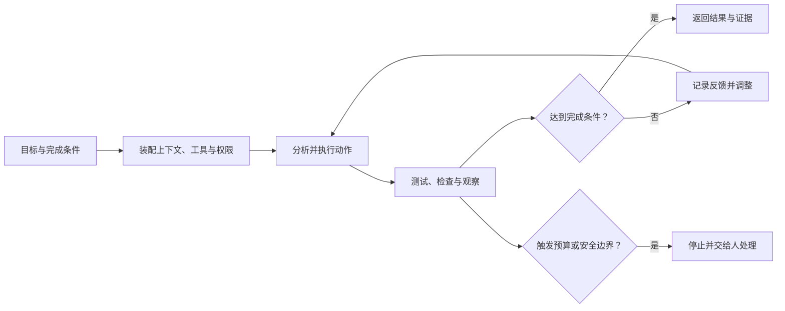
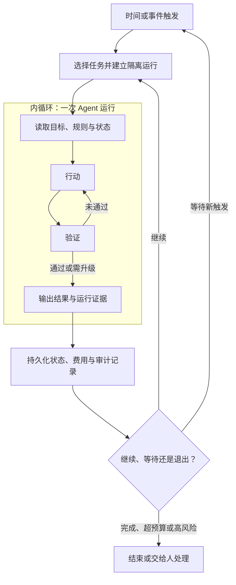

## 核心

随着 AI 一代代变强，人做的事情也在一层层往上移。这可以称为“人类控制点上移”（人不再亲自处理每个细节，而是转去决定目标、准备环境和设计规则）：最开始人亲自干活，后来只需要告诉 AI 做什么，再后来连什么时候开始、失败后怎么办也交给系统。

小普在 2026 年 6 月 14 日发布的[《Loop Engineering 不是新楼层，是 Harness 长出来的外循环》](https://www.woshipm.com/share/6413154.html)把这次控制点上移称为 **Loop Engineering（循环工程）**，并提出一个有用的判断：它不是替代 Prompt、Context 或 Harness Engineering 的全新体系，而是把 Agent 的生命周期与调度问题单独放大。

“AI 能连续自主工作多久”是观察这次变化的外在线索，更深层的变化则是人能够从多少执行细节中抽身。与此同时，这些名称并不是已经定型的行业分层标准；它们更像四种观察尺度，分别关注指令、信息、运行环境和跨执行调度。

1. Table of Contents, ordered
{:toc}

## AI 越自主，人类的控制点越向上迁移

Prompt、Context、Harness 与 Loop Engineering 展示的不是四次简单的技术换代，而是人逐层退出具体执行、转向更高层系统设计的过程。

| 观察尺度 | 人主要处理的问题 | 抽象层级 |
|---|---|---|
| Prompt Engineering | 把具体操作改写成可执行的任务描述 | 指令层 |
| Context Engineering | 决定模型应该看到哪些信息和规则 | 信息层 |
| Harness Engineering | 把工具、权限、验证与恢复固化成运行环境 | 系统层 |
| Loop Engineering | 设计谁来启动、怎样衔接状态以及何时停止 | 控制层 |

这种迁移可以用“人必须在哪个位置介入”来理解。单轮问答中，人每次都要输入指令；工具调用让模型可以自行完成若干步骤；Harness 又让它在约束、验证和恢复机制中执行更长的任务。当多个任务需要跨时间、跨会话甚至并行运行时，人再逐次按下回车就会成为瓶颈，于是启动、验收、重试和停止也需要程序化。

人的工作并没有凭空消失，而是被压缩进更高层的系统资产：操作经验变成 Prompt，信息判断变成 Context 规则，工程规范变成 Harness，调度经验则变成 Loop。层级越高，日常操作越少，但一次错误决策影响的任务也越多，因此人的责任从“做每一步”转向“定义什么是对的，并限制系统怎样寻找答案”。

因此，外层能力必须建立在内层能力之上。自动调度不会消除 Prompt 和 Context，反而会把它们重复使用；如果指令含糊、上下文陈旧或权限过宽，循环只会更快、更频繁地放大问题。

## Harness 先让一次执行形成可靠的内循环

一次 Agent 运行内部，本来就存在“观察—行动—反馈—调整”的循环。以修复测试失败为例，Agent 读取错误与项目规则，定位原因，修改代码，再运行测试；如果验证未通过，它根据新的错误继续修正，直到达到完成条件或触发退出条件。

这类循环与 [ReAct](https://arxiv.org/abs/2210.03629) 所描述的推理、行动和观察模式相近。Harness 的作用，是给循环准备可靠的工作环境：项目规则告诉 Agent 应该怎样做，工具和权限限定它能够做什么，测试与检查提供反馈，运行记录则支持失败恢复和复盘。此前的[《工作区优先的 Agent Harness 设计》](/posts/2026/07/06/agent-harness-workspace-first/)进一步讨论了上下文、工具、记忆、运行轨迹和权限怎样在工作区内收束。

只要这个内循环仍不能稳定完成一次任务，增加调度频率或并行实例就没有意义。外循环提高的是执行次数和覆盖范围，并不会自动提高每一次执行的正确率。

## Loop Engineering 把多次执行接成外循环

Loop Engineering 关注的是单次 Agent 运行之外的控制面：什么时间或事件启动任务，任务交给哪个 Agent，上一轮状态从哪里恢复，结果由谁验收，失败后重试还是升级给人，以及整个系统何时收工。

例如，每天早晨检查新的高优先级 bug 是外循环；进入仓库后分析问题、修改代码并跑测试是内循环；修复完成后创建待审阅的 PR、更新任务状态并等待下一次触发，又回到外循环。**Harness 让一次执行可信，Loop 让多次执行能够自动衔接。**

定时器只是外循环的一个入口。`cron` 可以按时启动任务，却不会自动提供任务选择、上下文恢复、质量验证、状态持久化、权限控制和费用上限。把 Loop Engineering 简化成定时任务，就像把 CI/CD 简化成一次 Git push：触发动作存在，但真正决定可靠性的控制链路还没有建立。

## 一个可运行的闭环需要六类契约

外循环要在无人逐轮盯守时保持可控，至少需要目标、上下文、动作、反馈、状态和退出六类契约。

| 契约 | 需要回答的问题 | 缺失后的典型结果 |
|---|---|---|
| 目标 | 怎样才算完成 | Agent 持续优化模糊目标，无法收敛 |
| 上下文 | 本轮需要哪些规则、事实和历史 | 每次从头推导，重复犯错 |
| 动作 | 能使用哪些工具、修改哪些对象 | 权限过小无法执行，权限过大造成破坏 |
| 反馈 | 用什么证据判断结果是否合格 | 错误输出被当成成功继续传播 |
| 状态 | 已尝试什么、当前进度和下一步存在哪里 | 跨会话后丢失进度或重复工作 |
| 退出 | 何时完成、暂停、超预算或升级给人 | 无限重试，持续消耗 Token 与计算资源 |

其中，反馈不应只依赖 Agent 对自己输出的主观评价。代码任务可以优先使用测试、类型检查、lint、安全扫描和策略规则；开放式任务可以再引入独立模型或人工复核。把生成与评估分离是合理原则，但“必须由两个 Agent 完成”并不成立：两个模型可能共享盲点，而可重复的确定性检查往往更加可靠。

退出也不只是“任务完成”。成熟的系统至少要区分成功退出、达到重试上限、超过时间或费用预算、权限不足、证据冲突和高风险操作待确认。无法自动判断时，系统应停止并保留足够的运行证据，而不是为了维持循环继续猜测。

## 触发、继续与停止必须分开设计

一个循环是否可靠，取决于启动条件、继续条件和退出条件是否各自明确。原文把定时、事件和目标并列为三种触发方式，便于理解场景，但从控制系统角度看，三者承担的职责并不相同。

- **时间触发**回答“什么时候开始”，适合定期巡检、日报和依赖检查。
- **事件触发**回答“发生什么才开始”，适合 PR 创建、CI 失败或新 issue 到达后的即时处理。
- **目标条件**回答“是否需要继续”，适合迁移全部测试、清空特定待办队列等有可验证终点的任务。
- **退出与预算条件**回答“即使未完成，什么时候也必须停止”，用于阻止无限重试和风险扩散。

这些机制可以组合：每天读取一次 bug 队列属于时间触发；发现新任务后启动修复属于任务选择；“测试与检查全部通过”是目标条件；最多运行两小时、三次失败后转人工则是退出条件。把它们混成一个“触发器”，容易遗漏最重要的停止逻辑。

产品实现也体现了这种区分。Claude Code 的 [`/goal`](https://code.claude.com/docs/en/goal)会在每轮结束后由独立评估器判断完成条件，未满足就继续当前会话；[`/loop`](https://code.claude.com/docs/en/scheduled-tasks)按时间间隔重复提示，更适合会话内轮询。需要脱离当前会话长期运行时，Claude Code 还提供云端 Routines、桌面定时任务和 GitHub Actions 等方式。OpenAI 的 [Codex Automations](https://openai.com/index/introducing-the-codex-app/)则把重复任务按计划运行，并把结果送入待审阅队列。具体功能会继续变化，但“触发、执行、验收、留痕、退出”这几个职责不会消失。

## Multica 是外循环控制面，但还不是完整闭环引擎

[Multica](https://multica.ai/docs)可以看作 Loop Engineering 的一种框架与运行底座。此前的[《Multica 自托管：它是什么，如何部署与运行》](/posts/2026/07/24/multica-selfhost-deployment/)已经介绍了它的定位、控制面与执行面，以及 Server、Daemon 和 Agent Runtime 的部署关系；这里继续关注它怎样承接 Agent 的外循环。Multica 位于 Codex、Claude Code 等 Coding Agent 之外，负责组织任务、选择执行者、调度本机 Runtime，并把过程和结果保存到统一的协作空间；底层 Agent CLI 则负责读取代码、调用工具、修改文件和运行测试。

这套分工正好对应外循环与内循环。Multica Server 保存 Workspace、Project、Issue 和任务队列，Daemon 从队列领取任务并启动本机 Agent Runtime，Codex 或 Claude Code 在单次运行中完成分析、行动和验证，结果再由 Daemon 写回 Server。Multica 主要控制“谁在什么时候开始哪项工作”，Agent Runtime 主要解决“拿到工作后怎样完成”。

Multica 已经覆盖了外循环的大部分基础设施，但不同环节的成熟度并不相同：

| Loop Engineering 能力 | Multica 的实现 | 当前边界 |
|---|---|---|
| 触发 | 分配 Issue、`@mention`、直接聊天，以及 Autopilot 的 cron、webhook 和手动触发 | 已有多种人工与自动入口 |
| 执行者选择 | Agent、Squad 与本机 Runtime | 能把任务路由到不同 Coding Agent |
| 执行调度 | Server 任务队列与 Daemon | 负责启动 Agent CLI，不替代其内部 Harness |
| 状态 | Issue、评论、Task 状态机、运行历史与 Session ID | 适合跨执行追踪和恢复 |
| 失败处理 | 超时、取消、基础设施故障重试和部分状态回滚 | Agent 报告的业务错误不会自动重试 |
| 验收与退出 | Agent 提交到 `in_review`，由人或外部集成确认 `done` | 缺少通用的条件网关和机器验收闭环 |

其中，[Autopilot](https://multica.ai/docs/autopilots)已经是典型的外循环触发器：它可以按 cron 计划或 webhook 自动创建并派发任务。[Task](https://multica.ai/docs/tasks)则是每次 Agent 运行的持久化对象，具有排队、派发、运行、完成和失败等状态，并记录超时与重试。与只会按时执行一条命令的 `cron` 相比，Multica 还提供了任务路由、运行状态、历史记录和协作界面。

但一个完整闭环还需要由系统强制执行“验证—分支—重试—退出”。例如，Coding Agent 提交修改后自动运行 CI，失败则退回开发，成功则交给 Review Agent，审查未通过再次返工，QA 通过后等待人工批准。Multica 当前的 [Issue 状态](https://multica.ai/docs/issues)主要由 Agent 在运行中主动更新，`done` 通常依赖人或外部集成确认；它尚未提供一套通用的声明式工作流，来强制执行条件分支、业务失败重试和多阶段审批。

因此，把 Multica 称为 **Loop Engineering 框架**是合理的，但更准确的定位是“Agent 外循环控制面”：它已经解决触发、路由、状态和可观测性，尚未完整解决确定性验收与强约束流程编排。如果未来补齐 Workflow、条件网关、业务重试、预算退出和人工审批，它就会从 Agent 原生的任务协作平台进一步成为完整的闭环工作流引擎。

## 从单次可靠走向无人值守

稳妥的落地顺序，是逐步延长无人介入的范围，而不是直接从一次对话跳到大规模并行调度。

1. **把完成条件机器化。** 将“把代码改好”改为“目标测试、类型检查和 lint 全部通过，且不再引用旧依赖”。
2. **搭好单次执行的 Harness。** 明确项目规则、上下文来源、工具权限、验证命令、状态记录和敏感操作边界。
3. **在有人观察时运行内循环。** 收集失败类型、费用、误操作和人工接管点，确认它能在一个清晰任务上稳定收敛。
4. **增加小范围外部触发。** 从低风险、只读或容易回滚的任务开始，例如汇总 CI 失败、检查失效链接、生成待审阅报告。
5. **最后再扩大并行度和写权限。** 为每次运行设置隔离环境、预算、幂等机制、审计记录和人工审批门。

这条路径的关键指标不是“Agent 连续跑了多久”，而是成功率、无效重试率、人工接管率、单个有效结果的成本，以及失败后的可恢复性。运行时间更长只代表自动化范围扩大，不代表系统已经可靠。

## 自动化会同时放大产能与缺陷

外循环把人工接力变成自动控制，也会把单次执行中的小问题累积成系统性风险。

- **错误累积：** 上一轮生成的错误状态进入下一轮上下文，后续执行会沿着错误前提继续推进。
- **费用失控：** 模糊目标、全量上下文和高频轮询会在没有有效进展时持续消耗资源。
- **权限扩散：** 自动开分支、改文件、创建 PR 乃至访问生产系统，会扩大误操作与提示词注入的影响面。
- **验证同源：** 生成者和评估者使用相同模型、上下文与假设时，所谓独立检查可能只是重复确认同一个错误。
- **并发冲突：** 多个 Agent 同时处理相关任务时，可能重复劳动、覆盖状态或产生互相冲突的修改。

因此，Loop Engineering 不是“让 Agent 永远运行”的技巧，而是**限制循环怎样运行**的工程：为目标设边界，为动作设权限，为状态设所有权，为验证保留独立证据，为失败准备停止和升级路径。

## 评价

### 写得好的地方

原文最有价值的地方，是用“AI 能连续自主工作多久”这一个变量串起 Prompt、Context、Harness 与 Loop Engineering。术语很多，但人的角色变化因此变得直观：从逐轮提问、装配信息和准备运行环境，逐步转向设计调度与控制系统。这条主线有效缓解了读者面对新概念时的割裂感。

内循环与外循环的区分也很清楚。医院里“医生看病”和“医院排班”的类比，把单次运行内的分析、行动和纠错，与跨运行的启动、交接和状态管理分开，能够帮助没有 Agent 架构背景的读者建立正确直觉。原文提出的目标、上下文、动作、反馈、状态和退出六项要素，又把抽象概念落到了可以检查的系统组件上。

原文强调“内循环没跑通之前不要上外循环”，是全文最重要的工程提醒。自动化提高的是执行频率，不会自动提高正确率；先让一次任务稳定完成，再增加定时触发和多 Agent 并行，能够避免把不可靠执行扩展成持续生产错误的系统。

### 可以改进的地方

原文把四类 Engineering 与 2023 至 2026 年逐年对应，适合作为叙事线索，却容易让人误以为它们是行业已经形成共识的标准分层。实际上，这些概念边界仍在变化，也存在大量重叠；“Harness 是内循环、Loop 是外循环”是一种有解释力的框架，而不是唯一的正式定义。

“Loop 相比 Harness 只新增触发机制”的结论也压缩得过多。跨会话循环不仅需要触发，还需要任务选择、并发控制、幂等、状态所有权、失败恢复、费用预算和人工升级。原文后文实际上已经涉及其中几项，因此“只差一个触发器”更适合当作帮助入门的简化表达，不能直接当作系统设计结论。

原文将时间、事件和目标并列为三种触发方式，没有严格区分控制职责。时间和事件回答“何时开始”，目标回答“是否继续或已经完成”，预算与安全边界则回答“即使没有完成，何时也必须停止”。如果把目标也当成入口，实际实现时容易重视启动而遗漏退出。

反馈部分提出“干活的和检查的必须是两个人”，方向上强调了评估独立性，但表述过于绝对。两个 Agent 可能共享模型、上下文和盲点；对于代码任务，测试、类型检查、lint、安全策略和权限规则通常比另一个模型的主观判断更可靠。更准确的原则应是让结果接受独立证据验证，而不是固定要求使用两个 Agent。

最后，原文以演讲、社交媒体观点和产品功能为主要证据，足以说明趋势已经出现，却不足以证明长时间无人值守的 Loop 已经普遍可靠。任务成功率、无效重试率、单位有效结果成本、并发冲突、提示词注入和状态污染都没有得到数据层面的展开。因此，它更适合作为 Loop Engineering 的概念地图和实践倡议，而不是一套已经经过规模化验证的工程方法论。
