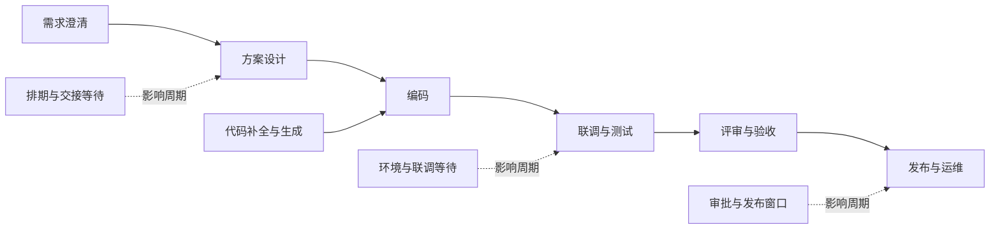
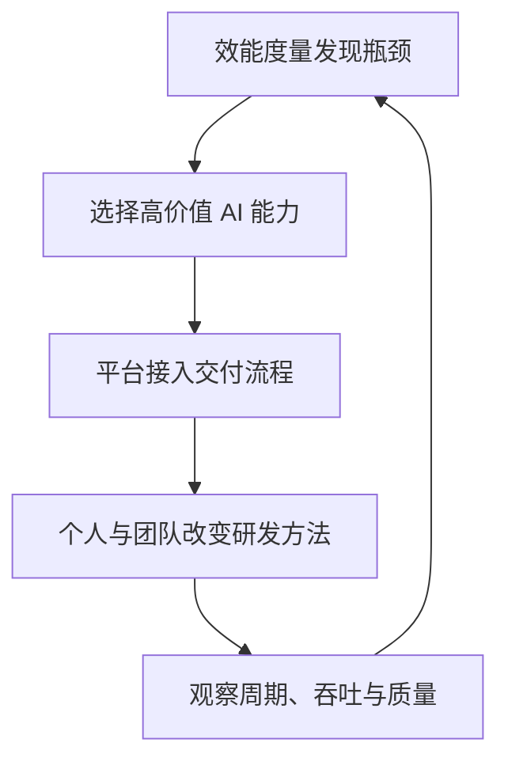

## 核心

**AI 生成了多少代码，只能说明一个局部环节采用了 AI；组织是否真正提效，要看需求能否以更短周期、更低协作成本和可控质量完成端到端交付。** 要让前者传导到后者，企业必须同时改造研发流程、人员分工、内部平台和度量体系，而不是只给工程师安装一个更强的编程助手。

本文重写自快手技术团队 2026 年 2 月 9 日发表于 InfoQ 的[《3年、1万人，快手技术团队首次系统披露AI研发范式升级历程》](https://mp.weixin.qq.com/s/Ejxpxn_MrJ1PDf-K38MpEg)。文中的快手数据均为原文披露的内部案例口径；关于“AI 会放大既有组织能力”的外部判断，可与 [DORA 2025 年 AI 辅助软件开发报告](https://dora.dev/research/2025/dora-report/)相互参照。

1. Table of Contents, ordered
{:toc}

## 一个反直觉的起点：代码变快，需求没有变快

快手从 2024 年起向一万多名研发人员推广自研 AI 编程工具 Kwaipilot，并把 AI 能力扩展到代码评审、测试用例、单元测试和 OnCall 等环节。按其内部的严格统计方式，整体 **AI 代码生成率从约 1% 上升到 30% 以上，部分业务线超过 40%**；主观调研中，开发者普遍感觉编码效率提升了 20%～40%。

但从业务线的全局数据看，**需求吞吐量和交付周期没有同步改善**。这暴露出三个经常被混为一谈的概念：

- **工具采用**：开发者是否使用了 AI，AI 生成内容占多少；
- **个人提效**：一个人能否承担更多工作，并更快交付完整任务；
- **组织提效**：团队能否用同样资源交付更多有价值的需求，同时维持质量和稳定性。

编码只是价值流中的一个环节。即使它明显变快，需求分析、技术设计、跨角色等待、联调、测试、评审、发布和线上验证仍可能保持原速。开发者省下的零碎时间若不足以再接一个完整任务，局部收益便不会反映为吞吐量提升。

端到端周期由所有处理时间和等待时间共同决定。只优化 `C`，相当于在一条拥堵公路上拓宽其中一百米；如果瓶颈在下一个路口，整段行程几乎不会变快。

## AI 之前，研发数据必须先可信

快手能发现上述矛盾，并不是因为先有了 AI，而是因为此前完成了研发平台化、流程标准化和效能度量。这个顺序构成了整套案例最重要的前提。

### 用统一底座承接不同研发场景

2023—2024 年，快手先将需求流和工程流接入公司级研发效能体系：项目管理由 Team 承载，服务端、前端和客户端分别使用 KDev、KFC 与 Keep，质量、度量和运维另有对应平台。三端没有被强行合并成同一套界面，因为技术栈、发布模式和开发习惯差异很大；真正复用的是流水线、权限、数据和质量卡点等底层能力。

这是一种 **“前台允许差异、后台统一语义”** 的标准化。它既避免各团队继续使用互不相通的私有流程，也没有为了形式统一而抹平真实业务差异。原文披露，落地后研发工具渗透率超过 95%，流程自动化翻转率超过 94%。

### 先观测价值流，再决定优化哪里

流程在线化后，需求、任务、代码、测试、发布和人员投入才可以在同一条链上关联。快手以“人均交付产品需求数”为北极星指标，同时观测需求颗粒度、产品需求投入占比、缺陷、OnCall、等待时长和各阶段周期，避免团队通过拆小需求或牺牲质量“做高”单一数字。

这套度量不是为了给人排名，而是为了定位系统瓶颈。例如，一支团队的产品需求投入占比偏低，同时体验优化、缺陷和排障占比偏高。结合访谈后，问题被追溯到客户端架构耦合：工程师大量时间花在理解陌生模块，改动又容易引发旧功能缺陷。数据负责暴露异常，访谈和工程分析负责解释原因，最终落地的是架构升级与体验治理，而不是要求开发者“写快一点”。

经过一年的平台、流程、工程和协同改造，原文称主站技术部的人均需求吞吐量提升了 41.57%。这个结果说明：**AI 不是研发效能建设的起点，可信数据与可治理流程才是。** 没有这层地基，组织既无法判断 AI 改善了什么，也无法看见它把问题转移到了哪里。

## 三种开发方法，区别在 AI 介入多深

快手把真实业务中的 AI 开发方式分成三类。这个分类不以使用哪款工具为边界，而以 **AI 覆盖了多少研发活动、人与 AI 如何分工** 为边界。

| 开发方法 | AI 的主要作用 | 人的主要作用 | 原文观察到的典型效果 |
|---|---|---|---|
| AI 辅助编码 | 在编码节点补全、生成或修改代码 | 仍按原流程完成设计、编码、联调和测试 | 编码效率约提升 10%～20%，但整体开发周期变化有限 |
| AI 辅助开发 | 分别参与需求分析、设计、编码、评审和测试 | 拆分任务，调用不同 AI 能力并审核结果 | 单个开发任务周期可缩短约 30% |
| AI 协同开发 | 根据结构化需求贯穿多个节点，传递上下文并执行任务 | 澄清目标、调整方案和验收结果 | 适配需求的开发周期可缩短约 40% |

假设一个前端任务从设计到合入需要五天，其中纯编码只有一天。AI 即便把编码时间砍半，也只省半天，而且剩余时间未必足以承接另一个完整任务。若 AI 同时参与方案、编码、测试和评审，多个环节的节省可以累加；若进一步改变前后端分工与交付方式，减少交接节点，才可能缩短需求级周期。

原文对某业务线三个月的已交付需求进行回看后认为，在不大改流程和协作模式的情况下，约 50%～70% 的需求可以采用 AI 辅助开发，另有 2%～10% 可以尝试更激进的 AI 协同开发；现实中，真正使用后两种方法的人不足 10%。因此，主要缺口已不是模型有没有能力，而是 **团队是否掌握了新方法，平台是否承接得住，管理机制是否允许协作方式改变**。

## 从 Copilot 到 Agentic：成熟度必须落在需求上

为了把个人用法变成组织语言，快手没有继续用“某人每天调用几次 AI”衡量成熟度，而是按一个需求在交付过程中由 AI 承担的程度，将其分为 L0～L3：

| 等级 | 研发模式 | 人机关系 | 适合的工作 |
|---|---|---|---|
| L0 | 人工开发 | 人完成全部研发活动 | 暂不适合 AI 或缺少必要上下文的需求 |
| L1 | AI 辅助（Copilot） | 人主导，AI 主要辅助编码 | 大多数常规需求的基础模式 |
| L2 | AI 协同（Agent） | AI 承担多个研发节点，人审核和调整 | 结构较清晰、可拆分且有平台能力支撑的需求 |
| L3 | AI 自主（Agentic） | 人澄清需求并验收，AI 完成主要交付流程 | 颗粒度小、边界独立、可自动验证的需求 |

这套分级有两个价值。第一，讨论对象从“员工会不会用 AI”变成“需求能达到什么交付模式”，更接近业务结果。第二，组织不必等待所有人、所有系统同时跨入下一代模式，可以让 L0、L1、L2、L3 在同一平台并存，再随人员能力和 AI 能力逐步迁移。

不过，L3 不等于取消人工责任。原文中的“自主”仍以需求边界清楚、验证机制充分为前提，人需要在上线前后承担验收职责。安全、合规、架构决策和高风险变更也不能仅凭成熟度标签自动放权。

## 平台要连接价值流，而不只是包住模型

传统 DevOps 平台掌握需求、代码、测试、发布和运维数据，却不擅长以自然语言驱动工作；新生 AI IDE 擅长生成代码，却常常看不到企业知识和完整交付流程。若两者各自演进，结果往往是旧平台继续承载主流程，新工具只形成一组散点能力。

快手为此把下一代研发平台拆成四层：

- **AI Studio**：统一研发问答、方案调研和开发入口，减少工具切换；
- **Flow**：把需求到发布组织成可执行工作流，让传统人工节点和 Agent 节点共存；
- **Agents**：封装需求分析、代码生成、代码评审、测试、发布和运维等原子能力；
- **Mind**：持续积累业务知识、代码规范、企业流程、运行数据和 Agent 经验，使 AI 不再每次都像第一天入职。

其中 Flow 是承上启下的关键。L1 需求可以继续由人推动所有节点，只在编码时调用 AI；L2 需求可让 AI 完成需求分析、技术设计、编码和测试等多个节点，再由人审核；L3 需求则可让工作流自动运行到验收点。上游生成的结构化需求和设计文档会自动传给下游 Agent，避免开发者在不同工具间重复复制上下文。

Mind 则回应了企业 AI 最常见的效果瓶颈：通用模型会编程，但不了解公司的业务术语、存量架构、历史决策和发布规则。把这些上下文做成可治理、可更新的知识与记忆层，比要求每个人维护一份越来越长的 Prompt 更可持续。

## 度量要同时看过程、结果与护栏

快手在智能化 1.0 阶段重点观测 AI 代码生成率。其披露的统计口径比常见的插件接受率更严格：分母是公司代码库最终入库的全部新增代码行；分子需要把这些代码与 AI 输出逐行比对，编辑距离低于 50% 才计为 AI 生成。

这个指标适合判断编码环节的 AI 渗透，却仍不能回答需求是否更快交付。进入智能化 2.0 后，度量被拆成三层：

| 层次 | 关注的问题 | 代表指标 |
|---|---|---|
| 过程 | AI 是否进入了完整交付流程 | L1、L2、L3 需求占比，各研发阶段 AI 渗透率 |
| 结果 | 组织是否交付得更多、更快 | 需求交付周期、人均需求吞吐量、有效代码产出 |
| 护栏 | 提速是否牺牲质量与稳定性 | 缺陷、返工、发布稳定性、OnCall、用户价值 |

原文给出了一些阶段性内部结果：一个不足 50 人的标杆团队相较快手整体基准，人均交付需求数高 38%，需求交付周期短 53%；最早完成转型的团队中，L2 与 L3 需求合计占比达到 20.34% 时，需求交付周期下降 58%。这些数据展示了可能性，但更适合作为案例线索，而不是直接外推为“采用某种 Agent 就能获得固定收益”的因果公式。

真正值得复用的是度量方向的变化：**从统计 AI 产出了多少，转向统计有多少需求改变了交付方式，以及这种变化是否改善最终结果。**

## 组织转型不是一场工具培训

个人掌握新方法只是第一层。要让它进入日常交付，快手把落地分成个人、团队和业务线三个尺度。

### 个人：找到标杆，再把隐性技巧变成标准方法

团队先通过使用数据和负责人推荐找到真正被 AI 提效的开发者，收集其失败案例与有效做法，再沉淀为指南、实战课程和入职培训。工具也根据这些反馈补充企业代码、研发流程和业务知识。这样推广的不只是操作界面，而是一套可复制的开发方法。

### 团队：改排期、分工和验收方式

如果排期仍按旧工时估算，AI 节省的时间不会变成新增产能；如果前端、后端、测试和发布仍严格串行，局部提速会在交接处重新排队。团队级改造因此包括需求分级、任务拆分、全栈或跨栈协作、AI 产物验收规则，以及将省下的个人时间重新组织为团队产出。

### 业务线：用共同目标牵引平台与流程

大规模转型需要管理者明确目标、建立跨团队项目并持续看数据，但目标不能只是“AI 使用率达到多少”。快手以 L2、L3 需求占比和需求交付结果牵引平台能力建设，把 AI 原子能力优先投向人力占比高、预期回报大的研发环节，再通过试点验证后规模推广。

这形成了一个闭环：

## 可复用的落地顺序

快手的具体平台是企业内部产物，但演进顺序可以抽象为一条更通用的路线：

1. **统一数据语义**：把需求、任务、代码、测试、发布和运维关联起来，先建立可信的价值流数据。
2. **识别真实瓶颈**：用客观指标发现异常，再结合访谈和工程分析解释原因；不要默认瓶颈一定在编码。
3. **从单点试验开始**：用 AI 辅助编码验证模型、工具和企业上下文的效果，同时记录失败案例。
4. **定义开发方法**：区分辅助编码、辅助开发、协同开发与自主开发，明确每种模式下人和 AI 的责任。
5. **以需求分级**：让不同成熟度共存，避免对所有需求一刀切，也避免用个人活跃度代替交付成熟度。
6. **连接完整流程**：让 Agent 接入研发平台，能够获得上游上下文、执行下游动作，并在关键节点等待人工验收。
7. **改造团队机制**：同步调整排期、分工、评审、质量与风险治理，使局部节省能够转化为团队吞吐。
8. **用结果校验过程**：AI 代码生成率和调用量只能解释过程，最终仍要回到交付周期、吞吐、质量、稳定性与业务价值。

这条路线的核心不是尽快把所有需求推到 L3，而是建立一个 **可观测、可验证、可逐级放权** 的系统。AI 能力、人员能力和业务风险会持续变化，组织需要保留降级到人工流程的能力，并让每次升级都有数据证据。

## 评价

### 写得好的地方

原文最有价值的部分，是公开承认了“AI 代码生成率持续上涨，但组织交付效率基本不变”这个负结果。它没有停在工具功能和采用率，而是向前追溯研发基建，向后扩展到流程、分工、平台与度量，给出了从局部自动化走向组织变革的完整因果链。

材料也提供了较丰富的工程细节：三端研发平台为什么不强行统一，代码生成率如何计算，需求怎样按 AI 参与程度分级，传统 DevOps 与 Agent 平台怎样共存。这些细节让案例不只是“拥抱 AI”的管理口号。它与 DORA 2025 年报告的核心判断也相互呼应：AI 更像放大器，会扩大既有平台、流程与团队协作的优势，也会暴露原有系统的断点。

### 可以改进的地方

原文同时承担内部复盘、方法论发布和产品宣传三种目的，内容很丰富，但概念层级偶有重叠。例如“AI 辅助开发 / AI 协同开发”与“L1 / L2 / L3”的映射并非处处严格一致，读者需要自行区分开发方法、需求成熟度和平台能力成熟度三套分类。

数据方面，文章披露了许多漂亮的百分比，却较少提供样本量、观察窗口、方差、质量变化和对照组选择方式。需求周期下降与 L2、L3 占比上升存在相关性，不足以单独证明因果；团队选择、需求类型、人员能力和同期流程改造都可能影响结果。文中“50%～70% 的需求适合 AI 辅助开发”等判断也来自单一业务线的内部回看，不宜直接套用到其他公司。

此外，L3 自主开发的适用边界仍可以讲得更具体：哪些变更必须人工审批，如何处理安全与合规，Agent 失败后怎样恢复，知识与记忆如何防止过期或泄露，以及生成速度上升后如何保护软件交付稳定性。这些问题决定了“能自动完成”能否真正升级为“可以放心交付”。
