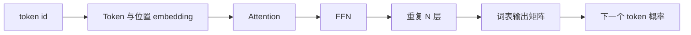

## 核心

**GPT 的参数主要存放在 embedding、Attention 和 FFN 的权重矩阵中；对经典稠密 decoder-only Transformer，总参数量可以近似写成 $12Nd^2+vd$。** 这个公式既解释了模型为什么会随隐藏维度平方增长，也给出了估算权重显存的起点。

1. Table of Contents, ordered
{:toc}

## 参数是模型训练后留下的可调数字

神经网络训练的过程，是不断调整权重，使模型对训练数据给出更合适的输出。训练结束后保存到模型文件里的核心内容，就是这些权重参数。

GPT 采用 decoder-only Transformer（只保留解码器堆栈、逐个预测后续 token 的模型）。输入文本先被切成 token，再经过 embedding 变成向量；向量依次穿过多层 Attention 和 FFN，最后被映射回词表上的概率分布。

这条计算链上并不是每一步都有大量参数。激活函数、残差相加和 Softmax 主要是计算；真正占据模型文件的，是把一个向量线性变换为另一个向量的矩阵。

## GPT 的参数分别存在哪里

先定义四个与规模有关的量：

- $N$：Transformer 层数；
- $d$：隐藏维度，即每个 token 向量的宽度；
- $v$：词表大小；
- $t$：模型支持的位置数量，即位置 embedding 的长度。

经典 GPT 的主要参数可以按模块列出来：

| 模块 | 主要参数 | 典型形状 | 参数量级 |
|---|---|---|---:|
| Token embedding | $E$ | $v\times d$ | $vd$ |
| 位置 embedding | $P$ | $t\times d$ | $td$ |
| Attention | $W_Q,W_K,W_V,W_O$ | 每个约 $d\times d$ | 每层 $4d^2$ |
| FFN | $W_1,W_2$ | $d\times4d$、$4d\times d$ | 每层 $8d^2$ |
| LayerNorm 与 bias | 缩放和偏置向量 | 若干长度为 $d$ 的向量 | 每层 $O(d)$ |
| 输出层 | $W_{out}$ | $d\times v$ | $vd$ |

输入 Token embedding 和输出层经常使用权重共享（两个位置引用同一组参数），此时词表部分只需计算一次 $vd$；如果不共享，则要分别计算。位置 embedding、LayerNorm 与 bias 也有参数，但在大模型中通常比 $Nd^2$ 小得多。

## Attention 为什么约有每层四个平方项

自注意力先把输入分别投影成 Query、Key 和 Value，再把所有注意力头的结果通过输出矩阵投影回隐藏维度。忽略 bias 后，四个主要矩阵都是 $d\times d$：

$$
P_{\text{attention, layer}}
\approx d^2+d^2+d^2+d^2
=4d^2
$$

多头不会在这个经典估算中额外乘上头数。若有 $h$ 个头，每个头的宽度通常是 $d/h$；把所有头的投影相加后，总宽度仍然是 $d$。

现代模型可能使用 MQA 或 GQA（让多个 Query 头共享更少的 Key、Value 头），这会减少 $K$ 和 $V$ 的参数及 KV cache。$4d^2$ 因此是经典多头注意力的近似，不是所有 Transformer 的固定常数。

## FFN 为什么通常比 Attention 参数更多

标准前馈网络（Feed-Forward Network，FFN）先把每个 token 向量从 $d$ 扩张到 $4d$，经过非线性变换后再压回 $d$。两次线性变换的参数量是：

$$
P_{\text{ffn, layer}}
\approx d\times4d+4d\times d
=8d^2
$$

因此，在使用四倍扩张的经典结构中，每层 Attention 约占三分之一参数，FFN 约占三分之二。模型虽然以“Attention”闻名，参数最多的部分往往是 FFN。

不同模型会采用不同扩张比例。SwiGLU 等门控 FFN 还会增加一组投影矩阵，并通过调整中间维度控制总参数量。实际计算必须读取模型配置，不能无条件套用 $8d^2$。

## 一个近似公式解释参数规模

把每层的 Attention 和 FFN 相加，再计入共享的词表矩阵，可以得到经典稠密 GPT 的近似参数量：

$$
P\approx N(4d^2+8d^2)+vd
=12Nd^2+vd
$$

位置 embedding、LayerNorm 和 bias 被省略，是因为它们随 $d$ 线性增长，而 Transformer 主体随 $d^2$ 增长。当 $N$ 和 $d$ 足够大时，平方项占据主导。

这个公式揭示了两个缩放规律：

- 参数量对层数 $N$ **线性增长**；
- 参数量对隐藏维度 $d$ **平方增长**。

把网络加宽比单纯加深更快地推高参数量。[GPT-3 论文](https://arxiv.org/abs/2005.14165)给出的 175B 配置是 96 层、隐藏维度 12288。取词表大小 50257，代入公式：

$$
12\times96\times12288^2+50257\times12288
\approx174.6\text{B}
$$

结果已经非常接近公开的 175B。

| 模型 | 层数 $N$ | 隐藏维度 $d$ | 参数量 |
|---|---:|---:|---:|
| GPT-1 | 12 | 768 | 117M |
| GPT-2 | 48 | 1600 | 1.5B |
| GPT-3 | 96 | 12288 | 175B |

从 GPT-2 到 GPT-3，层数变成 2 倍，隐藏维度变成约 7.7 倍。仅主体平方项就会放大约：

$$
2\times7.7^2\approx119
$$

这比“多堆了几层”更准确地解释了百倍参数增长来自哪里。

## 参数量怎样换算为显存

如果只存放权重，内存下限可以写成：

$$
M_{\text{weights}}=P\times b
$$

$P$ 是参数个数，$b$ 是每个参数占用的字节数。175B 参数使用 FP16 或 BF16 时，每个参数约占 2 字节，因此纯权重需要：

$$
175\text{B}\times2\text{ bytes}=350\text{GB}
$$

| 权重格式 | 每参数近似字节数 | 175B 纯权重大小 |
|---|---:|---:|
| FP16 / BF16 | 2 | 350GB |
| INT8 | 1 | 175GB |
| 4-bit | 0.5 | 87.5GB |

这些数字只是理论下限。量化模型还要保存缩放因子、分组信息等元数据；模型文件格式和运行时也可能引入额外开销。

[NVIDIA A10 官方规格](https://www.nvidia.com/content/dam/en-zz/Solutions/Data-Center/a10/pdf/datasheet-new/nvidia-a10-datasheet.pdf)是 24GB GDDR6；80GB 则是 [A100 的一种规格](https://www.nvidia.com/content/dam/en-zz/Solutions/Data-Center/a100/pdf/nvidia-a100-datasheet-nvidia-us-2188504-web.pdf)。$350/80=4.375$ 只能说明 FP16 权重至少要跨 5 张 80GB 卡存放，不能证明 5 张卡足以完成实际推理。

## 真实推理显存还取决于运行状态

推理除了模型权重，还要保存多类运行状态：

- **KV cache：** 缓存历史 token 的 Key 和 Value，随层数、序列长度和并发量增加；
- **激活与临时张量：** 保存当前算子的输入、输出和中间结果；
- **通信缓冲区：** 多卡推理时用于传递和聚合张量；
- **运行时预留：** 包括显存分配器、算子工作区和框架本身的开销。

因此，“多少参数”只能回答模型权重有多大，不能单独回答“需要几张 GPU”。部署估算至少还要明确权重精度、批大小、上下文长度、并发数和并行策略。

训练的内存结构更加复杂。除权重外，还可能同时存在梯度、优化器状态、主权重副本和反向传播所需激活。用纯权重大小估算训练显存，通常会严重低估需求。

## 评价

### 写得好的地方

用 $12Nd^2+vd$ 把结构与规模连接起来，是理解 GPT 参数量最有效的入口之一。它不只给出一个数字，还解释了参数具体位于 Attention、FFN 和词表矩阵的什么位置，以及隐藏维度为什么比层数更快地推高模型规模。

从参数量继续换算权重显存，也让抽象的“175B”变成了可用于容量规划的工程量。只要始终把结果称为理论下限，这种估算就能帮助人快速检查模型能否装入目标硬件。

### 可以改进的地方

近似式依赖经典稠密 GPT 的结构假设，没有覆盖门控 FFN、GQA、未共享 embedding、MoE 和不同位置编码等现代变化。对于任意真实模型，最可靠的方法仍是读取配置文件，逐个统计实际张量形状。

显存部分也没有给出完整部署计算器。KV cache 还需要代入层数、Key/Value 头数、头维度、序列长度、批大小和数据精度；多卡场景还要考虑张量并行的切分方式与通信工作区。补充一个具体模型的端到端测量，会让理论下限与真实峰值之间的差距更加直观。
