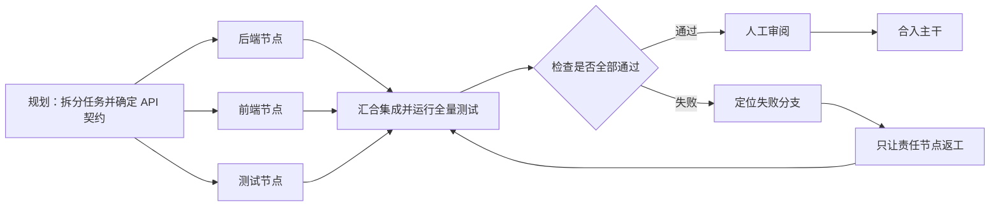

## 核心

**Graph Engineering（图工程）不是用图取代 Agent 的循环，而是把多个循环放进一张可调度的控制图：节点负责执行，边负责路由，结构化状态负责交接与恢复。** 它要解决的不是单个 Agent 会不会完成一步，而是并行、分支、返工与人工审批怎样稳定组成一条长流程。

本文整理自小林 coding 的[《Loop Engineering 已死，Graph Engineering 永生》](https://mp.weixin.qq.com/s?__biz=MzUxODAzNDg4NQ%3D%3D&mid=2247560325&idx=1&sn=2d8aff16200b26fe1802c555c83b0618&chksm=f881aaa703af0e3d9d9bc2267d06f63b6d6275946ca601726fa151cf6237668749cba7494769)，并结合 LangGraph 与 Claude Code 官方资料核对其中的实现边界。原文发表于 2026 年 7 月 24 日，讨论的是控制图（描述任务下一步怎样执行），不是 GraphRAG 所说的知识图谱（描述数据中的实体与关系）。

1. Table of Contents, ordered
{:toc}

## 新名称指向的是老问题的新瓶颈

Agent 最常见的基本结构是一个循环：模型观察当前信息，选择工具并执行，再读取结果、修正计划，直到完成或停止。此前的[《从 Harness 到 Loop Engineering：把 Agent 接成自动闭环》](/ai/2026/08/03/agent-loop-engineering/)已经讨论过，Prompt、Context、Harness 和 Loop 关注的是逐渐向外扩展的控制层。

当任务较小时，一个循环足以处理所有步骤。任务扩大后，瓶颈开始从“每一步能不能做好”迁移到“许多步骤怎样协作”：三个互不依赖的分支不该排队执行；某一路失败不该让全部工作重来；高风险动作需要等待审批；运行数小时后中断，也应该从最近的稳定位置恢复。

[“Graph Engineering”一词的早期长文](https://www.drjoshcsimmons.com/writing/we-are-entering-the-graph-engineering-phase)把这种变化概括为：单循环已经足够好，好到暴露了串行调度、会话状态和故障恢复的上限。不过，状态机、工作流引擎、DAG 与持久化任务并不是新发明。[LangChain 对三年 LangGraph 实践的回顾](https://www.langchain.com/blog/3-years-of-graph-engineering-with-langgraph)也承认，这个名称是新流行语，背后的工程方法早已存在。

真正的新变化，是**节点里能够放入一个相对可靠的完整 Agent**。过去的工作流节点多是普通函数、数据库操作或一次 API 调用；现在，一个节点可以自己读代码、使用工具并完成一段开放式工作。系统设计的重心因此从“怎样调用一次模型”转向“怎样让多个具备行动能力的节点共同完成任务”。

## Loop 没有消失，而是成为节点内部的执行方式

“Loop 已死”适合做标题，却不是文章最后得出的技术结论。Loop 本来就是一种带回边的图：执行到检查节点后，如果条件未满足，就沿着边回到前面的工作节点。

把 Agent 放入更大的控制图后，两个层次各自处理不同问题：

| 层次 | 主要问题 | 典型动作 |
|---|---|---|
| 节点内部的 Loop | 一个执行单元怎样完成任务 | 观察、调用工具、检查结果、继续或停止 |
| 节点之间的 Graph | 多个执行单元怎样协作 | 拆分、并行、汇合、路由、返工、暂停与恢复 |

因此，Graph Engineering 不会让 Prompt、Context、Harness 或 Loop 过时。每个 Agent 节点仍然需要明确目标、合适上下文、受控工具和可靠退出条件；控制图只是进一步规定这些节点何时启动、交换什么信息，以及失败后走向哪里。

图也不等于无环图。生产流程通常需要重试、返工、向用户补问信息和反复调用工具，天然包含环。更准确的理解是：**Loop 是 Graph 的一种局部结构，Graph 是多个 Loop 与确定性步骤的组织方式。**

## 一张可执行的图由节点、边和状态组成

[LangGraph 的 Graph API](https://docs.langchain.com/oss/python/langgraph/graph-api)把核心抽象归纳为 State、Nodes 和 Edges。三者名称简单，但工程质量主要取决于它们之间的契约是否清楚。

### 节点只承担一项可验证职责

节点（Node）是执行单元，可以是普通代码、一次查询、一个 Agent，或一个做审批决定的人。理想节点有三个特点：职责单一、输入输出明确、可以独立测试和替换。

如果一个节点同时负责理解需求、修改前后端、运行测试和决定是否部署，那么它只是把原来的大循环换了一个名字。拆分节点的目的不是让流程图看起来复杂，而是建立清晰的**故障域（某个错误只影响哪一部分工作）**。只有边界清楚，系统才能只重试失败分支，而不是把整条流程重新执行。

### 边把下一步选择变成显式规则

边（Edge）决定执行完当前节点后去哪里。设计边时需要分开考虑两个维度：

- **固定还是条件分支：** 有的步骤永远进入同一节点；有的步骤要根据测试结果、风险等级或任务类别选择下一条路径。
- **代码还是模型决策：** 测试是否通过、预算是否超限适合由代码判断；工单属于退款还是投诉，可能需要模型理解语义。

条件边不等于模型边。“测试失败就返工”是一条由代码判断的条件边；“根据用户描述选择处理部门”才是由模型判断的条件边。可靠设计通常会把能够确定的路径写成代码，只在确实需要语义理解时让模型决定。

### 状态是结构化交接，不是更长的聊天记录

状态（State）记录任务当前走到哪里、每个节点产出了什么、哪些检查已经通过，以及消耗了多少预算。它应当是一份带有固定字段的对象，例如：

```json
{
  "branches": {
    "backend": {"status": "done", "artifact": "api/export.py"},
    "frontend": {"status": "running"},
    "tests": {"status": "pending"}
  },
  "integration": {"status": "waiting"},
  "budget": {"tokens_used": 12000}
}
```

主调度器只需要读取这些明确字段，不必接收每个 Agent 的全部工具日志和中间过程。各节点可以保留适合自己的工作上下文，对外只交付后续节点真正需要的产物、状态与证据。这既降低主会话的上下文压力，也让程序能够直接判断下一条边。

不过，**有 State 不等于已经持久化**。应用仍需把状态写入可靠存储，并在合适的位置建立 checkpoint（检查点）。LangGraph 需要配置 [checkpointer 才会在执行步骤间保存快照](https://docs.langchain.com/oss/javascript/langgraph/persistence)；并行节点若同时更新同一字段，还要定义 reducer（合并并发更新的规则），否则会产生冲突。

## 开发需求怎样变成一张控制图

原文用“为系统增加数据导出功能”贯穿整个解释。后端接口、前端按钮和测试用例共享同一份 API 契约，但实现工作可以并行，因此适合用一张图来表达依赖关系。



规划节点先输出统一契约和三份任务；后端、前端、测试节点再进入各自隔离的工作区。三个分支完成后，fan-in（扇入，即等待并行分支汇合）触发集成节点。测试通过则进入人工审阅，失败则根据结构化结果把任务退回对应分支。

这套设计带来四项直接收益：

- **缩短墙钟时间：** 独立分支通过 fan-out（扇出，即同时启动多个节点）并行执行，但总 Token 成本未必下降，甚至可能上升。
- **限制失败范围：** 已成功并保存状态的分支无需陪失败分支重跑。
- **隔离上下文与权限：** 开发节点可以写文件，审查节点可以只读；每个 Agent 只接收与自己职责相关的信息。
- **让进度可查询：** 系统读取状态对象就能展示每条分支的进度、产物、验证结果和费用。

要让它从演示图变成可靠系统，还必须补上原文一笔带过的细节：并行修改需要 Worktree 或其他隔离机制；节点重试必须具有幂等性（重复执行不会造成重复副作用）；集成失败要能归因；共享状态需要并发合并规则；每个检查点还要保存可复用的实际产物，而不只是一个 `done` 字段。

## LangGraph 与 Claude Code workflow 是两种不同落地方式

Graph Engineering 是设计方法，LangGraph 是实现这种方法的框架。LangGraph 提供节点、普通边、条件边、动态分发、共享状态和持久化能力；把多个起始节点作为同一条边的起点，可以表达等待全部分支完成后的汇合。需要人类审批时，[`interrupt` 与 checkpointer 可以暂停图并在收到外部输入后恢复](https://docs.langchain.com/oss/python/langgraph/interrupts)。

Claude Code 则把类似思想放进 Coding Agent 产品。[自定义 subagent](https://code.claude.com/docs/en/sub-agents)可以拥有独立上下文、模型、工具和权限；Hook 可以在任务完成等生命周期事件上强制检查；[dynamic workflow](https://code.claude.com/docs/en/workflows)则是由 Claude 生成、由运行时执行的 JavaScript 调度脚本。脚本负责循环、分支和中间变量，Agent 负责实际读写文件与运行命令。内置的 `/deep-research` 会并行搜索、抓取、交叉核验并合成带引用的报告，`/workflows` 可以查看阶段、Agent 数量、耗时和 Token 消耗。

两者有一个不能忽略的能力差异。LangGraph 的持久化中断可以把人真正放进图里；Claude Code 当前的 dynamic workflow **不支持运行中的普通用户输入**，只有权限请求能够暂停。官方建议需要阶段间签字时，把前后阶段拆成多个 workflow。因此，概念图里的“人工节点”不能不加区分地直接映射成 Claude Code 单个 workflow 内的等待节点。

Claude workflow 的恢复也有边界：它只能在同一会话中恢复，未完成的 Agent 和某些后续任务仍需重跑；退出 Claude Code 后，新会话会从头启动。产品界面展示了一张任务图，不代表它自动具备通用工作流引擎的所有持久化语义。

## Multica 正在从 Loop 控制面走向 Graph 控制面

Multica 所处的产品层，正是 Graph Engineering 要解决问题的地方：Agent CLI 在节点内部完成具体工作，Multica 在节点外部组织任务、选择执行者、保存进度并安排下一步。此前的[《Multica 自托管：它是什么，如何部署与运行》](/posts/2026/07/24/multica-selfhost-deployment/)已经把它拆成 Server、Daemon 和 Agent Runtime；从控制图的视角看，这套架构又能得到一组更具体的映射。

| Graph Engineering 概念 | Multica 中的对应物 | 当前作用 |
|---|---|---|
| 节点能力 | Agent、Squad 成员与人工成员 | 提供不同模型、工具、权限和专业分工 |
| 节点执行实例 | `task` | 记录一次 Agent 运行的排队、执行、完成或失败 |
| 入口与事件边 | Issue 分配、`@mention`、聊天、Autopilot、Webhook | 决定何时启动哪个执行单元 |
| 模型决策边 | Squad leader | 阅读进展并判断下一步交给谁 |
| 流程状态 | Issue、评论、状态字段、Task 历史与 Session ID | 保存任务进度、交接信息和运行记录 |
| 调度与执行 | Multica Server、Daemon、Agent CLI | Server 管队列，Daemon 启动本机 Agent，CLI 完成实际工作 |

[Multica 的运行架构](https://multica.ai/docs/how-multica-works)明确区分这三个层次：Server 拥有 Workspace、Issue 和任务队列，Daemon 从本机领取任务并启动 Runtime，Codex、Claude Code、Kimi 等 CLI 才负责推理、工具调用和文件修改。用一句话概括就是：**Agent CLI 运行节点内部的 Loop，Multica 组织节点外部的 Graph。**

其中，[Squad](https://multica.ai/docs/squads)已经呈现出动态控制图的形态。Leader 收到 Issue 后先判断交给哪些成员，再通过 `@mention` 启动一个或多个 Agent；成员提交结果或阶段完成后，Leader 会被重新唤醒，继续委派、升级给人，或者把整体任务推进到 `in_review`。同时提及多个 Agent 可以形成并行分支，Leader 根据返回结果选择下一步，则相当于一条由模型决定的条件边。

其他组件分别补齐图运行所需的入口和状态基础设施。[Autopilot](https://multica.ai/docs/autopilots)可以通过 cron、Webhook 或手动操作创建并派发任务，是控制图的入口触发器；[`task` 状态机](https://multica.ai/docs/tasks)记录一次节点执行经历的 `queued`、`dispatched`、`running`、`completed`、`failed` 或 `cancelled`，并对 Runtime 离线、恢复和超时等基础设施故障进行有限重试。Issue 与评论则把不同执行之间的交接保留在单次 Agent 会话之外。

不过，Multica 目前更接近**软编排（流程主要依赖 Leader 的模型判断、Prompt 约定和评论事件推进）**，还不是一套声明式 Graph Workflow 引擎。它已经拥有节点、触发、动态路由、并行执行和状态记录，但仍缺少几类通用的硬约束：

- 不能预先声明一张完整拓扑，强制执行“规划—并行开发—汇合测试—失败返工—人工批准”；
- 缺少读取 CI、测试或审查结果后由代码执行的通用条件网关；
- `task` 状态机描述单次 Agent 运行，不等于整张业务图的状态机与 checkpoint；
- 自动重试主要处理基础设施错误，不会把“测试失败”之类的业务结果自动路由回责任节点；
- `in_review → done` 可以保留人工确认，却还不是能插入任意阶段的通用人工审批节点。

Multica 仓库中仍开放的 [Workflow Orchestration 功能请求](https://github.com/multica-ai/multica/issues/1943)恰好列出了节点绑定、条件网关、状态机、失败处理、人工审批和可视化追踪等能力。它不是官方交付承诺，但准确说明了现有 Agent 协作与强约束工作流之间仍缺少哪一层。

因此，[前文把 Multica 定位成 Loop Engineering 的外循环控制面](/ai/2026/08/03/agent-loop-engineering/#multica-是外循环控制面但还不是完整闭环引擎)仍然成立；换成 Graph Engineering 的语言，可以进一步称它为“已经具备大部分图运行部件的 Agent 控制面”。如果未来补齐声明式 Workflow、确定性条件边、fan-in 屏障、业务重试、预算退出和多阶段审批，它就会从 Agent 原生协作平台进一步成为完整的 Graph Engineering 平台。

## 哪些任务值得使用 Graph Engineering

图编排的收益来自真实依赖，而不是节点数量。以下条件越多，采用显式控制图越有价值：

- 任务能拆成多个独立分支，并行可以显著缩短等待时间；
- 不同环节需要不同模型、工具、数据或权限；
- 结果需要独立验证，失败后只返工部分分支；
- 中间存在人工审批、外部事件或长时间等待；
- 流程需要跨中断恢复，并持续追踪产物、费用与审计记录。

写一个脚本、修一个局部 Bug 或完成一段线性调研，通常仍适合一个 Agent Loop。为了使用新名词而引入状态模式、路由、并发和持久化，只会增加新的故障点。

另一个边界是任务结构是否能够预先描述。流程越稳定，越适合把边写死；探索性越强，越需要由 Agent 在运行时规划和动态派生工作。LangChain 的实践回顾甚至指出，通用深度研究很难预先固定所有路径，他们曾把早期硬编码工作流改回更灵活的 Agent 核心循环。**好图不是节点越多越好，而是在确定性与自主性之间找到正确分界。**

实际落地可以按以下顺序推进：

1. 先让每个节点稳定完成一项工作，并定义机器可验证的输入输出。
2. 画出最小状态模式，只保存路由、恢复和审计真正需要的字段。
3. 把确定性检查写进代码边，把模型判断集中在少量语义分支。
4. 再增加并行、检查点、重试、预算和人工审批，而不是一次搭出“大型多 Agent 组织”。
5. 评估端到端成功率、恢复率、人工接管率和单位有效结果成本，而不只看并发数量或运行界面。

## 评价

### 写得好的地方

原文最成功之处，是用公司分工建立直觉，再用 Node、Edge、State 三个概念把直觉翻译成工程结构。读者不需要先理解分布式系统，也能明白单个全才为什么不等于一套可调度的组织。它还准确指出了 Loop 与 Graph 的层级关系：前者处理节点内部，后者处理节点之间，并没有因为标题需要冲突感而真的宣布 Loop 过时。

数据导出案例也贯穿得很好。规划、三路并行、汇合集成、失败返工和人工确认在同一个场景中逐步出现，让 fan-out、fan-in、条件边和检查点不再只是术语。文章同时提醒“小任务不要上 Graph”，避免把一种复杂任务的组织方法包装成所有 Agent 的默认架构。

从 LangGraph 骨架到 Claude Code workflow，原文也提供了从抽象方法到现成工具的桥梁。尤其是独立上下文只返回必要结果、主会话转为调度器的解释，清楚说明了多 Agent 的价值不只是并行，还包括上下文隔离与职责隔离。

### 可以改进的地方

标题中的“Loop 已死”与正文结论相反，容易把互补的两个层次误读成替代关系。Graph Engineering 也并非全新的计算范式，本质上吸收了状态机、工作流编排、持久化执行与分布式调度的既有经验。文章虽然在后文承认这一点，但如果更早建立这层历史坐标，读者会更容易把注意力放在 Agent 节点这一处真实变化上。

文章对 State 与存档的描述也略显乐观。结构化状态只是数据模型，不会自动带来持久化、并发合并、产物保存和故障恢复。LangGraph 示例省略了 `DevState`、并发 reducer、checkpointer、幂等副作用和异常处理，因此适合展示拓扑，不应直接视为生产模板。

Claude Code 实操部分混合了概念能力与具体产品能力。原文把“最后等待人工确认”画成一个 workflow 节点，但官方文档明确说明 dynamic workflow 当前不能在运行中接收普通用户输入，阶段间审批需要拆分运行。它可以在同一会话暂停和恢复，也不等于具备跨会话的通用持久化执行。区分“Graph Engineering 应该表达什么”和“某个运行时今天能保证什么”，能避免产品演示替代架构论证。

最后，三个开发 Agent 和五个搜索 Agent 的成功截图只能说明流程能够运行，不能证明它比单 Agent 更可靠或更经济。并行通常缩短时间，却可能增加 Token、合并冲突和同源错误；多个 Agent 也可能共享同一模型的盲点。若补充与串行基线的完成时间、成功率、返工次数、费用和人工接管率，文章对“为什么现在需要 Graph”的论证会更扎实。
