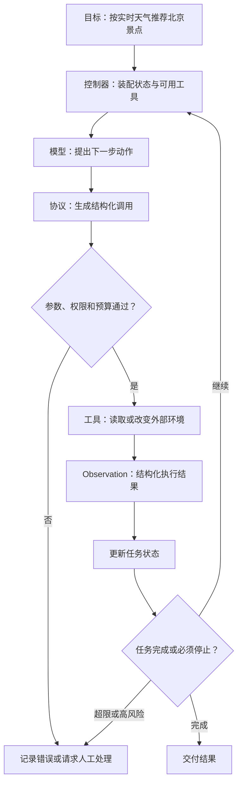
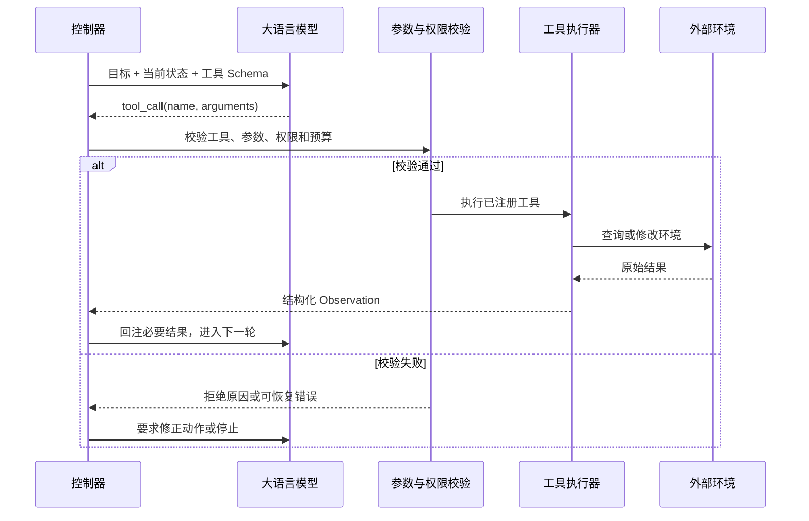
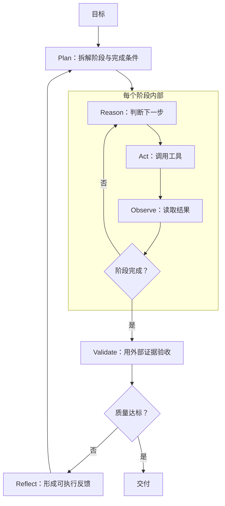

## 核心

**大语言模型负责提出动作，确定性程序负责约束和执行动作；两者通过“观察—行动—反馈”形成闭环，才构成能够完成任务的 Agent。** 因此，Agent 的可靠性不只取决于模型有多聪明，更取决于工具协议、状态管理、权限校验、结果验证和停止条件是否完整。

1. Table of Contents, ordered
{:toc}

## 从会回答问题到能完成任务

聊天模型与 Agent 的区别，不在于回答听起来有多聪明，而在于系统能否读取外部事实、执行动作，并根据动作结果继续推进任务。

假设用户提出一个看似简单的请求：“根据今天的北京天气，推荐三个适合游览的景点。”单次模型调用只能依据训练时学到的常识作答，既不知道此刻是否下雨，也无法核实景点是否开放。一个能够真正完成任务的系统至少要经历三个阶段：

1. 查询北京的实时天气；
2. 根据天气决定应该寻找室内还是室外景点；
3. 查询符合条件的景点，并核对开放信息后生成建议。

这三个阶段不能在调用模型之前全部写死。天气是执行时才获得的新事实，而新事实会改变下一步动作：晴天可以搜索公园和历史街区，暴雨则应转向博物馆并检查预约情况。**当后一步依赖前一步的真实结果时，任务就从一次文本生成变成了连续决策。** Agent 正是承载这种连续决策的系统。

## Agent 是一个受控的行动闭环

Agent 不是一种新的模型，而是一套围绕模型运行的控制结构：程序把目标和当前状态交给模型，模型提出下一步动作，程序校验并执行动作，再把结果带回下一轮。



闭环里的组件各有清晰边界：

| 组件 | 负责什么 | 不应该负责什么 |
|---|---|---|
| 模型 | 理解模糊目标，提出计划、工具和参数 | 直接获得系统权限 |
| 协议 | 把动作表达为程序可以解析的数据 | 判断业务上是否允许执行 |
| 工具 | 查询数据或产生真实副作用 | 自行决定整个任务如何推进 |
| 状态 | 保存目标、进度、观察和预算 | 把全部历史无差别塞给模型 |
| 控制器 | 装配上下文、校验动作、驱动循环 | 把模型输出当成可信命令 |
| 验证与退出机制 | 判断结果是否合格、何时停止 | 只依赖模型的一句“已完成” |

因此，“给聊天模型接上几个 API”只是提供了动作能力，还没有形成可靠的 Agent。缺少状态，系统会忘记已经查过什么；缺少验证，错误结果会进入下一轮；缺少停止条件，模型可能反复调用同一个工具。要理解这些边界为什么必要，首先要看清模型在闭环中到底做了什么。

## 大语言模型只负责提出下一步

大语言模型进入闭环后扮演的是概率决策器：它根据当前上下文（这一轮交给模型的全部信息）预测接下来的 token（模型处理文本时使用的基本片段），并让一串 token 表现为计划、工具名称、参数或最终答案。

对位置 $t$ 的 token，模型学习的仍是条件概率：

$$
P(x_t \mid x_1, x_2, \ldots, x_{t-1})
$$

当上下文同时包含用户目标、可用工具说明、当前状态和之前的执行结果时，“最合适的后续文本”就可能是“调用天气查询工具，并把城市设为北京”。模型不需要内置一个真正的天气模块，它只需要学会在合适的语境中生成符合工具约定的动作。

这种能力很适合处理难以提前写成规则的部分：理解自然语言中的隐含目标、在多个工具中选择一个、根据新证据调整计划。它的边界同样明确：**能够生成一个动作，不代表动作存在、参数正确、调用获准或结果可信。** 即使输出在语法上完全合法，也可能查错日期、选择越权工具，或者在没有充分证据时宣布任务已经完成。

现代 Agent 因而是概率模型与确定性程序的组合。模型处理开放式判断，程序负责类型、权限、预算、执行和验证。两者之间还缺少一个明确接口，Function Calling 就是为这个接口服务的。

## Function Calling 把动作建议变成程序调用

Function Calling（函数调用）是一种结构化协议：程序先用 JSON Schema（描述字段类型和约束的机器可读规则）声明可用工具及其参数格式，模型再返回工具名称和参数，由控制器决定是否执行。

在旅行助手中，模型可能先返回：

```json
{
  "name": "get_weather",
  "arguments": {
    "city": "北京",
    "date": "2026-08-04"
  }
}
```

这段 JSON 不是已经发生的动作，只是动作提议。控制器要确认 `get_weather` 已注册、城市和日期符合 Schema、调用没有超过预算，然后才执行工具。工具返回“中雨”后，控制器把必要结果作为 Observation（观察结果）写回状态，模型才有依据继续调用室内景点搜索工具。



一个可用的工具定义至少包含五部分：稳定名称、使用场景说明、JSON Schema、本地实现，以及超时、权限、幂等（重复请求不会重复产生副作用）和输出上限等运行约束。工具描述既要告诉模型“何时使用”，也要说明“何时不要使用”；否则多个语义相近的工具会让选择变得含糊。

在 Java 等静态语言中，可以用显式注册表把工具名映射到实现和参数类型，也可以在启动阶段通过注解生成注册信息。无论采用反射、函数接口还是框架注解，运行时都要经过“反序列化—校验—寻址—执行—序列化”。类型系统能减少格式错误，但不能替代业务权限和副作用控制。

Function Calling 解决了单个动作怎样安全落地，却没有决定多个动作如何组织。天气、景点和开放时间需要连续查询，控制器还要知道先做什么、何时改计划，以及结果不合格时是否重试。

## 多步任务需要不同的控制策略

当任务不能由一次工具调用完成时，Agent 需要控制策略来决定闭环怎样前进；ReAct（推理与行动交替）、Plan-and-Solve（先规划再执行）与 Reflection（反思改进）分别处理探索、规划和改进三个问题。

| 策略 | 怎样控制闭环 | 适合什么任务 | 主要风险 |
|---|---|---|---|
| ReAct | 推理、行动、观察交替进行 | 路径未知，需要根据新事实调整 | 串行调用多，可能重复或陷入局部循环 |
| Plan-and-Solve | 先拆解目标，再逐步执行 | 子任务和依赖关系相对清楚 | 初始计划可能被新证据推翻 |
| Reflection | 根据评测结果生成反馈并重做 | 有明确质量信号、允许增加延迟 | 自我评价可能重复原有盲点 |

[ReAct](https://arxiv.org/abs/2210.03629) 让 reasoning（判断下一步）与 acting（执行工具）交替发生。在旅行场景中，模型先查天气，看到中雨后再决定搜索博物馆，而不是提前猜测搜索方向。它适合路径未知的任务，但必须设置 `max_steps`、无进展检测和费用上限，防止模型不断更换关键词却无法结束。

[Plan-and-Solve](https://arxiv.org/abs/2305.04091) 先把任务拆成“查天气—选择景点类型—搜索候选项—核对开放时间—生成建议”。计划提供全局方向，但不应成为不可修改的剧本；如果天气工具返回极端天气预警，后续计划就应该改成安全提示，而不是继续机械推荐景点。

[Reflection](https://arxiv.org/abs/2303.11366) 在执行结果之后增加“评审—改进”循环。旅行助手可以检查候选景点是否确实适合雨天、是否有三个、开放时间是否覆盖计划时段。只有当评审来自规则、测试、外部数据或人工反馈时，反思才有可靠抓手；让同一个模型无证据地反复自评，可能只是更自信地重复错误。

三种策略可以按任务组合，而不是互相替代：



循环越长，新的问题就越明显：模型每轮需要知道哪些事实已经获得、计划执行到哪里、哪些失败不该重试。把完整执行历史不断追加到提示词，既昂贵又容易让关键信息淹没在噪声中，因此多步控制必须进一步引入状态与上下文管理。

## 状态保存事实，上下文提供当前视图

多轮 Agent 必须区分两个容易混淆的概念：**状态是系统持久保存的任务事实，上下文是某一轮从状态和外部资料中挑选出来、真正交给模型的信息。**

旅行助手的状态可以包含用户偏好、已查询的天气、候选景点、当前计划步骤、剩余预算和失败记录。下一轮模型未必需要看到所有字段：搜索室内景点时，当前天气和用户偏好很重要，早先失败调用的完整原始响应则可能只需保留错误类型。控制器应该根据当前步骤选择信息，而不是把“记得更多”等同于“提示词更长”。

一次稳定的上下文装配通常经过四步：

```text
Gather（收集候选信息）
→ Select（按相关性、时效和预算选择）
→ Structure（按固定语义分区组织）
→ Compress（压缩冗余，保留约束和证据）
```

装配后的内容可以分为 `[Policies]`、`[Task]`、`[State]`、`[Evidence]`、`[Tools]` 和 `[Output]`。固定分区并不是为了排版整齐，而是为了回答三个工程问题：某条信息为什么进入模型、它属于事实还是指令、出现错误时应该回溯哪一部分。

当任务跨越单个上下文窗口时，可以组合三种手段：

- **压缩整合**：把旧历史变成高保真摘要，保留目标、关键决策、未解决问题和验证证据；
- **结构化笔记**：把进度、阻塞项和下一步存到模型上下文之外，需要时再读取；
- **即时检索**：只在当前步骤需要时读取文件、代码、日志或知识库，而不是预先加载全部材料。

像 `ContextBuilder` 这样的组件负责装配当前视图，`NoteTool` 可以把阶段状态保存为 Markdown 或 YAML，`TerminalTool` 则提供即时读取能力。这些组件解决的是信息供给问题，不自动提供安全性：能读取终端或文件的工具仍然必须受到目录、命令、网络和输出大小限制。

## 框架把闭环沉淀为可维护的系统

当模型、工具、状态和控制策略逐渐增多，框架的价值就不再是少写几行 API 调用，而是把职责拆成可以替换、测试、恢复和观察的模块。

一个完整的 Agent 框架通常包含六层：

1. **模型适配层**：统一消息格式、流式输出、重试和不同模型接口；
2. **工具层**：管理 Schema、注册、校验、执行和错误封装；
3. **状态与上下文层**：保存任务事实，并为每一轮装配必要信息；
4. **控制层**：实现循环、规划、路由、重试和终止；
5. **安全层**：限制权限、目录、网络、费用和高风险动作；
6. **可观测性层**：记录模型请求、工具调用、状态变化和验证证据。

在 HelloAgents 这样的轻量实现中，`FunctionCallAgent` 展示了最小工具循环：根据工具描述构造 Schema，解析模型生成的参数，完成类型转换并调用已注册实现。它适合理解 Agent 的机械骨架，但如果要支撑跨轮次、可恢复的复杂任务，还需要持久化状态、并发控制、取消、重放、审批和评估。

另一类框架会把控制逻辑显式建模为“状态—节点—边”。例如 LangGraph 中，节点读取状态并返回更新，边决定下一个节点，条件边承载循环和分支。显式状态图更适合需要审计、恢复和人机协作的流程，代价是开发者必须提前定义更多结构；对于一次工具调用就能完成的任务，这种复杂度并不划算。

框架让组件可复用，也会把模型的动作能力连接到更多真实系统。系统一旦拥有文件写入、数据库更新、消息发送或命令执行能力，问题的重点就从“能否运行”转向“失败时是否可控”。

## 生产系统必须约束失败方式

最小 Demo 只需证明闭环能够跑通，生产系统则必须提前定义每一种失败怎样被发现、限制和恢复。

| 失败方式 | 必要约束 |
|---|---|
| 模型反复尝试，无法结束 | `max_steps`、时间与费用预算、无进展检测、人工升级 |
| 调错工具或参数 | Schema 校验、业务校验、工具白名单、清晰错误分类 |
| 重试导致重复写入 | 幂等键、事务、动作日志与可恢复状态 |
| 工具结果诱导模型越权 | 把工具输出视为不可信数据，隔离指令与证据，限制下一步能力 |
| 命令或文件访问逃逸 | 进程或容器沙箱、最小权限、参数化执行、网络与目录策略 |
| 模型误判任务成功 | 测试、规则、外部数据或人工验收等独立证据 |
| 长任务遗忘目标或重复工作 | 持久化状态、结构化笔记、压缩与按需检索 |
| 出错后无法复盘 | 记录请求、动作、观察、状态变化、费用和退出原因 |

高风险动作还需要显式审批。例如查询天气可以自动执行，购买门票、发送消息或修改数据库则应先展示动作对象、参数和潜在副作用，再由用户或策略引擎批准。权限应该授予工具执行器，而不是授予模型；模型输出即使满足 JSON Schema，也仍然是不可信输入。

命令执行尤其不能把“限制工作目录”等同于沙箱。若底层使用 `shell=True` 执行模型生成的字符串，命令替换、符号链接、管道和解释器都可能绕过简单的路径判断。更可靠的方式是使用隔离进程或容器、参数化命令、最小文件权限和明确网络策略。

可观测性则负责把这些约束串成证据链。`on_llm_start`、`on_tool_end` 和 `on_agent_finish` 一类回调不应只打印日志，而应记录每一轮看到了什么、为何允许某个动作、工具产生了什么副作用、验证依据是什么。只有运行轨迹能够被关联和重放，Agent 的故障才可能定位和修复。

## 根据任务的不确定性选择最小架构

Agent 架构不是越完整越好；应先判断任务的哪一部分无法提前确定，再只引入解决这种不确定性所需的能力。

| 任务特征 | 建议起点 |
|---|---|
| 一次生成即可完成，没有外部副作用 | 单次 LLM 调用，不建立 Agent 循环 |
| 步骤固定、分支确定 | 普通工作流，LLM 只处理非结构化节点 |
| 只需一次或少量工具调用 | Function Calling + 显式状态 |
| 路径未知，需要根据新证据调整 | 有步数上限的 ReAct 式循环 |
| 任务可拆解且依赖关系清楚 | Plan-and-Solve，并允许重新规划 |
| 结果质量重要且有明确评判信号 | 执行后增加 Reflection 或独立评估 |
| 跨小时、跨窗口或跨执行单元 | 外部状态、结构化笔记、压缩与即时检索 |

复杂度不是 Agent 能力的徽章，而是为了处理具体不确定性付出的成本。判断一个设计是否合理，可以看模型是否只承担无法预先写死的决策，而权限、执行、验证、预算和停止条件是否仍牢牢掌握在确定性程序中。

## 评价

### 写得好的地方

这套知识体系最有价值的地方，是没有把 Agent 简化成“更会思考的模型”，而是把它还原为模型、协议、工具、状态和控制器共同组成的行动闭环。这个视角能够自然解释 Function Calling 为什么只是一层协议、ReAct 为什么需要停止条件，以及上下文窗口为什么不能代替持久化状态。

从单次生成一路推进到生产约束，也让概念之间形成了明确的因果关系：模型只能提出动作，所以需要结构化调用；单个动作无法完成复杂任务，所以需要多步控制；循环增长会带来遗忘和噪声，所以需要状态与上下文；系统获得真实权限后，又必须增加审批、幂等、沙箱和可观测性。这条路径既适合建立整体认识，也能直接转化为架构检查清单。

### 可以改进的地方

这套体系更偏向机制解释，还不足以替代完整的实现教程。`FunctionCallAgent`、`ContextBuilder`、`NoteTool` 和 `TerminalTool` 展示了关键抽象，但从最小示例走向真实项目时，仍需要补充持久化数据结构、并发状态更新、取消与恢复、人工审批界面以及端到端测试等具体实现。

生产建议目前也以定性原则为主，缺少能够比较不同方案的量化评测。例如上下文压缩应该衡量关键信息保留率，工具循环应该统计成功率、平均步数、重复调用率和费用，Reflection 则需要比较增加的调用成本是否真正换来质量提升。没有这些任务级指标，就很难判断新增一层 Agent 机制是在解决问题，还是只是在增加系统复杂度。
