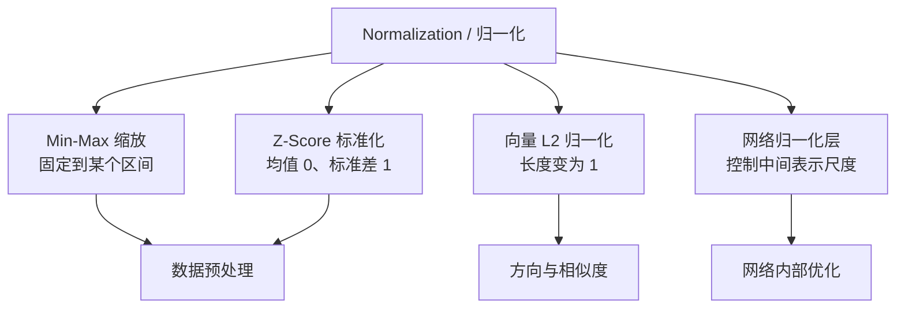

## 核心

矩阵乘法为神经网络提供了**重新组合信息**的方式，偏置决定转折发生的位置，激活函数让多层网络不再坍缩为一个仿射变换，而归一化负责控制数值尺度与几何度量。理解这四种操作各自改变了什么，比记住一串公式更重要。

一个向量进入神经网络后，会连续经历信息重组、阈值移动、非线性映射与尺度调整。只有把这些操作放回同一条数据流，才能看清它们为什么同时存在，又为什么不能互相替代。

1. Table of Contents, ordered
{:toc}

## 向量不只是数字列表

向量可以同时从三个角度理解：它是一组有顺序的数字，是空间中的方向与长度，也是一个对象在若干特征上的表示。三种解释并不冲突，只是观察目的不同。

例如向量

$$
x = \begin{bmatrix}1 \\ 1 \\ 0\end{bmatrix}
$$

在地理坐标里可以表示“向东 1、向北 1、高度不变”；在机器学习里，也可以表示一个样本在三个原始特征上的取值。矩阵要做的事情，是把这组旧坐标重新组合成一组新坐标。

设

$$
A \in \mathbb{R}^{m \times n}, \qquad x \in \mathbb{R}^{n}, \qquad y = Ax \in \mathbb{R}^{m}。
$$

矩阵乘向量至少有两种互补的读法：

- **看矩阵的列**：输入的每个坐标决定对应列向量取多少份，输出是这些列向量的线性组合。
- **看矩阵的行**：输出的每个坐标，都是一行权重与输入做点积后得到的一个新特征。

同一次计算，既可以理解为“把旧基向量搬到了哪里”，也可以理解为“用一组特征探测器重新测量输入”。

## 线性变换保留的是组合规则

线性变换（linear transformation）不是泛指“看起来平滑的变化”，而是严格保留向量加法与标量乘法的映射。若 $T:V\to W$ 满足

$$
T(au+bv)=aT(u)+bT(v)，
$$

其中 $u,v$ 是任意向量，$a,b$ 是任意标量，那么 $T$ 就是线性的。这个等式同时包含：

$$
T(u+v)=T(u)+T(v)，
$$

以及

$$
T(cu)=cT(u)。
$$

令 $c=0$ 还能得到 $T(0)=0$，所以线性变换一定保持原点不动。

在有限维空间中，选定一组基以后，每个线性变换都能写成矩阵乘法：

$$
T(x)=Ax。
$$

二维空间中的旋转、沿坐标轴缩放、错切和投影都是典型例子。它们会改变长度、角度甚至维度，但不会破坏线性组合关系。

这里有一个容易说过头的几何口诀：线性变换后，网格线仍保持平行且“均匀”。“均匀”指同一方向上的间隔会按同一比例变化，并不表示任意两点之间的距离都保持不变。一般线性变换也不保角；只有旋转、反射一类特殊变换才保持长度和角度。若矩阵不可逆，一整片空间还可能被压到一条线、一个平面甚至原点。

## 为什么矩阵的列能描述整个变换

在二维标准基下，任意向量都能写成

$$
x=x_1e_1+x_2e_2，
$$

其中

$$
e_1=\begin{bmatrix}1\\0\end{bmatrix}, \qquad
e_2=\begin{bmatrix}0\\1\end{bmatrix}。
$$

由于 $T$ 保持线性组合，

$$
T(x)=x_1T(e_1)+x_2T(e_2)。
$$

因此只要知道两个基向量分别被送到哪里，就知道所有向量会被送到哪里。把 $T(e_1)$ 和 $T(e_2)$ 依次写成矩阵的两列，便得到

$$
A=\begin{bmatrix}|&|\\T(e_1)&T(e_2)\\|&|\end{bmatrix},
\qquad
Ax=x_1T(e_1)+x_2T(e_2)。
$$

矩阵不是一张孤立的数字表，它的列记录了基向量经过变换后的落点。需要建立几何直觉时，可以配合[线性变换可视化](https://www.3blue1brown.com/lessons/linear-transformations/)观察网格和基向量如何移动。

换成“特征探测”的视角，同一个矩阵的每一行又定义了一个线性函数。若第 $i$ 行是 $r_i^T$，那么

$$
y_i=r_i^Tx。
$$

这个结果衡量了输入与权重方向 $r_i$ 的一致程度。不过，把点积直接称为“投影长度”需要一个前提：$r_i$ 必须是单位向量。如果它没有归一化，$r_i^Tx$ 是被 $\lVert r_i\rVert$ 额外缩放过的投影，也可以更稳妥地称为**线性响应**或**特征得分**。

## 左乘和右乘只是两套记账约定

数学教材通常把单个样本写成列向量，用

$$
y=Ax。
$$

机器学习工程则常把一个样本写成行向量，把 $B$ 个样本堆成矩阵

$$
X\in\mathbb{R}^{B\times n}，
$$

再一次计算整个批次：

$$
Y=XW, \qquad W\in\mathbb{R}^{n\times m}。
$$

这两种写法互为转置：

$$
(x^TA^T)^T=Ax。
$$

所以，“矩阵左乘表示移动空间，矩阵右乘表示提取特征”可以用来辅助联想，却不是由左右位置决定的数学定律。真正决定语义的是：向量按行还是按列存放、矩阵各轴如何定义，以及我们把这次计算解释成主动变换还是坐标表示。

[PyTorch 的 `Linear` 层](https://docs.pytorch.org/docs/stable/generated/torch.nn.Linear.html)接收最后一维为特征的批量数据，并计算

$$
Y=XA^T+b。
$$

其权重张量存成 $A\in\mathbb{R}^{m\times n}$，因此实现里出现了转置。只要维度和权重含义保持一致，这与列向量约定下的 $Ax+b$ 是同一件事。

### “移动向量”和“更换坐标系”也不是一回事

还有一组经常混用的概念：

- **主动变换（active transformation）**：坐标系不变，几何向量真的从 $x$ 移到 $Ax$。
- **被动变换（passive transformation）**：几何向量不动，只改用另一组基描述它。

若新基向量按列组成矩阵

$$
B=\begin{bmatrix}|&&|\\b_1&\cdots&b_n\\|&&|\end{bmatrix}，
$$

一个向量在新基下的坐标 $c$ 满足

$$
x=Bc。
$$

因此从旧坐标求新坐标要算的是

$$
c=B^{-1}x，
$$

而不是直接把 $B$ 乘到 $x$ 上。$Bx$ 表示按 $B$ 定义的线性变换移动向量；$B^{-1}x$ 才是在这组新基下重新描述同一个向量。把这两件事分开，许多“矩阵到底是在推空间还是换视角”的困惑就消失了。

## 偏置把线性变换变成仿射变换

神经网络通常计算的不是 $Wx$，而是

$$
z=Wx+b。
$$

只要 $b\neq 0$，它就不再是严格的线性变换，因为

$$
z(0)=b\neq 0。
$$

这类“线性变换加平移”称为**仿射变换（affine transformation）**。它仍会把直线映成直线并保持平行关系，却允许原点移动。

在一个神经元里，$w^Tx+b=0$ 定义了一条直线或一个高维超平面。权重 $w$ 决定边界的朝向，偏置 $b$ 决定边界离原点多远。换句话说，偏置的价值不是让空间弯曲，而是让网络能够把转折点放到合适的位置。

## 非线性为什么让深度有意义

多个线性变换的复合仍然是线性变换，多个仿射变换的复合也仍然只是一个仿射变换。以两层为例：

$$
z=A_2(A_1x+b_1)+b_2
  =(A_2A_1)x+(A_2b_1+b_2)。
$$

无论中间维度和参数有多少，只要层与层之间没有非线性操作，整个网络最终都能折叠成一次 $Ax+b$。深度只增加了一种冗长的参数化方式，没有增加函数类型。

激活函数 $\sigma$ 插入层间后，网络变成

$$
h=\sigma(Wx+b)。
$$

以 ReLU 为例：

$$
\operatorname{ReLU}(t)=\max(0,t)。
$$

它在 $t<0$ 时输出 0，在 $t>0$ 时保持原值，并在 0 处产生转折。单个 ReLU 不是一条平滑曲线，而是分段线性的；许多 ReLU 与仿射变换交替叠加后，整个输入空间会被划成大量区域，每个区域内部是仿射的，区域之间的规则不同。网络的复杂表达能力正来自这些可学习的分区与转折。

这也解释了一个细微但重要的结论：**“不是线性的”不等于“足以表达复杂边界”。** 平移不满足线性变换的严格定义，但它属于仿射变换；反复旋转、缩放和平移，决策边界依然是平的。真正改变函数类型的是 ReLU、Sigmoid、Tanh 等激活函数，以及其他依赖输入本身的非线性运算。

可以把四种角色压缩成下面这张表：

| 操作 | 典型公式 | 主要改变 | 单独叠加后的能力 |
|---|---|---|---|
| 线性变换 | $Wx$ | 方向、尺度、维度与特征组合 | 仍是一个线性变换 |
| 平移 | $x+b$ | 原点或阈值位置 | 与线性变换合成后仍是仿射变换 |
| 仿射变换 | $Wx+b$ | 同时组合特征并移动边界 | 多层仍可折叠成一个仿射变换 |
| 激活函数 | $\sigma(x)$ | 引入转折、饱和或曲率 | 与仿射层交替后可形成复杂分区 |

## Normalization 不是一种固定操作

Normalization 常被统一翻译为“归一化”，但在数学、数据预处理和深度学习框架里，它可能指完全不同的操作。至少要区分特征缩放、标准化、向量归一化和网络归一化层。

### Min-Max 缩放：把取值搬到固定区间

对一个特征使用

$$
x'=\frac{x-x_{\min}}{x_{\max}-x_{\min}}
$$

可以把训练数据的最小值和最大值映射到 $[0,1]$。当 $x_{\min}$ 与 $x_{\max}$ 固定后，这个公式是关于 $x$ 的仿射变换：它保留顺序与相对比例，但会受极端值影响。

### Z-Score 标准化：让尺度可比较

Z-Score 的公式是

$$
z=\frac{x-\mu}{\sigma}，
$$

其中 $\mu$ 是均值，$\sigma$ 是**标准差**，不是方差。对用于计算 $\mu$ 和 $\sigma$ 的那批数据，变换后均值为 0、标准差为 1。

标准化并不会把任意形状的分布自动变成正态分布。它只改变中心和尺度，偏斜、多峰和离群点仍然存在。[scikit-learn 的 `StandardScaler` 文档](https://scikit-learn.org/stable/modules/generated/sklearn.preprocessing.StandardScaler.html)也特别说明了它对离群点敏感。

训练模型时，$\mu$ 和 $\sigma$ 只能从训练集估计，再原样用于验证集、测试集和线上样本。若先用全部数据计算统计量，测试集的信息就提前进入了训练流程，造成数据泄漏。

### 向量归一化：保留方向，丢掉长度

L2 归一化计算

$$
\hat{x}=\frac{x}{\lVert x\rVert_2}。
$$

它把所有非零向量投到单位球面上。例如

$$
x=\begin{bmatrix}3\\4\end{bmatrix}
\quad\Longrightarrow\quad
\hat{x}=\begin{bmatrix}0.6\\0.8\end{bmatrix}。
$$

这个操作保留方向，却丢掉绝对长度，因此常用于余弦相似度、文本向量和检索系统。它不是固定的线性或仿射变换，因为除数 $\lVert x\rVert_2$ 随输入变化；零向量还需要单独处理。

### LayerNorm：在网络内部稳定每个样本的尺度

深度网络中的 Layer Normalization 又是另一件事。简化写法为

$$
\operatorname{LN}(x)
=\gamma\odot\frac{x-\mu(x)}{\sqrt{\operatorname{Var}(x)+\epsilon}}+\beta。
$$

这里的均值和方差通常沿当前样本的指定特征维计算，$\epsilon$ 防止分母过小，$\gamma$ 与 $\beta$ 是可学习参数。具体计算轴可参考 [PyTorch `LayerNorm` 文档](https://docs.pytorch.org/docs/stable/generated/torch.nn.LayerNorm.html)。

因为统计量依赖当前输入，LayerNorm 不是一个固定仿射变换。它的主要目的也不是像激活函数那样制造决策边界，而是控制中间表示的尺度、改善数值条件，并让优化过程更稳定。

## 把这些操作放回神经网络

线性变换、偏置、激活函数和归一化并不是同一层级上的同义词。它们分别解决表示、位置、表达能力与数值尺度问题。

| 问题 | 对应操作 | 直觉 |
|---|---|---|
| 旧特征怎样组合成新特征 | 矩阵乘法 $Wx$ | 旋转、缩放、投影或加权测量 |
| 决策阈值应该放在哪里 | 偏置 $b$ | 移动超平面或激活转折点 |
| 多层为何不会折叠成一层 | 激活函数 $\sigma$ | 在空间中引入可组合的转折 |
| 不同特征或中间表示怎样保持合适尺度 | scaling / standardization / normalization layer | 调整量纲、长度或统计分布 |

它们也没有一套适用于所有架构的固定顺序。经典多层感知机常见“仿射层 → 激活函数”，可以按需要加入归一化；Transformer 则会把 LayerNorm 放在注意力或前馈子层之前或之后，并配合残差连接。判断一个操作时，应先问它沿哪些轴计算、统计量来自哪里、参数是否依赖输入，以及它究竟想改善表达能力还是优化条件。

用这套框架再看矩阵乘法，几何与机器学习的两种直觉就能统一起来：**矩阵既规定基向量如何移动，也规定输入要接受哪些线性测量；神经网络学习的权重，就是在学习一组对任务有用的新方向与新坐标。** 激活函数让这些方向可以在不同输入区域产生不同组合，归一化则让整个学习过程不至于被不合适的尺度拖垮。
