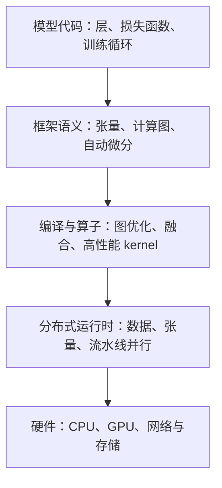
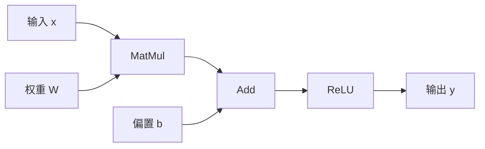
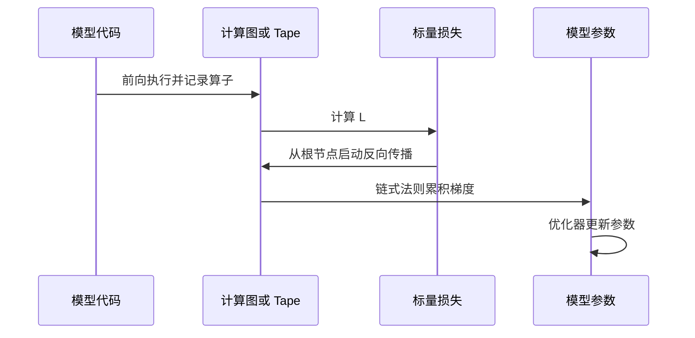

## 核心

**机器学习框架的核心作用，是把模型代码变成一张可执行、可求导、可优化的计算图。** 张量 API 解决“怎样表达计算”，自动微分解决“怎样得到梯度”，编译器与分布式运行时则解决“怎样在真实硬件上高效执行”。

1. Table of Contents, ordered
{:toc}

## 框架填补了数学公式与硬件之间的距离

一个神经网络在纸面上可能只有几行公式，但把它训练和部署起来，还要解决大量工程问题：张量放在哪个设备、算子调用哪个 kernel、反向传播需要保存哪些中间值、多个 GPU 怎样同步，以及模型如何序列化后离开 Python 环境运行。

机器学习框架至少承担四类职责：

1. 把 Python 中的模型表达转换为张量算子及其依赖关系；
2. 为算子选择 CPU、GPU 或其他加速器上的实现；
3. 根据前向计算自动构造反向传播；
4. 管理编译、内存、并行、通信、检查点与部署格式。

这些职责并不是从一开始就同时出现的。早期工具更关注矩阵运算和 CPU 计算；随后出现的通用深度学习框架，把 GPU、计算图和自动微分组合起来；模型继续扩大后，编译优化和分布式运行时又成为新的关键层。

框架提供的不是单一功能，而是一份跨层契约：上层代码描述想算什么，下层系统决定怎样算得正确、快速并且能够扩展。

## 计算图是框架内部的共同语言

计算图（把一次计算表示成“算子节点 + 张量依赖边”的结构）是连接模型代码、自动微分和编译器的核心数据结构。例如：

$$
y=\operatorname{ReLU}(Wx+b)
$$

可以拆成矩阵乘法、加法和 ReLU 三个节点。边记录 $x$、$W$、$b$ 和中间张量怎样流动。

拿到这张图后，框架可以回答多类问题：

- 哪些算子存在数据依赖，必须顺序执行；
- 哪些算子可以融合，减少 kernel 启动与显存读写；
- 哪些中间值必须保留，哪些可以在反向传播时重算；
- 梯度应按什么顺序从输出传回参数；
- 图的不同部分怎样切到多个设备执行。

没有计算图，框架只能逐条执行命令；拥有计算图后，计算本身就变成了可以分析和改写的数据。

## 静态图与动态图代表两种取舍

框架需要决定计算图在什么时候形成。经典设计可以分成两类：

| 执行方式 | 图在何时形成 | 优点 | 代价 |
|---|---|---|---|
| 先构图后执行 | 执行前定义或 trace | 易做全局优化、序列化和跨环境部署 | Python 控制流与调试体验受约束 |
| eager / 动态执行 | 算子运行时记录 | 行为接近普通 Python，开发调试自然 | 难以提前获得完整图，Python 调度可能产生开销 |

静态图把“定义”和“执行”分开。框架先拿到完整结构，优化后再交给后端运行，因此容易部署和做全局优化；代价是代码执行过程不一定与 Python 源码逐行对应，调试和动态控制流更复杂。

动态图在 Python 代码运行时立即执行算子，同时记录实际发生的依赖。分支走哪一边，图就记录哪一边；循环执行几次，图中就出现几次对应计算。它更符合命令式编程直觉，但完整图只有运行后才知道。

## 现代框架正在采用混合模式

“TensorFlow 是静态图，PyTorch 是动态图”可以概括二者早期的经典差异，却不再是现代版本的完整边界。

TensorFlow 2 默认 eager，需要性能或可移植图时，可以用 [`tf.function`](https://www.tensorflow.org/guide/function)把 Python 计算 trace 为 `tf.Graph`。官方建议通常也是先在 eager 模式调试，再把稳定的热点区域转换为图。

PyTorch 保留 eager 编程体验，同时用 [`torch.compile`](https://docs.pytorch.org/docs/stable/generated/torch.compile.html)寻找可编译区域并缓存生成结果。编译器遇到无法可靠捕获的 Python 行为时，可能发生 graph break（图中断）：先编译已经捕获的部分，回到 Python 执行不支持的代码，再尝试继续捕获。

因此，更准确的问题不是“一个框架到底属于静态还是动态”，而是：

- 哪些语义在运行前可见；
- 哪些 Python 行为可以被稳定捕获；
- 输入形状变化是否触发重编译；
- 图中断会损失多少优化机会；
- 生成的图能否脱离原始 Python 环境部署。

混合模式试图同时获得 eager 的开发体验和图编译的运行性能，但它也把复杂性转移到了 tracing、动态形状、guard 和重编译规则上。

## 自动微分让训练不必手写导数链

训练要寻找让损失函数 $L(\theta)$ 尽量小的参数 $\theta$。最基本的梯度下降更新是：

$$
\theta_{t+1}=\theta_t-\eta\nabla_{\theta}L(\theta_t)
$$

$\eta$ 是学习率，负号表示沿损失下降方向移动。如果目标是最大化奖励或似然，才改用加号做梯度上升。优化目标与更新方向必须保持一致。

复杂神经网络的求导大致有三条路线：

| 方法 | 做法 | 主要问题 |
|---|---|---|
| 符号微分 | 像代数系统一样展开完整导数公式 | 表达式可能急剧膨胀，难复用前向计算的中间值 |
| 数值微分 | 用 $[f(x+\epsilon)-f(x)]/\epsilon$ 近似斜率 | 存在截断与舍入误差；每个参数都要扰动一次 |
| 自动微分 | 把程序拆成基本算子，用链式法则组合局部导数 | 需要记录图和必要中间值，占用额外内存 |

数值微分更准确的工程名称是**有限差分**；中值定理可以用于分析误差，却不是这种求导方法的名称。

自动微分既不是把公式完全展开，也不是用有限差分近似。框架为每个基础算子准备局部导数规则，再利用计算图上的链式法则组合出整个程序的精确梯度。

## 反向模式适合拥有大量参数的网络

深度学习训练通常使用反向模式自动微分（从一个标量损失出发，反向计算它对许多参数的梯度）。前向执行时，框架记录实际发生的算子及必要中间值；得到损失后，再从输出向输入反向遍历图，把局部梯度相乘并累加。

对“许多参数映射到一个损失”的模型，反向模式只需一次反向遍历，就能同时得到所有参数的梯度。这比为每个参数分别做一次前向微分或有限差分高效得多。

[PyTorch 的 Autograd 机制说明](https://docs.pytorch.org/docs/main/notes/autograd.html)将其定义为反向自动微分系统：前向运行的同时形成有向无环图，反向时从根节点追溯到叶子节点。[TensorFlow 的自动微分指南](https://www.tensorflow.org/guide/autodiff)也展示了 `GradientTape` 如何记录运算，并指出反向传播所需中间结果会占用内存。

这解释了计算图为什么位于框架中心：同一份结构既表示“结果怎么算出来”，也决定“梯度怎样传回去”。

## 大模型让框架继续向系统层扩展

模型变大后，瓶颈从单机 API 调度逐渐扩展到显存容量、内存带宽、算子利用率、设备间通信和故障恢复。框架需要在自动微分之外继续提供三类能力：

- **编译与 kernel 优化：** 捕获热点图、融合算子、生成适合具体硬件的实现；
- **内存优化：** 混合精度、激活重计算、状态切分和 CPU/NVMe offload；
- **分布式执行：** 数据并行、张量并行、流水线并行，以及计算与通信重叠。

DeepSpeed 更适合被理解为 PyTorch 之上的大规模训练与推理系统层，而不是替代通用框架的另一套模型语言。模型仍使用 PyTorch 表达，DeepSpeed 再负责分布式执行、内存优化和高性能 kernel。

[DeepSpeed 的 ZeRO 文档](https://www.deepspeed.ai/tutorials/zero/)说明，ZeRO 会分阶段切分优化器状态、梯度和模型参数，避免每个数据并行进程保存完整副本。[DeepSpeed 的训练说明](https://www.deepspeed.ai/training/)还把混合精度、流水线并行和模型并行组合进同一运行时。

大模型运行时没有取代计算图和自动微分。相反，它利用图中已经暴露的参数、算子和依赖关系，把同一个前向与反向闭环拆到更多设备上执行。

## 评价

### 写得好的地方

从计算图进入机器学习框架，是一条清晰而稳定的理解路径。计算图同时解释了自动微分、编译优化和跨设备切分为何可能，避免把框架误解为一组零散的张量 API。

把静态图与动态图放回历史背景，再讨论 TensorFlow 和 PyTorch 的现代混合模式，也比给框架贴固定标签更准确。它保留了两种设计的核心取舍，又能解释 `tf.function`、`torch.compile` 和 graph break 为什么出现。

### 可以改进的地方

这套框架仍然偏概念化，没有展示一段代码怎样从 eager 执行被捕获为图，也没有用 profiler 对比图编译前后的 kernel 数量、显存访问和执行时间。加入一个可运行的小模型案例，会让“图是可优化的数据结构”从概念变成可观察事实。

自动微分部分还可以继续展开保存中间值与激活重计算之间的取舍，以及 forward mode、reverse mode 和高阶导数分别适合什么输入输出维度。分布式部分也只建立了层次关系，没有深入讨论不同并行策略的通信量与扩展效率。
