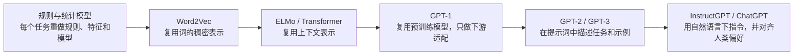

## 核心

**现代 NLP 的演进主线，不只是模型越来越大，而是把原本散落在每个下游任务里的特征工程、标注、训练和交互设计，逐步搬进可复用的词向量、预训练模型、上下文示例与人类偏好。** 从 Word2Vec 到 ChatGPT，每一步都在扩大“可以共享的能力”，并降低解决一个新任务时必须重新训练的部分。

1. Table of Contents, ordered
{:toc}

## NLP：新任务还要重做多少工作

自然语言既有规则，又充满歧义、上下文依赖和例外。早期的符号主义方法试图显式写出语法与逻辑规则，规则一多就会遇到越来越复杂的例外；统计学习转而从语料中估计模式，却仍要为每个任务准备标注数据、设计特征并训练专用模型。

判断后续技术为什么重要，可以始终追问同一个问题：**面对一个新任务，哪些能力能够复用，哪些工作必须重做？**

这条路线不是简单地让后一种技术淘汰前一种技术。专用模型、微调、检索和工具调用今天仍然有价值；变化在于它们从“所有任务的默认前提”变成了按效果、成本和可靠性选择的手段。

## Word2Vec：观其伴，知其意

传统 one-hot 表示会给词表中的每个词分配一个独立维度。假设词表有四万个词，每个词就是四万维向量中某一位为 1、其余为 0。它能够区分词，却没有直接表达“猫”和“狗”比“猫”和“火车”更接近；向量还非常稀疏，维度随词表扩大。

[Word2Vec](https://arxiv.org/abs/1301.3781) 的关键进步，是从大规模语料中的局部共现关系学习低维稠密向量。直觉可以概括为“观其伴，知其意”：经常出现在相似上下文中的词，会在向量空间里靠得更近。这样一来，词的语义相似性不再完全依赖人工挑选特征，下游任务也能共享同一套输入表示。

不过，Word2Vec 学到的是**静态词向量（每个词表项只有一个固定向量）**。“苹果发布手机”和“吃一个苹果”中的“苹果”会先得到相同表示，多义性被混合在一个坐标中。它降低了特征工程成本，却还不能根据当前句子改变词义。

## ELMo：从一词一义到因境生义

[ELMo](https://arxiv.org/abs/1802.05365) 把词向量改成上下文的函数：同一个词进入双向语言模型后，会因为前后文不同而产生不同表示。“吃一个苹果”中的“苹果”更靠近水果语义，“苹果发布手机”中的“苹果”则更靠近公司语义。

ELMo 的底座是双向 LSTM。循环网络把序列状态一步步向后传递，适合描述顺序，却难以像矩阵运算那样同时处理一个序列中的所有位置。长距离信息还要跨越许多时间步。LSTM 的门控机制能缓解遗忘和梯度问题，但没有消除这种串行依赖。

## Transformer：用并行换规模

[Transformer](https://arxiv.org/abs/1706.03762) 用自注意力替代循环：每个位置直接计算自己应该关注其他位置的程度，再按权重汇总信息。训练时，同一层内的多个位置可以并行计算，因此更适合扩大数据、参数和计算规模。

自注意力会把每个位置变换成 Query、Key 和 Value。Query 表示当前位置要寻找什么，Key 表示其他位置提供什么匹配线索，Value 则是匹配后真正汇总的内容。对长度为 $n$ 的序列，$Q$、$K$ 和 $V$ 都包含 $n$ 行；若 Key 的维度为 $d_k$，缩放点积注意力可以写成：

$$
\operatorname{Attention}(Q,K,V)=\operatorname{softmax}\left(\frac{QK^\top}{\sqrt{d_k}}\right)V
$$

$QK^\top$ 得到位置两两之间的相关分数，`softmax` 把每一行变成权重，再对 $V$ 做加权求和。注意力的作用不是给每个词永久分配一个“重要程度”，而是让它相对于当前查询动态选择信息。

这里有一个常见但重要的边界：**Transformer 的训练可以并行，不代表自回归生成可以一次吐出整段文字。** GPT 训练时已经知道完整目标序列，可以同时计算各位置的预测损失；推理时，第 $t+1$ 个 token 依赖前 $t$ 个 token，仍要逐 token 生成。KV Cache 能减少重复计算，却没有改变这个因果顺序。

原始 Transformer 同时包含 encoder 和 decoder。把两者简单称为“理解”和“生成”便于入门，但并不是能力边界：encoder 擅长构造双向上下文表示，[BERT](https://arxiv.org/abs/1810.04805) 沿此方向发展；decoder 用因果掩码预测后续 token，GPT 沿此方向发展。Decoder-only 模型同样能完成分类、抽取和问答，只是把任务及答案统一编码为文本序列。

## GPT-1：厚底座 + 薄微调

Word2Vec 和 ELMo 主要复用表示，具体任务仍需要专门的网络或输出层。[GPT-1](https://openai.com/index/language-unsupervised/) 将复用范围扩大到一个完整的 decoder-only Transformer：先在无标注文本上进行生成式预训练，再用较小的有标注数据对同一模型做任务微调。

这就是“厚底座、薄适配”的真正含义：昂贵的语言建模能力沉淀在共享参数中，下游只需较少数据和较小改动。GPT-1 论文还用统一的文本输入变换处理文本蕴含、相似度、问答和分类等不同任务，证明一套预训练参数能够跨任务迁移。

但 GPT-1 并没有消灭任务专用训练。它的标准流程仍包含监督微调和任务输出层；“所有任务都只靠生成完成”更适合描述后来逐渐成熟的提示学习范式，不能直接当作 GPT-1 的完整训练方法。

## GPT-2：把微调变成可选项

[GPT-2](https://openai.com/index/better-language-models/) 继续使用预测下一个 token 的目标，却换用规模更大、任务类型更丰富的互联网文本。自然语言文本中本来就混有翻译、问答、摘要和解释等模式，模型因此能够把提示词当作任务描述，在不更新参数的情况下尝试新任务。

这一步展示了 **zero-shot（不给任务示例，只给任务描述）** 的可能性，但没有证明微调从此无用。GPT-2 在不少任务上仍弱于专用系统；它真正改变的是接口：任务可以先用文本表达，而不必立刻改模型结构或训练权重。

## Scaling Laws：把“大力出奇迹”变成工程路线

2020 年的 [Scaling Laws](https://openai.com/index/scaling-laws-for-neural-language-models/) 给这条路线提供了经验依据：在研究覆盖的范围内，语言模型损失会随**模型规模、数据规模和训练计算量**呈近似幂律下降。它不是“参数是唯一重要因素”，也不是无限扩大模型必然通向通用智能的定律；它说明的是，在给定实验范围与训练配方下，扩大多个关键资源能够产生相对可预测的收益。

## GPT-3：把任务适配搬进上下文

[GPT-3](https://openai.com/index/language-models-are-few-shot-learners/) 将参数量从 GPT-2 的 15 亿扩大到 1750 亿，并系统展示了 in-context learning（上下文学习，即只在输入文本中给出任务描述或示例，不更新模型权重）：

- **Zero-shot：** 只给指令和待处理输入；
- **One-shot：** 额外给一个输入—输出示例；
- **Few-shot：** 在上下文中给少量示例，再让模型续写新答案。

模型在许多任务上明显进步，有些结果接近或超过当时的微调方法，但并非全面胜过专用模型。更重要的是，这个过程没有梯度更新：示例临时改变了本次推理所处的上下文，没有把新知识永久写回参数。

一种常见解释把上下文学习归因于“训练 batch 内样本相似、batch 之间不同”，但这个说法没有得到 GPT-3 论文支持。预训练为何会涌现上下文学习能力，至今仍是研究问题；把它理解为模型从大量序列中学会了识别并延续输入中的任务模式，比归结为某一种 batch 组织方式更稳妥。

## ChatGPT：从续写文本到响应人

基础语言模型优化的是“接下来最可能出现什么”，而用户期待的是“按照我的意图，给出有帮助、真实且安全的回答”。两者之间存在目标差距：一个很会续写网页的模型，不会天然知道何时应该简洁作答、承认不知道或拒绝危险请求。

[InstructGPT](https://openai.com/index/instruction-following/) 展示了经典的人类反馈强化学习（Reinforcement Learning from Human Feedback，RLHF）流程：

1. **监督微调（SFT）：** 人类示范理想回答，让模型先学会基本的指令—回答格式；
2. **奖励模型（RM）：** 标注者比较多个候选答案，奖励模型学习预测人类更偏好哪一个；
3. **强化学习：** 把奖励模型当作反馈信号，继续优化语言模型，使其更常生成高奖励回答。

ChatGPT 把这条技术路线做成了低门槛对话产品。准确地说，GPT 是提供语言建模能力的模型家族，ChatGPT 是围绕模型构建的交互产品；“语言大脑”和“对话外壳”是有用类比，但真实产品还包含系统指令、安全策略、上下文管理、工具和服务基础设施。

同一时期，[Chain-of-Thought Prompting](https://arxiv.org/abs/2201.11903) 展示了另一种上下文控制方式：让模型生成中间推理步骤，能够改善部分算术、常识和符号推理任务。但“写出过程”不等于过程必然正确，效果来自代码语料也只是可能解释之一，没有被这些结果单独证明。精确计算仍应交给代码或工具，并对最终结果做验证。

RLHF 也不是把“人的价值”完整装进一个模型。奖励模型只近似特定标注者在特定指南和样本上的偏好，可能存在偏差、遗漏和可被利用的漏洞。它改善的是行为与目标的匹配程度，而不是保证事实正确或完成了普遍意义上的价值对齐。

## GPT-4：从语言走向多模态

[GPT-4 技术报告](https://cdn.openai.com/papers/gpt-4.pdf) 将文本模型扩展为可接收图像和文本输入、生成文本输出的多模态模型，并在许多专业与学术基准上达到很强表现。这里应把“达到人类水平”限定为**某些考试或基准上的可比成绩**，不能推导为已经具备完整的人类认知能力。

GPT-4 沿用了“更多预训练能力 + 后训练对齐”的总体路线，但官方没有公开模型规模、硬件、训练计算量、数据组成和完整架构。因而，用确定的层数、参数量或训练细节解释 GPT-4，通常超出了公开证据。

从 Word2Vec 到 GPT-4，真正连续的不是某一种网络结构，而是共享范围不断扩大：

| 阶段 | 主要复用对象 | 新任务的主要接口 | 仍然存在的成本 |
|---|---|---|---|
| 规则 / 统计学习 | 少量规则或特征模板 | 重写规则、标注并训练 | 人工规则、特征工程、大量标注 |
| Word2Vec | 静态词向量 | 把共享向量送入专用模型 | 多义词、任务模型与标注 |
| ELMo / Transformer 表示 | 上下文表示 | 增加任务层或微调 | 任务适配与推理成本 |
| GPT-1 | 完整预训练模型 | 少量监督微调 | 每个任务仍要更新权重 |
| GPT-2 / GPT-3 | 预训练参数与上下文学习能力 | Prompt 与少量示例 | 提示敏感、上下文成本、可靠性 |
| InstructGPT / ChatGPT | 指令遵循与偏好对齐 | 自然语言对话 | 幻觉、偏差、安全与系统工程 |
| GPT-4 | 多模态通用能力 | 文本与图像输入 | 能力边界、成本与不可解释性 |

## 通用模型：控制点上移，工程不会消失

“一个模型解决所有问题”描述的是通用接口和迁移方向，不意味着任何场景都只需写一句 Prompt。实践中仍要根据任务选择不同适配方式：

- **知识需要及时更新或可追溯时，** 使用检索增强生成，把答案绑定到外部资料；
- **行为需要长期稳定且调用量大时，** 使用微调或蒸馏，减少提示长度并固定输出模式；
- **结果必须精确执行时，** 使用工具、代码和结构化约束，不让模型靠文字猜计算结果；
- **错误代价很高时，** 增加验证、权限隔离与人工复核，而不是把基准高分等同于可靠交付；
- **任务超出单次上下文时，** 使用外部状态和工作流保存进度，因为上下文学习不会永久修改权重。

因此，这段历史更适合总结为**控制点上移（人不再为每个任务从头设计模型，而是转去设计数据、目标、上下文、反馈和外部系统）**。模型越通用，工程并没有消失，只是从“怎样为一个任务造模型”迁移到“怎样约束一个通用模型稳定完成任务”。

## 评价

### 写得好的地方

用两条主线观察 NLP 的发展很适合教学。第一条是“从静态向量到动态上下文，再到 Transformer 基座”，它把抽象的模型史还原成多义词表示与并行训练两个具体问题；第二条是“厚底座、薄适配 → 去微调 → 少样本 → 自然语言指令”，它用下游成本的变化串起了 GPT-1、GPT-2、GPT-3 和 ChatGPT。

直觉类比也能降低理解门槛，例如用“观其伴，知其意”解释分布式表示，用“全局变量”帮助程序员理解 RNN 状态，用搜索中的 Query、Key、Value 帮助理解注意力。这些类比不能替代严格定义，却能让读者先建立可操作的心智图景。

### 可以改进的地方

把漫长的技术史压缩成几代模型时，最容易为了形成记忆点而过度简化。“GPT-1 把所有任务都变成生成”“GPT-3 已经超过微调模型”“Scaling Laws 最重要的因素只有参数”“GPT-3 的上下文学习来自 batch 组织”等说法，会把局部实验结果误写成普遍机制。更稳妥的理解需要同时考察论文实际做法、比较范围与尚未确定的原因。

部分历史评价也带有事后视角。ELMo 使用 LSTM 不能简单归结为“选错路线”，它的重要贡献正是证明深层上下文化表示能够显著改善多种任务；GPT-1 也不是因为“和 BERT 撞车”才没有流行，前者发布早于 BERT，二者分别推动了 decoder-only 与 encoder-only 预训练路线。ChatGPT 的突破同样不能只归因于模型或 RLHF，产品交互、部署规模和反馈闭环共同降低了普通用户使用通用模型的门槛。

最后，从多模态直接推演到具身智能和“自主意识”需要保持克制。模型接上传感器、工具和行动回路，可以获得更强的环境交互能力，但自主运行不等于拥有主观意识；如果不把工程能力、行为自主性和意识命题分开，技术路线图很容易变成哲学结论。
