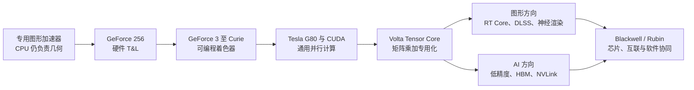

## 核心

**NVIDIA GPU 的历史可以浓缩为四次计算职责迁移：图形几何从 CPU 移入 GPU，固定图形管线变成可编程并行处理器，通用核心旁增加矩阵与光追专用单元，最后再把多颗 GPU、内存、互联和软件组织成一台机架级计算机。** 架构代号只是路标，真正推动每次换代的是系统瓶颈换了位置。

本文以用户提供的《NVIDIA GPU 架构历代代号与特点全览》为素材重写，并用 [NVIDIA 官方架构时间线](https://www.nvidia.com/en-us/technologies/)、架构白皮书和产品资料核对关键事实。原材料覆盖面很广，但混用了架构、芯片代号、产品名与平台名；本文先拆开这些层级，再沿着“谁承担计算、哪一种计算成为瓶颈”这条主线重组。

1. Table of Contents, ordered
{:toc}

## 一张显卡同时存在四套名字

理解 NVIDIA 历史前，需要先区分四个经常被放进同一张表的对象。它们有关联，却不是同一个层级。

| 层级 | 回答的问题 | 例子 |
|---|---|---|
| 架构 | 这一代采用什么计算组织方式 | Ampere、Hopper、Blackwell |
| GPU 芯片 | 实际流片的是哪一颗硅片 | GA100、GA102、GH100、GB202 |
| 产品 | 用户买到的卡或加速器是什么 | A100、H100、RTX 3090、RTX 5090 |
| 系统平台 | 多颗芯片怎样与 CPU、网络和散热组成系统 | HGX、DGX、GB200 NVL72、Vera Rubin NVL72 |

例如 **Ampere 是架构，GA100 是面向数据中心的芯片，A100 是使用 GA100 的产品**；同属 Ampere 的 RTX 3090 则使用面向图形的 GA102。两颗芯片的缓存、显存、光追单元和双精度能力并不相同，因此不能把 A100 的全部特征直接套到 RTX 3090 上。

“Tesla”尤其容易造成误会。它既是 2006 年 G80 所属的架构名，也曾是 NVIDIA 数据中心加速卡的产品品牌。**Tesla V100 的架构是 Volta，不是 Tesla；V100 也不是 Pascal 产品，Pascal 对应的是 P100。**

制程同样更接近具体芯片的属性，而不是架构只有一个固定数字。Ampere 的 GA100 使用台积电 7nm，消费级 GA10x 则主要使用三星 8nm；把整代 Ampere 简写成“7nm”会掩盖这种差异。后文总表因此不把单一制程当成架构定义。

## 四次迁移比十几个代号更容易记

NVIDIA 的架构演进不是一条单纯提高浮点吞吐量的直线。每当既有硬件遇到新的主要瓶颈，下一代就会把那类工作移到更合适的位置。

这四次迁移分别改变了 GPU 的身份：

1. **从像素加速器到完整图形处理器：** GPU 接管坐标变换、光照和越来越多的渲染管线。
2. **从图形处理器到并行计算平台：** CUDA 让开发者能够用 C/C++ 表达非图形算法。
3. **从通用并行到领域专用加速：** Tensor Core 与 RT Core 分别服务矩阵乘加和光线求交等高频操作。
4. **从单颗芯片到整套 AI 系统：** HBM、NVLink、NVSwitch、CPU、网络、编译器和推理库共同决定有效性能。

## 1995—2005：GPU 先接管完整图形管线

在 GeForce 之前，NV1、RIVA 128、RIVA TNT 和 TNT2 已经能加速 2D/3D 图形，但 CPU 仍要承担大量几何工作。场景中的每个顶点都要经过坐标变换与光照计算（Transform and Lighting，T&L）；如果 CPU 来不及准备顶点，显卡再强的像素填充能力也只能等待。

1999 年的 GeForce 256（NV10）把硬件 T&L、三角形建立和渲染引擎放进同一颗芯片。NVIDIA 当时据此定义并推广“GPU”这个名称；[官方公司时间线](https://www.nvidia.com/en-us/about-nvidia/corporate-timeline/)也把它称为第一颗 GPU。这里的突破不是此前没有图形芯片，而是**图形管线中原本依赖 CPU 的关键前端工作第一次被大规模收回专用处理器内部**。

随后几代继续把固定功能变成程序可以控制的功能。NVIDIA 官方时间线把这一阶段列为 Celsius、Kelvin、Rankine 和 Curie：

| 架构 | 年份 | 代表芯片或产品 | 主要变化 |
|---|---:|---|---|
| Celsius | 1999 | NV10、GeForce 256 | 硬件 T&L，确立 GPU 概念 |
| Kelvin | 2001 | NV20、GeForce 3 | 引入可编程着色器，开发者能控制更多表面与光照效果 |
| Rankine | 2003 | NV30 系列、GeForce FX | 面向 DirectX 9 的浮点与可编程图形管线 |
| Curie | 2004 | NV40/G70、GeForce 6/7 | Shader Model 3.0、HDR 等能力成熟，继续提高可编程性与效率 |

早期网络资料常把这些代号错配到某一张具体显卡，例如把 NV15 称为 Curie、把 NV20 称为早期 Tesla，或者把 NV30 归入 Kelvin。按 NVIDIA 当前的[官方架构列表](https://www.nvidia.com/en-us/technologies/)，正确顺序是 **Celsius（1999）→ Kelvin（2001）→ Rankine（2003）→ Curie（2004）→ Tesla（2006）**。早期产品仍以 NV 芯片编号和 GeForce 代际查阅最不容易混淆。

## 2006—2016：CUDA 把着色器变成并行计算平台

2006 年的 Tesla 架构 G80 同时完成了硬件与软件两侧的转折。硬件不再分别堆放顶点、几何和像素着色单元，而是让统一的流式处理器按需要执行不同任务；软件侧的 CUDA 则把这些处理器暴露给普通计算程序。[NVIDIA 的 Fermi 白皮书](https://www.nvidia.com/content/pdf/fermi_white_papers/nvidiafermicomputearchitecturewhitepaper.pdf)把 G80 概括为第一颗支持 C、采用统一处理器、SIMT 执行模型、共享内存和线程同步的 GPU。

CUDA（Compute Unified Device Architecture）不是一组新增在芯片旁边的“CUDA 硬件”，而是**编程平台、执行模型、编译工具和软件库共同组成的入口**。所谓 CUDA Core，是流式多处理器中的通用算术执行单元；真正让它从图形着色器变成 GPGPU（通用 GPU 计算）平台的，是硬件可编程性与 CUDA 软件栈的结合。[CUDA 第一版于 2006 年 11 月发布](https://developer.nvidia.com/blog/cuda-refresher-getting-started-with-cuda/)，允许开发者使用 C 表达大规模并行任务。

接下来的四代没有改变这条路线，而是在补齐一台计算机需要的可靠性、调度、能效和互联：

- **Fermi（2010）**加入更完整的 L1/L2 缓存、ECC 与更强的双精度能力，使 GPU 更适合科学计算和数据中心，而不只是“可以跑非图形代码”。代表产品包括 GTX 480/580 与 Tesla C2050/C2070。
- **Kepler（2012）**把重点转向每瓦性能，并在 GK110 上加入 Dynamic Parallelism（GPU 内核自行启动新内核）与 Hyper-Q（让多个 CPU 工作队列更充分地喂给 GPU）。代表产品包括 GTX 680、Tesla K20/K40。
- **Maxwell（2014）**继续重构 SM 和缓存，追求在受限功耗下维持吞吐量。GTX 970/980 的长期生命力来自能效、价格和实际游戏表现的综合平衡，而不是某一个孤立指标。
- **Pascal（2016）**借助新制程、HBM2 和第一代 NVLink 把单卡计算扩展到高速多 GPU 协作。[Pascal 是第一代集成 NVLink 的架构](https://www.nvidia.com/en-us/data-center/pascal-gpu-architecture/)，数据中心代表是 P100，消费级代表则是 GTX 1060、1080 Ti。

这十年真正建立的壁垒不只有峰值 FLOPS。CUDA 的向前兼容机制、cuBLAS/cuDNN 等库、编译器和开发者生态，让一段并行算法能够跨多代 GPU 延续。硬件换代越快，稳定的软件接口反而越重要。

## 2017—2020：矩阵与光线追踪各自获得专用核心

通用 CUDA Core 可以完成矩阵乘法，但神经网络会反复执行规模巨大的矩阵乘加。如果每个元素都沿通用标量路径处理，芯片的大量取指、调度和数据搬运开销就会重复出现。

Volta 的 Tensor Core 把一个小矩阵的乘加作为硬件直接支持的操作。直觉上，它把大量这样的计算：

$$
D = A \times B + C
$$

从逐元素指令序列变成矩阵乘加（Matrix Multiply-Accumulate，MMA）路径。$A$ 与 $B$ 是输入矩阵，$C$ 是累加矩阵，$D$ 是结果。首代 Tensor Core 使用较低精度输入并以较高精度累加，目的是在维持训练可用精度的同时大幅增加吞吐量。[V100 的 Volta 白皮书](https://images.nvidia.com/content/volta-architecture/pdf/volta-architecture-whitepaper.pdf)把 Tensor Core 列为 GV100 的核心新增能力。

一年后的 Turing 把另一类高频计算也专用化。RT Core 负责包围体层次结构（Bounding Volume Hierarchy，BVH）遍历和光线—三角形求交，Tensor Core 则进入消费级 GeForce，执行 DLSS 等神经图形算法。[Turing 架构](https://developer.nvidia.com/blog/nvidia-turing-architecture-in-depth/)因此把光栅化、实时光追和 AI 结合起来，GeForce 的命名也从 GTX 进入 RTX 20 系列。

Ampere 在 2020 年让两条需求暂时共用同一个架构名，但并不是所有芯片拥有完全相同的设计：

- 数据中心 A100 的重点是第三代 Tensor Core、TF32/BF16、2:4 结构化稀疏、第三代 NVLink 与 MIG（把一颗 GPU 隔离成多个实例）。
- GeForce RTX 30 系列的重点是第二代 RT Core、图形吞吐和游戏中的光追/DLSS，同时也提供第三代 Tensor Core。

[A100 架构说明](https://developer.nvidia.com/blog/nvidia-ampere-architecture-in-depth/)明确把结构化稀疏、MIG 和第三代 Tensor Core 归于 GA100。把这些数据中心能力笼统写成“每一张 Ampere 显卡都有”，会再次混淆架构家族与具体芯片。

## 2022 以后：图形与 AI 分工，再向系统级计算汇合

“游戏卡”和“计算卡”的需求确实越来越不同。游戏关心帧率、延迟、光追画质、功耗和售价；大模型训练与推理更关心低精度矩阵吞吐、HBM 容量与带宽、GPU 间通信、可靠性和扩展规模。把昂贵的 HBM、ECC、MIG 与大规模 NVLink 全部放进消费显卡，会增加成本却很难等比例改善游戏体验。

不过，这并不是 2020 年突然形成、随后永久分开的两条直线。更准确的描述是：

- 2017—2018 年，计算向 Volta 与图形向 Turing 已经使用不同架构名。
- 2020 年，Ampere 又覆盖数据中心和消费市场，但 GA100 与 GA102 高度定制。
- 2022 年，Hopper 与 Ada Lovelace 再次使用不同架构名。
- 2024—2025 年，Blackwell 又成为数据中心 B 系列与 GeForce RTX 50 系列共享的架构品牌，但两边的芯片、封装和目标仍不等同。

### Hopper 与 Ada：同一年解决不同瓶颈

Hopper 面向 AI 与 HPC。H100 的 Transformer Engine（根据每层数值范围在 FP8 与更高精度间动态选择）配合第四代 Tensor Core，提高 Transformer 训练和推理吞吐；第四代 NVLink 为每颗 H100 提供 900 GB/s 总带宽，DPX 指令则加速动态规划算法。[NVIDIA 的 Hopper 发布资料](https://nvidianews.nvidia.com/news/nvidia-announces-hopper-architecture-the-next-generation-of-accelerated-computing)还强调第二代 MIG 与机密计算，说明它从一开始就是数据中心加速器。

Ada Lovelace 面向游戏、专业图形、视频与部分推理。它使用第三代 RT Core、第四代 Tensor Core 和 Shader Execution Reordering（着色器执行重排序，运行时把更相似的着色工作重新聚集），并通过 DLSS 3 的帧生成提高感知帧率。[Ada 的 L4 也进入数据中心](https://developer.nvidia.com/blog/supercharging-ai-video-and-ai-inference-performance-with-nvidia-l4-gpus/)，但主要服务视频、图形和能效敏感的推理，而不是替代 H100 做大规模训练。

### Blackwell：封装开始承担架构扩展

2024 年发布的数据中心 Blackwell 不采用原材料所写的“台积电 3nm”，而是[定制 TSMC 4NP 工艺](https://nvidianews.nvidia.com/news/nvidia-blackwell-platform-arrives-to-power-a-new-era-of-computing)。B200 把两颗接近光罩极限的 die 通过 10 TB/s 芯片间互联封装成一颗统一 GPU，CUDA 程序仍把它视为一个计算设备。这种双 die 设计服务的是 B200 等数据中心 GPU，不能反推 RTX 5090 也采用相同封装。

Blackwell 的数据中心重点包括第五代 Tensor Core、第二代 Transformer Engine、NVFP4 与第五代 NVLink；RTX Blackwell 则加入第四代 RT Core、第五代 Tensor Core、神经着色与 DLSS 4。[RTX 50 系列直到 2025 年 1 月才正式发布](https://investor.nvidia.com/news/press-release-details/2025/NVIDIA-Blackwell-GeForce-RTX-50-Series-Opens-New-World-of-AI-Computer-Graphics/default.aspx)，所以“Blackwell 架构于 2024 年发布”与“RTX 5090 于 2025 年发布”并不矛盾。

2025 年的 Blackwell Ultra 也不是只“换了显存”。GB300/B300 将单 GPU 显存提高到 288 GB HBM3e，同时相对 Blackwell 提供 1.5 倍 AI 计算 FLOPS 和 2 倍注意力层加速，面向长上下文与推理时扩展。[GB300 NVL72](https://www.nvidia.com/en-gb/data-center/gb300-nvl72/)仍属于 Blackwell 架构家族，是同代增强而不是一个新架构代号。

### Rubin：计算单位正式从 GPU 扩展到机架

截至 2026 年 8 月，Rubin 已经不只是路线图名称。NVIDIA 宣布 Rubin 进入量产，合作伙伴系统计划于 2026 年下半年推出；[Rubin GPU 架构详解](https://developer.nvidia.com/blog/inside-nvidia-rubin-gpu-architecture-powering-the-era-of-agentic-ai/)给出的核心变化包括 288 GB HBM4、22 TB/s 显存带宽、第三代 Transformer Engine 与第六代 NVLink。

Rubin 仍使用两颗 reticle-limited compute die，但文章的评价单位已经从“单卡峰值”转向 Vera Rubin NVL72：72 颗 Rubin GPU、36 颗 Vera CPU、NVLink 6 Switch、网络、供电与液冷共同组成一个计算域。大模型分布在许多 GPU 后，任何一颗芯片等待权重、KV Cache 或其他 GPU 的结果，都会让理论算力闲置。因此，**互联、内存带宽和功耗调度已经与 Tensor Core 数量同样属于架构问题。**

## NVIDIA GPU 架构时间总表

下面的表只记录“这一代解决了什么主要瓶颈”。代表产品用于帮助定位，不表示同一架构下所有芯片都具备完全相同的功能。

| 架构 | 发布年 | 核心转折 | 图形/消费代表 | 计算/数据中心代表 |
|---|---:|---|---|---|
| Celsius | 1999 | 硬件 T&L，确立 GPU 概念 | GeForce 256 | Quadro |
| Kelvin | 2001 | 可编程着色器 | GeForce 3 | Quadro DCC |
| Rankine | 2003 | DirectX 9 时代的可编程浮点图形 | GeForce FX | Quadro FX |
| Curie | 2004 | Shader Model 3.0、HDR，图形管线成熟 | GeForce 6/7 | Quadro FX |
| Tesla | 2006 | 统一着色器、SIMT、CUDA | GeForce 8800 GTX | Tesla C870 |
| Fermi | 2010 | L1/L2、ECC、双精度与计算可靠性 | GTX 480/580 | Tesla C2050/C2070 |
| Kepler | 2012 | 能效、Dynamic Parallelism、Hyper-Q | GTX 680/780 Ti | Tesla K20/K40 |
| Maxwell | 2014 | 重构 SM 与缓存，进一步提高每瓦性能 | GTX 970/980 | Tesla M40 |
| Pascal | 2016 | HBM2、第一代 NVLink | GTX 1060/1080 Ti | Tesla P100/P40 |
| Volta | 2017 | 第一代 Tensor Core | Titan V | Tesla V100 |
| Turing | 2018 | 第一代 RT Core，Tensor Core 进入 GeForce | RTX 20 系列 | T4、Quadro RTX |
| Ampere | 2020 | 第三代 Tensor Core、结构化稀疏、MIG；图形侧第二代 RT Core | RTX 30 系列 | A100/A30 |
| Hopper | 2022 | 第一代 Transformer Engine、FP8、第四代 NVLink | — | H100/H200 |
| Ada Lovelace | 2022 | 第三代 RT Core、SER、DLSS 3 | RTX 40 系列 | L4/L40S、RTX 6000 Ada |
| Blackwell | 2024 | 双 die 数据中心 GPU、NVFP4、第二代 Transformer Engine、第五代 NVLink | RTX 50 系列（2025） | B100/B200、GB200 |
| Blackwell Ultra | 2025 | 同代增强：288 GB HBM3e、注意力与 FP4 吞吐提升 | — | B300、GB300 |
| Rubin | 2026 | HBM4、第三代 Transformer Engine、NVLink 6、机架级协同 | — | Rubin GPU、Vera Rubin NVL72 |

## 四条技术路线不要混着数

“第几代核心”必须先说明在数哪一种单元。Tensor Core、RT Core、Transformer Engine 与 NVLink 各有自己的代际，数字不会同步增加。

| 技术路线 | 代际顺序 | 主要职责 |
|---|---|---|
| Tensor Core | Volta 1 → Turing 2 → Ampere 3 → Hopper/Ada 4 → Blackwell 5 | 低精度或混合精度矩阵乘加 |
| RT Core | Turing 1 → Ampere 2 → Ada 3 → RTX Blackwell 4 | BVH 遍历与光线求交 |
| Transformer Engine | Hopper 1 → Blackwell 2 → Rubin 3 | 根据模型层与数值范围管理低精度 Transformer 计算 |
| NVLink | Pascal 1 → Volta 2 → Ampere 3 → Hopper 4 → Blackwell 5 → Rubin 6 | GPU—GPU 或系统内高速互联 |

因此，原材料中的“Volta 第一代 Tensor Core、Ampere 第二代、Hopper 第三代、Blackwell 第六代”把多条路线的编号拼到了一起。按 NVIDIA 官方资料，A100 已是第三代 Tensor Core，H100 与 Ada 使用第四代，Blackwell 使用第五代；Hopper 的 900 GB/s 互联则是第四代 NVLink，不是第三代。

## “黄氏定律”描述的是协同优化，不是物理定律

晶体管缩小仍然重要，但它不再能独自解释 AI 性能增长。Tensor Core 将通用指令替换为矩阵专用数据通路，低精度减少每次计算和搬运的数据量，稀疏性跳过无效工作，HBM 提高供数速度，NVLink 扩大高速计算域，CUDA 与 TensorRT 则让应用真正使用这些硬件。

NVIDIA 把这种跨层协同带来的快速增长称为“黄氏定律”。[NVIDIA 首席科学家 Bill Dally 的拆解](https://blogs.nvidia.com/blog/huangs-law-dally-hot-chips/)显示，十年间单 GPU AI 推理约 1000 倍的增益中，制程迁移只贡献约 2.5 倍；更低精度的数字表示、复杂指令、结构化稀疏、内存与互联共同贡献了其余提升。

这个说法更适合被理解为工程目标或经验趋势，而不是像物理定律一样保证“每两年必然翻三倍”。性能倍数还取决于工作负载、精度、稀疏条件、批量、功耗和比较基线。离开这些前提，训练提升“4 倍”或推理提升“30 倍”都不能直接转换成任意应用的实际加速。

## 评价

### 写得好的地方

原材料最有价值的地方，是没有只罗列型号，而是识别出三个真正重要的历史节点：GeForce 256 接管 T&L、CUDA 打开通用并行计算、Volta 用 Tensor Core 把 GPU 推入 AI 专用加速时代。它还注意到游戏与 AI 对显存、互联、可靠性和成本的需求不同，这为理解 Hopper 与 Ada 的分工提供了很好的问题意识。

材料用“CPU + 图形加速器”“GPU 并行平台”“AI GPU”三个身份变化组织大量产品，也比单纯比较晶体管数或工艺节点更接近 GPU 的真实演进。补充 Blackwell Ultra 与 Rubin 路线图，则说明架构更新并不一定与每个自然年、每个消费显卡系列一一对应。

### 可以改进的地方

最大问题是**分类层级与代际编号没有统一**。Celsius、Kelvin、Rankine、Curie 的年份和芯片映射多处错位；P100 与 V100 被放进同一架构；Tensor Core、NVLink 和 Transformer Engine 的代际相互混用。这会让一张看似完整的总表越详细，读者形成的错误记忆反而越牢固。

部分性能与工艺数据也把厂商营销口径写成了无条件事实。Fermi 后期不是 28nm，数据中心 Blackwell 是定制 TSMC 4NP 而不是 3nm；“训练 4 倍、推理 30 倍”必须说明比较的模型、精度、稀疏性和系统规模。Blackwell 的双 die 是数据中心实现，不能直接扩展到所有 RTX Blackwell 芯片；Blackwell Ultra 也不仅是更换 HBM。

最后，“2020 年出现双线架构”和“Ampere 是最后一代全能架构”过于整齐。真实产品史反复出现分流与合流：Volta/Turing 分流，Ampere 共名但芯片定制，Hopper/Ada 再分流，Blackwell 又共用架构品牌。用“工作负载持续分化、架构品牌偶尔合流”描述，会比画成两条永久平行的产品线更准确。
