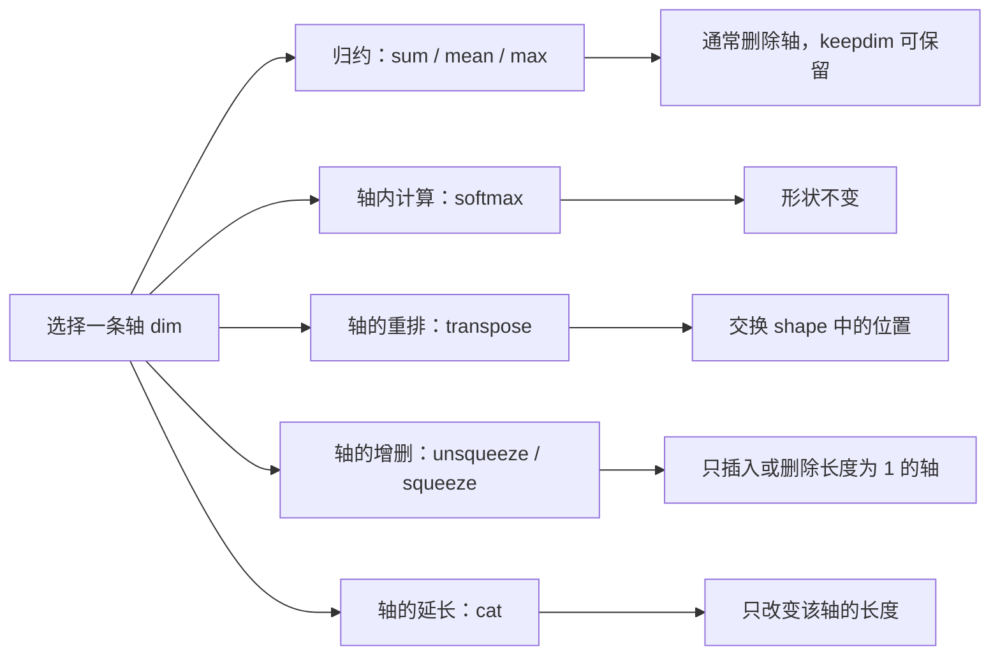

## 核心

**理解 Tensor 的关键不是给每个 `dim` 死记“行、列、批次”等名称，而是把 `shape` 看成一张轴的清单：`dim` 只是选中清单里的某一项，具体操作再决定这一轴会被归约、归一化、交换、插入、删除还是延长。** 遇到任何张量代码，先写出输入形状，再只追踪被操作的轴，绝大多数维度问题都会变成可以机械推导的形状变化。

1. Table of Contents, ordered
{:toc}

## Tensor 是一份数据加一套解释方式

Tensor（张量）可以先直观地理解为**同一种数据类型组成的多维数组**。不过在 PyTorch 中，仅知道数组里的数还不够，一个普通 Tensor 至少还包含几类关键信息：

- **`shape`**：每条轴分别有多少个元素；
- **`dtype`**：元素的数据类型，例如 `float32` 或 `int64`；
- **`device`**：数据位于 CPU、CUDA GPU 还是其他设备；
- **`stride`**：沿每条轴移动一步时，在底层存储中要跨过多少个元素；
- **`requires_grad`**：自动微分是否需要追踪以它为起点的计算。

根据 PyTorch 的[存储模型](https://docs.pytorch.org/docs/stable/storage.html)，底层 `Storage` 保存一维字节序列，`shape`、`stride` 和偏移量共同决定如何把这段存储解释为多维数据。因此，`view`、`transpose` 等操作可以只改变“怎样解释数据”，而不一定搬动底层元素。

假设一个语言模型中间张量的形状是：

```text
x.shape = (2, 5, 4)
           │  │  └─ dim=2：每个 token 的 4 个特征
           │  └──── dim=1：每个样本的 5 个 token
           └─────── dim=0：一个 batch 中的 2 个样本
```

这里的“样本、token、特征”是这段模型代码赋予三条轴的**业务语义**，不是 `dim=0/1/2` 自带的固定含义。图像模型常用 `(batch, channel, height, width)`，语言模型则常见 `(batch, sequence, hidden)`；同一个 `dim=1` 在前者可能是通道，在后者可能是序列位置。

## dim 只是 shape 的位置索引

维度编号与 Python 序列索引一致：正数从左到右，负数从右到左。对于 `(2, 5, 4)`：

```text
shape:  (2,     5,     4)
正索引: dim=0  dim=1  dim=2
负索引: dim=-3 dim=-2 dim=-1
```

因此 `dim=2` 与 `dim=-1` 指向同一条轴，`transpose(1, 2)` 与 `transpose(-2, -1)` 也会交换同一对轴。负数索引特别适合通用代码：无论输入总共有几维，`dim=-1` 永远表示最后一维。

把三维 Tensor 想成一摞表格也有助于建立直觉：`dim=0` 区分不同表格，`dim=1` 区分每张表格的行，`dim=2` 区分每行的列。但这个比喻只负责说明**轴的位置**；轴被选中后发生什么，仍由具体算子决定。

## 同一个 dim，在不同操作里做的是不同事情

“沿某一维压扁”适合解释 `sum(dim=...)` 这类归约操作，却不能推广到所有带 `dim` 的 API。以 `x.shape = (B, T, H)` 为例，不同操作的形状变化如下：

| 操作 | 输出形状 | 被选中的轴发生什么 |
|---|---|---|
| `x.sum(dim=1)` | `(B, H)` | 沿 `T` 求和，默认删除这条轴 |
| `x.sum(dim=1, keepdim=True)` | `(B, 1, H)` | 沿 `T` 求和，但保留长度为 1 的占位轴 |
| `x.softmax(dim=-1)` | `(B, T, H)` | 沿 `H` 归一化，形状不变 |
| `x.transpose(1, 2)` | `(B, H, T)` | 交换 `T` 与 `H` 两条轴 |
| `x.unsqueeze(1)` | `(B, 1, T, H)` | 在位置 1 插入一条长度为 1 的新轴 |
| `x.squeeze(0)`，且 `B=1` | `(T, H)` | 只删除长度为 1 的第 0 轴 |
| `x.reshape(-1, H)` | `(B×T, H)` | 合并前两条轴，重新解释形状 |
| `torch.cat([x, x], dim=1)` | `(B, 2T, H)` | 沿现有的 `T` 轴拼接，使它变长 |

可以把这些操作分成五类：



### 归约会把一组数合成一个数

考虑一个形状为 `(3, 2)` 的矩阵：

```python
x = torch.tensor([
    [1, 2],
    [3, 4],
    [5, 6],
])
```

`x.sum(dim=0)` 沿第 0 轴把三个位置对应的行合并，得到 `[9, 12]`，形状从 `(3, 2)` 变为 `(2,)`。`x.sum(dim=1)` 则分别合并每一行中的两个数，得到 `[3, 7, 11]`，形状变为 `(3,)`。

更稳妥的推导方式不是背“按行”还是“按列”，而是：**被归约的那一项从 `shape` 中消失，其他项保持原顺序。** 如果设置 `keepdim=True`，它不会消失，而是变成长度为 1。

### Softmax 只在轴内归一化，不删除轴

`softmax(dim=-1)` 会对最后一维的每一组数分别计算概率，使每组结果之和为 1，但输入与输出形状完全相同。若 logits 的形状是 `(batch, sequence, vocab_size)`，在 `dim=-1` 上做 Softmax，表示每个样本的每个位置都独立得到一个词表概率分布。

这说明 `dim` 的通用含义只能表述为“指定操作作用在哪一条轴上”，不能表述成“指定要删掉哪一维”。

### transpose 交换轴，数据语义也随之换位

按照 PyTorch 的[`transpose` 文档](https://docs.pytorch.org/docs/stable/generated/torch.transpose.html)，`x.transpose(dim0, dim1)` 会交换两条指定轴。若 `x.shape=(2, 5, 4)`：

```python
y = x.transpose(1, 2)

# x.shape: (2, 5, 4)  -> (batch, sequence, feature)
# y.shape: (2, 4, 5)  -> (batch, feature, sequence)
```

对于普通稠密 Tensor，转置结果通常与原 Tensor 共享底层存储，只改变 shape 和 stride。这也解释了为什么转置后的 Tensor 经常不是内存连续的，以及为什么它后面直接调用 `view()` 可能报错。

## squeeze 与 unsqueeze 管理长度为 1 的轴

长度为 1 的轴不是“没有数据”，而是为广播、批处理或接口约定保留的结构位置。例如单个 token 序列最初可能是 `(T,)`，模型却要求 `(batch, sequence)`，此时需要插入 batch 轴：

```python
tokens = torch.tensor([53, 12, 7], dtype=torch.long)
batched_tokens = tokens.unsqueeze(0)

# (3,) -> (1, 3)
```

`unsqueeze(dim)` 在指定位置插入一条长度为 1 的轴；`squeeze(dim)` 只在指定轴长度确实为 1 时删除它，否则形状保持不变。PyTorch 官方特别提醒：不带参数的 [`squeeze()`](https://docs.pytorch.org/docs/stable/generated/torch.squeeze.html) 会删除**所有**长度为 1 的轴，可能把 `batch_size=1` 的 batch 轴也意外删除。因此，接口仍然需要某条轴时，优先显式写出目标 `dim`。

注意力权重就是一个典型场景。模型可能输出 `(1, T_target, T_source)`，而二维热力图需要 `(T_target, T_source)`，于是 `squeeze(0)` 恰好删除单样本 batch 轴。若输入变成多个样本，形状是 `(B, T_target, T_source)` 且 `B>1`，同一句 `squeeze(0)` 什么也不会做。

## view 与 reshape 改变形状，不改变元素总数

语言模型常输出 `(B, T, V)`：`B` 是 batch 大小，`T` 是序列长度，`V` 是词表大小。若要把每个 token 位置当作一条独立分类样本，可以写成：

```python
logits_2d = outputs.reshape(-1, vocab_size)  # (B, T, V) -> (B*T, V)
targets_1d = targets.reshape(-1)             # (B, T)    -> (B*T,)
loss = criterion(logits_2d, targets_1d)
```

`-1` 是待推导维度：PyTorch 根据元素总数和其他已知维度自动算出它的长度。一条形状表达式中最多只能有一个 `-1`，而且变形前后的元素总数必须相等。

常见代码会使用 `view(-1, vocab_size)`，在输入内存布局兼容时完全成立。需要注意的边界是：[`view`](https://docs.pytorch.org/docs/stable/generated/torch.Tensor.view.html) 只能在 shape 与 stride 兼容时返回共享数据的视图；`transpose` 等操作产生非连续布局后，`view` 可能失败。无法确定连续性时，用 `reshape()` 更稳妥：布局兼容时它仍返回视图，否则会自动复制数据。

这里把 `(B, T, V)` 展平也不是因为 `CrossEntropyLoss` “只支持二维输入”。官方[`CrossEntropyLoss` 文档](https://docs.pytorch.org/docs/stable/generated/torch.nn.CrossEntropyLoss.html)同样支持 `(N, C, d1, ..., dK)` 的高维 logits，只是类别轴必须位于第 1 维。因此还可以先把 `(B, T, V)` 转成 `(B, V, T)`，直接与 `(B, T)` 的 targets 计算损失：

```python
loss = criterion(outputs.transpose(1, 2), targets)
```

两种写法表达的是同一批 token 分类任务，前者把 batch 与序列轴合并，后者保留两条轴但把类别轴换到接口要求的位置。

## Python、NumPy 与 Tensor 的互转要分清复制和共享

从 Python 列表构造 token ID 时，推荐使用 `torch.tensor` 并显式指定整数类型：

```python
output_tokens = [53, 12, 7]
tokens = torch.tensor(
    output_tokens,
    dtype=torch.long,
    device=device,
).unsqueeze(0)

# list -> (3,) -> (1, 3)
```

`torch.LongTensor(output_tokens).to(device)` 也能得到整数 Tensor，但 `LongTensor` 属于旧式类型构造器。官方[`torch.tensor` 文档](https://docs.pytorch.org/docs/stable/generated/torch.tensor.html)推荐使用统一构造函数；它会复制输入数据。对于 NumPy 数组，如果希望尽量避免复制，可以按语义选择 `torch.from_numpy(array)` 或 `torch.as_tensor(array)`，并注意共享内存意味着一侧的原地修改可能影响另一侧。

从模型 Tensor 转成 NumPy 时，常见的兼容写法是：

```python
heatmap = attn_weights.squeeze(0).detach().cpu().numpy()
```

这条链上的每一步解决不同问题：

| 操作 | 解决的问题 | 是否总是必需 |
|---|---|---|
| `squeeze(0)` | 把 `(1, T_target, T_source)` 变成二维热力图 | 只在下游需要且该轴长度为 1 时需要 |
| `detach()` | 从自动微分计算图分离 | Tensor 正在追踪梯度时需要 |
| `cpu()` | 把加速器数据移到 CPU | 数据不在 CPU 时需要 |
| `numpy()` | 得到 NumPy 数组 | 下游接口确实需要 NumPy 时才需要 |

所以这四步不是抽象意义上的“缺一不可”。它们分别处理**形状、梯度、设备、数据接口**四个独立约束；根据当前 Tensor 状态，可以有些步骤什么也不做或无需出现。

## 多维 matmul：最后两维相乘，前导维度广播

对高维 Tensor 使用 `torch.matmul` 时，可以先把形状拆成两段：

$$
A: (*\text{batch}, m, k), \qquad
B: (*\text{batch}, k, n)
$$

最后两维按普通矩阵规则执行 $(m,k)@(k,n)\rightarrow(m,n)$；前面的所有 batch 维度按广播规则对齐。根据官方[`torch.matmul` 文档](https://docs.pytorch.org/docs/stable/generated/torch.matmul.html)，结果形状为：

$$
(*\text{broadcasted batch}, m, n)
$$

例如：

```python
a = torch.randn(1, 2, 3, 4)
b = torch.randn(1, 2, 4, 3)
c = a @ b

# batch 维度: (1, 2) 与 (1, 2)
# 矩阵维度:   (3, 4) @ (4, 3) -> (3, 3)
# c.shape:    (1, 2, 3, 3)
```

这并不是把两个四维对象整体执行某种新运算，而是在 batch 坐标 `(0, 0)` 和 `(0, 1)` 上分别取出两对矩阵，各自完成 `(3,4)@(4,3)`。如果两边的 batch 形状不同，只要满足从右向左逐项相等或其中一项为 1，仍可通过广播完成；例如 `(1, 3, 4)@(2, 4, 5)` 会得到 `(2, 3, 5)`。

## 用形状账本排查 Tensor 代码

面对一串张量操作，最可靠的方法是给每一步记“形状账本”，而不是只在脑中想象高维盒子：

```python
def inspect_tensor(name, x):
    # 同时检查形状、类型、设备、梯度与内存布局。
    print(
        name,
        "shape=", tuple(x.shape),
        "dtype=", x.dtype,
        "device=", x.device,
        "requires_grad=", x.requires_grad,
        "contiguous=", x.is_contiguous(),
        "stride=", x.stride(),
    )
```

每遇到一个操作，按下面四步推导：

1. 给输入 shape 的每一项标注语义，例如 `(batch, sequence, hidden)`；
2. 找出 `dim` 选中了 shape 的哪一项，包括负数索引换算；
3. 判断算子属于归约、轴内计算、交换、增删、重塑、拼接还是矩阵乘法；
4. 写出输出 shape，再检查下游接口期待的类别轴、batch 轴、设备和 dtype。

这套方法也能迅速区分几个常见混淆：

- `x.dim()` 返回 Tensor 有几条轴，而 `dim=...` 参数是在选择其中一条轴；
- `squeeze` 只删长度为 1 的轴，不会删除任何元素；
- `transpose` 改变轴的顺序，`view/reshape` 改变分组方式，两者不是同一种变形；
- `softmax(dim=-1)` 是沿最后一轴分别归一化，不是把整个 Tensor 一次性归一化；
- 多维 `matmul` 只把最后两维视为矩阵，前导维度负责组织和广播这些矩阵。

## 评价

### 写得好的地方

用“轴的清单”统一理解 shape 和 `dim`，可以把归约、归一化、转置、增删维度、重塑与矩阵乘法放进同一套推导框架。`(1,2,3,4)@(1,2,4,3)`、`(B,T,V)->(B×T,V)` 和注意力热力图等例子，又把抽象的维度编号落到了模型训练与可视化的具体任务上。读者不仅能知道某个 API 会产生什么结果，还能通过输入、操作和输出三步自行推导陌生代码。

### 可以改进的地方

形状推导解决了多数接口层问题，但还没有深入性能层：广播可能生成逻辑视图却在后续算子中触发大规模计算，`reshape` 的隐式复制也可能带来额外内存开销。稀疏 Tensor、命名 Tensor、`einsum` 以及不同内存格式的行为同样不在本文范围内。进入性能优化阶段后，还需要结合 profiler、实际 stride、算子实现和硬件特征判断，不能只凭 shape 推断成本。
