1. Table of Contents, ordered
{:toc}

一个 Agent 收到“分析销售数据并生成报告”的任务后，可能先下载 Excel，再临时编写 Python、安装数据处理库、生成图表，最后调用邮件系统发送报告。如果分析过程中发现数据异常，它还可能启动浏览器查询背景信息，或者运行一个本地 Web 服务展示结果。

这已经不是一次简单的模型推理，而是一连串真实的计算机操作。问题随之而来：模型生成的代码并不总是正确，网页和文件可能携带提示词注入，临时安装的软件也未必可信。企业既希望 Agent 能自由完成任务，又不能让它误删宿主机文件、读取其他任务的数据，或者把企业凭证发送到互联网上。

一种自然的解决办法，是给每个 Agent 准备一台受控的“云电脑”：它可以在里面安装软件、运行代码、操作文件甚至破坏整个环境，但影响必须止步于这台电脑。任务结束后，平台还要能快速回收它；任务再次到来时，又能在毫秒级恢复工作现场。

[CubeSandbox](https://github.com/TencentCloud/CubeSandbox) 正是围绕这组需求构建的开源沙箱系统，项目也维护了独立的[官方文档站](https://cubesandbox.com/)。要准确理解它的价值，需要先把 Docker、Linux 内核、传统虚拟机、MicroVM 和上层编排平台放回各自的位置。

## Agent 从“回答问题”走向“执行任务”

大语言模型本身擅长理解和生成信息，却不会凭空拥有文件系统、浏览器和企业权限。一个能够持续完成任务的 Agent，通常由推理循环、工具、记忆、执行环境和治理系统共同组成。

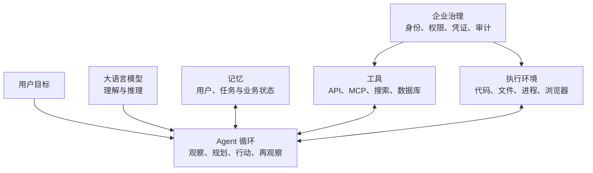

传统聊天机器人的主循环往往是“提问—生成—结束”，Agent 则需要反复观察执行结果并决定下一步。它可能动态选择命令、安装依赖、打开端口、等待外部事件，甚至在失败后回滚并尝试另一条路线。这种自主性让 Agent 更接近“数字员工”，也把模型的不确定性带进了真实计算环境。

个人实验可以容忍一次脚本报错，企业系统还必须回答更多问题：这个 Agent 代表谁，它能访问哪些数据，哪些动作需要审批，同时启动一万个任务时如何调度，失败后如何恢复，以及事后能否还原完整执行轨迹。

因此，企业 Agent 的基础设施不只是一个模型 API。模型解决“如何思考”，运行时和沙箱还要解决“在哪里工作、能够做什么、出了问题怎么办”。

## 应用环境与安全边界是两个问题

Agent 需要 Python、浏览器、Git、数据处理库和业务工具，Docker 镜像很适合描述这些依赖。例如，一个镜像可以预装 Python 和常用软件：

```dockerfile
FROM python:3.12

RUN pip install pandas numpy matplotlib
RUN apt-get update && apt-get install -y git curl
```

但“镜像里装了什么”和“运行时能伤到谁”是两个正交问题：

> **镜像定义工作环境，隔离机制定义破坏半径。**

同一个 OCI 镜像既可以由普通 `runc` 容器执行，也可以运行在 gVisor、Kata Containers 或 MicroVM 中。镜像仍然负责依赖与交付，底层运行时则选择不同的安全边界。

Linux 上的普通 Docker 容器主要依赖以下机制：

- Namespace 为进程、网络和挂载点提供不同视图；
- cgroup 统计并限制 CPU、内存和 I/O；
- capability 将传统 root 权限拆分成更小的能力；
- seccomp 限制进程能够发起的系统调用；
- AppArmor 或 SELinux 增加访问控制策略。

这些机制成熟而高效。对于提前构建、经过测试、权限配置合理的服务，容器通常是很合适的运行方式。不过，普通容器里的进程最终仍由同一个宿主机 Linux 内核处理系统调用。Docker 的[安全文档](https://docs.docker.com/engine/security/)也将宿主机内核、Namespace、cgroup、daemon 权限和内核漏洞列为容器安全的关键边界。

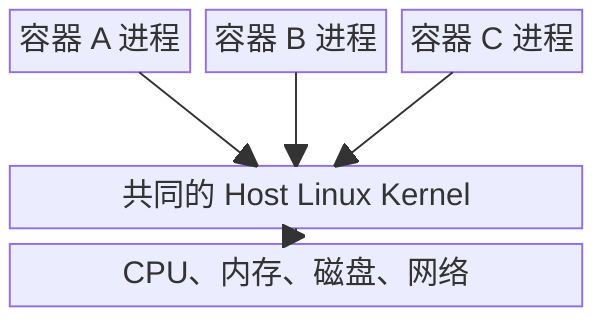

Agent 工作负载的风险不来自“安装依赖”这个动作本身，而来自它的内容更加动态：代码可能刚刚由模型生成，软件可能刚从互联网下载，输入可能来自不可信网页，下一条命令也无法在部署时完全确定。多租户平台因而倾向于在容器安全机制之外，再增加一道独立内核或虚拟化边界。

这并不意味着 Docker 只能运行可信代码，也不意味着容器天然不安全。rootless、严格 seccomp、最小 capability、只读文件系统和强制访问控制都能显著加固容器。差别在于威胁模型：当平台把“任意动态代码”当作常态时，独立内核带来的额外边界往往值得其成本。

## 系统调用为什么会成为共享内核的攻击面

用户态程序不能直接控制硬件，也不能在正常情况下随意修改其他进程的内存。读文件、申请内存、创建进程和访问网络，都要通过系统调用请求内核服务。

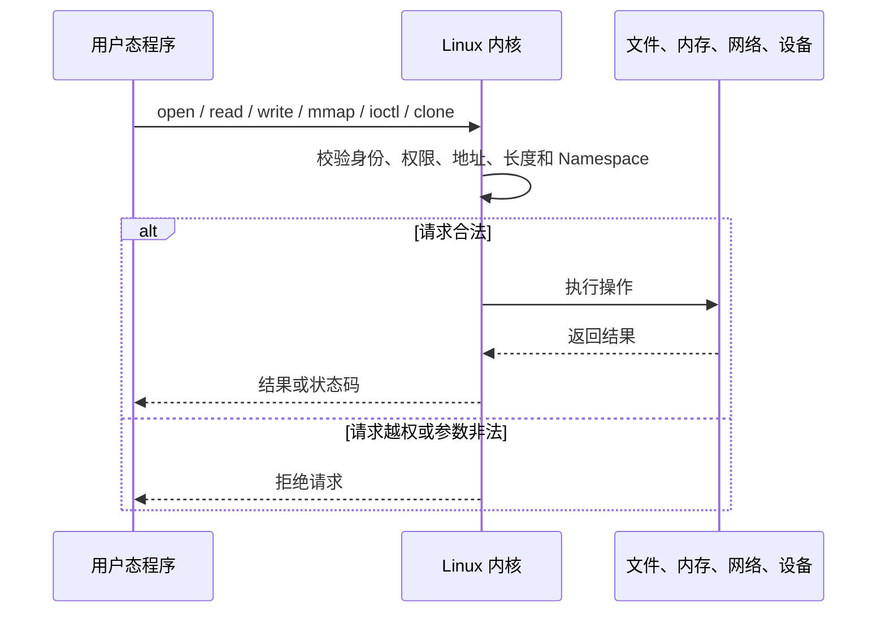

`write()` 并不等于“可以写入别的进程”。正常内核会检查文件描述符、地址范围、访问权限和资源归属。危险通常来自四类情况。

第一类是**内核漏洞**。攻击代码通过精心构造的系统调用参数触发越界读写、use-after-free、整数溢出、竞态条件或错误的权限检查。如果漏洞允许修改内核数据或在内核态执行代码，攻击者就可能绕过原有 Namespace 和权限边界。

第二类是**运行配置暴露了过大权限**，例如 privileged 容器、宿主机根目录、Docker socket、危险 capability 或宿主机设备。此时攻击者甚至不需要内核零日漏洞，就能借助已有权限控制宿主机。

第三类是**共享资源耗尽**。进程可能创建大量子进程、连接和文件，耗尽内存、磁盘、文件描述符或 I/O。cgroup 能够降低这类风险，但前提是所有关键资源都被正确限制。

第四类甚至不需要突破内核。只要 Agent 能读取企业文件、获得长期 API Key 并自由访问互联网，一次提示词注入就可能把敏感数据通过合法 HTTPS 请求发送出去。因此，虚拟化隔离只解决一部分问题；企业 Agent 还需要出站网络策略、凭证隔离和完整审计。

[gVisor 的安全架构说明](https://gvisor.dev/docs/architecture_guide/intro/)指出，Namespace、seccomp 等机制可以缩小攻击面，但这些规则最终仍由同一个单体 Linux 内核执行。这正是独立执行边界试图进一步降低的风险。

## Guest kernel 是虚拟机内部的真实内核

虚拟化语境中的 Host 是提供物理资源的宿主系统，Guest 是运行在虚拟硬件中的客体系统。相应地，host kernel 是宿主机内核，guest kernel 是虚拟机内部的操作系统内核。

Guest kernel 并不是“假内核”。它仍然是真正的 Linux 内核，只是看到的 CPU、内存、磁盘和网卡由虚拟化层提供。

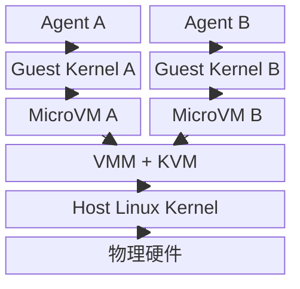

Agent 在 MicroVM 中调用 `open()` 或 `socket()` 时，首先处理请求的是自己的 guest kernel。如果它利用 guest kernel 漏洞取得了内核权限，最先攻破的仍是这台虚拟机。要继续进入宿主机，还必须再突破 VMM、KVM 或虚拟设备边界。这道额外屏障正是硬件虚拟化的核心价值。

独立内核并非没有成本。传统 VM 往往提供完整虚拟硬件、启动完整操作系统，并为长期运行而设计，因而启动较慢、基础内存开销也更高。MicroVM 保留硬件虚拟化边界，同时裁剪非必要设备、guest 功能和启动流程，使其更适合短任务与高密度多租户场景。

[Firecracker](https://firecracker-microvm.github.io/) 是这种思路的典型实现。它使用 KVM 创建轻量虚拟机，通过最小设备模型和精简 guest 配置降低启动时间、内存开销与攻击面，最初用于 AWS Lambda、Fargate 等 Serverless 场景。AWS 的[发布文章](https://aws.amazon.com/blogs/aws/firecracker-lightweight-virtualization-for-serverless-computing/)进一步介绍了这套技术的背景。

## Docker、传统 VM 与 MicroVM 解决不同层次的问题

容器、传统 VM 和 MicroVM 经常被放在一张性能表里比较，容易让人误以为它们只是三种“安装应用的方法”。实际上，三者首先选择了不同的执行边界，然后才表现出不同的启动速度、资源开销和使用体验。

### Docker 以进程为中心

普通 Docker 容器启动的是宿主机上的隔离进程。它不需要启动自己的内核，也不需要模拟一整套硬件，所以创建快、密度高，并且天然适配镜像仓库、CI/CD、Kubernetes 和微服务生态。

这种模式尤其适合行为相对可预期的应用：Nginx 的二进制、配置、监听端口和所需权限都可以提前审查，发布前也经历过测试。平台可以针对它设置最小 capability、只读目录和 seccomp 策略。

“已知应用”并不是 Docker 的技术前提，Docker 当然也能运行动态代码；它只是说明了风险判断的差别。普通业务容器通常把共享宿主机内核当作可接受的信任边界，而任意代码平台需要假设每次执行都可能主动寻找边界漏洞。

### 传统 VM 以完整机器为中心

传统虚拟机向 guest OS 提供接近真实计算机的硬件环境，通常包含更丰富的设备模型、固件、启动流程和操作系统服务。这让它能够运行不同内核和完整操作系统，适合数据库、企业软件、长期服务器、桌面系统，以及需要迁移、热插拔和复杂设备支持的场景。

这些通用能力也构成了成本：实例需要分配较完整的内存与磁盘，经过 guest kernel 和用户空间初始化，VMM 还要维护更多虚拟设备。传统 VM 的设计目标本来就不是为每个几十秒的任务反复创建和销毁一台机器。

### MicroVM 以单个轻量工作负载为中心

MicroVM 没有放弃硬件虚拟化，而是从传统 VM 中删掉 Agent、函数和容器任务不需要的通用能力。它通常只保留精简内核、最少的 virtio 设备和直接的启动路径，并通过预热模板或内存快照跳过重复初始化。

它仍有自己的 guest kernel，因此系统调用首先落到虚拟机内部；它又不追求模拟一台功能齐全的通用 PC，因此可以把启动延迟和基础开销压得更低。MicroVM 的目标可以概括为：**保留 VM 的隔离边界，尽量接近容器的交付效率。**

| 维度 | 普通 Docker 容器 | 传统 VM | MicroVM |
|---|---|---|---|
| 基本执行单元 | Host 上的隔离进程 | 一台完整虚拟计算机 | 一台面向单类工作负载的精简虚拟机 |
| 内核 | 与宿主机共享 host kernel | 独立 guest kernel | 独立且通常经过裁剪的 guest kernel |
| 隔离主边界 | Namespace、cgroup、capability、seccomp | 硬件虚拟化 | 硬件虚拟化 |
| 虚拟设备 | 无需模拟整台机器 | 设备丰富、兼容性优先 | 只保留 block、net、vsock 等必要设备 |
| 启动路径 | 创建 Namespace 后启动进程 | 固件、内核、用户空间完整启动 | 精简启动或直接从快照恢复 |
| 资源密度 | 很高 | 相对较低 | 高于传统 VM，目标是接近容器 |
| 主要优势 | 镜像生态、交付速度、资源效率 | 强隔离、完整 OS 与通用兼容性 | 强隔离、快速启动与高密度的平衡 |
| 典型场景 | 微服务、已知应用、CI 任务 | 长期服务器、桌面、复杂企业软件 | Serverless、任意代码、Agent 沙箱 |

三者也不是彼此排斥的完整技术栈。OCI 镜像可以继续描述 MicroVM 里安装什么，containerd 可以继续负责拉取镜像，上层 Kubernetes 也可以继续负责编排；真正改变的是镜像启动后，应用与宿主机之间隔着 Namespace，还是独立 guest kernel 与 VMM。

因此，CubeSandbox 并没有抛弃容器生态。它的 CubeShim 实现 containerd Shim v2 接口，保留 OCI 镜像和 containerd 的交付方式，却将最终执行边界换成 MicroVM。可以把这种组合概括为：

> **环境准备像容器，安全边界像虚拟机，生命周期则按 Agent 任务重新设计。**

## gVisor、Kata 与 MicroVM 采用不同隔离路线

gVisor 和 Kata Containers 经常与安全容器、MicroVM 一起出现，但它们并不是完全相同的技术。

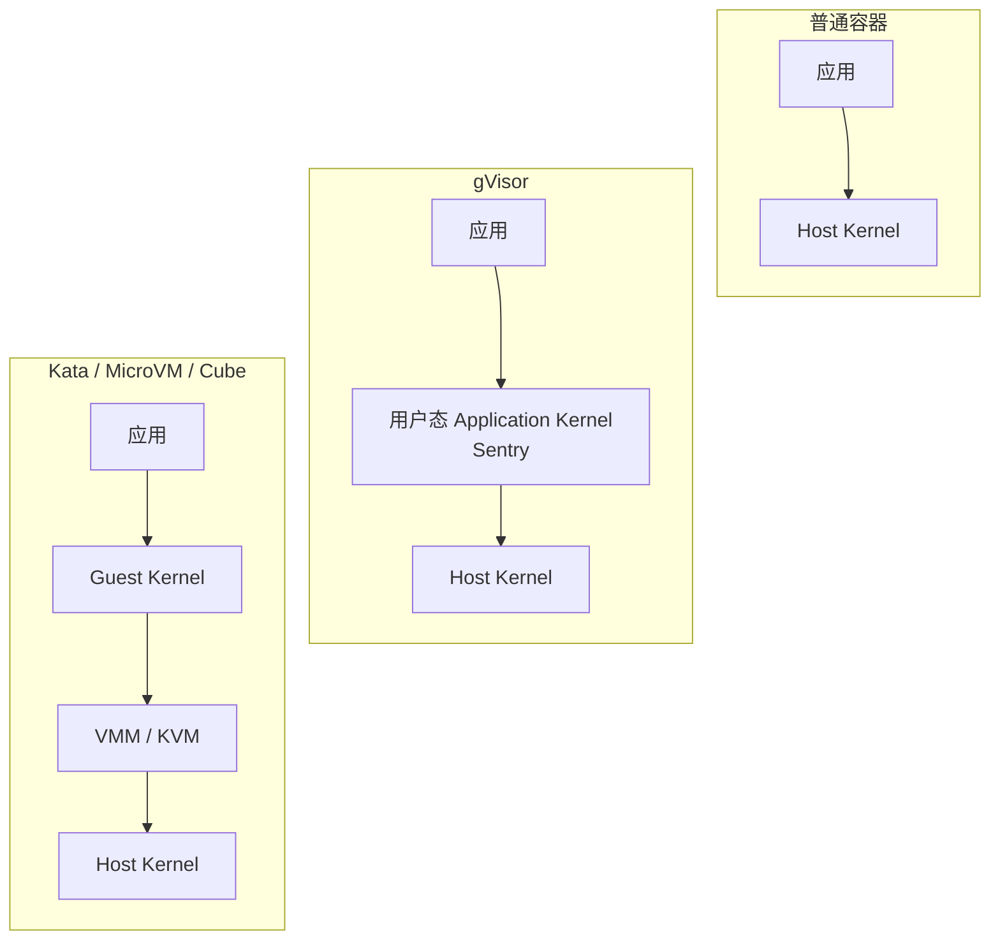

[gVisor](https://gvisor.dev/docs/architecture_guide/intro/) 在用户态实现 application kernel，由 Sentry 拦截并处理应用的系统调用，再以受限方式访问宿主机内核。它可以使用 KVM 平台，但其核心抽象并不是一台传统 VM。

[Kata Containers](https://github.com/kata-containers/kata-containers) 的目标则是让轻量虚拟机拥有类似容器的操作体验，同时保留 VM 的工作负载隔离。Kata 的 guest 中有独立内核和管理进程，并通过 containerd 等容器接口接入现有生态。

CubeSandbox 采用 RustVMM、KVM 和独立 guest kernel，也属于硬件虚拟化路线。把 gVisor 与 Kata 都简称为“MicroVM”虽然方便，却会掩盖 application kernel 与 guest kernel 之间的关键差异。

## MicroVM 只是执行原语，CubeSandbox 是完整平台

一个 VMM 通常能创建 MicroVM、配置 vCPU 与内存、挂载 rootfs、提供虚拟设备，并执行启动、暂停和停止。有些实现还提供快照、限速或元数据 API。

企业真正需要的却不是手工创建一台虚拟机，而是稳定管理一整支动态“电脑舰队”：

- 根据资源余量选择计算节点；
- 维护环境模板并提前预热；
- 高频创建、暂停、恢复和销毁；
- 从运行状态创建快照、克隆和回滚；
- 把请求路由到正确的沙箱与端口；
- 控制每个沙箱能够访问的网络目标；
- 在不暴露密钥的情况下调用外部 API；
- 管理多租户认证、配额、元数据和审计；
- 扩展到多节点集群并处理日常运维。

因此，MicroVM 与 CubeSandbox 不在同一抽象层：

> **MicroVM 是一台轻量虚拟电脑，CubeSandbox 是管理大量这种电脑的调度平台、网络系统、安全系统和服务接口。**

把二者逐项拆开，差异会更加清楚：

| 能力 | 裸 MicroVM / VMM | CubeSandbox |
|---|---|---|
| 关注对象 | 当前宿主机上的一台虚拟机 | 单机或集群中的沙箱服务 |
| 资源创建 | 配置 vCPU、内存、kernel、rootfs 和设备 | 从模板创建环境，并自动选择计算节点 |
| 对外接口 | 偏底层的 VM 控制 API | E2B-compatible REST、SDK、WebUI |
| 集群调度 | 通常不负责 | CubeMaster 选择节点，Cubelet 管理本机生命周期 |
| 环境交付 | 调用方自己准备磁盘和内核 | OCI 镜像、containerd、模板构建和预热 |
| 状态管理 | 可能提供基础 pause 或 snapshot 原语 | 自动暂停恢复、快照、克隆、回滚和生命周期事件 |
| 存储复制 | 调用方自行实现 | CubeCoW 提供 rootfs 与内存卷的写时复制 |
| 入站访问 | 调用方自行维护 IP 和端口 | CubeProxy 按 sandbox ID 与端口动态路由 |
| 出站治理 | 通常只提供虚拟网卡 | CubeVS 网络策略、CubeEgress L7 策略与审计 |
| 密钥处理 | 调用方将凭证放进 VM 或另建系统 | 代理层注入凭证，密钥不进入沙箱 |
| Agent 语义 | 不理解命令、文件、会话与空闲状态 | 围绕交互任务、端口、会话和高频生命周期设计 |

裸 MicroVM 更像发动机或虚拟化库：它提供“怎样安全地运行一台小虚拟机”。CubeSandbox 则把这个原语变成可以被 Agent 平台直接消费的服务，回答“谁来创建、创建在哪里、如何访问、何时暂停、如何恢复、可以连接哪里、凭证如何保护”。

## CubeSandbox 被设计出来，是为了填补四类技术之间的空档

CubeSandbox 的诞生不能简单归结为“Agent 需要运行代码”。Docker、传统 VM、MicroVM 和 Serverless 平台都能运行代码，但每一种现有方案只解决了部分问题。

| 已有方案 | 已经解决的问题 | 直接用来承载 Agent 时仍缺少什么 |
|---|---|---|
| Docker / 容器平台 | 镜像交付、进程隔离、高密度和成熟生态 | 任意代码长期接触共享 host kernel，缺少更硬的多租户边界 |
| 传统 VM / IaaS | 独立内核、强隔离、完整操作系统 | 启动与基础开销面向长期服务器，不适合高频短任务 |
| 裸 MicroVM / VMM | 强隔离、精简设备、快速启动 | 只提供单机执行原语，不负责模板、集群调度、路由、凭证和 Agent API |
| 经典 Serverless | 事件触发、弹性调度、自动回收和多租户执行 | 主要围绕固定 handler 与短调用，难以表达交互式、有状态的工作会话 |

所以 CubeSandbox 的核心目标不是发明第五种虚拟机，而是把这些能力重新组合：继续使用 OCI 镜像和 containerd 描述环境，以 KVM MicroVM 提供独立内核，再在上层补齐集群调度、快速状态复制、动态路由、网络治理、凭证保护和 Agent 生态接口。

这套系统也有两段不同的技术起源。底层 Cube MicroVM Runtime 并不是从零开始为 Agent 编写的；腾讯云公开文章介绍，它最初运行在 Serverless 体系中，长期承担快速启动、调度和多租户隔离。Agent 时代到来后，这些能力被系统性引入沙箱服务，并在上层增加适合 Agent 工作方式的生命周期和接口。[《听说，Agent 都在找这个“箱子”》](https://developer.cloud.tencent.com/article/2601409)给出了这段背景。

因此，更准确的历史表述是：**Cube 的虚拟化底座源自 Serverless，CubeSandbox 的产品形态则面向 Agent 任务重新设计。**

## Agent-first 体现为一组具体的系统改造

CubeSandbox 并不限制只能运行 Agent。普通 Python、构建测试、数据处理、浏览器自动化、强化学习和其他不可信代码，同样可以使用这套环境。“Agent-first”描述的是默认工作负载和系统取舍，而不是准入条件。

传统 VM 常假设实例会运行数周，经典 Serverless 则倾向于一次 `event → handler → result`。Agent 的工作环境位于二者之间：它可能随请求瞬间创建，也可能保留数小时；它会反复执行命令、修改文件、启动服务、等待用户输入，并在失败后回滚或分叉探索。

| Agent 的工作特征 | 给平台带来的问题 | CubeSandbox 的针对性设计 |
|---|---|---|
| 动态生成并执行代码 | 无法提前完全审查，逃逸影响可能跨租户 | 每个沙箱使用独立 guest kernel 的 KVM MicroVM，VMM 再用 seccomp 收缩宿主机攻击面 |
| 突发、高并发任务 | 完整启动 VM 会把冷启动暴露给用户 | 预构建模板、资源池化、内存快照和 RustVMM 恢复路径 |
| 会话有状态但会长时间空闲 | 一直占用 CPU 和内存成本过高 | 自动暂停、请求触发恢复和独立生命周期管理 |
| 经常试错和尝试多条路线 | 每次重新安装环境代价高，失败状态难恢复 | CubeCoW 快照、克隆、回滚和从检查点分叉 |
| 运行环境不可预先固定 | 需要安装不同语言、浏览器、库和业务工具 | OCI 镜像、containerd、Buildkit 和可复用模板 |
| 连续执行命令与文件操作 | 单次函数 handler 无法表达交互过程 | CubeShim、vsock/ttrpc 和 MicroVM 内的 `cube-agent` 管理进程与 I/O |
| 在沙箱内启动 Web 或数据库服务 | 实例地址与端口动态变化 | CubeProxy 按 sandbox ID 与端口进行入站路由 |
| 需要调用外部 API | 自由联网与直接下发密钥都会扩大风险 | CubeVS 网络策略、CubeEgress L7 白名单、凭证注入和访问审计 |
| 大规模多租户运行 | 单机脚本无法处理节点选择、状态和并发 | CubeMaster、Cubelet、Redis 与横向扩展的控制面 |
| 需要接入既有 Agent 框架 | 自定义 API 会抬高迁移成本 | E2B-compatible REST、SDK 和 WebUI |

这些改造最终形成了比一次函数调用更丰富的状态机：

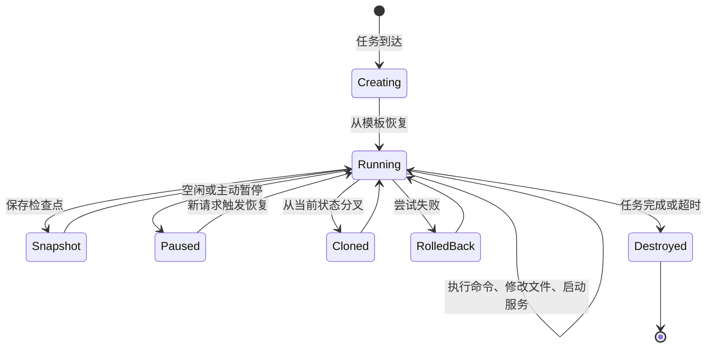

Agent 可以在一次高风险操作前创建快照，失败后回到原状态；存在多种解决方案时，又可以从同一个检查点克隆多个环境并行验证。自动暂停与按请求恢复则在保留工作现场的同时释放空闲计算资源。

开源项目的[中文 README](https://github.com/TencentCloud/CubeSandbox/blob/master/README_zh.md)公布的裸机基准中，单并发冷启动平均低于 60ms；50 路并发创建时平均约 67ms、P95 约 90ms、P99 约 137ms。项目还宣称在其规格条件下，单沙箱基础内存开销低于 5MB。这些是项目方在特定硬件和测试方法下的结果，不是所有环境的服务级保证；镜像、宿主机、并发、网络与部署方式都会影响最终数字。

## Agent 之前已经存在多种执行环境编排系统

“在底层批量创建执行环境，上层负责 API、调度、状态和回收”并不是 Agent 时代才出现的模式。IaaS、容器、Serverless 和虚拟机编排平台都采用过相似结构，只是管理对象和工作负载假设不同。

| 平台或框架 | 主要编排单元 | 默认工作负载假设 | 擅长解决的问题 | 与 CubeSandbox 的关键差异 |
|---|---|---|---|---|
| [OpenStack Nova](https://docs.openstack.org/nova/latest/install/get-started-compute.html) | 通用云虚拟机 | 实例长期存在，需要完整 OS | IaaS API、镜像、配额、Placement 和计算节点管理 | 管理的是通用 VM，不追求为每次 Agent 任务毫秒级交付工作现场 |
| [Kubernetes](https://kubernetes.io/docs/concepts/workloads/controllers/) | Pod、Deployment、Job | 容器化服务或批处理任务 | 声明式状态、调度、自愈、滚动更新和服务发现 | 默认共享节点内核；对象语义围绕服务和 Job，而非交互式沙箱会话 |
| [KubeVirt](https://kubevirt.io/user-guide/architecture/) | Kubernetes 中的 VM | VM 也要使用 Kubernetes API 管理 | 将虚拟机生命周期接入 Kubernetes 控制器与调度体系 | 强调 VM 即资源，通常不提供 Agent 命令、文件、凭证代理和高频状态分叉语义 |
| [Knative](https://knative.dev/docs/) | 无状态 HTTP 服务与事件 | 请求驱动，可 scale-to-zero | 路由、修订版本、流量切分和自动扩缩 | 经典模型是请求进入容器服务，不负责给每个 Agent 一台可持续交互的电脑 |
| [AWS Lambda](https://docs.aws.amazon.com/lambda/latest/dg/concepts-how-lambda-runs-code.html) + [Firecracker](https://firecracker-microvm.github.io/) | 函数与隔离执行环境 | 事件进入固定 handler，完成后返回 | 安全多租户、环境复用、冷启动优化和超大规模弹性 | Firecracker 是 VMM，Lambda 才是编排服务；经典函数语义比 Agent 沙箱更固定、更弱状态 |

这些系统之间并不是简单的代际替换。OpenStack 适合建设通用 IaaS，Kubernetes 适合长期服务与批处理，KubeVirt 适合统一管理容器和传统 VM，Knative 与 Lambda 适合事件驱动函数。CubeSandbox 复用了它们已经证明有效的控制面—数据面、节点 Agent、镜像、调度和 scale-to-zero 思想，却把管理单元改成了**一段可交互、可暂停、可恢复、可分叉的 Agent 工作会话**。

需要说明的是，Serverless 本身也在演进，部分产品已经增加持久工作流、检查点和更长生命周期。这里比较的是其经典函数模型，而不是声称所有 Serverless 产品永远只能无状态运行。

这条演进路线可以看成云端执行单元不断变化：

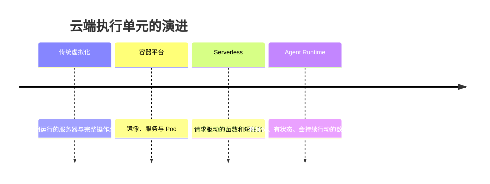

Agent 沙箱继承了 Serverless 的弹性与快速交付，却还要管理交互式命令、运行中进程、动态端口、完整工作目录、暂停恢复和分支探索。

| 维度 | 经典 Serverless 函数 | Agent 沙箱 |
|---|---|---|
| 执行入口 | 固定 handler | 动态命令、工具和服务 |
| 驱动方式 | 事件或请求 | 目标、会话和观察循环 |
| 状态假设 | 倾向无状态 | 经常保留文件、进程和上下文 |
| 行为确定性 | 代码提前部署 | 下一步动作可能动态生成 |
| 生命周期 | 一次短调用 | 多轮执行、暂停、恢复和回滚 |
| 管理对象 | 函数版本与并发 | 环境、文件、端口、进程与快照 |

## 一张全景图定位 CubeSandbox 的组件层级

[CubeSandbox 官方架构图](https://cubesandbox.com/architecture/overview)把系统分成集群控制、控制面、数据面、计算节点和 MicroVM 内部环境。下面的图保留相同层次，同时补充官方文字说明中的 Redis、containerd、Buildkit、CubeCoW 和 guest agent，方便看清各组件实际位于哪里。

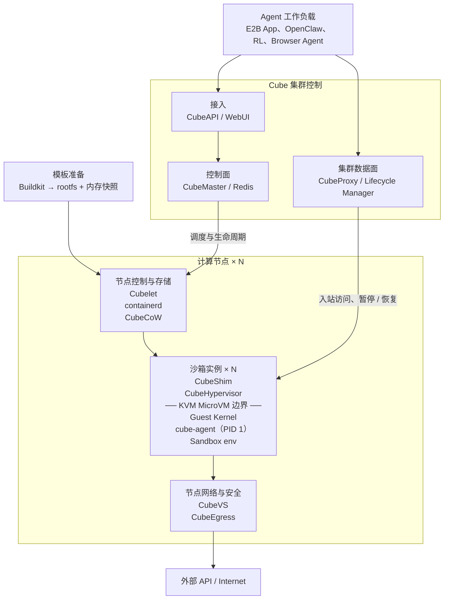

这张图中容易混淆的词是 `cube-agent`。顶部的 Agent 工作负载是业务智能体；MicroVM 里的 `cube-agent` 则是 Cube 的 **guest agent 守护进程**，不是另一个负责推理的 AI Agent。它以 PID 1 运行，初始化 guest 环境，通过 vsock 接收 CubeShim 的 ttrpc 命令，管理容器进程、信号和标准输入输出。[cube-agent 项目说明](https://github.com/TencentCloud/CubeSandbox/tree/master/agent)记录了这些职责。

各组件按层级可以整理如下：

| 层级 | 组件 | 部署位置 | 主要职责 |
|---|---|---|---|
| 接入层 | CubeAPI | 控制面 | E2B-compatible REST、认证回调、参数处理，将外部请求转为内部 gRPC |
| 集群控制 | CubeMaster | 控制面 | 选择计算节点，下发创建、销毁、暂停和恢复任务，发布生命周期事件 |
| 状态协调 | Redis | 控制面共享依赖 | 保存沙箱元数据、事件流、Proxy 路由表和分布式协调状态；API 与 Master 本身不保留本地权威状态 |
| 运维入口 | WebUI | 控制面 | 管理沙箱、模板、节点、版本矩阵和健康状态 |
| 入站数据面 | CubeProxy | 集群数据面 | 按 sandbox ID 与端口把外部请求路由到正确实例 |
| 空闲管理 | Lifecycle Manager | 集群数据面 | 观察生命周期事件，自动暂停空闲实例，并在新请求到达时触发恢复 |
| 节点控制 | Cubelet | 每台计算节点 | 管理本节点所有沙箱的创建、运行、暂停、恢复、快照和销毁 |
| 镜像运行时 | containerd | 每台计算节点 | 拉取 OCI 镜像并通过 Shim v2 接入 Cube 运行时 |
| 运行时桥梁 | CubeShim | 每个沙箱对应的 host 进程 | 把 containerd 的容器操作转换为 VM 生命周期与 guest 命令，通过 ttrpc/vsock 转发 I/O 和信号 |
| 虚拟化 | CubeHypervisor | 计算节点 host | 基于 RustVMM 与 KVM 管理 vCPU、内存、virtio 设备、启动、暂停、快照和恢复 |
| Guest 控制 | cube-agent | MicroVM 内，PID 1 | 初始化 guest，管理容器进程、Namespace、网络、挂载、I/O 与指标 |
| 工作环境 | Sandbox env | MicroVM 内 | Agent 真正运行代码、文件、浏览器、数据库和其他服务的空间 |
| 状态存储 | CubeCoW | 计算节点 | 用 XFS reflink 与 `FICLONE` 管理 rootfs、内存卷、快照、克隆和回滚 |
| 网络数据面 | CubeVS | 每台计算节点 | 用 eBPF 完成地址转换、连接跟踪、网络隔离和策略执行 |
| 出站安全 | CubeEgress | 每台计算节点 | HTTP/HTTPS L7 策略、域名与路径过滤、凭证注入和访问审计 |
| 模板构建 | Buildkit | 支撑组件 | 把 OCI 镜像转换成 rootfs，配合冷启动生成可快速恢复的内存快照模板 |

## 三条链路串起 CubeSandbox 的内部组件

逐个记忆组件名称很容易失去整体视角。CubeSandbox 的运行过程可以先归纳为创建、入站访问和出站访问三条链路，再把每个组件放回链路中的职责位置。

### 模板准备把慢工作移出请求热路径

沙箱能快速启动，并不是因为完整安装和启动过程本身只需要几十毫秒，而是因为平台提前做完了大部分工作。官方架构文档给出的模板链路是：OCI 镜像先由 Buildkit 转成 rootfs，系统冷启动一次 MicroVM 并完成初始化，再把 rootfs 和内存状态注册为只读模板。

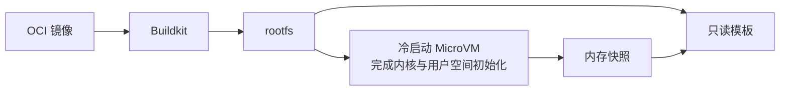

真正的创建请求到来后，CubeSandbox 只需写时复制模板卷，再从已经初始化好的内存快照恢复，而不必重新执行包安装、内核启动和服务初始化。

### 创建链路把模板变成可工作的 MicroVM

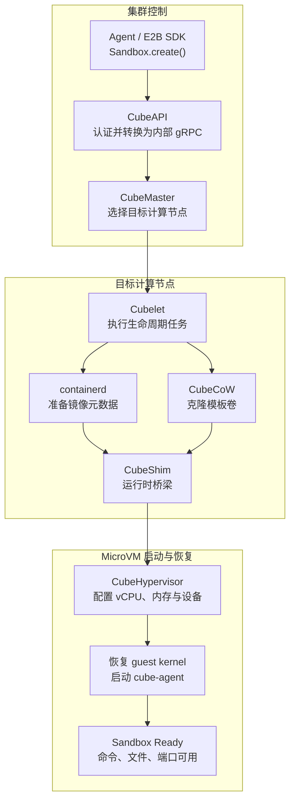

这条链路有两个边界转换。第一个发生在 CubeMaster 与 Cubelet 之间：集群级决策变成某个节点上的具体操作。第二个发生在 CubeShim 与 `cube-agent` 之间：host 侧的 containerd `Create / Start / Exec / Kill / Delete` 被转换为通过 ttrpc/vsock 发送给 MicroVM 的命令。这样，containerd 看见的仍是 Shim v2 任务，上层不必理解 vCPU、guest kernel 和虚拟设备。[CubeShim 项目说明](https://github.com/TencentCloud/CubeSandbox/tree/master/CubeShim)展示了这条桥接关系。

### CubeCoW 让状态可以快速复制与回退

**CubeCoW** 利用 XFS reflink 和 `FICLONE` 实现写时复制。新沙箱不必完整复制模板数据，多个实例可以共享未修改的数据块，只有写入发生时才产生私有副本。对运行中内存做增量快照时，它只持久化变化过的匿名脏页，未修改页面继续通过 reflink 共享。

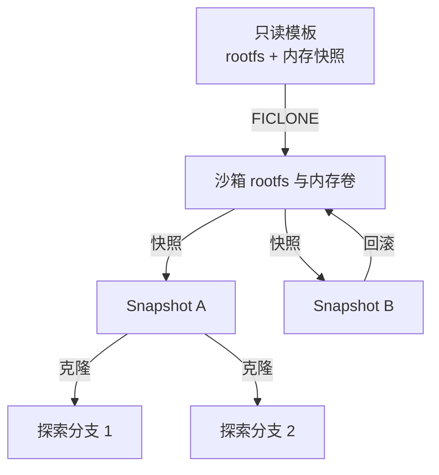

快照、克隆和回滚因而不只是运维功能，也对应 Agent 的推理方式：先保存检查点，再尝试高风险操作；失败就回退；存在多种方案时，从同一状态复制多个环境并行验证。

### 入站链路把请求送到正确的沙箱端口

Agent 可能在沙箱中启动 Jupyter、Web 应用、浏览器控制服务、数据库或调试端口。实例不断创建、暂停和迁移，客户端不能依赖固定 IP。

**CubeProxy** 作为 OpenResty 反向代理，既能从 `<port>-<sandbox_id>.<domain>` 形式的 Host 中解析目标，也能处理 `/sandbox/<sandbox_id>/<port>/...` 路径。它根据 Redis 中的元数据找到目标实例，并与 Lifecycle Manager 配合，使进入暂停沙箱的新请求能够先触发恢复，再继续转发。

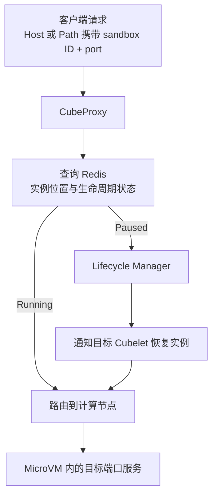

### 出站链路同时控制网络与凭证

**CubeVS** 是基于 eBPF 的网络数据面。它在 TAP、宿主机网卡和代理返回路径上挂载 BPF 程序，为每个沙箱完成 SNAT/DNAT、TCP/UDP/ICMP 连接跟踪、LPM-trie 网络策略和 ARP 代理，不需要为海量实例不断增加 iptables、Linux Bridge 或 OVS 规则。更详细的数据路径可参考[CubeVS 网络架构](https://cubesandbox.com/architecture/network)。

**CubeEgress** 是 HTTP/HTTPS 层的透明出站安全代理。沙箱模板信任 CubeEgress 签发的根 CA，因此代理可以检查 HTTPS 请求，并按照域名、SNI、路径、方法和协议执行允许或拒绝策略。凭证可以在代理层注入，Agent 发出普通请求时不需要、也无法读取真实 API Key；每次策略决策还会进入审计日志。

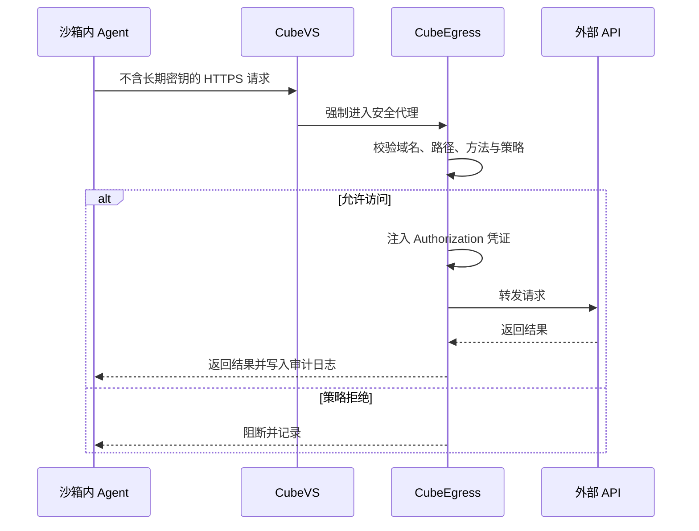

虚拟化隔离回答“突破这台电脑后还能到哪里”，出站治理则回答“这台电脑本来被允许连接哪里”。两者共同构成 Agent 的实际安全边界。

## E2B-compatible REST 提供生态兼容层

[E2B](https://e2b.dev/docs)提供面向 Agent 的按需 Linux 沙箱与 SDK，开发者可以用少量代码创建环境，并通过其[命令执行接口](https://e2b.dev/docs/commands)运行程序、读取输出和管理后台进程：

```python
from e2b import Sandbox

sandbox = Sandbox.create()
result = sandbox.commands.run("python analysis.py")
print(result.stdout)
```

CubeAPI 实现 E2B-compatible REST，意味着它尽量遵循 E2B SDK 所依赖的请求、响应和生命周期语义。已经使用 E2B 的客户端可以通过替换 API endpoint、密钥和必要配置迁移到底层由 CubeSandbox 提供的环境，而不必重写整套业务调用。

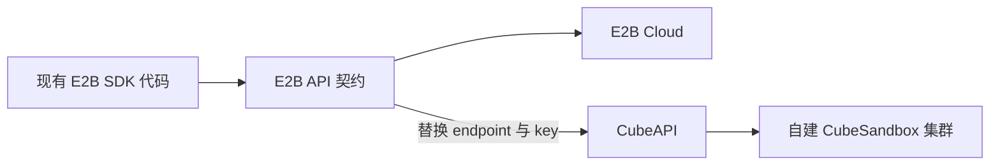

这种兼容方式与 OpenAI-compatible API 类似：客户端依赖一套事实上的接口契约，底层实现可以替换。E2B-compatible 并不是由标准组织制定的通用规范，也不天然保证每个版本和边缘行为完全一致。CubeSandbox 的公开路线图仍将缩小剩余兼容差异列为工作项，因此生产迁移需要针对实际使用的 SDK 版本和功能做验证。

E2B 早期名称来自 **English2Bits**，其中 `2` 读作 `to`，表达从自然语言描述走向代码与计算机执行。[E2B 0.9.6 的历史 PyPI 页面](https://pypi.org/project/e2b/0.9.6/)仍保留了 `english2bits` 的官方描述，[早期项目 README](https://github.com/e2b-dev/e2b/blob/a4ca3e6662a8dc05e7d69643c8c5d174298ee04c/README.md)也可以作为命名历史参考。当前品牌通常直接使用 E2B，不再强调全称。

Cube 则是腾讯这套 MicroVM Runtime 的项目名称，CubeSandbox 表示建立在其上的沙箱系统。公开资料没有给出 Cube 的正式缩写或明确命名来源。把它理解为封闭、独立、可复制堆叠的计算方块，与产品形态很贴切，但只能视为字面联想，不能当作官方解释。

## Agent Runtime 位于 CubeSandbox 的更上层

CubeSandbox 解决的是安全执行环境，企业要真正托管数字员工，还要处理 Agent 身份、会话、工具权限、业务凭证、运行轨迹、长期记忆和知识库。腾讯云 [Agent Runtime](https://cloud.tencent.com/document/product/1814)覆盖的正是更完整的平台层。

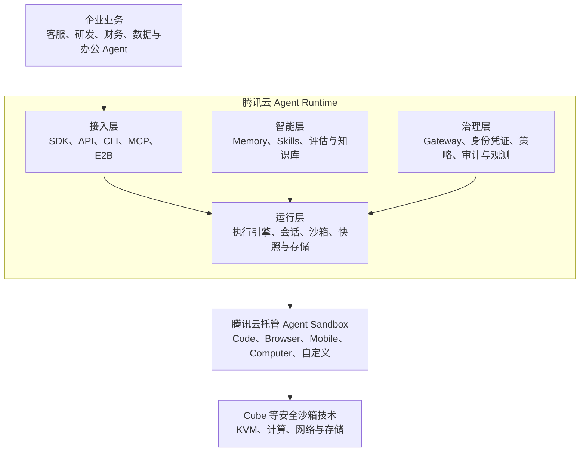

腾讯云当前将 Agent Runtime 的能力归纳为“接入、运行、治理、智能”四层：[产品概述](https://cloud.tencent.com/document/product/1814/129423)中，接入层降低 SDK、API、CLI、MCP 和社区协议的集成成本；运行层提供执行引擎、安全沙箱、会话快照和持久化；治理层统一管理工具、凭证、策略与观测；智能层则承载记忆、评估、Skills 和知识库。[基本概念文档](https://cloud.tencent.com/document/product/1814/123814)进一步区分了沙箱工具、沙箱实例、沙箱快照、Agent Gateway 和身份凭证。

两者关注的状态也不同。CubeSandbox 的快照主要保存文件系统、内存和进程等**机器状态**；Agent Memory 保存用户偏好、任务目标、历史决策和业务上下文等**语义状态**。前者让电脑恢复到原来的工作现场，后者让数字员工记得此前发生了什么。

CubeEgress 与 Agent Gateway 同样处于不同层级。CubeEgress 判断“这个沙箱能否向某域名的某条路径发送请求”；Agent Gateway 还要判断“这个财务 Agent 代表某位用户，是否有权调用付款工具，是否需要审批、脱敏和审计”。一个偏网络执行边界，一个偏企业身份与业务治理。

腾讯云[常见问题](https://cloud.tencent.com/document/faq/1814/123828)也将 Agent 沙箱服务定位为提供隔离、安全、弹性工作环境的基础设施层，而 Agent Runtime 更偏完整的部署、托管、运维和管理。云上托管沙箱的公开表述是基于“Cube 等安全沙箱技术”，因此开源 CubeSandbox 是重要底座，但不能把所有云上沙箱类型和产品能力都等同于同一份开源实现。[Agent Runtime 云沙箱发布介绍](https://developer.cloud.tencent.com/article/2572682)给出了 Code、Browser、Computer 和自定义环境等托管能力。

## 企业 Agent 基座是一组逐层收敛风险的系统

把所有层次放在一起，可以看到 CubeSandbox 在企业 Agent 基础设施中的准确位置。

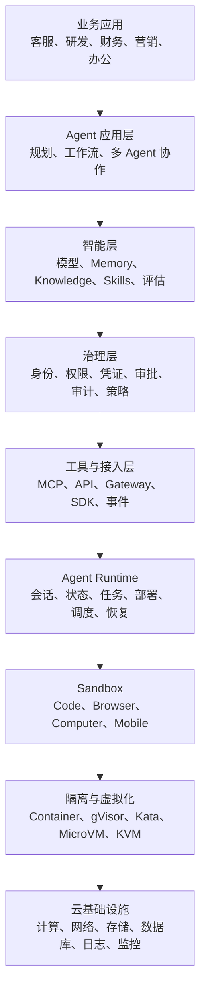

CubeSandbox 主要覆盖 Sandbox、隔离与虚拟化，并向上延伸到集群调度、状态、网络和安全代理。Agent Runtime 则继续覆盖会话、接入、企业治理与智能能力。

选择自建 CubeSandbox，意味着企业可以控制镜像、网络、KVM 节点和数据边界，适合已有 Agent 平台、需要私有部署或希望深度定制的团队；相应地，计算节点、Redis、存储、容量规划、监控、升级和故障处理也要自行负责。

选择托管 Agent Runtime，则把底层资源池、沙箱类型和平台运维交给云服务，并获得更完整的身份、凭证、观测和智能能力。大型企业也可以组合两者：普通任务使用托管运行时，敏感任务进入企业自建沙箱，再由统一的身份与 Agent Gateway 管理。

这组层级最终体现的是同一个工程目标：**用基础设施的确定性，收敛 Agent 行为的不确定性。**

模型可能改变计划，代码可能失败，外部内容可能恶意，但计算边界、权限、网络、凭证、状态恢复和审计规则必须是确定的。CubeSandbox 不是 Agent 的大脑，而是数字员工的电脑、安全工位和机房管理系统；Agent Runtime 则进一步成为管理数字员工整个工作过程的企业 IT 平台。
