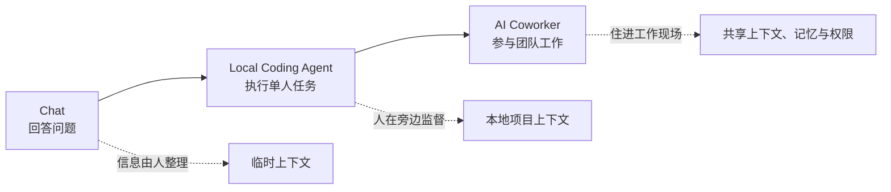

## 核心

**Claude Tag 的关键并不是把聊天机器人塞进 Slack，而是让 AI 进入团队共同工作的上下文，拥有共享身份、持续记忆、主动性和异步执行能力。控制点上移（人不再逐步操作 AI，而是交付目标、权限和验收标准）之后，AI 才可能从个人提效工具变成可被组织调度的数字同事。**

本文重写自海外独角兽 Celia 的文章[《Claude Tag 可能是一个 10x Claude Code 级别的产品》](https://mp.weixin.qq.com/s/DfQFOgOZxhReNiXbYG8ybA)，原文发表于 2026 年 8 月 10 日。文章对 Claude Tag 的产品形态、Anthropic 内部用法、商业空间和落地障碍做了系统分析；下文在保留主线的同时，结合 Anthropic 与 METR 的公开资料区分已确认能力、评测结论和市场推演。

1. Table of Contents, ordered
{:toc}

## Claude Tag 不是又一个 Slack 机器人

传统聊天产品的基本单元是一次个人对话。用户先收集背景、整理问题，再把压缩后的上下文交给模型；模型回答或执行一次任务，工作随会话结束。即使 Claude Code 已经能读代码、改文件和运行测试，它主要仍是一个由单人发起、在本地同步协作的 Agent。

Claude Tag 改变的是 AI 与组织的连接方式。按照 [Anthropic 的产品说明](https://www.anthropic.com/news/introducing-claude-tag?invite=1)，管理员可以让 Claude 进入指定 Slack 频道，并授权它访问代码库、数据和业务工具。频道成员只需 `@Claude` 分派任务，Claude 就会拆解步骤、调用工具并在原线程返回结果。

这里发生了三组同时进行的迁移：

| 维度 | Chat | Local Coding Agent | Claude Tag 类 AI Coworker |
|---|---|---|---|
| 协作关系 | 一个人与一个模型 | 一个人与一个执行型 Agent | 多人共享同一个 Agent |
| 触发方式 | 人提问，AI 回答 | 人启动任务并持续监督 | AI 可主动发现问题和跟进 |
| 时间形态 | 同步、单轮或短会话 | 同步、分钟到小时 | 异步、可计划后续任务 |
| 上下文来源 | 用户临时提供 | 本地代码、文件和会话 | 频道、组织记忆与已授权工具 |
| 责任范围 | 生成信息 | 完成一个边界清楚的任务 | 持续追踪目标并向团队交付 |

Anthropic 披露，其产品团队约 **65% 的代码已经由内部版 Claude Tag 创建**。这至少证明了该形态在 Anthropic 自己的工作环境中已经达到高频使用，而不是停留在概念演示；但它仍是厂商自报数据，不能直接外推为普通企业也能获得相同产出。

## 四种能力让 AI 具备“同事感”

Claude Tag 之所以更像同事，不是因为回答语气更拟人，而是因为协作所需的四块基础设施被放进了同一个产品闭环。

### 共享身份让协作从单人变成多人

同一频道的成员面对的是同一个 Claude。每个人都能看到它正在做什么、补充信息、纠正方向或接续前一个人的任务。结果不再被困在某个人的私聊窗口里，任务的来龙去脉也不必经过一次人工转述。

这种多人模式还有一个组织含义：AI 的工作第一次变得像公共流程。谁提出任务、谁修改要求、Claude 调用了什么工具、最后产生了哪个提交，都可以被团队共同观察和审计。

### 持续记忆减少每次任务的冷启动

一个真正的同事不会每天重新询问项目名称、团队约定和上周的决策。Claude Tag 会从所在频道积累相关背景，并在被授权时复用更大范围的组织信息。

Anthropic 的[帮助文档](https://support.claude.com/en/articles/15594475-what-is-claude-tag)显示，记忆与权限按组织、工作区和频道边界管理：管理员可以查看、修改和删除记忆，敏感工具可限制在私有频道，不同业务身份也可以彼此隔离。这比“模型记住所有公司信息”更准确——**有价值的企业记忆必须同时满足可用、可见、可撤销和可审计。**

### 主动性把“知道何时要做”也交给 AI

Chat 和 Claude Code 都依赖人先意识到任务存在。Claude Tag 的 ambient behavior（环境感知行为，即 AI 持续观察获准访问的工作流，并在需要时主动介入）则允许它发现沉默的线程、遗漏的边界条件、重复出现的客户问题或异常指标，再提醒相关人员或主动接手。

这类能力最适合四种工作：协作密度高、依赖大量上下文、需要及时响应、任务碎片化且无人愿意认领。客服工单分流、线上故障初步排查、数据查询、跨频道信息筛选和项目跟进，往往比一个完全封闭的宏大任务更容易先产生价值。

### 异步执行让任务脱离人的在线时间

Claude Tag 可以在云端继续执行，并为自己安排后续检查。例如，它可以先修改代码并启动实验，等数据积累后再次检查指标，再把需要人审批的节点发回频道。人负责目标、授权和关键决策，Agent 负责中间的等待、唤醒与衔接。

原文用 METR 的“时间跨度”评测支持长程 Agent 已经成熟的判断，但这里需要严格区分概念。METR 明确说明，**50% time horizon 不是模型实际连续运行了多少小时，而是它有 50% 概率完成、且人类专家需要相应时长才能完成的任务难度**。[METR 2026 年风险报告](https://metr.org/blog/2026-05-19-frontier-risk-report/)把最强内部模型的估计放在 16 至 20 小时附近，同时也强调长任务样本很少、评测接近饱和，且任务主要来自软件工程、机器学习和网络安全领域。[METR 对指标局限的解释](https://metr.org/notes/2026-01-22-time-horizon-limitations/)也指出，高风险工作需要的可靠性远高于 50%，不能把该指标直接等同于岗位自动化。

## 最有价值的不是替人打字，而是连接组织状态

Claude Tag 的短期角色更接近初级工程师、运营或行政：处理定义相对明确、重复但上下文繁杂的执行工作。随着记忆和主动性增强，它的价值会沿三层逐步展开。

第一层是**上下文入口**。AI 不再等人把资料整理成提示词，而是住进产生原始信息的频道和工具里，直接看到决策、反馈与进度的变化。

第二层是**数字员工**。AI 能持续维护待办、学习团队偏好、安排后续动作，并在权限范围内对一个可验收的结果负责。设计负责人长期留下的评审意见，可以逐渐成为 Agent 判断设计稿的依据；增长团队反复执行的数据分析、实验和监控，也可以被串成闭环。

第三层是**组织操作系统**。人类团队擅长分工，却很难实时合并认知。会议、文档和周报都在尝试同步信息，但带宽有限，还会丢失大量隐性知识。一个并行参与多个工作流、又能在权限边界内汇总经验的 Agent，有机会把分散决策连接成共享状态。

这也是 Claude Tag 比“自动生成更多内容”更重要的地方：它可能沉淀的不只是文档，而是组织正在运行的任务、依赖、承诺、等待条件和未完成决策。更换系统时，需要迁移的也不再只是一份聊天记录，而是一批尚在执行的工作状态。

## 真正的落地瓶颈是经济性与治理

产品形态成立，不等于它已经适合大规模部署。原文把成本和安全列为两大卡点，这个判断比“数字员工将立即替代白领”更值得重视。

### 多人、长程和多工具会共同推高成本

频道 Agent 每次执行都可能读取大量共享上下文，还要在众多 Connector（连接器，即通往 GitHub、Notion、数据仓库等系统的接口）中选择工具。多人异步接续任务时，上下文前缀不断变化，缓存也更难复用。再叠加长期任务的重复唤醒、失败重试和主动巡检，Token 消耗不再只由人类提问频率决定。

Claude Tag 采用按用量计费，频道任务由组织承担，私聊则计入个人 Claude 账户。官方已经提供组织总额、单频道上限、阈值提醒和用量分析，但这些只能防止账单失控，不能自动证明投入产出比。企业仍需要从高价值、可度量的流程开始，比较一次完整交付的 Agent 成本与人工成本，而不是只看单次模型价格。

### 权限不是开关，而是一套持续治理系统

为了主动完成工作，Agent 需要读取公司上下文、调用外部系统并代表组织执行动作；权限太少没有价值，权限太大又会放大误操作、提示词注入和数据泄露风险。

因此，生产部署至少需要：

- 按组织、工作区和频道划分身份与数据边界；
- 对写代码、发消息、改数据等高影响动作设置审批；
- 记录定时任务、网络调用和外部系统中的操作归属；
- 允许管理员检查、修正和删除长期记忆；
- 为不同频道配置预算上限和异常告警；
- 设计停用、迁移和事故恢复流程。

Anthropic 的文档已经提供权限分层、审计记录和记忆管理，但控制措施并不等于绝对安全。尤其在受监管企业里，“大多数时候不会出错”远远不够，剩余的小概率失败才决定 Agent 能获得多大权限。

## “10x Claude Code”是一种方向判断，不是已兑现结论

原文认为 Claude Tag 可能对应比 Coding Agent 大一个数量级的市场：编程只是白领任务的一部分，而团队协作、运营、销售、法务、财务和管理拥有更大的任务总量。这个推理在方向上成立，但“10x”和万亿美元规模仍是市场假设，不是产品数据能够直接推出的结论。

Claude Tag 对 Anthropic 的战略价值主要来自三点：

1. 它降低了非开发者使用 Agent 的门槛，一个管理员配置后，成员在熟悉的频道里就能观察和学习用法；
2. 定时、长程和主动任务会形成持续用量，让 AI 预算有机会从软件工具费转向人力与业务流程预算；
3. 记忆、权限和未完成任务共同形成迁移成本，把短暂的模型领先转化为产品黏性。

原文进一步推测，真实企业轨迹会帮助闭源模型持续改进。这里也要保留数据边界：Anthropic 的[商业产品隐私说明](https://privacy.anthropic.com/en/articles/7996868-is-my-data-used-for-model-training)明确表示，默认不会使用商业客户的输入和输出训练模型；只有客户明确反馈或选择加入相关计划时，材料才可能用于训练。厂商仍能从匿名聚合用量中发现产品规律，但这与直接拿企业原始数据训练不是一回事。

最终的竞争也未必只属于模型公司。协作平台掌握工作入口，SaaS 厂商掌握垂直数据，Agent 创业公司能够跨模型优化工作流，模型厂商则在能力、推理成本和原生运行时上占优。谁能把**上下文、身份、权限、执行和审计**组合成可信闭环，谁才更可能掌握 AI Coworker 的控制层。

## 评价

### 写得好的地方

原文最有价值之处，是没有把 Claude Tag 当作一个孤立功能，而是用“单人到多人、被动到主动、同步到异步”解释产品范式变化。这条分析框架能够把共享记忆、长期任务、数字分身、组织操作系统和商业模式放进同一条因果链，也准确抓住了成本与权限才是企业落地的关键约束。

文章还使用 Anthropic 内部工作场景贯穿全文，使“AI Coworker”不只是抽象口号：从查数据、修 Bug 到跟进跨频道决策，再到对留存实验持续负责，读者能够看到控制点怎样从亲自执行转向目标与治理。

### 可以改进的地方

原文把已公开事实、从业者访谈、个人试用感受和行业推演放在一起，部分结论的证据等级不够清楚。例如，“10x Claude Code”、万亿美元市场、特定模型才能保证权限隔离、某些员工 90% 的工作由 Tag 完成，以及第三方产品的收入数据，都需要更明确的一手来源或标注为估算。

对 METR 指标的使用也容易让读者把“相当于人类专家 16 小时的任务”理解成“Agent 可以可靠地连续自主工作 16 小时”。该指标只有 50% 成功率，领域有限且误差较大，不能直接证明通用白领岗位已经可被替代。若把这些边界前置，并进一步区分官方已经实现的能力、Anthropic 内部特例与未来商业假设，文章的说服力会更强。
