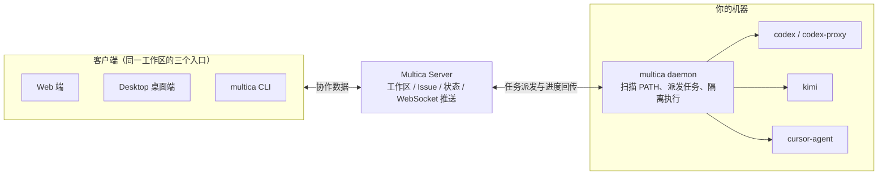
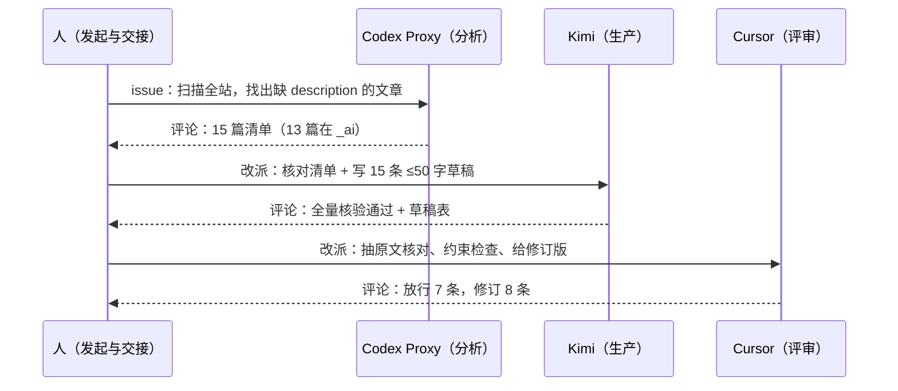

1. Table of Contents, ordered
{:toc}

一台开发机上同时装着 Codex CLI、Kimi CLI、Cursor CLI 已经很常见了。单个用起来都很顺，但任务一多，问题就从"agent 能不能写代码"变成"agent 的工作能不能被管理"：谁在做哪个任务、做完没有、失败了原因是什么、能不能让另一个 agent 复查一遍结果。每个 CLI 一个终端窗口，进度散落各处，分工和交接全靠人脑。

Multica 想解决的就是这一层。本文记录一次完整实验：把本机三个 agent 接入 Multica，跑通"分析 → 生产 → 评审"三棒流水线，踩平网络代理这个最大的坑，并验证几种自动编排方式。

## Multica：agent 之上的管理层

[Multica](https://github.com/multica-ai/multica) 是一个开源的 Managed Agents 平台。它不自己写代码，而是把已有的 coding agent 当成"团队成员"来管理：agent 有身份、能被分配 Issue、能写评论汇报进度，干活用的还是你本机的 CLI 登录态和模型额度。

架构分两半：



- **Server**（官方云端或自托管）管协作数据：workspace、project、issue、agent 身份、任务状态；
- **daemon** 跑在干活机器上，扫描 PATH 里已安装的 agent CLI，从 server 领任务、调 CLI 执行、回传进度；
- **CLI 和 Desktop 是平级客户端**，连同一个 workspace，数据完全互通——CLI 创建的项目在桌面端可见，桌面端建的 agent 在 CLI 里也能查到。

安装一行搞定：`brew install multica-ai/tap/multica`，然后 `multica setup` 完成浏览器登录并启动 daemon。唯一前提是至少一个 agent CLI 已安装并登录——Multica 驱动它们，但不提供它们的账号。

## 把本机 agent 接进来：runtime 与自定义 profile

daemon 启动后会自动检测 PATH 上的已知 CLI（`claude`、`codex`、`cursor-agent`、`kimi`、`gemini` 等），每个检测到的 CLI 成为一个 **runtime**。`multica runtime list` 可以看到它们逐个上线。

但自动检测解决不了所有场景。比如本机有一个特殊需求：**Codex 的所有请求必须强制走代理**（直连不通），做法是写一个包装命令 `codex-proxy`——先检查代理端口存活，注入 `HTTP_PROXY` 等环境变量，代理不可用就拒绝启动，最后 `exec codex "$@"`。这种自定义命令用 runtime profile 注册：

```bash
multica runtime profile create \
  --display-name "Codex Proxy" \
  --command-name codex-proxy \
  --protocol-family codex   # 复用 codex 的协议，告诉 Multica 怎么驱动它
multica daemon restart       # 重新检测后新 runtime 上线
```

runtime 就绪后创建 agent：`multica agent create --name "Codex Proxy" --runtime-id <id>`。agent 是 workspace 里的"团队成员"身份，绑定一个 runtime，之后就可以被指派任务、@mention、评论。还可以用 `multica agent avatar <id> --file icon.png` 给它们换上官方图标，看板上一眼分清谁是谁。

## 任务怎么跑：repo、project、issue

Multica 的概念层级是 **Workspace → Project → Issue**，仓库是挂在旁边的资源：

- **repo** 按 git URL 注册进工作区：`multica repo add git@github.com:user/repo.git`；
- **project** 是目标容器，创建时用 `--repo <url>` 关联仓库（前后端项目可以挂多个）；
- **issue** 是任务单元，创建时指定 `--project` 和 `--assignee`。

有一个机制必须提前知道：**agent 不在你本地的代码目录里干活**。daemon 为每个任务在 `~/multica_workspaces/` 下用 git worktree 开一份隔离副本，agent 在里面读写，互不干扰。好处是安全、可并行；代价是**每个 agent 首次接任务都要从远端克隆仓库**——这一点在后面会变成全场最大的坑。

## 实战一：一次跑了 55 分钟的分析任务

第一个实验是只读任务：统计本博客各集合的文章分布、Top 10 tags、近半年更新频率，结果发评论。派给 Codex Proxy 后，daemon 约 40 秒就派发了任务，9 分钟后一份带三个统计表格的报告出现在评论里：全站 335 篇文章，`_posts` 占 63.6%，高频 tag 以 `java`、`elasticsearch`、`docker` 为首，近半年增量明显转向 AI 与 Homelab 方向。报告质量本身没问题。

问题出在接力环节。按一些教程的说法，在评论里 `@Kimi` 就能让 Kimi 接手 review，但实际发生的是：**@mention 并没有改派任务，只是把当前 assignee（Codex Proxy）唤醒了**。它复查了自己的报告——倒也抓到自己两处计数错误（漏算了跨集合移动文章的提交），但这不是想要的"独立交叉验证"。正确的接力姿势是显式改派：

```bash
multica issue comment add <issue-id> --content "交接说明……"
multica issue assign <issue-id> --to Kimi
```

改派后 Kimi 确实跑起来了，但这次执行花了 **37 分钟**。拆三次执行的耗时看：

| 执行 | 总耗时 | 实际干活动 |
|------|--------|-----------|
| Codex Proxy 主任务 | ~9.5 分钟 | 含 daemon 首次克隆仓库 |
| Codex Proxy 被评论唤醒自审查 | ~5.5 分钟 | 纯分析 |
| Kimi 独立复核 | **~37 分钟** | **约 30 分钟在 git clone** |

模型推理只要几分钟，慢的是别的东西。

## 最大的坑：agent 流量不走系统代理

盯着 Kimi 的执行消息流（`multica issue run-messages <run-id>`）看到了全过程：它先等 daemon 的仓库缓存，超时、重试，最后自己重新完整克隆——博客仓库带图片资源约 75MB，而这台机器**直连 GitHub 的 SSH 只有约 90KB/s**。

根因是 macOS 上 daemon 和 agent 进程不继承系统代理设置，git、curl、包管理器全部裸连。而本机网络环境下直连 GitHub 约等于不通。修复分两层：

**机器层，让 git 走代理**（只影响 github.com，公司内网仓库不受影响）：

```bash
# ~/.ssh/config 追加
Host github.com
  ProxyCommand nc -X connect -x 127.0.0.1:10080 %h %p

# HTTPS 克隆也覆盖
git config --global http.https://github.com.proxy http://127.0.0.1:10080
```

**经验层，把教训沉淀成 Skill**。Multica 的 Skill 机制可以把经验挂载到 agent 身上，每次领任务自动携带。于是把"本机默认不走系统代理；访问 GitHub、npm、pip 等境外资源前先 `export https_proxy=...`；请求 10 秒无响应立即切代理重试；代理不可用时报告而不是静默直连"写成一份《本机代理使用指南》，用 `multica skill create` 创建、`multica agent skills add` 挂到所有 agent。这样即使将来换了没配代理的命令或新的境外资源，agent 自己知道该怎么处理。

修复效果立竿见影：第二轮实验中三个 agent 各自克隆同一个仓库，没有任何一棒再卡在传输上。

## 实战二：8 分钟的三棒流水线

第二个实验设计了一个更能体现分工的任务：博客有 15 篇文章的 front matter 缺 `description` 字段（影响 SEO 和 feed 摘要），让三个 agent 接力补齐——



| 棒次 | Agent | 角色 | 耗时 | 产出 |
|------|-------|------|------|------|
| 第一棒 | Codex Proxy | 数据分析 | ~2.5 分钟 | 扫描 335 篇，定位 15 篇目标文章 |
| 第二棒 | Kimi | 内容生产 | ~3.5 分钟 | 全量核验清单，抽样 60 篇对齐风格后写出 15 条草稿 |
| 第三棒 | Cursor | 质量终审 | ~2 分钟 | 放行 7 条，修订 8 条 |

全程约 8 分钟，对比第一次实验的 55 分钟，代理修复的价值直接体现在数字上。

第三棒的评审质量超出预期。Cursor 真的打开原文抽查，抓到两类问题：

- **一处事实性错误**：一篇《中国近代史》读书笔记的草稿写了"甲午变法"，Cursor 核对正文后发现文章写的是"甲午战争"与维新变法——历史事件名称用错，属于典型的"望题生义"；
- **7 条超出 50 字约束**（55–61 字），逐条给出压缩后的修订版和字数对照。

这正是多 agent 流水线最核心的价值：**生产 agent 写得再流畅，换一个持有独立上下文的 agent 拿原文核对，事实错误和约束违规才浮得出来**。15 条终审成品随后被一次性写入对应文章的 front matter，随本文一起发布。

## 不想盯梢：提前编排的三种方式

上面的接力是人工驱动的：每棒完成后手动评论交接、改派下一个 agent。演示和精细控制时这样很好，但日常批量任务不可能盯着每一棒。Multica 提供三种提前编排的方式：

**Staged 子 Issue（阶段屏障）**——最贴近"第一棒完成第二棒自动开搞"。把大任务建成父 issue，各棒建成带 `--stage` 序号的子 issue 并各自指派 agent；同一阶段的子 issue 全部完成后，下一阶段才会被唤醒：

```bash
multica issue create --title "补齐 description" --project <pid>   # 父 issue
multica issue create --parent <父id> --stage 1 --assignee "Codex Proxy" --title "扫描定位"
multica issue create --parent <父id> --stage 2 --assignee "Kimi"        --title "写草稿"
multica issue create --parent <父id> --stage 3 --assignee "Cursor"      --title "终审"
```

**Squad（小队）**——把几个 agent 编成有 leader 的小队（`multica squad create --leader <agent>`），issue 直接 assign 给 squad，由它们内部认领分工。适合"扔给一个团队，自己别管细节"的场景。

**Autopilot**——定时（cron）或 webhook 触发的自动化，把某个 agent 的固定动作（如"每晚巡检主分支""PR 打开时自动 review"）变成无需人工发起的长驻任务。它是单 agent 的周期触发器，不负责多棒编排，适合和前两种方式搭配。

## 结论与经验清单

Multica 的定位很清晰：Claude Code、Codex、Cursor 负责写代码，Multica 负责让它们以团队成员的方式进入工作流。经过这两轮实验，值得记住的几条：

- **接力用 `issue assign --to`，不要指望 @mention**——后者只会唤醒当前 assignee；
- **agent 的运行环境不继承系统代理**，境外资源访问必须先解决网络，否则任何编排都会被传输层拖垮；
- **踩过的坑立刻沉淀成 Skill** 挂到所有 agent，这是 Multica 区别于"多开几个终端"的核心机制；
- **多 agent 评审抓的是真错误**：独立上下文交叉验证能捞出事实性错误，不是形式主义的过场；
- 角色分工按"分析 → 生产 → 评审"拆，比按模型强弱分更可靠；
- 演练首选只读任务：agent 在隔离 worktree 里干活、成果走评论，仓库零风险。

顺带的数据结论：这个博客 335 篇文章里技术内容占绝对主体，近半年增量明显转向 AI 与 Homelab，阅读、人文方向合计不到 5%——偏科确实存在，不过那是另一篇文章的话题了。
