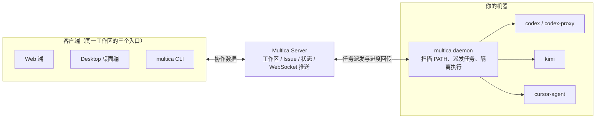
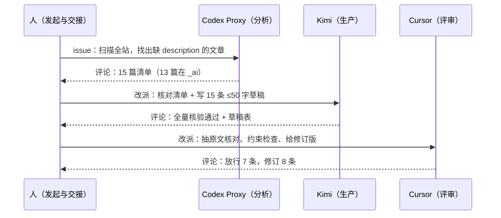
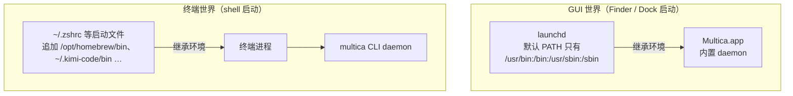
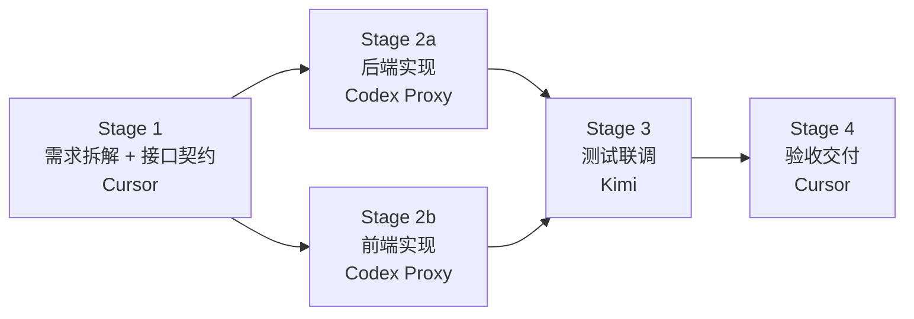

1. Table of Contents, ordered
{:toc}

一台开发机上同时装着 Codex CLI、Kimi CLI、Cursor CLI 已经很常见了。单个用起来都很顺，但任务一多，问题就从“agent 能不能写代码”变成“agent 的工作能不能被管理”：谁在做哪个任务、做完没有、失败了原因是什么、能不能让另一个 agent 复查一遍结果。每个 CLI 一个终端窗口，进度散落各处，分工和交接全靠人脑。

Multica 想解决的就是这一层。本文记录一次完整实验：把本机三个 agent 接入 Multica，从手动接力一路玩到 stage 全自动流水线，踩平两个大坑（网络代理、macOS GUI 环境），最终让一个“每日一句”前后端应用在九分钟内无人值守交付。

## Multica：agent 之上的管理层

[Multica](https://github.com/multica-ai/multica) 是一个开源的 Managed Agents 平台。它不自己写代码，而是把已有的 coding agent 当成“团队成员”来管理：agent 有身份、能被分配 Issue、能写评论汇报进度，干活用的还是你本机的 CLI 登录态和模型额度。

架构分两半：



- **Server**（官方云端或自托管）管协作数据：workspace、project、issue、agent 身份、任务状态；
- **daemon** 跑在干活机器上，扫描 PATH 里已安装的 agent CLI，从 server 领任务、调 CLI 执行、回传进度；
- **CLI 和 Desktop 是平级客户端**，连同一个 workspace，数据完全互通——CLI 创建的项目在桌面端可见，桌面端建的 agent 在 CLI 里也能查到。

这里有一个容易误解的点：**Desktop App 不是服务端，它不在本机“维护”工作区**。默认模式下 Server 是 Multica 官方云端（`api.multica.ai`），工作区、issue、评论、agent 配置全部存在云上，Desktop 和 CLI 都只是它的客户端；真正在你机器上运行的只有 daemon，代码也只在 daemon 管理的目录里执行。所以默认形态是“云端协作层 + 本地执行层”的混合——任务协调上云，代码不出本机。由此可以直接推出一个实用结论：**换电脑时云端数据（项目、issue、评论、agent 身份）登录即得，但执行层要在新机器重建**（装 CLI、登录、起 daemon），再把 agent 改绑到新机器的 runtime（`multica agent update <id> --runtime-id <新id>`）。如果想让协作数据也完全留在自己手里，可以用 Docker 把 Server 也自托管（官方 `install.sh --with-server`），个人使用云端版足够，团队有合规要求时再考虑。

安装一行搞定：`brew install multica-ai/tap/multica`，然后 `multica setup` 完成浏览器登录并启动 daemon。唯一前提是至少一个 agent CLI 已安装并登录——Multica 驱动它们，但不提供它们的账号。

## 接入：runtime、自定义 profile 与模型配置

daemon 启动后会自动检测 PATH 上的已知 CLI（`claude`、`codex`、`cursor-agent`、`kimi`、`gemini` 等），每个检测到的 CLI 成为一个 **runtime**。但自动检测解决不了所有场景。比如本机有一个特殊需求：**Codex 的所有请求必须强制走代理**（直连不通），做法是写一个包装命令 `codex-proxy`——先检查代理端口存活，注入 `HTTP_PROXY` 等环境变量，代理不可用就拒绝启动，最后 `exec codex "$@"`。这种自定义命令用 runtime profile 注册：

```bash
multica runtime profile create \
  --display-name "Codex Proxy" \
  --command-name codex-proxy \
  --protocol-family codex   # 复用 codex 的协议，告诉 Multica 怎么驱动它
multica daemon restart       # 重新检测后新 runtime 上线
```

runtime 就绪后创建 agent：`multica agent create --name "Codex Proxy" --runtime-id <id>`。agent 是 workspace 里的“团队成员”身份，绑定一个 runtime。可以用 `multica agent avatar <id> --file icon.png` 换上官方图标（直接提取各 App 的 icns 转 PNG 即可），看板上一眼分清谁是谁。

**agent 用哪个模型？** Multica 里 agent 的 `model` / `thinking_level` / `service_tier` 三个字段默认都是空，含义是“不覆盖，继承 CLI 自己的本地配置”。本机实测：Codex 走 `~/.codex/config.toml` 里的 `gpt-5.6-sol` + `xhigh`，Kimi 走 `~/.kimi-code/config.toml` 的 `kimi-code/k3`，Cursor 走 `~/.cursor/cli-config.json` 的 `auto`（Cursor 的自动路由）。想钉死就在 Multica 侧显式设置，它会优先于 CLI 本地配置：

```bash
multica agent update <agent-id> --model gpt-5.6-sol --thinking-level high
# Claude 系思考强度：low|medium|high|xhigh|max
# Codex 另有 --service-tier 对应 Fast(priority) 档
```

Cursor 系的思考强度表达方式特殊：**烘焙在模型名里**。`cursor-agent models` 列出的可选模型形如 `cursor-grok-4.6-low / -medium / -high / -xhigh`（另有 `-fast` 变体和 `composer-2.5`、`kimi-k3-low` 等），选模型就是选档位。

## 任务模型：workspace、project、issue 与两种仓库资源

概念层级是 **Workspace → Project → Issue**，仓库以“资源”的形式挂在项目上：

- **Workspace** 是隔离边界：自己的 agent、issue、权限，可以建多个互不干扰；
- **Project** 是目标容器（如“知识图谱 v2”），可挂多个仓库，issue 归属其下；
- **Issue** 是任务单元，创建时指定 `--project` 和 `--assignee`。

仓库资源有两种，差异远不止“要不要 clone”：

| | `github_repo`（远程资源） | `local_directory`（本地目录） |
|---|---|---|
| 数据源 | 远端仓库为准 | 本地真实目录为准 |
| 隔离 | 总是 worktree 隔离副本 | `in_place` 直接写真目录 / `worktree` 隔离 |
| 运行位置 | 任何 runtime | 绑死 `--daemon-id` 指定的那台机器 |
| 并发 | 天然并行 | **in_place 强制“一次一个任务”** |

远程资源模式下，daemon 在 `~/multica_workspaces/` 为每个任务开 git worktree 隔离副本，agent 永远碰不到你本地的检出——安全、可并行，但**每个 agent 首次接任务都要从远端克隆仓库**（后文的大坑），也看不到你本地未提交的改动。`local_directory` 的 `in_place` 则相反：agent 直接在你正在干活的目录里读写，看得见未提交内容，代价是绑定单机、且为了防冲突强制串行。

“in_place 串行”这一点做了对照实验证实：同一个 agent（并发设置为 6）同时派两个任务，挂在 in_place 资源上时一个接一个跑；挂在 github_repo 资源上时，两个任务的执行时间窗完全重叠——**真凶是资源的互斥，不是 agent 的并发上限**。想要本地目录也并行，用 `--execution-mode worktree`（要求挂载目录本身是 git 仓库），或者干脆用远程资源。

## 实战一：一次跑了 55 分钟的分析任务

第一个实验是只读任务：统计本博客各集合的文章分布、Top 10 tags、近半年更新频率，结果发评论。派给 Codex Proxy 后，daemon 约 40 秒就派发了任务，9 分钟后一份带三个统计表格的报告出现在评论里：全站 335 篇文章，`_posts` 占 63.6%，高频 tag 以 `java`、`elasticsearch`、`docker` 为首，近半年增量明显转向 AI 与 Homelab 方向。报告质量本身没问题。

问题出在接力环节。按一些教程的说法，在评论里 `@Kimi` 就能让 Kimi 接手 review，但实际发生的是：Kimi 毫无反应，反倒是当前 assignee（Codex Proxy）被这条评论唤醒，复查了自己的报告——倒也抓到自己两处计数错误（漏算了跨集合移动文章的提交），但这不是想要的“独立交叉验证”。

事后复盘才弄清楚机制：**@mention 本身是有效的接力方式，但必须是“真正的提及”**——在桌面端输入 `@` 会弹出 agent 选择器，选中后插入的是带 agent ID 的提及标记，系统据此派发任务（后来用桌面端 @Cursor 就成功触发了）；而通过 CLI 的 `--content "@Kimi ..."` 传入的只是纯文本，不会被解析成提及，评论只触发了“成员评论唤醒当前 assignee”的行为。CLI 下稳妥的接力姿势是显式改派：

```bash
multica issue comment add <issue-id> --content "交接说明……"
multica issue assign <issue-id> --to Kimi
```

改派后 Kimi 确实跑起来了，但这次执行花了 **37 分钟**。拆三次执行的耗时看：

| 执行 | 总耗时 | 实际干活动 |
|------|--------|-----------|
| Codex Proxy 主任务 | ~9.5 分钟 | 含 daemon 首次克隆仓库 |
| Codex Proxy 被评论唤醒自审查 | ~5.5 分钟 | 纯分析 |
| Kimi 独立复核 | **~37 分钟** | **约 30 分钟在 git clone** |

模型推理只要几分钟，慢的是别的东西。

## 最大的坑：agent 流量不走系统代理

盯着 Kimi 的执行消息流（`multica issue run-messages <run-id>`）看到了全过程：它先等 daemon 的仓库缓存，超时、重试，最后自己重新完整克隆——博客仓库带图片资源约 75MB，而这台机器**直连 GitHub 的 SSH 只有约 90KB/s**。

根因是 macOS 上 daemon 和 agent 进程不继承系统代理设置，git、curl、包管理器全部裸连。修复分两层：

**机器层，让 git 走代理**（只影响 github.com，公司内网仓库不受影响）：

```bash
# ~/.ssh/config 追加
Host github.com
  ProxyCommand nc -X connect -x 127.0.0.1:10080 %h %p

# HTTPS 克隆也覆盖
git config --global http.https://github.com.proxy http://127.0.0.1:10080
```

**经验层，把教训沉淀成 Skill**。Multica 的 Skill 机制可以把经验挂载到 agent 身上，每次领任务自动携带。于是把“本机默认不走系统代理；访问 GitHub、npm、pip 等境外资源前先 `export https_proxy=...`；请求 10 秒无响应立即切代理重试；代理不可用时报告而不是静默直连”写成一份《本机代理使用指南》，用 `multica skill create` 创建、`multica agent skills add` 挂到所有 agent。这样即使将来换了没配代理的命令或新的境外资源，agent 自己知道该怎么处理。

修复效果立竿见影：后续实验中三个 agent 各自克隆同一个仓库，没有任何一棒再卡在传输上。

## 实战二：8 分钟的三棒流水线

第二个实验设计了一个更能体现分工的任务：博客有 15 篇文章的 front matter 缺 `description` 字段（影响 SEO 和 feed 摘要），让三个 agent 接力补齐——



| 棒次 | Agent | 角色 | 耗时 | 产出 |
|------|-------|------|------|------|
| 第一棒 | Codex Proxy | 数据分析 | ~2.5 分钟 | 扫描 335 篇，定位 15 篇目标文章 |
| 第二棒 | Kimi | 内容生产 | ~3.5 分钟 | 全量核验清单，抽样 60 篇对齐风格后写出 15 条草稿 |
| 第三棒 | Cursor | 质量终审 | ~2 分钟 | 放行 7 条，修订 8 条 |

全程约 8 分钟，对比第一次实验的 55 分钟，代理修复的价值直接体现在数字上。

第三棒的评审质量超出预期。Cursor 真的打开原文抽查，抓到两类问题：

- **一处事实性错误**：一篇《中国近代史》读书笔记的草稿写了“甲午变法”，Cursor 核对正文后发现文章写的是“甲午战争”与维新变法——历史事件名称用错，属于典型的“望题生义”；
- **7 条超出 50 字约束**（55–61 字），逐条给出压缩后的修订版和字数对照。

这正是多 agent 流水线最核心的价值：**生产 agent 写得再流畅，换一个持有独立上下文的 agent 拿原文核对，事实错误和约束违规才浮得出来**。15 条终审成品随后被一次性写入对应文章的 front matter，随本文一起发布。

## 隐藏 boss：macOS 的 GUI 与终端是两个世界

实验过程中还解决了一个部署问题。Multica Desktop 自带一个内置 daemon，但启动后一个 agent CLI 都检测不到——不是检测能力缺失，而是 **macOS 上 GUI 应用和终端活在两套环境里**：



agent CLI 装在 `/opt/homebrew/bin`（brew）、`~/.kimi-code/bin` 这类目录，它们是由 shell 启动文件追加进 PATH 的；而 `.zshrc` 只在开终端时执行，从 Dock 点开的 App 由 launchd（macOS 的 1 号进程，所有 GUI 应用的祖先与环境源头）直接拉起，**永远不读 shell 配置**，PATH 只剩系统默认几个目录。daemon 沿 PATH 找 CLI，自然是睁眼瞎。

修复是给 launchd 本人补环境：

```bash
# 立即生效（只存在于 launchd 当前内存，重启即失效）
launchctl setenv PATH "/opt/homebrew/bin:$HOME/.kimi-code/bin:/usr/local/bin:/usr/bin:/bin:/usr/sbin:/sbin"
```

要重启后仍生效，靠 LaunchAgent 自举：`~/Library/LaunchAgents/` 下放一个 `RunAtLoad` 的 plist，内容就是登录时自动再执行一次 `launchctl setenv`——每次登录 launchd 都会先“给自己打一针”，之后启动的任何 GUI 应用继承的都是完整 PATH。另一个更土但同样有效的办法是把 CLI 软链进 `/usr/local/bin`（它在 GUI 默认 PATH 里）。

补好 PATH 重启 Desktop，它的内置 daemon 立刻探测到全部 CLI。接下来停掉 CLI 侧的 daemon 时发现一个好消息：**两个 daemon 共用 `~/.multica/daemon.id`，在 Server 眼里本来就是同一台电脑**——runtime ID 不变、agent 绑定不动、任务无缝由 Desktop 接管。此后 Desktop 开着就能派活（退出则执行层随之离线），命令行只在批量操作时用到。

## 实战三：stage 屏障全自动交付一个应用

前两轮的接力是人工驱动的：每棒完成后手动评论交接、改派下一个 agent。Multica 的 **staged 子 issue** 可以把编排提前写死——父 issue 下建带 `--stage` 序号的子 issue 并各自指派 agent，同一阶段全部完成后下一阶段自动唤醒：

```bash
multica issue create --title "总目标" --project <pid>                    # 父 issue
multica issue create --parent <父id> --stage 1 --assignee "Cursor"      --title "需求拆解"
multica issue create --parent <父id> --stage 2 --assignee "Codex Proxy" --title "后端实现"
multica issue create --parent <父id> --stage 2 --assignee "Codex Proxy" --title "前端实现"
multica issue create --parent <父id> --stage 3 --assignee "Kimi"        --title "测试联调"
multica issue create --parent <父id> --stage 4 --assignee "Cursor"      --title "验收交付"
```

用这个方式交付了一个真实的小应用“每日一句”（后端零依赖 Node.js 名言 API，前端纯静态页），代码放在本地目录资源里。分工刻意让写代码（Codex Proxy）、测试（Kimi）、验收（Cursor）三方互不重叠，避免自己验收自己：



**全程无人值守，约 9 分钟交付**：Cursor 先产出带 CORS 预检细节的 `API.md` 契约和需求文档；Codex Proxy 先后完成前后端实现并各自 git commit；Kimi 启动后端逐项过契约测试（7 项全过、零修复、保持进程运行）；最后 Cursor 独立验收——连发 20 次请求验证随机性、把 Kimi 的联调报告逐项复测证真，给出“验收通过，准予交付”。

这次实测到几条文档里看不到的 stage 语义：

- **放行信号是 `in_review`**：agent 把子 issue 推到“审核中”，屏障即视为完成并唤醒下一阶段，不需要人工点状态；
- **S2a/S2b 名义并发、实际串行**：当时资源还是 in_place 模式，目录互斥导致排队（切到 worktree 模式后同 agent 也能并行）；
- `local_directory` 有个隐藏约束：**同一 daemon 在每个项目里只能挂一个本地目录**，多仓库项目要挂公共父目录。

## 编排与人机分工：剩下的几块拼图

除了 stage 屏障，还有两种编排方式。**Squad（小队）**：把几个 agent 编成有 leader 的小队（`multica squad create --leader <agent>`），issue 直接 assign 给 squad，内部认领分工，适合“扔给一个团队不管细节”。**Autopilot**：cron 或 webhook 触发的长驻自动化（“每晚巡检主分支”“PR 打开自动 review”），是单 agent 的周期触发器，和前两种搭配使用。

另外还有一个更轻的入口：**直接和 workspace 里的 agent 聊天就能下编排指令**。Multica 给每个 agent 执行任务时都会注入可用的 multica CLI 命令清单（agent 工作目录里自动出现的 `AGENTS.md` 就是注入产物），所以对 agent 说“建一个四棒 stage 流水线，第一棒 Cursor 做设计……”它自己会把父子 issue 一套建出来。

最后是人机分工的边界。所有 agent 完成的任务都停在 **`in_review`（审核中）而不是 done——关单权被刻意留给人**，这是人机协作的质量关卡。但不必一个个点：

- 任务描述里写“完成标准：……并把状态改为 done”，agent 会自己关单；
- 批量收尾用 CLI：`multica issue status <id> done --no-start`；
- **父 issue 是纯组织节点**，没有人认领是正常现象，子任务全完成后手动关掉即可；也可以在创建时就 assign 给某个 agent 当“项目经理”汇报整体进度。

## 结论与经验清单

Multica 的定位很清晰：Claude Code、Codex、Cursor 负责写代码，Multica 负责让它们以团队成员的方式进入工作流。经过这三轮实验，值得记住的几条：

- **接力有两种有效方式：UI 里用选择器产生的 @mention，或 CLI 的 `issue assign --to`**——CLI 评论里手写 `@名字` 只是纯文本，不会派发，只会唤醒当前 assignee；
- **agent 的运行环境不继承系统代理**，境外资源访问必须先解决网络，否则任何编排都会被传输层拖垮（本次 55 分钟 vs 8 分钟的差距全在这里）；
- **Desktop 的 daemon 检测不到 CLI 是 macOS 双环境问题**，给 launchd 补 PATH（配 LaunchAgent 持久化）即可；同一台机器的两个 daemon 共享身份，切换执行层无成本；
- **in_place 资源会串行化任务**，要并行就用 worktree 模式或远程仓库资源；
- **踩过的坑立刻沉淀成 Skill** 挂到所有 agent，这是 Multica 区别于“多开几个终端”的核心机制；
- **多 agent 评审抓的是真错误**：独立上下文交叉验证能捞出事实性错误（“甲午变法”那种），不是形式主义过场；
- 角色分工按“分析 → 生产 → 评审”拆，验收独立成棒，比按模型强弱分更可靠；
- `in_review` 是人机关卡而非流程残缺：想全自动就在任务里写清“完成后自己关单”。

顺带的数据结论：这个博客 335 篇文章里技术内容占绝对主体，近半年增量明显转向 AI 与 Homelab，阅读、人文方向合计不到 5%——偏科确实存在，不过那是另一篇文章的话题了。
