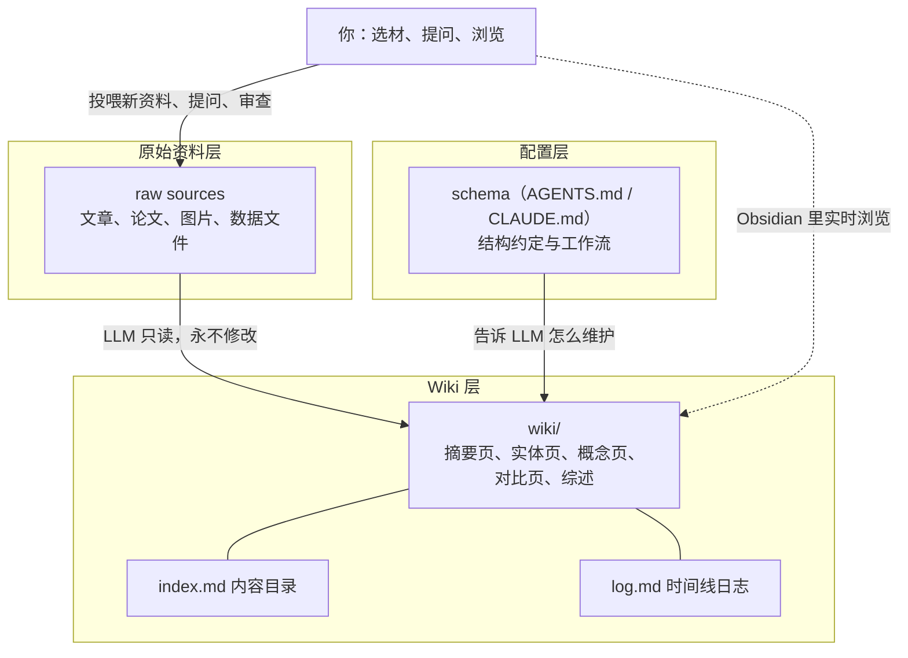

1. Table of Contents, ordered
{:toc}

## 核心

主流 RAG 模式的本质是“每次提问都从零重新发现知识”，而 Karpathy 提出的替代方案是让 LLM 增量构建并长期维护一个持久 wiki（一组结构化的、互相链接的 Markdown 页面）：新知识只“编译”一次，此后持续保鲜、不断增厚。这个模式之所以现在成立，是因为知识库最劝退人的部分——交叉引用、摘要更新、矛盾标注这些簿记工作（bookkeeping）——交给 LLM 后维护成本趋近于零。

Karpathy 把这层关系概括成一句非常形象的类比：**Obsidian 是 IDE，LLM 是程序员，wiki 是代码库。** 其中 Obsidian 是一款本地优先的 Markdown 笔记软件：笔记就是本地文件夹里的普通 `.md` 文件，靠双向链接把笔记织成网状结构（而不是传统的目录树），还有庞大的插件生态——LLM Agent 可以直接读写这个目录，所以它天然适合当人观察 wiki 的窗口。在这个模式里，人负责选材、探索和提问，LLM 负责所有的摘要、归档、交叉引用和一致性维护。

本文基于 [Andrej Karpathy 发布在 GitHub Gist 上的想法文档](https://gist.github.com/karpathy/442a6bf555914893e9891c11519de94f)整理重写。这份文档本身就是一个“写给 LLM Agent 看的 idea file”——它只描述模式，不给出具体实现，读者可以把它丢给自己的 Agent（Codex、Claude Code 等），由 Agent 协助把模式实例化成符合自己需求的系统。

## RAG 的天花板：每次提问都从零开始

大多数人用 LLM 处理文档的体验是这样的：上传一堆文件，提问时 LLM 检索相关片段，生成答案。NotebookLM、ChatGPT 文件上传和绝大多数 RAG 系统都是这个路子。

它能用，但有一个结构性缺陷：**没有积累。** 如果你问一个需要综合五篇文档才能回答的微妙问题，LLM 每次都得重新找到相关碎片、重新拼接。上一次提问中建立的洞察不会留下来，下一次还得从头再来。检索是有的，但知识没有沉淀。

Karpathy 的方案把检索层换成了一层**持续生长的中间产物**：LLM 不只是把新资料索引起来等以后检索，而是读完它、提取关键信息，并把它整合进已有的 wiki——更新实体页、修订主题摘要、标注新数据与旧结论矛盾的地方、强化或挑战正在演进的综述。**交叉引用已经在那了，矛盾已经被标记了，综述已经反映了你读过的所有东西。** 每收录一篇资料、每问一个问题，wiki 都变得更丰富一点。

这个模式适用的场景很广：

- **个人**：追踪自己的目标、健康、心理状态，把日记、文章、播客笔记归档成一个随时间增厚的“自我画像”；
- **研究**：围绕一个主题深挖数周乃至数月，读论文和报告，增量构建一个带有演进中论点的完整 wiki；
- **读书**：边读边归档每章内容，为人物、主题、情节线建立页面，读完时手里就有一本同人 wiki 式的伴读手册——类似 Tolkien Gateway 那种由社区多年共建的数千页互联百科，只不过维护者是 LLM；
- **团队**：由 LLM 维护的内部 wiki，喂入 Slack 讨论、会议纪要、项目文档、客户电话，wiki 之所以能保持最新，是因为没人愿意做的维护工作被 LLM 包了。

## 三层架构：原始资料、wiki、schema

整个系统由三层组成，职责划分非常干净：

**原始资料层（raw sources）** 是你精选的来源文档集合，是不可变的——LLM 只读不写。这是事实的唯一来源。

**wiki 层** 是一组完全由 LLM 生成和维护的 Markdown 文件：摘要、实体页、概念页、对比分析、总览和综述。LLM 全权拥有这一层：建页面、随新资料到来更新页面、维护交叉引用、保持一致性。你只负责读。

**schema 层** 是一份配置文档（Claude Code 下是 `CLAUDE.md`，Codex 下是 `AGENTS.md`），告诉 LLM wiki 的结构、约定，以及收录资料、回答问题、日常维护时该遵循的工作流。它是让整个系统成立的关键文件——**有了它，LLM 才是一个有纪律的 wiki 维护者，而不是一个泛泛的聊天机器人。** 这份文件由你和 LLM 在实践中共同演进。

## 三种操作：收录、查询、体检

围绕这三层，日常只有三种基本操作。

**收录（Ingest）。** 把新资料丢进 raw 目录，让 LLM 处理。一次典型的收录流程是：LLM 读原文，和你讨论关键收获，在 wiki 里写摘要页，更新索引，更新散落在各处的相关实体页和概念页，最后往日志里追加一条记录。一篇资料可能触动 10 到 15 个 wiki 页面——这正是人肉维护 wiki 会崩溃、而 LLM 毫无压力的地方。Karpathy 个人的偏好是一次收录一篇、全程参与：读摘要、检查更新、指导 LLM 该强调什么；但也可以低监督地批量收录。适合自己风格的流程要沉淀进 schema，让未来的会话有章可循。

**查询（Query）。** 针对 wiki 提问，LLM 检索相关页面、阅读、综合出带引用的答案。答案的形态随问题而变：一个 Markdown 页面、一张对比表、一套 Marp 幻灯片、一幅 matplotlib 图表都可以。这里有一个关键洞察：**好答案应该被回存进 wiki 成为新页面。** 你随口问出来的一次对比分析、一个意外发现的关联，都是有价值的知识，不应该消失在聊天记录里。这样一来，你的探索本身也在知识库里复利，而不只是收录的资料在复利。

**体检（Lint）。** 定期让 LLM 给 wiki 做健康检查：页面之间的矛盾、被新资料推翻的过时结论、没有入链的孤儿页面、被反复提及却没有自己页面的重要概念、缺失的交叉引用、可以用一次网络搜索补上的数据缺口。LLM 还很擅长反过来建议“接下来该问什么问题、该找什么资料”。这个操作保证 wiki 长大之后依然健康。

## 两个导航文件：index.md 与 log.md

随着 wiki 变大，两个特殊文件帮助 LLM（和你）导航：

**index.md 是面向内容的目录。** 每个页面一行：链接、一句话摘要、可选的日期或来源数等元数据，按实体、概念、来源等分类组织。每次收录都会更新它。回答问题时 LLM 先读索引定位相关页面，再钻进去细读。Karpathy 的经验是，这个朴素方案在中等规模（约 100 篇来源、数百个页面）下出人意料地好用，**完全不需要 embedding 向量检索那套 RAG 基础设施**。

**log.md 是面向时间的日志。** 只追加，记录收录、查询、体检都发生了什么。一个实用技巧：每条记录用统一前缀开头（如 `## [2026-04-02] ingest | Article Title`），日志就能用简单的 Unix 工具解析——`grep "^## \[" log.md | tail -5` 就能看到最近五条动态。它既是 wiki 演化的时间线，也帮助 LLM 了解“最近都干了什么”。

## 配套工具：Obsidian 生态与按需生长的 CLI

原文推荐了一套以 Obsidian 为中心的配套工具，每一项都是可选模块：

- **Obsidian Web Clipper**：浏览器插件，一键把网页文章转成 Markdown，快速充实原始资料库；
- **图片本地化**：把附件目录固定到 `raw/assets/`，再给“Download attachments for current file”绑一个快捷键，剪藏后一键把图片全部下载到本地，避免 URL 失效，也让 LLM 能直接看图。需要注意的是 LLM 没法一次性读带内嵌图片的 Markdown，变通做法是先读文本，再单独查看其中引用的图片补充上下文；
- **图谱视图（Graph view）**：观察 wiki 形态的最佳方式——哪些页面是枢纽、哪些是孤儿一目了然；
- **Marp**：Markdown 幻灯片格式，配合 Obsidian 插件可以直接从 wiki 内容生成演示文稿；
- **Dataview**：对页面 YAML frontmatter 跑查询的插件，配合 LLM 写入的标签、日期、来源数等元数据，可以动态生成表格和清单；
- **git**：wiki 本质就是一个 Markdown 文件的 git 仓库，版本历史、分支、协作全是免费的。

当 wiki 大到索引文件不够用时，可以给 LLM 配一个真正的搜索工具。原文提到 [qmd](https://github.com/tobi/qmd) 这个选择：本地运行的 Markdown 搜索引擎，混合 BM25 和向量检索加 LLM 重排，全部在设备上完成，同时提供 CLI 和 MCP server 两种接入方式。也可以更简单地让 LLM 帮你随手写一个朴素搜索脚本——工具按需生长，不必一步到位。

## 为什么这个模式成立

维护知识库最劝退的部分从来不是阅读和思考，而是**簿记**：更新交叉引用、保持摘要新鲜、标注新证据推翻了哪些旧结论、在几十个页面间维持一致性。人类放弃 wiki，是因为维护负担的增长速度超过价值的增长速度。而 LLM 不会厌倦，不会忘记更新某个交叉引用，一次操作就能顺手改 15 个文件。**wiki 得以保鲜，是因为保鲜的成本趋近于零。**

分工因此变得清晰：人负责精选来源、引导分析、提出好问题、思考这一切意味着什么；LLM 负责其余一切。

Karpathy 还把这个想法接回了一个更早的思想源头——Vannevar Bush 1945 年设想的 [Memex](https://en.wikipedia.org/wiki/Memex)：一个私人的、主动策展的知识库，文档之间的关联轨迹（associative trails）和文档本身一样有价值。Bush 的愿景其实比后来演变成的万维网更接近这个模式，他当年解决不了的唯一问题是“谁来维护”。现在，LLM 补上了这一块。

## 延伸：公共百科为何能存续，LLM 会带来什么转变

“维护成本是知识库的生死线”这个判断，放到维基百科、百度百科这类公共百科身上同样成立——它们也是一个极其复杂的维护工程，能存续下来确实靠万千网友的人肉操作，但“人肉”这个答案太粗糙。**人肉维护的 wiki 成千上万，绝大多数都死了，维基百科是极少数例外**，它靠的是一套让人肉簿记可持续的机制：

- **极端的参与漏斗**：几亿读者里只有极小比例编辑，核心维护者只有几万人。读者基数大到哪怕 0.01% 的人愿意干活也够用——普通团队 wiki 没有这个漏斗，维护负担压垮少数几个人就死了；
- **用规则收缩维护疆域**：可查证性（一切断言必须有来源）、关注度门槛（不够重要的主题不配拥有条目）、删除主义文化。这些规则看着官僚，实际作用是大幅缩小需要维护的范围，争议因此可控；
- **早已用机器人做簿记**：维基从来不是纯人肉——反破坏机器人秒级回退涂鸦，rambot 当年用人口普查数据批量生成了几万篇美国城镇条目，还有大量机器人在修死链、补分类、标过期内容。**最枯燥的那部分维护，维基早就自动化了；**
- **动机经济学**：声誉、使命感、社区身份。人不拿钱，但维护行为本身有回报。百度百科配方不同：用积分、等级这些物质/游戏化激励替代使命感，质量门槛放得更低，规模和速度上去了，可信度一直受质疑。

所以准确地说，公共百科的存续 = **人肉热情 × 规则收缩 × 早期自动化**，三者缺一都撑不到今天。这反过来印证了 Karpathy 的判断——维基百科只是把生死线用人海战术硬扛下来了。

LLM wiki 模式对它们的启示，我认为会发生在三个层面：

**簿记全面 LLM 化，人退到审核和裁决的位置。** 过期条目刷新、条目间矛盾检测、新事件初稿生成、讨论页争议摘要、跨语言版本同步——这些恰好对应个人 wiki 里的收录和体检操作。维基的破坏检测早已用机器学习，LLM 只是把自动化从“识别破坏”扩展到“主动维护”，分工和个人 wiki 一样：机器干活，人签字负责。

**但“信任来源”这个核心资产决定了它们不敢全自动。** 维基的价值不在于内容多，而在于每句话背后有可查证的来源和可见的共识过程；LLM 批量生成内容恰恰会稀释这个资产，幻觉和来源漂移是致命的。所以维基社区对 AI 生成内容一直高度警惕。合理预期是 **LLM 做助手不做作者**：生成维护清单、起草初稿、标注矛盾，最终落笔的必须是有署名的人类编辑。百度百科的信任包袱轻得多，大概率会更激进地全面 AI 化。

**最深的变化不在它们身上，而在它们之外：百科功能被化整为零。** 关注度门槛意味着海量主题永远不会有公共条目——你读的一本冷门书、你所在行业的细节、你自己的知识领域。LLM wiki 让**每个人都能拥有为自己定制的百科**，门槛之下的长尾知识第一次有了可维护的载体。未来可能是：公共百科继续做“共识层”和信任锚点（顺便还是 LLM 的训练语料），无数个人和团队 wiki 长在它下面，吸收它、链接它，但服务于自己的问题。百科从“一座人人朝拜的大图书馆”，变成“一个公共底座加无数个私人书房”——这正是 Bush 当年设想的私人路线，第一次变得可行。

## 延伸：这套模式照进一个真实博客项目

这套模式不只适用于 Obsidian。本站（一个 Jekyll 博客）就是一个现成的对照案例，而且映射关系相当清晰：**schema 层已经存在甚至更成熟**——`AGENTS.md` 就是那份“告诉 LLM 怎么维护”的配置文档，稳定的工作流还被进一步固化成了可复用的 skill（对话归档、文章总结、趋势报告），相当于给 LLM 维护者写了标准作业程序；git 历史天然承担了 `log.md` 的职责，tags/categories 和归档插件承担了基础索引。

真正的差距在于**页面是否“活着”**。博客文章是时间流：写完、发布、基本不再动，新认知只能发新文章；wiki 是实体和概念组成的图，页面会被持续更新、合并、互相链接，越老越厚。博客项目里其实已经有伪装成其他东西的 wiki 内容——比如 `AGENTS.md` 里那张树莓派代理服务表，端口、容器名、配置路径、排障要点，这就是一个活的事实页，只是恰好住在配置文档里。启发因此很具体：**需要持续保鲜的“当前状态”类知识，和一次性的“折腾实录”类文章，应该分开**——实录是原始资料层，状态页是 wiki 层。

照这个思路，本站实践了三个动作，对其他想落地的读者也有参考价值：

1. **主题枢纽页（hub pages）**：为高频主题建活页面，汇总相关文章链接、当前状态和排障入口——比如“树莓派 Homelab 全景”页把代理端口表、家庭影院管线和十几篇实录文章织在一起。这比一般推荐的全文 `index.md` 更有价值：归档页已经干了目录的活，枢纽页提供的是**上下文和判断**，是 wiki 化的入口。本站的 [Wiki 板块](/wiki/)就是这次实践的直接产物。
2. **Lint（体检）操作**：定期检查文章间的矛盾（同一事实在不同文章里不一致）、被现实推翻的过时结论（老方案文章有没有标注已被取代）、孤儿文章、tag 一致性。这是个人博客版本的质量保鲜机制，本站已把它固化为一个可定时执行的 skill。
3. **好答案回存**：对话中产生的新认知不只沉淀成新文章，还应回写进已有的活页面——比如代理方案变了，就该更新枢纽页的端口表，而不是只发一篇新实录。

这个对照也暴露了模式的一个隐含前提：**它天然适合“文件系统友好”的场景**。Jekyll 博客和 Obsidian 仓库一样是纯文本文件目录，LLM 可以自由读写；如果你的知识存在 Notion、语雀这类云端 SaaS 里，LLM 的维护就要隔着 API 做，摩擦大得多。Karpathy 选 Obsidian，本质上选的是“一切只是文件”这个属性。

## 评价

### 写得好的地方

这份文档最有价值的地方在于它精准地指出了 RAG 的结构性缺陷——**知识不积累**——并给出了一个概念上极其简单的替代：把每次查询时临时拼凑的工作，挪到每次收录时一次性做完。这个“编译一次、持续保鲜”的视角，把知识库从检索工程问题重新定义成了维护成本问题，而维护成本恰好是 LLM 最擅长压到零的那类成本。“Obsidian 是 IDE，LLM 是程序员，wiki 是代码库”的类比一句话讲清了人机分工，`index.md` 加统一前缀日志这类细节则体现了真实的实践经验，不是纸上谈兵。文档刻意保持抽象、不绑定具体实现，并明说自己是“给 Agent 看的 idea file”，这种写法本身就很符合它所倡导的工作方式。

### 可以改进的地方

文档对规模的讨论偏乐观。“索引方案在约 100 篇来源、数百页规模下出人意料地好用”是唯一的量化依据，再往上怎么办只一句“配个搜索引擎”带过，但真正的难点——比如单次收录要改 10 到 15 个页面时的上下文窗口压力、LLM 改写旧页面时悄悄引入失真、综述页在多来源长期演进后观点漂移——都没有展开。另外，整个模式依赖人对 LLM 写入质量的持续审查，但文档没有讨论审查本身的成本：当 wiki 大到人读不过来所有更新时，“LLM 全权拥有 wiki 层”的信任前提如何维持，是一个被回避的问题。对团队场景（多来源并发写入、人工 review 流程）也只是点到为止，距离可用方案还有不少空白。
