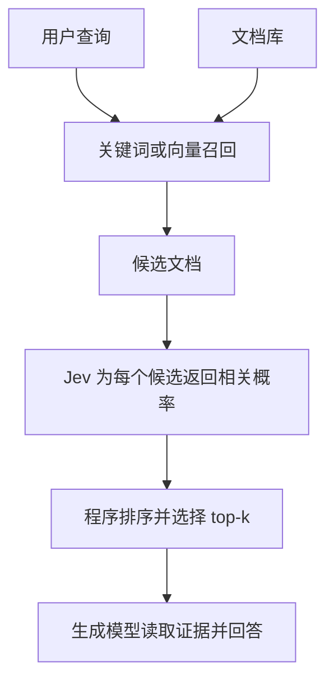

## 核心

**大模型以生成人可阅读的内容为主要设计重心，Jev 则把自然语言理解变成程序可直接消费的判断。** 它要让软件像调用函数一样调用语义理解；结构化、可组合、快和便宜，都是这个定位的要求。

依据 [TypeSafe 官方文档](https://docs.typesafe.ai/introduction)、极客公园[《Jev，让全球程序员玩疯了》](https://www.geekpark.net/news/370758)和 Zilliz[《实验对比｜爆火的 Jev 能替代 Rerank 模型吗？》](https://mp.weixin.qq.com/s/w0_ylE1XJjcuIsJgpRMUvQ)，信息核对至 **2026 年 9 月 22 日**。

1. Table of Contents, ordered
{:toc}

## 一、Jev 是什么，为什么火

Jev 是 TypeSafe 推出的判断模型，属于厂商定义的 **System One** 类别。它专注于范围明确的语义任务：把工单分给哪个部门、文档是否相关、工具执行是否成功。软件需要的是判断结果，通常不需要模型再写一段解释。[设计理念](https://docs.typesafe.ai/concepts/system-one)

Jev 于 2026 年 9 月 15 日发布早期访问版本。Vercel 报告，接入 AI Gateway 后的首个 24 小时，近 **13% 的付费团队**使用了它，首日采用团队数超过此前任何模型发布的两倍；这是该平台含免费体验活动期间的数据。[发布公告](https://typesafe.ai/blog/introducing-system-one-models-and-jev)、[Vercel 数据](https://vercel.com/blog/ai-gateway-jev-model-launch)

## 二、State、三个原语与完整调用

一次请求包含 `model`、`state`、`questions`，返回 `answers`。**State 是材料，Questions 是问题，Primitive 是题型，Answers 是结果。**

### State 与 Questions

[State](https://docs.typesafe.ai/concepts/state)支持文本、JSON 对象或数组，例如客户消息、订单信息，或查询与候选文档。所需历史记录由程序显式传入。

每道 Question 有 `type` 和 `instructions`。Choice、Score 还需要 `criteria`；Noul 可选填 `true`、`false` 的判定标准。问题 ID 只供程序索引，**不参与模型判断**；任务必须写在 `instructions` 中。[请求协议](https://docs.typesafe.ai/api)

同一请求内，各题读取共同的 State，彼此看不到答案。因此可以同时判断工单部门和紧迫性；需要先查订单再判断退款时，程序应查单后发起下一次请求。`instructions` 和选项描述也支持结构化对象，可放入规则与正反例。[进阶输入](https://docs.typesafe.ai/primitives/advanced)

### 三个原语：选择题、评分题、判断题

| 原语 | 开发者定义 | 模型返回 | 典型用途 |
|---|---|---|---|
| **Choice：选择题** | 类别及含义 | 最高概率选项、各项概率、`confidence` | 分类、路由、选工具 |
| **Score：评分题** | 有序等级描述 | 等级下标的概率加权平均、分布、`confidence` | 衡量程度、排序 |
| **Noul：判断题** | 是／否命题 | 回答“是”的概率 | 判断、过滤、排序 |

[Choice](https://docs.typesafe.ai/primitives/choice)的类别没有高低关系，例如“技术、账务、其他”。[Noul](https://docs.typesafe.ai/primitives/noul)返回 `0～1`，例如“是否紧急”的概率为 `0.98`；`0.5` 表示不确定，**不表示紧急程度中等**。Noul 没有额外的 `confidence`。

### 怎么调，返回什么，程序怎么用

从 [TypeSafe 控制台](https://console.typesafe.ai/)取得 API Key，写入环境变量 `TYPESAFE_API_KEY`。下面的 JavaScript 可保存为 `.mjs`，在 Node.js 18+ 运行：

```javascript
// 统一封装 HTTP 调用，返回 API 的结构化响应。
async function askJev(state, questions) {
  const response = await fetch("https://api.typesafe.ai/v1/systemone", {
    method: "POST",
    headers: {
      Authorization: `Bearer ${process.env.TYPESAFE_API_KEY}`,
      "Content-Type": "application/json",
    },
    body: JSON.stringify({
      model: "jev-1.13.0",
      state,
      questions,
    }),
  });

  if (!response.ok) {
    throw new Error(`TypeSafe HTTP ${response.status}`);
  }
  return response.json();
}

const result = await askJev(
  {
    ticket: {
      message: "Safari 无法导出报表，换 Chrome 能导出。今天要交材料，请尽快帮忙。",
      product: "报表系统",
    },
  },
  {
    // Choice：程序要知道进入哪个处理队列。
    department: {
      type: "choice",
      instructions: "根据 `ticket.message` 判断应由哪个部门处理。",
      criteria: {
        technical: "产品故障或技术使用问题",
        billing: "付款、扣费或发票问题",
        other: "不属于技术或账务的问题",
      },
    },
    // Score：按有序的三个等级评估功能受影响的程度。
    severity: {
      type: "score",
      instructions: "根据 `ticket.message` 评估故障对功能的影响。",
      criteria: [
        "仅外观异常，功能不受影响",
        "功能受影响，但存在可用的替代办法",
        "核心功能无法使用，且没有可用的替代办法",
      ],
    },
    // Noul：判断消息是否明确表达时限或紧迫性。
    urgent: {
      type: "noul",
      instructions: "`ticket.message` 是否表达需要尽快处理的紧迫性？",
    },
  },
);
```

以下是**教学示意响应，未经实测**，省略了 token 用量字段 `usage`：

```json
{
  "model": "jev-1.13.0",
  "answers": {
    "department": {
      "type": "choice",
      "choice": "technical",
      "probabilities": {
        "technical": 1.0,
        "billing": 0.0,
        "other": 0.0
      },
      "confidence": 1.0
    },
    "severity": {
      "type": "score",
      "score": 1.0,
      "legend": {
        "0": "仅外观异常，功能不受影响",
        "1": "功能受影响，但存在可用的替代办法",
        "2": "核心功能无法使用，且没有可用的替代办法"
      },
      "probabilities": {"0": 0.0, "1": 1.0, "2": 0.0},
      "confidence": 1.0
    },
    "urgent": {
      "type": "noul",
      "noul": 0.98
    }
  }
}
```

程序直接读取字段，安排处理队列、严重程度和加急标记：

```javascript
const answers = result.answers;

// 类别名直接映射到程序中的队列。
const queues = {
  technical: "technical-support",
  billing: "billing-support",
  other: "general-support",
};

const plan = {
  queue: queues[answers.department.choice],
  // 本例 Score 有三档，除以 2 后得到 0～1 范围的程度值。
  severity: answers.severity.score / 2,
  // 0.9 仅为演示阈值，生产环境需要用业务样本验证。
  expedite: answers.urgent.noul >= 0.9,
};

console.log(plan);
// 对上面的示意响应：
// { queue: "technical-support", severity: 0.5, expedite: true }
```

也可使用官方 [Python SDK](https://docs.typesafe.ai/sdk/python) 或 [JavaScript SDK](https://docs.typesafe.ai/sdk/javascript)。

### Score：先估计各档概率，再计算等级位置

以相关经验为例，定义五档，并假设模型返回以下概率：

| 下标 | 等级含义 | 概率 |
|---|---|---:|
| 0 | 无相关经历 | 0 |
| 1 | 学习过，尚未实践 | 0 |
| 2 | 做过练习或小型项目 | 0.1 |
| 3 | 在生产项目中独立完成过相关工作 | 0.6 |
| 4 | 在多个生产项目中承担过方案设计与落地 | 0.3 |

[Score](https://docs.typesafe.ai/primitives/score)计算的是：

$$
s = \sum_{i=0}^{K-1} i p_i
  = 2\times0.1 + 3\times0.6 + 4\times0.3
  = 3.2
$$

$K$ 是档位数，$i$ 是从零开始的下标，$p_i$ 是对应概率。**描述决定每档的含义，下标决定它参与计算的数值。** 五档范围是 `0～4`；六档才是 `0～5`。

数组顺序直接决定分数的意义。固定各描述的概率不变，只调整位置：

| 等级排列 | Score | 含义 |
|---|---:|---|
| 无经历 → 学习过 → 小项目 → 生产实践 → 方案设计 | 3.2 | 越高，经验越充分 |
| 方案设计 → 生产实践 → 小项目 → 学习过 → 无经历 | 0.8 | 越低，经验越充分 |
| 无经历 → 方案设计 → 学习过 → 生产实践 → 小项目 | 2.5 | 数值高低失去一致的经验方向 |

官方推荐由低到高排列。模型看不到等级编号和相邻档位，所以每档必须独立写清含义，不能只写“比上一档更好”。

**Score 是期望位置，不是最可能的档位。** 三级量表中，概率 `(0, 1, 0)` 与 `(0.5, 0, 0.5)` 的 Score 都是 `1`，前者明确落在中档，后者却在两端摇摆；需要结合 `probabilities` 判断。

### 置信度与使用限制

Choice、Score 的 [`confidence`](https://docs.typesafe.ai/confidence)概括概率分布的集中程度，**不等于最高选项概率，也不保证判断正确**。TypeSafe 将针对判断与概率校准的训练方法称为 RLCD；业务阈值仍应根据自己的样本确定。[训练说明](https://docs.typesafe.ai/introduction/machine-learning-primer)

截至核对日期，官方约束如下：

| 项目 | 约束 |
|---|---|
| 模型版本 | `jev-1.13.0`；`jev-latest` 会随发布变化 |
| 价格 | 每百万输入 token **0.042 美元**，输出免费 |
| 上下文 | 总请求 64k；State 加最长单题不超过 32k |
| 选项数量 | Choice 最多 255 项；Score 为 2～10 档 |
| 输入与能力 | 文本及文本形式的 JSON；英语效果最好，中文需单独评测 |

精确计算、计数、多跳推理、复杂否定和长上下文是官方列出的弱项。二选一 Choice 与 Noul 的概率也不能直接互换。[模型说明](https://docs.typesafe.ai/models)、[API 约束](https://docs.typesafe.ai/api)、[已知局限](https://docs.typesafe.ai/model-jaggedness/jev-1.13)

## 三、核心区别：大模型面向人，Jev 面向程序

**两者都理解自然语言，区别在于理解的结果交给谁。** 面向人，模型需要把理解组织成可阅读的回答；面向程序，模型需要把理解变成可参与分支、排序和计算的值。TypeSafe 在[入门说明](https://docs.typesafe.ai/introduction)中明确把这种服务对象的差异作为 Jev 的出发点。

### 服务对象变了，输出的目标也变了

对“客户很着急，应该优先处理”这样的消息，人可以读一段解释再决定行动；程序需要的是处理队列、紧迫性概率和优先级。若收到自由文本，它还要做正则提取、格式校验与解析失败处理。

官方用一句话概括 Jev 的接口：**“No text generation, no parsing.”** 它直接交付题型约束的值和概率，省掉从生成的说明文字中提取业务结果的过程。[官方说明](https://docs.typesafe.ai/introduction)

现代大模型同样支持 [JSON Schema 等结构化输出](https://platform.claude.com/docs/en/build-with-claude/structured-outputs)。这里比较的是设计重心：通用模型保留开放生成能力，Jev 则围绕预先定义的答案空间、判断和概率校准来设计。[System One 定位](https://docs.typesafe.ai/concepts/system-one)

### 把语义理解做成软件原语

官方在[发布文章](https://typesafe.ai/blog/introducing-system-one-models-and-jev)里给出的形象描述是：

> unstructured state in, typed probabilistic decisions out.

也就是**输入非结构化材料，输出有类型的概率判断**。开发者可以像调用函数一样使用它：给出材料与判定标准，拿回结果，接着执行自己的代码。

TypeSafe 的[宣言](https://typesafe.ai/manifesto)由此提出一个判断：现有模型已经足够聪明，但这种智能仍然难以嵌入普通软件。它希望程序既能根据金额、日期等确定性条件分支，也能根据常识、意图和语义分支。例如，“订单是否超过 30 天”由代码计算，“这段消息是否在要求退款”交给 Jev。

**关键是让语义判断成为可组合的零件。** 官方[构建指南](https://docs.typesafe.ai/concepts/how-to-build-with-system-one)强调：程序掌握控制流程，模型只回答范围明确的问题。开发者把大判断拆成小问题，再用代码组合结果；改权重、改阈值或替换一个判断，可以直接修改对应逻辑。

前面的工单示例正是这种结构：部门、故障程度、紧迫性分别判断，代码组合成处理计划。复杂程度来自多个判断与规则的组合，模型不必一次包办整个业务决策。

### 快和便宜，决定判断能进入多少程序步骤

**人可以等待一段回答，程序却可能在一个请求里调用几十次判断。** 检索要逐个检查候选，Agent 要在每轮选择工具、检查结果。响应时间和费用过高，这些判断即使有效，也很难成为默认流程。

Jev 为此放弃开放文本生成。按[官方架构说明](https://typesafe.ai/blog/introducing-system-one-models-and-jev)，它直接并行求取各题的概率输出，减少逐 token 生成文本的开销。因此，速度和价格是这种模型能否进入程序高频调用的前提。实际收益仍取决于输入与请求组织方式，下一节会看到与专用 reranker 的对照。

极客公园第二部分的[“杰文斯悖论”](https://www.geekpark.net/news/370758)把这个变化推进了一步：**成本下降的价值，还在于让过去不值得做的判断变得值得做。** 过去只抽样检查工具结果，现在可以尝试每次都检查；过去只处理少量重点记录，现在可以逐条做语义筛选。判断变便宜后，软件使用智能的位置和频率都可能增加。

### 判断与生成分工，平台也要按能力组织节点

极客公园第三部分讨论的[判断与生成分工](https://www.geekpark.net/news/370758)，可以落实成一条明确的职责边界：**代码负责确定性规则和执行，Jev 负责局部语义判断，大模型负责开放生成与复杂规划。**

对 [Agent／工作流编排平台](/wiki/ai-llm-agent/)，据此可以分别设计生成节点和判断节点。判断节点声明材料、题型、标准及输出字段，后续流程直接消费这些字段：

| 场景 | Jev 返回什么 | 程序接下来做什么 |
|---|---|---|
| 意图路由 | 选中的类别 | 进入对应工作流 |
| 工具筛选 | 候选工具是否适用 | 校验参数与权限，再执行 |
| 知识库精排 | 候选相关概率 | 排序、选取、组装上下文 |
| 结果检查 | 是否满足预设条件 | 继续、重试或转人工 |

生成模型仍承担写答复、写代码、制定方案等工作。例如，选择一个搜索工具是有限判断，生成合适的搜索表达式则需要开放生成。[函数调用示例](https://docs.typesafe.ai/cookbooks/function_calling)

**按这个定位，AI 可以从对话入口深入软件内部，成为工作流中的基础能力。**

## 四、Rerank 实操：排序更好，代价多大

精排接收检索器已召回的候选，重新排序后交给生成模型。在这里，Jev 判断“文档是否提供回答查询所需的证据”，程序按 Noul 概率降序排列：



例如 A、B、C 的概率分别是 `0.91、0.34、0.76`，排序就是 A → C → B。若需要区分“不相关、部分回答、直接回答”等等级，也可以使用 Score：**Noul 是命题成立的概率，Score 是等级位置的期望，两者都能用于排序。**

### 实验设置

Zilliz 尹珉在[这篇实操文章](https://mp.weixin.qq.com/s/w0_ylE1XJjcuIsJgpRMUvQ)中比较了不做精排、Qwen 精排和 Jev 精排。以下数据来自原文，本篇未复跑。

- **数据**：SciFact 的 5,183 篇论文文档，从 300 条测试查询中按固定随机种子抽取 80 条。
- **召回**：`qwen3.7-text-embedding` 生成 1,024 维向量，Milvus 按内积取 top-100；再与词重叠检索通过 RRF（按名次融合）合并，保留 top-30。词重叠通道并非 Milvus 原生 BM25。
- **对照**：三组使用同样的 30 个候选，分别保留原顺序、用 `qwen3.7-text-rerank` 重排、用 `jev-latest` 的 Noul 概率重排。
- **调用**：Jev 每个查询—文档对独立请求，即每条查询对应 **30 次 API 调用，并发等待后排序**。

### 排序质量与调用代价

MRR 关注第一条相关结果的名次，nDCG 关注前若干位置的整体排序，MAP 综合多条相关文档的位置，均越高越好。P50 是耗时中位数，P95 是 95% 请求不超过的耗时。

| 指标 | 不做精排 | Qwen 精排 | Jev 精排 |
|---|---:|---:|---:|
| MRR | 0.6672 | 0.7167 | **0.7538** |
| nDCG@5 | 0.6666 | 0.7331 | **0.7664** |
| nDCG@10 | 0.6960 | 0.7406 | **0.7738** |
| MAP | 0.6554 | 0.7100 | **0.7424** |
| 精排 P50 | 约 0 ms | **202.5 ms** | 2075.2 ms |
| 精排 P95 | 约 0 ms | **271.7 ms** | 2573.2 ms |
| 单次精排估算费用 | $0 | **$0.00034** | $0.00227 |

**Jev 的 nDCG@10 比 Qwen 高 0.0332，但 P50 耗时约为 10.2 倍，估算费用约为 6.7 倍。** 这是一次查询的精排开销，包含逐候选 API 调用；约 2.08 秒不是单个候选的纯推理时间，也不包含后续生成。

三组候选集的 Recall@K 均为 90%：重排改变顺序，无法找回未召回的证据。把多个候选合进一次请求、多道 Question，是作者提出的优化方向，**本次未实测**。

### 过滤：更干净，也可能丢证据

作者还测试了阈值过滤：

| 指标 | Qwen：中位数阈值 | Jev：0.5 阈值 |
|---|---:|---:|
| 阈值后 top-5 precision | 18.2% | **49.4%** |
| 阈值误杀金标率 | **0.0%** | 18.8% |

Jev 的阈值后 precision 更高，但作者报告的金标误杀率也达到 **18.8%**。部分标注为相关的材料被删除，可能丢失回答所需的证据。**能用于排序的概率，不代表 `0.5` 就是可靠的删除阈值。**

两组阈值策略不同，未报告相同保留数量下的比较，不能直接据此判断谁的过滤能力更强。原文也未完整说明过滤后不足 5 条时的精确率分母及金标误杀率的统计口径。

对平台的结论是：**把 Jev 作为可配置判断标准的精排选项，按排序质量、证据保留率、整次请求的延迟和费用选型。** 在线链路应保留专用 reranker 与超时回退；排序、阈值过滤和最终答案质量分别验证。证据是否完整，可参考 [Ragas 与 TREC 的评测思路](/posts/2026/09/20/ragas-trec-evidence-recall/)。

## 评价

### 写得好的地方

三类来源相互补足：官方解释模型为何面向软件设计，极客公园讨论这种定位怎样改变需求与分工，Zilliz 用实测检验收益与代价。

### 可以改进的地方

实测只有一个数据集的 80 条查询，未做显著性检验；`jev-latest` 没有记录实际解析到的版本。要用于中文平台，还需补上中文任务、固定版本与完整评测口径。
