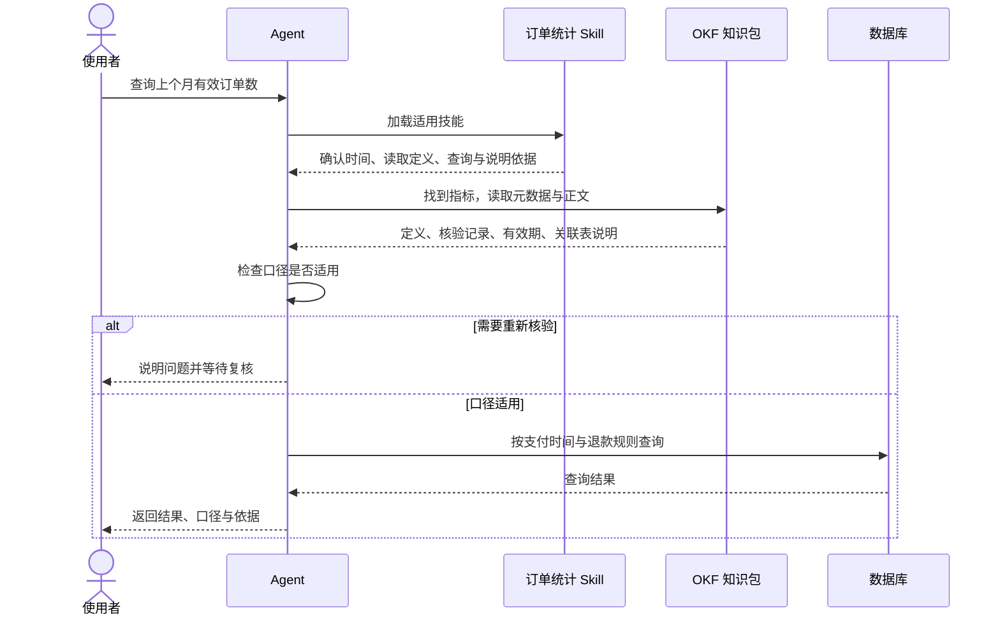

1. Table of Contents, ordered
{:toc}

打开一份给 Agent 使用的 `SKILL.md`，通常会看到这样的结构：顶部用 YAML 写名称和用途，下面用 Markdown 写技能说明。Agent 的运行环境按约定识别这些内容，在任务需要时加载它们。

Google 的 **Open Knowledge Format（OKF，开放知识格式）**可以从同一个思路理解：**Skill 主要约定怎样描述技能，OKF 主要约定怎样描述和交换知识。** 两者都让内容生产者与消费者遵守共同的文件格式和语义约定。在这个意义上，可以把它们理解为面向 Agent 的文件协议。

下面用虚构的订单业务，把两种文件放在一起。本文核对于 **2026 年 10 月 8 日**，OKF 部分以 [v0.2 规范](https://github.com/GoogleCloudPlatform/open-knowledge-format/blob/ad30107c31c06aec8a7d5636e0d1058118604e6f/SPEC.md)为准。

## 从 Skill 文件到知识文件

一个订单统计 Skill 完全可以同时包含执行流程和业务定义。先看一份自包含的技能，再看需要独立维护知识时，可以怎样组织同样的内容。

### Skill 描述如何完成任务

假设有一个订单统计技能，保存在 `query-orders/SKILL.md`：

```markdown
---
name: query-orders
description: 查询指定期间的有效订单数，在用户要求订单统计时使用。
---

# 统计口径

有效订单必须支付成功，排除测试订单和全额退款订单，保留部分退款订单。
月份按北京时间下的支付时间划分，按订单 ID 去重计数。

# 执行步骤

1. 确认用户要统计的时间范围。
2. 阅读订单表说明，确认字段及上述口径仍适用。
3. 按上述口径查询数据库。
4. 返回结果，并说明统计口径和依据。
```

两个 `---` 之间是 **YAML front matter**，也就是文件头部的元数据；后面是 Markdown 正文。[Agent Skills 规范](https://agentskills.io/specification)要求 `name`、`description`，正文承载技能说明，还可以配套脚本和参考资料。

这份 Skill 已经把流程和业务口径一起交给了 Agent，也可以继续加入资料链接。**只有这个技能使用这些规则时，直接这样维护就可以，不必额外引入 OKF。** Skill 的参考目录也能放独立文档，规则变长以后，可以按需拆分。

### OKF 描述任务依赖的知识

需要独立维护这份定义时，可以将它抽成一个文件。下面采用 OKF 的写法，保存在 `metrics/valid-orders.md`：

```markdown
---
type: Metric
title: 有效订单数
description: 按支付时间统计，排除测试订单和全额退款订单
tags: [orders, analytics]
---

# 定义

有效订单数按订单 ID 去重计数：

- 必须支付成功；
- 排除测试订单；
- 排除全额退款订单，保留部分退款订单；
- 月份按北京时间下的支付时间划分。

# 数据

字段和数据粒度见[订单表说明](/tables/orders.md)。
```

外形与 Skill 文件相同：**YAML 描述元数据，Markdown 承载详细内容。** OKF 把这样的知识单元称为 **Concept（概念）**，一个概念对应一个 UTF-8 Markdown 文件。

两套规范的区别体现在字段和使用方式上：Skill 的 `description` 帮助 Agent 判断何时使用技能；OKF 的 `type` 让读取器识别这是指标、表说明还是操作手册，正文解释相应知识。程序要按各自规范读取，不能仅凭文件长得相似就将它们互换。

“技能”和“知识”是这里的侧重点：Skill 也能携带领域知识，OKF 也能描述操作手册和计算步骤。这个类比帮助理解文件协议，并不要求把所有内容严格分成互不相交的两类。

## 标准字段让知识可以被统一处理

把定义抽成文件，已经让知识能够独立维护和复用。OKF 在此基础上增加的价值，是为不同生产者和消费者提供一套共同的文件与字段约定。

### 共享知识可以先用普通 Markdown

假设订单查询、财务报表和退款分析三个 Skill 都需要“有效订单”的定义。让它们引用同一份 Markdown，就可以减少复制和重复修改；这一步并不要求采用 OKF。

**知识能写在哪里、能否被复用，与是否采用公共交换格式，是两层不同的需求。** 三种做法各有适用范围：

| 做法 | 解决的需求 | 需要维护什么 |
|---|---|---|
| 直接写在 Skill 中 | 把一个任务需要的流程与知识放在一起 | 这份技能及其业务规则 |
| 多个 Skill 引用普通 Markdown | 让同一份定义独立更新、被多处复用 | 共享文档与引用关系 |
| 共享文档采用 OKF | 让不同工具按共同约定交换、处理知识及其元数据 | 规范字段，以及生产端与消费端的支持 |

当知识只服务于自家几个技能，普通 Markdown 可能已经足够。需要把它交给另一团队的 Agent、目录服务或检查程序时，双方才更需要明确约定：哪里是来源，哪个时间表示核验，怎样识别过期。

### 从一段说明到共同约定

假设一份文档把来源写成 `references`，另一份写成 `source_url`；某个日期表示“最近编辑”，另一个表示“最近审核”。人可以阅读全文理解，程序则需要逐种适配，或者交给 LLM 临时推断。

**OKF 统一这些字段的含义，让生产端知道该写什么，让消费端知道该读什么。** 例如，两套工具都实现相应约定时，一套写出的来源、核验记录和过期时间，另一套便可按共同语义读取，减少专门映射。[规范的目标](https://github.com/GoogleCloudPlatform/open-knowledge-format/blob/main/SPEC.md#1-motivation)

这些信息也能自行写进 Skill 或普通 Markdown，再由自家程序解析。OKF 提供的是现成的公共约定，并没有增加 Markdown 原本无法表达的知识。收益取决于需要合作的工具是否支持这些约定；单方面加上字段，不会自动获得跨工具兼容，也不会让不同消费者必然采用相同的业务策略。

正文继续承载定义、例外和解释。协议减少格式适配，具体业务含义仍要由内容和使用者确认。[Google 的设计背景](https://cloud.google.com/blog/products/data-analytics/how-the-open-knowledge-format-can-improve-data-sharing)

v0.2 的通用顶层字段可以放在一张表里理解：

| 字段 | 格式 | 用途 |
|---|---|---|
| `type` | 非空字符串 | 概念类型，如 `Metric`、`BigQuery Table`、`Playbook` |
| `title` | 字符串 | 展示名称 |
| `description` | 字符串 | 简短摘要 |
| `resource` | URI 或路径 | 这个概念描述的底层对象，例如数据库表 |
| `tags` | 字符串列表 | 跨目录分类 |
| `sources` | 来源对象列表 | 内容依据了哪些材料 |
| `usage_window` | `{ from, to }` | 来源使用次数的共享统计时间窗 |
| `generated` | `{ by, at }` | 谁生成或修改了当前内容，何时发生有意义的修改 |
| `verified` | `[{ by, at }]` | 谁核验过内容，何时核验 |
| `status` | `draft` / `stable` / `deprecated` | 草稿、可供使用、已废弃 |
| `stale_after` | 带时区的日期时间 | 从哪个时刻起应视为陈旧 |

**普通概念只有非空的 `type` 始终必填**，其他字段可按需要补充；`type` 也没有封闭的业务类型枚举。正文标题由作者按内容选择，普通概念没有统一必填章节。[概念文档规则](https://github.com/GoogleCloudPlatform/open-knowledge-format/blob/main/SPEC.md#4-concept-documents)

### 给指标补上来源与核验记录

回到有效订单示例，可以在头部的 `tags` 之后继续加入以下字段。人物、时间和次数均为演示数据：

```yaml
sources:
  - id: order-policy
    resource: /policies/order-counting.md
    title: 订单统计规则
    author: human:policy-editor
    usage_count: 120
    last_modified: 2026-10-01T09:00:00+08:00

usage_window:
  from: 2026-10-01T00:00:00+08:00
  to: 2026-10-08T00:00:00+08:00

generated:
  by: wiki-agent/1.0
  at: 2026-10-08T10:00:00+08:00

verified:
  - by: human:business-reviewer
    at: 2026-10-08T11:00:00+08:00

status: stable
stale_after: 2026-11-01T00:00:00+08:00
```

这段元数据表达了一条清楚的记录：指标定义来自订单政策，由整理 Agent 生成，随后经过业务人员核验，并约定从某个时刻起需要重新关注其时效。

其中，**顶层 `resource` 指“正在描述的对象”，`sources[].resource` 指“编写内容的依据”**。一个订单表概念可以用前者指向数据库表，用后者指向设计文档。本例是抽象指标，所以没有填写顶层 `resource`。

每个来源条目的结构如下：

| `sources` 条目内的字段 | 含义与要求 |
|---|---|
| `resource` | 条目内必填；网址、文件路径，或来源范围的文字描述 |
| `id` | 可选的稳定来源标识；正文引用该来源时应提供 |
| `title` | 可选的来源名称 |
| `author` | 可选的来源作者 |
| `usage_count` | 可选的使用次数，如查询执行次数或页面阅读次数 |
| `last_modified` | 可选的来源修改时间 |
| `usage_window` | 可选的 `{ from, to }`，覆盖顶层共享统计时间窗 |

示例中的 `120` 是统计窗口内的使用次数，用来观察活跃程度；它不等于可信度评分。`last_modified` 记录来源自身的变化，`generated.at` 记录本概念的变化。正文还可以通过脚注把具体陈述关联到来源：

```markdown
全额退款订单不计入有效订单数。[^order-policy]

[^order-policy]: 订单统计规则
```

这里的 `order-policy` 与 `sources[].id` 匹配，读取器通过这个稳定标识找到来源。[来源与引用规则](https://github.com/GoogleCloudPlatform/open-knowledge-format/blob/main/SPEC.md#51-provenance-sources)

### 元数据支持判断，消费者落实行为

`generated` 与 `verified` 分别记录“谁写的”和“谁确认过”。两者独立：内容可能修改后尚未复核，也可能保持原文不变而重新核验。因此，**`status: stable` 或人工编写，都不能自动代替人工核验记录**。

身份字段采用约定的 actor 字符串：`human:alice` 表示人，`process:nightly-check` 表示自动化流程，`wiki-agent/1.0` 表示工具及版本。`generated` 一旦出现，内部的 `by` 必填；`verified` 可以记录多个 `{ by, at }` 事件，也允许将单个事件直接写成一个对象。

消费者根据 `verified` 区分未核验、仅机器核验、人工核验。时间戳统一使用带明确时区的 ISO 8601 日期时间；省略 `status` 时按 `stable` 处理，当前时间达到 `stale_after` 时视为陈旧。[信任与生命周期规则](https://github.com/GoogleCloudPlatform/open-knowledge-format/blob/main/SPEC.md#5-provenance-trust-and-lifecycle)

程序因此可以明确选择“优先使用已人工核验、未过期的定义”。但字段本身不会自动触发复核或阻止执行，具体策略由消费程序实现；填写核验者的名字，也需要实际维护流程来支撑。

## 目录和链接把文件组成知识包

一个任务通常会用到指标、表说明和业务政策等多份知识。OKF 把这些文件放入目录，组成 **Bundle（知识包）**，再约定如何导航和关联。

### 文件路径就是概念标识

订单知识包可以采用下面的布局：

| 包内文件 | 内容 |
|---|---|
| `index.md` | 导航索引 |
| `log.md` | 更新记录 |
| `metrics/valid-orders.md` | 有效订单定义 |
| `tables/orders.md` | 字段、数据粒度和表关系 |
| `policies/order-counting.md` | 业务规则依据 |

目录名 `metrics`、`tables`、`policies` 由维护者选择。概念 ID 来自包内路径，去掉 `.md` 后，指标的 ID 就是 `metrics/valid-orders`。不需要再加一个顶层 `id`；前面的 `sources[].id` 专门用于来源引用。

正文使用普通 Markdown 链接。在指标文件里，`/tables/orders.md` 从包根目录解析，`../tables/orders.md` 从当前目录解析，两者指向同一个文件。展示成网站时，需要由展示层处理 URL 映射。

链接表达页面间的关联，具体是“依据”“依赖”还是“可以关联查询”，由周围的正文解释。OKF 没有要求所有团队共用一套业务关系词表。[路径与链接规则](https://github.com/GoogleCloudPlatform/open-knowledge-format/blob/main/SPEC.md#6-cross-linking-and-paths)

### 索引与日志帮助逐步阅读和维护

`index.md` 和 `log.md` 是保留文件名，都可选。根索引可以这样写：

```markdown
---
okf_version: "0.2"
---

# 订单分析

* [有效订单数](metrics/valid-orders.md) - 指标定义
* [订单表](tables/orders.md) - 字段和数据粒度
* [统计政策](policies/order-counting.md) - 业务规则依据
```

`okf_version` 声明知识包遵循的 **OKF 规范版本**。索引通常没有 front matter，根索引的版本声明是特例，不需要套上普通概念的 `type`。

索引让 Agent 先看到有哪些知识，再按需打开正文。这和 Skill 先展示名称、用途，再按任务需要加载详细内容的思路相近。`log.md` 则按 `YYYY-MM-DD` 日期分组记录变化，最新记录放在前面。[索引规则](https://github.com/GoogleCloudPlatform/open-knowledge-format/blob/main/SPEC.md#8-index-files)、[日志规则](https://github.com/GoogleCloudPlatform/open-knowledge-format/blob/main/SPEC.md#9-log-files)

这些约定让整个目录可以通过 Git 仓库或压缩包交付。OKF 对格式的要求也保留了扩展空间：未知字段应被保留，不能仅因不认识字段、遇到未知类型、缺少可选索引或存在断链，就拒绝整个知识包。完整性和业务适用性可以另做检查。[合规规则](https://github.com/GoogleCloudPlatform/open-knowledge-format/blob/main/SPEC.md#11-conformance)

## Agent 将技能流程与知识依据结合

当团队选择独立维护知识包时，可以将开头 Skill 中的内嵌定义改为读取共享定义。Agent 执行技能时先取得适用的知识，再继续查询；这是可选的组合方式。

### 在一次统计中分别发挥作用

用户要求统计上个月的有效订单时，Skill 提供调查和执行流程，OKF 提供定义、来源与适用状态。下面是一种具体的消费方式：



图中的暂停复核是本例选择的策略。实际系统也可以提示风险或请求补充材料，OKF 负责提供判断所需的共同字段。

这也说明了知识与数据各自的作用：数据库提供订单记录，知识文件解释如何统计。即使 SQL 语法正确，按创建时间统计和按支付时间统计也可能得到不同结果；业务定义需要在查询前确定。正式报表还应明确数据截止时间或快照，避免后续退款改变历史数字。

Agent 可以从索引、全文搜索或向量检索找到知识。OKF 没有规定一种固定检索算法，整理后的知识页也可以进入 RAG。

### 进一步固定认可的计算方式

Agent 读到了定义，仍可能在编写 SQL 时漏掉条件。需要更严格约束时，v0.2 提供 **Attested Computation（可核验计算）**，把认可的计算和检查方式也保存成独立概念。

例如，指标页可以链接到 `computations/valid-orders.md`，它的头部声明如下：

```yaml
---
type: Attested Computation
title: 按期间计算有效订单数
runtime: bigquery

parameters:
  - name: start_date
    type: date
    required: true
  - name: end_date
    type: date
    required: true

computation: /references/sql/valid-orders.sql

executor:
  resource: /references/skills/run-on-bq.md
  receipt: [job_id, executed_sql, result]

attester:
  resource: /references/attesters/valid-orders.py
---
```

这几个附加字段把知识扩展成了计算契约：

| 字段 | 表达的约定 |
|---|---|
| `runtime` | 运行环境，例如 `bigquery`、`postgres`、`python`；该类型必填 |
| `parameters` | Agent 可填写的参数，每项包含 `name`、`type`、`required` |
| `computation` | 计算文件位置；省略时，在正文 `# Computation` 下放一个计算代码围栏 |
| `executor.resource` | 执行说明或代码的位置 |
| `executor.receipt` | 执行后必须返回的证据字段名列表 |
| `attester.resource` | 消费端调用的确定性核验代码位置 |

`executor.resource` 背后可以是 Skill、脚本或容器；实际加载和运行由消费者实现。Agent 按知识文件中的契约，调用相应执行器完成计算。[计算契约规范](https://github.com/GoogleCloudPlatform/open-knowledge-format/blob/main/SPEC.md#10-attested-computations-concept)

上面的 SQL、执行说明和校验脚本都需要另行实现；这段 YAML 只声明契约。`receipt` 中的字段名由本例选择，真正的执行记录在运行时产生。完整的执行证据与判定结果传输协议仍有待完善，基础格式合规也不能证明计算已经可运行。

核验能力还取决于具体实现。例如[官方示例校验器](https://github.com/GoogleCloudPlatform/open-knowledge-format/blob/ad30107c31c06aec8a7d5636e0d1058118604e6f/bundles/acme_retail/attesters/sql_equality.py)比较规范化 SQL 与收到的结果，不联网核查数据库作业，也不检查参数值。正式统计仍需验证执行记录是否可信、参数是否正确。

## 用现有工具维护和交换知识

文件协议明确以后，仍需要人或程序提炼定义、更新内容，并把知识交给实际消费者；这正是 LLM Wiki 和各类编辑、展示工具参与的部分。

### LLM Wiki 负责持续整理知识

[Karpathy 的 LLM Wiki 模式](https://gist.github.com/karpathy/442a6bf555914893e9891c11519de94f)让 LLM 持续读取资料，把理解整理为概念页、摘要和交叉引用，人参与选材与核对。下一次提问时，可以复用已经整理过的知识，而原始资料仍保留用于追溯。

Google 将 OKF 定位为这一模式的开放格式。二者的配合是：**LLM Wiki 提供持续整理的工作方式，OKF 为整理后的产物约定共同表达。** 如何提炼概念、解决冲突、确认业务口径，仍由维护者和具体实现决定。

把原始材料整理为有依据的知识，再按共同格式输出，是两个需要分别完成的环节。本站的[LLM 个人 Wiki 文章](/ai/2026/08/24/karpathy-llm-wiki-knowledge-base/)介绍了持续维护知识的实践。

### 编辑器、知识平台与消费者各有职责

已经使用 Wiki 的团队可以继续使用原有工具，按需要接入 OKF：

| 工具或参与者 | 在工作流中的职责 |
|---|---|
| 人或整理 Agent | 提炼定义、处理冲突、填写来源、更新核验状态 |
| Obsidian、文本编辑器 | 浏览和编辑 Markdown 文件，支持人工审阅 |
| Notion 等知识平台 | 承载原始或整理后的知识，经导出与字段适配接入 |
| Hugo、Jekyll | 通过模板与链接适配，将知识展示为网页 |
| Agent、检索服务、目录系统 | 按约定发现、读取和使用知识 |

[Notion 的 Markdown 导出](https://www.notion.com/help/export-your-content#export-as-markdown--csv)提供了迁移内容的起点，仍需处理元数据和链接。[Obsidian 的属性](https://obsidian.md/help/properties)支持 YAML，但嵌套结构可能需要在源码模式编辑；[Hugo 的 front matter](https://gohugo.io/content-management/front-matter/)则主要服务于内容和模板。工具能够读取 Markdown，只能证明文件可读；是否按 OKF 字段采取行动，需要另外实现和验证。

对于只由一个 Skill 使用的订单规则，可以继续写在技能里。出现重复维护时，先抽出共享文档；确有跨工具交换或统一元数据处理需求时，再评估 OKF。例如选取指标、表说明和政策三份知识，让另一套支持 OKF 的消费者读取，检查来源、字段和链接是否完整保留。规则变化或知识过期时，还要检查消费者能否识别并执行约定的处理策略。

[OKF 官方仓库](https://github.com/GoogleCloudPlatform/open-knowledge-format)提供生成 Agent、查看器和样例，并将这些工具定位为概念验证。采用共同格式可以减少知识交接中的适配，但知识质量、维护责任和消费行为仍需分别验收。这些分工也沉淀到本站的 [AI 知识地图](/wiki/ai-llm-agent/)中，作为检索与 Agent 工程的共同关注点。
