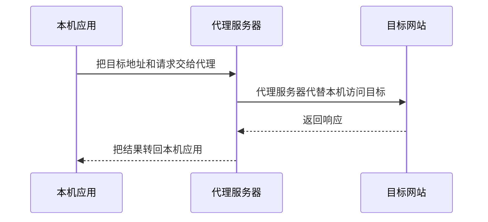
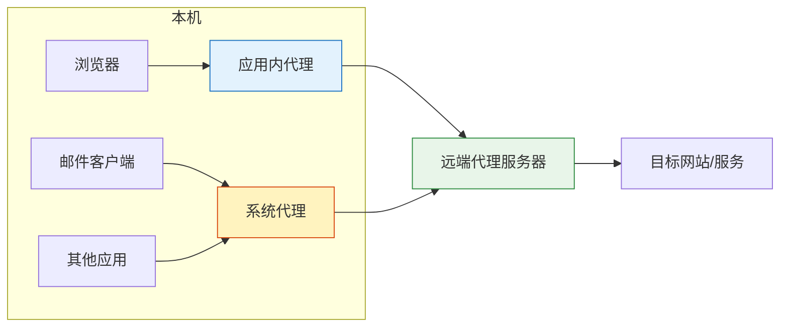
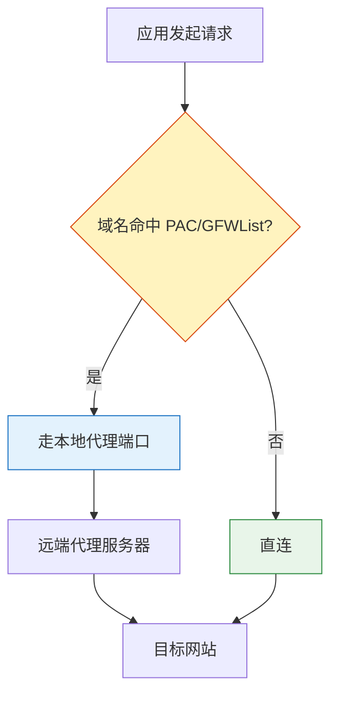
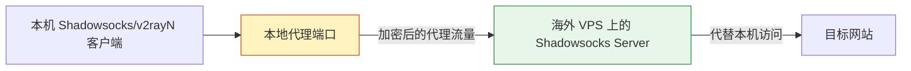

聊一聊代理。它听起来像一个纯技术话题，实际折腾起来更像生活必需品：查资料、看文档、装软件，最后都绕不开“到底谁替谁去访问谁”这个问题。

1. Table of Contents, ordered
{:toc}

# 代理
代理的含义本身很简单。生活中有代理，开发模式有代理，封装的类也经常用到代理类。落到网络里，本质还是同一个故事：**A 想请求 B，但 A 直接够不到 B，于是让 C 代劳**。



这也是后面所有软件、协议、PAC 规则、VPS 自建服务的共同底层逻辑。界面可以五花八门，链路就这么一条。

# 代理服务分类

## http代理
HTTP 代理只理解 HTTP/HTTPS 这一类浏览器流量，所以最常见的场景就是浏览网页。它配置起来直观，但覆盖面也有限。

## socks代理
**全能代理**。

之所以全能，是因为它大致处在 TCP/UDP 之上、各种应用层协议（HTTP/FTP/IMAP/SSH/DNS 等）之下。也就是说，它不太关心上层到底是网页、邮件还是 SSH，只负责把连接转出去。这就意味着不止用浏览器上网，发邮件也是可以用它代理的。

> 如果说五层模型的话，它显然是网络层的，和IP数据包在同一层，不过因为它要被IP数据包封装，所以可以认为它在网络层的偏上部。

socks4 主要代理 TCP，socks5 支持 TCP，也支持 UDP 转发。所以 DNS 这类基于 UDP 的场景，也可以通过 socks5 处理。

socks 不需要像 HTTP 代理那样理解具体应用层内容，所以对代理服务来说，处理起来更通用。

一般socks代理服务绑定本地1080端口。

可以把 HTTP 代理和 SOCKS 代理粗略对比一下：

| 维度 | HTTP 代理 | SOCKS 代理 |
|------|-----------|------------|
| 主要处理 | HTTP/HTTPS 请求 | TCP/UDP 连接 |
| 常见使用者 | 浏览器 | 浏览器、邮件、SSH、其他应用 |
| 是否关心应用协议 | 关心 HTTP 语义 | 基本不关心上层协议 |
| 常见本地端口 | 10809 等 | 1080/10808 等 |

[SOCKS5 协议](https://en.wikipedia.org/wiki/SOCKS#SOCKS5)和处理流程，很清楚地表明了 socks 协议传输的东西：
- request：
    + DSTADDR：destination address，client要告诉server我要连哪个地址；
    + DSTPORT：同上；
- response：
    + BNDADDR：bound address，请求成功后客户端需要连接的代理服务器的地址或域名（有可能就是代理服务器本身的一个网卡，也可能被分配到别的代理服务器），**客户端之后的通信均通过地址对应的服务器**；
    + BNDPORT：同上；

也就是说：在连接建立之后，server新开一个地址让client连接，client会把所有request都发到这个新的连接上，代理服务器会把这个新连接的所有request转发给刚刚的目标服务器。

根据我的实测，使用代理连接twitch，连接建立之后，把代理关了，此时client访问不了其他需要翻墙的网站了，也访问不了其他twitch页面，**但是刚刚打开的twitch流就没断过**。查看服务器的代理端口，的确没有连接：
```bash
{} ~ sudo netstat -anp | grep :8005
tcp        0      0 104.225.232.103:8005    0.0.0.0:*               LISTEN      21247/python3
udp        0      0 104.225.232.103:8005    0.0.0.0:*                           21247/python3
{} ~ sudo netstat -anp | grep :8004
tcp        0      0 104.225.232.103:8004    0.0.0.0:*               LISTEN      21247/python3
udp        0      0 104.225.232.103:8004    0.0.0.0:*                           21247/python3
```
所以他们应该是使用另外的端口在交流。

参考：[SOCKS5 代理协议解析](https://www.addesp.com/archives/2594)。

# 代理方式
代理可以配置在系统上，所有网络请求都先经过本机代理；也可以单独配给某个应用。两种方式没有谁绝对更好，取决于想管多大的流量范围。



## 系统代理
整个系统的代理，系统所有的请求都发往系统代理。Windows可以直接在设置里进行设置。

## 分应用代理
各个应用可能会支持单独配置代理，比如浏览器、迅雷、qq等。

# 代理软件
代理软件有很多。**但都需要你拥有一个代理服务器的地址**，然后把地址告诉代理软件，并配置哪些请求会用这个代理。

所以代理软件之间的区别无非就是做的是否更人性化、更方便配置、拥有更多的功能设置。代理软件有开源的也有收费的，但不管怎么样，都需要有提前购买好的代理服务器地址才能使用。

## v2rayN
支持系统级代理配置的软件，可以配置整个系统的代理，所以买了各种代理之后，经常被要求先下载个v2rayN。

[v2rayN](https://github.com/2dust/v2rayN)有以下代理模式。

### 全局模式
电脑所有的网络请求都先发给代理服务器。

打开全局模式之后，可以查看windows系统设置里的代理，发现系统已经配置了全局代理服务器，`localhost:10809`。所以其实就是v2rayN帮你设置了全局代理模式，代理服务器是v2rayN里填入的服务器地址。

### PAC模式 - GFWlist & 手动添加
**PAC(Proxy Auto-Config)**，即自动配置的代理。

一般是一个配置文件（PAC文件），只有PAC文件里的域名需要走代理，其他的不需要代理。

PAC名单里的域名是哪些？已经有一个整理好的 **GFWlist（Great Fire Wall，中国国家防火墙）**，里面记录了很全的被屏蔽的域名。

所以v2rayN里的PAC模式就是设置了GFWlist的文件地址：

[GFWList 原始文件](https://raw.githubusercontent.com/gfwlist/gfwlist/master/gfwlist.txt)。

它的内容base64编码了，可以很容易反编码：
```bash
$ url=https://raw.githubusercontent.com/gfwlist/gfwlist/master/gfwlist.txt
$ curl -s $url | base64 -D
```

这个问题在 [gfwlist issue #1199](https://github.com/gfwlist/gfwlist/issues/1199) 里也有人讨论过。

GWFlist现在是github的一个工程，里面记录了中国大陆屏蔽的网站：

[gfwlist 项目](https://github.com/gfwlist/gfwlist)。

它的语法可以参阅wiki：

[GFWList 语法说明](https://github.com/gfwlist/gfwlist/wiki/Syntax)和 [issue #401](https://github.com/gfwlist/gfwlist/issues/401)。

PAC 的判断链路大概是这样：



它会更新，但不一定很及时。所以v2rayN还支持自己手动添加一些PAC规则，添加完会立即生效。

### 直连模式
仅开启http代理，不代理其他的。和单独给浏览器配置代理服务器应该是一个意思。

## SwitchyOmega
SwitchyOmega是chrome的一个插件，它也是一个方便配置代理的工具。**只不过它只能给浏览器配置代理，属于应用级代理配置软件，不能给整个系统配置**。（给chrome配置了，只有chrome能用，firefox也并不能用）

参考：[SwitchyOmega 的 GFWList 说明](https://github.com/FelisCatus/SwitchyOmega/wiki/GFWList)。

相较于浏览器自己提供的代理配置，SwitchOmega会更强大一些，支持任意切换等。

## ShadowSocks(client)
shadowsocks主要指代理server，但也有client，用于连接代理服务器。这里指的是client。它是一个经常使用的支持系统级代理配置的软件。

[shadowsocks-windows](https://github.com/shadowsocks/shadowsocks-windows) 是常用客户端之一。

# 代理服务器
那么最关键的问题来了：代理服务器哪里搞？无外乎买别人的，或者自己搭。

从我自己的经验来看，买别人的其实性价比不高。一般情况下，买代理可能比自己买服务器搭建代理稍微便宜一点儿，但其实存在诸多不便，比如：
1. 流量限制：显然，每月的流量有限额。想不限流可以，但就很贵了；
2. 不稳定：毕竟是和别人共用的代理服务器，经常被封。虽然有订阅地址可以更新，但还是很麻烦；
3. 跑路：卖代理的是什么背景咱也不知道……正规厂家肯定不敢干这个，所以代理突然跑路了也正常……

自己搭则各种爽。唯一的门槛就是需要linux相关知识。
> 事实证明，知识就是力量。

## 自建代理
自己搭建代理服务器需要两步：
1. 首先需要买一台海外服务器，或者说VPS（虚拟私有服务器）；
2. 给海外的服务器安装代理服务；

### 购买VPS
**一定要是海外的**，阿里云不行（阿里云海外版可以），不然访问不了国外网络，搭个代理有啥用……

官网是 [BandwagonHost](https://bandwagonhost.com/)，但是国内没法直连。

国内可以直连的一些相关官网镜像：
- [搬瓦工相关教程](https://hupost.org/article/tech/web_tech/vpn-%E7%A7%91%E5%AD%A6%E4%B8%8A%E7%BD%91)
- [BandwagonHost 部署说明](https://www.bwgyhw.cn/bandwagonhost-deploy-new/)
- [搬瓦工官网国内镜像](https://bwh81.net/index.php)
- [已购产品页](https://bwh81.net/clientarea.php?action=products)
- [VPS 管理页](https://kiwivm.64clouds.com/main.php)

我是在搬瓦工上买的服务器，约300RMB一年，支持支付宝支付，配置如下：
- 20GB ssd;
- 1GB ram;
- 1TB bandwidth;
- 2x intel Xeon cpu;
- 网速：1Gigabit/s；
- 流量：1TB/month；

一个月1T流量，一天能用30多G，基本相当于不限速了。

买好之后可以在订单里找到买的服务器信息。我直接把redhat重装为Debian 11 bullseye了。

还能在它提供的简单管理界面查看服务器监控、执行命令等。

不过，既然已经有了以下信息：
- ip;
- root & password;

直接用本地linux shell ssh上去就行了，还能复制粘贴，比官方自己的浏览器版命令行好用多了。

### 代理服务
代理服务一般是shadowsocks或者加强版shadowsocks-R。这里选的是shadowsocks。

在 [Shadowsocks quick guide](https://shadowsocks.org/en/config/quick-guide.html) 上，有关于配置、调优的细节。

令人兴奋的是，在首页发现shadowsocks竟然在AUR里可以直接安装，arch还是强啊！

[AUR 里的 shadowsocks 包](https://aur.archlinux.org/packages/?O=0&K=shadowsocks)。

还找到了shadowsocks的白皮书，相当不错，需要的时候可以研究一下：

[Shadowsocks whitepaper](https://shadowsocks.org/assets/whitepaper.pdf)。

最终的自建链路长这样：



### 安装代理服务

#### pip
参考：
- [frank-lam/vps-ss](https://github.com/frank-lam/vps-ss)
- [Shadowsocks 使用说明](https://github.com/shadowsocks/shadowsocks/wiki/Shadowsocks-%E4%BD%BF%E7%94%A8%E8%AF%B4%E6%98%8E)

> 建议先安装zsh，操作bash实在是不够方便。

准备：
```sql
apt update & apt upgrade
apt install python3 pip
```
安装shadowsocks server：
```bash
pip install shadowsocks
```
配置：
```json
{
    "server": "xxx",
    "port_password": {
        "8001": "xx",
        "8002": "xx",
        "8003": "xx",
        "8004": "xx",
        "8005": "xx"
    },
    "timeout":300,
    "method":"aes-256-cfb"
}
```
- 填server公网ip；
- 这里不同的端口号配置了不同的密码，方便分享给不同的人；

启动/关闭服务：
```bash
ssserver -c /etc/shadowsocks.json -d start
ssserver -c /etc/shadowsocks.json -d stop
```

果然，报错了……人生处处都是坑……
```bash
libcrypto.so.1.1: undefined symbol: EVP_CIPHER_CTX_cleanup
```
查了一下，果然是版本问题。简单粗暴的做法就是需要把openssl里的变量替换一下。这里我的shadowsocks的openssl的地址为：`/usr/local/lib/python3.9/dist-packages/shadowsocks/crypto/openssl.py`，使用vim对文件全局搜索替换：`:%s/cleanup/reset/`。

再启动就好了。

> 后来重启了一次，结果起不来了，有了新的报错：`FileNotFoundError: [Errno 2] No such file or directory: b'liblibcrypto.a'`，很迷幻。后来参考[这个回答](https://stackoverflow.com/a/65513989/7676237)，类比着创建了一个软连接：`ln -s -f libcrypto.a liblibcrypto.a`，就启动成功了。

#### debian
Debian 安装也可以继续参考 [Shadowsocks 使用说明](https://github.com/shadowsocks/shadowsocks/wiki/Shadowsocks-%E4%BD%BF%E7%94%A8%E8%AF%B4%E6%98%8E)。

### 客户端连接
服务都启动好了，用客户端连接就行了。

客户端没必要非得用shadowsocks，上面说的v2ray也行，本质上都是一样的。shadowsocks client下载地址：
- [Windows 客户端](https://github.com/shadowsocks/shadowsocks-windows/releases)
- [macOS 客户端](https://github.com/shadowsocks/ShadowsocksX-NG/releases)
- [Android 客户端](https://github.com/shadowsocks/shadowsocks-android/releases)
- [iOS 帮助](https://github.com/shadowsocks/shadowsocks-iOS/wiki/Help)

shadowsocks的官网也有下载链接：

[Shadowsocks clients](https://shadowsocks.org/en/download/clients.html)。

最后，都别忘了配置PAC。

### 一个不错的链接
找到个关于shadowsocks的终极教程，里面有关于苹果ipad/iphone使用ss的介绍。是一个名为shadowsockshelp的github账号：
- [iOS 使用说明](https://shadowsockshelp.github.io/Shadowsocks/ios.html)
- [shadowsockshelp 首页](https://shadowsockshelp.github.io/)
- [Shadowsocks 教程目录](https://shadowsockshelp.github.io/Shadowsocks/)

# 其他配置
- [一键部署 ss](https://www.flyzy2005.com/fan-qiang/shadowsocks/install-shadowsocks-in-one-command/)，不过看起来停止维护了；
- [控制流量](https://www.flyzy2005.com/fan-qiang/shadowsocks/multiple-users-and-traffic-limited/)，其实就是 iptables 控制端口流量；
- [shadowsocks-manager](https://www.flyzy2005.com/fan-qiang/shadowsocks/shadowsocks-manager-config/)。

# 后记
起飞！自己的代理可比买别人的爽太多了！再也没人限制我了！再也不用改配置了！再也不会连不上了！还能分享给亲友使用，这才是最具性价比的方式。

最最最关键的，代理的价值已经让VPS的钱回本了，那这台VPS不就相当于白嫖的了嘛:D
