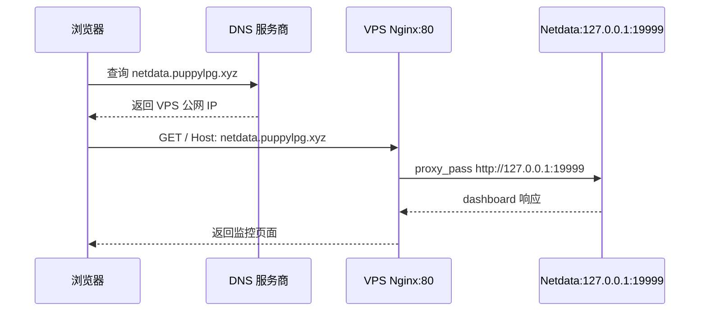
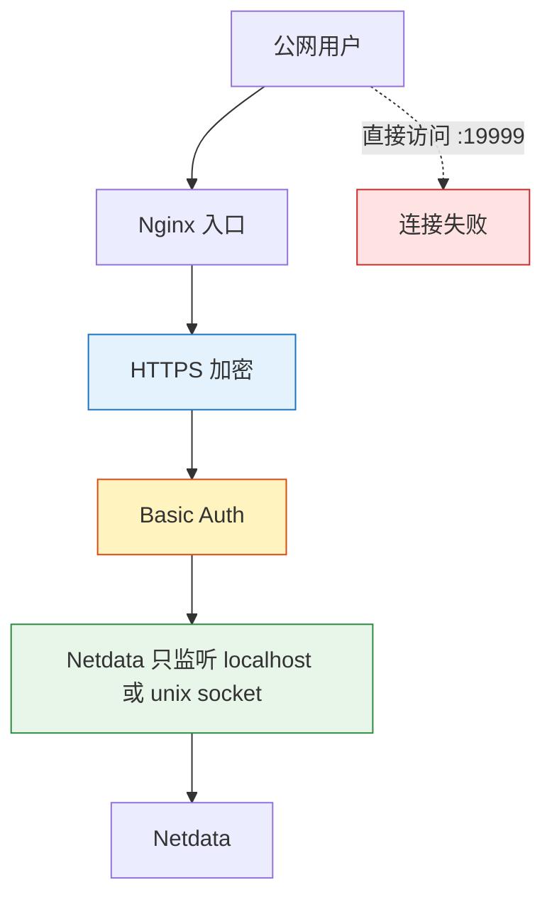
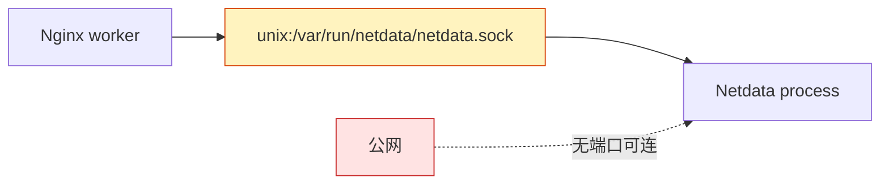
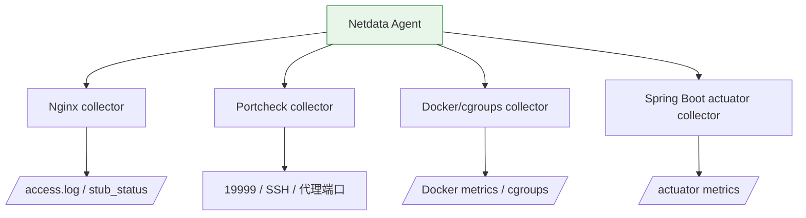
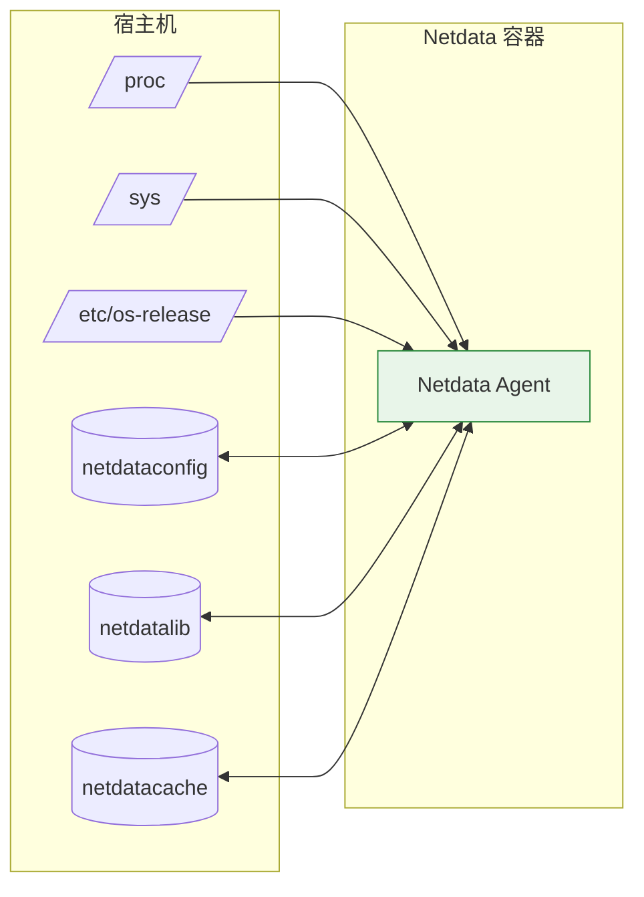

给服务器装个监控。最开始只是想看看 VPS 资源占用，最后顺手把 DNS、Nginx 反向代理、Basic Auth、HTTPS、localhost 绑定、unix domain socket 又摸了一遍。折腾小服务器就是这样，表面在装监控，实际在补课。

1. Table of Contents, ordered
{:toc}

这篇文章的主线可以先看成一张图：


# munin
一开始在shadowsocks的官网上看到了munin，就装了一个。但发现监控界面比较老旧，想切换不同时段查看数据也很粗糙，基本就是重新发个请求再刷新页面内容，非常原始，体验极差，后来就不用了。所以这里就简单记录一下装的过程。

munin大概是需要启动一个server一个client，client收集数据发给server。最终通过apache展示数据。apache的配置使用的是xml，这些都是不太舒服的体验。

参考的资料大致有这些，不再详述过程：
- [munin 官网](https://munin-monitoring.org/)
- [Debian 10 安装 munin](https://www.osradar.com/install-munin-debian-10/)
- [Debian Munin Apache 配置](https://wiki.debian.org/Munin/ApacheConfiguration)
- [不同发行版的 Apache 配置差异](https://blog.csdn.net/puppylpg/article/details/52346654)

# netdata
搜了一下比较现代化的监控系统，netdata立刻吸引了我。

netdata的安装非常简单，官网有一键安装脚本，安装后有一些重要信息提示——

开启KSM：
```txt
 --- Check KSM (kernel memory deduper) ---

Memory de-duplication instructions

You have kernel memory de-duper (called Kernel Same-page Merging,
or KSM) available, but it is not currently enabled.

To enable it run:

    echo 1 >/sys/kernel/mm/ksm/run
    echo 1000 >/sys/kernel/mm/ksm/sleep_millisecs

If you enable it, you will save 40-60% of netdata memory.
```
如果不是用的root账户，上面的命令无法写入成功。可以改为：
```bash
echo 1 | sudo tee /sys/kernel/mm/ksm/run
```
**`tee`是将stdin重定向到stdout或者file，功能和`>`类似。但是`>`是由shell来做的，没法给它加sudo**，这个坑可以参考[这个 StackOverflow 回答](https://stackoverflow.com/a/550808/7676237)。

**或者直接用sudo启动一个shell来执行命令**：
```xml
sudo sh -c "echo 1 >/sys/kernel/mm/ksm/run"
```

netdata的默认端口是19999，可以使用systemd启动关闭netdata：
```nginx
 --- Basic netdata instructions ---

netdata by default listens on all IPs on port 19999,
so you can access it with:

  http://this.machine.ip:19999/

To stop netdata run:

  systemctl stop netdata

To start netdata run:

  systemctl start netdata
```

卸载netdata也有一键脚本。另外netdata还有更新脚本，通过cron执行，也不用操心：
```python
Uninstall script copied to: /usr/libexec/netdata/netdata-uninstaller.sh


 --- Installing (but not enabling) the netdata updater tool ---
Failed to disable unit: Unit file netdata-updater.timer does not exist.
Update script is located at /usr/libexec/netdata/netdata-updater.sh

 --- Check if we must enable/disable the netdata updater tool ---
Auto-updating has been enabled through cron, updater script linked to /etc/cron.daily/netdata-updater

If the update process fails and you have email notifications set up correctly for cron on this system, you should receive an email notification of the failure.
Successful updates will not send an email.
```

# 配置nginx
netdata安装好后，有一些配置是非常建议做的：
- 配置反向代理；
- 网卡绑定；

## 配置反向代理
netdata配置好之后，直接就可以通过`puppylpg.xyz:19999`来访问了。**但是一个成熟的服务不应该把端口暴露出来，不仅不好看，用户也记不住。所以需要使用nginx做一层反向代理**。

配置反向代理：
- [使用 nginx 做反向代理](https://learn.netdata.cloud/docs/agent/running-behind-nginx)

### 专有域名
首先在nginx的站点配置文件夹下`/etc/nginx/site-available/`创建`netdata.conf`（有没有`.conf`并不重要）：
```nginx
upstream backend {
    # the Netdata server
    server 127.0.0.1:19999;
    keepalive 64;
}

server {
    # nginx listens to this
    listen 80;
    # uncomment the line if you want nginx to listen on IPv6 address
    listen [::]:80;

    # use password to access
    auth_basic "Protected";
    auth_basic_user_file passwords;

    # the virtual host name of this
    server_name netdata.puppylpg.xyz;

    location / {
        proxy_set_header X-Forwarded-Host $host;
        proxy_set_header X-Forwarded-Server $host;
        proxy_set_header X-Forwarded-For $proxy_add_x_forwarded_for;
        proxy_pass http://backend;
        proxy_http_version 1.1;
        proxy_pass_request_headers on;
        proxy_set_header Connection "keep-alive";
        proxy_store off;
    }
}
```
> 比xml舒适一些。nginx的配置详情，可以参考[Nginx]()

然后在`etc/nginx/sites-enabled/`下创建一个它的软连接，重启nginx或者reload配置就启用新配置了。

主要分析一下它配置了什么——
1. 首先把netdata配置为一个上游服务，名为backend，地址是`localhost:19999`；
2. 然后配置server_name为`netdata.puppylpg.xyz`。这样，所有以域名`netdata.puppylpg.xyz`且端口80打到nginx上的请求，都会被转发到backend这个上游服务上，也就是打给了netdata。

**最后还有重要的一步：在DNS服务商那里配置`netdata.puppylpg.xyz`这个域名能访问到nginx。一般nginx直接部署在服务器80端口，所以也就是让域名能解析为服务器的ip**，要不然用户输入`netdata.puppylpg.xyz`根本连不上nginx，nginx配置的再好也没用了。

由于只有一台服务器，nginx也部署在这个服务器上，地址就是`puppylpg.xyz`，所以`netdata.puppylpg.xyz`指向`puppylpg.xyz`就行了。这里使用了CNAME：
```txt
≥ dig CNAME netdata.puppylpg.xyz +short
puppylpg.xyz.
```

> 关于CNAME，参考：[Linux - dig & DNS]()

此时`netdata.puppylpg.xyz`和`puppylpg.xyz`在DNS上没有区别，都指向同一个ip。但是nginx收到请求之后，做了区分：**只要是以`netdata.puppylpg.xyz`这个域名，80这个端口访问，请求路径为`/`，nginx就会打到`localhost:19999`**，而直接访问`puppylpg.xyz`会显示nginx的根index.html页面。

这样配置之后，一个请求的流程就变成了：
1. `netdata.puppylpg.xyz`经过DNS解析变成了服务器的ip，端口默认80；
2. 该ip:80就是nginx服务。nginx根据刚刚`netdata.conf`的配置，发现域名是`netdata.puppylpg.xyz`，于是将请求打给了`localhost:19999`，也就是netdata服务；
3. netdata服务开始处理请求；



这就是反向代理的真正含义：将服务隐藏在nginx之后，nginx作为服务的代理。这样做的好处显而易见：**所有的服务都可以配置一个专属于自己的域名了，所有的域名都指向服务器ip，请求都会打到nginx上，再由nginx按照域名转发请求给相应的服务**。

> 没买域名之前，感觉这一点儿还是比较难理解的。买域名之后一操作，一切都清晰了……

其实之前在公司配置域名跟这个是一模一样的，配置都放在公司的nginx上：
```nginx
upstream raw-url-test-inner-youdao-com {
    server 10.109.8.215:8080 fail_timeout=5s max_fails=3 weight=1;
}

server {
    listen 80;
    server_name raw-url-test.inner.youdao.com;
    listen 443 ssl;
    ssl_certificate /usr/local/youdao/openresty/nginx/conf/ssl/inner.youdao.com.cert;
    ssl_certificate_key /usr/local/youdao/openresty/nginx/conf/ssl/inner.youdao.com.key;
    ssl_session_timeout 1d;
    ssl_session_cache shared:MozSSL:10m;
    ssl_session_tickets off;
    ssl_stapling on;
    ssl_stapling_verify on;
    ssl_protocols TLSv1.2 TLSv1.3;
    ssl_ciphers ECDHExxxxxxxxxxx-SHA256:DHE-RSA-AES256-GCM-SHA384;
    ssl_prefer_server_ciphers on;

    if ($scheme = http ) {
        return 307 https://$host$request_uri;
    }
    access_log /disk1/logs/lb/raw-url-test.inner.youdao.com.access.log  proxy buffer=128k;
    error_log /disk1/logs/lb/raw-url-test.inner.youdao.com.error.log;

    location / {
        proxy_pass http://raw-url-test-inner-youdao-com;
    }
}
```
唯一的区别就是域名所在的DNS是公司内局域网的DNS，所以可以立即生效。

配置完之后，有两种方式可以访问netdata服务了：
1. 原始方式：`puppylpg.xyz:19999`；
2. `netdata.puppylpg.xyz` (必须保证DNS里这个域名指向nginx的ip)；

### 通用域名，专有路径
**也可以不专门搞个`netdata.puppylpg.xyz`域名，而是使用不同的路径区分不同的服务**。

两种反代方式的差别如下：

| 方式 | 入口 | Nginx 匹配依据 | 优点 | 代价 |
|------|------|----------------|------|------|
| 专有域名 | `netdata.puppylpg.xyz` | `server_name` | 好记，路径干净 | 要配额外 DNS 记录 |
| 专有路径 | `puppylpg.xyz/netdata/` | `location` | 不需要新子域名 | 配置更绕，路径重写容易踩坑 |

再配置一个`netdata-sub.conf`：
```nginx
upstream netdata {
    server 127.0.0.1:19999;
    keepalive 64;
}

server {
    listen 80;
    # uncomment the line if you want nginx to listen on IPv6 address
    listen [::]:80;

    # the virtual host name of this subfolder should be exposed
    #server_name netdata.example.com;
    server_name puppylpg.xyz;

    location = /netdata {
        return 301 /netdata/;
    }

    location ~ /netdata/(?<ndpath>.*) {
        proxy_redirect off;
        proxy_set_header Host $host;

        proxy_set_header X-Forwarded-Host $host;
        proxy_set_header X-Forwarded-Server $host;
        proxy_set_header X-Forwarded-For $proxy_add_x_forwarded_for;
        proxy_http_version 1.1;
        proxy_pass_request_headers on;
        proxy_set_header Connection "keep-alive";
        proxy_store off;
        proxy_pass http://netdata/$ndpath$is_args$args;

        gzip on;
        gzip_proxied any;
        gzip_types *;
    }
}
```
1. 上游服务依然是指向netdata服务，并取名为netdata；
2. `server_name`这次直接用了服务器域名，而不是特意配的域名；
3. `location`指向`/netdata`路径或者`/netdata/xxx`；

这个配置稍微复杂了点儿，首先是301重定向，如果访问路径是`/netdata`，就重定向到`/netdata/`：
```nginx
    location = /netdata {
        return 301 /netdata/;
    }
```

然后是模糊匹配，所以路径为`/netdata/xxx`的请求，都会达到netdata这个上游服务：
```xml
    location ~ /netdata/(?<ndpath>.*) {
        proxy_redirect off;
        proxy_set_header Host $host;

        proxy_set_header X-Forwarded-Host $host;
        proxy_set_header X-Forwarded-Server $host;
        proxy_set_header X-Forwarded-For $proxy_add_x_forwarded_for;
        proxy_http_version 1.1;
        proxy_pass_request_headers on;
        proxy_set_header Connection "keep-alive";
        proxy_store off;
        proxy_pass http://netdata/$ndpath$is_args$args;

        gzip on;
        gzip_proxied any;
        gzip_types *;
    }
```

现在，使用`puppylpg.xyz/netdata`也可以访问netdata了。不过我还是更倾向于配置一个专有域名，好记也好看。

可以使用curl看看这样配置的nginx发生了什么。首先看看有没有发生301重定向：
```xml
⇒  curl --dump-header - puppylpg.xyz/netdata --user <user name>:<password> 
HTTP/1.1 301 Moved Permanently
Server: nginx/1.18.0
Date: Thu, 09 Dec 2021 09:28:21 GMT
Content-Type: text/html
Content-Length: 169
Location: http://puppylpg.xyz/netdata/
Connection: keep-alive

<html>
<head><title>301 Moved Permanently</title></head>
<body>
<center><h1>301 Moved Permanently</h1></center>
<hr><center>nginx/1.18.0</center>
</body>
</html>
```
确实返回的是301重定向，Location header表明，将`/netdata`重定向到了`/netdata/`。

> 这里用到了用户名密码认证，因为后面配置了nginx认证。

或者使用`-L`支持重定向，加上`-v`查看详情：
```xml
⇒  curl -L puppylpg.xyz/netdata --user <user name>:<password> -v
*   Trying 104.225.232.103:80...
* Connected to puppylpg.xyz (104.225.232.103) port 80 (#0)
* Server auth using Basic with user '<user name>'

> GET /netdata HTTP/1.1
> Host: puppylpg.xyz
> Authorization: Basic cGlxxxYQ==
> User-Agent: curl/7.74.0
> Accept: */*
>

* Mark bundle as not supporting multiuse

< HTTP/1.1 301 Moved Permanently
< Server: nginx/1.18.0
< Date: Thu, 09 Dec 2021 09:42:54 GMT
< Content-Type: text/html
< Content-Length: 169
< Location: http://puppylpg.xyz/netdata/
< Connection: keep-alive
<

* Ignoring the response-body
* Connection #0 to host puppylpg.xyz left intact
* Issue another request to this URL: 'http://puppylpg.xyz/netdata/'
* Found bundle for host puppylpg.xyz: 0x55a040e4d8a0 [serially]
* Can not multiplex, even if we wanted to!
* Re-using existing connection! (#0) with host puppylpg.xyz
* Connected to puppylpg.xyz (104.225.232.103) port 80 (#0)
* Server auth using Basic with user '<user name>'

> GET /netdata/ HTTP/1.1
> Host: puppylpg.xyz
> Authorization: Basic cGlxxxYQ==
> User-Agent: curl/7.74.0
> Accept: */*
>

* Mark bundle as not supporting multiuse

< HTTP/1.1 200 OK
< Server: nginx/1.18.0
< Date: Thu, 09 Dec 2021 09:42:55 GMT
< Content-Type: text/html; charset=utf-8
< Content-Length: 40048
< Connection: keep-alive
< Access-Control-Allow-Origin: *
< Access-Control-Allow-Credentials: true
< Cache-Control: public
< Expires: Fri, 10 Dec 2021 09:42:55 GMT
<
<!doctype html><html lang="en"><head><title>netdata dashboard</title>太长不贴了
```
1. curl请求`/netdata`，**Authentication header表明使用的是basic认证**。nginx返回301重定向；
2. curl再请求`/netdata/`，依然使用basic认证。这次nginx返回netdata的网页了；

> **还能很明显看到，http header后面一定紧跟一个空行**。

curl使用认证：
- [curl 使用 Basic Auth](https://stackoverflow.com/a/3044340/7676237)
- [curl HTTP scripting](https://curl.se/docs/httpscripting.html)

关于basic认证，参考下面的内容。

当然也可以不用nginx，使用apache：
- [Apache 配置反向代理](https://learn.netdata.cloud/docs/agent/running-behind-apache)

## 配置安全访问
Netdata 默认开在 `19999`，又是监控系统，直接暴露公网就很不优雅。这里的安全策略分三层：



### 增加认证
安全配置其实也是通过nginx实现的，请求到达nginx的时候，必须通过认证之后才能访问资源：
- [Netdata 安全配置](https://learn.netdata.cloud/docs/configure/secure-nodes)

首先配置nginx安全认证要用到的user和password：
```xml
printf "yourusername:$(openssl passwd -apr1)" > /etc/nginx/passwords
```
yourusername换成想用的用户名，跟linux本身的用户名没什么关系。执行命令的时候，如果不是root，可以用`tee`取代`>`。

然后给刚刚的nginx配置加上认证：
```nginx
server {
    # ...
    auth_basic "Protected";
    auth_basic_user_file passwords;
    # ...
}
```

现在，再使用nginx访问netdata就要输入用户名和密码了：
1. `netdata.puppylpg.xyz`;
2. `puppylpg.xyz/netdata`;

关于认证方式，参考：
- [HTTP Basic 认证](https://developer.mozilla.org/en-US/docs/Web/HTTP/Headers/Authorization#basic_authentication)
- [HTTP 的其他认证方式](https://developer.mozilla.org/en-US/docs/Web/HTTP/Headers/Authorization#directives)
- [HTTP 认证流程](https://developer.mozilla.org/en-US/docs/Web/HTTP/Authentication)
- [Basic Auth 认证方案](https://developer.mozilla.org/en-US/docs/Web/HTTP/Authentication#basic_authentication_scheme)

**但是basic认证是不安全的，仅仅是base64了一下`username:password`**：
> As the user ID and password are passed over the network as clear text (it is base64 encoded, but base64 is a reversible encoding), the basic authentication scheme is not secure. **HTTPS/TLS should be used with basic authentication**. Without these additional security enhancements, basic authentication should not be used to protect sensitive or valuable information.

from curl tutorial：
> You need to pay attention that this kind of HTTP authentication is not what is usually done and requested by user-oriented websites these days. They tend to use forms and cookies instead.

事实上，无论是使用wireshark抓包还是使用浏览器的控制台查看请求，都能看到base64的用户名和密码。所以https是必须的！

### 配置https
http-over-tls，说来话长，新写了一篇[折腾小服务器 - nginx与https](/life/2021/12/11/vps-nginx-https/)

### http转https
- 没配https之前，`https://netdata.puppylpg.xyz`是无法访问的，因为nginx没有监听443端口；
- 配完https之后，`http://netdata.puppylpg.xyz`就转到了nginx的默认配置的80端口监听，nginx默认界面，而不是netdata服务了；

如何配置http自动跳转https？可以参考上面公司的nginx配置：
```nginx
server {
    # nginx listens to this
    listen 80;
    listen 443 ssl;

    # use password to access
    auth_basic "Protected";
    auth_basic_user_file passwords;

    # the virtual host name of this
    server_name netdata.puppylpg.xyz;
    ssl_certificate /etc/nginx/puppylpg-ssl/cert.pem;
    ssl_certificate_key /etc/nginx/puppylpg-ssl/key.pem;

    if ($scheme = http ) {
        return 307 https://$host$request_uri;
    }

    location / {
        // ...
    }
}
```
同时监听80和443，既可以处理http，又可以处理https。同时配置http为307跳，转到https。

curl需要使用`--insecure`，不然也是证书验证不通过，拒绝访问。不知道为啥https不支持HEAD方法，所以使用了GET，同时只显示header：
```xml
puppylpg ❯ curl -I http://netdata.puppylpg.xyz --insecure -u <username:password>
HTTP/1.1 307 Temporary Redirect
Server: nginx/1.18.0
Date: Sat, 11 Dec 2021 08:56:30 GMT
Content-Type: text/html
Content-Length: 171
Connection: keep-alive
Location: https://netdata.puppylpg.xyz/

puppylpg ❯ curl -IXGET https://netdata.puppylpg.xyz --insecure -u <username:password>
HTTP/1.1 200 OK
Server: nginx/1.18.0
Date: Sat, 11 Dec 2021 08:30:49 GMT
Content-Type: text/html; charset=utf-8
Content-Length: 40048
Connection: keep-alive
Access-Control-Allow-Origin: *
Access-Control-Allow-Credentials: true
Cache-Control: public
Expires: Sun, 12 Dec 2021 08:30:49 GMT

```
http果然返回307，https直接返回。此时浏览器里再输入http，就会自动跳转到https了。

### nginx与netdata之间的https
参考：[加密 Nginx 与 Netdata 之间的通信](https://learn.netdata.cloud/docs/agent/running-behind-nginx#encrypt-the-communication-between-nginx-and-netdata)。

按理说nginx和netdata一般都在同一机器或者内网集群，不需要再使用https。但万一nginx和netdata在两台主机通过公网访问，那最好nginx和netdata之间也开启https连接。

从1.16.0开始，netdata支持https了，所以直接配置TLS的文件：
```txt
[web]
    ssl key = /etc/netdata/ssl/key.pem
    ssl certificate = /etc/netdata/ssl/cert.pem
```
然后配置nginx，告诉nginx和netdata之间的通信需要用https：
```nginx
proxy_set_header X-Forwarded-Proto https;
proxy_pass https://localhost:19999;
```
就ok了。整个流程和client与nginx之间使用https类似。

- [Netdata web server 启用 TLS](https://learn.netdata.cloud/docs/agent/web/server#enabling-tls-support)
- [Netdata v1.16 发布说明](https://www.netdata.cloud/blog/release-1-16/)

### 关闭远程访问
但还有一种访问netdata的方式没有使用nginx，所以还是不需要认证的：
- `puppylpg.xyz:19999`

通过端口直接访问服务，nginx也没办法限制它了。

一个更合理的方式，应该是不把服务的端口暴露出去。比如通过防火墙关闭19999出口，使外部无法连接该端口。**更推荐的做法是服务本身绑定网卡的时候，不要绑定到有公网ip的网卡**：
1. **仅仅绑定局域网网卡**，只能局域网内直接访问服务；
2. **或者干脆仅仅绑定localhost**，只有在本机上才能直接访问该服务；

绑定范围的区别非常关键：

| 绑定地址 | 外部能否直连 | Nginx 能否访问 | 适合场景 |
|----------|--------------|----------------|----------|
| `0.0.0.0:19999` | 能 | 能 | 临时测试，不适合长期公网暴露 |
| `127.0.0.1:19999` | 不能 | 能，前提是 Nginx 同机 | 单机 VPS 反代 |
| `unix:/var/run/netdata/netdata.sock` | 不能 | 能，前提是同机 socket | 单机本地 IPC，更干净 |

netdata默认的绑定配置是：
```txt
[web]
    bind to = *
```
会绑定所有的网卡：
```nginx
netdata % netstat -anp | grep :19999
(Not all processes could be identified, non-owned process info
 will not be shown, you would have to be root to see it all.)
tcp        0      0 0.0.0.0:19999           0.0.0.0:*               LISTEN      -
tcp        0      0 104.225.232.103:19999   103.129.255.69:51550    ESTABLISHED -
tcp        0      0 127.0.0.1:53720         127.0.0.1:19999         ESTABLISHED -
tcp        0      0 127.0.0.1:53700         127.0.0.1:19999         ESTABLISHED -
tcp        0      0 127.0.0.1:19999         127.0.0.1:53700         ESTABLISHED -
tcp        0      0 127.0.0.1:19999         127.0.0.1:53720         ESTABLISHED -
tcp6       0      0 :::19999                :::*                    LISTEN      -
```
同时listen所有的ipv4和所有的ipv6。

可以改为仅监听localhost：
```python
[web]
    bind to = 127.0.0.1 ::1
```
此时只有localhost被监听，而不是`0.0.0.0`：
```nginx
netdata % netstat -anp | grep 19999
(Not all processes could be identified, non-owned process info
 will not be shown, you would have to be root to see it all.)
tcp        0      0 127.0.0.1:19999         0.0.0.0:*               LISTEN      -
tcp        0      0 127.0.0.1:55494         127.0.0.1:19999         ESTABLISHED -
tcp        0      0 127.0.0.1:19999         127.0.0.1:55494         ESTABLISHED -
```
现在，通过端口19999查询连接只能查到nginx和netdata之间的连接了，不可能再查到外部ip连到19999端口了。**而且一查就能查到两个关于19999端口的连接**，上面显示的这两个established其实是nginx和netdata互相之间的连接。通过sudo就能看出进程信息：
```nginx
netdata % sudo netstat -anp | grep 19999
[sudo] password for pichu:
tcp        0      0 127.0.0.1:19999         0.0.0.0:*               LISTEN      578931/netdata
tcp        0      0 127.0.0.1:19999         127.0.0.1:55706         ESTABLISHED 578931/netdata
tcp        0      0 127.0.0.1:55706         127.0.0.1:19999         ESTABLISHED 577089/nginx: worke
```
这样一来，外部用户再也无法通过`puppylpg.xyz:19999`访问netdata服务了，因为这里根本没有服务在监听：
```java
puppylpg@worker:~|⇒  nc -zv puppylpg.xyz 19999
nc: connect to puppylpg.xyz (104.225.232.103) port 19999 (tcp) failed: Connection refused
```

### 使用本地socket
仅仅把socket绑定为localhost是一种不把socket暴露到公网的手段。**另一种方式是干脆不使用`ip:port`这种能够在主机间IPC的方式，而使用仅用于本机上的服务间通信的方式——unix域套接字（unix domain socket）**。

**unix domain socket和基于TCP/IP或者UDP的socket都属于socket，共用同一套socket接口，可以理解为socket的不同实现**。

**如果仅需要本地通信，unix domain socket是更高效的方案，因为它仅复制数据，根本不需要进行网络报文的拆包封包、CRC校验、发送ACK等，因为本机上的通信不像网络一样不可靠，肯定不会发生丢包情况，所以也就不需要像TCP一样需要通过ACK来保证逻辑上的可靠通信**。

MySQL也可以在本地建立unix domain socket，如果client也在本地的话，就可以通过该socket直接访问了。

创建socket时，用的同样的接口，传入的参数不一样：
```txt
// 流式Unix域套接字
int sockfd = socket(AF_UNIX, SOCK_STREAM, 0);
// 网络socket
int sockfd = socket(AF_INET, SOCK_STREAM, 0);
```
其他比如accept的时候不需要client ip，因为都是本地进程，根本不需要ip。具体细节可以参考：
- [IP socket vs. unix domain socket](https://blog.csdn.net/Roland_Sun/article/details/50266565)
- [unix domain socket 编程示例](https://www.cnblogs.com/nufangrensheng/p/3569416.html)
- [IBM unix domain sockets considerations](https://www.ibm.com/docs/en/ztpf/1.1.0.15?topic=considerations-unix-domain-sockets)
- [普通 socket 编程示例](https://www.geeksforgeeks.org/socket-programming-cc/)

给netdata创建一个unix domain socket：
```python
[web]
    bind to = unix:/var/run/netdata/netdata.sock
```
**让nginx通过unix domain socket和netdata连接**：
```nginx
upstream backend {
    server unix:/var/run/netdata/netdata.sock;
    keepalive 64;
}
```

可以列出本地的所有unix domain socket：
```txt
netstat -anp --unix
```

用 unix domain socket 之后，Nginx 和 Netdata 的关系从“本机 TCP”变成了“本机文件路径 IPC”：




# 配置netdata本身
配置了这么一大圈，配置的都是nginx，除了绑定的socket之外，还没有对netdata本身进行配置。

配置文档：
- [Netdata get started](https://learn.netdata.cloud/docs/get-started)
- [Netdata nodes 配置](https://learn.netdata.cloud/docs/configure/nodes)

netdata提供了查看当前所有配置的接口：
- 当前配置可以通过 `http://netdata.puppylpg.xyz/netdata.conf` 查看。

配置netdata使用它提供的`edit-config`来完成。netdata的配置项挺多的（因为太强了啊），可以慢慢探索。

## 配置存储
存储是首先需要考虑的，毕竟VPS资源不富裕……

查看了一下历史记录，竟然只能存储两天的监控……毕竟netdata采集了这么多信息，默认存储却只有256m……所以从两方面修改了一下netdata的配置：
1. 修改指标采集频率，从1s一次到30s一次：`update every = 30`；
2. 存储大小设置为512m：`dbengine multihost disk space = 512`；

netdata提供了一个很好的预估所需存储空间的工具：
- [change metrics storage](https://learn.netdata.cloud/docs/store/change-metrics-storage)

这么算下来，512m够我存半年的metric了，可以了。

单个plugin的update every可以比global大，不可以比global小，否则按照global的频率收集：
- [reduce the data collection frequency](https://learn.netdata.cloud/docs/configure/common-changes#reduce-the-data-collection-frequency)

## hostname
配置tab页的名称。默认使用hostname：`pokemon.localdomain`，不太好看，所以改掉了：`hostname = puppylpg's VPS`。但并不影响实际的hostaname值。

虽然没啥卵用，但标题确实好看了不少。

# 配置collector
netdata靠各种collector来收集各种各样的metric，每个collector针对特定的应用/场景，使用提前设定的配置，收集相应文件/端口的数据。

> 妥妥的IPC。

collector 的工作方式很像一堆小探针：



比如nginx collector默认收集`/var/log/nginx/access.log`来统计nginx的访问情况。如果nginx做了自定义配置，没有把accesslog放在这儿，那nginx collector的配置也要对应做一些修改。如果大家都是默认情况，那直接启动就能正常工作了。

- [how collectors work](https://learn.netdata.cloud/docs/collect/how-collectors-work)
- [统一启用和配置 collector](https://learn.netdata.cloud/docs/collect/enable-configure)

netdata现在推荐使用Go版的collector：
- [所有可用的 collector](https://learn.netdata.cloud/docs/agent/collectors/collectors)

每次新配置完一个collector，都要记得重启netdata。

## nginx
监控nginx的连接、请求之类的。

- [Nginx collector](https://learn.netdata.cloud/docs/agent/collectors/go.d.plugin/modules/nginx/)

配置完后，`/etc/netdata/go.d`下就会有一个collector的配置`nginx.conf`。

## tcp
监控端口的连接时长、延迟等。

- [Portcheck collector](https://learn.netdata.cloud/docs/agent/collectors/go.d.plugin/modules/portcheck/)

监控netdata的19999端口和ssh的端口都还不错，~~但是监控shadowsocks的几个端口都没有看出来端倪。以后再研究研究。~~ 破案了，shadowsocks绑定的是公网ip网卡，没有绑定localhost，而配置的时候把host直接写成localhost了。**以后一定要好好看清服务到底绑定了哪个网卡**。

update every被我改成300s一次了，感觉没必要一直监听端口是不是能正常连接。

## docker
### docker engine
监控docker engine，但好像是监测docker engine的pull/push/build次数的……emmm

- [Docker Engine collector](https://learn.netdata.cloud/docs/agent/collectors/go.d.plugin/modules/docker_engine/)

docker默认使用unix domain socket，所以还要开个端口暴露metric。docker默认可以配置端口暴露给prometheus监控。所以collector也就从这个端口收集数据：
- [Docker daemon Prometheus metrics](https://docs.docker.com/config/daemon/prometheus/)

通过tcp连上了：
```nginx
netdata » sudo netstat -anp | grep :9323                                                                 /etc/netdata
tcp        0      0 127.0.0.1:9323          0.0.0.0:*               LISTEN      745066/dockerd
tcp        0      0 127.0.0.1:9323          127.0.0.1:39256         ESTABLISHED 745066/dockerd
tcp        0      0 127.0.0.1:39256         127.0.0.1:9323          ESTABLISHED 747981/go.d.plugin
tcp        0      0 127.0.0.1:40178         127.0.0.1:9323          ESTABLISHED 747981/go.d.plugin
tcp        0      0 127.0.0.1:9323          127.0.0.1:40178         ESTABLISHED 745066/dockerd
```

### docker container
- [Netdata containers and VMs collectors](https://learn.netdata.cloud/docs/agent/collectors/collectors#containers-and-vms)
- [使用 cgroups 监控](https://learn.netdata.cloud/docs/agent/collectors/cgroups.plugin)

然后就科普了一下什么是cgroups…… **netdata真乃学linux的利器……毕竟你都懂怎么去获取linux的各种metrics了，说明你已经对linux的各种机制都很熟悉了……**

## springboot
还有一个使用actuator暴露的metric来监控springboot服务的……真的牛逼……然后就可以看到springboot jvm的内存监控了。

- [Spring Boot 2 collector](https://learn.netdata.cloud/docs/agent/collectors/go.d.plugin/modules/springboot2/)

# netdata容器化
[netdata官方支持容器化](https://learn.netdata.cloud/docs/installation/installation-methods/docker)：
```dockerfile
$ docker run -d --name=netdata \
  -p 19999:19999 \
  -v netdataconfig:/etc/netdata \
  -v netdatalib:/var/lib/netdata \
  -v netdatacache:/var/cache/netdata \
  -v /etc/passwd:/host/etc/passwd:ro \
  -v /etc/group:/host/etc/group:ro \
  -v /proc:/host/proc:ro \
  -v /sys:/host/sys:ro \
  -v /etc/os-release:/host/etc/os-release:ro \
  --restart unless-stopped \
  --cap-add SYS_PTRACE \
  --security-opt apparmor=unconfined \
  netdata/netdata:latest
```
把`/proc`、`/sys`等挂到容器里才能监控系统的状态。同时，**[创建三个volume，绑定到容器内部](https://docs.docker.com/storage/volumes/#start-a-container-with-a-volume)**，相当于把容器内的三个位置持久化了：
- netdataconfig:/etc/netdata
- netdatalib:/var/lib/netdata
- netdatacache:/var/cache/netdata

**这样即使删掉容器升级为高版本，也不怕config等数据丢失了。**

容器化之后，Netdata 需要同时看到“自己的配置”和“宿主机的系统状态”：



但是netdata需要做一些个性化配置，难道要把我之前修改后的netdata的config也都挂到容器上？那样的话，用容器并没有带来多大便利。不过我算是想明白了，netdata监控那么多东西，我也不看:D，其实我真正需要修改的配置就两条：多久采集一次数据、一共保留多大的历史数据。最多再把hostname改了。想明白了之后，容器化就没有负担了。

容器起来之后，修改一下上述配置即可。首先连上容器：
```bash
$ docker exec -it netdata bash
$ cd /etc/netdata
```
因为netdata.conf默认不存在，所以先按照提示生成一个，然后再编辑：
```bash
$ curl -o /etc/netdata/netdata.conf http://localhost:19999/netdata.conf
$ ./edit-config netdata.conf
```
改一下上面说的三个值就行了，其他的都不管了：
```sql
	update every = 3
	dbengine disk space MB = 512
	hostname = puppylpg's vps in docker
```
最后再重启容器就行了：
```bash
docker restart netdata
```
看一看 `https://netdata.puppylpg.xyz/netdata.conf`，完美！

最后把实体机上的netdata[卸载的干干净净](https://learn.netdata.cloud/docs/installation/uninstall-netdata)，注意使用root权限：
```xml
curl https://my-netdata.io/kickstart.sh > /tmp/netdata-kickstart.sh && sh /tmp/netdata-kickstart.sh --uninstall
```

# 感想
1. 其实很多理论，比如DNS、反向代理，买个域名配一配实际部署一下就知道哪些是哪些了；
2. 通过折腾去了解各种理论，比如通过给VPS配置监控，部署netdata，进而了解unix socket domain，ip绑定，直观多了，既拓宽知识面，印象还深刻；
3. 学计算机真省钱啊……买域名买服务器，一年才300。后面的各种服务只要你愿意付出精力，一毛钱不花就能学到很多。这投入和其他行业比实在是太低了……
