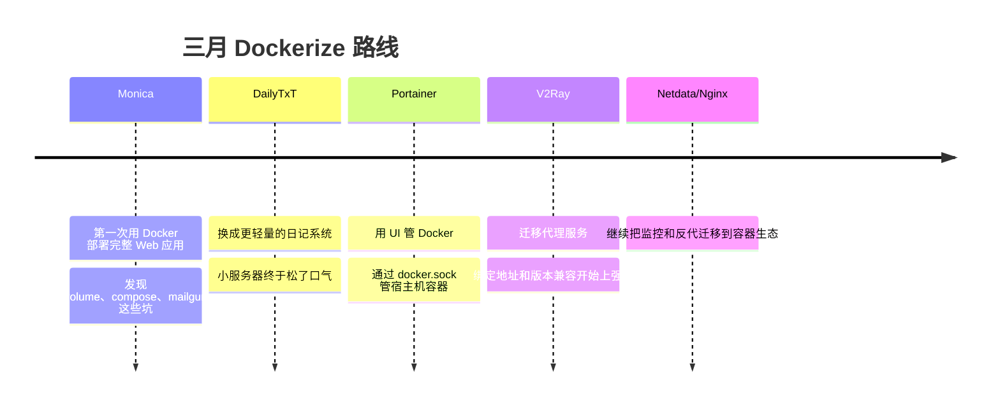
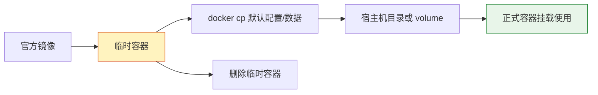
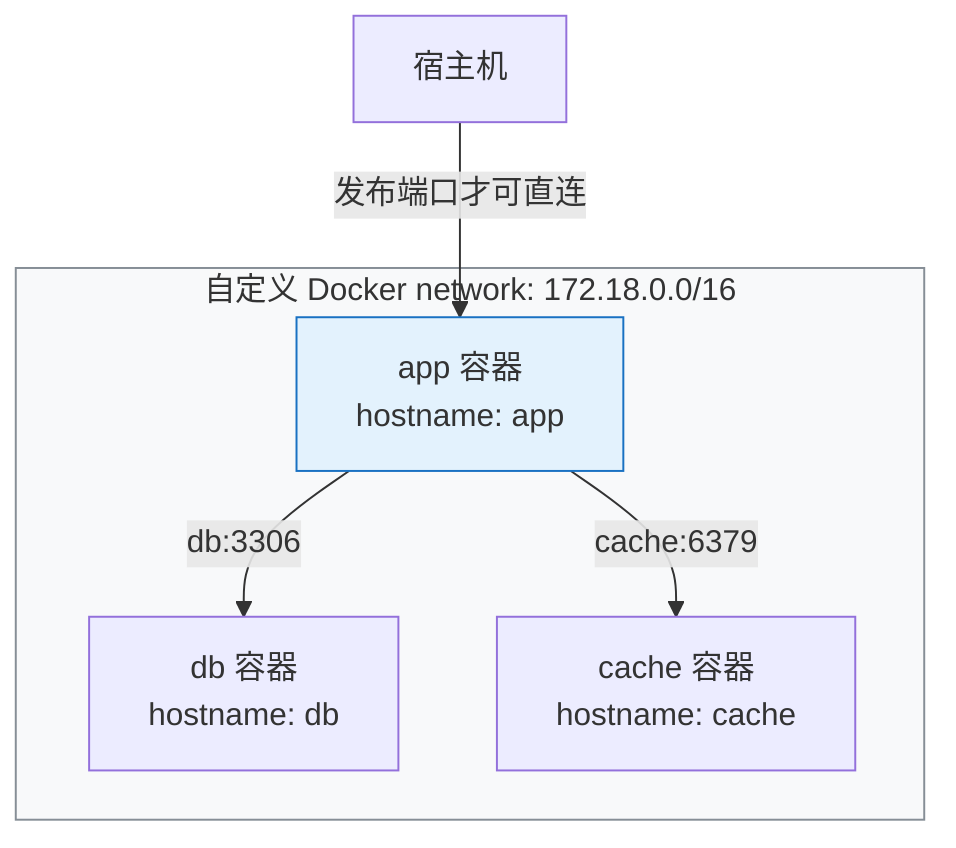
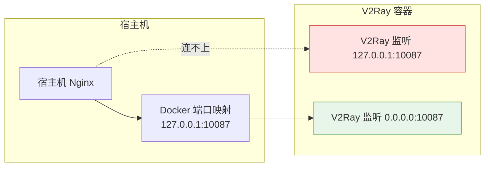

**三月是被docker打动的一个月。**

1. Table of Contents, ordered
{:toc}

# docker碎碎念
关于docker，之前很早我就有耳闻，前两年也简单了解了一下，去年甚至还简单改了一个下载youtube视频的工程，并打包成了docker镜像。但是真正系统地去了解docker，还是在最近。

为什么docker又被我摆到了台前？其实只是最近为了找一个日志记录的系统，记录一下自己平日里的碎碎念。找着找着就找到了monica，看起来还是比较满意的，就打算部署一下。正好部署的方式有docker，就想着借这个机会，维护一下docker服务吧，毕竟需求是学习的最大动力，有了需求自然会在为了满足需求的过程中，搞得越来越深入。

不得不说，思路还是很正确的。在这里就顺着这条思路，把自己最近dockerize的简单经验记录一下。

> dockerize这个词是我编的……

这篇不是 Docker 原理白皮书，而是一个 1G 内存小 VPS 的生活折腾路线：



# ~~monica~~
第一个部署的docker容器是[monica](https://github.com/monicahq/monica)，它本身是支持docker部署的，部署起来巨方便！尤其是我这种对前端技术几乎不了解的后端开发，docker部署前端的东西简直是救命神器！什么都不用管，只管自己关心的就行了。

一开始就直接按照文档在服务器上使用docker部署monica了，使用了几天觉得还不错，才看到更高阶的两种部署方式：
1. 使用volume持久化数据；
2. 使用docker compose，通过网络连接两个服务；

## docker数据copy
就创建了新的volume，把老数据从container里copy到新的volume上：
1. [把数据从container里copy出来](https://stackoverflow.com/questions/71427566/how-to-migrate-data-from-docker-container-to-a-newly-created-volume)
1. [把数据copy到volume里](https://stackoverflow.com/a/37469637/7676237)

虽然可以像copy实体数据一样直接把数据copy到实体数据里，但还是推荐上面这种docker的标准命令把数据从实体机copy到container的volume上。

无独有偶，这两天试图把netdata融化，也碰到了[类似copy数据的方式](https://learn.netdata.cloud/docs/agent/packaging/docker#host-editable-configuration)。搞个临时容器把数据copy出来，然后再删掉：
```bash
mkdir netdataconfig
docker run -d --name netdata_tmp netdata/netdata
docker cp netdata_tmp:/etc/netdata netdataconfig/
docker rm -f netdata_tmp
```
以后要是想获取哪个服务的默认配置，这种方式很方便啊！

这个套路可以抽象成：



数据拷出来之后，再把volume挂载到新的monica上，再然后monica就工作不正常了……

> 数据迁移这种东西，emmm，不是自己写的服务真就看运气……

## docker network
docker的网络确实很不错，直接使用linux内核的代码创建的网络，所以使用`ip addr`指令，是可以直接看到docker默认创建的`docker0`网络的。

用户还可以创建任意名称的网络，然后使用网络给不同容器组网：
1. 一个网络是一个封闭的网络，有一个网段；
3. 同一个网络内的容器会分配该网段的不同ip；
4. 同一网络内的容器，如果使用`--name`指定了容器名，不同容器之间可以直接通过容器名通信，相当于内置了DNS服务器。自动生成的容器名则不能被当做hostname使用。

Docker network 的直觉是“容器们住进同一个小区，彼此能叫名字串门”：



这一组网功能不禁让我想起了[自己当年做毕设时使用虚拟机组网](https://blog.csdn.net/puppylpg/article/details/64918562)的惨痛经历……

当年毕设时为了用StrongSwan配置IPSec，用VMWare搞了四台虚拟机组网，老实说，要不是最后搞到了实验室服务器的root密码，在配置牛逼的服务器上起的VMWare，那我毕设大概率不保了……看到docker轻轻松松用alpine和内置网络组了个集群后，只能说虚拟机一路走好~

这里推荐非常深入浅出的docker入门教程：
- [《深入浅出Docker》](https://book.douban.com/subject/30486354/)

不得不说，作者把深层次原理讲得相当简洁易懂，把docker的历史梳理地也很规整，这些对学习docker的技术本身都是有帮助的。翻译也很给力！

> 某effective java第三版的中文版简直就是翻译出了个屎……

最终，数据迁移失败。再加上后来好不容易配置mailgun搞定了monica的邀请功能，结果发现邀请功能很鸡肋，其实就是多个账户完全无差别地管理同一份数据……这个就比较扯了。导出数据也老报错，就放弃monica了。

# DailyTxT
放弃Monica，除了因为不太符合我的期待，还有一个原因是找到了[DailyTxT](https://github.com/PhiTux/DailyTxT)，一个非常轻量又好用的日记系统。随着对docker喜爱的加深，我现在几乎只找能docker部署的服务了，恰好dailytxt又支持docker，天作之合！

dailytxt的主要优点：
- 有日历；
- 可搜索；
- 能上传图片；
- 导入导出数据非常干脆利落；
- 哦，还有一点，很轻量化，内存占用很小，才40多兆。很适合小服务器部署。而Monica至少100M+的内存，200M+的swap，今天甚至有一刻把小服务器卡爆了。

> 1G内存的服务器狂喜。而Monica把服务器卡爆了的表现：CPU占用100%，发现基本都是系统占用的，load很高。后来看磁盘才发现是内存捉紧导致swap拉满，swap拉满会导致疯狂用磁盘，整个系统的cpu就拉满了，load爆高。关掉一个占内存的东西，啥都好了。

不过dailytxt也有不尽如人意的地方，比如：
- 一天不能post多条；
- 没有多条post所以不能分条显示；
- 自动保存太快了……而且都会产生历史记录，导出的时候也会带出来，我觉得太乱了；

之后打算改改dailytxt，顺便学学前端。

还想加一些新的东西：
- 打标签，所有标签可以显示在主界面，至少标签界面；
- 支持复制图片；

dailytxt通过docker compose启动前后端：
```java
dailytxt:
  image: phitux/dailytxt:latest
  container_name: dailytxt
  restart: always
  environment:
    # That's the internal container-port. You can actually use any portnumber (must match with the one at 'ports')
    - PORT=8765

    - SECRET_KEY=<TBD>

    # Set it to False or remove the line completely to disallow registration of new users.
    - ALLOW_REGISTRATION=True

    # Use this if you want the json log file to be indented. Makes it easier to compare the files. Otherwise just remove this line! 
    - DATA_INDENT=2

    # Set after how many days the JWT token will expire and you have to re-login. Defaults to 30 days if line is ommited.
    - JWT_EXP_DAYS=60
  ports:
    - "127.0.0.1:9999:8765"
    # perhaps you only want:
    # "<host_port>:8765"
  volumes:
    - "daily-txt-dc:/app/data/"
```

# portainer
docker部署应用是非常方便的！管理应用也不麻烦，但是每次敲那么长的docker命令效率还是有些低，自然而然就想找一个docker ui。

经过调研，主流的docker ui基本就两种：portainer和rancher。rancher公司里也在用，但是[根据我深入地观察](https://peppe8o.com/portainer-vs-rancher-comparison-between-the-2-docker-gui/)：
- rancher是为中大规模的docker准备的，比如k8s；
- 而portainer是为小docker集群或者独立docker准备的，而且占用内存特别小。

所以自然而然就装了portainer。

> 1G内存的服务器再次狂喜。portainer只占大概30M内存。

## docker socket
portainer的[安装文档](https://docs.portainer.io/start/install-ce/server/docker/linux)里面有一处比较有意思：
```bash
$ docker run -d -p 8000:8000 -p 9443:9443 --name portainer \
    --restart=always \
    -v /var/run/docker.sock:/var/run/docker.sock \
    -v portainer_data:/data \
    portainer/portainer-ce:latest
```

> 题外话：portainer 9443只支持https，所以nginx反向代理的时候也只能打https流量过来。

**启动的时候要把宿主机的docker unix socket挂载到了portainer docker容器里。**

我猜因为portainer本身是通过container起的，它把真正的docker的socket挂载到容器上，然后就可以通过这个socket读取宿主机上部署的docker的相关信息了。

后来找到一篇这个，基本验证了我的猜想：
- [Docker remote API 与 unix socket 相关说明](https://my.oschina.net/362228416/blog/812515)

> unix socket也是有其系统调用函数的，docker在上面也提供了查询接口。

> 2023年3月11日：其实就是[DooD]()。

Portainer 不是 Docker 的父进程，它只是拿到了宿主机 Docker Engine 的控制入口：

```mermaid
flowchart LR
    User[浏览器] --> Portainer[Portainer 容器]
    Portainer --> Sock[/var/run/docker.sock]
    Sock --> Engine[宿主机 Docker Engine]
    Engine --> C1[其他容器]
    Engine --> C2[镜像/网络/volume]

    style Sock fill:#fff3bf,stroke:#d9480f
    style Engine fill:#e8f5e9,stroke:#2b8a3e
```

有了ui，关闭、删除container，管理image、network、volume，查看container的运行状态，日志，方便了太多太多！对docker compose的支持也非常好！

## 升级portainer
因为portainer是手动在物理机上启动的，所以portainer的[升级](https://docs.portainer.io/start/upgrade/docker)只能在实体机上完成。

> portainer in portainer？hhh

```nginx
$ docker stop portainer

$ docker rm portainer

$ docker run -d -p 8000:8000 -p 9443:9443 --name portainer \
    --restart=always \
    -v /var/run/docker.sock:/var/run/docker.sock \
    -v portainer_data:/data \
    portainer/portainer-ce:latest
f6f2a0174d16dcd958bafd8da4eda142912591d81f10b673fb7805e3a9a23652
```

**关闭portainer，所有通过portainer启动的container都不会被关闭**！毕竟portainer只是一个工具，实际使用的是宿主机的`/var/run/docker.sock`，所以这些container都是portainer的sibling而非child。

> portainer拉取image的时候可能出现超时问题，可以考虑先在host上手动使用`docker pull`镜像，之后直接使用portainer创建container或者compose。

# v2ray
继续把服务器上现有的服务往docker上搬！v2ray，作为购买服务器的主力应用，首先考虑！

然而迁移v2ray的过程非常不顺利。

按照教程部署v2ray docker：
- [Docker 部署 V2Ray](https://guide.v2fly.org/app/docker-deploy-v2ray.html#%E6%9B%B4%E6%96%B0%E7%AD%96%E7%95%A5)

使用的是宿主机上已有的v2ray的配置，只不过为了保险起见，重新copy了一份`docker.config.json`作为container版v2ray的配置：
```nginx
docker run -d --name v2ray -v /etc/v2ray:/etc/v2ray -p 127.0.0.1:10087:10087 v2fly/v2fly-core:v4.23.4 v2ray -config=/etc/v2ray/docker.config.json
```

## docker container内网络绑定
第一个碰到的问题就是，之前实体机v2ray的配置，为了不暴露给公网，绑定的是127.0.0.1。**如果container内的v2ray绑定这个ip，宿主机就连不上docker里的v2ray了！只有container自己内部才能访问它的v2ray应用**！

> 这和宿主机本机上的应用才能访问绑定127.0.0.1的应用一个道理。

这里最容易混淆：**容器里的 `127.0.0.1` 是容器自己，不是宿主机**。



改成绑定`0.0.0.0`之后，宿主机终于连上了container里的v2ray了，但依然无法使用。

正常的v2ray连接后：
```nginx
pokemon➜  v2ray  ᐅ  netstat -anp | grep 10086
(Not all processes could be identified, non-owned process info
 will not be shown, you would have to be root to see it all.)
tcp        0      0 127.0.0.1:10086         0.0.0.0:*               LISTEN      -
tcp        0      0 127.0.0.1:10086         127.0.0.1:37760         ESTABLISHED -
tcp        0      0 127.0.0.1:10086         127.0.0.1:37718         ESTABLISHED -
tcp        0      0 127.0.0.1:37760         127.0.0.1:10086         ESTABLISHED -
tcp        0      0 127.0.0.1:37784         127.0.0.1:10086         ESTABLISHED -
tcp        0      0 127.0.0.1:37806         127.0.0.1:10086         ESTABLISHED -
tcp        0      0 127.0.0.1:10086         127.0.0.1:37784         ESTABLISHED -
tcp        0      0 127.0.0.1:10086         127.0.0.1:37806         ESTABLISHED -
tcp        0      0 127.0.0.1:10086         127.0.0.1:37748         ESTABLISHED -
tcp        0      0 127.0.0.1:37718         127.0.0.1:10086         ESTABLISHED -
tcp        0      0 127.0.0.1:37748         127.0.0.1:10086         ESTABLISHED -
```
docker后的v2ray连接后：
```nginx
pokemon➜  v2ray  ᐅ  netstat -anp | grep 10087
(Not all processes could be identified, non-owned process info
 will not be shown, you would have to be root to see it all.)
tcp        0      0 127.0.0.1:10087         0.0.0.0:*               LISTEN      -
tcp        0      0 127.0.0.1:10087         127.0.0.1:59938         ESTABLISHED -
tcp        0      0 127.0.0.1:10087         127.0.0.1:59930         TIME_WAIT   -
tcp        0      0 127.0.0.1:59938         127.0.0.1:10087         ESTABLISHED -
tcp        0      0 127.0.0.1:10087         127.0.0.1:59934         TIME_WAIT   -
tcp        0      0 172.17.0.1:58536        172.17.0.3:10087        ESTABLISHED -

```

## 切换版本
这个让我想起了开启debug：
- [开启 debug 相关经验](https://post.smzdm.com/p/apzek86w/)

当应用出错后，与其乱猜，寻找开启debug日志的方法是个更靠谱的方案：
```nginx
2022/03/13 16:00:52 V2Ray 4.44.0 started
2022/03/13 16:01:20 [3187668690] app/proxyman/inbound: connection ends > proxy/vmess/inbound: invalid request from 114.249.24.222:0 > common/drain: common/drain: drained connection > proxy/vmess/encoding: invalid user: VMessAEAD is enforced and a non VMessAEAD connection is received. You can still disable this security feature with environment variable v2ray.vmess.aead.forced = false . You will not be able to enable legacy header workaround in the future.
```
查了一下，一堆相关问题：
- [相关讨论 1](https://91ai.net/thread-950258-1-1.html)
- [相关讨论 2](https://github.com/233boy/v2ray/issues/812#issuecomment-1066138522)

听说是从4.24起加入的，22年开始强制启用。所以我直接用4.23版本：
```nginx
docker run -d --name v2ray --restart=always -v /etc/v2ray:/etc/v2ray -p 127.0.0.1:10087:10087 v2fly/v2fly-core:v4.23.4 v2ray -config=/etc/v2ray/docker.config.json
```
这就是使用docker的方便之处——**一键启动 & 任意版本切换**！

还意外地发现，protainer能统计container累计的网络总使用量！这样一来，甚至不用去搬瓦工查看累计流量使用情况了~

# nginx
参考[Docker - 容器化Nginx](/life/2023/03/13/dockerize-nginx/)。

# netdata
参考[折腾小服务器 - netdata与nginx](/life/2021/12/08/vps-netdata-nginx/)。

和portainer类似的是，既然想监控宿主机的数据，那就需要把宿主机的相应文件挂载到container里：
```nginx
  -v /etc/passwd:/host/etc/passwd:ro \
  -v /etc/group:/host/etc/group:ro \
  -v /proc:/host/proc:ro \
  -v /sys:/host/sys:ro \
  -v /etc/os-release:/host/etc/os-release:ro \
```

# nginx-digest-auth
这是一个让我感触良多的使用docker的方式：nginx的digest auth模块并没有标准化，所以原作者就想用docker打包一个带有digest auth模块的nginx，做测试用。

在alpine里，下载一个标准nginx，下载digest auth模块，然后编译为nginx，并启动docker部署：
- [nginx digest auth Dockerfile](https://github.com/puppylpg/dockerfiles/blob/master/nginx-digest/Dockerfile)

最后就可以非常方便地使用构造好的镜像测试带digest auth的nginx了：
- [nginx-digest-auth-test 镜像](https://hub.docker.com/repository/docker/puppylpg/nginx-digest-auth-test)

# YoutubeDL-Material
[YoutubeDL-Material](https://hub.docker.com/r/tzahi12345/youtubedl-material)已经把youtube-dl封装好了，而且比我封装的好多了！

> 前端前端！

dockerhub真是个宝库:D github是源码的宝库，dockerhub是成品的宝库。

# 感想
docker的优点经过这么多个dockerize的实践，已经能总结出来一些了：
- 一键部署，不用安装、学习那些你不懂也完全不关心的应用框架；
- 应用的任意版本，随便切换；
- 想要魔改应用，直接做个docker镜像就行了，不污染宿主机软件运行环境；

| 折腾点 | Docker 带来的爽点 | 仍然会踩的坑 |
|--------|-------------------|--------------|
| 应用部署 | 一条命令起服务 | 数据必须明确放进 volume |
| 多服务组网 | 自定义 network + 服务名互通 | 宿主机、容器、桥接网的 localhost 不是一个东西 |
| 版本切换 | 换 tag 重启就能回滚 | 新旧协议/配置兼容照样要看日志 |
| 管理维护 | Portainer UI 很省事 | 挂 docker.sock 权限很大，别乱给 |

而docker相比VM，无需启动新的os这一非常轻量化的优点，让它变得非常好用！docker真的是划时代的技术！而docker和上述这些有趣有有用的应用，让人认识到，1G内存还是能干很多事的……

这是一个什么样的世界？它充满了武功秘籍——瞬间移动，隐身，七十二变，在这里应有尽有！更令人咂舌的是，所有的秘籍都一份份摆在你的面前，没有人故弄玄虚守口如瓶，甚至还有很多人眼巴巴看着你，鼓励你，教导你，希望你能好好研习其中的奥义！而你只是一介凡人，通过习得一项项技能，就能在这个世界上越来越游刃有余！而世界上，你这一类人终究只是少数，这就意味着大部分人其实都没有这些福利。这不是游戏的设定，这就是真实的世界！这就是真实的编程的世界！
