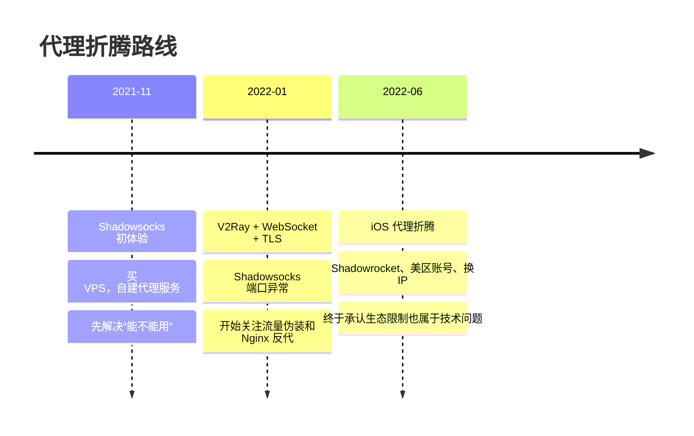

代理——从入门到装逼。其实也没多装，更多是被现实按着学网络：端口、PAC、VMess、WebSocket、TLS、Nginx、iOS 美区账号，一套组合拳下来，人都精神了。

| 文章 | 主要问题 | 关键词 |
|------|----------|--------|
| [代理 - shadowsocks](/life/2021/11/09/proxy/) | 代理是什么，怎么买 VPS 并自建 Shadowsocks | SOCKS、PAC、VPS、Shadowsocks |
| [代理 - v2ray](/life/2022/01/03/proxy-v2ray/) | Shadowsocks 端口异常后，如何用 V2Ray 做流量伪装 | VMess、WebSocket、TLS、Nginx |
| [RIP shadowsocks](/life/2022/06/03/proxy-rip-ss/) | 给 macOS/iPhone 配代理，以及被 iOS 和 GFW 双重教育 | Shadowrocket、iOS、美区账号、换 IP |

