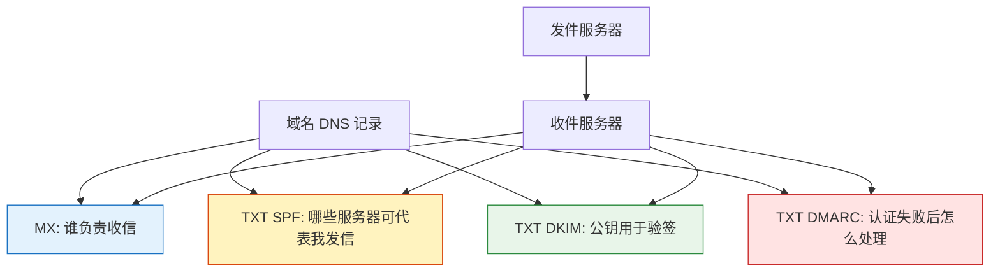
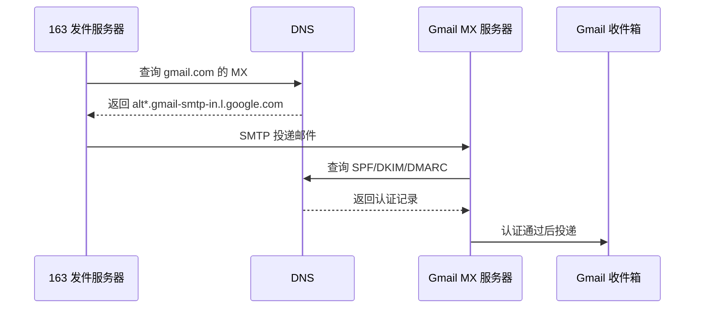
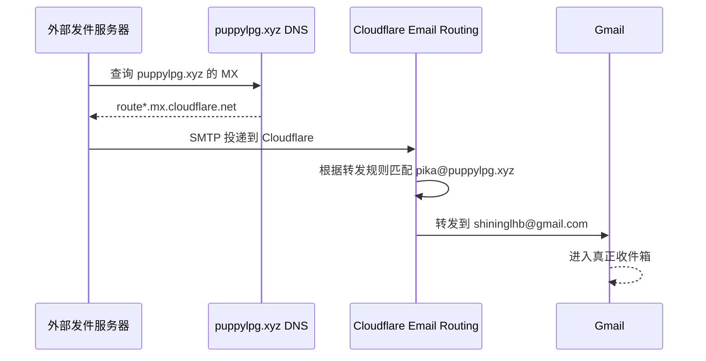
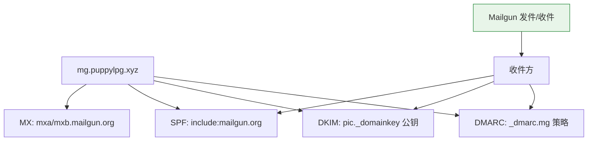
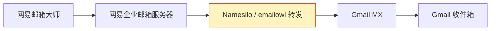

今天要把域名的Name Server（NS）从namesilo换成cloudflare，顺便把域名邮箱也切了过去。不如再顺便把去年搞的域名邮箱相关的书签清理掉。

> 为什么要切换NS？因为namesilo的NS实在没法跟cloudflare一较高下……

1. Table of Contents, ordered
{:toc}

# Prerequisite

邮件认证的方式主要有三种：
- SPF
- DKIM
- DMARC

依赖域名的TXT记录来完成。

> 关于MX记录和TXT记录，参考[Linux - dig & DNS]()。

先看整体关系：



# 邮件的安全认证
三种认证各管一段，不要混成一个东西：

| 机制 | 核心问题 | 查什么 DNS 记录 | 解决什么 |
|------|----------|-----------------|----------|
| SPF | 这个发件 IP 有没有资格代表该域名发信 | `TXT <domain>` | 防止陌生 IP 冒充发件域 |
| DKIM | 邮件关键内容有没有被授权签名，途中有没有被改 | `TXT <selector>._domainkey.<domain>` | 验证签名与部分内容完整性 |
| DMARC | SPF/DKIM 失败后收件方该怎么办 | `TXT _dmarc.<domain>` | 指定拒收、隔离、报告策略 |

## SPF
Sender Policy Framework，发件人策略框架，用于**验证发送邮件的服务器ip来自受信任的服务器**。

哪些服务器是受信任的服务器？域名里SPF策略记录的那些服务器就是受信任的服务器。

查看`163.com`的SPF记录，它用的是`spf.163.com`这个domain的规则：
```bash
[puppylpg:~]$ dig +short TXT 163.com
"57c23e6c1ed24f219803362dadf8dea3"
"google-site-verification=hRXfNWRtd9HKlh-ZBOuUgGrxBJh526R8Uygp0jEZ9wY"
"v=spf1 include:spf.163.com -all"
"qdx50vkxg6qpn3n1k6n1tg2syg5wp96y"
```

查看`spf.163.com`的规则，发现它又分成了`a.spf.163.com`，`b.spf.163.com`等：
```bash
[puppylpg:~]$ dig +short TXT spf.163.com
"v=spf1 include:a.spf.163.com include:b.spf.163.com include:c.spf.163.com include:d.spf.163.com include:e.spf.163.com -all"
```

其中，`a.spf.163.com`包含一大堆ipv4的ip：
```bash
[puppylpg:~]$ dig +short TXT a.spf.163.com
"v=spf1 ip4:220.181.12.0/22 ip4:220.181.31.0/24 ip4:123.125.50.0/24 ip4:220.181.72.0/24 ip4:123.58.178.0/24 ip4:123.58.177.0/24 ip4:113.108.225.0/24 ip4:218.107.63.0/24 ip4:123.58.189.128/25 ip4:123.126.96.0/24 ip4:123.126.97.0/24 ip4:103.74.28.0/24 -all"
```
所有这些ip的服务器发送的邮件，都可以说自己来自`@163.com`，其他ip的服务器发的邮件如果也这么说，就会被收件服务器判定为非法。

如果有其他发件服务器声称自己`From: 163.com`，就会被收件服务器拒绝，因为它的ip不在`spf.163.com`所列的那些ip里。

但是**SPF只能验证ip，相当于传统信封的封皮地址，不能验证邮件内容。必须和DMARC一起，才能验证出钓鱼邮件**。比如，163的发件服务器发出一封邮件，From为`163.com`，内容原本写的是“请来163注册邮箱”。但内容在转发的途中可以被修改成“请来qq注册邮箱”，此时邮件的来源ip依然是163服务器的ip，SPF不能验证这一点。大意的用户可能就信了这是一封来自qq的邮件。

> SPF是以DNS TXT record的形式记录在DNS里的。

## DKIM
DomainKeys Identified Mail，域名密钥识别邮件，**用来校验邮件是经过原始发件服务器授权的，且可以验证某些部分没有被篡改**。收件方通过查询发件方的公钥做这些校验。

发件服务器比如163.com给发出的邮件的某些部分做电子签名，收件服务器收到163.com的邮件，**先从163.com的DNS查到它的公钥，再拿公钥验签**。如果通过，说明签名部分的内容没有被中间的转发服务器篡改。这些行为对终端用户一般不可见。

做DKIM校验的邮件的邮件头会有私钥生成的签名，写入`DKIM-Signature` header，比如：
```yaml
DKIM-Signature: v=1; a=rsa-sha256; q=dns/txt; c=relaxed/relaxed; t=1624647686; s=m1; d=elastic.co; i=@elastic.co; h=Content-Type:MIME-Version:Subject:To:From:Date; bh=sDjq9gl31HAtML/Nbd8Y4Z08c3jiS9k9cjtFiTZrK9U=; b=k7ZiVMD8J3xE82ZOVGXbBWOAAzBbBNxsZMLGIo1/D66zw5ZF8CX84P1zcluGENNB cFEiJ+zxIgti86h7qDu1GtUMGftl1emPw0hwl67iYWYpTSRInC4RqixFpejSz9rylgZ dhvmdHP8PhnOR6BSGi0OLnEjP/3httZ3A/aLZ4Vs=
```
其中：
- `d`：domain；
- `s`：**selector，用于指定最终的域名，从该域名的TXT记录里可以获取public key信息**；
- `h`：用于签名的header。`From:`是必须要有的，其他可选；
- `bh`：body hash。未必是全文的hash，有可能截断到某个地方；
- `b`：**最终的签名的base64形式**。由body和选中的header生成；

其他kv对指定了其他细节，比如具体的签名算法等。

**`s` + `._domainkey` + `.<domain>` 就是获取公钥的域名**。对于上面的签名例子，s是`m1`，domain是`elastic.co`，所以域名是`m1._domainkey.elastic.co`：
```bash
[puppylpg:~]$ dig TXT m1._domainkey.elastic.co +short
"v=DKIM1;k=rsa;p=MIGfMA0GCSqGSIb3DQEBAQUAA4GNADCBiQKBgQDRuX6uJiu4rC0Ng4kUUFpS9UDVWEKHglP3qIETL720vy8G/ornMtb8THbuM0jhgKb575Yyd9rLNs1OCHhj+XpVt0Fhu2JkXOUNGG9iN6u1HjPokj3iRFNAqYl3xkFEOwjD+TmwYidiSVMZLElS2pZdDz2NdzMJDp8glCCaUnnoywIDAQAB"
```
其中：
- `v`: version;
- `k`: key type，其实就是公钥所用到的算法类型；
- `p`：public key；

验签步骤：SMTP服务器收到邮件，做TXT记录查询，用到上述domain和selector，可以从返回结果中得到public key。

比如：[用某网站查询工具](https://mxtoolbox.com/SuperTool.aspx?action=dkim%3aelastic.co%3am1&run=toolpage)查询上述public key，然后就可以用公钥验签了。


Ref：
- [DomainKeys Identified Mail](https://en.wikipedia.org/wiki/DomainKeys_Identified_Mail)

## DMARC
DMARC (Domain-based Message Authentication, Reporting and Conformance)，基于域名的消息认证、报告、一致性。
SPF和DKIM提供了不同的验证机制，DMARC提供了一种机制，指定验证方式（SPF或DKIM或都要），如何检查`From:`，指定验证失败后的处理策略，如何上报这些行为等。

**`_dmarc` + `.<domain>`就是查询DMARC策略的域名**：
```bash
[puppylpg:~]$ dig TXT _dmarc.elastic.co +short
"v=DMARC1; p=quarantine; pct=35; rua=mailto:postmaster@elastic.co"
```
其中：
- `v`: version;
- `p`: policy;
- `sp`: subdomain policy;
- `pct`: percent，邮件如果被判定为垃圾度超过阈值，则应用policy；
- `rua`: 接收报告的地址；

Ref：
- [DMARC](https://en.wikipedia.org/wiki/DMARC)
- [Mailgun: domain reputation and DMARC](https://www.mailgun.com/blog/deliverability/domain-reputation-and-dmarc/)
- [企业微信 DMARC 说明](https://work.weixin.qq.com/help?doc_id=524&helpType=exmail)

# 域名邮箱
域名邮箱，即以自己的域名为邮箱后缀。比如我自己的域名`puppylpg.xyz`的域名邮箱就是`@puppylpg.xyz`。

## 邮件收发基本原理
邮件发送主要是根据收件邮箱的域名，**查询收件邮箱的域名的MX记录，找到邮箱收件服务器地址**，然后使用smtp协议发送过去。

> 关于MX记录，参考[Linux - dig & DNS]()。

比如163发给gmail：
1. 根据`@gmail.com`查询域名`gmail.com`的MX记录；
2. 查到gmail收件服务器比如`alt3.gmail-smtp-in.l.google.com`；
3. 163发件服务器通过smtp协议发送邮件给刚刚查到的gmail收件服务器；



发送邮件还涉及到邮件认证，gmail服务器收到邮件后就会使用上面介绍的SPF、DKIM、DMARC等策略对邮件进行认证。**能够通过认证的邮件被收件方标记为垃圾的可能性更低。**

## 域名邮箱方案
理论上，想收发邮件需要自己部署邮件服务器。但一般不至于这么大动干戈，基本都是借用/租用别人的邮件服务器。

### 邮件接收：邮件转发
邮件转发可以在自己没有部署邮件服务器的场景下接收邮件。

比如我们想使用`@puppylpg.xyz`作为邮箱，但实际上并没有部署对应的邮件接收服务器，就只能通过一个邮件转发服务商：
1. **把自己域名的MX记录设置为该转发服务商，比如cloudflare**；
2. 发件服务器（比如`163.com`）在发送邮件给`@puppylpg.xyz`时，通过查询puppylpg.xyz的MX记录，找到了收件方为cloudflare，就把邮件发了过去；
3. cloudflare收到该邮件，会按照我们在其上配置的映射（比如把`pika@puppylpg.xyz`转发给`shininglhb@gmail.com`），把邮件转发给gmail邮件服务器；

下面是把cloudflare配置为邮件中转的MX记录和SPF记录：

| Record type | Hostname     | Priority | Value                                      | Status |
|-------------|--------------|----------|--------------------------------------------|--------|
| MX          | puppylpg.xyz | 26       | route1.mx.cloudflare.net                   | Added  |
| MX          | puppylpg.xyz | 65       | route2.mx.cloudflare.net                   | Added  |
| MX          | puppylpg.xyz | 28       | route3.mx.cloudflare.net                   | Added  |
| TXT         | puppylpg.xyz |          | v=spf1 include:_spf.mx.cloudflare.net ~all | Added  |


> MX records allow your domain to receive email. ~~The TXT record is configured to allow your domain to send incoming emails out to your preferred email provider.~~
> 
> [cloudflare本身并不能发送邮件](https://community.cloudflare.com/t/solved-email-routing-send-mail-as/338524/4)，所以加这个SPF记录并没有啥用……所以我又给删了……

设置后MX记录为：
```bash
$ dig MX puppylpg.xyz

; <<>> DiG 9.16.37-Debian <<>> MX puppylpg.xyz
;; global options: +cmd
;; Got answer:
;; ->>HEADER<<- opcode: QUERY, status: NOERROR, id: 32237
;; flags: qr rd ad; QUERY: 1, ANSWER: 3, AUTHORITY: 0, ADDITIONAL: 0
;; WARNING: recursion requested but not available

;; QUESTION SECTION:
;puppylpg.xyz.                  IN      MX

;; ANSWER SECTION:
puppylpg.xyz.           0       IN      MX      26 route1.mx.cloudflare.net.
puppylpg.xyz.           0       IN      MX      65 route2.mx.cloudflare.net.
puppylpg.xyz.           0       IN      MX      28 route3.mx.cloudflare.net.

;; Query time: 1339 msec
;; SERVER: 172.26.240.1#53(172.26.240.1)
;; WHEN: Tue Mar 07 23:04:16 CST 2023
;; MSG SIZE  rcvd: 162
```

Cloudflare 邮件转发链路如下：



### 邮件接收：收发平台
除了cloudflare，namesilo本身也提供这些服务，还有mailgun、sendgrid、postmark、sendinblue、migomail等更专业的邮件收发服务平台。mailgun作为专业的邮件收发平台，不止可以作为中转服务器，它自己也可以作为目的服务器，这样就可以集中转和收发件于一体，实际收发件服务器也都是mailgun自己的。

> mailgun还提供了收发件的api，可以程序化发送邮件。

参阅：
- [mailgun](https://www.logcg.com/archives/3245.html)
- [和mailgun类似的邮件转发](https://www.infoliquify.com/2020/08/24/%E4%BD%BF%E7%94%A8forward-email%E4%B8%BAgmail%E6%B7%BB%E5%8A%A0%E8%87%AA%E5%AE%9A%E4%B9%89%E5%9F%9F%E5%90%8D%E9%82%AE%E7%AE%B1/)
- [gmail + namesilo](https://www.owo233.xyz/index.php/archives/75/)

### 邮件发送：别名邮箱
邮件转发（email forwarding）只能做到接收邮件，想发送邮件的话需要找一个[能做email hosting的厂商](https://community.cloudflare.com/t/how-to-send-email-using-email-routing/330400/2)。比如mailgun，本身就支持发件。

除此之外，还可以使用gmail的别名邮箱功能，把`xxx@puppylpg.xyz`邮箱绑定为gmail邮箱的别名，就可以在gmail里以`xxx@puppylpg.xyz`的名义发件了。

主要步骤是：
1. gmail开启两步认证（2FA）；
2. gmail添加`xxx@puppylpg.xyz`作为别名邮箱；
3. `xxx@puppylpg.xyz`会收到一封确认邮件（所以要先配置邮件转发，不然`@puppylpg.xyz`根本收不到邮件）：是否让gmail添加你为别名邮箱；

确认之后，gmail就可以用`xxx@puppylpg.xyz`的名义发送邮件了……

> 比较奇怪的一个功能……跟上面的MX记录并没有什么关系。当时知道这个东西的时候震惊我一万年，但什么原理至今没搞懂。gmail发送的邮件是怎么通过spf/dkim/dmarc认证的？这个确认机制到底是什么机制？
>
> （实测163邮箱授权gmail别名邮箱，gmail以163的名义发送邮件之后，163的已发送里并没有该邮件。）

从用户视角看，Gmail 别名发件更像是“Gmail 允许你在 UI 里换一个 From”，而不是 Cloudflare 帮你发信：

```mermaid
flowchart LR
    Alias[xxx@puppylpg.xyz 别名] --> Confirm[先能收到确认邮件]
    Confirm --> GmailUI[Gmail 发信界面]
    GmailUI --> SMTP[Gmail SMTP 发出邮件]
    SMTP --> Receiver[收件方]
    Receiver --> Auth[检查发件认证与邮件头]

    style Confirm fill:#fff3bf,stroke:#d9480f
    style SMTP fill:#e3f2fd,stroke:#1971c2
```

参考：
- [Gmail 使用其他地址或别名发邮件](https://support.google.com/mail/answer/22370?visit_id=637762916561277309-3645915374&hl=zh-Hans&rd=1)
- [Gmail + Namesilo 配置记录](https://www.owo233.xyz/index.php/archives/75/)
- [Namesilo 的 Gmail reply-to/custom domain 说明](https://www.namesilo.com/Support/Gmail-Instructions-for-Reply~to-Using-Custom-Domain)

### 邮件发送：收发平台
如果用mailgun发件的话则会专业一些（现在要收费了），要配置的东西也会更多一些。需要修改自己的域名：
1. **增加TXT SPF记录为mailgun发件服务器**（所以需要发件的服务器才需要设置SPF，上线cloudflare也让我加SPF记录就很迷）；
2. **增加TXT DKIM记录为mailgun公钥**；
3. optional：增加TXT DMARC记录；

难得的是，mailgun支持子域名邮箱，比如`@mg.puppylpg.xyz`。这样只需对该子域名设置MX、TXT记录就行了。

收件——

MX:
```bash
$ dig MX mg.puppylpg.xyz +short
10 mxb.mailgun.org.
10 mxa.mailgun.org.
```

发件——

SPF:
```bash
$ dig TXT mg.puppylpg.xyz +short
"v=spf1 include:mailgun.org ~all"
```

DKIM:
```bash
$ dig TXT pic._domainkey.mg.puppylpg.xyz +short
"k=rsa; p=MIGfMA0GCSqGSIb3DQEBAQUAA4GNADCBiQKBgQCn9rosvzlLcT21TKh89No23Hp6adwpCHpPs2XtfQCuHAQ55h1T5urVV4oaqjol4h5nVmO6sYy94gJo7zfgDSPmiuZo4QA+1rZCGXY2GlS8y/vxx8lxLZ+evamlsGwHjIRhBh+qptAVKEswQEAeVUbWAADlGsto6sKG3oqXOfPNewIDAQAB"
```

DMARC:
```bash
$ dig TXT _dmarc.mg.puppylpg.xyz +short
v=DMARC1; p=none; pct=100; rua=mailto:re+felkad5zuuj@dmarc.postmarkapp.com; sp=none; aspf=r;
```

> postmark有一个[生成 DMARC 的网站](https://dmarc.postmarkapp.com/)：A free weekly email to help monitor & implement DMARC

下面是gmail收到mailgun的邮件后显示的认证情况：

| 邮件 ID    | <20220110082029.e772addef3bbc221@mg.puppylpg.xyz> |
|------------|---------------------------------------------------|
| 创建时间： | 2022年1月10日 16:20（已在 1 秒后递送）            |
| 发件人：   | Excited User <liuhaibo@mg.puppylpg.xyz>           |
| 收件人：   | shininglhb@gmail.com, shininglhb@163.com          |
| 主题：     | Hello from mailgun api, dmark verification?       |
| SPF：      | PASS，IP 地址：159.135.228.13。了解详情           |
| DKIM：     | 'PASS'，网域：mg.puppylpg.xyz。了解详情           |
| DMARC：    | 'PASS'。了解详情                                  |

认证均通过。

> 域名cloudflare是专业的，邮件mailgun是专业的。

Mailgun 方案相当于把一个子域名交给专业邮件平台：



# 其他
## 邮件中转记录
正常gmail发邮件给gmail，邮件流动记录是：gmail → mx.google.com → gmail

而别名邮箱发邮件给gmail，邮件流动记录是：gmail → smtp.gmail.com → gmail → mx.google.com → gmail。整个流程里多了发送我们配置的别名邮箱的邮件到smtp.gmail.com这一步。

邮件每中转一次会给mail生成一个Received header，可以在[gmail的message header](https://toolbox.googleapps.com/apps/messageheader/)对原始邮件的header进行分析：

| # | Delay | From *                   |   |          | To *                       | Protocol | Time received                 |
|---|-------|--------------------------|---|----------|----------------------------|----------|-------------------------------|
| 0 | 1 sec | unknown                  | → |          | mail-m17657.qiye.163.com   |          | 2021/12/31 GMT+8 上午10:48:55 |
| 1 | 7 sec | mail-m17657.qiye.163.com | → |          | mx1.emailowl.com           | ESMTPS   | 2021/12/31 GMT+8 上午10:49:02 |
| 2 | 2 sec | mx1.emailowl.com.        | → | [Google] | mx.google.com              | ESMTPS   | 2021/12/31 GMT+8 上午10:49:04 |
| 3 |       |                          | → | [Google] | 2002:a25:a28b::            | SMTP     | 2021/12/31 GMT+8 上午10:49:04 |
| 4 |       |                          | → | [Google] | 2002:a05:6512:33d2:0:0:0:0 | SMTP     | 2021/12/31 GMT+8 上午10:49:04 |

以上是我用namesilo做邮件转发所产生的记录：发件邮箱是`@rd.netease.com`，收件邮箱是自己的域名邮箱，域名邮箱通过namesilo转发给gmail。这里gmail作为自己的真正收件服务器：
1. 网易邮箱大师客户端发送邮件给网易企业邮箱服务器`mail-m17657.qiye.163.com`；
2. 网易企业邮箱发送邮件到namesilo收件服务器`mx1.emailowl.com`；
3. namesilo转发邮件到gmail收件服务器`mx.google.com`；

之后就可以在gmail里查看到发来的邮件了。（DNS配置的MX记录同步可能需要一段时间）



参阅：
- [邮件 header 分析](https://toolbox.googleapps.com/apps/messageheader/)
- [Received header 元素说明](https://www.pobox.help/hc/en-us/articles/1500000193602-The-elements-of-a-Received-header)
- 邮件header里的收发地址和邮件内容里的收发地址的区别：
    + [SMTP 中 RCPT TO 和 To 是否必须一致](https://stackoverflow.com/questions/10822190/in-smtp-must-the-rcpt-to-and-to-match)
    + [SMTP MAIL FROM 和 From header 不一致的合理原因](https://serverfault.com/questions/518119/legitimate-reasons-smtp-mail-from-will-not-match-from-header-in-data)
    + [为什么邮件需要 envelope](https://stackoverflow.com/questions/1750194/why-does-email-need-an-envelope-and-what-does-the-envelope-mean)

## 发件建议

发件不是发不出就完事儿了。要考虑接收被发出去的件被拉黑的feedback，并及时调整发件策略。否则整个发件服务器的ip都可能被搞黄：

- [怎么防止自己被标记为垃圾](https://support.google.com/mail/answer/81126)
- [查看哪些邮件被 Gmail 用户投诉](https://support.google.com/mail/answer/6254652)
- [使用 Postmaster Tools 统计域名发信表现](https://support.google.com/mail/answer/9981691)
- 一键退订：
    + [List-Unsubscribe header](https://mailtrap.io/blog/list-unsubscribe-header/)
    + [Gmail 的 unsubscribe 按钮如何工作](https://blog.1kcode.cn/gmail%E7%9A%84unsubscribe%E6%8C%89%E9%92%AE%E5%A6%82%E4%BD%95%E5%B7%A5%E4%BD%9C%E7%9A%84%EF%BC%9F/)
    + [一键退订实现说明](https://webpower.kf5.com/posts/view/1006613/)
    + [How to implement the List-Unsubscribe header](https://knowledge.validity.com/hc/en-us/articles/222445367-How-to-implement-the-List-Unsubscribe-header)
    + [The ultimate guide to List-Unsubscribe](https://www.litmus.com/blog/the-ultimate-guide-to-list-unsubscribe/)
- feedback loop:
    + [Email feedback loops](https://mailrush.io/blog/email-feedback-loops-everything-you-need-to-know/)
    + [Make sure you are in the feedback loop](https://www.emailvendorselection.com/starting-with-a-new-esp-make-sure-you-are-in-the-feedback-loop/)

# 感想
一个时代结束了。mail相关的书签就此删除~
