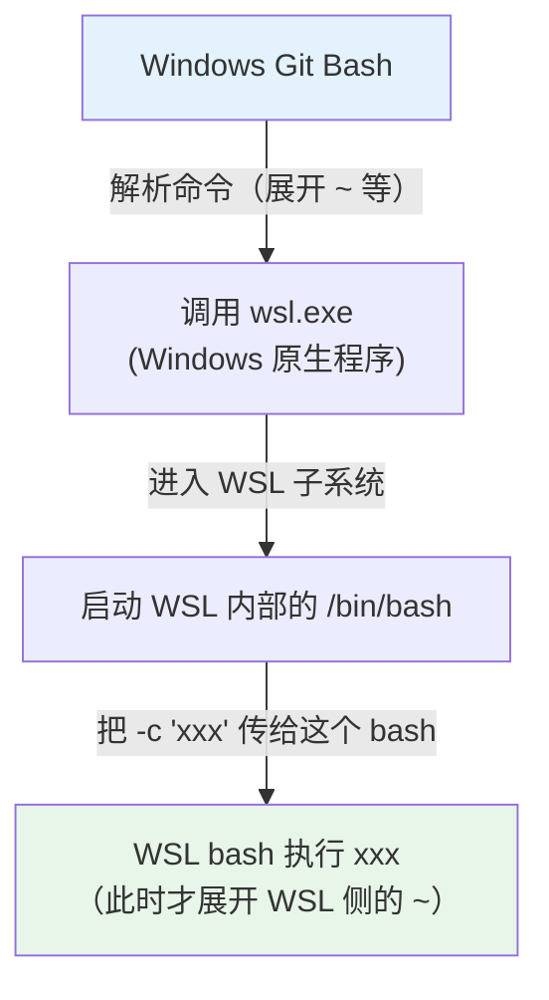
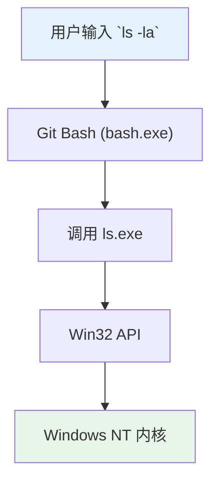
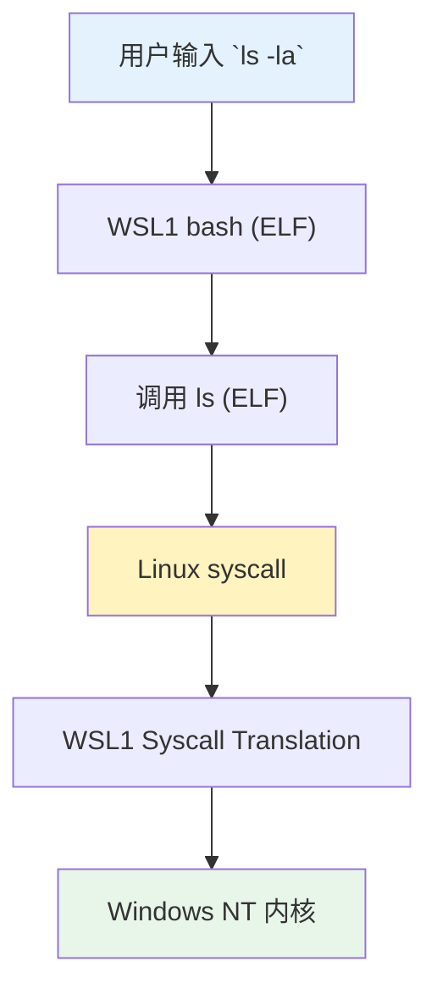
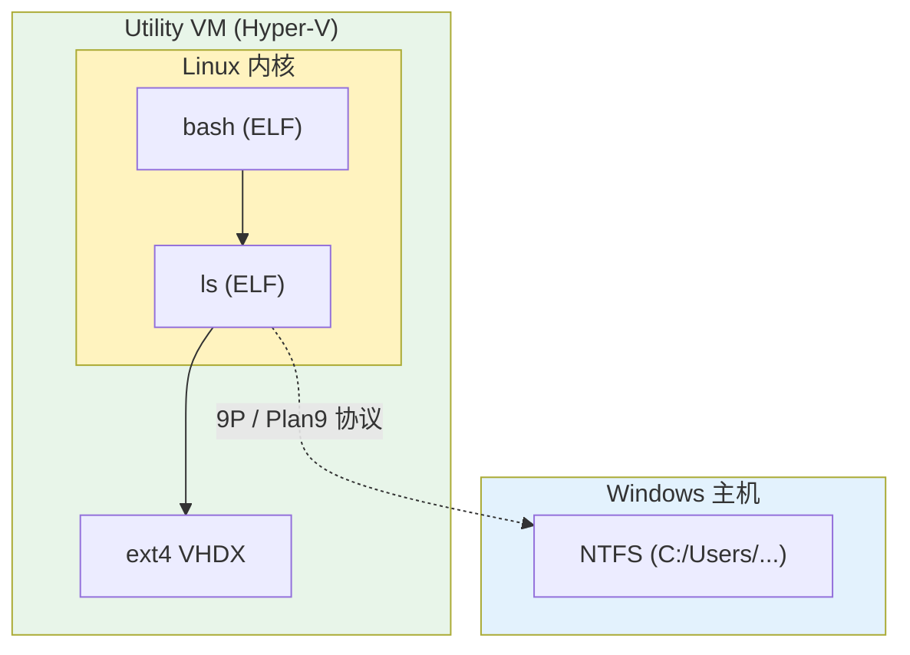

1. Table of Contents, ordered
{:toc}

## 前言

在 Windows 上搞开发，几乎每个人都会同时接触三个"类 Unix"环境：

- **PowerShell / CMD**：Windows 原生
- **Git Bash**：Git for Windows 附带的 Unix 风格 Shell
- **WSL**：Windows Subsystem for Linux，真正的 Linux 子系统

这三个环境表面上都能执行 `ssh`、`ls`、`docker` 等命令，但底层实现截然不同。本文围绕两个真实踩坑场景，系统梳理它们之间的差异。

---

## Git Bash 的本质澄清

### 它不是在"模拟 Linux"

Git Bash 的本质是 **MSYS2 的一个精简子集**。MSYS2 是一套把 Unix 工具链（bash、coreutils、openssh 等）重新编译成 Windows `.exe` 可执行文件的移植层。

这意味着：

- `ls` 实际是 `ls.exe`，调用的是 Windows API，不是 Linux 内核
- `ssh` 实际是 Windows 版 OpenSSH（或 MSYS2 重新编译的版本）
- `bash` 本身也是 `bash.exe`，跑在 Windows 上

**Git Bash 不是 Linux，它只是让 Windows 有了 Unix 的"外壳"和命令风格**。

### Git Bash vs WSL

| 特性 | Git Bash | WSL |
|------|----------|-----|
| 本质 | MSYS2 移植的 Unix 工具 + bash shell | 真正的 Linux 子系统（WSL2 基于轻量 VM） |
| 底层 | Windows API（`.exe` 程序） | Linux 内核 + 原生 ELF 二进制文件 |
| `ls` | `ls.exe`，调用 Windows API | 就是 Linux 的 `ls` |
| `ssh` | Windows 版 / MSYS2 重编译版 OpenSSH | Linux 版 OpenSSH |
| `~/.bashrc` | Git Bash 专用配置文件 | WSL 内部 Linux 的 bash 配置文件 |
| PATH 继承 | 从 Windows PATH 转换而来，带空格路径易截断 | 独立的 Linux PATH，与 Windows 隔离 |

理解这个区别是排查一切"为什么 Windows 行、WSL 不行"问题的前提。

---

## 场景一：SSH 免密登录差异排查

### 现象

在 Windows（Git Bash / PowerShell）中可以直接无密码 SSH 到局域网树莓派：

```bash
ssh pi@192.168.1.7
# 直接登录，无需输入任何密码
```

但在 WSL 中执行同样的命令：

```bash
ssh pi@192.168.1.7
# 提示：Enter passphrase for key '/home/win-pichu/.ssh/id_ed25519':
```

### 排查 Windows 侧

检查 Windows 上的 `~/.ssh` 配置：

- `~/.ssh/config` 中没有专门配置树莓派
- `~/.ssh/id_ed25519` 存在且**未设置 passphrase**（通过 `ssh-keygen -y -P '' -f ~/.ssh/id_ed25519` 验证成功）
- `ssh-agent` 未运行

结论：Windows 侧通过**未加密的私钥**自动完成了密钥认证。

### 排查 WSL 侧

最初在 Git Bash 中执行 `wsl ls -la ~/.ssh/` 时返回空目录，一度误判为 WSL 没有私钥。但用户截图显示 WSL 中 `ssh` 提示的是：

```
Enter passphrase for key '/home/win-pichu/.ssh/id_ed25519':
```

这说明 WSL 里**有私钥，但被 passphrase 加密了**。

对比两边的公钥后发现：**两把是同一对密钥**（公钥指纹完全一致）：

```
ssh-ed25519 AAAAC3NzaC1lZDI1NTE5AAAAIBAq8uh7g/Gf/S7rpKJCpVw+VplzTzR4uXmM3viFlmgW pichu@Archer
```

| 环境 | 私钥路径 | 加密状态 | 登录表现 |
|------|----------|----------|----------|
| Windows | `C:/Users/puppylpg/.ssh/id_ed25519` | 未加密 | 直接免密登录 |
| WSL | `/home/win-pichu/.ssh/id_ed25519` | 有 passphrase | 要求输入解锁口令 |

### 为什么 `wsl ls -la ~/.ssh/` 会返回空？

这个问题的根源是 **wsl 命令的路径解析层次**。`wsl` 命令的执行链条分为四层：



**错误命令**：

```bash
wsl ls -la ~/.ssh/
```

这里的 `~` 在**第一层（Windows Git Bash）**就被展开成了 `C:/Users/puppylpg/.ssh/`，wsl.exe 拿到的是 Windows 路径格式。WSL 里的 `ls` 看到 `C:/...` 要么找不到，要么解析异常，所以报了空。

**正确命令**：

```bash
wsl bash -c "cat ~/.ssh/id_ed25519.pub"
```

双引号把整串内容保护了起来，Windows Git Bash **不会展开引号里的 `~`**。它把参数原样传给 `wsl.exe`，再由 WSL 内部的 bash 去展开 `~`，自然就指向了 `/home/win-pichu/.ssh/`。

这个陷阱的根源在于：**Git Bash 太"热心"了，把本该留给 WSL 的 `~` 先吃掉了**。

### 修复

既然两把是同一对密钥，直接用 Windows 上未加密的私钥覆盖 WSL 中加密的私钥：

```bash
wsl bash -c "cp /mnt/c/Users/puppylpg/.ssh/id_ed25519 ~/.ssh/id_ed25519 && chmod 600 ~/.ssh/id_ed25519"
```

修复后 WSL 也能无密码 SSH 到树莓派。

---

## 场景二：Git Bash 找不到 docker 命令

### 现象

PowerShell 中执行 `docker --version` 正常输出：

```
Docker version 29.5.2, build 79eb04c
```

但 Git Bash 中：

```bash
docker --version
# bash: docker: command not found
```

### 根因：PATH 继承时带空格路径被截断

检查 Git Bash 的 PATH：

```bash
echo $PATH | tr ':' '\n'
```

输出中包含 `/cmd`，但明显缺少 `C:\Program Files\Git\cmd` 的前半部分。Git Bash 从 Windows PATH 转换路径时，`C:\Program Files\...` 这种**带空格的路径会被错误截断**。

同理，`C:\Program Files\Docker\Docker\resources\bin` 也在转换过程中丢失了。

### 修复：手动补 PATH 到 ~/.bashrc

在 Git Bash 的 `~/.bashrc` 末尾添加：

```bash
# NOTE: This ~/.bashrc is used by Git Bash on Windows (Git for Windows).
# It is NOT used by WSL, MSYS2, or any other "real" Linux Bash.
export PATH="/c/Program Files/Docker/Docker/resources/bin:$PATH"
```

> **重要**：Git Bash 的 `~/.bashrc` 位于 Windows 用户目录（`C:/Users/<用户名>/.bashrc`），它**仅被 Git Bash 读取**。WSL 有自己独立的 Linux 文件系统，WSL 里的 bash 不会读 Windows 侧的 `~/.bashrc`。

source 后验证：

```bash
source ~/.bashrc
docker --version
# Docker version 29.5.2, build 79eb04c
```

---

## 总结

在 Windows 上同时用 Git Bash 和 WSL，核心要理解三个层次：

1. **本质层**：Git Bash 是 Windows 上的 Unix 风格外壳 + 重编译的 `.exe` 工具集；WSL 才是真正的 Linux 兼容层。它们的 `~/.bashrc`、PATH、SSH 实现都是完全独立的。
2. **密钥层**：同一对 SSH 密钥在不同环境中私钥加密状态可能不同。Windows 和 WSL 的 `id_ed25519` 公钥相同，但私钥加密状态不同，会导致登录体验差异。
3. **交互层**：
   - `wsl` 命令中的特殊字符会被 Windows 侧 shell 先解析，使用 `wsl bash -c "..."` 可以保护命令串
   - Git Bash 继承 Windows PATH 时，带空格的路径（如 `C:\Program Files\...`）会被截断，需要在 `~/.bashrc` 中手动修复

掌握这套逻辑后，面对"为什么 Windows 行、WSL 不行"或"为什么 PowerShell 行、Git Bash 不行"的问题，都能快速定位根因。

---

## 参考命令速查

| 场景 | 命令 |
|------|------|
| 验证私钥是否未加密 | `ssh-keygen -y -P '' -f ~/.ssh/id_ed25519` |
| 跨系统复制私钥修复 WSL | `wsl bash -c "cp /mnt/c/Users/.../.ssh/id_ed25519 ~/.ssh/id_ed25519 && chmod 600 ~/.ssh/id_ed25519"` |
| 检查 Git Bash PATH | `echo $PATH \| tr ':' '\n'` |
| 为 Git Bash 补 Docker PATH | `echo 'export PATH="/c/Program Files/Docker/Docker/resources/bin:$PATH"' >> ~/.bashrc` |
| 保护 wsl 命令不被外层 shell 解析 | `wsl bash -c "..."` |

---

## 拓展阅读：Git Bash、WSL1 与 WSL2 的实现原理

上文将 WSL 作为一个整体与 Git Bash 对比，但在实际使用中，WSL 经历了两代截然不同的技术实现。如果把 Git Bash 也纳入进来，三者走的是完全不同的路线。

### Git Bash：Windows 假扮 Linux

Git Bash 的本质上文已经说得很清楚——它是 **MSYS2 的精简子集**，所有工具都被重新编译成了 Windows `.exe`，直接调用 Win32 API。它没有 Linux 内核，也没有系统调用翻译，只是一个"长得像 Linux"的 Windows 环境。



### WSL1：Windows 学 Linux 说话

WSL1 与 Git Bash 的表面相似之处在于**都不需要 Linux 内核，也不跑虚拟机**。但 WSL1 的底层完全不同——它使用了 Windows NT 的 **Pico Process** 机制，实现了一层 **系统调用翻译层（syscall translation layer）**。Linux ELF 二进制文件发起的 `open()`、`fork()` 等系统调用，会被翻译成对应的 Windows NT 内核调用。



**关键区别**：WSL1 运行的是**真正的 Linux ELF 二进制文件**，而 Git Bash 运行的是重新编译的 Windows `.exe`。WSL1 可以运行为 Linux 编译的原生软件包，Git Bash 则不行。

### WSL2：真 Linux 住进轻量公寓

WSL2 彻底换了路线——它**直接跑了一个真正的 Linux 内核**，但通过微软魔改过的**轻量级虚拟化技术**，让它不像传统虚拟机那样笨重。

WSL2 基于 Hyper-V，但**没有模拟完整硬件**（不虚拟显卡、不虚拟 BIOS），启动的是一个 "Utility VM" 精简环境：启动时间秒级、内存动态分配、没有传统 VM 的"开关机"概念。Linux 文件系统放在 **ext4 格式的 VHDX 虚拟磁盘** 中，因此 WSL2 内部访问自己的文件时性能极高；而访问 Windows 文件（`/mnt/c/...`）则需要跨 VM 边界，通过 9P/Plan9 协议挂载，速度明显更慢。



### 三者对比

| 特性 | Git Bash | WSL1 | WSL2 |
|------|----------|------|------|
| **内核** | 无，直接跑 Win32 | 无，syscall 翻译到 NT | **真正的 Linux 内核** |
| **虚拟化** | 无 | 无 | **轻量 Utility VM** |
| **二进制格式** | Windows PE (`.exe`) | Linux ELF | Linux ELF |
| **兼容性** | 仅限 MSYS2 工具 | 大部分 Linux 程序，内核特性受限 | **几乎完整 Linux 兼容** |
| **文件系统性能** | 原生 NTFS | 原生 NTFS | 内部 ext4 极快，跨系统访问慢 |
| **启动速度** | 即时 | 即时 | 秒级（首次）/ 近乎即时（后续） |
| **能否运行 Docker** | 否 | 否 | **能** |

### 一句话概括

> **Git Bash 是 Windows 假扮 Linux；WSL1 是 Windows 学 Linux 说话；WSL2 是真 Linux 住进了一个微软造的超轻量公寓里。**

这也是为什么 WSL2 能轻松跑 Docker、systemd、甚至带 GUI 的 Linux 应用，而 WSL1 和 Git Bash 都做不到——后两者本质上都不是 Linux。
