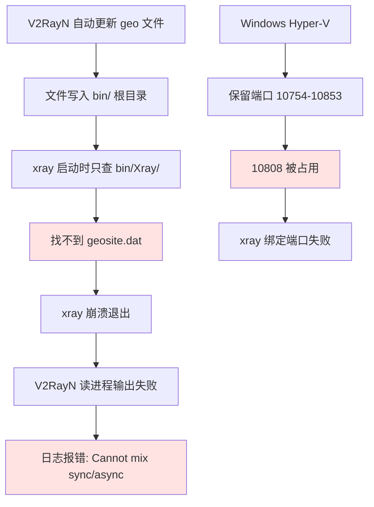

1. Table of Contents, ordered
{:toc}

---

## 现象：V2RayN 突然无法使用

某天 V2RayN 托盘图标还在，但浏览器无法翻墙。打开 V2RayN 日志，反复出现以下错误：

```
Cannot mix synchronous and asynchronous operation on process stream.
   at System.Diagnostics.Process.get_StandardError()
   at v2rayN.Handler.CoreHandler.CoreStart(ProfileItem node)
```

同时，系统代理设置中 `ProxyEnable` 为 `0`，端口 `10808/10809` 没有任何进程在监听。表面上看起来是 "core 失败"，但日志里的错误信息是 V2RayN 读取 xray 进程输出时抛出的**次生异常**，不是真正的根因。

---

## 第一层排查：进程与端口状态

先确认系统层面的状态：

| 检查项 | 状态 |
|--------|------|
| V2RayN GUI (v2rayN.exe) | ✅ 运行中 (PID 1484) |
| xray/v2ray 内核进程 | ❌ **未运行** |
| 10808 (socks) 端口监听 | ❌ 无 |
| 10809 (http) 端口监听 | ❌ 无 |
| 系统代理 (ProxyEnable) | ❌ `0`（已关闭） |

核心发现：**只有 GUI 外壳在跑，xray 内核根本没启动。** 这就是 "core 失败" 的本质。

---

## 第二层排查：手动运行 xray 定位根因

直接到 `bin/Xray/` 目录下手动启动 xray，让它把真实错误吐出来：

```bash
./bin/Xray/xray.exe -c guiConfigs/config.json
```

报错：

```
Failed to start: ... > failed to load geosite: CATEGORY-ADS-ALL
> failed to open file: geosite.dat
> open ...\bin\Xray\geosite.dat: The system cannot find the file specified.
```

**第一个根因浮出水面**：xray 在 `bin/Xray/` 目录下找不到 `geosite.dat`。

---

## 根因一：geosite.dat 文件错位

### 文件分布状态

| 位置 | geoip.dat | geosite.dat | 时间戳 |
|------|-----------|-------------|--------|
| `bin/` 根目录 | ✅ | ✅ | Jun 11 23:59 |
| `bin/Xray/` | ❌ | ❌ | — |

V2RayN 的自动更新机制把 geo 文件下载到了 `bin/` 根目录，但 xray 只在自己的目录（`bin/Xray/`）查找。

### 为什么会这样？

V2RayN 的目录架构设计：

```
bin/                    ← geo 文件放在这里（共享）
├── geoip.dat
├── geosite.dat
├── Xray/
│   └── xray.exe        ← xray 只认这个目录
├── v2fly/
├── sing_box/
└── ...
```

V2RayN 6.x 的设计假设是：**所有核心都能从 `bin/` 根目录加载 geo 文件**。但实际上 xray 的加载逻辑是：

1. 先检查环境变量 `V2RAY_LOCATION_ASSET`
2. 如果没设置，回退到**可执行文件所在目录**（`os.Executable()`）

测试证实了这个结论：

```bash
# 从任意目录启动 xray，它仍然去 bin/Xray/ 找
open ...\bin\Xray\geosite.dat: The system cannot find the file specified.
```

xray 的 `run` 子命令只有 `-c` 和 `-confdir` 参数，**没有 `-assets` 参数**，无法通过命令行指定 geo 文件路径。

### V2RayN 官方的态度

V2RayN 官方文档明确写了：

> "从 v6.0 版本开始，替换 geo 文件需要进入 bin 文件夹对所有支持路由规则的协议进行替换，包括 `Xray` `SagerNet` `v2fly` `v2fly_v5`。"

这说明作者**早就知道这个问题**，但选择了让用户手动复制，而不是程序自动同步。这是设计选择，不是 bug。

更有趣的是，V2RayN 作者 2dust 在 GitHub Discussion 中回复：

> "V2Ray 和 Xray 都是识别 `v2rayN/bin` 下的 geoip.dat 和 geosite.dat"

但我们的实验已经证明这是**错误的**——xray 26.3.27 默认只认自己的目录。

---

## 根因二：Windows 端口保留

手动修复 geo 文件后，xray 又报了新错误：

```
listen tcp 0.0.0.0:10808: bind: An attempt was made to access a socket
in a way forbidden by its access permissions.
```

检查 Windows 保留端口范围：

```
netsh int ipv4 show excludedportrange protocol=tcp

起始端口    结束端口
----------    --------
     10754       10853
     10876       10975
```

**10808 落在 `10754-10853` 的保留区间内。** 这是 Windows/Hyper-V/WSL2 动态保留的端口范围，重启电脑后会重新随机分配，大概率就腾出来了。

> 注意：这个问题和 geosite.dat 无关，是两个独立的问题恰好同时出现。但在排查时容易混淆，因为 xray 先崩在 geo 文件上，根本没走到端口绑定那一步。

---

## 深入分析：V2RayN 为什么不为 xray 设置环境变量？

xray 支持 `V2RAY_LOCATION_ASSET` 环境变量，设置后就能从任意目录加载 geo 文件：

```bash
V2RAY_LOCATION_ASSET="/path/to/bin" ./xray.exe -c config.json
# Configuration OK.
```

但 V2RayN 6.23 启动 xray 时**没有设置这个变量**。深入分析 V2RayN 的日志，发现它有两种启动路径：

- `CoreStart(ProfileItem node)`
- `CoreStartViaString(String configStr)`

可能在某些路径下遗漏了环境变量设置，导致 xray 回退到默认行为（只认自己目录），找不到 geo 文件就崩溃。

---

## 新版 xray 的验证

更新 xray core 到 26.3.27 后，再次测试：隐藏掉 `bin/Xray/` 下的 geo 文件，手动运行新版 xray，仍然报同样的错。这说明：

**新版 xray 并没有"变得更聪明"**，它依然只认自己的目录。之前能用的原因，是因为 `bin/Xray/` 下还有旧版 geo 文件（手动复制的），恰好兼容。

---

## 版本问题：6.x 为什么不提示升级 7.x？

V2RayN 6.23 的检查更新显示"已是最新"，但实际上 GitHub 上已经有 7.22.x。原因是：

| | 6.x | 7.x |
|--|-----|-----|
| UI 框架 | WPF（Windows 独占） | Avalonia（跨平台） |
| .NET 版本 | .NET 6.0 | .NET 8.0 / 10.0 |
| 配置文件 | 旧格式 | 新格式（不兼容） |
| 升级方式 | 自动更新 | "请手工下载覆盖更新" |

7.x 是**破坏性重构**，作者有意把 6.x 和 7.x 的更新通道隔开，避免用户误触升级导致配置丢失。SelfContained 版本的检查更新本身也受限，只查同大版本和核心/geo 更新。

---

## 总结与建议

### 故障链条



### 当前修复状态

1. ✅ `geosite.dat` / `geoip.dat` 已复制到 `bin/Xray/`
2. ✅ xray core 已更新到 26.3.27
3. ✅ 端口问题通过重启解决（Windows 重新分配保留范围）

### 长期建议

| 方案 | 操作 | 效果 |
|------|------|------|
| 手动同步 | 每次更新 geo 后 `cp bin/*.dat bin/Xray/` | 最稳妥 |
| Windows 硬链接 | `mklink /H bin/Xray/geosite.dat bin/geosite.dat` | 一劳永逸 |
| 关自动更新 | V2RayN 设置里关闭 geo 自动更新 | 避免再次触发 |
| 升级 V2RayN | 备份后手动安装 7.x | 但 7.x 数据结构不兼容，需重新配置 |

> 对于 V2RayN 6.23 + SelfContained 用户，最省心的方案是每次 geo 更新后手动复制文件，或建立硬链接。升级 7.x 不是必须的，而且可能引入新的兼容性问题。
