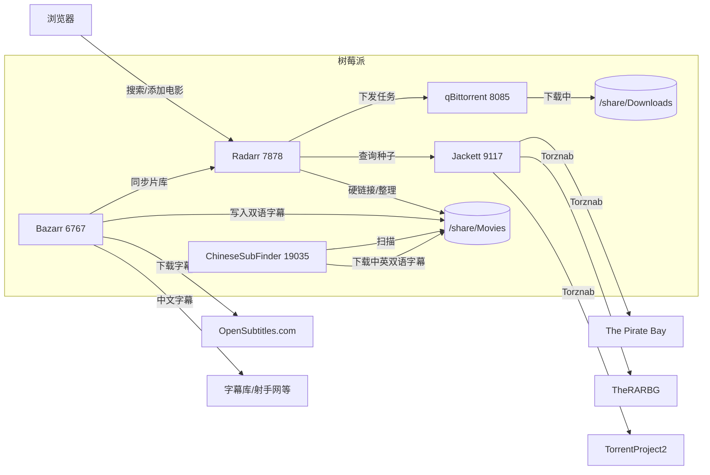
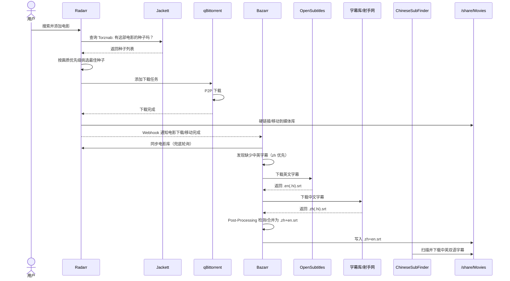

> **⚠️ 安全警告**：本文会公开本实验环境的登录地址、账号、密码和 API Key。这些凭证在发布后即视为已泄露，**请勿直接用于生产环境或长期暴露的服务**。建议读者在复现时替换为自己的强密码，并在公网访问时加 VPN/反向代理 + HTTPS。

## 1. 目标

让树莓派变成一个可以通过网页操作的“电影下载站”：

1. 打开网页搜索电影。
2. 选择想下载的版本（优先 4K）。
3. 自动通过 BT 下载到 Samba 共享目录 `/share/Movies`。
4. 自动下载中英双语字幕并合并成一条 bilingual 字幕。

## 2. 最终架构



### 2.1 各服务职责

**Radarr**：电影收藏管理器（*arr 家族中的一员）。它维护一份“想看的电影”列表，自动追踪影片上映信息，决定应该下载哪个版本，并把下载任务发送给下载客户端。下载完成后，它还会把文件整理/重命名到媒体库目录。

**Jackett**：索引器聚合器。BT 站点（如 The Pirate Bay）通常没有统一、机器可读的 API，Jackett 把它们封装成标准的 Torznab API，让 Radarr 可以用同一种方式查询多个站点的种子。

**qBittorrent**：BT 下载客户端，负责实际的 P2P 下载。Radarr 通过 qBittorrent 的 WebUI API 添加种子、监控进度；下载完成后把文件落到 `/share/Downloads`，再由 Radarr 硬链接/移动到 `/share/Movies`。

**Bazarr**：字幕管理器。它定期向 Radarr 索取电影库清单，比对哪些影片缺少指定语言的字幕，然后到 OpenSubtitles 等字幕站下载。本文配了一个后处理脚本，把下载到的英文和中文 SRT 按时间轴合并成一条 bilingual 字幕。

**ChineseSubFinder**（可选补充）：专攻中文字幕的工具，会去字幕库、射手网等中文站点匹配并下载中英双语字幕。它直接扫描 `/share/Movies`，和 Bazarr 并行工作，作为中文字幕来源的兜底/增强。当前 `latest` 镜像带一个轻量 WebUI，但只能查看电影列表封面、控制系统状态和任务日志，**不能点进电影详情页手动搜索/上传字幕**；手动指定字幕只能直接把 `.srt`/`.ass` 文件放进电影目录。

### 2.2 工作流时序



时序说明：

1. 用户在 Radarr 搜索并添加电影。
2. Radarr 通过 Jackett 的 Torznab 接口查询索引站点。
3. Jackett 返回候选种子，Radarr 根据画质配置挑选最优版本。
4. Radarr 把种子推给 qBittorrent，qBittorrent 开始 P2P 下载。
5. 下载完成后，Radarr 把文件整理到 `/share/Movies`。
6. **Radarr 通过 Webhook 主动推送事件给 Bazarr**（电影下载/移动完成）；同时 **Bazarr 也会定期轮询 Radarr 的电影库**做兜底同步。
7. Bazarr 发现缺字幕后去 OpenSubtitles/中文字幕站下载；语言 profile 中 `zh` 优先于 `en`，如果 `.zh.srt` / `.zh.hi.srt` 本身已是中英双语，后处理脚本会直接复制为 `.zh+en.srt`。
8. 每次下载字幕后，Bazarr 调用后处理脚本，把中英两条 SRT 合并为一条 bilingual 字幕。
9. （可选）ChineseSubFinder 也会扫描 `/share/Movies`，从中文站点补充下载中英双语字幕。

### 2.3 为什么这些名字都这么奇怪？

这套工具的名字看着像黑话，其实大多是有意为之的双关或谐音梗。

**Radarr** 来自 **Radar**（雷达）+ `r`，寓意“扫描发现电影”。同属 *arr 家族的还有：

| 工具 | 用途 | 名字梗 |
|------|------|--------|
| **Sonarr** | 电视剧 | Sonar（声纳），像雷达一样扫描剧集 |
| **Lidarr** | 音乐 | Lid（盖子/眼睑），比较冷门的双关 |
| **Readarr** | 电子书/有声书 | Read（阅读）直接加 `r` |
| **Bazarr** | 字幕 | Bazaar（集市），字幕来自五湖四海 |
| **Prowlarr** | 索引器统一管理 | Prowl（ prowling，四处搜寻）|
| **Radarr** | 电影 | Radar（雷达）|

**Jackett** 则像是一件 **jacket（夹克）**，给形形色色、接口各异的 BT 站点套上一层统一外套，让它们都能以 Torznab 协议对外服务。

**qBittorrent** 里的 **q** 指它基于 **Qt** 图形框架开发；Bittorrent 就是 P2P 下载协议本身。

**Torznab** 是 **Torrent** + **Newznab** 的拼接。Newznab 是 Usenet 时代的 API 标准，Torznab 把它借用到 BT 世界，所以名字听起来像两种不同技术强行结婚生的孩子。

简单记法：

- 管电影的带“雷达”——**Radarr**
- 管字幕的像“集市”——**Bazarr**
- Jackett 是 BT 站的统一“外套”
- qBittorrent 就是实际干下载活的 BT 客户端

## 3. 环境信息

- 设备：Raspberry Pi，ARM64，8 GB RAM
- OS：Linux 6.12.87
- Docker：29.5.3，Docker Compose v5.1.4
- 已有服务：V2Ray（HTTP 代理 `127.0.0.1:10809`）、Portainer、AdGuard Home
- Samba 共享：`/share`，局域网地址 `192.168.1.7`
- Docker 默认网桥网关：`172.18.0.1`，容器内通过 `172.18.0.1:10809` 走宿主机 V2Ray 代理

## 4. 部署步骤

### 4.1 创建目录

```bash
mkdir -p /share/Movies /share/Downloads
mkdir -p /home/pi/docker/qbittorrent/config
mkdir -p /home/pi/docker/radarr/config
mkdir -p /home/pi/docker/jackett/config
mkdir -p /home/pi/docker/bazarr/config/scripts
mkdir -p /home/pi/docker/chinesesubfinder/config
```

### 4.2 Docker Compose

在 `/home/pi/docker/compose.yml` 里追加以下服务（与已有的 v2ray 等共存）：

```yaml
  qbittorrent:
    image: linuxserver/qbittorrent:latest
    container_name: qbittorrent
    environment:
      - PUID=1000
      - PGID=100
      - TZ=Asia/Shanghai
      - WEBUI_PORT=8085
    volumes:
      - /home/pi/docker/qbittorrent/config:/config
      - /share/Downloads:/downloads
    ports:
      - "8085:8085"
      - "6881:6881"
      - "6881:6881/udp"
    restart: unless-stopped

  radarr:
    image: linuxserver/radarr:latest
    container_name: radarr
    environment:
      - PUID=1000
      - PGID=100
      - TZ=Asia/Shanghai
    volumes:
      - /home/pi/docker/radarr/config:/config
      - /share/Movies:/movies
      - /share/Downloads:/downloads
    ports:
      - "7878:7878"
    restart: unless-stopped

  jackett:
    image: linuxserver/jackett:latest
    container_name: jackett
    environment:
      - PUID=1000
      - PGID=100
      - TZ=Asia/Shanghai
      - HTTP_PROXY=http://172.18.0.1:10809
      - HTTPS_PROXY=http://172.18.0.1:10809
    volumes:
      - /home/pi/docker/jackett/config:/config
    ports:
      - "9117:9117"
    restart: unless-stopped

  radarr:
    image: linuxserver/radarr:latest
    container_name: radarr
    environment:
      - PUID=1000
      - PGID=100
      - TZ=Asia/Shanghai
      - HTTP_PROXY=http://172.18.0.1:10809
      - HTTPS_PROXY=http://172.18.0.1:10809
      - NO_PROXY=localhost,127.0.0.1,qbittorrent,radarr,jackett,bazarr
    volumes:
      - /home/pi/docker/radarr/config:/config
      - /share/Movies:/movies
      - /share/Downloads:/downloads
    ports:
      - "7878:7878"
    restart: unless-stopped

  jackett:
    image: linuxserver/jackett:latest
    container_name: jackett
    environment:
      - PUID=1000
      - PGID=100
      - TZ=Asia/Shanghai
      - HTTP_PROXY=http://172.18.0.1:10809
      - HTTPS_PROXY=http://172.18.0.1:10809
      - NO_PROXY=localhost,127.0.0.1,qbittorrent,radarr,jackett,bazarr,yts.gg,movies-api.accel.li,yts.mx
    volumes:
      - /home/pi/docker/jackett/config:/config
    ports:
      - "9117:9117"
    restart: unless-stopped

  bazarr:
    image: linuxserver/bazarr:latest
    container_name: bazarr
    environment:
      - PUID=1000
      - PGID=100
      - TZ=Asia/Shanghai
      - HTTP_PROXY=http://172.18.0.1:10809
      - HTTPS_PROXY=http://172.18.0.1:10809
      - NO_PROXY=localhost,127.0.0.1,qbittorrent,radarr,jackett,bazarr,yts.gg,movies-api.accel.li,yts.mx
    volumes:
      - /home/pi/docker/bazarr/config:/config
      - /share/Movies:/movies
      - /share/Downloads:/downloads
    ports:
      - "6767:6767"
    restart: unless-stopped

  chinesesubfinder:
    image: allanpk716/chinesesubfinder:latest
    container_name: chinesesubfinder
    environment:
      - PUID=1000
      - PGID=100
      - TZ=Asia/Shanghai
    volumes:
      - /home/pi/docker/chinesesubfinder/config:/config
      - /share/Movies:/media
    ports:
      - "19035:19035"
    restart: unless-stopped
```

注意：

- qBittorrent 的 WebUI 端口改成 `8085`，因为宿主机 `8080` 已被其他服务占用。
- Radarr/Jackett/Bazarr 不直接用内置代理，而是通过容器环境变量走 V2Ray，这样更稳定。
- 容器下载目录统一挂到 `/share/Downloads`，电影最终目录是 `/share/Movies`。
- ChineseSubFinder 的媒体目录在容器内是 `/media`，对应宿主机的 `/share/Movies`。

### 4.3 启动

```bash
cd /home/pi/docker
docker compose up -d qbittorrent radarr jackett bazarr chinesesubfinder
```

## 5. 各服务配置

### 5.1 qBittorrent

- 地址：`http://192.168.1.7:8085`
- 账号：`admin`
- 密码：`pi123456`

Radarr 里添加下载客户端时，主机填 `qbittorrent`，端口填 `8085`（因为容器内 qBittorrent 的 WebUI 监听的是 `8085`）。

### 5.2 Jackett

- 地址：`http://192.168.1.7:9117`
- API Key：`1gh53xjyx9l1djek69yas386y7wtcjoc`

配置步骤：

1. 进入 Jackett → Add indexer。
2. 添加以下公开索引器（推荐至少加 TPB）：
   - **The Pirate Bay**
   - **TheRARBG**
   - **TorrentProject2**
3. 在 Jackett 设置里的 Proxy 先留空，靠容器环境变量 `HTTP_PROXY`/`HTTPS_PROXY` 走代理。
4. 对每个 indexer 复制其 Torznab feed URL，例如：
   - TPB: `http://192.168.1.7:9117/api/v2.0/indexers/thepiratebay/results/torznab/`
   - TheRARBG: `http://192.168.1.7:9117/api/v2.0/indexers/therarbg/results/torznab/`
   - TorrentProject2: `http://192.168.1.7:9117/api/v2.0/indexers/torrentproject2/results/torznab/`

> 踩坑：Jackett 内置代理填 `127.0.0.1:12345` 会失败，因为容器内 `127.0.0.1` 不是宿主机。改成容器环境变量代理后正常。

### 5.3 Radarr

- 地址：`http://192.168.1.7:7878`
- API Key：`be67ae6612cc4061a7a2335723893305`

配置步骤：

1. **Settings → Media Management → Root Folders**：添加 `/movies`。
2. **Settings → Download Clients → Add → qBittorrent**：
   - Host：`qbittorrent`
   - Port：`8085`
   - Username：`admin`
   - Password：`pi123456`
3. **Settings → Indexers → Add → Torznab**：把 Jackett 里每个 indexer 都单独加一次：
   - URL：对应 indexer 的 Torznab URL
   - API Key：Jackett 的 API Key `1gh53xjyx9l1djek69yas386y7wtcjoc`
   - 当前已添加：TPB、TheRARBG、TorrentProject2
4. **Profiles → 编辑 Ultra-HD**：把画质优先级调整为：
   1. Remux-2160p
   2. Bluray-2160p
   3. WEB-DL-2160p
   - 禁用 HDTV-2160p，避免下载到低质量 4K。

#### Radarr 是怎么决定下载哪个版本的

Radarr 做决策时主要考虑三个维度：**可用性**、**画质** 和 **索引器来源**。

**可用性：Minimum Availability**

- 路径：添加/编辑电影时的 **Minimum Availability**，或在 **Settings → Profiles** 里设置默认值。
- 它决定电影到什么阶段才允许开始搜索：
  - **Announced**：刚加入 Radarr 就搜索，通常没资源；
  - **In Cinemas**：院线上映后搜索，可能下到枪版；
  - **Released**：蓝光/流媒体正式发行后搜索，资源最稳，**推荐**。
- 建议保持 **Released**，避免下到预告片或枪版。

**画质：Quality Profile**

- 路径：**Settings → Profiles**
- 每个 profile 是一组画质的排序列表，Radarr 会优先选择排在前面的画质。
- 当前预置 profile 有：Any、SD、HD-720p、HD-1080p、Ultra-HD、HD - 720p/1080p。
- 想优先 4K，就给电影指定 **Ultra-HD** profile。
- 如果 UI 支持设置 **Default Quality Profile**，可以把它设成 Ultra-HD；否则每次添加电影时手动选。
- 已经下载成 1080p 的电影，再改成 Ultra-HD 后，Radarr 会显示 "Cutoff Unmet"，但**不会自动重新搜索**。你需要手动进入电影页面点 **Search**，或者等 RSS 监控刷到新的 4K 种子。

**停止升级：Upgrade Until / Cutoff**

- 在 Quality Profile 里还有一个 **Upgrade Until**（也叫 Cutoff）设置。
- 它表示“达到这个画质后就不再继续升级”。
- 例如 Ultra-HD profile 里 Upgrade Until 设为 `Remux-2160p`，那么一旦下载到 Remux-2160p，Radarr 就会停止，不会再下载其他 4K 版本。
- 如果看到 `Release Rejected: Existing file meets cutoff: Remux-2160p`，说明当前文件已经满足 cutoff，这是正常行为。

**同一画质内继续升级：Custom Format Cutoff Score**

- 路径：**Settings → Custom Formats** 定义规则，**Settings → Profiles** 里设置 **Upgrade Until Score**。
- Custom Formats 让你给发布组、来源、音轨等属性打分。比如 `SPHD` +50、`Atmos` +20、`HMAX` -30。
- **Upgrade Until Score**（即 Custom Format Cutoff Score）是“满意分数”。
- Radarr 会升级，直到同时满足：**画质达到 Upgrade Until 且 Custom Format Score 达到 Upgrade Until Score**。
- 不折腾的话保持 `Upgrade Until Score = 0`，只按画质 cutoff 停止即可。

**索引器来源：Indexer Priority**

- 路径：**Settings → Indexers**
- 每个 indexer 有一个 **Priority** 数字，**越小越优先**。
- 当前配置：

| Indexer | Priority |
|---------|----------|
| TPB | 5 |
| TheRARBG | 10 |
| TorrentProject2 | 22 |

- 同一部电影、同一画质下，Radarr 会优先尝试 TPB，没有结果再 fallback 到 TheRARBG，最后 TorrentProject2。

**综合决策顺序**

1. 电影必须达到 **Minimum Availability** 才进入搜索池；
2. 按 **Quality Profile** 选最高可用画质，但不超过 **Upgrade Until**；
3. 如果启用了 Custom Formats，同一画质内继续升级直到 **Upgrade Until Score** 满足；
4. 在该画质下按 **Indexer Priority** 选优先级最高的 indexer；
5. 同一 indexer 多个结果中，优先选做种数多的种子。

### 5.4 Bazarr

- 地址：`http://192.168.1.7:6767`
- API Key：`db657bd7209430ebc1e25832b24c9d1b`

配置步骤：

1. **Settings → Languages → Add New Profile**：
   - Name：`中英双语`
   - Language items 用 alpha2 code：`en`、`zh`（不要写“英文”“中文”，会报 `ValueError: None is not a valid language`）。
2. **Settings → Providers**：启用以下字幕源，覆盖英文和中文：
   - **OpenSubtitles.com**：英文/多语言字幕较全，需要到 [OpenSubtitles.com](https://www.opensubtitles.com) 注册免费账号并填入用户名/密码。
   - **zimuku（字幕库）**、**subf2m**、**subx**、**shooter（射手网）**：中文字幕源，国内资源较多。
   - 启用后 Bazarr 会依次尝试这些 provider，直到下载到 `en` 和 `zh` 两条 SRT。
3. **Settings → Radarr**：
   - IP：`radarr`
   - Port：`7878`
   - API Key：Radarr 的 API Key `be67ae6612cc4061a7a2335723893305`
   - 启用后 Bazarr 会同步 Radarr 的电影库，自动判断哪些电影缺字幕。
4. **Settings → Languages → 编辑“中英双语” profile**：
   - 把 `zh` 拖到 `en` 上面，让 Bazarr 优先尝试下载中文字幕。
   - 很多中文字幕站返回的 `.zh.srt` 本身已包含英文，这样能更快得到 bilingual 字幕。
5. **Settings → Subtitles → Post-Processing**：
   - 启用 `Use Post-Processing`
   - Post-Processing Command：
     ```bash
     python3 /config/scripts/merge_bilingual_subs.py
     ```

> **关于 `.hi` 字幕**：Bazarr 下载的字幕有时会带 `.hi` 后缀，例如 `.en.hi.srt`、`.zh.hi.srt`。这里的 `hi` 是 **Hearing Impaired**（听障版）的缩写，除了对白还会标注 `[door slams]`、`[music playing]` 等音效。如果你不想下载这种带音效描述的字幕，可以在语言 profile 里取消勾选 `Hearing Impaired`；合并脚本已经兼容 `.hi` 命名，即使下到 HI 版也能正常合并成 `.zh+en.srt`。

#### Bazarr 与 Radarr 如何通信

两者同时存在**拉取**和**推送**两种机制：

- **Bazarr 主动拉取**：Bazarr 每隔一段时间（默认 60 分钟）调用 Radarr 的 `/api/v3/movie` 接口，获取完整电影库清单，判断哪些电影缺字幕。
- **Radarr 主动推送**：在 Radarr 的 **Settings → Connect → Bazarr** 里配置 Webhook 后，Radarr 会在电影下载完成、重命名、添加/删除等事件发生时，立即通知 Bazarr 去检查该电影的字幕。

 webhook 让字幕下载更及时，定期拉取则负责兜底同步。两个都配好是最佳状态。

#### 中英双语字幕的落盘形态

以电影 `Inception (2010).mkv` 为例，Bazarr 下载后会在同一目录下生成：

```
Inception (2010).mkv
Inception (2010).en.srt          # 英文原文字幕
Inception (2010).zh.srt          # 中文字幕（有些站点的 zh 字幕本身已含英文）
Inception (2010).zh+en.srt       # 后处理合并/复制的 bilingual 字幕
```

后处理脚本会先判断 `.zh.srt` / `.zh.hi.srt` 本身是否已经是中英双语（即字幕条目里已有大量英文行）。如果是，就直接把它复制为 `.zh+en.srt`，不再等待英文字幕；否则才用对应的英文字幕和 `.zh` 字幕合并。Bazarr 下载的字幕有时会带 `.hi`（hearing impaired，听障版）后缀，脚本也会正确处理。

播放时选择 `zh+en.srt`，屏幕上会同时显示中文在上、英文在下。是否生效取决于播放器对 SRT 多行文本的渲染方式；如果播放器只显示一行，可能需要换成支持双语的播放器（如 Kodi、VLC、PotPlayer 等）。

### 5.5 ChineseSubFinder（可选，专攻中英双语）

如果你的主要目标就是**单文件本身就是中英双语**的字幕，可以额外部署 [ChineseSubFinder](https://github.com/allanpk716/ChineseSubFinder)。它专门去字幕库、射手网等中文站点匹配并下载中英双语字幕，比 Bazarr 更聚焦中文字幕来源。

Docker Compose 追加：

```yaml
  chinesesubfinder:
    image: allanpk716/chinesesubfinder:latest
    container_name: chinesesubfinder
    environment:
      - PUID=1000
      - PGID=100
      - TZ=Asia/Shanghai
    volumes:
      - /home/pi/docker/chinesesubfinder/config:/config
      - /share/Movies:/media
    ports:
      - "19035:19035"
    restart: unless-stopped
```

配置文件 `/home/pi/docker/chinesesubfinder/config/config.yaml` 最小示例：

```yaml
UseProxy: false
HttpProxy: ""
TimeFormat: "yyyy-mm-dd"
SubSaveDirName: "chinesesubfinder"
Threads: 4
SubTypePriority: 0
DebugMode: false
SaveMultiSub: false
CustomVideoExts: ""
FixTimeLine: false
FFmpegPath: ""
FFprobePath: ""
AdvancedConfig: true
MediaPaths:
  - /media
```

启动后访问 `http://192.168.1.7:19035`：

- 默认账号：`admin`
- 默认密码：`shining0306FC`
- 首次登录后建议立即修改密码。

#### 关于这个版本的 WebUI

当前 `allanpk716/chinesesubfinder:latest` 镜像（最后一次更新为 2023-12-01）带的是一个**轻量 WebUI**，功能有限：

- ✅ 可以查看电影列表和封面；
- ✅ 可以控制系统状态、启动/停止守护进程；
- ✅ 可以查看任务日志；
- ❌ **电影卡片点不开详情页**；
- ❌ **不能在里面手动搜索或上传单部电影字幕**。

这意味着你不能像 Bazarr 那样在 ChineseSubFinder 的网页里点进电影选字幕。它只能作为一个后台自动扫描下载的兜底工具。

#### 手动指定字幕的方法

既然 WebUI 不能操作，手动指定字幕只能走文件系统：

1. 把字幕文件放到电影同目录，文件名和主视频文件同名：
   ```
   /share/Movies/Pressure (2026)/Pressure.2026.1080p...mp4
   /share/Movies/Pressure (2026)/Pressure.2026.1080p...chs.ass
   ```
2. 重启容器触发重新扫描：
   ```bash
   docker restart chinesesubfinder
   ```
3. 看日志确认它识别到已有字幕：
   ```bash
   docker logs -f chinesesubfinder
   ```

#### 必须有的 `.nfo` 元数据

ChineseSubFinder 扫描电影时需要目录里有 `.nfo` 元数据文件（通常由 Radarr 生成）。如果缺少 `.nfo`，日志会报：

```
no metadata file, movie.xml or *.nfo
```

此时 WebUI 里可能连电影封面都显示不出来，或者显示为无法点击的空白卡片。

**解决办法**：在 Radarr 里开启 metadata 生成：

1. Radarr → **Settings → Metadata**；
2. 启用 **Kodi (XBMC)** 或 **Emby**，勾选 `Movie Metadata` / `.nfo`；
3. 对已有电影执行 **Refresh & Scan** 或 **Organize**，让 Radarr 生成 `.nfo`；
4. 回到 ChineseSubFinder WebUI 点扫描，或 `docker restart chinesesubfinder`。

#### 版本状态

`allanpk716/chinesesubfinder:latest` 目前就已经是最新版，不要再指望更新它能获得完整 WebUI。作者已经明确转向 Lite 路线，全功能版本不再维护。如果你确实需要完整的电影详情管理界面，只能换用其他工具（例如主要依赖 Bazarr）。

### 5.6 双语字幕合并脚本

文件：`/home/pi/docker/bazarr/config/scripts/merge_bilingual_subs.py`

Bazarr 每次下载字幕后会调用该脚本，`BAZARR_SUBTITLE_PATH` 环境变量指向刚下载的字幕。脚本逻辑：

1. 从 `BAZARR_SUBTITLE_PATH` 的文件名里识别语言（支持 `.zh.srt` / `.en.srt`，以及 Bazarr 常见的听障版 `.zh.hi.srt` / `.en.hi.srt`）。
2. 如果下载的是 `.zh.srt` / `.zh.hi.srt`，先检测它本身是否已经是中英双语（字幕条目里有大量英文行）。
3. 如果是，直接复制为 `.zh+en.srt`。
4. 如果不是，且存在对应的英文字幕，则把两条字幕按时间轴合并成 `.zh+en.srt`。

```python
#!/usr/bin/env python3
"""
Bazarr post-processing script: merge Chinese and English subtitles into bilingual subtitle.

This script is called by Bazarr after a subtitle is downloaded.
It checks if both .zh.srt and .en.srt exist for the same video,
and creates a .zh+en.srt bilingual subtitle.

Environment variables provided by Bazarr:
- BAZARR_EPISODE_PATH / BAZARR_MOVIE_PATH: path to video file
- BAZARR_SUBTITLE_PATH: path to downloaded subtitle
- BAZARR_SUBTITLE_LANGUAGE: language of downloaded subtitle (en, zh, etc.)
"""

import os
import sys
import re
import glob
from pathlib import Path


def parse_srt(content):
    """Parse SRT content into list of (index, start, end, text)."""
    entries = []
    # Normalize line endings
    content = content.replace('\r\n', '\n').replace('\r', '\n')
    # Split by double newline
    blocks = re.split(r'\n\s*\n', content.strip())
    for block in blocks:
        lines = block.strip().split('\n')
        if len(lines) < 3:
            continue
        index = lines[0].strip()
        timing = lines[1].strip()
        text = '\n'.join(lines[2:]).strip()
        if not text:
            continue
        m = re.match(r'(\d{2}:\d{2}:\d{2},\d{3})\s*-->\s*(\d{2}:\d{2}:\d{2},\d{3})', timing)
        if not m:
            continue
        entries.append({
            'index': index,
            'start': m.group(1),
            'end': m.group(2),
            'text': text
        })
    return entries


def format_srt(entries):
    """Format entries back to SRT content."""
    output = []
    for i, e in enumerate(entries, 1):
        output.append(str(i))
        output.append(f"{e['start']} --> {e['end']}")
        output.append(e['text'])
        output.append('')
    return '\n'.join(output).strip() + '\n'


def is_bilingual_zh_srt(zh_path):
    """检测一个 .zh.srt 是否本身已经是中英双语字幕。

    判断逻辑：统计所有字幕条目，如果包含纯 ASCII/英文单词的行数
    占总行数一定比例，则认为该文件已经是中英双语。
    """
    try:
        with open(zh_path, 'r', encoding='utf-8-sig', errors='ignore') as f:
            entries = parse_srt(f.read())
    except Exception as e:
        print(f"Failed to parse {zh_path}: {e}")
        return False

    if not entries:
        return False

    total_lines = 0
    english_lines = 0
    for e in entries:
        for line in e['text'].split('\n'):
            line = line.strip()
            if not line:
                continue
            total_lines += 1
            # 包含连续英文字母/数字，且中文字符较少的行算作英文行
            has_ascii_word = bool(re.search(r'[a-zA-Z]{2,}', line))
            chinese_chars = len(re.findall(r'[\u4e00-\u9fff]', line))
            if has_ascii_word and chinese_chars < 3:
                english_lines += 1

    if total_lines == 0:
        return False

    ratio = english_lines / total_lines
    print(f"{zh_path}: {english_lines}/{total_lines} lines look English-only (ratio {ratio:.2f})")
    # 如果超过 30% 的行是英文，认为已经是中英双语
    return ratio >= 0.30


def create_bilingual_from_zh(zh_path, output_path):
    """直接把已有的中英双语 .zh.srt 复制为 .zh+en.srt。"""
    try:
        with open(zh_path, 'r', encoding='utf-8-sig', errors='ignore') as f:
            content = f.read()
        with open(output_path, 'w', encoding='utf-8') as f:
            f.write(content)
        print(f"Created bilingual subtitle from existing bilingual zh.srt: {output_path}")
        return True
    except Exception as e:
        print(f"Failed to copy bilingual subtitle: {e}")
        return False


def merge_subtitles(en_path, zh_path, output_path):
    """Merge English and Chinese subtitles."""
    with open(en_path, 'r', encoding='utf-8-sig', errors='ignore') as f:
        en_entries = parse_srt(f.read())
    with open(zh_path, 'r', encoding='utf-8-sig', errors='ignore') as f:
        zh_entries = parse_srt(f.read())

    if not en_entries or not zh_entries:
        print("Empty subtitle entries, skip merging")
        return False

    # Match entries by start time
    en_by_start = {e['start']: e for e in en_entries}
    merged = []
    for zh in zh_entries:
        start = zh['start']
        en = en_by_start.get(start)
        if en:
            # Chinese on top, English below
            text = f"{zh['text']}\n{en['text']}"
            merged.append({
                'start': start,
                'end': zh['end'],
                'text': text
            })
        else:
            merged.append(zh)

    # Add any English entries not matched
    zh_starts = {e['start'] for e in zh_entries}
    for en in en_entries:
        if en['start'] not in zh_starts:
            merged.append(en)

    # Sort by start time
    merged.sort(key=lambda x: x['start'])

    srt_content = format_srt(merged)
    with open(output_path, 'w', encoding='utf-8') as f:
        f.write(srt_content)
    print(f"Created bilingual subtitle: {output_path}")
    return True


def main():
    subtitle_path = os.environ.get('BAZARR_SUBTITLE_PATH', '')
    if not subtitle_path:
        print("No BAZARR_SUBTITLE_PATH, exit")
        sys.exit(0)

    sub_file = Path(subtitle_path)
    if not sub_file.exists():
        print(f"Subtitle not found: {subtitle_path}")
        sys.exit(0)

    # Determine video stem and language
    # Subtitle filename patterns:
    #   movie.en.srt, movie.zh.srt
    #   movie.en.hi.srt, movie.zh.hi.srt  (hearing impaired variant)
    name = sub_file.stem  # e.g. movie.en or movie.en.hi
    suffix = sub_file.suffix  # .srt
    parent = sub_file.parent

    parts = name.split('.')
    if len(parts) < 2:
        print(f"Cannot detect language from {name}")
        sys.exit(0)

    # Strip optional hearing-impaired marker so it doesn't confuse language detection
    if parts[-1].lower() == 'hi':
        parts = parts[:-1]

    if len(parts) < 2:
        print(f"Cannot detect language from {name}")
        sys.exit(0)

    lang = parts[-1].lower()
    stem = '.'.join(parts[:-1])  # movie

    def find_subtitle(parent, stem, lang, suffix):
        """Find a subtitle, preferring the .hi variant but falling back to plain."""
        hi_path = parent / f"{stem}.{lang}.hi{suffix}"
        if hi_path.exists():
            return hi_path
        return parent / f"{stem}.{lang}{suffix}"

    en_sub = find_subtitle(parent, stem, 'en', suffix)
    zh_sub = find_subtitle(parent, stem, 'zh', suffix)
    bilingual_sub = parent / f"{stem}.zh+en{suffix}"

    if lang == 'en':
        if zh_sub.exists():
            if is_bilingual_zh_srt(zh_sub):
                create_bilingual_from_zh(zh_sub, bilingual_sub)
            else:
                merge_subtitles(en_sub, zh_sub, bilingual_sub)
    elif lang == 'zh':
        if is_bilingual_zh_srt(sub_file):
            create_bilingual_from_zh(sub_file, bilingual_sub)
        elif en_sub.exists():
            merge_subtitles(en_sub, zh_sub, bilingual_sub)
        else:
            print(f"No English subtitle found and zh.srt is not bilingual, skip")
    else:
        print(f"Language {lang} not en/zh, skip merging")


if __name__ == '__main__':
    main()
```

给脚本可执行权限：

```bash
chmod +x /home/pi/docker/bazarr/config/scripts/merge_bilingual_subs.py
```

> 踩坑：Bazarr 语言配置里如果填“中文”“英文”会报 `ValueError: None is not a valid language`，必须用 alpha2 code `zh`/`en`。

## 6. 下载测试：《速度与激情 1》4K

1. 在 Radarr 搜索 `The Fast and the Furious`（2001）。
2. 选择 **Ultra-HD** 质量配置。
3. Radarr 通过 Jackett/TPB 找到 4K UHD BluRay 版本，约 18.67 GB。
4. 发送给 qBittorrent 开始下载。
5. 由于种子数只有 1-2，速度较慢，预计需要几天。
6. 下载完成后 Radarr 自动硬链接/移动到 `/share/Movies`。

如果速度太慢，可以随时在 Radarr 里把画质改成 1080p 重新搜索。

## 7. 访问地址与凭证汇总

| 服务 | URL | 账号 | 密码 / API Key |
| --- | --- | --- | --- |
| Radarr | `http://192.168.1.7:7878` | 无 | `be67ae6612cc4061a7a2335723893305` |
| Jackett | `http://192.168.1.7:9117` | 无 | `1gh53xjyx9l1djek69yas386y7wtcjoc` |
| qBittorrent | `http://192.168.1.7:8085` | `admin` | `pi123456` |
| Bazarr | `http://192.168.1.7:6767` | 无 | `db657bd7209430ebc1e25832b24c9d1b` |
| ChineseSubFinder | `http://192.168.1.7:19035` | `admin` | `shining0306FC` |

## 8. 踩坑与备注

1. **代理问题**：Jackett 内置代理在容器里对 `127.0.0.1` 解析错误，改用容器环境变量 `HTTP_PROXY=http://172.18.0.1:10809` 解决。
2. **qBittorrent 端口**：默认 `8080` 被占用，改为 `8085`，Radarr 里也要对应填 `8085`。
3. **Radarr 4K 画质**：需手动调整 `Ultra-HD` profile 优先级并禁用 `HDTV-2160p`。
4. **Bazarr 语言 code**：语言 profile 里必须用 `en`/`zh`，不能用中文名。
5. **字幕源**：OpenSubtitles.com 需要注册并填入账号密码，否则字幕下载会全部失败；ChineseSubFinder 默认账号 `admin`/`shining0306FC`，首次登录后建议修改。
6. **ChineseSubFinder 需要 `.nfo` 元数据**：如果日志报 `no metadata file, movie.xml or *.nfo`，WebUI 的电影卡片会点不开或显示异常。需要在 Radarr 的 **Settings → Metadata** 里启用 `.nfo` 生成，然后刷新/整理已有电影。
7. **`.hi` 后缀字幕**：Bazarr 下载的字幕可能是 `.en.hi.srt` / `.zh.hi.srt`（Hearing Impaired，听障版），原合并脚本只认 `.en.srt` / `.zh.srt` 会导致无法生成 bilingual 字幕。当前脚本已修复，支持 `.hi` 命名；如果不想下载 HI 字幕，可在 Bazarr 语言 profile 里取消勾选 `Hearing Impaired`。
8. **ChineseSubFinder 版本现状**：`allanpk716/chinesesubfinder:latest` 目前（2023-12-01 后未再更新）已经是最新版，且作者已转向 Lite 路线，更新也不会带来能点进电影详情页的完整 WebUI。需要手动管理字幕时，建议主要使用 Bazarr。
9. **安全**：以上凭证仅用于本实验，发布本文后应视为已泄露，建议尽快修改。

## 9. 后续可优化

- 给所有服务加上 HTTPS + 反向代理（Nginx/Caddy + Authelia/Authentik）。
- 用 Sonarr 扩展电视剧自动下载。
- 给 qBittorrent 设置完成后自动做种限制或分类标签。
- 把 OpenSubtitles / ChineseSubFinder 账号密码改为环境变量注入，避免手动在 UI 填写。
- 4K 下载慢时，可尝试加入更多公共索引器或 PT 站点。
