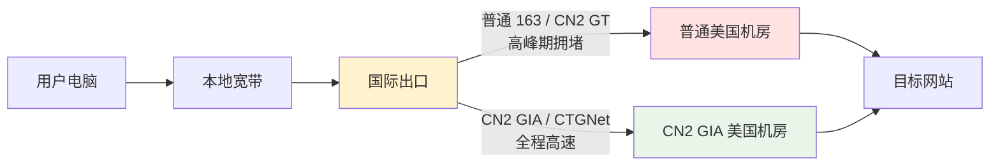
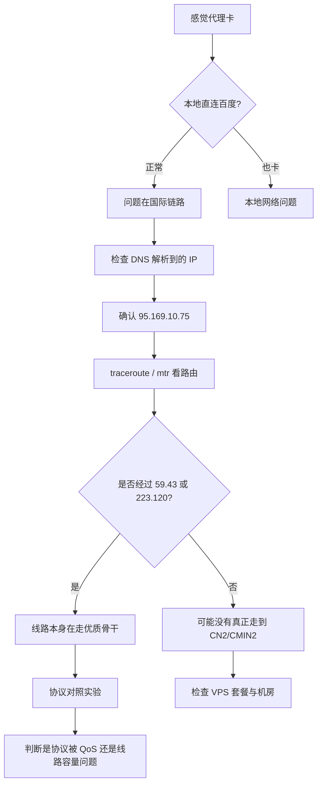
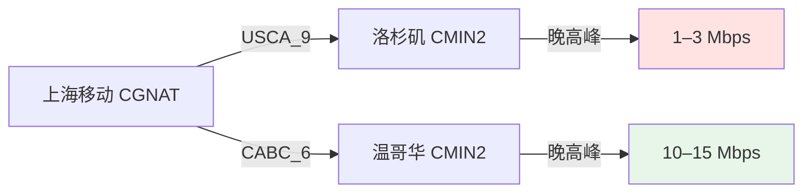

1. Table of Contents, ordered
{:toc}

## 背景

家里宽带是上海移动，出口在 CGNAT（`100.96.0.1`），本地代理客户端是 v2rayN，SOCKS 端口 `10808`。VPS 是搬瓦工，域名指向 `puppylpg.top`。

这篇文章按时间线记录了三件事：

1. **第一次迁移**：普通机房 `USCA_2` → CN2 GIA-E 机房 `USCA_9`；
2. **升级后又变慢**：定位到 CMIN2 晚高峰拥堵；
3. **第二次迁移**：洛杉矶 `USCA_9` → 温哥华 `CABC_6`。

## 第一次迁移：普通线路升级到 CN2 GIA-E

### 问题：v2ray 突然很卡

某天打开浏览器，通过 v2ray 访问 YouTube、Google 都慢得难以忍受。v2rayN 显示连接正常，但网页就是转圈。

先用 curl 走 socks5 代理测速：

```bash
curl -x socks5h://127.0.0.1:10808 -o /dev/null \
  -w "HTTP %{http_code}, 总耗时 %{time_total}s\n" \
  https://www.google.com/
```

结果：**HTTP 000，连接超时**。但本地直连百度却非常流畅（`0.07s`），说明问题不在本地宽带，而在代理链路。

检查端口监听，确认 xray 进程在跑：

```bash
netstat -ano | grep 10808
```

输出显示 `xray.exe` 正在监听 `0.0.0.0:10808`，进程本身没问题。

### 关键发现：DNS 污染 + 节点高丢包

用 `--resolve` 强制 Google 的正确 IP 再测试时，代理能打开 Google，只是很慢。这说明 socks5h 的远程 DNS 解析返回了被污染的 IP。

同时，ping 节点 IP `65.49.202.163` 的结果触目惊心：

```text
发送: 50， 收到: 36， 丢失: 14 (28% 丢包)
平均延迟: 185ms
```

**28% 的丢包率**，足以让任何基于 TCP 的代理体验崩溃。WebSocket + TLS 对丢包尤其敏感，每丢一个包就要重传，页面打开时间会被放大数倍。

### 为什么普通线路会这么差

中国电信的几类国际出口线路区别很大：

| 网络 | AS 号 | 特点 | 适用场景 |
|------|-------|------|---------|
| **163 / ChinaNet** | AS4134 | 最早的公众骨干网，容量大、便宜、高峰期极拥堵 | 普通访问 |
| **CN2 GT** | AS4809 接 AS4134 | 国际段走 CN2，进国内后走 163 | 中等质量 |
| **CN2 GIA** | AS4809 | 全程 CN2，质量最高、价格最贵、容量有限 | 视频会议、稳定代理 |
| **CTGNet** | AS23764 | 中国电信全球网络，实际等效于 CN2 GIA | 企业精品线路 |

[搬瓦工文档里对这几条线路的描述](https://bandwagonhost.com/cn2gia-vps.php)很准确：普通 163 和 CN2 GT 在晚高峰都会拥堵，只有 **CN2 GIA / CTGNet** 能提供稳定的跨太平洋连接。

我当时的 `20G KVM - PROMO` 套餐走的就是普通线路，位于 `USCA_2` 机房，所以高峰期丢包严重。



### 升级方案：CN2 GIA ECOMMERCE

搬瓦工提供了 `SPECIAL 20G KVM PROMO V5 - CN2 GIA ECOMMERCE` 套餐，年费 $169.99。由于当前套餐还有 159 天剩余，按未使用天数折算后补差价 **$48.83**，还能叠加一个 6.58% 的循环优惠码。

CN2 GIA 套餐可选多个机房。搬瓦工官方推荐洛杉矶 `USCA_9`，原因有三：

1. **容量最大**：8×10Gbps CN2 GIA/CTGNet 链路；
2. **三网优化**：电信 CN2 GIA + 移动 CMIN2 + 联通 CUP；
3. **对中国路由最好**：延迟通常 130–150ms。

### 迁移过程

1. 在搬瓦工后台提交升级到 CN2 GIA ECOMMERCE；
2. 进入 KiwiVM 的 **Migrate to another datacenter**；
3. 选择 `USCA_9`（DC9 AMD+NVMe, CT CN2GIA, CMIN2, CUP）；
4. 等待迁移完成，获取新 IPv4 地址；
5. 在 Cloudflare 把域名 A 记录从旧 IP `65.49.202.163` 改为新 IP `95.169.10.75`；
6. 本地执行 `ipconfig /flushdns`；
7. 重启 v2rayN，让 xray 重新解析域名。

迁移完成后，新 IP 是 `95.169.10.75`：

```text
发送: 50， 收到: 50， 丢失: 0 (0% 丢包)
平均延迟: 153ms
```

丢包直接归零，延迟也降了 30ms。

### 第一次迁移前后对比

| 指标 | 升级前（USCA_2 普通线路） | 升级后（USCA_9 CN2 GIA） |
|------|------------------------|------------------------|
| 节点 IP | 65.49.202.163 | 95.169.10.75 |
| Ping 丢包 | **28%** | **0%** |
| Ping 延迟 | 185ms | 153ms |
| 代理打开 Google | 3.78s | 0.84s |
| 代理打开 YouTube | 13.14s | 0.95s |
| 下载 10MB | 完全失败 | 3–6 Mbps |

本地直连百度的速度没有变化（始终在 `0.04s` 左右），证明改善完全来自国际线路质量的提升。

## 升级后又变慢：CMIN2 晚高峰拥堵

> 更新于 2026-06-28。

升级当晚的 benchmark 很漂亮，但过了几天我又感觉代理变卡——YouTube 缓冲、网页转圈，完全没体会到 CN2 GIA 的优势。于是我做了一次更深入的排查，甚至临时搭了一套 `VLESS + REALITY` 做对照实验。

### 排查思路

为了不凭感觉下结论，我从三个层面验证：

1. **本地网络**：确认不是家里宽带的问题；
2. **DNS 与路由**：确认流量真的走到了 CN2 GIA / CMIN2；
3. **协议对照**：在同一台 VPS、同一域名上，同时跑 `VMess + WebSocket + TLS` 和 `VLESS + REALITY`，看速度差异。



### 关键发现

#### 1. DNS 与 IP 没问题

`puppylpg.top` 仍然解析到升级后的 `95.169.10.75`，没有走 Cloudflare 代理，也没有解析回旧 IP。

#### 2. ICMP 被屏蔽，但 TCP 443 可达

```text
ping 95.169.10.75      # 全丢包
tracert 95.169.10.75   # 第三跳后全超时
```

一开始我以为 IP 不通，后来用 `Test-NetConnection` 测 TCP 443 发现是通的。这说明：**国际线路普遍屏蔽 ICMP，不能拿 ping 丢包判断代理质量。**

#### 3. 反向路由确认走了移动 CMIN2

从 VPS 侧做反向 traceroute 回我家公网 IP，路径很清晰：

```text
1  10.26.0.1        BWG 内网
2  10.26.255.0      BWG 内网
3  45.78.0.74       BWG/QuadraNet 上联
4  223.120.200.57   CMIN2（中国移动国际精品网）
5  223.120.197.1    CMIN2
6  223.120.161.5    CMIN2
...221.183.x.x...   中国移动国内骨干
```

**第 4 跳进入 `223.120.x.x`，说明 USCA_9 的 CMIN2 优化确实生效**，不是虚假宣传。

#### 4. VPS 本身不是瓶颈

- 负载 `load average` 只有 0.08；
- 到 GitHub 下载速度 **~400 Mbps**；
- 到中国移动北京 DNS ping 稳定在 **124ms**。

所以问题不在 VPS 的 CPU、网卡或带宽。

### 协议对照实验：VMess vs REALITY

我在同一台 VPS 上临时起了一个 Xray 容器，新增 `VLESS + Vision + REALITY` 监听 **8443** 端口（`dest` 用 `www.cloudflare.com`），然后本地分别用两种协议跑 50MB 下载测速：

| 协议 | Google 打开耗时 | 50MB 下载速度 |
|------|----------------|--------------|
| VMess + WS + TLS | 1.54s | **~8.4 Mbps** |
| VLESS + REALITY | 1.25s | **~6.5 Mbps** |

**结果出乎意料：两者速度差不多，REALITY 并没有更快。**

如果 VMess+WS+TLS 被移动 QoS 限速，REALITY 应该明显拉开差距。但实测没有，说明瓶颈不在协议层面。

### 结论：瓶颈在 CMIN2 容量

结合所有证据，最可能的结论是：

> **瓶颈在“我家移动宽带 → CMIN2 入口”这一段，以及 CMIN2 本身的容量。**

- 升级后的 VPS 是“对的”，线路也确实走了 CMIN2；
- 但 CMIN2 不是无限带宽，晚高峰该挤还是挤；
- 我家是移动 CGNAT（`100.96.0.1`），共享公网 IP，出口 QoS 由省移动决定；
- 同一时段 fast.com 能跑到 24 Mbps，但 Cloudflare 测速只有 6–8 Mbps，说明不同 CDN 路径差异也很大。

一句话总结：**CN2 GIA-E / CMIN2 不是没用，只是它不是魔法，救不了你家宽带到国际出口的最后一公里拥堵。**

实验结束后，我已把临时创建的 Xray REALITY 容器、配置文件、本地 Docker 测试容器全部删除。VPS 上只保留了原来的 V2Ray 服务，没有残留端口或配置。

## 第二次迁移：从洛杉矶迁到温哥华

> 更新于 2026-07-06。

既然瓶颈在 CMIN2，我开始考虑：**同一条 CMIN2 骨干上，不同的搬瓦工机房会不会因为用户密度或接入点不同而有差异？**

### 机房选择

搬瓦工后台当时给出的可选机房列表如下：

| 机房代码 | 完整名称 | 线路 / 硬件含义 | 主要优点 | 适合谁 |
|---------|---------|----------------|---------|--------|
| `USCA_6` | US: Los Angeles, California (DC6 CT CN2GIA-E, CMIN2, CUP) | 洛杉矶 DC6，电信 CN2 GIA-E + 移动 CMIN2 + 联通 CUP | 三网优化，与 DC9 同城市不同接入点 | 想留在洛杉矶但 DC9 拥堵的用户 |
| `USCA_9` | US: Los Angeles, California (DC9 AMD+NVMe, CT CN2GIA-E, CMIN2, CUP) | 洛杉矶 DC9，AMD+NVMe，电信 CN2 GIA-E + 移动 CMIN2 + 联通 CUP | 官方推荐，8×10Gbps，三网优化，容量最大 | 大多数中国用户的默认最优选 |
| `USCA_8` | US: Los Angeles, California (DC8 ZNET) | 洛杉矶 DC8，ZNET 普通线路 | 价格相对便宜 | 无中国优化需求，不推荐翻墙 |
| `USCA_2` | US: Los Angeles, California (DC2 AO) | 洛杉矶 DC2，普通线路（AO 为搬瓦工普通 KVM 接入） | 价格最低 | 无中国优化需求，不推荐翻墙 |
| `USCA_SJC5` | US: San Jose, California (CT CN2GIA-E, CMIN2, CUP) | 圣何塞，电信 CN2 GIA-E + 移动 CMIN2 + 联通 CUP | 三网优化，与 LA 不同的 CMIN2 接入点 | 西部用户，想尝试不同入口 |
| `USCA_FMT` | US: Fremont, California | 弗里蒙特，普通线路 | 价格相对便宜 | 无中国优化需求 |
| `USNJ` | US: New Jersey | 新泽西，普通线路 | 美国东海岸，普通访问 | 无中国优化需求 |
| `USNY_6` | US: New York (Coresite NY1) | 纽约 Coresite NY1，普通线路 | 东海岸机房 | 无中国优化需求 |
| `USNY_8` | US: New York (Coresite NY1 CN2GIA-E, CMIN2, CUP) | 纽约 Coresite NY1，电信 CN2 GIA-E + 移动 CMIN2 + 联通 CUP | 东海岸三网优化 | 美国东部或欧洲方向的用户 |
| `CABC_1` | CA: British Columbia, Vancouver (AMD-F+NVMe) | 温哥华，AMD-F + NVMe，普通线路 | 物理距离更近，硬件较好 | 无中国优化需求 |
| `CABC_6` | CA: British Columbia, Vancouver (AMD-F+NVMe, CN2GIA-E, CMIN2, CUP) | 温哥华，AMD-F + NVMe，CN2 GIA-E + 移动 CMIN2 + 联通 CUP | 三网优化，用户基数小于 LA，物理距离更近 | **本次最终选择，适合移动用户晚高峰尝试** |
| `EUNL_2` | EU: Amsterdam, Netherlands DC2 (AMD) | 阿姆斯特丹 DC2，AMD CPU，普通欧洲线路 | 欧洲访问好 | 主要访问欧洲，无中国优化 |
| `EUNL_9` | EU: Amsterdam, Netherlands DC9 (China Unicom Premium) | 阿姆斯特丹 DC9，联通精品线路（AS4837/AS10099） | 对联通用户优化 | 联通宽带用户 |
| `JPOS_1` | Japan: Osaka (Softbank) | 大阪，软银线路 | 亚洲低延迟，不经过 CMIN2，走软银国际 | 移动用户可赌，也可能出奇地好 |
| `JPTY_1` | Japan: Tokyo (AMD+NVMe, China Direct) | 东京，AMD+NVMe，China Direct | 亚洲低延迟，China Direct 对中国优化 | 电信/联通用户，追求低延迟 |
| `AEDXB_1` | UAE: Dubai | 迪拜，普通中东线路 | 中东访问 | 无中国优化需求 |

表里的缩写含义：

- **CT**：China Telecom（中国电信）
- **CN2GIA-E**：CN2 GIA ECOMMERCE，搬瓦工对中国优化的主力线路
- **CMIN2**：China Mobile International Network II，中国移动国际精品网
- **CUP**：China Unicom Premium，中国联通精品网
- **AMD / AMD-F**：AMD EPYC CPU，其中 `-F` 一般指高主频系列
- **NVMe**：固态硬盘类型，比普通 SSD 更快
- **China Direct**：日本/亚洲方向的对中国优化线路
- **Softbank**：日本软银运营商的国际线路

对上海移动用户来说，真正有中国优化的选项就这几类：

- **CMIN2 机房**：`USCA_6`、`USCA_9`、`USCA_SJC5`、`USNY_8`、`CABC_6`
- **软银**：`JPOS_1`
- **联通精品**：`EUNL_9`

纽约 `USNY_8` 物理距离太远，延迟会高出一截；`USCA_6`、`USCA_9`、`USCA_SJC5` 同线路族，换了大概率体验接近；`JPOS_1` 属于“要么很快、要么很卡”的玄学选项。真正值得一试的是 **温哥华 `CABC_6`**：

- 物理距离比洛杉矶更近；
- 用户基数明显小于 USCA_9；
- CMIN2 可能走不同的太平洋接入点。

### 迁移操作

2026-07-06 晚，在 KiwiVM 里提交 **Migrate to another datacenter**，选择 `CABC_6`。

迁移完成后收到新 IP：`65.49.231.45`。

然后：

1. 在 Cloudflare 把 `puppylpg.top` 的 A 记录从 `95.169.10.75` 改为 `65.49.231.45`；
2. 本地刷新 DNS。

这里遇到一个小坑：家里的路由器缓存了旧 A 记录，Windows 自带的 `ipconfig /flushdns` 清不掉路由器的缓存，本机 `nslookup` 一度还解析到旧 IP。最后把 WLAN 适配器的 DNS 手动改成 `1.1.1.1` / `8.8.8.8` 才解决。

```powershell
Set-DnsClientServerAddress -InterfaceIndex (Get-NetAdapter | Where-Object {$_.Status -eq 'Up'}).ifIndex -ServerAddresses @('1.1.1.1','8.8.8.8')
ipconfig /flushdns
```

确认解析正确后，重启 v2rayN，让 xray 重新解析域名。

### 迁移后实测

测试时间：2026-07-06 23:22（北京时间，晚高峰）。

本地网络：上海移动 `AS56048`，CGNAT 出口。

代理协议：`VLESS + XTLS Vision + REALITY`，端口 `8443`。

#### 洛杉矶 USCA_9 vs 温哥华 CABC_6

| 指标 | 洛杉矶 USCA_9 | 温哥华 CABC_6 | 变化 |
|------|--------------|--------------|------|
| 节点 IP | 95.169.10.75 | 65.49.231.45 | — |
| Ping 延迟 | 157–169ms，平均 **159ms** | 186–209ms，平均 **198ms** | 慢 39ms |
| Ping 丢包 | 0% | 0% | 持平 |
| 路由骨干 | `223.120.x.x` CMIN2 | `223.120.x.x` CMIN2 | 同一骨干 |
| 代理打开 Google | 1.03s | 1.32s | 基本持平 |
| 代理打开 GitHub | **15s 超时** | **5.72s** | ✅ 可用 |
| Cloudflare 10MB | **60.2s，约 1.3 Mbps** | **8.29s，约 9.6 Mbps** | ✅ **快 7 倍** |
| Cloudflare 25MB | **90s 仅下 11.5MB，约 1.0 Mbps** | **14.64s，约 13.7 Mbps** | ✅ **快 10 倍以上** |
| Cloudflare 50MB | 超时失败 | **6.06s，约 66 Mbps**（突发） | ✅ 能跑完 |
| 4 线程并发 10MB | 2 条速度为 0，2 条约 3 Mbps | 2 条约 4–6 Mbps，2 条约 0.6 Mbps | ✅ 整体更快 |

### 对比结论



- **骨干没有变**：洛杉矶和温哥华都走 `223.120.x.x` CMIN2；
- **延迟涨了 40ms**：温哥华物理距离更远，ping 从 159ms 涨到 198ms；
- **带宽大幅提升**：同样晚高峰，下载速度从 1–3 Mbps 提升到 10–15 Mbps，GitHub 从超时变成 5 秒打开；
- **仍然存在单流不公平**：4 线程里总有两条慢，说明 CMIN2 对单条 TCP 仍有 QoS 或拥塞调度，但温哥华机房的整体容量明显更充裕。

## 最终总结

这次优化经历了两个阶段：

1. **第一次迁移**解决的是“能不能连”的问题。从普通线路 `USCA_2` 升级到 CN2 GIA-E `USCA_9` 后，丢包从 28% 降到 0%，代理从“几乎不可用”变成“能用”。
2. **第二次迁移**解决的是“晚高峰快不快”的问题。在确认瓶颈是 CMIN2 容量而非协议或本地网络后，把机房从洛杉矶 `USCA_9` 迁到温哥华 `CABC_6`，晚高峰下载速度从 1–3 Mbps 提升到 10–15 Mbps。

### 三阶段对比总表

| 指标 | USCA_2 普通线路 | USCA_9 CN2 GIA-E（洛杉矶） | CABC_6 CN2 GIA-E（温哥华） |
|------|----------------|------------------------|------------------------|
| 节点 IP | 65.49.202.163 | 95.169.10.75 | 65.49.231.45 |
| 路由 | 普通 163/CN2 GT | `223.120.x.x` CMIN2 | `223.120.x.x` CMIN2 |
| Ping 延迟 | 185ms | **153ms** | 198ms |
| Ping 丢包 | **28%** | **0%** | 0% |
| Google 打开 | 3.78s | 0.84s | 1.32s |
| YouTube 打开 | 13.14s | 0.95s | — |
| GitHub 打开 | — | **15s 超时** | **5.72s** |
| 10MB 下载 | 完全失败 | **约 1.3 Mbps** | **约 9.6 Mbps** |
| 25MB 下载 | 完全失败 | **约 1.0 Mbps** | **约 13.7 Mbps** |
| 核心结论 | 普通线路高峰期丢包，几乎不可用 | 丢包归零，但晚高峰 CMIN2 拥堵 | 晚高峰带宽提升一个数量级 |

从这张表可以看出来，**第一次迁移解决的是“可用性”，第二次迁移解决的是“晚高峰速度”**。两次优化的方向不同，但缺一不可。

几个值得记住的点：

- **不要拿 ping 丢包判断代理质量**。国际线路普遍屏蔽 ICMP，TCP 443 通才是关键。
- **协议不是万能药**。从 VMess+WS+TLS 换到 VLESS+REALITY，速度没有质变，说明瓶颈在网络而不是协议。
- **同一条骨干的不同机房体验可以差很多**。USCA_9 和 CABC_6 都走 CMIN2，但用户密度和接入点不同，晚高峰速度差出一个数量级。
- **移动 CGNAT 是隐形天花板**。即使 VPS 端再快，本地宽带到国际出口的这一段被省移动 QoS 限制，整体速度也上不去。

如果未来还想继续优化，可以尝试：

- 在 v2rayN 里开 **MUX（多路复用）**，把多条连接合并成一条，绕过 CMIN2 的 per-flow 调度；
- 凌晨 01:00 再跑一次测速，确认是不是只有晚高峰才出现“两快两慢”；
- 如果预算允许，加一条电信或联通线路做备用，移动拥堵时切过去。

目前先用 `CABC_6` 温哥华，体验比洛杉矶好一个档次。
