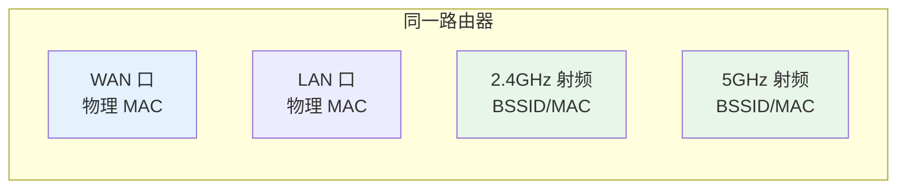
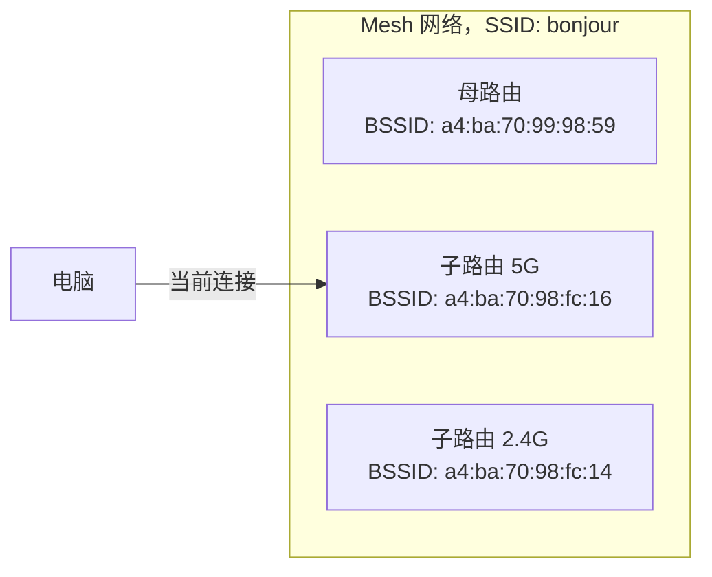
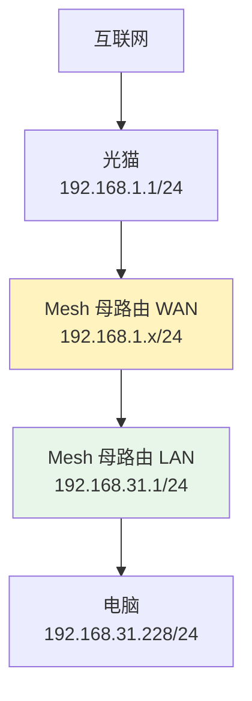
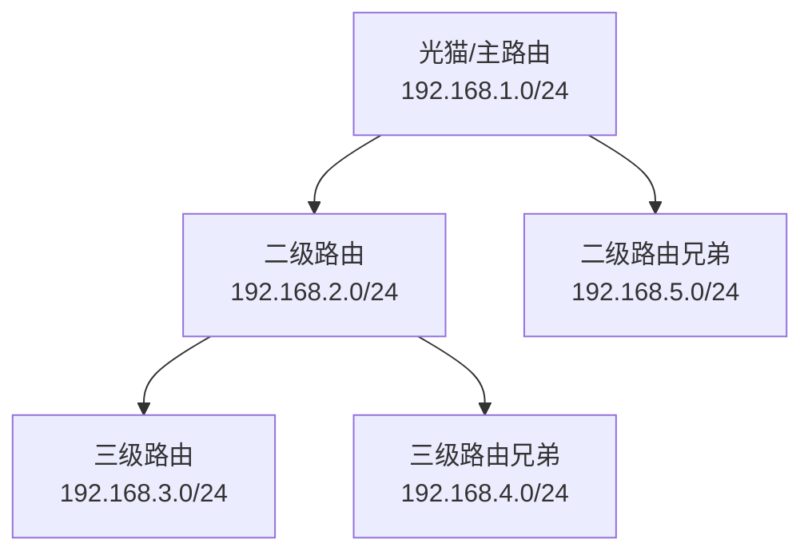
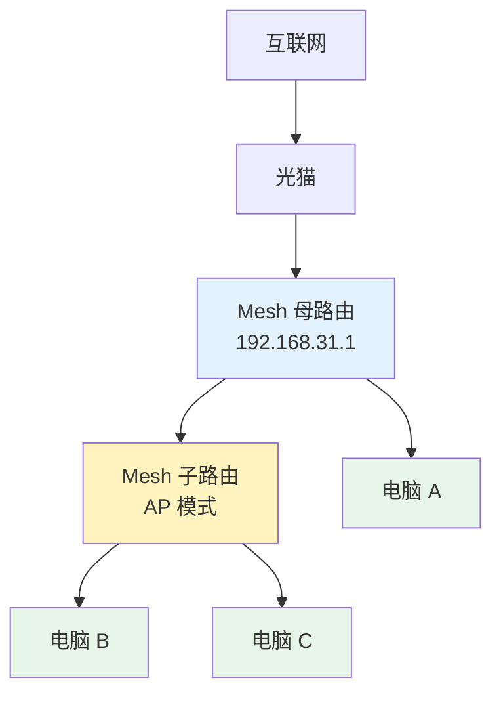
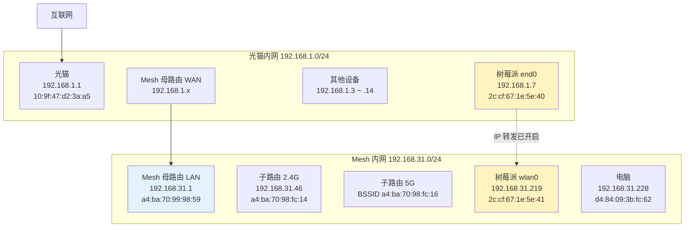

1. Table of Contents, ordered
{:toc}

## 1. 引言：家庭网络不止一个盒子

你每天都在用 Wi-Fi，但可能很少想过：当你点击连接一个名叫 `bonjour` 的网络时，背后发生了多少层协作。

家庭网络看似简单——光猫、路由器、几台手机电脑——但里面叠加了好几层抽象：

- **物理层**：每个网络接口都有一个 MAC 地址；
- **无线层**：SSID 是人看到的名字，BSSID 是设备实际连接的接入点；
- **网络层**：IP 地址把设备划分到不同子网；
- **转发层**：NAT 决定了谁能主动访问谁；
- **组网层**：Mesh 子路由不是二级路由器，而是扩展的 AP。

这篇文章顺着一条主线把这些概念串起来：**设备如何被识别 → 网络如何分层 → 数据如何流动**。理解这条线之后，再看家里的光猫、路由器、树莓派和各种智能家居设备，就不会觉得它们是一团乱麻。

## 2. MAC 地址：每个接口的物理身份证

### 2.1 什么是 MAC 地址

**MAC（Media Access Control）地址**是烧录在网络接口硬件里的全球唯一标识。每一块网卡、每一个有线口、每一个无线射频，出厂时都有一个 MAC 地址。

你可以把它理解为网络设备的“身份证号”：在局域网内部，数据包最终要靠 MAC 地址找到对应的硬件接口。

### 2.2 一台路由器其实有好多 MAC

很多人以为一台路由器只有一个 MAC。实际上，家用路由器通常至少有这几个：

| 接口 | 用途 | 是否常印在机身标签上 |
|------|------|---------------------|
| WAN 口 | 连接光猫/外网 | **是，通常就是这个** |
| LAN 口 | 连接有线设备 | 偶尔 |
| 2.4GHz 无线 | 2.4G Wi-Fi 的 BSSID | 否 |
| 5GHz 无线 | 5G Wi-Fi 的 BSSID | 否 |

**这里要特别强调：机身标签上印的，几乎总是 WAN 口的物理 MAC 地址。** 它不是 2.4G 的 MAC，也不是 5G 的 MAC，更不是 LAN 口的 MAC。

运营商和管理后台在注册设备时，通常只认这个 WAN 口 MAC。所以标签只印它，稳定且唯一。

### 2.3 2.4G 和 5G 为什么有两个 MAC

它们不是两块完全独立的网卡，而是同一块无线芯片上的**两个不同射频（radio）**。

你可以理解为：一个无线芯片有两个频道，每个频道都需要一个独立身份（BSSID/MAC）。否则设备无法区分“同一个 Wi-Fi 名字下的 2.4G 信号”和“同一个 Wi-Fi 名字下的 5G 信号”。



## 3. SSID 与 BSSID：无线网络的“人名”与“设备名”

### 3.1 SSID：人看到的 Wi-Fi 名字

**SSID（Service Set Identifier）** 就是你手机上看到的 Wi-Fi 名称，比如 `bonjour`、`ChinaNet-XXX`、`TP-LINK_XXXX`。

它是给人看的。同一个 SSID 可以对应多个物理接入点。在 Mesh 网络里，母路由和子路由通常广播同一个 SSID，你坐在家里不同位置，设备可能自动从母路由切换到子路由，但 SSID 始终显示同一个名字。

### 3.2 BSSID：设备实际连接的接入点标识

光看 SSID，你并不知道设备到底挂在哪个节点上。这时就需要 **BSSID（Basic Service Set Identifier）**。

BSSID 是 Wi-Fi 协议层面用来标识一个具体接入点（或具体频段）的地址。你可以这样理解两者的关系：

| 对比项 | SSID | BSSID |
|--------|------|-------|
| 给谁看 | 给人看 | 给设备看 |
| 是否唯一 | 同一 Mesh 下多个节点共用 | 每个节点、每个频段唯一 |
| 表现形式 | 字符串，如 `bonjour` | MAC 地址，如 `a4:ba:70:98:fc:16` |
| 作用 | 方便你识别网络 | 设备判断自己连的是哪个 AP |

所以当你在手机或电脑里看到连着 `bonjour` 时，真正决定你走哪条路的，是背后的 BSSID。



### 3.3 为什么标签 MAC 对不上 BSSID

当我用 `netsh wlan show interfaces` 看到 BSSID 是 `a4:ba:70:98:fc:16` 时，它是我连接的 **5GHz 射频口的 MAC**，和机身标签上印的 **WAN 口物理 MAC** 自然不同。

所以：

> **光拿标签上的 MAC 和 BSSID 对比，是判断不了当前连的是哪个节点的。** 要么进路由器 App 看 Mesh 拓扑，要么用 Wi-Fi 扫描工具看每个节点的 BSSID。

## 4. IP 与子网：网络的层次划分

### 4.1 IP 地址 = 网络位 + 主机位

MAC 地址解决的是“局域网内找哪个硬件接口”，而 **IP 地址**解决的是“在哪个子网里找哪台设备”。

一个 IPv4 地址有 32 位，分成两段：

```
[ 网络位 ] + [ 主机位 ]
```

- **网络位**：标识“哪个小区 / 哪条街”；
- **主机位**：标识“小区里的哪一户 / 哪扇门”。

`192.168.1.0/24` 里的 `/24` 表示前 24 位是网络位，后 8 位是主机位。它等价于子网掩码 `255.255.255.0`。

这个网段的范围是 `192.168.1.0` 到 `192.168.1.255`，其中：

| 地址 | 用途 |
|------|------|
| `192.168.1.0` | 网络地址 |
| `192.168.1.1` | 通常给网关/路由器 |
| `192.168.1.2` ~ `192.168.1.254` | 可分配给设备 |
| `192.168.1.255` | 广播地址 |

### 4.2 路由器分隔子网

路由器的一个基本作用就是分隔子网。它的 WAN 口在一个子网，LAN 口在另一个子网。

在我的环境里：

- 光猫 LAN 侧是 `192.168.1.0/24`；
- Mesh 母路由的 WAN 口接光猫，拿到 `192.168.1.x`；
- Mesh 母路由的 LAN 侧创建 `192.168.31.0/24`，给电脑、手机等设备使用。



### 4.3 网段规划的两个原则

#### 原则一：路由器的 WAN 口和 LAN 口必须在不同网段

这是最基本也最容易踩的坑。路由器需要明确知道：某个 IP 是在我的“外面”还是“里面”？应该往 WAN 口转发，还是往 LAN 口转发？

假设光猫 LAN 是 `192.168.1.0/24`，Mesh 母路由的 WAN 口从光猫拿到了 `192.168.1.5`。如果此时你把 Mesh 母路由的 LAN 也配成 `192.168.1.0/24`，路由器内部就会混乱：

| 问题 | 后果 |
|------|------|
| `192.168.1.1` 是光猫还是 Mesh 母路由自己？ | 路由器优先认为是自己 LAN 侧，访问光猫会失败 |
| 内网设备想访问 `192.168.1.7` | 路由器可能在 LAN 侧找不到，不会转发到 WAN 侧 |
| DHCP 冲突 | 光猫和 Mesh 母路由都给 `192.168.1.0/24` 分配 IP，地址可能冲突 |

所以家用路由器出厂时，LAN 侧默认都会选一个和常见光猫网段不同的段，比如 `192.168.31.0/24`，就是为了避免和上一级网络撞车。

#### 原则二：隔层理论上可以重复，但非常不推荐

如果不在同一个路由器的两侧，而是“隔了一层”，理论上可以重复。比如：

- 光猫 LAN：`192.168.1.0/24`
- 二级路由 LAN：`192.168.2.0/24`
- 三级路由 LAN：`192.168.1.0/24`

从三级路由自己的角度看，它的 WAN 在 `192.168.2.0/24`，LAN 在 `192.168.1.0/24`，两者不冲突，它自己能正常工作。

但这样做会在实际使用中制造很多麻烦：

1. **访问路径混乱**：三级路由下的电脑访问 `192.168.1.1` 时，会优先认为这是自己 LAN 侧的地址，去敲三级路由的 LAN 口，而不是真正找光猫。
2. **静态路由和端口映射冲突**：未来做端口映射、VPN 或手动加静态路由时，同样的网段出现在不同位置会让规则极难维护。
3. **排查故障像解谜**：网络出问题后，每个 ping、每个 traceroute 都要先想清楚“我现在在哪一层”。

所以最佳实践是：**每一层都用完全不同的网段**。

## 5. NAT：子网之间的单向门

### 5.1 NAT 在做什么

**NAT（Network Address Translation，网络地址转换）** 是家用路由器最核心的功能之一。它把内网设备的源 IP 改成路由器 WAN 口的 IP，再发出去。

这样做的直接效果是：

> 从外部看，整个内网只表现为路由器 WAN 口的那一个 IP。内网里的具体设备被隐藏了。

### 5.2 为什么是“单向门”

NAT 加上路由器的防火墙，形成了一道“单向门”：

| 方向 | 是否默认允许 | 原因 |
|------|-------------|------|
| 内网 → 外网 | ✅ | 内网主动发起连接，NAT 记录状态，返回流量放行 |
| 外网 → 内网 | ❌ | 外部主动发起的连接没有对应状态，被丢弃 |

在我的环境里：

- 电脑在 `192.168.31.0/24`（Mesh 内网）；
- 树莓派有线口在 `192.168.1.0/24`（光猫内网）。

电脑可以主动访问树莓派，因为数据走的是“内网 → 外网”方向。但树莓派默认不能主动访问电脑，因为从光猫侧看，电脑所在的 `192.168.31.0/24` 被 Mesh 母路由隐藏了。

### 5.3 多级路由就像一棵树

如果你在一个子网下再接一个路由器做 NAT，就形成了一层新的子网。无限套娃下去，网络就像一棵多叉树：



在这个结构里：

- 内层节点可以访问外层节点；
- 外层节点默认不能访问内层节点；
- 内层节点可以访问“叔伯”节点（父节点的兄弟），但叔伯节点不能访问它兄弟的子节点。

原因很简单：数据要先往上走到共同祖先，再往下走。每一步“内层→外层”都受 NAT 保护，反向则不行。

## 6. Mesh 路由的核心原理

Mesh 不是某一个单独技术，而是一组设计原则的组合。下面逐条介绍其中最主要的几条。

### 6.1 统一子网：子路由不做 NAT

这是 Mesh 和传统“路由器下再接路由器”最大的区别。

传统二级路由会：

- 自己创建一个新子网；
- 自己做 NAT；
- 下面的设备和上面的设备不在同一层。

Mesh 子路由本质上是一个 **AP + 回程节点**：

- 它不给下面的设备分配新子网；
- 它不做 NAT；
- 所有连子路由和连母路由的设备，都在**同一个子网**里；
- IP 通常由主路由统一分配，设备在节点间移动时 IP 不变。



在这个图里，电脑 A、B、C 都是 `192.168.31.0/24` 这个大家庭里的“兄弟节点”。

### 6.2 统一 SSID 与无缝漫游

Mesh 的多个节点广播**同一个 SSID 和密码**。设备看到的是一个网络，而不是“客厅 Wi-Fi”和“书房 Wi-Fi”。

**这里有一个关键点需要强调**：设备判断“这是不是同一个 Wi-Fi”的依据只有三个——**SSID、密码、安全协议**。它不会去检查这个信号到底是不是属于你的网络。

也就是说，如果你和邻居凑巧设置了完全一样的 SSID、密码和协议，你们的设备也会把它们当成同一个网络。手机或电脑会自动连接到信号更强的那个，即使它连的是邻居家的路由器。这可能导致：

- 你连到了不属于自己的网络；
- 设备在两个网络之间来回切换，网络不稳定；
- 如果两个网络都开启了 DHCP，设备获取到的 IP 网段可能不同，导致部分服务时通时断。

所以 SSID 最好设置得有一定独特性，密码也要足够复杂，避免和周围邻居撞车。

当设备移动到另一个节点附近时，会自动切换到信号更强的那个节点。为了实现“无缝”，Mesh 通常会用到三个协议：

| 协议 | 作用 |
|------|------|
| **802.11k** | 邻居报告：让设备知道附近有哪些节点、信号如何 |
| **802.11v** | BSS 转换管理：网络可以主动建议设备切换到更好的节点 |
| **802.11r** | 快速 BSS 转换：减少切换时的重新认证延迟 |

普通路由器同名组网一般没有这些协议配合，切换时可能会断几秒；Mesh 则尽量让切换在毫秒级完成。

### 6.3 回程链路

子路由要把数据送回母路由，它们之间的通信链路叫 **回程（Backhaul）**。

| 回程类型 | 优点 | 缺点 |
|---------|------|------|
| **有线回程** | 稳定、不占用无线带宽、延迟低 | 需要预埋网线 |
| **无线回程** | 部署灵活 | 占用无线频段带宽，多跳后性能下降 |
| **专用频段回程**（三频 Mesh） | 用独立 5GHz 做回程，不影响设备频段 | 价格更贵 |

无线回程的带宽会被“子路由 → 母路由”这段通信吃掉一部分，所以子路由附近的实际速率通常比母路由附近低一些。

### 6.4 集中管理、频段引导与自愈

除了上面三条，Mesh 还有几个辅助机制：

- **集中管理**：主节点统一配置 SSID、密码、信道、固件等，子节点自动同步。添加新节点通常通过 App 一键完成。
- **频段引导（Band Steering）**：引导支持 5GHz 的设备尽量连 5GHz，把 2.4GHz 留给距离远或只支持 2.4GHz 的设备。
- **自愈/冗余**：如果某个节点掉线或信号变差，Mesh 会尝试让设备切换到其他节点，并重新选择回程路径。
- **动态信道与功率调整**：自动选择干扰较小的信道，根据环境调整发射功率，减少节点间互相干扰。

### 6.5 子路由应该放在哪里

子路由存在的意义是**扩展覆盖**，而不是“放大信号”。它应该被放在：

> 一个自己离母路由还不算太远、但又能覆盖到母路由原本覆盖不到的地方。

把子路由和电脑一起塞在书房角落里是错误的摆法。结果是：

- 子路由到母路由的信号本身就很差；
- 电脑到子路由虽然信号好，但数据还是要经过一段弱链路回母路由；
- 整体效果还不如电脑直接连母路由，还多了一跳延迟。

正确的摆放是“接力”：


## 7. 双网卡设备：潜在的“路由器”

### 7.1 树莓派跨了两个网段

在家庭网络里，一个设备可以同时属于多个子网。最典型的例子就是一台电脑或树莓派同时连着有线网和无线网。

在我的环境里，树莓派后来变成了这样：

| 接口 | IP | 所在网络 |
|------|----|---------|
| `end0` 有线 | `192.168.1.7/24` | 光猫内网 |
| `wlan0` 无线 | `192.168.31.219/24` | Mesh 内网 |

这意味着树莓派同时属于两个子网。从硬件条件看，它已经具备了路由器的雏形：有两个网络接口，连接两个不同网络。

### 7.2 两个默认网关的优先级

Linux 系统里通常只能有一个“默认网关”。如果两个接口都拿到了默认网关，系统会按 **metric（优先级）** 选择其中一个。

树莓派的路由表里有这样两行：

```bash
default via 192.168.1.1 dev end0   metric 100
default via 192.168.31.1 dev wlan0 metric 600
```

`metric` 越小优先级越高。所以树莓派访问外网时，**优先走有线口 → 光猫**，而不是 Mesh Wi-Fi。

### 7.3 IP 转发让它成为真正的路由器

有两张网卡只是“潜在的路由器”。真正让它开始转发数据包的开关是：

```bash
/proc/sys/net/ipv4/ip_forward
```

- `0`：只处理发给自己的包，不帮别人转发；
- `1`：开始帮不同网段之间转发数据包。

我的树莓派这个值是 `1`，也就是说它**已经是一个真正的路由器**了。只不过默认情况下，Mesh 内网的其他设备访问光猫侧设备时，会走 Mesh 母路由的 WAN 口出去，不会专门经过树莓派。

## 8. 一个真实家庭网络的完整解剖

前面都是概念，现在把它们放到一个真实拓扑里看。

### 8.1 完整拓扑（宏观视角）

这是我家当前的网络全貌：



树莓派比较特殊：它的有线口在光猫内网，WiFi 口在 Mesh 内网。由于它的 `ip_forward=1`，它理论上可以作为这两个子网之间的路由器。但实际上，Mesh 内网设备访问光猫侧设备时，默认还是走 Mesh 母路由的 WAN 口出去。

### 8.2 从 Windows 电脑视角

| 项目 | 值 |
|------|-----|
| 电脑 IP | `192.168.31.228/24` |
| 电脑 MAC | `d4:84:09:3b:fc:62` |
| 默认网关 | `192.168.31.1` |
| 网关 MAC | `a4:ba:70:99:98:59`（Mesh 母路由 LAN 侧） |
| 同一 Mesh 子网设备 | `192.168.31.219`（树莓派 WiFi） |
| 到树莓派 `192.168.1.7` 的路径 | `192.168.31.1` → `192.168.1.7` |

从电脑看出去，它只知道 Mesh 内网。要访问光猫侧的 `192.168.1.7`，必须经过 Mesh 母路由转发。

### 8.3 从树莓派视角

| 接口 | IP | MAC | 所在网络 |
|------|----|-----|---------|
| `end0` 有线 | `192.168.1.7/24` | `2c:cf:67:1e:5e:40` | 光猫内网 |
| `wlan0` 无线 | `192.168.31.219/24` | `2c:cf:67:1e:5e:41` | Mesh 内网 |
| `docker0` | `172.17.0.1/16` | `9a:d0:12:73:e6:60` | Docker 默认网桥 |
| `br-c78fb972e3f2` | `172.18.0.1/16` | `ea:99:8e:9b:3a:8b` | Docker 自定义网桥 |

树莓派的路由表：

```bash
default via 192.168.1.1 dev end0   metric 100
default via 192.168.31.1 dev wlan0 metric 600
```

`metric` 越小优先级越高，所以树莓派上网时**优先走有线口 → 光猫**，而不是 Mesh Wi-Fi。

### 8.4 几条典型数据路径

| 路径 | 怎么走 |
|------|--------|
| 电脑 → 树莓派 `192.168.1.7` | Mesh 母路由 NAT 出去 → 光猫 → 树莓派有线口 |
| 电脑 → 树莓派 `192.168.31.219` | 同一 Mesh 子网，直接通信 |
| 树莓派 → 外网 | 优先走 `end0` → 光猫 |
| 树莓派 → Mesh 内网设备 | 走 `wlan0` → `192.168.31.1` |
| 光猫侧设备 → 电脑 | 默认被 Mesh 母路由防火墙挡住，不能主动访问 |

## 9. 结语

家庭网络看起来只是几个盒子几根线，但里面其实叠加了好几层抽象：

- **MAC 地址**是硬件身份；
- **BSSID**是无线热点的身份；
- **IP 地址**把设备划分到不同子网；
- **NAT**决定了谁能主动找谁；
- **Mesh 子路由**是 AP，不是网关。

把这些分层理清楚之后，再看家里的光猫、路由器、树莓派和各种智能家居设备，就不会觉得它们是一团乱麻。网络问题排查起来，也会有一个清晰的思路：先看设备在哪一层，再看数据往哪个方向走，最后看哪一道门把它挡住了。
