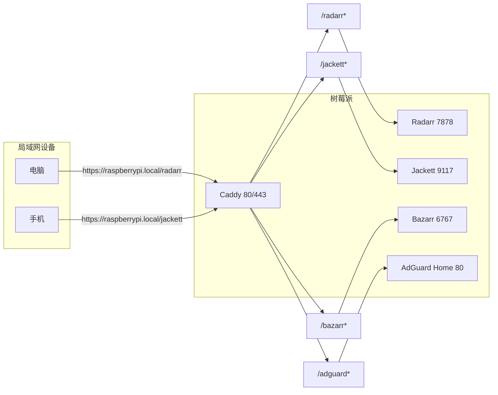
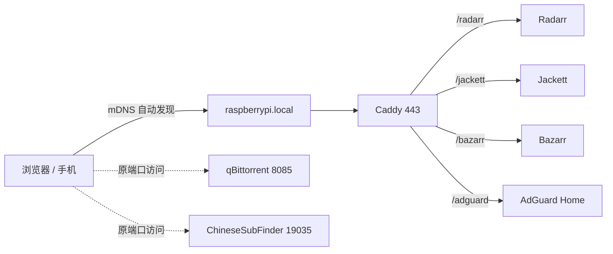

1. Table of Contents, ordered
{:toc}

## 1. 问题：服务越装越多，IP 和端口记不住

我的树莓派上跑着一套电影下载相关的服务：Radarr、Jackett、qBittorrent、Bazarr、ChineseSubFinder，还有一个 AdGuard Home。每个服务一个端口，时间长了根本记不住：

| 服务 | 原来的访问地址 |
|------|---------------|
| Radarr | `http://192.168.1.7:7878` |
| Jackett | `http://192.168.1.7:9117` |
| qBittorrent | `http://192.168.1.7:8085` |
| Bazarr | `http://192.168.1.7:6767` |
| ChineseSubFinder | `http://192.168.1.7:19035` |
| AdGuard Home | `http://192.168.1.7`（后来改成 `http://192.168.1.7:8080`） |

每次想打开某个页面都要先翻备忘录。于是我决定给它们做一次反向代理收敛：让树莓派只暴露 80/443 端口，所有服务统一用域名访问。

## 2. 先选工具：Caddy 还是 Nginx？

Caddy 和 Nginx 都能做反向代理，但在这个场景下我选了 Caddy。

| 维度 | Caddy | Nginx |
|------|-------|-------|
| 配置长度 | 几行即可 | 需要 `server`/`location` 块，更啰嗦 |
| HTTPS | 自动申请/自签证书，默认开启 | 需要手动配置证书路径 |
| 局域网 HTTPS | 自动生成本地自签名证书 | 同样需要手动配置 |
| 学习成本 | 低 | 高，但生态更成熟 |
| 性能 | 家庭场景完全够用 | 更强，企业用得更多 |

Nginx 的功能和生态无疑更强大，但我的需求只是在树莓派局域网里做几个服务的反向代理，Caddy 的 `Caddyfile` 三五行就搞定，还能自动处理 HTTPS 重定向，省掉很多模板代码。

一个简单的对比例子：

```caddy
raspberrypi.local {
    reverse_proxy /radarr* radarr:7878
    reverse_proxy /jackett* jackett:9117
}
```

同样的功能用 Nginx 大概要写成：

```nginx
server {
    listen 80;
    server_name raspberrypi.local;

    location /radarr/ {
        proxy_pass http://radarr:7878/;
    }

    location /jackett/ {
        proxy_pass http://jackett:9117/;
    }
}
```

Nginx 还少了一样东西：HTTPS。Caddy 会在 `.local` 这种私有域名上自动生成本地证书，浏览器第一次访问会报“不安全”，但点继续后就能用；Nginx 需要你自己生成自签证书并配置 `ssl_certificate`。

所以结论很直接：**家庭 homelab 场景，Caddy 更省事。**

## 3. 关键决策：子路径 vs 子域名

收敛访问地址时有两种典型方案：

- **子路径（domain/subpath）**：`raspberrypi.local/radarr`
- **子域名（subdomain.domain）**：`radarr.raspberrypi.local`

直觉上子域名更“干净”，每个服务独立域名。但我最终选了子路径方案，核心原因是 **mDNS 的局域网自动发现机制**。

### 3.1 `raspberrypi.local` 从哪来？

树莓派默认运行着 [Avahi](https://www.avahi.org/) 服务，它实现了 [mDNS（multicast DNS）](https://en.wikipedia.org/wiki/Multicast_DNS)。在同一个局域网里，设备不需要任何 DNS 配置，就能通过 `raspberrypi.local` 访问到树莓派。

```bash
# 局域网内任何设备都能直接 ping 通
ping raspberrypi.local
```

这是苹果 Bonjour、Linux Avahi、Windows 都支持的协议。它解决了一个很关键的问题：**局域网内设备互相发现，不需要 central DNS server。**

### 3.2 子域名为什么不行？

`raspberrypi.local` 是 mDNS 广播出来的主机名，但 `radarr.raspberrypi.local` 不是。普通的 `.local` 子域名不会被 mDNS 自动解析，必须依赖一个真正的 DNS 服务器来回答“`radarr.raspberrypi.local` 的 IP 是什么”。

这意味着如果你用子域名方案，必须做其中一件事：

1. **在每台访问设备上手动改 DNS**：把 DNS 服务器指向树莓派上的 AdGuard Home/Pi-hole。
2. **在路由器里改 DHCP DNS**：让所有设备自动把树莓派当 DNS。
3. **在路由器里写本地 hosts/域名重写**：部分路由器/软路由支持。

这些方案不是不能做，但都引入了额外的网络层配置。一旦 DNS 出问题，所有局域网设备都可能受影响。

### 3.3 子路径为什么能零配置？

子路径方案只依赖 `raspberrypi.local` 这一个主机名，而它已经是 mDNS 自动发现好的。Caddy 只需要根据路径前缀做反向代理：

```caddy
raspberrypi.local {
    reverse_proxy /radarr* radarr:7878
    reverse_proxy /jackett* jackett:9117
    reverse_proxy /bazarr* bazarr:6767
    reverse_proxy /adguard* adguardhome:80
}
```

局域网里任何设备，不需要改 DNS，直接打开：

- `https://raspberrypi.local/radarr`
- `https://raspberrypi.local/jackett`
- `https://raspberrypi.local/bazarr`
- `https://raspberrypi.local/adguard`

这就是子路径方案最大的优势：**零网络配置，开箱即用。**



## 4. 实际部署：Docker Compose + Caddy

### 4.1 目录结构

我树莓派上的 Docker 项目在 `/home/pi/docker/`，关键文件：

```
/home/pi/docker/
├── compose.yml
├── caddy/
│   ├── Caddyfile
│   ├── data/
│   └── config/
├── radarr/config/config.xml
├── jackett/config/Jackett/ServerConfig.json
├── bazarr/config/config/config.yaml
└── ...
```

### 4.2 compose.yml 调整

原来的 AdGuard Home 占了宿主机的 80 端口，需要让出来给 Caddy：

```yaml
  adguardhome:
    image: adguard/adguardhome:latest
    ports:
      - "53:53/tcp"
      - "53:53/udp"
      - "3000:3000/tcp"
      - "8080:80/tcp"    # 原来这里是 80:80
    restart: unless-stopped

  caddy:
    image: caddy:2-alpine
    container_name: caddy
    ports:
      - "80:80"
      - "443:443"
      - "443:443/udp"
    volumes:
      - /home/pi/docker/caddy/Caddyfile:/etc/caddy/Caddyfile:ro
      - /home/pi/docker/caddy/data:/data
      - /home/pi/docker/caddy/config:/config
    restart: unless-stopped
```

AdGuard Home 的管理地址从 `http://192.168.1.7` 变成了 `http://192.168.1.7:8080`，之后我又通过 `https://raspberrypi.local/adguard` 把它挂了回来。

### 4.3 Caddyfile

最终版本：

```caddy
raspberrypi.local {
    reverse_proxy /radarr* radarr:7878 {
        header_up Host {host}
    }
    reverse_proxy /jackett* jackett:9117 {
        header_up Host {host}
    }
    reverse_proxy /bazarr* bazarr:6767 {
        header_up Host {host}
    }
    reverse_proxy /adguard* adguardhome:80 {
        header_up Host {host}
    }
}
```

`header_up Host {host}` 是为了让后端服务知道原始 Host 是 `raspberrypi.local`，否则 Jackett 之类的登录跳转可能会写死内部容器名或端口。

### 4.4 各服务的 URL Base 配置

反向代理到子路径时，**后端服务本身必须知道自己在子路径下运行**。否则页面 HTML 里的 JS/CSS/API 链接会指向根路径 `/`，导致白屏或 404。

| 服务 | 配置文件 | 关键配置项 | 值 |
|------|---------|-----------|-----|
| Radarr | `config.xml` | `UrlBase` | `/radarr` |
| Jackett | `ServerConfig.json` | `BasePathOverride` | `/jackett` |
| Bazarr | `config.yaml` | `general.base_url` | `/bazarr` |
| Bazarr | `config.yaml` | `radarr.base_url` | `/radarr` |

AdGuard Home 不需要额外配置，它的 WebUI 本身对子路径兼容较好。

## 5. 踩坑：不是所有服务都能挂到子路径

有两项服务折腾了半天还是挂不到 `/` 下面：

### 5.1 qBittorrent

qBittorrent 的 WebUI 配置文件里有 `WebUI\Port`、`WebUI\Address`、`WebUI\ServerDomains`、`WebUI\RootFolder`，但**没有 URL Base 选项**。它的前端代码写死了根路径 `/api/v2/...`、 `/css/...`、 `/js/...`，无法适配 `/qb` 子路径。

社区对这个功能请求已经很久了，但官方一直没加。所以 qBittorrent 只能：

- 继续用原端口：`http://192.168.1.7:8085`
- 或者走子域名：`qb.raspberrypi.local`（需要本地 DNS）

### 5.2 ChineseSubFinder

ChineseSubFinder 更极端。作者已经明确转向 Lite 路线，WebUI 基本不维护了，当前版本只是个轻量状态页。它的前端资源同样是按根路径部署的，没有 URL base 配置项。

所以它也是：

- 继续用原端口：`http://192.168.1.7:19035`
- 或者走子域名：`csf.raspberrypi.local`（需要本地 DNS）

## 6. 最终访问方式



实线是通过 Caddy 子路径访问，虚线是仍然保留原端口的服务。

## 7. 总结

- **为什么选 Caddy**：家庭 homelab 做反向代理，配置短、自动 HTTPS、零证书折腾，比 Nginx 省事。
- **为什么选子路径而不是子域名**：`raspberrypi.local` 是 mDNS 自动发现的主机名，局域网任何设备零配置就能访问；子域名需要本地 DNS 重写，要么改每台设备 DNS，要么改路由器 DHCP，引入额外依赖。
- **子路径的代价**：后端服务必须支持 URL base。*arr 家族（Radarr、Jackett、Bazarr）都支持，但 qBittorrent 和 ChineseSubFinder 不支持，只能继续用端口或走子域名。

如果你也有一套树莓派 homelab，想少改网络配置，最稳的路线就是：**Caddy + `raspberrypi.local/<服务名>`，能挂上的都挂上，挂不上的保留端口。**
