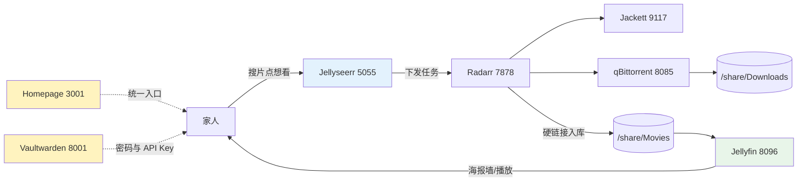

1. Table of Contents, ordered
{:toc}

## 1. 背景：下载管线缺了"两头"

在[上一篇文章](/life/2026/06/17/raspberry-pi-docker-radarr-jackett-qbittorrent-bazarr/)里，树莓派上已经有了一条自动化下载管线：Radarr 管电影、Jackett 聚合种子站、qBittorrent 下载、Bazarr 和 ChineseSubFinder 补字幕，后来又修复了[硬链接失效导致的磁盘翻倍问题](/life/2026/06/17/raspberry-pi-docker-radarr-jackett-qbittorrent-bazarr/#10-最大的坑两个-bind-mount-让硬链接悄悄变成复制2026-07-18-补记)。

但用了一段时间会发现，这条管线只解决了"下"的问题，两头都缺：

- **上游缺"发现"**：想看电影要自己打开 Radarr 搜索、选画质，家里人根本不会用；
- **下游缺"播放"**：片子入库后靠 Samba 共享裸文件播放，没有海报墙、没有进度记录、没有手机客户端；
- **附带两个管理问题**：服务越装越多，七八个 WebUI 端口记不住；各服务的密码和 API Key 明文写在文档甚至公开博客里。

这次补装的四个服务正好一一对应：Jellyseerr 管"发现"，Jellyfin 管"播放"，Homepage 管"入口"，Vaultwarden 管"密码"。



四个服务均已提交到 [pi-docker-homelab](https://github.com/puppylpg/pi-docker-homelab) 仓库的 compose 里，以下按服务记录要点和踩坑。

## 2. Jellyfin：补上"看"的一头

[Jellyfin](https://jellyfin.org/) 是开源媒体服务器：扫描片库后生成海报墙，记录观看进度，提供网页和手机/电视客户端。选 `linuxserver/jellyfin` 镜像与现有栈保持同一套约定：

```yaml
  jellyfin:
    image: linuxserver/jellyfin:latest
    container_name: jellyfin
    environment:
      - PUID=1000
      - PGID=100
      - TZ=Asia/Shanghai
      # 刮削元数据需要访问 TMDB，走宿主机 V2Ray 代理
      - HTTP_PROXY=http://172.18.0.1:10809
      - HTTPS_PROXY=http://172.18.0.1:10809
      - NO_PROXY=localhost,127.0.0.1,jellyseerr,radarr
    volumes:
      - /home/pi/docker/jellyfin/config:/config
      - /home/pi/docker/jellyfin/cache:/cache
      # 只读挂载片库即可，元数据写在 config 里
      - /share/Movies:/data/movies:ro
    ports:
      - "8096:8096"
    restart: unless-stopped
```

两个要点：

- 片库**只读挂载**（`:ro`），Jellyfin 的元数据、字幕缓存都写在自己的 `config`/`cache` 里，不会污染片库目录；
- 刮削要访问 TMDB，和 Jackett 一样走宿主机 V2Ray 代理，否则海报和简介拉不下来。

首次访问 `http://192.168.1.7:8096` 创建管理员，添加媒体库时选容器内路径 `/data/movies`。性能上树莓派 1080p 直接播放毫无压力，但不要指望它做 4K 实时转码——客户端支持直接播放才是关键。

## 3. Jellyseerr：补上"点播"的一头

[Jellyseerr](https://github.com/fallenbagel/jellyseerr) 是面向 Jellyfin 生态的点播门户（Plex 生态对应的叫 Overseerr）。家人打开网页搜电影、点"想看"，请求自动流转到 Radarr 下载、入库、出现在 Jellyfin 里，全程不用知道 Radarr 的存在。

```yaml
  jellyseerr:
    image: fallenbagel/jellyseerr:latest
    container_name: jellyseerr
    environment:
      - TZ=Asia/Shanghai
      # 搜索/海报依赖 TMDB API，走宿主机 V2Ray 代理
      - HTTP_PROXY=http://172.18.0.1:10809
      - HTTPS_PROXY=http://172.18.0.1:10809
      - NO_PROXY=localhost,127.0.0.1,jellyfin,radarr
    volumes:
      - /home/pi/docker/jellyseerr/config:/app/config
    ports:
      - "5055:5055"
    restart: unless-stopped
```

首次访问 `http://192.168.1.7:5055` 时选 Jellyfin 登录（用 Jellyfin 的管理员账号），然后在设置里关联 Radarr（Host 填 `radarr`，端口 `7878`，API Key 从 Radarr 设置页复制）。同样要注意 TMDB 走代理，否则搜索页一片空白。

## 4. Homepage：服务导航页

服务装到两位数之后，"哪个服务是哪个端口"本身就是负担。[Homepage](https://gethomepage.dev/) 是一个静态配置驱动的导航页，用一份 YAML 把所有服务收进一个首页：

```yaml
  homepage:
    image: ghcr.io/gethomepage/homepage:latest
    container_name: homepage
    environment:
      - PUID=1000
      - PGID=100
      - TZ=Asia/Shanghai
      # v1+ 必须显式允许访问的 Host
      - HOMEPAGE_ALLOWED_HOSTS=192.168.1.7:3001,raspberrypi.local:3001,localhost:3001,127.0.0.1:3001
    volumes:
      - /home/pi/docker/homepage/config:/app/config
      # 只读挂 docker socket，用于首页显示容器运行状态
      - /var/run/docker.sock:/var/run/docker.sock:ro
    ports:
      - "3001:3000"
    restart: unless-stopped
```

服务清单位于 `homepage/config/services.yaml`，按分组罗列即可，例如：

```yaml
- 影音:
    - Jellyfin:
        href: http://192.168.1.7:8096
        description: 媒体播放
    - Jellyseerr:
        href: http://192.168.1.7:5055
        description: 点播入口
```

这个小服务踩了两个坑，都值得记录：

1. **ghcr.io 直连拉不动**。镜像在 GitHub Container Registry 上，Docker Hub 的加速手段对它无效，拉取直接超时。解法是走[南京大学 ghcr 镜像站](https://ghcr.nju.edu.cn/)：先 `docker pull ghcr.nju.edu.cn/gethomepage/homepage:latest`，再 `docker tag` 回原名，compose 无需改动；
2. **v1 版本强制 Host 校验**。不配 `HOMEPAGE_ALLOWED_HOSTS` 时页面能开但数据接口全部报 `Host validation failed`，必须把访问用的所有主机名（IP、mDNS 名、localhost）都列进去。

## 5. Vaultwarden：密码到底该怎么管

### 5.1 先拆掉一个错误前提

之前的做法是密码明文写在文档里，理由是"反正都是内网，别人看不到；就算看到也登录不了"。这个理由有个事实漏洞：密码不只是写在本地文档里，而是**明文出现在公开发布的博客文章里**，全世界都能搜到。

真正在起保护作用的并不是"别人看不到"，而是**服务只监听内网**——互联网上的陌生人拿到密码也够不着 `192.168.1.7`。但仍然剩下两类真实风险：

- **局域网内部**：访客 WiFi 的设备、中毒的手机，拿着公开密码可以登录全部服务；
- **密码复用习惯**：`pi123456` 这类弱密码如果和其他账号有复用，公开它等于公开别处的钥匙。

### 5.2 Vaultwarden 解决的不只是"记不住"

[Vaultwarden](https://github.com/dani-garcia/vaultwarden) 是 Bitwarden 的轻量自托管实现（Rust 编写，树莓派上跑得很轻松）。它带来的核心改变是：

- **浏览器/手机自动填充**：打开任何服务点一下自动填好，"记密码"这件事直接消失；
- **每个服务一个随机强密码**：不用再靠一个弱密码走天下。纯内网时这是好习惯，一旦哪天把服务通过 VPN 或公网暴露出去，这就是生死线；
- **不止密码**：API Key、TOTP 二次验证码、加密便签都能放，正好把散落在文档里的各种 Key 收进来；
- **加密存储**：保险库用主密码加密，只需要记住这一个。

### 5.3 部署与两个必须知道的代价

```yaml
  vaultwarden:
    image: vaultwarden/server:latest
    container_name: vaultwarden
    environment:
      - TZ=Asia/Shanghai
      # 初次使用先开放注册，建好账号后改为 false 重建容器
      - SIGNUPS_ALLOWED=true
      - HTTP_PROXY=http://172.18.0.1:10809
      - HTTPS_PROXY=http://172.18.0.1:10809
      - NO_PROXY=localhost,127.0.0.1
    volumes:
      # 保险库数据，务必纳入备份
      - /home/pi/docker/vaultwarden/data:/data
    ports:
      - "8001:80"
    restart: unless-stopped
```

两个代价：

1. **单点故障**：`vaultwarden/data` 丢了等于所有密码丢了。它刻意不进 git（里面是全部密码），必须另有备份副本；
2. **主密码是最后一道门**：要足够强、且真的记得住，别存在任何文档里。

部署流程：访问 `http://192.168.1.7:8001` 注册主账号 → 浏览器装 Bitwarden 扩展、自托管服务器地址填 `http://192.168.1.7:8001` → 把各服务密码逐个换强并入库 → 把 `SIGNUPS_ALLOWED` 改为 `false` 重建容器，关掉公开注册。

最后强调一句：换工具之外，**博客别再贴真实密码**——工具换不掉习惯。

## 6. 顺带弄清：LinuxServer.io 是什么、和官方镜像差在哪

这次加的镜像里，`linuxserver/jellyfin` 又一次出现。这个前缀值得专门搞清楚：[LinuxServer.io](https://www.linuxserver.io/) 是一个**社区维护的 Docker 镜像团队**，把流行的自建应用统一打包、以 `linuxserver/` 前缀发布。它不是这些应用的官方团队——Radarr 是 Radarr 团队写的，linuxserver 只是"搬运工 + 标准化包装"。类似的团队还有 [hotio](https://hotio.dev/)，覆盖范围更聚焦在 *arr 和媒体服务。

他们的选品有明显边界：主力是影音媒体（*arr 全家桶、Plex、Jellyfin）、下载器、配套工具，只零星涉及基础设施（如 `linuxserver/mariadb`）。**Redis、Elasticsearch、MySQL 这类核心组件他们不碰**——这些软件的官方镜像已经足够好，第三方重新打包没有增值空间。LinuxServer 的增值恰恰在"上游没有好镜像"的领域。

与官方镜像的具体区别：

| 维度 | 官方镜像 | LinuxServer 镜像 |
|------|---------|-----------------|
| 打包者 | 软件作者或 Docker Library 团队 | 第三方社区团队 |
| 权限模型 | 各自为政，很多固定 UID 或 root | 统一 `PUID`/`PGID`，挂载文件权限不乱 |
| 配置路径 | 每家不同 | 统一 `/config` |
| init 系统 | 通常直接跑应用进程 | s6-overlay，带 `custom-cont-init.d` 扩展钩子 |
| 架构支持 | 核心软件一般齐全 | 冷门应用也覆盖 ARM64/ARMv7，树莓派友好 |
| 更新节奏 | 跟随上游发版 | CI 每周重建，带最新基础系统安全补丁 |
| 镜像体积 | 通常精简 | 偏大（多一层 init 和工具） |

代价是中间多了一层：他们的基础镜像改版会引入自己的坑——上一篇文章修复硬链接时遇到的 `custom-cont-init.d` 目录从 `/config` 挪到容器根，就是 linuxserver 基础镜像变更造成的，与 Radarr 本身无关。

经验法则：**基础设施用官方镜像，homelab 应用用 linuxserver/hotio**。

## 7. 当前栈全景与下一步

至此树莓派上的服务全景：

| 分组 | 服务 | 端口 |
|------|------|------|
| 播放与点播 | Jellyfin、Jellyseerr | 8096、5055 |
| 下载管线 | Radarr、Jackett、qBittorrent、Bazarr、ChineseSubFinder | 7878、9117、8085、6767、19035 |
| 入口与管理 | Homepage、Vaultwarden、Caddy、Portainer | 3001、8001、80/443、9443 |
| 网络 | AdGuard Home、V2Ray | 53/3000、10808/10809 |

如果继续折腾，候选清单（都 ARM64 友好）：

- **Sonarr**：电视剧版 Radarr，自动追更按季整理；
- **Prowlarr**：Jackett 的现代化替代，索引器统一管理并同步给所有 *arr；
- **Recyclarr**：把 [TRaSH Guides](https://trash-guides.info/) 推荐的画质配置自动同步进 Radarr/Sonarr；
- **Navidrome**：音乐流媒体，私人 Spotify；
- **Immich**：自托管 Google Photos，8G 内存能跑；
- **Uptime Kuma / Dozzle**：服务存活监控 / 浏览器里看容器日志。

不建议在树莓派上碰的：Tdarr（转码农场，算力不够）、Nextcloud（能跑但体验重）。
