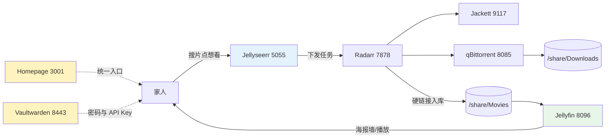
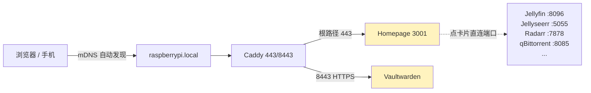

1. Table of Contents, ordered
{:toc}

## 1. 背景：下载管线缺了“两头”，入口也乱了

在[之前的文章](/life/2026/06/17/raspberry-pi-docker-radarr-jackett-qbittorrent-bazarr/)里，树莓派上已经有了一条自动化下载管线：Radarr 管电影、Jackett 聚合种子站、qBittorrent 下载、Bazarr 和 ChineseSubFinder 补字幕，后来又修复了[硬链接失效导致的磁盘翻倍问题](/life/2026/06/17/raspberry-pi-docker-radarr-jackett-qbittorrent-bazarr/#10-最大的坑两个-bind-mount-让硬链接悄悄变成复制2026-07-18-补记)。

但用了一段时间会发现，这条管线只解决了“下”的问题，两头都缺，还附带两个管理问题：

- **上游缺“发现”**：想看电影要自己打开 Radarr 搜索、选画质，家里人根本不会用；
- **下游缺“播放”**：片子入库后靠 Samba 共享裸文件播放，没有海报墙、没有进度记录、没有手机客户端；
- **入口混乱**：服务越装越多，七八个 WebUI 端口记不住，每次都要翻备忘录；
- **密码裸奔**：各服务的密码和 API Key 明文写在文档甚至公开博客里。

这次补装的四个服务正好一一对应：Jellyseerr 管“发现”，Jellyfin 管“播放”，Vaultwarden 管“密码”，Homepage 管“入口”。



四个服务均已提交到 [pi-docker-homelab](https://github.com/puppylpg/pi-docker-homelab) 仓库的 compose 里。下面先按服务记录要点和踩坑，最后用一整节讲入口方案的三次演进——那是这次折腾真正想明白的东西。

## 2. Jellyfin：补上“看”的一头

[Jellyfin](https://jellyfin.org/) 是开源媒体服务器：扫描片库后生成海报墙，记录观看进度，提供网页和手机/电视客户端。选 `linuxserver/jellyfin` 镜像与现有栈保持同一套约定：

```yaml
  jellyfin:
    image: linuxserver/jellyfin:latest
    container_name: jellyfin
    environment:
      - PUID=1000
      - PGID=100
      - TZ=Asia/Shanghai
      # 刮削元数据需要访问 TMDB，走宿主机 V2Ray 代理
      - HTTP_PROXY=http://172.18.0.1:10809
      - HTTPS_PROXY=http://172.18.0.1:10809
      - NO_PROXY=localhost,127.0.0.1,jellyseerr,radarr
    volumes:
      - /home/pi/docker/jellyfin/config:/config
      - /home/pi/docker/jellyfin/cache:/cache
      # 只读挂载片库即可，元数据写在 config 里
      - /share/Movies:/data/movies:ro
    ports:
      - "8096:8096"
    restart: unless-stopped
```

两个要点：

- 片库**只读挂载**（`:ro`），Jellyfin 的元数据、字幕缓存都写在自己的 `config`/`cache` 里，不会污染片库目录；
- 刮削要访问 TMDB，和 Jackett 一样走宿主机 V2Ray 代理，否则海报和简介拉不下来。

首次访问 `http://raspberrypi.local:8096` 创建管理员，添加媒体库时选容器内路径 `/data/movies`。性能上树莓派 1080p 直接播放毫无压力，但不要指望它做 4K 实时转码——客户端支持直接播放才是关键。

## 3. Jellyseerr：补上“点播”的一头

[Jellyseerr](https://github.com/fallenbagel/jellyseerr) 是面向 Jellyfin 生态的点播门户（Plex 生态对应的叫 Overseerr）。家人打开网页搜电影、点“想看”，请求自动流转到 Radarr 下载、入库、出现在 Jellyfin 里，全程不用知道 Radarr 的存在。

```yaml
  jellyseerr:
    image: fallenbagel/jellyseerr:latest
    container_name: jellyseerr
    environment:
      - TZ=Asia/Shanghai
      # 搜索/海报依赖 TMDB API，走宿主机 V2Ray 代理
      - HTTP_PROXY=http://172.18.0.1:10809
      - HTTPS_PROXY=http://172.18.0.1:10809
      - NO_PROXY=localhost,127.0.0.1,jellyfin,radarr
    volumes:
      - /home/pi/docker/jellyseerr/config:/app/config
    ports:
      - "5055:5055"
    restart: unless-stopped
```

首次访问 `http://raspberrypi.local:5055` 时选 Jellyfin 登录（用 Jellyfin 的管理员账号），然后在设置里关联 Radarr（Host 填 `radarr`，端口 `7878`，API Key 从 Radarr 设置页复制）。同样要注意 TMDB 走代理，否则搜索页一片空白。

## 4. Vaultwarden：密码到底该怎么管

### 4.1 先拆掉一个错误前提

之前的做法是密码明文写在文档里，理由是“反正都是内网，别人看不到；就算看到也登录不了”。这个理由有个事实漏洞：密码不只是写在本地文档里，而是**明文出现在公开发布的博客文章里**，全世界都能搜到。

真正在起保护作用的并不是“别人看不到”，而是**服务只监听内网**——互联网上的陌生人拿到密码也够不着 `192.168.1.7`。但仍然剩下两类真实风险：

- **局域网内部**：访客 WiFi 的设备、中毒的手机，拿着公开密码可以登录全部服务；
- **密码复用习惯**：`pi123456` 这类弱密码如果和其他账号有复用，公开它等于公开别处的钥匙。

### 4.2 Vaultwarden 解决的不只是“记不住”

[Vaultwarden](https://github.com/dani-garcia/vaultwarden) 是 Bitwarden 的轻量自托管实现（Rust 编写，树莓派上跑得很轻松）。它带来的核心改变是：

- **浏览器/手机自动填充**：打开任何服务点一下自动填好，“记密码”这件事直接消失；
- **每个服务一个随机强密码**：不用再靠一个弱密码走天下。纯内网时这是好习惯，一旦哪天把服务通过 VPN 或公网暴露出去，这就是生死线；
- **不止密码**：API Key、TOTP 二次验证码、加密便签都能放，正好把散落在文档里的各种 Key 收进来；
- **加密存储**：保险库用主密码加密，只需要记住这一个。

### 4.3 部署与两个必须知道的代价

```yaml
  vaultwarden:
    image: vaultwarden/server:latest
    container_name: vaultwarden
    environment:
      - TZ=Asia/Shanghai
      # 初次使用先开放注册，建好账号后改为 false 重建容器
      - SIGNUPS_ALLOWED=true
      - HTTP_PROXY=http://172.18.0.1:10809
      - HTTPS_PROXY=http://172.18.0.1:10809
      - NO_PROXY=localhost,127.0.0.1
    volumes:
      # 保险库数据，务必纳入备份
      - /home/pi/docker/vaultwarden/data:/data
    ports:
      - "8001:80"
    restart: unless-stopped
```

两个代价：

1. **单点故障**：`vaultwarden/data` 丢了等于所有密码丢了。它刻意不进 git（里面是全部密码），必须另有备份副本；
2. **主密码是最后一道门**：要足够强、且真的记得住，别存在任何文档里。

还有一个部署时必踩的坑：**Vaultwarden 必须走 HTTPS 访问**。它的 Web 保险库依赖浏览器的 Web Crypto API（SubtleCrypto）在本地做加解密，而浏览器只在安全上下文（HTTPS 或 localhost）里开放这个 API——HTTP 直连 `:8001` 打开会直接报 “You are not using a secure context ... You need to enable HTTPS!”。Vaultwarden 不支持子路径，所以解法是让 Caddy 给它单独开一个 HTTPS 端口反代（Caddy 会自动生成本地证书）：

```caddy
raspberrypi.local:8443 {
    reverse_proxy vaultwarden:80
}
```

浏览器首次访问接受自签证书即可，Bitwarden 扩展里的自托管服务器地址也填这个 HTTPS 地址。

部署流程：访问 `https://raspberrypi.local:8443` 注册主账号 → 浏览器装 Bitwarden 扩展、自托管服务器地址填 `https://raspberrypi.local:8443` → 把各服务密码逐个换强并入库 → 把 `SIGNUPS_ALLOWED` 改为 `false` 重建容器，关掉公开注册。

最后强调一句：换工具之外，**博客别再贴真实密码**——工具换不掉习惯。

## 5. 顺带弄清：LinuxServer.io 是什么、和官方镜像差在哪

这次加的镜像里，`linuxserver/jellyfin` 又一次出现。这个前缀值得专门搞清楚：[LinuxServer.io](https://www.linuxserver.io/) 是一个**社区维护的 Docker 镜像团队**，把流行的自建应用统一打包、以 `linuxserver/` 前缀发布。它不是这些应用的官方团队——Radarr 是 Radarr 团队写的，linuxserver 只是“搬运工 + 标准化包装”。类似的团队还有 [hotio](https://hotio.dev/)，覆盖范围更聚焦在 *arr 和媒体服务。

他们的选品有明显边界：主力是影音媒体（*arr 全家桶、Plex、Jellyfin）、下载器、配套工具，只零星涉及基础设施（如 `linuxserver/mariadb`）。**Redis、Elasticsearch、MySQL 这类核心组件他们不碰**——这些软件的官方镜像已经足够好，第三方重新打包没有增值空间。LinuxServer 的增值恰恰在“上游没有好镜像”的领域。

与官方镜像的具体区别：

| 维度 | 官方镜像 | LinuxServer 镜像 |
|------|---------|-----------------|
| 打包者 | 软件作者或 Docker Library 团队 | 第三方社区团队 |
| 权限模型 | 各自为政，很多固定 UID 或 root | 统一 `PUID`/`PGID`，挂载文件权限不乱 |
| 配置路径 | 每家不同 | 统一 `/config` |
| init 系统 | 通常直接跑应用进程 | s6-overlay，带 `custom-cont-init.d` 扩展钩子 |
| 架构支持 | 核心软件一般齐全 | 冷门应用也覆盖 ARM64/ARMv7，树莓派友好 |
| 更新节奏 | 跟随上游发版 | CI 每周重建，带最新基础系统安全补丁 |
| 镜像体积 | 通常精简 | 偏大（多一层 init 和工具） |

代价是中间多了一层：他们的基础镜像改版会引入自己的坑——之前修复硬链接时遇到的 `custom-cont-init.d` 目录从 `/config` 挪到容器根，就是 linuxserver 基础镜像变更造成的，与 Radarr 本身无关。

经验法则：**基础设施用官方镜像，homelab 应用用 linuxserver/hotio**。

## 6. 统一入口的三次演进：从裸端口到 Homepage 占根

服务补全之后，剩下最影响日常体验的问题是入口。这个问题我前后折腾了三轮，每一轮都解决了一点、也暴露了一点，值得完整记录下来。

### 6.1 阶段一：裸端口，记不住

最初每个服务一个端口，访问全靠 `http://192.168.1.7:<端口>`：

| 服务 | 端口 | 服务 | 端口 |
|------|------|------|------|
| Radarr | 7878 | Bazarr | 6767 |
| Jackett | 9117 | ChineseSubFinder | 19035 |
| qBittorrent | 8085 | AdGuard Home | 8080 |
| Jellyfin | 8096 | Jellyseerr | 5055 |

八九个端口，时间长了根本记不住，每次想打开某个页面都要先翻备忘录。

### 6.2 阶段二：Caddy 子路径收敛

第一反应是上反向代理，把所有服务收敛到 `raspberrypi.local/<服务名>`。

**为什么选 Caddy 而不是 Nginx**：两者都能做反代，但家庭场景下 Caddy 的 `Caddyfile` 三五行就搞定，还能在 `.local` 私有域名上自动生成本地证书、自动处理 HTTPS 重定向；Nginx 要写 `server`/`location` 块、自己搞自签证书。功能和生态 Nginx 无疑更强，但树莓派局域网反代这个需求，Caddy 省掉很多模板代码。

**为什么选子路径而不是子域名**，核心原因是 mDNS。树莓派默认运行 [Avahi](https://www.avahi.org/)，实现了 [mDNS](https://en.wikipedia.org/wiki/Multicast_DNS)：同一个局域网里，设备不需要任何 DNS 配置就能通过 `raspberrypi.local` 访问到树莓派。但 `radarr.raspberrypi.local` 这种子域名**不会**被 mDNS 自动解析，必须依赖真正的 DNS 服务器——要么每台设备改 DNS 指向 AdGuard Home，要么改路由器 DHCP，都引入了额外的网络层配置，一旦 DNS 出问题整个局域网受影响。子路径方案只依赖 `raspberrypi.local` 这一个主机名，**零网络配置，开箱即用**：

```caddy
raspberrypi.local {
    reverse_proxy /radarr* radarr:7878
    reverse_proxy /jackett* jackett:9117
    reverse_proxy /bazarr* bazarr:6767
    reverse_proxy /adguard* adguardhome:80
}
```

**但子路径有个硬伤：后端服务必须支持 URL Base**。否则页面 HTML 里的 JS/CSS/API 链接会指向根路径 `/`，直接白屏或 404。*arr 家族都支持（Radarr 的 `UrlBase`、Jackett 的 `BasePathOverride`、Bazarr 的 `base_url`），但有两个服务怎么都挂不上：

- **qBittorrent**：WebUI 没有 URL Base 选项，前端代码写死了根路径 `/api/v2/...`，社区呼吁多年官方始终没加；
- **ChineseSubFinder**：作者转向 Lite 路线后 WebUI 基本不维护，同样按根路径部署。

于是这两个只能继续用原端口访问，方案天然残缺。

### 6.3 阶段三：想通了——入口只需要一个

后来装了 [Homepage](https://gethomepage.dev/) 导航页：一份 YAML 把所有服务收进一个首页，还能挂 docker socket 显示容器运行状态、探测服务存活：

```yaml
  homepage:
    image: ghcr.io/gethomepage/homepage:latest
    container_name: homepage
    environment:
      - PUID=1000
      - PGID=100
      - TZ=Asia/Shanghai
      # v1+ 必须显式允许访问的 Host
      - HOMEPAGE_ALLOWED_HOSTS=raspberrypi.local,192.168.1.7:3001,raspberrypi.local:3001
    volumes:
      - /home/pi/docker/homepage/config:/app/config
      # 只读挂 docker socket，用于首页显示容器运行状态
      - /var/run/docker.sock:/var/run/docker.sock:ro
    ports:
      - "3001:3000"
    restart: unless-stopped
```

这个小服务踩了两个坑：**ghcr.io 直连拉不动**（Docker Hub 的加速手段对它无效，解法是走[南京大学 ghcr 镜像站](https://ghcr.nju.edu.cn/)拉取后 `docker tag` 回原名）；**v1 强制 Host 校验**（不配 `HOMEPAGE_ALLOWED_HOSTS` 时页面能开但数据接口全部报 `Host validation failed`，必须把访问用的所有主机名都列进去）。

Homepage 用着用着，一个念头冒了出来：**既然所有服务都能从导航页点过去，为什么还要给每个服务维护一条 Caddy 子路径？** 入口只需要记住一个，子路径反代解决的是“记住 N 个地址”的问题，而 Homepage 已经把这个问题解决掉了。

那顺手把 Homepage 也挂到 Caddy 的 `/homepage` 子路径下，不就整齐了？一查才发现行不通，而且很讽刺：**Homepage 恰恰是全栈里最不适合挂子路径的服务**。它是 Next.js 应用，官方对子路径的支持一直很勉强——早年在 [discussion #150](https://github.com/gethomepage/homepage/discussions/150) 里加过一个 `settings.yaml` 的 `base` 设置（往 HTML 里插 `<base href>`），需要代理端剥掉前缀配合，但 JS 资源、`/api` 接口、widget 数据在子路径下依然经常出问题，到 2025 年的 [discussion #5087](https://github.com/gethomepage/homepage/discussions/5087) 里维护者的建议仍然是“把根路径直接给 dashboard 用”。再叠上 v1 的 Host 校验，这会是最痛苦的一个子路径——而它偏偏是入口，它挂了什么都点不了。

于是有了最终方案，简单到有点不好意思：**Homepage 直接占 `raspberrypi.local` 的根路径，其他服务全部直连端口，从导航页点过去**：

```caddy
raspberrypi.local {
    # 根路径直接给 Homepage 导航页，其他服务从导航页点过去、直连端口
    reverse_proxy homepage:3000
}

# 唯一例外：Vaultwarden 强制要求 HTTPS（见 4.3），单独开一个 HTTPS 端口
raspberrypi.local:8443 {
    reverse_proxy vaultwarden:80
}
```

Homepage 的服务清单里直接写端口链接（mDNS 下主机名比 IP 好写）：

```yaml
- 影音:
    - Jellyfin:
        href: http://raspberrypi.local:8096
        description: 媒体播放
    - Jellyseerr:
        href: http://raspberrypi.local:5055
        description: 点播入口
```

收尾清理：删掉 Caddyfile 里所有子路径反代；把阶段二给后端配的 URL Base 全部还原（Radarr 的 `UrlBase` 清空、Jackett 的 `BasePathOverride` 改回 `null`、Bazarr 的两个 `base_url` 改回 `/`），否则直连端口时还会被重定向到 `/radarr` 这种子路径；`HOMEPAGE_ALLOWED_HOSTS` 里加上不带端口的 `raspberrypi.local`（经 Caddy 443 访问时 Host 不带端口）。



实线是经过 Caddy 的两跳，虚线是 Homepage 卡片指向的直连链接。qBittorrent、ChineseSubFinder 这些挂不上子路径的服务天然兼容——反正都是直连端口；Vaultwarden 因为强制 HTTPS 走了 Caddy 的 8443，是唯一例外。

### 6.4 三轮方案对比

| 方案 | 要记几个地址 | 网络配置 | 前提条件 | 结局 |
|------|-------------|---------|---------|------|
| 裸端口 | N 个 IP:端口 | 无 | 无 | 记不住 |
| Caddy 子路径 | 1 个主机名 + N 个路径 | 无（mDNS 白送） | 每个后端支持 URL Base | qBittorrent/CSF 挂不上 |
| Homepage 占根 | 1 个 | 无 | 无 | 最终方案 |

回头看，子路径方案并不是白折腾：它让我确认了 mDNS 是局域网零配置的基石，也摸清了哪些服务支持 URL Base。但最终形态比它更简单——**反代只服务入口本身，入口之内全是直连**。

## 7. 当前栈全景与下一步

至此树莓派上的服务全景：

| 分组 | 服务 | 端口 |
|------|------|------|
| 播放与点播 | Jellyfin、Jellyseerr | 8096、5055 |
| 下载管线 | Radarr、Jackett、qBittorrent、Bazarr、ChineseSubFinder | 7878、9117、8085、6767、19035 |
| 入口与管理 | Homepage、Vaultwarden、Caddy、Portainer | 3001（经 443 反代）、8443（HTTPS 反代）、80/443、9443 |
| 网络 | AdGuard Home、V2Ray | 53/3000、10808/10809 |

日常唯一需要记的地址是 `https://raspberrypi.local/`（首次访问接受自签证书），其余全部从导航页点过去。

如果继续折腾，候选清单（都 ARM64 友好）：

- **Sonarr**：电视剧版 Radarr，自动追更按季整理；
- **Prowlarr**：Jackett 的现代化替代，索引器统一管理并同步给所有 *arr；
- **Recyclarr**：把 [TRaSH Guides](https://trash-guides.info/) 推荐的画质配置自动同步进 Radarr/Sonarr；
- **Navidrome**：音乐流媒体，私人 Spotify；
- **Immich**：自托管 Google Photos，8G 内存能跑；
- **Uptime Kuma / Dozzle**：服务存活监控 / 浏览器里看容器日志。

不建议在树莓派上碰的：Tdarr（转码农场，算力不够）、Nextcloud（能跑但体验重）。
