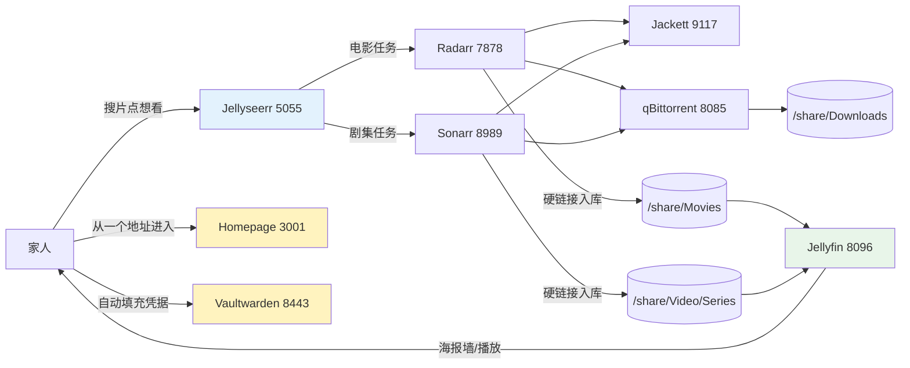
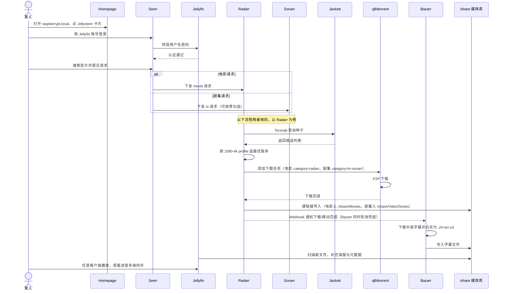
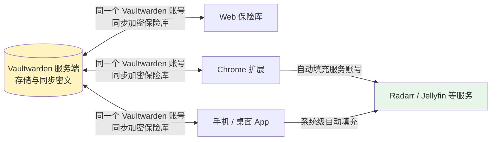
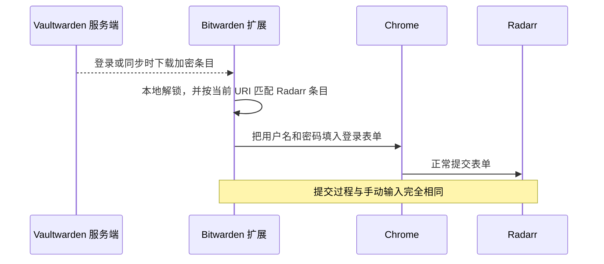
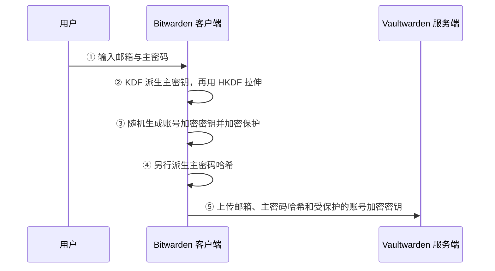
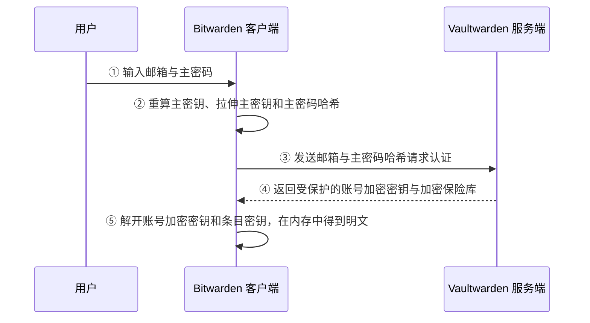
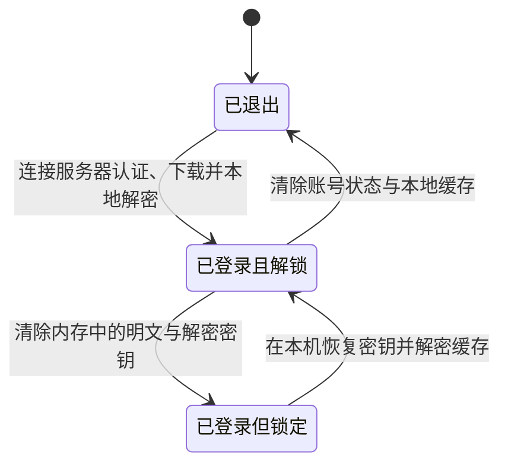
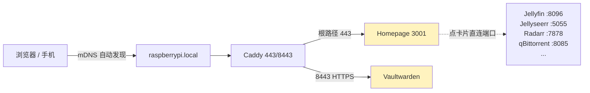

> **本系列共两篇**：[第一篇](/life/2026/06/17/raspberry-pi-docker-radarr-jackett-qbittorrent-bazarr/)搭建“搜索 → 下载 → 字幕”的自动化电影下载管线（Radarr + Jackett + qBittorrent + Bazarr）；第二篇（本文）在这条管线的上下游接入 Jellyseerr（点播）、Jellyfin（播放）、Sonarr（剧集）、Vaultwarden（密码管理）和 Homepage（统一入口），把它变成家人真正能用的家庭影院。

1. Table of Contents, ordered
{:toc}

## 1. 现有下载管线与四个补全目标

树莓派上原本已经运行着一条自动化下载管线：[Radarr、Jackett、qBittorrent、Bazarr 和 ChineseSubFinder](/life/2026/06/17/raspberry-pi-docker-radarr-jackett-qbittorrent-bazarr/) 分别负责电影管理、资源索引、下载和字幕，统一的 `/share` 挂载还保证了下载目录到媒体库之间可以使用[硬链接而不是复制](/life/2026/06/17/raspberry-pi-docker-radarr-jackett-qbittorrent-bazarr/#10-最大的坑两个-bind-mount-让硬链接悄悄变成复制2026-07-18-补记)。

这套系统已经能自动完成“搜索资源 → 下载 → 整理入库”，但家庭成员真正使用它时还缺少四个面向人的能力：

| 能力 | 现有缺口 | 补充组件 |
|------|---------|---------|
| 发现与点播 | 必须直接操作 Radarr 搜索电影、选择资源 | Jellyseerr |
| 媒体库与播放 | Samba 只提供文件，缺少跨设备海报墙和观看进度 | Jellyfin |
| 凭据管理 | 多个 WebUI 密码和 API Key 分散在文档中 | Vaultwarden |
| 服务入口 | 每个 WebUI 使用不同端口，地址难以记忆 | Homepage + Caddy |

四个组件并不替换原来的下载管线，而是分别接在它的上游、下游和管理面：



最终形成的使用路径是：家人在 Jellyseerr 发起点播，下载管线自动完成资源入库，Jellyfin 提供统一媒体库；Homepage 汇总所有管理入口，Vaultwarden 则为这些服务保存并填写独立密码。四个服务的部署配置均已提交到 [pi-docker-homelab](https://github.com/puppylpg/pi-docker-homelab) 仓库。

## 2. 补全家庭影院的点播与播放链

家庭影院的完整链路包含“提出观看需求”和“消费媒体内容”两个面向用户的阶段。Jellyseerr 接在 Radarr 上游，负责点播；Jellyfin 接在电影目录下游，负责媒体库和播放。两者之间继续复用原有下载管线。

### 2.1 Jellyfin 建立共享媒体库

原来的播放路径是“Radarr 入库 → Samba 共享电影文件 → 电视上的 Kodi 扫描并播放”。这条路径适合单台电视，但媒体库元数据和观看状态都保存在 Kodi 本机，手机、电脑和另一台电视无法直接共享。

[Jellyfin](https://jellyfin.org/) 把媒体库提升为独立的服务端能力：

| 维度 | Kodi + Samba | Jellyfin |
|------|---------------|----------|
| 片库来源 | Kodi 直接扫描共享文件 | Jellyfin 服务端扫描 `/share/Movies` |
| 海报与简介 | 保存在单台 Kodi 设备 | 服务端统一刮削并提供给所有客户端 |
| 观看进度 | 只属于当前设备 | 按用户跨设备同步 |
| 客户端接入 | 每台设备配置 Samba 和 Kodi | 浏览器、手机 App、电视客户端直接登录 |

Jellyfin 负责媒体库，并不要求放弃 Kodi。通过官方的 [Jellyfin for Kodi](https://jellyfin.org/docs/general/clients/kodi/) 插件，电视仍可使用 Kodi 的播放器和解码能力，片库、海报和观看进度则统一交给 Jellyfin 管理。这样既保留电视端直接播放的稳定性，也获得多用户和跨设备续播能力。

### 2.2 部署 Jellyfin

Jellyfin 使用 `linuxserver/jellyfin` 镜像，与现有 homelab 的权限和目录约定保持一致：

```yaml
  jellyfin:
    image: linuxserver/jellyfin:latest
    container_name: jellyfin
    environment:
      - PUID=1000
      - PGID=100
      - TZ=Asia/Shanghai
      # 刮削元数据需要访问 TMDB，走宿主机 V2Ray 代理
      - HTTP_PROXY=http://172.18.0.1:10809
      - HTTPS_PROXY=http://172.18.0.1:10809
      - NO_PROXY=localhost,127.0.0.1,jellyseerr,radarr
    volumes:
      - /home/pi/docker/jellyfin/config:/config
      - /home/pi/docker/jellyfin/cache:/cache
      # 只读挂载片库即可，元数据写在 config 里
      - /share/Movies:/data/movies:ro
    ports:
      - "8096:8096"
    restart: unless-stopped
```

配置中有三个关键点：

- 片库**只读挂载**（`:ro`），Jellyfin 的元数据、字幕缓存都写在自己的 `config`/`cache` 里，不会污染片库目录；
- 容器内媒体库路径统一为 `/data/movies`，与宿主机目录解耦；
- 刮削需要访问 TMDB，和 Jackett 一样走宿主机 V2Ray 代理，否则海报和简介无法加载。

首次访问 `http://raspberrypi.local:8096` 创建管理员，添加媒体库时选容器内路径 `/data/movies`。性能上树莓派 1080p 直接播放毫无压力，但不要指望它做 4K 实时转码——客户端支持直接播放才是关键。

#### LinuxServer.io 镜像约定

[LinuxServer.io](https://www.linuxserver.io/) 是第三方 Docker 镜像维护团队，不是 Jellyfin、Radarr 等上游应用的开发者。它的价值是用相同规则重新打包一批 homelab 应用：`PUID`/`PGID` 统一宿主机文件权限，配置通常挂到 `/config`，并为 ARM64 等架构提供一致的镜像入口。

| 维度 | 官方镜像 | LinuxServer.io 镜像 |
|------|---------|----------------------|
| 维护者 | 应用作者或官方组织 | 第三方社区团队 |
| 权限模型 | 各项目自行定义 | 通常统一使用 `PUID` / `PGID` |
| 配置目录 | 随项目变化 | 通常统一为 `/config` |
| 运行封装 | 直接运行应用或自定义入口 | 使用 s6-overlay 管理启动流程 |

统一封装降低了多个容器共同维护时的配置成本，也多引入了一层依赖。基础镜像升级可能改变启动钩子等约定，例如 `custom-cont-init.d` 的位置变化就与 LinuxServer.io 基础镜像有关，而不是 Radarr 本身。这里选择它是为了与现有媒体栈保持一致；核心数据库或基础设施仍优先使用官方镜像。

### 2.3 Jellyseerr 建立点播入口

[Jellyseerr](https://github.com/fallenbagel/jellyseerr) 位于家庭成员和 Radarr 之间。家人只需要搜索电影并提交请求，Jellyseerr 负责把请求转换为 Radarr 任务；Radarr、索引器和下载器的实现细节不会暴露给普通用户。

```yaml
  jellyseerr:
    image: fallenbagel/jellyseerr:latest
    container_name: jellyseerr
    environment:
      - TZ=Asia/Shanghai
      # 不要在这里配 HTTP_PROXY：env 代理会劫持包括 Jellyfin/Radarr 在内的全部
      # 请求且 NO_PROXY 不生效，TMDB 代理改在 Settings → Network 里配置
    volumes:
      - /home/pi/docker/jellyseerr/config:/app/config
    ports:
      - "5055:5055"
    restart: unless-stopped
```

首次访问 `http://raspberrypi.local:5055` 时选择 Jellyfin 登录并使用 Jellyfin 管理员账号完成初始化，后续普通家庭成员直接用各自的 Jellyfin 账号登录即可。初始化后还有两项关键设置：

- **Settings → Network**：搜索和海报依赖 TMDB API，在这里把代理指向同一 Docker 网络里的 V2Ray 容器（Hostname 填 `v2ray`、端口 `10809`），并用 bypass 规则排除 `jellyfin`、`radarr` 和本地地址。这个代理只作用于外发请求，是 Jellyseerr 配代理的正确位置。
- **Settings → Services → Radarr**：Host 填 Compose 服务名 `radarr`，端口填 `7878`，API Key 从 Radarr 设置页复制；Test 通过后必须选好 Quality Profile 和 Root Folder（Radarr 容器内的电影根目录），并设为 Default Server，否则点播请求会静默失败。

这里有一个容易踩的坑：**不要给 Jellyseerr 容器配置 `HTTP_PROXY` 环境变量**。环境变量代理会劫持进程内包括 Jellyfin、Radarr 在内的全部 HTTP 请求，而 Jellyseerr 不尊重 `NO_PROXY`——内部请求被送进 V2Ray 后无法解析容器主机名，登录和联动会全部失败。Jackett 等应用可以用 env 代理，是因为它们尊重 `NO_PROXY`，不能把这个经验套到 Jellyseerr 上。

### 2.4 从点播到播放的完整路径

媒体链路至此形成四个连续阶段：

1. 家人在 Jellyseerr 搜索电影并提交请求。
2. Jellyseerr 把请求发送给 Radarr，Radarr 通过 Jackett 选择资源并交给 qBittorrent 下载。
3. Radarr 使用硬链接把完成的文件整理到 `/share/Movies`，Jellyfin 扫描到新电影并补充元数据。
4. 家人从 Jellyfin 的任意客户端播放，观看进度回写服务端并在其他设备同步。

下载组件继续处理自动化细节，Jellyseerr 和 Jellyfin 分别提供面向用户的入口与出口。

### 2.5 Sonarr 补全剧集管线

Radarr 的数据模型里只有电影，它的搜索只接 TMDB 的电影接口，剧集在它面前根本不存在。剧集对应的是它的姊妹项目 [Sonarr](https://sonarr.tv/)：管理“剧 → 季 → 集”三层结构，支持按季监控、追更新集、抓取 season pack。点播入口按媒体类型分流：**movie 请求发给默认 Radarr，tv 请求发给默认 Sonarr**，缺哪一边，哪种类型的请求就会在“已批准”状态下原地不动。这条分工是 *arr 系列本身的边界，不是 Jellyseerr 的偏好。

Sonarr 的部署沿用 Radarr 的全部约定：

```yaml
  sonarr:
    image: linuxserver/sonarr:latest
    container_name: sonarr
    environment:
      - PUID=1000
      - PGID=100
      - TZ=Asia/Shanghai
      - HTTP_PROXY=http://172.18.0.1:10809
      - HTTPS_PROXY=http://172.18.0.1:10809
      - NO_PROXY=localhost,127.0.0.1,qbittorrent,radarr,sonarr,jackett,bazarr,jellyseerr
    volumes:
      - /home/pi/docker/sonarr/config:/config
      # 与 radarr 相同的单一 /share 挂载，保证导入时硬链接而非复制
      - /share:/share
    ports:
      - "8989:8989"
    restart: unless-stopped
```

接线时与 Radarr 不同的几点：

- **根目录**用剧集库 `/share/Video/Series`；该目录如果是从别处拷贝来的，注意属主（本机曾是 `nobody:nogroup`），否则 Sonarr 会报目录不可写。
- **索引器**同样从 Jackett 接入 Torznab，但分类要选剧集类（`5000` 系列），直接照抄 Radarr 的电影分类（`2000` 系列）会什么都搜不到。
- **qBittorrent 下载器**配置与 Radarr 相同，category 单独用 `sonarr`，避免和电影下载混在一起。
- **Seerr 的代理 bypassFilter 要补上 `sonarr`**（见 2.3 的代理说明），否则 Seerr 到 Sonarr 的内部请求会被送进 V2Ray 而失败。
- Jellyfin 侧同步新增一个“剧集”媒体库：compose 里加只读挂载 `/share/Video/Series:/data/series:ro`，再在媒体库设置里添加即可。

之后在 Seerr 的 **Settings → Services → Sonarr** 中关联：Host 填 `sonarr`、端口 `8989`、API Key 从 Sonarr 设置页复制，Test 通过后选好 Quality Profile 和根目录并设为 Default Server。剧集点播随后走与电影完全相同的自动化路径，只是终点目录换成 `/share/Video/Series`。

### 2.6 端到端时序：从打开首页到按下播放

第一篇 2.2 的时序图只覆盖电影下载管线；接入点播入口、剧集管线和播放端之后，完整链路如下：



与第一篇时序图相比，链路的三个变化：

1. **入口前移**：用户不再直接面对 Radarr，而是从 Homepage 进 Seerr 点播，登录直接复用 Jellyfin 账号（Seerr 调 Jellyfin 认证接口校验），家人不需要知道 *arr 的存在；
2. **中段分流**：Seerr 按媒体类型把请求分发给 Radarr 或 Sonarr（见 2.5 的分工说明），分流之后的“查询 → 下载 → 导入 → 字幕”流程两者完全一致，只是下载分类和终点目录不同；
3. **出口补齐**：导入媒体库只是终点的一半，Jellyfin 扫描入库并面向所有播放端提供播放和进度同步，链路才真正闭环。

## 3. 使用 Vaultwarden 统一管理凭据

凭据管理由一个自托管服务端和多个客户端共同完成：Vaultwarden 在树莓派上同步加密数据，Bitwarden 浏览器扩展和 App 在用户设备上解密、生成并填写密码。理解这组分工后，账号归属、插件登录方式和加密流程就可以沿着同一条数据链展开。

### 3.1 密码管理的目标

homelab 里的服务越来越多，Jellyfin、Radarr、qBittorrent 和 Portainer 都有自己的登录凭据。把这些密码写进部署文档虽然方便，却会同时带来明文泄露和密码复用问题；一旦文档被公开发布，密码也会随文章进入互联网——[第一篇](/life/2026/06/17/raspberry-pi-docker-radarr-jackett-qbittorrent-bazarr/)就是把所有凭证直接写进了正文，发布即视为泄露，这一节要的正是终结这种管理方式。

服务只监听局域网，能阻止互联网设备直接访问，却不能防住访客网络、中毒设备或已经进入内网的人。更稳妥的管理方式是：

- 人只记住一个足够强的**主密码**；
- 每个服务使用不同的随机强密码；
- 密码以密文形式集中保存，并在电脑和手机之间同步；
- 登录服务时由客户端自动填充，不再从文档复制明文。

Vaultwarden 用来实现密文存储与同步，Bitwarden 客户端负责生成、解密和填写密码。

### 3.2 一个服务端，多种客户端

[Vaultwarden](https://github.com/dani-garcia/vaultwarden) 是兼容 Bitwarden 协议的轻量级自托管服务端。它运行在树莓派上，保存账号信息和加密后的保险库。浏览器里的 Web 保险库、Chrome 扩展、手机 App 和桌面 App 则是 Bitwarden 客户端，所有加解密都发生在这些客户端上。

四者之间是同一套账号和数据：先在树莓派的 Vaultwarden 网页注册一个密码库账号，再用同一邮箱和主密码登录各个客户端。Radarr、Jellyfin 等服务的账号不是用来登录 Bitwarden 的账号，而是登录 Bitwarden 后保存在保险库里的密码条目。



Bitwarden 扩展默认连接官方的 `bitwarden.com`。官方服务器和树莓派上的 Vaultwarden 是两个独立的账号空间，即使使用相同邮箱，数据也不会自动互通；连接自托管服务前必须先把客户端的服务器地址切换到 Vaultwarden。

### 3.3 部署服务端并创建密码库账号

Vaultwarden 使用 Rust 编写，资源占用很低，适合直接放进树莓派现有的 Docker Compose：

```yaml
  vaultwarden:
    image: vaultwarden/server:latest
    container_name: vaultwarden
    environment:
      - TZ=Asia/Shanghai
      # 初次使用先开放注册，建好账号后改为 false 重建容器
      - SIGNUPS_ALLOWED=true
      - HTTP_PROXY=http://172.18.0.1:10809
      - HTTPS_PROXY=http://172.18.0.1:10809
      - NO_PROXY=localhost,127.0.0.1
    volumes:
      # 保险库数据，务必纳入备份
      - /home/pi/docker/vaultwarden/data:/data
    ports:
      - "8001:80"
    restart: unless-stopped
```

Vaultwarden 的 Web 保险库依赖浏览器 Web Crypto API（SubtleCrypto）在本地完成加解密。浏览器只在 HTTPS 或 `localhost` 这类安全上下文中开放该 API，因此通过 `http://raspberrypi.local:8001` 直接访问会报 “You are not using a secure context ... You need to enable HTTPS!”。

Vaultwarden 不支持子路径，这里让 Caddy 为它单独提供一个 HTTPS 端口：

```caddy
raspberrypi.local:8443 {
    reverse_proxy vaultwarden:80
}
```

服务端和账户按下面的顺序初始化：

1. 保持 `SIGNUPS_ALLOWED=true` 启动容器，暂时开放注册入口。
2. 让电脑信任 Caddy 的本地根证书，确认浏览器打开 `https://raspberrypi.local:8443` 时没有证书警告。
3. 在 Web 保险库注册邮箱和主密码。这里创建的就是整个密码库账号，后续所有 Bitwarden 客户端都使用它登录。
4. 登录 Web 保险库确认账号可用，再把 `SIGNUPS_ALLOWED` 改为 `false` 并重建容器，关闭新用户注册。

如果网页能打开而客户端提示网络或证书错误，需要先把 Caddy 根证书加入客户端设备的系统信任库。仅在浏览器警告页点击“继续访问”，不一定能让扩展和手机 App 同时信任该证书。

### 3.4 连接并使用 Chrome 扩展

按照 Bitwarden 官方的[自托管客户端连接方式](https://bitwarden.com/help/change-client-environment/)，Chrome 扩展首次登录前先指定服务器：

1. 打开扩展，在登录页找到 **Logging in on**（中文界面可能显示“登录到”或“服务器”）。
2. 选择 **Self-hosted**，在 **Server URL** 填入 `https://raspberrypi.local:8443` 并保存。
3. 使用 3.3 节在 Web 保险库注册的邮箱和主密码登录。

服务器地址只填写 HTTPS 根地址，不附加 `/admin`，也不填写容器内部地址或 HTTP 端口。配置完成后，扩展会从树莓派下载这个账号的加密保险库。

以 Radarr 为例，新建一条“登录”记录，依次填写名称、用户名、密码和登录网址（URI）。其中 URI 用来建立密码条目与网站之间的对应关系；再次打开 Radarr 登录页时，扩展会自动列出匹配记录。创建新账号或修改密码时，可以直接使用扩展生成随机强密码，并把最终生效的密码保存回条目。

自动填充的完整过程如下：



Vaultwarden 负责把密文同步给扩展；扩展在本机解密并填入浏览器；浏览器再向 Radarr 提交普通登录请求。没有安装扩展时，也可以从 Web 保险库或 App 复制密码后手动粘贴。手机上的对应能力是 Android Autofill 或 iOS 密码自动填充。

Bitwarden 客户端还区分**登录**和**解锁**两种状态。登录发生在新设备或退出后的设备上，需要连接 Vaultwarden 完成身份认证并下载加密保险库。锁定则保留账号和本地加密缓存，只清除内存中的明文与解密密钥；之后使用主密码、PIN 或生物识别解锁时，可以直接读取本地缓存，不要求树莓派在线。日常使用保持“已登录但锁定”即可，只有更换账号或清除本地数据时才需要退出登录。Bitwarden 官方文档也将[登录与解锁](https://bitwarden.com/help/understand-log-in-vs-unlock/)定义为两个独立过程。

### 3.5 零知识加密的数据流程

Vaultwarden 采用 Bitwarden 的零知识加密模型：服务器保存账号元数据、认证材料和加密后的保险库，但不接收主密码、未加密的账号加密密钥或明文密码。加密和解密都在 Web 保险库、浏览器扩展或 App 内完成。

按照 Bitwarden 的[安全白皮书](https://bitwarden.com/help/bitwarden-security-white-paper/)，最常见的“邮箱 + 主密码”流程包含下面几类密钥：

- **主密码**是人需要记住的秘密，只作为客户端计算的输入，从不上传服务器。
- **主密钥（Master Key）**由客户端使用邮箱、主密码和 KDF 参数派生。PBKDF2-SHA256 默认执行 60 万轮，也可以改用 Argon2id；高计算成本用于减慢暴力猜测。
- **拉伸主密钥（Stretched Master Key）**由主密钥经过 HKDF 扩展，用来保护账号加密密钥。
- **账号加密密钥（Account Encryption Key / User Symmetric Key）**在注册时随机生成，是保护整个个人保险库的长期“总钥匙”。服务器只保存它被加密后的版本。
- **条目密钥（Cipher Key）**为每条登录、卡片或安全笔记单独生成，用来加密条目正文；账号加密密钥再保护这些条目密钥。
- **主密码哈希（Master Password Hash）**从主密钥继续派生，只用于服务器认证，不参与保险库解密。

#### 注册：建立账号和加密材料

注册只发生一次，用来创建账号、随机密钥和服务器端记录：



第 ① 步提供账号标识和只有用户知道的秘密。第 ② 步把人类可记忆的密码转换成适合密码学运算的密钥材料，并用大量计算提高离线猜测成本。第 ③ 步生成真正负责长期保护保险库的随机密钥；主密码以后发生变化时，通常只需更换这把密钥的外层保护，不必重写所有条目正文。第 ④ 步产生独立的认证凭据，把“向服务器证明身份”和“在本地解密数据”分成两条路径。第 ⑤ 步把账号记录交给服务器保存，此时服务器拿到的账号加密密钥已经处于加密状态。

保存 Radarr 等条目时，客户端会先用各自的 Cipher Key 加密正文，再用账号加密密钥保护 Cipher Key，最后只把密文上传到 Vaultwarden。

#### 登录：在设备上取得并解密保险库

新设备首次登录，或者设备退出后重新登录，需要同时完成服务器认证和本地解密：



第 ①、② 步在新设备上重新生成相同的密钥材料，避免在设备之间传输明文钥匙。第 ③ 步只把认证用哈希发送给 Vaultwarden；如果启用了 2FA，也在这个阶段校验。第 ④ 步由服务器返回同步所需的密文。第 ⑤ 步完全在客户端内完成，先解开账号加密密钥，再解开每个 Cipher Key，最后得到可查看、复制和自动填充的条目内容。

#### 锁定、解锁与同步

登录成功后，客户端会把加密保险库缓存在本地。锁定、解锁和退出登录对应三种不同状态：



解锁只在已经登录的设备上发生，因此可以离线完成。主密码、PIN 或生物识别在本机恢复账号加密密钥，随后解开已有缓存。同步则需要连接 Vaultwarden：客户端把新增或修改后的条目先在本地加密，再上传密文；其他客户端连回服务器后下载这些密文并在各自设备上解开。

### 3.6 安全边界与日常规则

这套结构把密码的存储、同步和填写统一起来，同时留下几条需要单独处理的安全边界：

- **主密码必须强且不能遗忘**：默认个人账号没有可供服务器取回的明文主密码或解密密钥；主密码过弱还会让数据库泄露后的离线暴力猜测变得可行。
- **服务密码全部随机且互不相同**：密码记忆和填写已经由客户端接管，没有继续复用弱密码的必要。
- **服务器数据必须备份**：`/home/pi/docker/vaultwarden/data` 是保险库的服务端主副本，客户端缓存不能替代正式备份。这份目录应定期复制到另一块存储介质。
- **自动填充不负责目标服务的传输安全**：扩展把密码填进表单后，提交过程与手动输入相同。Radarr 等服务如果仍使用 HTTP，凭据在局域网传输时仍缺少 HTTPS 保护。
- **真实密码和 API Key 不再写入文档**：密码管理器可以替换存储工具，但不能替代发布前的内容检查。

## 4. 使用 Homepage 与 Caddy 统一服务入口

随着 WebUI 数量增加，入口设计需要同时满足四个条件：日常只记一个地址、局域网设备无须单独配置 DNS、不能要求每个后端支持子路径、Vaultwarden 仍能获得 HTTPS。先明确这些约束，再选择反向代理和导航页的职责，会比给每个服务机械地套一层代理更简单。

### 4.1 mDNS 提供零配置主机名

树莓派上的 [Avahi](https://www.avahi.org/) 通过 [mDNS](https://en.wikipedia.org/wiki/Multicast_DNS) 广播 `raspberrypi.local`。同一局域网中的电脑和手机可以直接解析这个主机名，不需要把 DNS 指向 AdGuard Home，也不依赖路由器下发自定义记录。

零配置不代表零坑：机器同时接着多张网卡时，Avahi 默认把所有接口的地址都发布出去，客户端解析到不可达的地址就会表现为服务“时好时坏”，排查与收敛方法见 [5.4](#54-mdns-双网卡导致主机名时好时坏)。

mDNS 只负责主机名，不会自动解析 `radarr.raspberrypi.local`、`jellyfin.raspberrypi.local` 等多级子域名。为每个服务分配子域名意味着额外维护局域网 DNS；全部保留在 `raspberrypi.local` 下则可以继续使用 mDNS 的零配置能力。

[Caddy](https://caddyserver.com/) 用来承接这个主机名。与 Nginx 相比，它在当前场景中的优势不是代理能力更强，而是配置短，并能为 `.local` 主机名签发本地证书、处理 HTTPS 跳转。局域网入口因此只需要一个 Caddyfile 和客户端对本地根证书的信任。

### 4.2 裸端口与 Caddy 子路径的边界

没有统一入口时，每个服务都需要单独记住端口：

| 服务 | 端口 | 服务 | 端口 |
|------|------|------|------|
| Radarr | 7878 | Sonarr | 8989 |
| Jackett | 9117 | Bazarr | 6767 |
| qBittorrent | 8085 | ChineseSubFinder | 19035 |
| Jellyfin | 8096 | Jellyseerr | 5055 |
| AdGuard Home | 8080 | | |

Caddy 子路径可以把这些地址改写为 `raspberrypi.local/radarr`、`raspberrypi.local/jackett` 等形式：

```caddy
raspberrypi.local {
    reverse_proxy /radarr* radarr:7878
    reverse_proxy /jackett* jackett:9117
    reverse_proxy /bazarr* bazarr:6767
    reverse_proxy /adguard* adguardhome:80
}
```

子路径代理要求后端知道自己的 URL Base。Radarr、Jackett 和 Bazarr 可以分别配置 `UrlBase`、`BasePathOverride` 和 `base_url`，让静态资源与 API 请求都携带路径前缀；不支持 URL Base 的应用仍会请求根路径 `/`，导致资源 404 或页面白屏。

qBittorrent WebUI 的 API 路径以 `/api/v2/...` 为根，ChineseSubFinder 也按根路径部署，两者无法完整接入这套子路径。继续为部分服务保留裸端口后，用户仍要记忆两种地址模型，子路径没有真正统一入口。

### 4.3 Homepage 承担唯一导航入口

[Homepage](https://gethomepage.dev/) 把所有服务链接集中到一个导航页，还可以通过只读 Docker socket 展示容器状态。它只负责“从一个入口找到所有服务”，不需要代理或改写后端请求：

```yaml
  homepage:
    image: ghcr.io/gethomepage/homepage:latest
    container_name: homepage
    environment:
      - PUID=1000
      - PGID=100
      - TZ=Asia/Shanghai
      # v1+ 必须显式允许访问的 Host
      - HOMEPAGE_ALLOWED_HOSTS=raspberrypi.local,192.168.1.7:3001,raspberrypi.local:3001
    volumes:
      - /home/pi/docker/homepage/config:/app/config
      # 只读挂 docker socket，用于首页显示容器运行状态
      - /var/run/docker.sock:/var/run/docker.sock:ro
    ports:
      - "3001:3000"
    restart: unless-stopped
```

部署时需要处理两个运行条件：`ghcr.io` 无法直连时，可通过[南京大学 GHCR 镜像站](https://ghcr.nju.edu.cn/)拉取后重新 `docker tag` 为原镜像名；Homepage v1 还要求 `HOMEPAGE_ALLOWED_HOSTS` 明确列出所有访问用 Host，否则页面虽然能打开，数据接口会返回 `Host validation failed`。

Homepage 本身是 Next.js 应用，长期缺少稳定的子路径支持。[早期讨论](https://github.com/gethomepage/homepage/discussions/150)中的 `base` 设置需要代理端配合剥离前缀，JS 资源、`/api` 和 widget 请求仍可能失效；[后续讨论](https://github.com/gethomepage/homepage/discussions/5087)也建议直接把根路径交给 dashboard。导航页又是整个系统的第一跳，因此将它放在根路径比 `/homepage` 更稳定。

### 4.4 最终入口配置

最终职责划分为：Caddy 只代理 Homepage 和必须使用 HTTPS 的 Vaultwarden；Homepage 卡片直接链接其他服务的原始端口。

```caddy
raspberrypi.local {
    # 根路径直接给 Homepage 导航页，其他服务从导航页点过去、直连端口
    reverse_proxy homepage:3000
}

# Vaultwarden 的客户端连接依赖 HTTPS（见 3.3），单独保留 HTTPS 端口
raspberrypi.local:8443 {
    reverse_proxy vaultwarden:80
}
```

Homepage 的服务清单里直接写端口链接（mDNS 下主机名比 IP 好写）：

```yaml
- 影音:
    - Jellyfin:
        href: http://raspberrypi.local:8096
        description: 媒体播放
    - Jellyseerr:
        href: http://raspberrypi.local:5055
        description: 点播入口
```

从子路径方案切换回来时，还需要清理后端的路径配置：Radarr 的 `UrlBase` 清空，Jackett 的 `BasePathOverride` 改回 `null`，Bazarr 的 `base_url` 改回 `/`。否则用户从 Homepage 直连端口后，应用仍会跳转到旧的 `/radarr` 等路径。`HOMEPAGE_ALLOWED_HOSTS` 则要保留不带端口的 `raspberrypi.local`，因为经 Caddy 443 访问时 Host 不包含 Homepage 的 `3001` 端口。



实线表示实际经过 Caddy 的请求，虚线表示 Homepage 页面中的导航链接。所有普通 WebUI 都以原生根路径运行，qBittorrent 和 ChineseSubFinder 不再需要适配 URL Base；Vaultwarden 因客户端安全要求继续通过 Caddy 的 8443 端口访问。

### 4.5 三种入口模型对比

三种入口模型解决的是不同层次的问题，取舍可以归纳如下：

| 方案 | 要记几个地址 | 网络配置 | 前提条件 | 结局 |
|------|-------------|---------|---------|------|
| 裸端口 | N 个主机名:端口 | 无 | 无 | 地址分散 |
| Caddy 子路径 | 1 个主机名 + N 个路径 | mDNS | 每个后端支持 URL Base | 部分服务无法接入 |
| Homepage 占根 | 1 个首页地址 | mDNS | Homepage 可用 | 与所有原生端口兼容 |

最终模型把“统一入口”和“统一代理”分开：用户只记住 `https://raspberrypi.local/`，但各后端继续使用最兼容的原生端口。Caddy 只服务入口本身和 Vaultwarden，入口之内全部直连。

## 5. 升级 Seerr 与排障实录

系统跑起来之后，又经历了一次大版本升级和一轮集中排障。这一节按“升级 → 联动坑 → 容量教训 → 网络解析 → 队列残留 → 路径统一”的顺序记录，原因都比症状有趣。

### 5.1 Jellyseerr 更名 Seerr

Jellyseerr 与 Overseerr 已合并更名为 [Seerr](https://github.com/seerr-team/seerr)：旧镜像 `fallenbagel/jellyseerr` 停留在 2.7.3，新版本只发布到 `ghcr.io/seerr-team/seerr`。界面上提示“有更新”时，单纯 `docker compose pull` 拉到的永远是旧镜像，必须换镜像名。

升级本身是平滑的：`ghcr.io` 不通时经[南京大学 GHCR 镜像站](https://ghcr.nju.edu.cn/)拉取后重新 `docker tag` 为原名；`/app/config` 原样挂载，启动时自动执行迁移脚本，请求记录、*arr 关联、代理设置全部保留。唯一的坑是新镜像以 `node` 用户（uid 1000）运行，而旧镜像写下的配置目录属主是 root，重建前需要 `chown -R 1000:1000` 配置目录，否则启动即报 `EACCES`。

### 5.2 Seerr 与 *arr 联动的三个坑

联动配置出错时，症状惊人地一致：**请求显示“已批准”，但 Radarr/Sonarr 里毫无动静**。三个实际踩过的坑按排查顺序排列：

1. **URL Base 填 `/` 产生双斜杠**。Seerr 用 `<baseUrl>/api/v3` 拼接 *arr 地址，baseUrl 填 `/` 会得到 `//api/v3`。Radarr 对双斜杠路径不报错，而是返回前端页面 HTML：画质配置拉取变成 HTML 字符串，Requests 页渲染时崩溃（`profiles.find is not a function`），下发请求则在 HTML 里静默失败。没有配置 URL Base 的服务，这个字段必须**留空**。
2. **`tagRequests` 生成的标签名含空格**。Seerr 2.x 会为请求者在 *arr 里创建形如 `1 - admin` 的标签，而 Radarr 要求标签名小写且不含空格，直接 400 拒绝，影片随之添加失败。Seerr v3 已把标签空格替换为 `-` 修复；旧版本只能关闭 `tagRequests`。
3. **已批准的请求不会自动重发**。Seerr 只在请求状态**发生变化**时触发向 *arr 的下发。配置修好后，停留在“已批准”状态的旧请求点 Retry 是空操作（状态没变，什么都不发生），必须删除请求后重新点播。

排障时的可靠顺序是：先看 Seerr 日志里 `Media Request` 和 `Download Tracker` 两个标签的输出，再到 *arr 里确认影片是否真的添加，最后在 qBittorrent 队列里确认任务是否起来——三个环节各自独立，出问题只会在其中一环。

### 5.3 剧集“全季请求”的体积教训

电影的体积直觉不适用于剧集。电影一部十几 GB，而剧集请求默认可以一次勾选**全部季**：一部二十多季的长寿剧，仅 season pack 就是上百 GB。接入 Sonarr 后的第一次批量点播，下载队列瞬间排到一百多个任务，磁盘水位直接告急，只能紧急暂停全部任务再逐个放行。

两条对策：批量点剧之前先看磁盘余量，长寿剧按季请求而不是一次全要；在 Seerr 的用户设置里给家人配请求配额（比如每 7 天限几部电影、几季剧），从源头挡住“刷爆磁盘”式点播。

### 5.4 mDNS 双网卡导致主机名“时好时坏”

从 Homepage 点开 Jellyfin，偶尔直接报“服务器不可用”，刷新几次又可能恢复；改用 IP 访问则永远正常。症状出在域名解析上，与 Jellyfin 本身无关。

树莓派同时接着两张网卡：有线 `end0`（192.168.1.x）和 WiFi `wlan0`（192.168.31.x，另一个网段）。Avahi 默认在**所有接口**上发布本机地址，包括 WiFi 地址、两张网卡的 IPv6 全局地址、以及一堆 docker/veth 网桥的 fe80 链路本地地址。客户端解析 `raspberrypi.local` 时拿到哪个地址全凭运气：拿到有线 IPv4 就能通，拿到跨网段的 WiFi 地址或不可达的 IPv6 地址就是“服务器不可用”。mDNS 缓存到期后重新解析的结果仍然随机，所以表现为“修好了还会复发”。

修复是把发布范围收窄到唯一可信的地址，改 `/etc/avahi/avahi-daemon.conf`：

```ini
[server]
allow-interfaces=end0        # 只在有线网卡上发布
use-ipv6=no                  # mDNS 只走 IPv4 传输

[publish]
publish-aaaa-on-ipv4=no      # 不再发布 IPv6 的 AAAA 记录
```

第三个开关最容易漏：`use-ipv6=no` 只禁用 IPv6 **传输**，AAAA 记录仍会搭 IPv4 响应的车发出去，必须单独关闭。改完 `systemctl restart avahi-daemon`，用 `avahi-resolve -4/-6 -n raspberrypi.local`（来自 `avahi-utils` 包）验证：IPv4 应只返回有线地址，IPv6 应查无记录；`journalctl -u avahi-daemon` 里的 `Registering` 行也能看到实际发布了哪些地址。

排查时有两个误导项值得记下：

- 在树莓派本机 `getent hosts raspberrypi.local` 会列出所有接口的地址——那是 systemd `nss-myhostname` 合成的本机答案，**不代表 Avahi 对外发布的内容**，不能用来验证修复；
- 服务端改干净后客户端可能仍然失败，因为设备缓存着旧的错误记录：Windows 跑 `ipconfig /flushdns`（Chrome 还要在 `chrome://net-internals/#dns` 清 host cache），手机开关一次飞行模式。Jellyfin 网页端自身还有 service worker 缓存，用无痕窗口测试可以一并排除。

判据始终只有一条：在出问题的设备上 `ping raspberrypi.local`，看它实际解析到哪个地址。

### 5.5 删除剧集不会撤回下载任务

在 Sonarr 里删掉一部剧之后，qBittorrent 里属于该剧的任务仍在排队下载。这不是 bug，而是职责边界：Sonarr 只是把磁力链接**单向**下发给 qBittorrent，后者拿到任务后独立运行，不知道剧集已被删除；Sonarr 删除剧集的对话框只处理自身数据库记录和媒体文件，不会回收已下发的下载任务。

想停下载要分清两种意图：只是不再抓新集数，把剧集改为 unmonitor 即可；连正在下载的任务一起撤掉，要在 **Activity → Queue** 里删除队列项并勾选 **Remove from download client**，Sonarr 这时才会调用 qBittorrent 的 API 撤任务。顺序很关键——先删剧集，Queue 记录会随剧集一起消失，剩下的孤儿任务只能去 qBittorrent 里手动清理：WebUI 里按 `tv-sonarr` 分类过滤后按剧名挑选，或者走 `torrents/delete` API 按 hash 批量删。

### 5.6 路径统一：拆掉所有翻译层

Sonarr 曾报过一条警告：`download client qBittorrent places downloads in /downloads but this directory does not appear to exist inside the container`。直接解法是给 Sonarr 加一条 Remote Path Mapping（“qBittorrent 说 `/downloads` 时，到 `/share/Downloads` 找”），警告当天就消了。但这条警告只是症状：当时同一个文件在每个容器里的路径都不一样——qBittorrent 说 `/downloads`，Radarr 靠[第一篇第 10 节](/life/2026/06/17/raspberry-pi-docker-radarr-jackett-qbittorrent-bazarr/)的软链脚本说 `/movies` 和 `/downloads`，Sonarr 说 `/share/...`，Seerr 给两边各填一种，Bazarr 又单独挂载跟随 Radarr。**软链和远程路径映射这些“翻译层”存在的唯一原因就是路径不统一**，每加一层就多一处静默故障点。

翻译层只治标。根治是把全链路迁到同一个绝对路径：电影 `/share/Movies`、剧集 `/share/Video/Series`、下载 `/share/Downloads`，任何容器看到的都是物理路径本身，然后拆掉所有翻译层。第一篇 10.4 没做这套“迁移手术”是因为当时判断风险大于收益；有了 API 批量操作的经验后，实际做下来半小时内完成：

1. **qBittorrent 对齐路径**：加挂 `/share:/share`，默认下载路径改为 `/share/Downloads`；队列里 29 个存量任务用 `torrents/setLocation` 批量迁移（物理是同一目录，文件零移动），随后摘除 `/downloads` 旧挂载。
2. **Radarr 批量改写库记录**：新增 root folder `/share/Movies`，用 API 把 23 部电影的 `path` 从 `/movies/...` 改写为 `/share/Movies/...`（`moveFiles=false`，文件不动只改记录），再删旧 root folder。两个隐藏引用也要一并修：电影合集的 `rootFolderPath` 和一个已禁用的 CouchPotato 导入列表残留——漏掉它们，Health 会持续报“缺失根目录”。
3. **下游全部对齐**：Seerr 的 radarr activeDirectory 改为 `/share/Movies`；Bazarr 挂载改为整挂 `/share:/share`。Bazarr 这一步还有附带收益：它之前只挂了 `/movies` 和 `/downloads`，Sonarr 上报的 `/share/Video/Series` 它根本看不见——**剧集字幕其实一直是断的**，路径统一后才接上。
4. **拆除翻译层**：删掉软链脚本和两条远程路径映射，重建容器。

验收标准：Radarr、Sonarr 的 Health 均零警告；有文件的影片刷新后全部正常识别；新下载直接落在 `/share/Downloads`，导入硬链接照常工作。至此系统里不存在任何路径别名——这也印证了第一篇 10.4 的判断：从零搭建的系统本就不需要软链，这次迁移等于把存量系统迁回了它本该长成的样子。

## 6. 当前架构与扩展方向

整合后的 homelab 可以分成三层：Jellyseerr、Homepage 和 Bitwarden 客户端直接面向使用者；Jellyfin、Radarr、Sonarr 等应用提供播放、下载和管理能力；Caddy、Vaultwarden、AdGuard Home 与 V2Ray 提供入口、凭据和网络支撑。各组件保留独立职责，通过明确的接口连接，而不是由一个服务包办全部功能。

当前服务分布如下：

| 分组 | 服务 | 端口 |
|------|------|------|
| 播放与点播 | Jellyfin、Jellyseerr | 8096、5055 |
| 下载管线 | Radarr、Sonarr、Jackett、qBittorrent、Bazarr、ChineseSubFinder | 7878、8989、9117、8085、6767、19035 |
| 入口与管理 | Homepage、Vaultwarden、Caddy、Portainer | 3001（经 443 反代）、8443（HTTPS 反代）、80/443、9443 |
| 网络 | AdGuard Home、V2Ray | 53/3000、10808/10809 |

### 6.1 日常使用与维护重点

家庭成员日常只需要记住 `https://raspberrypi.local/`：进入 Homepage 后选择 Jellyseerr 点播或打开 Jellyfin 播放。管理员也从同一页面进入各个 WebUI，Bitwarden 扩展按网址匹配并填写对应的独立密码。

稳定运行依赖三项持续维护：

- 定期备份各容器的配置目录，尤其是 Vaultwarden 的 `/home/pi/docker/vaultwarden/data`；
- 新增服务时先确定它属于用户入口、业务应用还是基础支撑，再决定是否出现在 Homepage；
- 播放端尽量使用 Jellyfin 直接播放，避免把树莓派变成实时转码服务器。

### 6.2 可继续补充的服务

下面这些 ARM64 服务可以沿着现有分层继续扩展，不会改变核心链路：

- **Prowlarr**：Jackett 的现代化替代，索引器统一管理并同步给所有 *arr；
- **Recyclarr**：把 [TRaSH Guides](https://trash-guides.info/) 推荐的画质配置自动同步进 Radarr/Sonarr；
- **Navidrome**：音乐流媒体，私人 Spotify；
- **Immich**：自托管 Google Photos，8G 内存能跑；
- **Uptime Kuma / Dozzle**：服务存活监控 / 浏览器里看容器日志。

Tdarr 依赖大量转码算力，不适合把树莓派作为主要处理节点；Nextcloud 虽然可以运行，但资源占用和维护复杂度都明显高于当前服务。扩展时仍应优先选择职责单一、支持 ARM64、可以复用现有目录与入口模型的组件。
