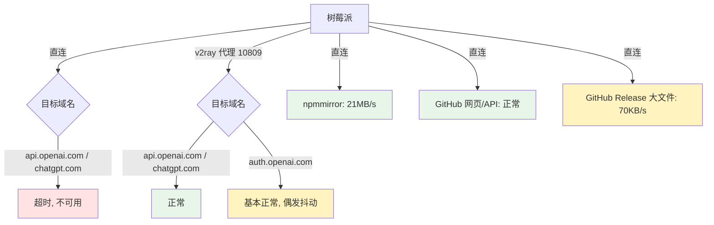
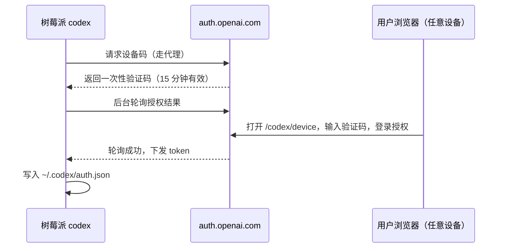

1. Table of Contents, ordered
{:toc}

## 背景与目标

手头有一台树莓派 5（aarch64，Debian 12 bookworm），平时跑着一堆 Docker 服务，其中就包括一个 v2ray 代理容器（宿主机 `127.0.0.1:10809` 暴露 HTTP 代理、`10808` 暴露 SOCKS5）。现在的目标是：在这台机器上安装 OpenAI 的 [Codex CLI](https://github.com/openai/codex)，并用已有的 ChatGPT 账号登录使用。

这件事有两个绕不开的问题：

1. **网络路径不明**：OpenAI 的域名在国内的可达性从来都不是“通”或“不通”一句话的事，不同域名、不同出口结果可能完全不同。装之前必须先实测：到底能直连，还是必须走代理？
2. **环境不匹配**：系统自带的 Node 是 v18，而日常登录 shell 是 fish 而不是 bash，很多“标准安装文档”默认的环境这里都不成立。

## 第一步：先探测网络，再决定方案

在装任何东西之前，先用 `curl` 对几个关键域名分别做直连和走代理的对比测试。结果很有戏剧性：

| 目标 | 直连 | 走代理（127.0.0.1:10809） |
|------|------|--------------------------|
| `api.openai.com` | 超时（被阻断） | 通（401，只是没认证） |
| `chatgpt.com` | 超时（被阻断） | 通（403，Cloudflare 拦截 curl 属正常） |
| `auth.openai.com` | 能连上但被 Cloudflare 403 | 通，但**偶发超时** |
| `github.com` | 通 | — |
| GitHub Release 大文件 | 能下，但只有约 70 KB/s | 同样慢 |
| `registry.npmmirror.com` | 通，约 21 MB/s | — |

几个值得注意的细节：

- `api.openai.com` 和 `chatgpt.com` 直连直接超时，说明**必须走代理**，没有商量余地。401/403 在这里反而是好消息——说明 TCP/TLS/HTTP 链路完全正常，只是缺身份凭证。
- `auth.openai.com`（登录授权专用域名）情况最特殊：直连能到 Cloudflare 边缘节点，但请求被 403 拦截（Cloudflare 对非浏览器客户端的拦截）；走代理则大部分时间正常，但会偶发性整连接挂起——后续登录流程恰恰就栽在这个抖动上。
- GitHub 直连虽然通，但 Release 资产（100 MB 级别的二进制）下载速度只有几十 KB/s，等它下完要二十多分钟，不实用。

用一张图概括探测后的流量路径结论：



## 第二步：安装——弃用 GitHub Release，改走 npm 镜像

Codex CLI 官方提供两种安装方式：npm 包 `@openai/codex`，或者 GitHub Release 上的独立静态二进制（`codex-aarch64-unknown-linux-musl.tar.gz`）。

直觉上树莓派装独立二进制最干净（不依赖 Node），但上面探测过了：GitHub Release 大文件下载慢到不可用。而 npm 包有两个被低估的优点：

- 它的 `engines` 只要求 **Node >= 16**，系统自带的 v18 完全够用；
- npm 包本体只是个 launcher，真正的平台二进制通过 optionalDependencies（`@openai/codex-linux-arm64`）分发，而 npmmirror 对它们是全量镜像的，速度 21 MB/s。

于是安装就是一行命令，10 秒完成（`--prefix ~/.local` 避免动用 sudo）：

```bash
npm install -g --prefix ~/.local --registry=https://registry.npmmirror.com @openai/codex
~/.local/bin/codex --version   # codex-cli 0.145.0
```

## 第三步：shell 适配——fish 和 bash 的差异是真坑

因为 OpenAI 必须走代理，最省心的做法是给 `codex` 命令包一层代理环境变量，而不是全局 export（全局代理会把本来直连很快的 GitHub、npmmirror 也拖进代理）。

bash 下常见的写法是：

```bash
alias codex='env HTTPS_PROXY=http://127.0.0.1:10809 HTTP_PROXY=http://127.0.0.1:10809 command codex'
```

但这台机器的日常 shell 是 fish，照搬过来直接报错：

```
env: 'command': No such file or directory
```

原因很直接：`command` 在 bash 里既是内建也是外部命令，但在 fish 里只是内建函数，`env` 在文件系统里找不到叫 `command` 的可执行文件。fish 的正确姿势是写成 autoload 函数 `~/.config/fish/functions/codex.fish`：

```fish
function codex --description 'Codex CLI（自动走本机 v2ray 代理 10809）'
    set -lx HTTPS_PROXY http://127.0.0.1:10809
    set -lx HTTP_PROXY http://127.0.0.1:10809
    command codex $argv
end
```

`set -lx` 把变量设为函数局部并导出给子进程，函数内 `command codex` 则绕过函数自身直接调 PATH 里的二进制，不会递归。

另一个坑是 PATH。`~/.local/bin` 不在 fish 的默认 PATH 里，文档常建议跑一句 `fish_add_path ~/.local/bin`——它写入的是 fish 的 universal variable，但在**非交互的 `fish -c` 里执行并不会可靠持久化**。稳妥做法是在 `~/.config/fish/config.fish` 里显式加一行，每次开 shell 都生效：

```fish
fish_add_path -g ~/.local/bin
```

## 第四步：登录——headless 环境的设备授权

树莓派没有浏览器，不能用默认的 `codex login`（它会启动本地回调服务并尝试打开浏览器）。Codex 提供了设备授权模式，流程和电视登录 Netflix 一样：



启动方式：

```bash
codex login --device-auth
# 输出 https://auth.openai.com/codex/device 和一个形如 XXXX-XXXXX 的验证码
```

实际执行中踩了两个坑，刚好对应前面网络探测发现的两个软肋：

1. **验证码 15 分钟有效期**：两次尝试都因为在有效期内在浏览器端没完成授权而超时作废。
2. **代理链路抖动**：有一次轮询请求恰好撞上 `auth.openai.com` 走代理的偶发挂起，进程直接以网络错误退出——Codex 对设备码轮询没有重试，断一次就得重新生成验证码。

到这里，安装和配置全部就绪，只欠一次顺利的浏览器授权。如果设备授权反复被网络抖动打断，还有一条退路：在任意一台能正常访问 ChatGPT 的电脑上 `codex login`，把生成的 `~/.codex/auth.json` 拷到树莓派同一位置即可，凭证是通用的。

## 经验收束

整个过程其实只回答三个问题，但每个都必须实测，不能凭经验猜：

- **能不能直连？** OpenAI 业务域名一律不能，必须走代理；GitHub 能直连但大文件慢，npm 镜像才是下载的正解。
- **怎么装最省事？** 树莓派上别死磕官方独立二进制，`npm install -g --prefix ~/.local --registry=npmmirror` 又快又不用 sudo。
- **代理怎么挂最不扰民？** 用 shell 函数把代理环境变量限定在 `codex` 命令内，而不是全局 export；fish 用户注意 `alias` 和 PATH 持久化这两处与 bash 的差异。
