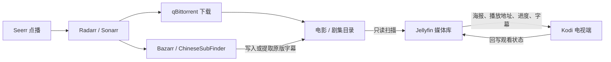
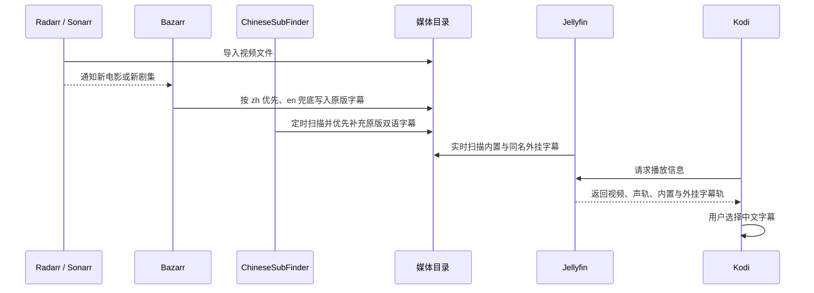

> **本系列共三篇**：[第一篇](/life/2026/06/17/raspberry-pi-docker-radarr-jackett-qbittorrent-bazarr/)搭建自动下载与字幕管线；[第二篇](/life/2026/07/20/raspberry-pi-homelab-mediacenter-and-entry/)接入 Jellyfin、Seerr、Sonarr 和统一入口；第三篇（本文）让电视上的 Kodi 使用 Jellyfin 媒体库与服务端字幕。

电视上的 Kodi 已经能够直接读取 Samba 共享目录并播放电影，这种方式看起来足够简单：文件下载完成，Kodi 扫描目录，然后从本地片库里选择影片。随着 Jellyfin 加入家庭影院，同一批文件却出现了两条入口——Kodi 仍在直接读文件，Jellyfin 也在扫描媒体库，两边的海报、播放记录和字幕互不相干。

解决这个分裂不需要放弃 Kodi。Kodi 继续负责电视端解码与播放，Jellyfin 则成为统一的媒体库服务端；两者之间通过插件连接，电视便能共享 Jellyfin 的片库、元数据、用户和观看进度，字幕也交回服务器侧的自动化管线管理。

1. Table of Contents, ordered
{:toc}

## 1. Kodi 直读文件与 Jellyfin 客户端是两种架构

Kodi 直接扫描共享目录时，树莓派只提供文件，媒体库能力全部留在电视本机。Jellyfin 架构则把“文件在哪里”和“用户看到了什么”分开：服务端扫描文件、刮削元数据并保存播放状态，电视只负责展示和播放。

| 能力 | Kodi 直读 Samba | Kodi 接入 Jellyfin |
|------|-----------------|---------------------|
| 文件来源 | Kodi 自己访问共享目录 | Jellyfin 扫描服务器媒体目录 |
| 海报与简介 | 保存在电视的 Kodi 数据库 | Jellyfin 统一维护 |
| 观看进度 | 只属于当前 Kodi | 按 Jellyfin 用户跨设备同步 |
| 新内容发现 | Kodi 定期扫描目录 | Jellyfin 扫描后推送统一片库 |
| 字幕入口 | Kodi 本机搜索或读取同目录字幕 | Bazarr 等服务准备字幕，Jellyfin 统一提供 |
| 多台设备 | 每台设备各自维护 | 手机、浏览器和电视共享同一状态 |

接入后的完整职责链如下：



这里最重要的边界是：**Kodi 不再自己建立另一套片库，但仍然使用自身播放器解码文件**。Jellyfin 不是额外套在播放器外面的一层转码器，而是 Kodi 的媒体库与状态来源。

## 2. 当前 Jellyfin 服务与凭据状态

树莓派上的 Jellyfin 已正常运行，电影与剧集目录也已挂载。2026 年 8 月 4 日的现场检查结果如下：

| 项目 | 当前状态 |
|------|----------|
| 服务端名称 | `BonBuZhu` |
| Jellyfin 版本 | `10.11.11` |
| 端口 | `8096` |
| 有线地址 | `192.168.1.7` |
| Wi-Fi 地址 | `192.168.31.219` |
| 当前用户 | 只有一个 `admin` 用户 |
| 电影挂载 | `/share/Movies` → `/data/movies:ro` |
| 剧集挂载 | `/share/Video/Series` → `/data/series:ro` |

局域网设备优先访问 `http://raspberrypi.local:8096`。不支持 mDNS 或解析不稳定时，应选择与电视处于同一网段的地址：电视是 `192.168.1.x` 就使用 `http://192.168.1.7:8096`，电视是 `192.168.31.x` 就使用 `http://192.168.31.219:8096`。IP 可能随 DHCP 变化，长期使用时应在路由器中为树莓派保留固定租约。

Jellyfin 数据库中的密码字段不是明文，而是带随机盐和迭代次数的 PBKDF2-SHA512 哈希。服务端只能验证“输入的密码是否匹配”，无法把哈希反推出原密码。因此目前能够确认用户名是 `admin`，却不能从 Jellyfin 配置或数据库中读出密码。

这套 homelab 已经用 Vaultwarden 管理服务凭据，正确做法是从 Bitwarden 客户端中的 Jellyfin 条目取回密码。若保险库里也没有记录，只能通过 Jellyfin 的“忘记密码”流程重置，而不是继续寻找可读取的配置项。恢复访问后还应创建一个 `tv` 普通用户，只授予电影、剧集和播放权限，避免把管理员账号长期保存在电视上。

## 3. 两种 Kodi 插件承担不同的迁移角色

[Jellyfin 官方 Kodi 指南](https://jellyfin.org/docs/general/clients/kodi/)提供 JellyCon 和 Jellyfin for Kodi 两种插件。二者都能播放 Jellyfin 内容，但对 Kodi 本地数据库的使用方式不同。

| 插件 | 工作方式 | 优点 | 适用阶段 |
|------|----------|------|----------|
| JellyCon | 像普通视频插件一样实时浏览 Jellyfin | 不改写 Kodi 媒体库，可与现有 Samba 片库共存 | 初次接入与过渡 |
| Jellyfin for Kodi | 把 Jellyfin 元数据同步进 Kodi 数据库 | 内容直接出现在 Kodi 首页，体验更像原生片库 | 完成迁移后的长期使用 |

当前 Kodi 已经直接扫描下载文件。如果立即安装 Jellyfin for Kodi，同一部影片可能同时由本地媒体源和 Jellyfin 写入 Kodi 数据库，造成重复条目、元数据冲突或清库困难。**先使用 JellyCon 验证连接和播放，是风险最低的过渡方式。**

## 4. 使用 JellyCon 完成第一次电视接入

电视盒、Android TV 和其他嵌入式设备可以直接在 Kodi 中添加 Jellyfin 官方插件仓库：

1. 打开 **设置 → 文件管理器 → 添加源**。
2. 地址填写 `https://kodi.jellyfin.org`，名称填写 `Jellyfin Repo`。
3. 打开 **设置 → 插件 → 从 ZIP 文件安装**；若 Kodi 提示拦截，先允许“未知来源”。
4. 进入刚添加的 `Jellyfin Repo`，安装 `repository.jellyfin.kodi.zip`。
5. 打开 **从库安装 → Kodi Jellyfin Add-ons → 视频插件**，安装 **JellyCon**。
6. JellyCon 若自动发现 `BonBuZhu`，直接选择；否则手工输入与电视同网段的 Jellyfin 地址。
7. 选择手动登录，首次可用 `admin` 验证连接；创建 `tv` 用户后改用普通账号。
8. 从 **插件 → 视频插件 → JellyCon → Jellyfin Libraries** 进入电影和剧集。

JellyCon 不会删除或覆盖原来的 Kodi 片库。验证期间仍可从 Kodi 原有“电影”入口播放 Samba 文件，同时从 JellyCon 播放同一内容，对比画面、声轨、字幕和进度回写是否正常。常用的 JellyCon 电影库还可以加入 Kodi 收藏夹，支持自定义皮肤的设备也可把它设置成首页菜单或海报组件。

## 5. 树莓派必须尽量保持直接播放

Kodi 的价值不仅是电视界面，也在于它对 MKV、HEVC、DTS 和多字幕轨的解码能力通常比浏览器完整。只要电视端支持源文件，Jellyfin 就能把媒体直接交给 Kodi，树莓派几乎不消耗 CPU。

[Jellyfin 编解码文档](https://jellyfin.org/docs/general/clients/codec-support/)把播放分成三类：

- **Direct Play**：容器、视频、音频和字幕都由客户端直接支持，服务端只传输原文件；
- **Direct Stream**：视频不重新编码，只更换封装或处理音频，服务端负担仍然很低；
- **Transcode**：FFmpeg 实时重新编码视频，树莓派 CPU 很容易被拉满。

电视端应把播放质量设为“原始”或最高档，不要手工限制到 720p、4 Mbps 等低档位。图形字幕可能需要烧录进画面并触发视频转码，外挂 SRT 则更容易直接播放。播放期间可以打开 Jellyfin 管理后台的活动页面，确认状态显示为 Direct Play 或 Direct Stream；一旦出现 Transcoding，应优先检查客户端画质限制、视频编码、音频格式和字幕类型。

## 6. 字幕应该在媒体进入 Jellyfin 前准备好

Jellyfin 能展示字幕，但当前系统中负责“寻找和写入字幕”的组件是 Bazarr 与 ChineseSubFinder。电影和剧集统一使用“原版字幕：中文优先，英文兜底”Profile：优先采用字幕源给出的 `zh`，其中可能本身就是中英双语；没有中文时再用 `en`。Bazarr 的 Custom Post-Processing 已关闭，不再把两份字幕合成为 `.zh+en.srt`。

Jellyfin 对电影和剧集目录使用只读挂载，这能防止播放器误删或修改媒体，却也意味着不应把字幕下载职责重新塞给 Jellyfin 服务端插件。

字幕在进入 Jellyfin 前有三种形态：

| 类型 | 实际位置 | 播放时能否切换 |
|------|----------|----------------|
| 内置字幕 | MKV、MP4 等容器内部的字幕流 | 可以选择和关闭 |
| 外挂字幕 | 视频旁边独立的 `.srt`、`.ass` 等文件 | 可以选择和关闭 |
| 硬字幕 | 已经压进视频画面 | 无法关闭 |

视频自带的十几种多语言字幕属于内置字幕。Bazarr 和 ChineseSubFinder 从网络下载的字幕则属于外挂字幕；即使两种字幕最后出现在同一个播放菜单里，它们的存放方式也没有改变。Bazarr 若通过 Embedded Subtitles 从视频中提取一条内置字幕，提取后的独立文件才会成为外挂字幕，原视频中的字幕流仍然保留。

现场统计显示，媒体库已有 12 个电影视频、20 个外挂字幕，以及 48 个剧集视频、10 个外挂字幕。这个数字不能直接等同于字幕覆盖率，因为 MKV 内部还可能封装中文或英文字幕轨；它至少说明电影侧已经有较多自动下载结果，而剧集侧仍值得继续检查 Bazarr 的缺失字幕队列。

[Jellyfin 的媒体组织规范](https://jellyfin.org/docs/general/server/media/shows/)支持与视频同目录、同主文件名的外挂字幕。例如：

```text
Movie Name (2025).mkv
Movie Name (2025).zh.srt
Movie Name (2025).en.srt

Series Name S01E01.mkv
Series Name S01E01.zh.ass
Series Name S01E01.en.srt
```

文件进入媒体库后的字幕流程如下：



当前 Docker 映射把宿主机 `/share/Movies` 和 `/share/Video/Series` 分别只读挂载到 Jellyfin 的 `/data/movies` 与 `/data/series`。Bazarr 和 ChineseSubFinder 在宿主机媒体目录写入字幕后，Jellyfin 的实时监控会发现新文件；只读权限只限制 Jellyfin 修改文件，不妨碍它扫描和播放。完整的触发、搜索和落盘机制见[第一篇](/life/2026/06/17/raspberry-pi-docker-radarr-jackett-qbittorrent-bazarr/#56-字幕从下载到播放的完整链路)。

当 Kodi 中没有中文字幕时，排查顺序应是：先在 Jellyfin 网页端确认该影片是否列出了中文轨，再检查媒体目录里是否存在同名 `.zh.srt` 或 `.zh.ass`，最后查看 Bazarr 是否把它标记为缺失、限流或搜索失败。继续在 Kodi 里逐片下载只能修复单台电视，无法让手机、浏览器和其他电视共享结果。

## 7. 验证稳定后迁移到 Jellyfin for Kodi

JellyCon 验证通过后，如果希望电影和剧集直接显示在 Kodi 首页，可以进一步迁移到 Jellyfin for Kodi。这个阶段的目标是让 Jellyfin 成为 Kodi 数据库的唯一媒体来源，因此需要先处理旧的 Samba 片库。

迁移顺序如下：

1. 备份 Kodi 的 `userdata` 目录或创建完整配置备份。
2. 在 Kodi 中停止原有 Samba 视频源的自动扫描。
3. 从媒体库移除旧来源并执行“清理媒体库”，确认旧条目已经消失；共享目录本身不会被删除。
4. 从同一个官方仓库安装 **Jellyfin for Kodi**。
5. 登录 Jellyfin，选择需要同步的电影与剧集库。
6. 播放模式选择 **Add-on Mode**，让插件通过 Jellyfin 获取文件，无需为各设备维护 Samba 路径映射。
7. 等待首次同步完成，再检查 Kodi 首页中的电影、剧集和“继续观看”。

只有当 Kodi 能直接访问与服务器完全一致的文件路径，而且愿意维护路径替换规则时，才需要考虑 Native Mode。当前家庭影院已经有稳定的 Jellyfin HTTP 入口，Add-on Mode 更容易维护。

## 8. 一次完整验收应该覆盖整条链路

电视端能够打开海报墙只是第一步，以下检查全部通过后，Kodi 才算真正接入 Jellyfin：

- Kodi 能通过 JellyCon 或 Jellyfin for Kodi 登录普通 `tv` 用户；
- 电影库和剧集库都能显示海报、简介与季集结构；
- 播放一部 H.264 和一部 HEVC 影片，服务端没有发生视频转码；
- 中文、英文和内嵌字幕轨能在 Kodi 播放菜单中切换；
- 播放到中途退出后，Jellyfin 网页端能看到相同进度；
- 换一台设备登录同一用户，可以从原位置继续播放；
- 新下载的影片经 Radarr 或 Sonarr 入库后，无需操作 Kodi 文件源便会出现在 Jellyfin；
- 缺失字幕由 Bazarr 队列处理，而不是回到电视端逐片搜索。

完成这次迁移后，Kodi 与 Jellyfin 不再是两套互不相干的家庭影院。Jellyfin 负责统一保存媒体库和用户状态，Bazarr 等组件负责在服务端补齐字幕，Kodi 则专注于电视端最擅长的解码与播放。这样既保留了 Kodi 的稳定性，也把海报墙、观看进度和字幕从单台电视提升成了整个家庭共享的服务。
