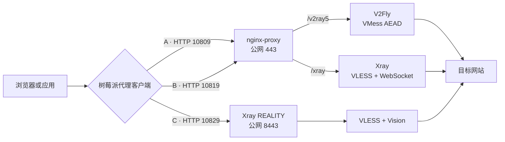
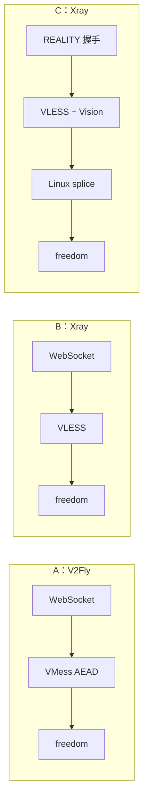
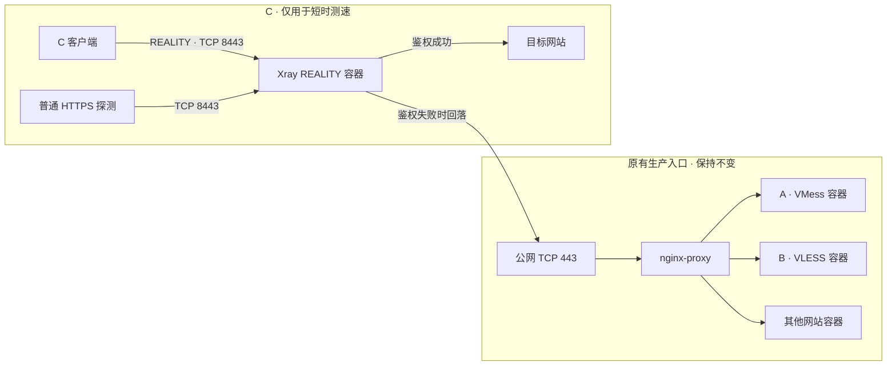
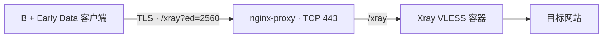
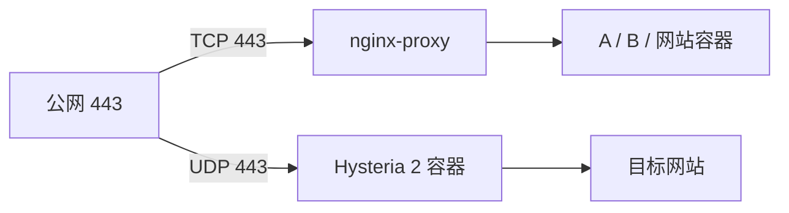

1. Table of Contents, ordered
{:toc}

搬瓦工 VPS 已经升级到 CN2 GIA，但代理速度仍然随时段波动：夜间比较快，白天有时却慢到 Twitter 图片都加载不出来。网上常见的建议是从 V2Ray VMess 换成 Xray，尤其推荐 `VLESS + REALITY + Vision`，甚至有人声称同一台 VPS 可以获得数倍提速。

这次在同一台 VPS 和同一台树莓派上并行准备了三套方案。它们使用相同的网络线路和测速目标，分别记为 A、B、C：

- **A：VMess AEAD + WebSocket + TLS + Nginx**，当前老方案；
- **B：VLESS + WebSocket + TLS + Nginx**，只把 VMess 换成 VLESS；
- **C：VLESS + REALITY + Vision**，完整验证网上推荐的组合。

## 区别：A、B 只换协议，C 连传输方式也换了

三套方案的主要配置如下：

| 对比项 | A：VMess | B：VLESS | C：REALITY + Vision |
|---|---|---|---|
| 服务端内核 | V2Fly 5.49.0 | Xray 26.3.27 | Xray 26.3.27 |
| 代理协议 | VMess AEAD | VLESS | VLESS |
| 传输方式 | WebSocket | WebSocket | RAW/TCP |
| 传输安全 | TLS | TLS | REALITY |
| 入口 | Nginx `443/v2ray5` | Nginx `443/xray` | Xray 直接监听 `8443` |
| 树莓派 HTTP 端口 | `10809` | `10819` | `10829` |
| MUX | 关闭 | 关闭 | 关闭 |

本文的 A 使用 `alterId: 0` 的现代 VMess AEAD，不是更早的 `alterId: 64` 旧版 VMess。

### 整体流量怎么走

A 和 B 共用 Nginx：客户端先连接公网 443，再由 Nginx 根据路径分流。C 不经过 Nginx 的 HTTP 反代，REALITY 握手由 Xray 直接处理。

### 服务内部哪里不同

三套服务最终都通过 `freedom` 出站访问目标网站，区别集中在进入服务端后的处理方式：

A 与 B 的外层完全相同，主要用于观察 **VLESS 协议本身**有没有优势。C 同时换成 REALITY 和 Vision，可以观察网上推荐的完整组合是否更快。

## 理论优化：VLESS 更轻，REALITY 与 Vision 再优化传输

从理论上看，B 和 C 的优化并不相同。

### B 的优化来自 VLESS

[Xray 官方文档](https://xtls.github.io/en/config/outbounds/vless.html)将 VLESS 定义为无状态的轻量协议。它的认证和协议结构比 VMess 简单，而且不依赖客户端与服务端时间同步。

不过，B 仍然使用和 A 相同的 WebSocket、TLS、Nginx 和网络线路。VLESS 减少的只是协议层开销，因此预期提升不会很大。

### C 的优化来自 REALITY 和 Vision

[REALITY](https://xtls.github.io/en/config/transports/reality.html)负责替代普通 TLS，由 Xray 自己处理握手。它不需要为代理入口单独申请证书，并利用目标网站的 TLS 外观进行伪装，主要价值是改善流量外观和抗探测能力。

Vision 则负责识别连接内的 TLS 流量。在满足条件时，Xray 可以进入 Linux `splice` 路径，让内核直接转发数据，减少内存复制和上下文切换。本次调试日志已经出现 `CopyRawConn splice`，确认这个优化实际生效。

这些优化仍然无法解决线路问题。如果白天的瓶颈是上海移动国际出口拥塞、跨境丢包或 VPS 上游容量不足，A、B、C 都可能一起变慢。

### C 目前只适合短时实验

当前公网 443 已由 Nginx 占用，为了让三套方案同时在线，C 临时监听 `8443`。Xray 26.3.27 启动时明确警告：REALITY 使用非 443 端口可能增加 IP 被封锁的风险。

本次 C 没有改造现有网关，而是作为旁路实验容器独立开放端口。通过 REALITY 鉴权的连接进入代理；普通 HTTPS 探测则回落到 `puppylpg.top:443`，最终由原有 Nginx 返回普通网站响应：

因此，C 只在测速期间运行，测试完成后已经停止公网容器并关闭自动重启，配置文件仍然保留。若要让 REALITY 长期占用标准 443，就需要把 Xray 变成所有 HTTPS 流量的前置网关，或者再增加一层四层分流。这两种做法都会破坏当前“Nginx 统一管理入口、后端服务全部容器化接入”的简单模型，所以本次明确不采用 C 作为长期方案。

## 实测数据：夜间接近，白天才拉开差距

三套方案都关闭 MUX，通过同一台树莓派请求同一个 Cloudflare 测速地址。每种文件大小都测试三次，并轮换 A、B、C 的先后顺序，尽量减少线路随时间变化带来的偏差。表中速度统一换算为 Mbps。

1 MiB 小文件包含建立代理连接和 TLS 握手的时间，更接近网页图片等短请求；10 MiB 文件受握手影响较小，更适合观察持续吞吐。这里测试的是同一线路上的相对表现，不是 VPS 的理论带宽上限。

### 夜间：线路宽松时，A 和 B 基本相同

夜间 1 MiB 小文件结果如下：

| 方案 | 第 1 次 | 第 2 次 | 第 3 次 | 平均速度 |
|---|---:|---:|---:|---:|
| A：VMess | 4.68 | 4.67 | 4.64 | **4.66 Mbps** |
| B：VLESS + WebSocket | 4.65 | 4.67 | 4.66 | **4.66 Mbps** |
| C：VLESS + REALITY + Vision | 4.92 | 4.24 | 5.51 | **4.89 Mbps** |

夜间 10 MiB 持续下载结果如下：

| 方案 | 第 1 次 | 第 2 次 | 第 3 次 | 平均速度 |
|---|---:|---:|---:|---:|
| A：VMess | 34.32 | 34.20 | 34.25 | **34.26 Mbps** |
| B：VLESS + WebSocket | 34.51 | 36.34 | 33.82 | **34.89 Mbps** |
| C：VLESS + REALITY + Vision | 39.02 | 38.30 | 39.04 | **38.78 Mbps** |

夜间 B 只比 A 高 **1.8%**，可以视为基本相同；C 比 A 高 **13.2%**，比 B 高 **11.2%**。线路宽松时，单独换成 VLESS 没有明显提速，REALITY + Vision 则带来了约一成的持续吞吐提升。

### 白天：三套方案都变慢，但 A 降得最多

第二次测试在 2026 年 8 月 5 日中午进行。此时 1 MiB 小文件的波动非常明显：

| 方案 | 第 1 次 | 第 2 次 | 第 3 次 | 平均速度 |
|---|---:|---:|---:|---:|
| A：VMess | 1.22 | 0.85 | 0.87 | **0.98 Mbps** |
| B：VLESS + WebSocket | 4.12 | 1.23 | 0.94 | **2.10 Mbps** |
| C：VLESS + REALITY + Vision | 1.12 | 4.72 | 3.87 | **3.24 Mbps** |

白天 10 MiB 持续下载结果如下：

| 方案 | 第 1 次 | 第 2 次 | 第 3 次 | 平均速度 |
|---|---:|---:|---:|---:|
| A：VMess | 12.38 | 6.53 | 18.93 | **12.62 Mbps** |
| B：VLESS + WebSocket | 8.66 | 22.92 | 18.81 | **16.80 Mbps** |
| C：VLESS + REALITY + Vision | 13.04 | 16.65 | 23.72 | **17.80 Mbps** |

以更能反映持续吞吐的 10 MiB 结果计算，B 比 A 高 **33.1%**，C 比 A 高 **41.1%**，但 C 只比 B 高 **6.0%**。白天的数据离散程度很高，三轮测试不足以证明一个长期固定的提升比例；它至少说明，这个时段的 B 和 C 都比 A 表现更好，而 C 相对 B 没有形成超过 10% 的稳定优势。

### 昼夜对照：主要瓶颈仍然在线路

把两次 10 MiB 测试放在一起，三套方案白天都明显变慢：

| 方案 | 夜间平均速度 | 白天平均速度 | 白天降幅 |
|---|---:|---:|---:|
| A：VMess | 34.26 Mbps | 12.62 Mbps | **63.2%** |
| B：VLESS + WebSocket | 34.89 Mbps | 16.80 Mbps | **51.9%** |
| C：VLESS + REALITY + Vision | 38.78 Mbps | 17.80 Mbps | **54.1%** |

三套方案同时大幅下降，说明 **白天变慢的主要原因仍然是共享线路、跨境出口、丢包或上游拥塞，而不是 VMess 本身突然损失了全部性能**。协议和传输方式可以改变拥塞环境下的表现，却不能把一条拥塞线路变成空闲线路。

综合两次测试，可以得到三个结论：

1. **B 是当前最合适的升级。** 它在夜间没有损失，白天持续下载比 A 高约三成，而且完全保留 Docker + Nginx 的维护方式。
2. **C 的性能最好，但架构收益不划算。** 它夜间领先 B 约 11%，白天只领先约 6%，不足以抵消独立端口和网关改造带来的维护成本。
3. **换协议不能根治时段拥塞。** 如果目标是进一步改善白天体验，下一步应该针对丢包、拥塞控制和短请求往返优化，而不是期待协议名称本身带来数倍提速。

因此，C 只保留为实验记录，不作为长期部署方向；B 则可以继续作为现有 Nginx 网关后的主力代理方案。

## 未来展望：优先保留简单架构，再寻找性能增量

后续优化继续遵守一个前提：**Nginx Proxy 保持现有 TCP 入口网关地位，网站和代理服务仍由独立 Docker 容器承载。** 不再为了单个代理协议，把所有 HTTPS 流量迁到 Xray 前面。

在这个前提下，最值得保留的候选有三个：

| 候选方案 | 主要优化目标 | 对现有架构的影响 | 超过 10% 的可能性 | 计划 |
|---|---|---|---|---|
| B + WebSocket Early Data | 首包和短请求延迟 | 极小，只改客户端路径 | 短请求有可能；持续下载不太可能 | **优先尝试** |
| Hysteria 2 + UDP 443 | 丢包、拥塞时的持续吞吐 | 与 Nginx 并行，不改 TCP 443 | 三者中最有希望 | **重点保留** |
| VLESS + XHTTP + TLS | 替代 WebSocket，改善连接方式与流量特征 | 需要升级并定制 Nginx | 不确定，不能保证 | **以后再评估** |

### 方案 D：给 B 增加 WebSocket Early Data

当前 B 的客户端路径是 `/xray`。按照 [Xray WebSocket 文档](https://xtls.github.io/en/config/transports/websocket)，可以在客户端改为 `/xray?ed=2560`，把首包放进 WebSocket 升级请求，从而少等一次数据往返。

这个方案不新增服务端容器，不修改 Nginx，也不影响 A 和普通 B 客户端。它最适合改善 Twitter 图片、GitHub 页面和对话流式输出等短请求体验；对大文件持续下载的帮助预计有限。

### 方案 E：在 UDP 443 并行运行 Hysteria 2

[Hysteria 2](https://v2.hysteria.network/docs/advanced/Full-Server-Config/)使用经过调优的 QUIC 传输，可以选择 BBR 或针对拥塞网络设计的 Brutal 拥塞控制。Brutal 会根据丢包情况补偿发送速率，因此在白天拥塞、存在丢包的链路上，最有希望比 A/B 拉开 10% 以上差距。

当前 Nginx 只占用 **TCP 443**，而 VPS 的 **UDP 443** 空闲。TCP 和 UDP 是两套独立端口空间，因此可以保持下面的并行架构：

Hysteria 2 不在 Nginx HTTP 反代后面，但也不会取代或干扰 Nginx。它只是一个独立的 UDP 旁路容器，停止或升级时不会影响现有网站与 A/B。需要注意的是，QUIC 在用户态运行，比内核 TCP 消耗更多 CPU；实际收益还会受到运营商 UDP 策略、树莓派性能和带宽参数准确性的影响。

### 方案 F：以后再评估 XHTTP

Xray 已经建议 WebSocket 和 gRPC 的新部署转向 XHTTP。XHTTP 可以继续使用 TLS 和 HTTP 路径，也能与 Nginx 配合，从架构方向上最接近 B 的后继方案。

但它不是当前 `VIRTUAL_PATH + proxy_pass` 模型里的即插即用替换。[官方 Nginx 示例](https://github.com/XTLS/Xray-examples/blob/main/VLESS-XHTTP3-Nginx/nginx.conf)需要 HTTP/2/3、专用 location 和 `grpc_pass`；当前服务器仍运行 Nginx 1.23.3。为了保持维护简单，应该等 Nginx Proxy 完成版本升级并固定镜像版本后，再单独搭建 XHTTP 对照组。

gRPC 不再单列为候选。它虽然能够通过 Nginx 和 HTTP/2 转发，但 [Xray 官方文档](https://xtls.github.io/en/config/transports/grpc.html)已经建议迁移到 XHTTP，没有必要再为一个过渡方向增加配置债务。

未来若重新开始测试，顺序应当是：先给 B 开 Early Data，观察短请求；再用 UDP 443 部署 Hysteria 2，重点测白天吞吐和丢包；最后才考虑升级 Nginx 并研究 XHTTP。任何方案都必须通过相同时段、多轮交错测试，而不是根据协议名称预设一定会更快。
