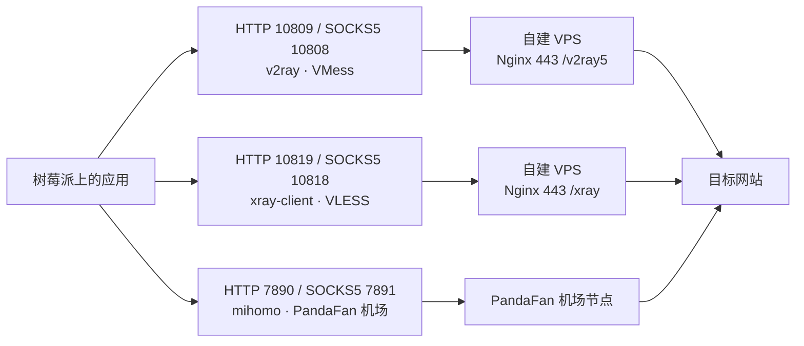

1. Table of Contents, ordered
{:toc}

树莓派上一直跑着两套自建代理：一个 v2ray 容器、一个 xray 容器，分别暴露不同的本地端口。最近又买了一个付费机场 PandaFan，需要在树莓派上再装一套客户端。目标是**三套代理同时在线、各占各的端口**，用哪个就把应用的代理指到哪个端口，互不影响。

## 已有的两套自建代理

先明确现状，后面的端口规划都是围绕它来的：

| 代理 | 内核与协议 | SOCKS5 | HTTP | 运行方式 |
|------|-----------|--------|------|---------|
| v2ray | V2Fly · VMess AEAD + WebSocket + TLS | `127.0.0.1:10808` | `127.0.0.1:10809` | Docker |
| xray-client | Xray · VLESS + WebSocket + TLS | `127.0.0.1:10818` | `127.0.0.1:10819` | Docker |

两套都是连同一台自建 VPS 的本地客户端，区别只在协议。v2ray 是最早的方案，xray-client 是后来协议对比测速中胜出的新主力，搭建和选型过程分别记录在两篇文章里：

- [VPS Docker 全景与 v2ray v4 到 v5 升级实录](/life/2026/06/08/vps-docker-panorama-v2ray-v4-to-v5-upgrade/)：v2ray 方案的服务端与客户端全貌；
- [VMess、VLESS 与 REALITY 对比：架构、理论与昼夜测速](/life/2026/08/05/vmess-vless-docker-nginx-benchmark/)：xray-client（VLESS）方案的诞生过程，以及为什么它成为主力。

PandaFan 要作为第三套加进来，端口上不能和这两套冲突。

## PandaFan 的交付方式：mihomo 客户端 + 订阅配置

PandaFan 在 Linux 上的官方方案不是 v2ray/xray，而是 [mihomo](https://github.com/MetaCubeX/mihomo)（原 Clash Meta）客户端，搭配一条专属订阅配置链接。官方教程只有三步：

1. 运行安装脚本，自动下载 mihomo 二进制、libcronet、GeoIP 数据，并导入订阅配置；
2. `~/.local/bin/mihomo -d ~/.config/mihomo` 启动；
3. 本地出现 HTTP 代理 `7890`、SOCKS5 代理 `7891`。

两个前置条件：系统需要 glibc 环境（树莓派的 Debian 12 自带 glibc 2.36，满足）；脚本自动识别 x64 或 ARM64（树莓派 5 是 aarch64，走 arm64 构建）。

安装命令形如：

```bash
curl -fsSL https://build.dlbun.com/mihomo-naive/install-linux.sh | bash -s -- '<你的订阅配置链接>'
```

> 订阅配置链接包含账号凭证，官方明确提示不要分享给他人，所以这里用占位符代替。下文所有涉及该链接的地方同理。
>

## 安装：先审脚本，再走代理加速

`curl | bash` 之前先把脚本下载下来看一眼是个好习惯。这个脚本做的事情很干净：按架构下载 `mihomo` 和 `libcronet.so` 到 `~/.local/bin/`，下载订阅配置到 `~/.config/mihomo/config.yaml`，再补一个 `geoip.metadb`，最后跑 `mihomo -v` 验证二进制可执行。没有写系统目录，不需要 root。

真正的问题出在速度上：直连下载 43.6MB 的 mihomo 二进制只有约 180KB/s，要四分多钟，后面的 libcronet 也一样慢。好在树莓派上已有代理可用，而脚本内部用的是 curl，天然认 `https_proxy` 环境变量。于是中断直连，带上代理环境变量重跑：

```bash
export https_proxy=http://127.0.0.1:10809 http_proxy=http://127.0.0.1:10809
bash /tmp/mihomo-install.sh '<你的订阅配置链接>'
```

全部下载几秒完成。这也是多代理并存带来的第一个实际收益：**新代理还没装好，老代理已经在为新代理的安装加速**。

## 运行与验证：Rule 模式下怎么测才算数

启动后确认端口和连通性：

```bash
~/.local/bin/mihomo -d ~/.config/mihomo &
ss -tln | grep -E '7890|7891'
```

mihomo 默认是 **Rule 模式**：按规则分流，国内和被判定为直连的站点直接出站，只有命中代理规则的流量才走节点。这带来一个验证上的坑——**不能拿被规则判定为直连的站点测代理通不通**。比如 `api.ipify.org` 在 PandaFan 的规则里走 DIRECT，直连又被运营商拒，curl 直接失败，看起来像是代理没配好，其实是测试方法错了。

正确的做法是换一个明确会走代理的站点，并顺手看一眼日志确认走了哪个节点：

```bash
curl -s -x http://127.0.0.1:7890 -o /dev/null -w 'HTTP %{http_code}, %{time_total}s\n' https://www.google.com
```

日志里出现类似 `match DomainKeyword(google) using Proxy[TW2 台湾_VLESS]` 的记录，说明流量确实经节点出站，配置生效。

## 用 systemd 用户服务托管

官方教程的启动方式是前台命令，进程跟着终端走，重启树莓派后也没了。另外两套自建代理都是 Docker 容器带 `restart` 策略，mihomo 也应该有同等待遇。它装在用户目录、不需要 root，正好用 **systemd 用户服务**托管：

```ini
# ~/.config/systemd/user/mihomo.service
[Unit]
Description=PandaFan mihomo proxy client
After=network-online.target
Wants=network-online.target

[Service]
ExecStart=%h/.local/bin/mihomo -d %h/.config/mihomo
Restart=always
RestartSec=5

[Install]
WantedBy=default.target
```

```bash
systemctl --user daemon-reload
systemctl --user enable --now mihomo.service
loginctl enable-linger pi
```

`enable-linger` 让用户服务在开机时、无人登录的情况下也能启动，这样 mihomo 的可用性就和 Docker 容器对齐了。

这里踩了一个值得记录的坑：如果之前已经手动起过一个 mihomo 进程（比如按教程试运行过一次），再 `enable --now` 启动服务时，新实例会因为 `7890`/`7891`/`9090` 端口被旧进程占用而 **bind 失败**。mihomo 此时不会退出，systemd 显示 `active (running)`，但端口上没有任何监听——状态看起来正常，代理实际是死的。解决办法很简单：杀掉旧进程，`systemctl --user restart mihomo`，然后用 `ss -tlnp` 确认端口真的被监听、再 curl 验证一次。**凡是改完代理配置，都要以端口监听加实际请求为准，不能只看服务状态。**

## 三套代理并存

至此树莓派上有三套代理同时在线，端口两两错开：



| 代理 | SOCKS5 | HTTP | 出口 | 托管方式 |
|------|--------|------|------|---------|
| v2ray（自建，老方案） | `127.0.0.1:10808` | `127.0.0.1:10809` | 自建 VPS | Docker |
| xray-client（自建，主力） | `127.0.0.1:10818` | `127.0.0.1:10819` | 自建 VPS | Docker |
| mihomo（PandaFan 机场） | `127.0.0.1:7891` | `127.0.0.1:7890` | 机场节点 | systemd 用户服务 |

切换代理不需要动任何配置，改应用指向的端口即可。比如临时给某个命令挂 PandaFan：

```bash
https_proxy=http://127.0.0.1:7890 curl https://www.google.com
```

自建的 VPS 线路质量自己可控但只有一个出口；机场节点多、可以换地区，适合作为备用和分流补充。两套体系互为备份，任何一边出问题都不会断网。

## 速度实测：高峰时段的一次快照

三套并存之后，自然想知道它们差多少。测试方法：在同一时间（晚间 23 点前后的网络高峰时段），用同一个目标（`dl.google.com` 上分块下载 20MB）分别走三套代理，轮换先后顺序测 3 轮；短请求延迟用 `www.google.com` 的首字节时间（TTFB）。

| 代理 | 第 1 轮 | 第 2 轮 | 第 3 轮 | google TTFB |
|------|--------|--------|--------|-------------|
| v2ray（VMess） | 0.7 | 0.7 | 0.4 | ~0.9s |
| xray-client（VLESS） | <0.1 | <0.1 | <0.1 | ~0.9s |
| mihomo（PandaFan） | 70.8 | 61.6 | 4.5 | ~0.25s |

下载速度单位为 Mbps。结果有两点值得展开：

**第一，测试目标必须真的走代理。** 最初用 `speed.cloudflare.com` 测，mihomo 日志显示 `match Match using DIRECT`——Cloudflare 被分流规则判成直连，测出来的是树莓派自己的直连速度，和代理无关。换成命中 `DomainKeyword(google)` 规则的 `dl.google.com` 后，日志确认流量走了机场节点（`JP1 日本_HY2`、`HK1 香港_HY2`），数据才有效。**给规则分流的客户端测速，先看日志确认路径，再看数字。**

**第二，mihomo 的节点是自动切换的。** 它的 Auto 分组按延迟自动选节点，日志显示三轮测试横跨了日本和香港两个 Hysteria2 节点，第三轮掉到 4.5 Mbps 就和节点切换有关。所以机场测速的波动部分来自节点漂移，不完全代表单节点水平。

对结果的解读要克制：这只是高峰时段的单晚快照。当晚自建 VPS 线路严重拥塞（VMess 不足 1 Mbps，VLESS 吞吐几乎归零但 TTFB 仍正常，说明客户端没挂、纯粹是线路被压满），机场线路快了近两个数量级。这和之前[昼夜测速](/life/2026/08/05/vmess-vless-docker-nginx-benchmark/)中“自建线路夜间更快”的结论并不矛盾——两个快照合在一起恰好说明，**线路拥塞是随时间波动的，没有哪套代理永远最快**。这正是三套并存的意义：哪套拉胯了，改个端口就有备胎。

## 日常维护

常用命令：

```bash
systemctl --user status mihomo      # 查看状态
systemctl --user restart mihomo     # 重启
journalctl --user -u mihomo -f      # 跟踪日志
```

更新 mihomo、GeoIP 数据和订阅配置的方式是按官方教程**重跑安装命令**（它会覆盖安装），然后重启服务：

```bash
export https_proxy=http://127.0.0.1:10809 http_proxy=http://127.0.0.1:10809
curl -fsSL https://build.dlbun.com/mihomo-naive/install-linux.sh | bash -s -- '<你的订阅配置链接>'
systemctl --user restart mihomo
```

重启后照例确认 `7890`/`7891` 端口被监听，并用 `https://www.google.com` 这类明确走代理的站点验证一次，避免重蹈“服务活着但端口没绑上”的覆辙。
