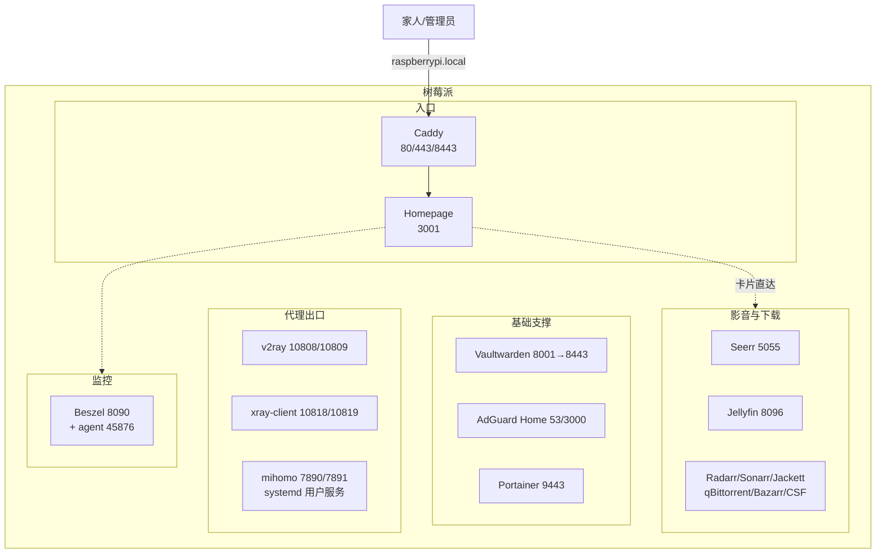

树莓派上的服务是分批装起来的：先搭影音下载管线，再补统一入口，后来又陆续加了代理和监控。每次新增服务都要回忆“这个端口被谁占了”“那个服务是怎么跑的”，是时候用一篇文章把全部在运行的服务登记下来。本文定位为**服务登记表**，只回答“装了什么、在哪访问、怎么跑的”，具体搭建过程引用对应专题文章；影音管线的完整架构不再重复展开。

1. Table of Contents, ordered
{:toc}

## 1. 运行方式总览

除一个例外，所有服务都是 Docker 容器，集中定义在 `~/docker/compose.yml` 一个文件里，统一 `restart: unless-stopped`；改配置前先按 `compose.yml.bak.<时间戳>` 惯例备份。唯一的例外是 mihomo，以 systemd 用户服务运行。

## 2. 影音与下载管线

这一套的搭建和排障记录在系列三篇里，本文只登记服务与端口：

- [第一篇](/life/2026/06/17/raspberry-pi-docker-radarr-jackett-qbittorrent-bazarr/)：Radarr + Jackett + qBittorrent + Bazarr + ChineseSubFinder 自动下载与字幕管线；
- [第二篇](/life/2026/07/20/raspberry-pi-homelab-mediacenter-and-entry/)：接入 Jellyfin、Seerr、Sonarr，以及 Caddy + Homepage 统一入口和 Vaultwarden；
- [第三篇](/life/2026/08/04/raspberry-pi-jellyfin-kodi-tv-guide/)：电视端 Kodi 接入 Jellyfin 与字幕验收。

| 服务 | 端口 | 职责 |
|------|------|------|
| Jellyfin | 8096 | 媒体库与播放 |
| Seerr（原 Jellyseerr） | 5055 | 搜片点播 |
| Radarr | 7878 | 电影管理 |
| Sonarr | 8989 | 剧集管理 |
| Jackett | 9117 | 索引聚合 |
| qBittorrent | 8085（BT 6881） | BT 下载 |
| Bazarr | 6767 | 字幕管理 |
| ChineseSubFinder | 19035 | 中文字幕补充 |

容器名分别为 `jellyfin`、`jellyseerr`、`radarr`、`sonarr`、`jackett`、`qbittorrent`、`bazarr`、`chinesesubfinder`，媒体数据围绕 `/share` 存储交换，路径全链路统一。

## 3. 入口与管理

| 服务 | 端口 | 职责 | 备注 |
|------|------|------|------|
| Caddy | 80/443，8443 | 统一反代 | 443 反代 Homepage，8443 反代 Vaultwarden |
| Homepage | 3001 | 导航首页 | 服务卡片配置在 `~/docker/homepage/config/services.yaml` |
| Vaultwarden | 8001（经 8443 HTTPS 访问） | 密码管理 | 数据目录 `~/docker/vaultwarden/data` 务必纳入备份 |
| Portainer | 9443 | 容器管理 | |

日常使用只需要记住 `https://raspberrypi.local/`。Vaultwarden 的客户端连接依赖 HTTPS，所以单独保留了 8443 入口。

## 4. 网络：DNS 与三套代理

**AdGuard Home**（53/3000）承担局域网 DNS 与去广告，搭建过程见[AdGuard Home 专题](/life/2026/06/05/adguard-home-raspberry-docker-dns-filter/)。家庭网络的整体拓扑见[家庭网络解剖](/life/2026/07/05/anatomy-of-home-network/)。

代理共三套，端口两两错开、互不冲突，给应用挂代理时按出口需求直接选端口：

| 代理 | SOCKS5 | HTTP | 出口 | 托管方式 | 详情文章 |
|------|--------|------|------|---------|---------|
| v2ray（VMess，老方案） | 10808 | 10809 | 自建 VPS | Docker 容器 `v2ray` | [V2Ray v4→v5 升级](/life/2026/06/08/vps-docker-panorama-v2ray-v4-to-v5-upgrade/) |
| xray-client（VLESS，主力） | 10818 | 10819 | 自建 VPS | Docker 容器 `xray-client` | [VMess/VLESS 实测对比](/life/2026/08/05/vmess-vless-docker-nginx-benchmark/) |
| mihomo（PandaFan 机场） | 7891 | 7890 | 机场节点 | systemd 用户服务 | [mihomo 树莓派部署](/life/2026/08/07/pandafan-mihomo-raspberry-pi-proxy/) |

几个容易踩的坑：

- 树莓派下载境外资源慢时，先 `export https_proxy=http://127.0.0.1:10809 http_proxy=http://127.0.0.1:10809` 走自建代理；
- mihomo 是 Rule 分流模式，验证连通性要用 `https://www.google.com` 这类明确走代理的站点，被判定直连的站点测不出来；
- mihomo 维护用 `systemctl --user status|restart mihomo`，配置在 `~/.config/mihomo/`；改完配置以端口监听加实际请求验证为准，不能只看 `active (running)`。

## 5. 监控

2026 年 8 月新增：

| 服务 | 端口 | 职责 | 备注 |
|------|------|------|------|
| Beszel | 8090 | 系统监控面板 | hub 容器 + `beszel-agent`（host 网络，监听 45876） |

Beszel 的 agent 用 host 网络采集宿主机网卡流量，通过 WebSocket 主动连 hub。新版 Beszel 的认证需要三个环境变量：`TOKEN`（hub → Settings → Tokens 创建的 universal token，系统借此自动注册）、`HUB_URL`、`KEY`（hub 自己的公钥，可从 hub 数据目录的 `id_ed25519` 派生）。只配 `KEY` 的老做法在新版会直接认证失败、面板全红。

## 6. 历史服务与停用记录

- **Hermes Agent**（[微信远程触发下载](/life/2026/07/04/hermes-agent-wechat-radarr-remote-download/)）：文章记录的方案，容器已从机器上移除，当前未运行。
- **xray-reality-client**：Reality 协议的实验容器，已停止且不在 `compose.yml` 中，确认无用后可 `docker rm` 清理。

## 7. 新服务上架约定

装新服务时按下面的顺序走，保证这份清单长期有效：

1. 写进 `~/docker/compose.yml`，改前备份；
2. 选端口时对照本文表格避开已占用端口；
3. 有 WebUI 的在 Homepage 的 `services.yaml` 里加分组卡片（配置热加载，无需重启）；
4. 更新本文对应章节的表格。

至此，树莓派上的服务分布是：影音下载管线 8 个容器、入口管理 4 个、网络代理 4 个（含 1 个 systemd 服务）、监控 2 个（Beszel hub + agent），全部由 Homepage 一个页面收口。
