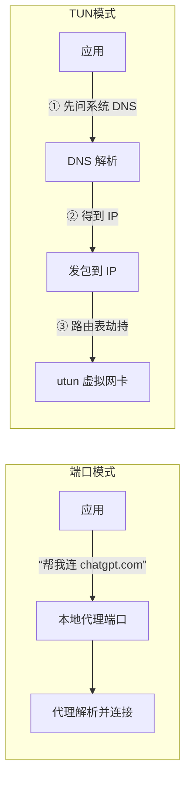
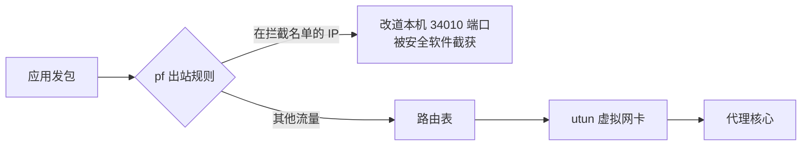

1. Table of Contents, ordered
{:toc}

晚上打开 YouTube，代理客户端明明在运行，页面却一直转圈；断开节点重连想测个速，结果连百度都打不开了。这类"代理玄学"在 Mac 上反复出现，重启软件、重启电脑都只能暂时缓解。

这次把整条链路拆到数据包级别排查了一遍，发现"时好时坏"不是一个问题，而是**四层机制各自埋了一个坑，症状随机叠加**。这篇文章按排查的认知顺序把四层坑讲清楚：先理解一个请求在 Mac 上到底走哪条路，再看每一层为什么会断，最后收拢成一套互不冲突的稳态用法。

## 一个请求在 Mac 上走哪条路

要定位"代理开了却不通"，得先知道代理客户端（Clash/mihomo 系，比如 PandaFan、Clash Verge）通常同时提供两种接管方式，它们的差别不在速度，而在**域名在哪里被解析**。

### 端口模式：把域名交给代理

系统代理（HTTP/SOCKS 端口，比如 `127.0.0.1:10080`）是最常见的方式。应用遵守系统代理设置，把**域名本身**发给本地代理端口，代理由核心在远端完成解析和连接。

这条路上，本机的 DNS 污染完全构不成威胁——应用根本没有在本地解析域名。

### TUN 模式：劫持路由表，但解析仍在本地

TUN 模式创建一张虚拟网卡（utun），并通过一套精巧的路由表切分（`1/2`、`2/7`……`128.0/1` 这种覆盖全部 IPv4 空间却不触碰默认路由的写法）接管整机流量，包括那些不认系统代理的应用。

但 TUN 有一个结构性前提：**应用会先用系统 DNS 把域名解析成 IP，再发包**。TUN 拿到的是"到某个 IP 的包"，域名信息只存在于 DNS 查询那一瞬。



于是问题来了：如果第 ① 步的 DNS 解析被污染，第 ② 步拿到的就是假 IP，TUN 接管得再彻底也只是把包发往一个错的地址。

## TUN 的盲区：macOS 的系统解析器不走隧道

按直觉，TUN 配置里写了 `dns-hijack: any:53`，所有 DNS 查询都应该被劫持到代理核心处理。实测却会发现一个矛盾现象：

- 用 `nslookup` 直接查询被封锁域名，返回 `198.18.x.x`——这是代理核心的 fake-ip，说明 DNS 劫持生效了；
- 用 `dscacheutil`（走 macOS 系统解析器 mDNSResponder）查同一个域名，返回的却是 `104.244.42.197` 这类**明显被 GFW 污染的假答案**（通常是 Twitter、Facebook 的 IP，外加 `2001::1` 这种假 IPv6）。

同一个域名，两条解析路径，两个答案。原因是：**mDNSResponder 发出 DNS 查询时会绑定物理网卡（interface-scoped socket），绕过路由表的 utun 指向**，TUN 的 DNS 劫持根本看不到这些查询。而 `nslookup` 不绑网卡，包按路由表进了 TUN，反而被正常劫持。

更麻烦的是，清 DNS 缓存没有用——`dscacheutil -flushcache` 清掉旧答案后，下一次查询依然是裸奔到运营商 DNS、依然被实时污染。**污染不是缓存里的残留，而是每次查询时现场发生的。**

这就是 TUN 模式下"浏览器直连打不开 YouTube"的根源：系统解析返回污染 IP，其中假 IPv6 地址还恰好不在 TUN 的 IPv6 接管范围内，连接直接黑洞。

## fake-ip：代理核心的应对机制

mihomo 系核心的标准解法叫 fake-ip：核心的 DNS 模块对代理域名一律返回 `198.18.0.0/16` 里的假 IP。应用拿到假 IP 后发包，包被 TUN 捕获，核心**查表把假 IP 还原成域名**，再按分流规则决定走节点还是直连。

这套机制把"解析"和"连接"解耦了：本地解析永远返回安全的假 IP，真正的解析推迟到核心或远端进行，DNS 污染无从下手。

但它成立的前提是**应用的 DNS 查询必须经过核心**。既然 mDNSResponder 绕过 TUN，唯一的彻底办法是把系统 DNS 直接指到核心在本地监听的 DNS 服务（`127.0.0.1`），让查询根本不离开本机：

```bash
# 把 Wi-Fi 的 DNS 指向代理核心的本地 DNS 服务
sudo networksetup -setdnsservers Wi-Fi 127.0.0.1
# 清掉系统 DNS 缓存里的污染答案
sudo dscacheutil -flushcache && sudo killall -HUP mDNSResponder
```

设完之后确实全通了。但接下来每次断开节点、切换节点甚至重启电脑，都会演变成**连百度都打不开的全网瘫痪**。

## 死循环：当代理核心开始“自己问自己”

全网瘫痪的直觉解释是"本地 DNS 服务挂了"，但重启代理软件后它明明是健康的——`nslookup` 直接问 `127.0.0.1` 能拿到正确答案。真正的炸弹埋在核心配置里：

```yaml
dns:
  default-nameserver:
    - system        # ← 问题在这里
    - 119.29.29.29
    - 223.5.5.5
```

`default-nameserver` 的用途之一，是解析**代理节点自己的域名**（比如 `jp1.example.net` 这类节点地址）。`system` 的意思是"去问系统 DNS"。

当系统 DNS 被设为 `127.0.0.1` 后，这条链就闭合了：核心要连接节点 → 需要解析节点域名 → 按配置去问系统 DNS → 系统 DNS 是 `127.0.0.1`，也就是核心自己 → 核心此刻还没连上节点，无法完成解析 → 节点永远连不上。

这个死循环有两个阴险的特性：

- **只在重新解析节点域名时触发。** 节点已连接时一切正常，所以刚设好 DNS 那一刻"能用"；一旦断连、换节点、重启，需要重新解析，立刻锁死。
- **重启电脑无效。** 循环写在配置里，不是运行时状态，重启多少次都一样。

修法很简单：把 `system` 从配置里删掉，只保留写死的国内 DNS，让核心解析节点域名时永不自引用。这也解释了为什么"把 DNS 改回路由器下发就立刻恢复"——`system` 重新指向真实 DNS，循环解除。

## 残留：fake-ip 缓存里的死映射

修完死循环后，"时好时坏"以另一种形态继续：重启代理软件后，之前访问过的网站秒开，新网站全部超时。

这次的元凶是 `store-fake-ip: true`——核心把 fake-ip 映射持久化到 `fakeip-v4.json`，重启后从文件恢复。但恢复出来的映射处于一种半死状态：**DNS 模块照常回答这些旧映射，TUN 通路却不认它们**，连接发过去就是黑洞。

于是出现了极具迷惑性的现象：YouTube 能开（它的映射碰巧被别的流量刷新过），Gemini 打不开（它的旧映射是死的）；清系统 DNS 缓存也没用，因为死的是核心里的映射，不是系统缓存。

验证方法是用一个从未解析过的域名做对照：新域名分到新的 fake-ip，直连秒开——说明 TUN 和 fake-ip 机制本身完好，只有"重启前分配、重启后恢复"的那批映射是死的。修法是彻底停掉核心、删掉 `fakeip-v4.json`、再启动，让全部映射重新分配，同时清一次系统 DNS 缓存（里面也存着旧假 IP）。

## 拦截：出站防火墙比 TUN 更靠前

到这里为止，YouTube、Google、百度都已畅通，但 ChatGPT 和 Gemini 依然超时，而且只在 TUN 直连路径上超时，走端口代理却正常。

把连接过程逐跳观察后发现，发往这两个域名的包**从未到达代理核心**——它们在进入 utun 网卡之前就消失了。劫走它们的是 macOS 的 pf 防火墙里一组规则：

```text
rdr pass inet proto tcp to 198.18.0.5 port = 443 -> 127.0.0.1 port 34010
pass out route-to (lo0 127.0.0.1) inet proto tcp to 198.18.0.5 port 443 ...
```

这台是装了公司终端安全软件的办公机。这类软件通过 pf 在**出站路径**上插了一道关卡：匹配到特定 IP 的 443 流量，先用 `route-to` 强行改道到本机回环，再用 `rdr` 把目标重写到它自己的监听端口。数据包在"即将进入 TUN"之前就被截走了。



这解释了一直以来的一个困惑：TUN 明明劫持了全部流量，为什么偏偏这几个域名的包进不了隧道——**pf 防火墙和 TUN 不在同一层，它更靠前**。

### 它怎么知道哪个假 IP 是 ChatGPT

安全软件并不需要认识 fake-ip，它用的是"记小本本"的方式：

1. 盯着系统里的 DNS 解析事件，记下"域名 → IP"的对应关系。当代理核心的 DNS 回答"chatgpt.com 是 198.18.0.5"时，这条绑定就被它记录了；
2. 给记录下来的 IP 安装 pf 重定向规则；
3. 再不济，TLS 握手里的 SNI 字段本身就是明文域名，嗅探一下即可。

这套"按 IP 定点"的机制碰上 fake-ip 的回收再分配，就会产生随机器式的误伤：某个无害网站分到了它盯过的假 IP，就莫名其妙地被劫走——这也是"时好时坏"的最后一层来源。

需要注意的是，这类规则由安全软件的守护进程持续维护，手动清掉后几十秒内就会重建。它属于公司管控层面，正确的处理是找 IT 确认策略，而不是写脚本跟它对着清。

## 收口：一套互不打架的稳态架构

逐层拆完之后的最终形态，反而比一开始简单：

- **PandaFan 只开端口代理**，系统代理全局生效。浏览器把域名交给代理远端解析，DNS 污染、fake-ip、出站拦截全部不沾边；
- **不认系统代理的应用，启动时强制指定代理**。Chromium 系应用（含内嵌 Codex 的 ChatGPT 桌面版）加 `--proxy-server=http://127.0.0.1:10080` 启动参数即可，做一个带参数的启动器 App 双击使用；
- **TUN 保持关闭**。它兜底的场景由上面的启动参数覆盖，开着反而引入 fake-ip 这一整层的复杂度；
- **公司 VPN（AnyConnect）用自己的隧道接管内网网段**，与端口代理各走各的，互不冲突；
- **DNS 交还 DHCP 下发**，家里、公司、VPN 切换全自动，不再有"代理一关全网断"的脆弱性。

几条逃生通道留档：

```bash
# 代理软件异常时，把 DNS 还原为路由器下发（保底）
sudo networksetup -setdnsservers Wi-Fi Empty

# 清系统 DNS 缓存
sudo dscacheutil -flushcache && sudo killall -HUP mDNSResponder

# 查看 pf 里的可疑重定向规则
sudo pfctl -a http-forwarding -s nat
```

## 番外：Gemini 的“不支持所在区域”是另一回事

链路全通之后，Gemini 网页版仍提示“不支持你所在的区域”。这次和网络通路无关，而是 **GeoIP 数据库打架**：

- 查询 ipinfo，机场节点的出口 IP 被判定为香港；
- 查询 ip-api，同一个 IP 被判定为“中国北京，中国移动”；
- 而访问 [Google 服务条款页](https://policies.google.com/terms) 看 Google 自己的判定——**China**。

这家机场的出口 IP 段属于中国移动国际，在不同 GeoIP 数据库里注册信息不一致。Gemini 网页版自 2026 年 3 月起已对香港开放，但 Google 只信自己的数据库，它看到这些 IP 就是“大陆”，而大陆个人账号不在支持范围（仅 Workspace 账号可用）。香港、日本、美国节点测下来判定一致，说明是整个 IP 池的注册问题，换节点无解。

这类问题的通用排查结论是：**检测出口 IP 归属时，要用目标服务自己的判定口径**。对 Google 系服务，`policies.google.com/terms` 页面显示的国家就是它的答案，比任何第三方 IP 库都准。

## 结尾

“代理时好时坏”拆开之后，没有一层是真正玄学的：系统解析器绕过 TUN 导致 DNS 污染，配置里的 `system` 自引用导致断连即瘫痪，fake-ip 持久化缓存导致重启后留死映射，公司安全软件的出站防火墙导致定点拦截。每一层单独看都合理，叠在一起就成了随机故障。

排障上最有用的两个习惯：一是**把"解析"和"连接"拆开测**——`nslookup` 和 `dscacheutil` 各查一次，答案不一致就是 DNS 层的问题；二是**分清"谁在拦"**——路由表、虚拟网卡、pf 防火墙是三个不同的关卡，包消失在哪一层，就去哪一层找规则。
